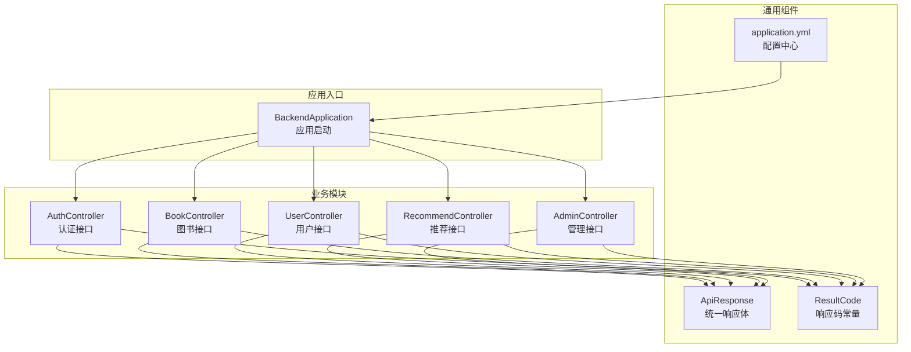
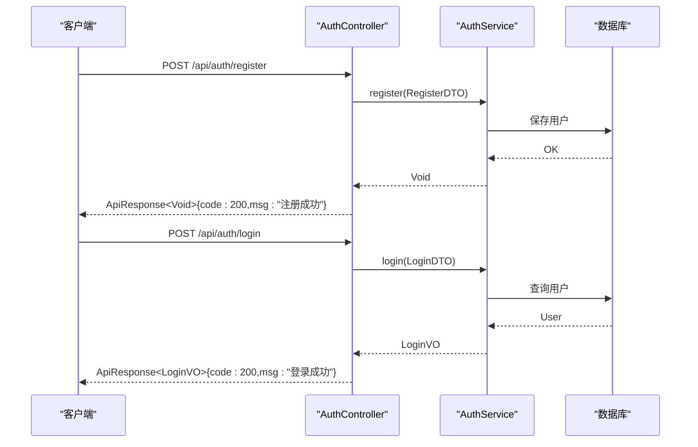
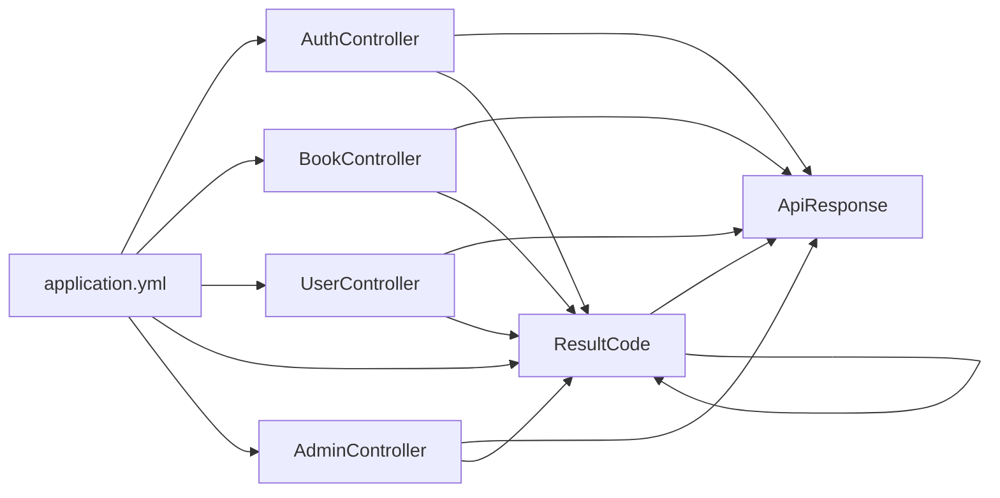

# API接口文档

<cite>
**本文档引用的文件**
- [BackendApplication.java](file://src/main/java/org/example/backend/BackendApplication.java)
- [ApiResponse.java](file://src/main/java/org/example/backend/common/ApiResponse.java)
- [ResultCode.java](file://src/main/java/org/example/backend/common/ResultCode.java)
- [application.yml](file://src/main/resources/application.yml)
- [AuthController.java](file://src/main/java/org/example/backend/modules/auth/controller/AuthController.java)
- [LoginDTO.java](file://src/main/java/org/example/backend/dto/auth/LoginDTO.java)
- [RegisterDTO.java](file://src/main/java/org/example/backend/dto/auth/RegisterDTO.java)
- [LoginVO.java](file://src/main/java/org/example/backend/vo/auth/LoginVO.java)
- [BookController.java](file://src/main/java/org/example/backend/modules/book/controller/BookController.java)
- [UserController.java](file://src/main/java/org/example/backend/modules/user/controller/UserController.java)
- [RecommendController.java](file://src/main/java/org/example/backend/modules/recommend/controller/RecommendController.java)
- [AdminController.java](file://src/main/java/org/example/backend/modules/admin/controller/AdminController.java)
</cite>

## 目录
1. [简介](#简介)
2. [项目结构](#项目结构)
3. [核心组件](#核心组件)
4. [架构总览](#架构总览)
5. [详细组件分析](#详细组件分析)
6. [依赖关系分析](#依赖关系分析)
7. [性能与可用性](#性能与可用性)
8. [故障排查指南](#故障排查指南)
9. [结论](#结论)
10. [附录](#附录)

## 简介
本项目是一个基于Spring Boot的智能图书推荐系统后端，提供认证、图书管理、推荐系统、用户交互、用户管理和管理后台等完整RESTful API。所有接口统一使用JSON响应格式，遵循统一的响应体结构，便于前端集成与调试。

## 项目结构
后端采用模块化分层架构，主要模块包括：
- 认证模块：用户注册、登录
- 图书模块：图书列表、筛选、详情
- 推荐模块：首页推荐、热门榜、主题推荐、相似推荐、曝光与点击、反馈、长尾推荐
- 用户模块：个人信息、借阅历史、收藏、书单、兴趣偏好、浏览记录
- 管理模块：资源管理、用户管理、系统配置、评论管理、推荐策略与黑名单、统计分析、借阅管理、行为日志

**图表来源**
- [BackendApplication.java](file://src/main/java/org/example/backend/BackendApplication.java#L1-L14)
- [ApiResponse.java](file://src/main/java/org/example/backend/common/ApiResponse.java#L1-L89)
- [ResultCode.java](file://src/main/java/org/example/backend/common/ResultCode.java#L1-L44)
- [application.yml](file://src/main/resources/application.yml#L1-L71)
- [AuthController.java](file://src/main/java/org/example/backend/modules/auth/controller/AuthController.java#L1-L41)
- [BookController.java](file://src/main/java/org/example/backend/modules/book/controller/BookController.java#L1-L60)
- [UserController.java](file://src/main/java/org/example/backend/modules/user/controller/UserController.java#L1-L219)
- [RecommendController.java](file://src/main/java/org/example/backend/modules/recommend/controller/RecommendController.java#L1-L130)
- [AdminController.java](file://src/main/java/org/example/backend/modules/admin/controller/AdminController.java#L1-L314)

**章节来源**
- [BackendApplication.java](file://src/main/java/org/example/backend/BackendApplication.java#L1-L14)
- [application.yml](file://src/main/resources/application.yml#L1-L71)

## 核心组件
- 统一响应体：所有接口返回统一的JSON结构，包含状态码、消息与数据体，便于前端处理与错误提示。
- 响应码常量：定义标准HTTP语义与业务错误码，确保前后端一致。
- 配置中心：集中管理数据库、Redis、JWT、Swagger等配置项。

**章节来源**
- [ApiResponse.java](file://src/main/java/org/example/backend/common/ApiResponse.java#L1-L89)
- [ResultCode.java](file://src/main/java/org/example/backend/common/ResultCode.java#L1-L44)
- [application.yml](file://src/main/resources/application.yml#L1-L71)

## 架构总览
系统采用RESTful风格，接口通过统一前缀进行分组，认证通过JWT实现，管理端接口具备角色校验。Swagger用于在线文档生成与调试。

**图表来源**
- [AuthController.java](file://src/main/java/org/example/backend/modules/auth/controller/AuthController.java#L26-L38)
- [LoginDTO.java](file://src/main/java/org/example/backend/dto/auth/LoginDTO.java#L1-L20)
- [RegisterDTO.java](file://src/main/java/org/example/backend/dto/auth/RegisterDTO.java#L1-L30)
- [LoginVO.java](file://src/main/java/org/example/backend/vo/auth/LoginVO.java#L1-L32)

## 详细组件分析

### 认证管理接口
- 前缀：/api/auth
- 功能：用户注册、用户登录
- 认证方式：JWT（登录成功后返回token）

接口定义
- POST /api/auth/register
  - 请求体：RegisterDTO
    - username：字符串，必填，长度3-20
    - email：字符串，必填，邮箱格式
    - password：字符串，必填，长度>=6
    - nickname：字符串，可选
  - 返回：ApiResponse<Void>
  - 示例响应：{"code":200,"msg":"注册成功","data":null}

- POST /api/auth/login
  - 请求体：LoginDTO
    - username：字符串，用户名或邮箱
    - password：字符串，密码
  - 返回：ApiResponse<LoginVO>
  - 示例响应：{"code":200,"msg":"登录成功","data":{"token":"...","userId":1,"username":"john","role":"USER"}}

**章节来源**
- [AuthController.java](file://src/main/java/org/example/backend/modules/auth/controller/AuthController.java#L26-L38)
- [LoginDTO.java](file://src/main/java/org/example/backend/dto/auth/LoginDTO.java#L1-L20)
- [RegisterDTO.java](file://src/main/java/org/example/backend/dto/auth/RegisterDTO.java#L1-L30)
- [LoginVO.java](file://src/main/java/org/example/backend/vo/auth/LoginVO.java#L1-L32)

### 图书管理接口
- 前缀：/api/books
- 功能：图书列表分页、多条件筛选、图书详情

接口定义
- GET /api/books/list
  - 查询参数：page（默认1）、size（默认10）
  - 返回：ApiResponse<PageResult<BookVO>>
  - 示例响应：{"code":200,"msg":"操作成功","data":{"records":[],"total":0,"page":1,"size":10}}

- GET /api/books/filter
  - 查询参数：keyword、topic、author、publisher、minRating、sortBy（默认createTime）、status、page（默认1）、size（默认10）
  - 返回：ApiResponse<PageResult<BookVO>>

- GET /api/books/detail/{bookId}
  - 路径参数：bookId
  - 返回：ApiResponse<BookDetailVO>

**章节来源**
- [BookController.java](file://src/main/java/org/example/backend/modules/book/controller/BookController.java#L25-L57)

### 推荐系统接口
- 前缀：/api/recommend
- 功能：首页推荐、新书抢先看、热门榜、主题漫游、相似图书、阅读此书的用户也读、曝光与点击、反馈、热门主题、长尾推荐

接口定义
- GET /api/recommend/home
  - 查询参数：personalizationWeight（默认0.7）、diversityWeight（默认0.3）
  - 返回：ApiResponse<List<RecommendBookVO>>

- GET /api/recommend/new
  - 查询参数：limit（默认10）
  - 返回：ApiResponse<List<BookVO>>

- GET /api/recommend/hot
  - 查询参数：limit（默认10）
  - 返回：ApiResponse<List<BookVO>>

- GET /api/recommend/topic
  - 查询参数：topic（必填）、limit（默认10）
  - 返回：ApiResponse<List<BookVO>>

- GET /api/recommend/similar/{bookId}
  - 路径参数：bookId
  - 查询参数：limit（默认5）
  - 返回：ApiResponse<List<RecommendBookVO>>

- GET /api/recommend/user-also-read/{bookId}
  - 路径参数：bookId
  - 查询参数：limit（默认5）
  - 返回：ApiResponse<List<RecommendBookVO>>

- POST /api/recommend/exposure
  - 查询参数：bookId、recommendType、position
  - 返回：ApiResponse<Void>

- POST /api/recommend/click
  - 查询参数：bookId、recommendType、position
  - 返回：ApiResponse<Void>

- POST /api/recommend/feedback
  - 查询参数：bookId、feedbackType、reason（可选）
  - 返回：ApiResponse<Void>

- GET /api/recommend/topics
  - 查询参数：limit（默认10）
  - 返回：ApiResponse<List<TopicVO>>

- GET /api/recommend/long-tail
  - 查询参数：limit（默认10）
  - 返回：ApiResponse<List<RecommendBookVO>>

**章节来源**
- [RecommendController.java](file://src/main/java/org/example/backend/modules/recommend/controller/RecommendController.java#L27-L127)

### 用户交互接口
- 前缀：/api/user
- 功能：个人信息、借阅历史、收藏、书单、兴趣偏好、浏览记录
- 注意：除登录外，其余接口均需携带Authorization头（Bearer Token）

接口定义
- GET /api/user/info
  - 返回：ApiResponse<UserInfoVO>
  - 未登录时返回：{"code":401,"msg":"请先登录","data":null}

- PUT /api/user/info
  - 请求体：UserUpdateDTO
  - 返回：ApiResponse<Void>

- GET /api/user/borrow-history
  - 查询参数：page（默认1）、size（默认10）
  - 返回：ApiResponse<PageResult<BorrowHistoryVO>>

- GET /api/user/favorites
  - 查询参数：page（默认1）、size（默认10）
  - 返回：ApiResponse<PageResult<FavoriteVO>>

- POST /api/user/booklists
  - 请求体：BooklistDTO
  - 返回：ApiResponse<Long>

- PUT /api/user/booklists/{booklistId}
  - 请求体：BooklistDTO
  - 返回：ApiResponse<Void>

- DELETE /api/user/booklists/{booklistId}
  - 返回：ApiResponse<Void>

- GET /api/user/booklists
  - 查询参数：page（默认1）、size（默认10）
  - 返回：ApiResponse<PageResult<BooklistVO>>

- GET /api/user/booklists/{booklistId}
  - 返回：ApiResponse<BooklistVO>

- POST /api/user/booklists/{booklistId}/books/{bookId}
  - 返回：ApiResponse<Void>

- DELETE /api/user/booklists/{booklistId}/books/{bookId}
  - 返回：ApiResponse<Void>

- POST /api/user/preferences
  - 请求体：PreferenceDTO
  - 返回：ApiResponse<Void>

- GET /api/user/preferences
  - 返回：ApiResponse<List<UserPreference>>

- POST /api/user/interest-guide
  - 请求体：InterestGuideDTO
  - 返回：ApiResponse<Void>

- GET /api/user/interest-guide/status
  - 返回：ApiResponse<Boolean>

- POST /api/user/book-views/{bookId}
  - 返回：ApiResponse<Void>

**章节来源**
- [UserController.java](file://src/main/java/org/example/backend/modules/user/controller/UserController.java#L32-L215)

### 管理后台接口
- 前缀：/api/admin
- 功能：资源管理、用户管理、系统配置、评论管理、推荐策略与黑名单、统计分析、借阅管理、行为日志
- 注意：接口需ADMIN角色权限

资源管理
- POST /api/admin/books
  - 请求体：BookDTO
  - 返回：ApiResponse<Void>

- PUT /api/admin/books/{bookId}
  - 请求体：BookDTO
  - 返回：ApiResponse<Void>

- DELETE /api/admin/books/{bookId}
  - 返回：ApiResponse<Void>

- PUT /api/admin/books/{bookId}/status
  - 查询参数：status
  - 返回：ApiResponse<Void>

用户管理
- GET /api/admin/users
  - 查询参数：page（默认1）、size（默认10）、keyword、status
  - 返回：ApiResponse<PageResult<UserVO>>

- PUT /api/admin/users/{userId}/status
  - 查询参数：status
  - 返回：ApiResponse<Void>

- POST /api/admin/users
  - 请求体：Map{username,email,password}
  - 返回：ApiResponse<Void>

- GET /api/admin/users/{userId}/profile
  - 返回：ApiResponse<UserProfileVO>

系统管理
- GET /api/admin/dashboard
  - 返回：ApiResponse<DashboardVO>

- GET /api/admin/system/config
  - 返回：ApiResponse<SystemConfigVO>

- PUT /api/admin/system/config
  - 请求体：SystemConfigVO
  - 返回：ApiResponse<Void>

评论管理
- GET /api/admin/comments
  - 查询参数：page（默认1）、size（默认10）、status、keyword
  - 返回：ApiResponse<PageResult<CommentVO>>

- PUT /api/admin/comments/{commentId}/audit
  - 查询参数：status
  - 返回：ApiResponse<Void>

- DELETE /api/admin/comments/{commentId}
  - 返回：ApiResponse<Void>

推荐策略与黑名单
- GET /api/admin/recommend/strategy
  - 返回：ApiResponse<RecommendStrategyVO>

- PUT /api/admin/recommend/strategy
  - 请求体：RecommendStrategyVO
  - 返回：ApiResponse<Void>

- GET /api/admin/recommend/preview
  - 查询参数：recommendType、limit、personalizationWeight、diversityWeight
  - 返回：ApiResponse<List<RecommendBookVO>>

- GET /api/admin/recommend/blacklist
  - 查询参数：page（默认1）、size（默认10）、recommendType、position、bookId
  - 返回：ApiResponse<PageResult<RecommendBlacklist>>

- POST /api/admin/recommend/blacklist
  - 请求体：BlacklistDTO
  - 返回：ApiResponse<Void>

- DELETE /api/admin/recommend/blacklist/{id}
  - 返回：ApiResponse<Void>

- GET /api/admin/recommend/cold-start
  - 查询参数：page（默认10）、size（默认10）、bookId、isEnabled
  - 返回：ApiResponse<PageResult<BookColdStart>>

- POST /api/admin/recommend/cold-start
  - 请求体：ColdStartDTO
  - 返回：ApiResponse<Void>

- DELETE /api/admin/recommend/cold-start/{id}
  - 返回：ApiResponse<Void>

统计分析
- GET /api/admin/stats/user-growth
  - 查询参数：days
  - 返回：ApiResponse<List<StatPointVO>>

- GET /api/admin/stats/book-rank
  - 查询参数：metric、days、limit
  - 返回：ApiResponse<List<BookRankVO>>

- GET /api/admin/stats/recommend-funnel
  - 查询参数：recommendType、days
  - 返回：ApiResponse<RecommendFunnelVO>>

借阅管理
- GET /api/admin/borrows
  - 查询参数：page（默认1）、size（默认10）、status、auditStatus、keyword
  - 返回：ApiResponse<PageResult<BorrowRecordVO>>

- PUT /api/admin/borrows/{borrowId}/audit
  - 查询参数：auditStatus
  - 返回：ApiResponse<Void>

- PUT /api/admin/borrows/{borrowId}/return
  - 返回：ApiResponse<Void>

- GET /api/admin/borrows/overdue
  - 查询参数：page（默认1）、size（默认10）
  - 返回：ApiResponse<PageResult<BorrowRecordVO>>

行为日志
- GET /api/admin/behaviors
  - 查询参数：page（默认1）、size（默认10）、userId、behaviorType、keyword
  - 返回：ApiResponse<PageResult<UserBehaviorVO>>

**章节来源**
- [AdminController.java](file://src/main/java/org/example/backend/modules/admin/controller/AdminController.java#L35-L311)

## 依赖关系分析
- 统一响应体与响应码：所有控制器均依赖ApiResponse与ResultCode，保证返回格式一致性。
- 配置中心：application.yml集中管理数据库、Redis、JWT、Swagger等配置，便于部署与运维。
- 安全控制：管理端接口通过@PreAuthorize("hasRole('ADMIN')")进行角色校验；用户端接口通过UserContext获取当前用户ID，未登录时返回401。

**图表来源**
- [AuthController.java](file://src/main/java/org/example/backend/modules/auth/controller/AuthController.java#L1-L41)
- [BookController.java](file://src/main/java/org/example/backend/modules/book/controller/BookController.java#L1-L60)
- [UserController.java](file://src/main/java/org/example/backend/modules/user/controller/UserController.java#L1-L219)
- [RecommendController.java](file://src/main/java/org/example/backend/modules/recommend/controller/RecommendController.java#L1-L130)
- [AdminController.java](file://src/main/java/org/example/backend/modules/admin/controller/AdminController.java#L1-L314)
- [ApiResponse.java](file://src/main/java/org/example/backend/common/ApiResponse.java#L1-L89)
- [ResultCode.java](file://src/main/java/org/example/backend/common/ResultCode.java#L1-L44)
- [application.yml](file://src/main/resources/application.yml#L1-L71)

**章节来源**
- [ApiResponse.java](file://src/main/java/org/example/backend/common/ApiResponse.java#L1-L89)
- [ResultCode.java](file://src/main/java/org/example/backend/common/ResultCode.java#L1-L44)
- [application.yml](file://src/main/resources/application.yml#L1-L71)

## 性能与可用性
- 分页查询：图书列表、筛选、用户借阅历史、收藏、书单、评论、用户、借阅记录、行为日志等接口均支持分页参数，建议前端按需加载，避免一次性传输大量数据。
- 缓存策略：可结合Redis缓存热点数据（如热门图书、推荐结果），降低数据库压力。
- 推荐权重：首页推荐支持个性化权重与多样性权重调节，建议根据业务指标动态调整。
- 错误码：统一使用ResultCode中的标准错误码，便于前端统一处理与展示。

[本节为通用指导，无需特定文件来源]

## 故障排查指南
- 未登录访问受保护接口：返回401未授权，需先调用登录接口获取token并在请求头中携带。
- 参数校验失败：返回400参数错误，检查请求体字段是否符合DTO约束。
- 业务异常：返回600业务错误，查看后端日志定位具体原因。
- 服务器内部错误：返回500，检查数据库连接、Redis连接与相关服务状态。

**章节来源**
- [ResultCode.java](file://src/main/java/org/example/backend/common/ResultCode.java#L1-L44)
- [ApiResponse.java](file://src/main/java/org/example/backend/common/ApiResponse.java#L63-L86)
- [application.yml](file://src/main/resources/application.yml#L11-L43)

## 结论
本API文档覆盖了智能图书推荐系统的核心接口，统一的响应体与错误码设计提升了前后端协作效率。通过模块化的接口分组与清晰的权限控制，系统具备良好的扩展性与可维护性。建议在生产环境中结合缓存、限流与监控机制进一步提升性能与稳定性。

[本节为总结，无需特定文件来源]

## 附录

### 统一响应体结构
- 字段说明
  - code：整数，响应码（200表示成功，其他为失败）
  - msg：字符串，响应消息
  - data：任意类型，响应数据（可能为null）

- 示例
  - 成功：{"code":200,"msg":"操作成功","data":{}}
  - 失败：{"code":500,"msg":"服务器错误","data":null}

**章节来源**
- [ApiResponse.java](file://src/main/java/org/example/backend/common/ApiResponse.java#L15-L28)

### 响应码对照表
- 200：成功
- 400：参数错误
- 401：未授权
- 403：禁止访问
- 404：资源不存在
- 500：服务器错误
- 600：业务错误

**章节来源**
- [ResultCode.java](file://src/main/java/org/example/backend/common/ResultCode.java#L8-L41)

### API版本管理与兼容性
- 版本策略：当前接口未显式带版本号，建议在URL中加入/v1、/v2等版本前缀，便于后续演进。
- 向后兼容：新增字段建议保持默认值，避免破坏现有客户端；删除字段建议保留但标记为废弃，并在下个主版本移除。
- 配置迁移：通过application.yml集中管理配置，升级时优先验证数据库与Redis连通性。

**章节来源**
- [application.yml](file://src/main/resources/application.yml#L1-L71)