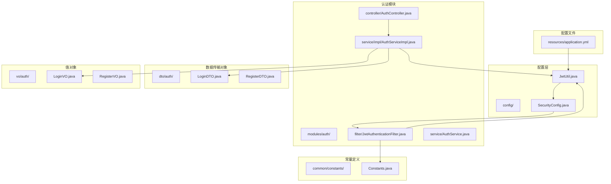
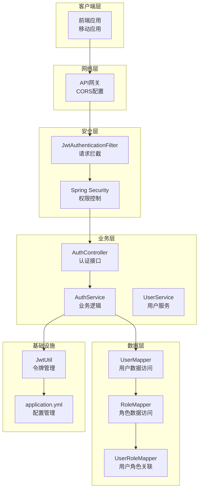
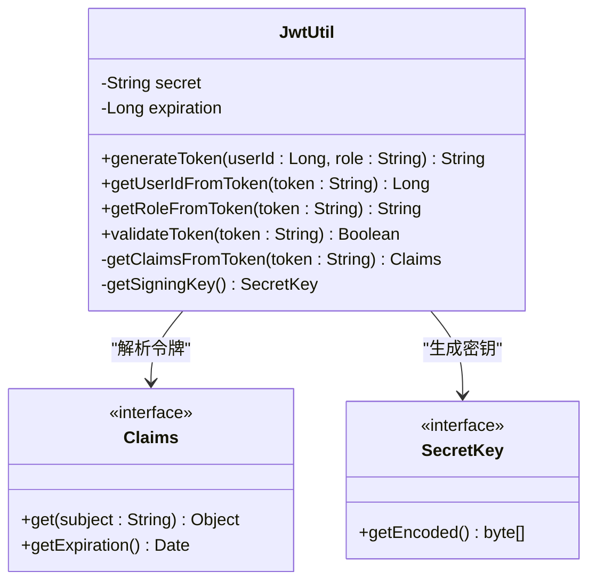
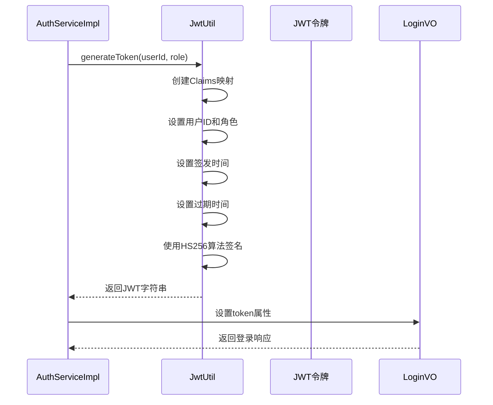
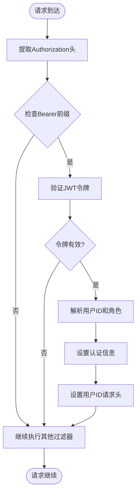
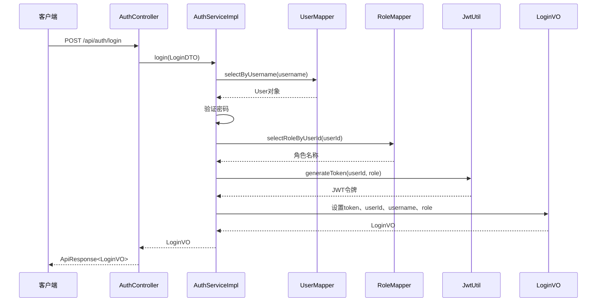
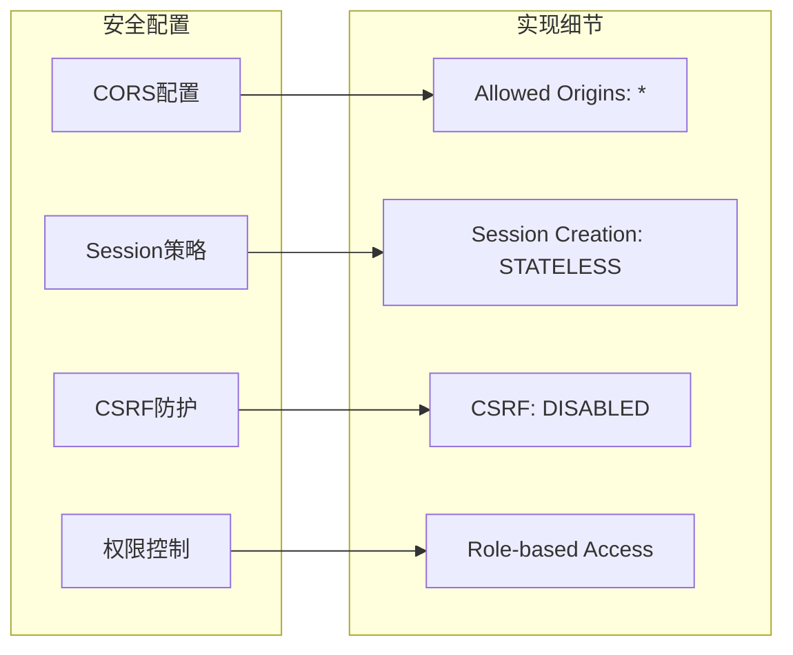
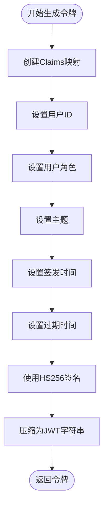
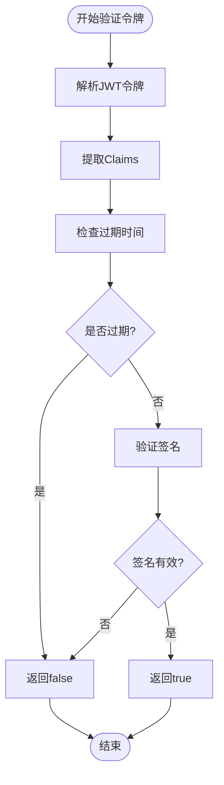
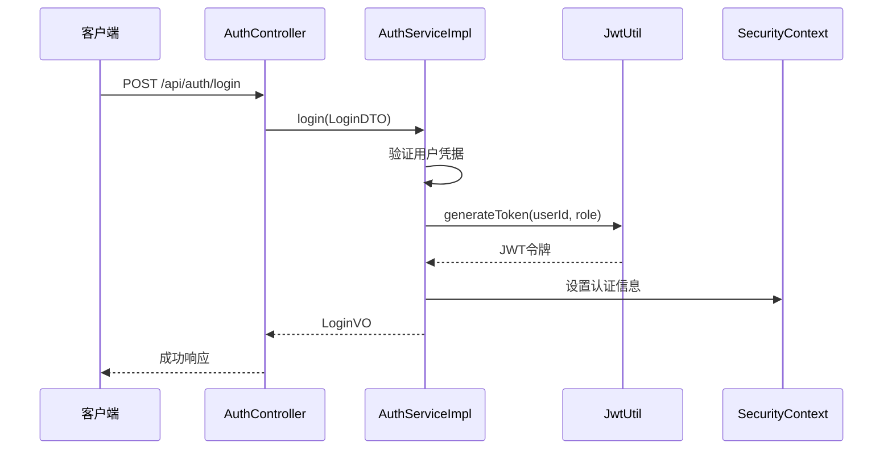

# JWT认证机制

<cite>
**本文档引用的文件**
- [JwtUtil.java](file://src/main/java/org/example/backend/config/JwtUtil.java)
- [JwtAuthenticationFilter.java](file://src/main/java/org/example/backend/modules/auth/filter/JwtAuthenticationFilter.java)
- [SecurityConfig.java](file://src/main/java/org/example/backend/config/SecurityConfig.java)
- [AuthController.java](file://src/main/java/org/example/backend/modules/auth/controller/AuthController.java)
- [AuthServiceImpl.java](file://src/main/java/org/example/backend/modules/auth/service/impl/AuthServiceImpl.java)
- [application.yml](file://src/main/resources/application.yml)
- [Constants.java](file://src/main/java/org/example/backend/common/constants/Constants.java)
- [LoginVO.java](file://src/main/java/org/example/backend/vo/auth/LoginVO.java)
- [LoginDTO.java](file://src/main/java/org/example/backend/dto/auth/LoginDTO.java)
</cite>

## 目录
1. [简介](#简介)
2. [项目结构](#项目结构)
3. [核心组件](#核心组件)
4. [架构概览](#架构概览)
5. [详细组件分析](#详细组件分析)
6. [JWT配置参数](#jwt配置参数)
7. [令牌生成与验证流程](#令牌生成与验证流程)
8. [JWT使用模式与最佳实践](#jwt使用模式与最佳实践)
9. [性能考虑](#性能考虑)
10. [故障排除指南](#故障排除指南)
11. [结论](#结论)

## 简介

本文件详细介绍了智能图书推荐系统的JWT（JSON Web Token）认证机制。该系统采用Spring Security框架结合JWT技术实现无状态的身份验证和授权管理。JWT认证机制通过在客户端和服务器之间传递令牌来实现用户身份验证，避免了服务器端会话存储的需求，提高了系统的可扩展性和性能。

系统中的JWT认证机制主要包括以下关键组件：
- **JwtUtil工具类**：负责JWT令牌的生成、解析、验证和密钥管理
- **JwtAuthenticationFilter过滤器**：拦截HTTP请求，提取和验证JWT令牌
- **SecurityConfig配置**：定义安全策略和过滤器链
- **认证控制器和服务层**：处理用户登录和令牌发放

## 项目结构

智能图书推荐系统的JWT认证相关文件组织结构如下：



**图表来源**
- [JwtUtil.java](file://src/main/java/org/example/backend/config/JwtUtil.java#L1-L92)
- [SecurityConfig.java](file://src/main/java/org/example/backend/config/SecurityConfig.java#L1-L101)
- [JwtAuthenticationFilter.java](file://src/main/java/org/example/backend/modules/auth/filter/JwtAuthenticationFilter.java#L1-L70)

**章节来源**
- [JwtUtil.java](file://src/main/java/org/example/backend/config/JwtUtil.java#L1-L92)
- [SecurityConfig.java](file://src/main/java/org/example/backend/config/SecurityConfig.java#L1-L101)

## 核心组件

智能图书推荐系统的JWT认证机制由以下核心组件构成：

### 1. JwtUtil工具类
负责JWT令牌的完整生命周期管理，包括令牌生成、解析、验证和密钥管理。

### 2. JwtAuthenticationFilter过滤器
实现请求拦截和令牌验证逻辑，将认证信息注入到Spring Security上下文中。

### 3. SecurityConfig配置类
定义Spring Security的安全策略，包括URL权限映射和过滤器链配置。

### 4. 认证服务层
处理用户注册和登录业务逻辑，集成JWT令牌生成和发放。

**章节来源**
- [JwtUtil.java](file://src/main/java/org/example/backend/config/JwtUtil.java#L15-L92)
- [JwtAuthenticationFilter.java](file://src/main/java/org/example/backend/modules/auth/filter/JwtAuthenticationFilter.java#L19-L70)
- [SecurityConfig.java](file://src/main/java/org/example/backend/config/SecurityConfig.java#L24-L101)

## 架构概览

系统采用分层架构设计，JWT认证机制在整个应用架构中的位置如下：



**图表来源**
- [JwtAuthenticationFilter.java](file://src/main/java/org/example/backend/modules/auth/filter/JwtAuthenticationFilter.java#L23-L56)
- [SecurityConfig.java](file://src/main/java/org/example/backend/config/SecurityConfig.java#L46-L81)
- [AuthController.java](file://src/main/java/org/example/backend/modules/auth/controller/AuthController.java#L18-L39)

## 详细组件分析

### JwtUtil工具类分析

JwtUtil是JWT认证机制的核心工具类，提供了完整的令牌管理功能：

#### 类结构图



**图表来源**
- [JwtUtil.java](file://src/main/java/org/example/backend/config/JwtUtil.java#L19-L89)

#### 令牌生成流程



**图表来源**
- [AuthServiceImpl.java](file://src/main/java/org/example/backend/modules/auth/service/impl/AuthServiceImpl.java#L108-L119)
- [JwtUtil.java](file://src/main/java/org/example/backend/config/JwtUtil.java#L30-L42)

#### 关键方法详解

**令牌生成方法** (`generateToken`)
- 接收用户ID和角色作为参数
- 创建包含用户信息的Claims映射
- 设置标准JWT声明：subject、issuedAt、expiration
- 使用HS256算法和对称密钥进行签名
- 返回紧凑格式的JWT字符串

**令牌验证方法** (`validateToken`)
- 解析JWT令牌并提取Claims
- 检查令牌是否过期
- 捕获异常并返回验证结果
- 支持令牌格式错误和过期场景

**章节来源**
- [JwtUtil.java](file://src/main/java/org/example/backend/config/JwtUtil.java#L27-L81)

### JwtAuthenticationFilter过滤器分析

JwtAuthenticationFilter实现了请求拦截和令牌验证的核心逻辑：

#### 过滤器工作流程



**图表来源**
- [JwtAuthenticationFilter.java](file://src/main/java/org/example/backend/modules/auth/filter/JwtAuthenticationFilter.java#L28-L56)

#### 过滤器核心逻辑

**令牌提取方法** (`getTokenFromRequest`)
- 从Authorization请求头中提取令牌
- 验证令牌是否以"Bearer "前缀开头
- 移除前缀后返回纯令牌字符串

**认证设置方法**
- 从JWT中提取用户ID和角色信息
- 创建UsernamePasswordAuthenticationToken
- 设置用户权限（ROLE_USER或ROLE_ADMIN）
- 将认证信息注入到SecurityContextHolder

**章节来源**
- [JwtAuthenticationFilter.java](file://src/main/java/org/example/backend/modules/auth/filter/JwtAuthenticationFilter.java#L28-L67)

### SecurityConfig配置分析

SecurityConfig定义了整个系统的安全策略和过滤器链：

#### URL权限映射

系统根据不同的API路径设置了相应的访问权限：

| URL模式 | 权限要求 | 描述 |
|---------|----------|------|
| `/api/auth/**` | 无需认证 | 注册和登录接口 |
| `/` 和 `/index.html` | 无需认证 | 根路径访问 |
| `/swagger-ui/**` 和 `/v3/api-docs/**` | 无需认证 | 文档接口 |
| `/api/books/list` 和 `/api/books/detail/**` | 无需认证 | 图书列表和详情 |
| `/api/books/search` 和 `/api/books/filter` | 无需认证 | 搜索和筛选接口 |
| `/api/interaction/comments` | 无需认证 | 评论列表（只读） |
| `/api/user/book-views/**` | 无需认证 | 图书浏览埋点 |
| `/api/recommend/**` | 无需认证 | 推荐接口 |
| `/api/admin/**` | ADMIN角色 | 管理员接口 |
| 其他接口 | 已认证用户 | 需要登录 |

**章节来源**
- [SecurityConfig.java](file://src/main/java/org/example/backend/config/SecurityConfig.java#L52-L78)

### 认证服务层分析

认证服务层处理用户注册和登录的完整业务流程：

#### 登录流程



**图表来源**
- [AuthController.java](file://src/main/java/org/example/backend/modules/auth/controller/AuthController.java#L33-L38)
- [AuthServiceImpl.java](file://src/main/java/org/example/backend/modules/auth/service/impl/AuthServiceImpl.java#L80-L119)

**章节来源**
- [AuthServiceImpl.java](file://src/main/java/org/example/backend/modules/auth/service/impl/AuthServiceImpl.java#L80-L119)

## JWT配置参数

系统通过application.yml文件配置JWT相关参数：

### 密钥管理配置

| 参数名 | 默认值 | 说明 | 安全建议 |
|--------|--------|------|----------|
| `jwt.secret` | `your-secret-key-must-be-at-least-256-bits-long-for-HS256-algorithm` | JWT签名密钥 | 必须至少256位，生产环境必须随机生成 |
| `jwt.expiration` | `86400000` (24小时) | 令牌过期时间（毫秒） | 根据业务需求调整，建议不超过7天 |

### 签名算法配置

系统使用HS256（HMAC SHA256）对称加密算法：
- **算法选择**：HS256
- **密钥长度**：至少256位
- **密钥生成**：使用Java SecureRandom生成
- **密钥存储**：配置文件中管理

### 安全策略配置



**图表来源**
- [SecurityConfig.java](file://src/main/java/org/example/backend/config/SecurityConfig.java#L47-L81)
- [application.yml](file://src/main/resources/application.yml#L44-L48)

**章节来源**
- [application.yml](file://src/main/resources/application.yml#L44-L48)
- [SecurityConfig.java](file://src/main/java/org/example/backend/config/SecurityConfig.java#L47-L50)

## 令牌生成与验证流程

### 令牌结构分析

JWT令牌由三部分组成，使用点号分隔：

```
Header.Payload.Signature
```

#### Header部分
包含令牌类型和签名算法信息：
- `typ`: JWT
- `alg`: HS256

#### Payload部分
包含用户身份信息和标准声明：
- `userId`: 用户唯一标识
- `role`: 用户角色（USER/ADMIN）
- `sub`: 主题（用户ID字符串）
- `iat`: 签发时间（Unix时间戳）
- `exp`: 过期时间（Unix时间戳）

#### Signature部分
使用HMAC算法和密钥对Header和Payload进行签名。

### 令牌生成完整流程



**图表来源**
- [JwtUtil.java](file://src/main/java/org/example/backend/config/JwtUtil.java#L30-L42)

### 令牌验证完整流程



**图表来源**
- [JwtUtil.java](file://src/main/java/org/example/backend/config/JwtUtil.java#L74-L81)

**章节来源**
- [JwtUtil.java](file://src/main/java/org/example/backend/config/JwtUtil.java#L30-L81)

## JWT使用模式与最佳实践

### 常见使用模式

#### 1. 请求头携带令牌
客户端在每个受保护的请求中添加Authorization头：
```
Authorization: Bearer <JWT_TOKEN>
```

#### 2. 自动刷新机制
虽然当前实现没有内置刷新令牌功能，但可以采用以下策略：
- 在令牌即将过期时自动刷新
- 使用短期访问令牌和长期刷新令牌组合
- 实现令牌黑名单管理

#### 3. 多设备登录管理
- 为每个设备生成独立的令牌
- 实现令牌撤销功能
- 支持强制登出所有设备

### 安全最佳实践

#### 1. 密钥安全管理
- 使用强随机生成的256位密钥
- 不要在代码中硬编码密钥
- 使用环境变量或密钥管理服务
- 定期轮换密钥

#### 2. 令牌过期策略
- 设置合理的过期时间（建议1-7天）
- 实现短令牌和长令牌策略
- 提供令牌续期机制

#### 3. 错误处理
- 区分不同类型的令牌错误
- 记录安全相关的日志
- 避免泄露敏感信息

#### 4. 性能优化
- 缓存用户权限信息
- 使用异步验证机制
- 优化数据库查询

### 控制器使用示例

#### 登录接口使用JWT



**图表来源**
- [AuthController.java](file://src/main/java/org/example/backend/modules/auth/controller/AuthController.java#L33-L38)
- [AuthServiceImpl.java](file://src/main/java/org/example/backend/modules/auth/service/impl/AuthServiceImpl.java#L108-L119)

**章节来源**
- [AuthController.java](file://src/main/java/org/example/backend/modules/auth/controller/AuthController.java#L33-L38)
- [AuthServiceImpl.java](file://src/main/java/org/example/backend/modules/auth/service/impl/AuthServiceImpl.java#L108-L119)

## 性能考虑

### JWT认证的性能特点

#### 优点
- **无状态**：服务器不需要存储会话信息
- **跨域友好**：支持CORS和多域名部署
- **移动端友好**：适合移动应用和SPA应用
- **水平扩展**：便于集群部署和负载均衡

#### 性能优化建议

1. **令牌缓存**
   - 缓存用户权限信息
   - 减少数据库查询次数
   - 实现本地缓存和分布式缓存

2. **异步处理**
   - 异步验证令牌有效性
   - 使用连接池优化数据库访问
   - 实现令牌预验证机制

3. **内存管理**
   - 合理设置令牌过期时间
   - 及时清理过期令牌
   - 监控内存使用情况

## 故障排除指南

### 常见问题及解决方案

#### 1. 令牌验证失败
**症状**：用户无法访问受保护的API
**可能原因**：
- 令牌格式不正确
- 令牌已过期
- 密钥不匹配
- 令牌被篡改

**解决步骤**：
1. 检查Authorization头格式
2. 验证令牌是否过期
3. 确认密钥配置正确
4. 检查系统时间同步

#### 2. 登录后仍提示未认证
**症状**：用户登录成功但访问API时提示未认证
**可能原因**：
- 前端未正确设置Authorization头
- 令牌未正确传递到后端
- 过滤器配置错误

**解决步骤**：
1. 检查前端请求头设置
2. 验证令牌传递过程
3. 查看安全配置
4. 检查日志输出

#### 3. CORS跨域问题
**症状**：浏览器出现跨域错误
**可能原因**：
- CORS配置不正确
- 预检请求处理不当

**解决步骤**：
1. 检查CORS配置
2. 验证允许的源和方法
3. 确认凭证设置

**章节来源**
- [JwtAuthenticationFilter.java](file://src/main/java/org/example/backend/modules/auth/filter/JwtAuthenticationFilter.java#L32-L56)
- [SecurityConfig.java](file://src/main/java/org/example/backend/config/SecurityConfig.java#L86-L98)

## 结论

智能图书推荐系统的JWT认证机制通过精心设计的架构和实现，提供了安全、高效的身份验证和授权管理。系统的主要优势包括：

### 技术优势
- **无状态设计**：JWT令牌包含完整的用户信息，避免了服务器端会话存储
- **灵活的权限控制**：基于角色的访问控制（RBAC）支持细粒度的权限管理
- **良好的扩展性**：支持水平扩展和微服务架构
- **跨平台兼容**：适用于Web、移动端和桌面应用

### 安全特性
- **强加密算法**：使用HS256对称加密确保令牌安全性
- **配置化管理**：密钥和参数通过配置文件管理
- **完善的错误处理**：区分不同类型的认证错误
- **CORS安全配置**：防止跨域攻击

### 实施建议
1. **生产环境部署**：使用强随机生成的密钥，定期轮换
2. **监控和日志**：建立完整的安全监控和审计日志
3. **性能优化**：根据实际使用情况调整令牌过期时间和缓存策略
4. **安全更新**：定期更新依赖库，修复安全漏洞

该JWT认证机制为智能图书推荐系统提供了坚实的基础，支持系统的持续发展和扩展需求。