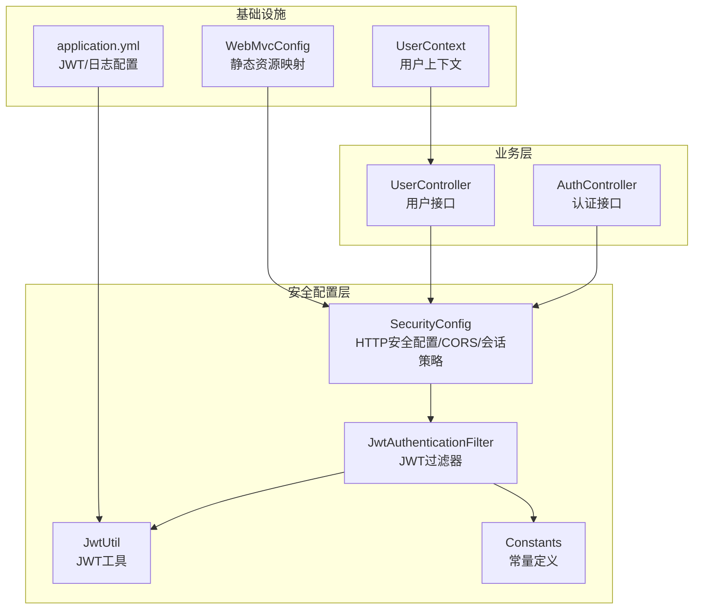
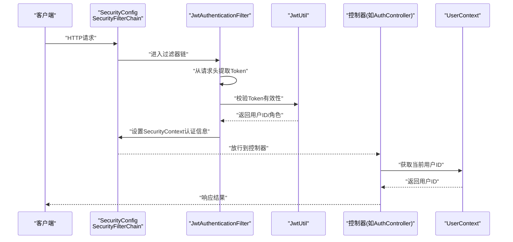
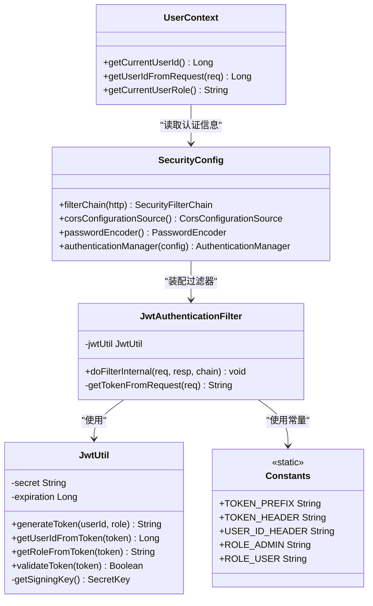
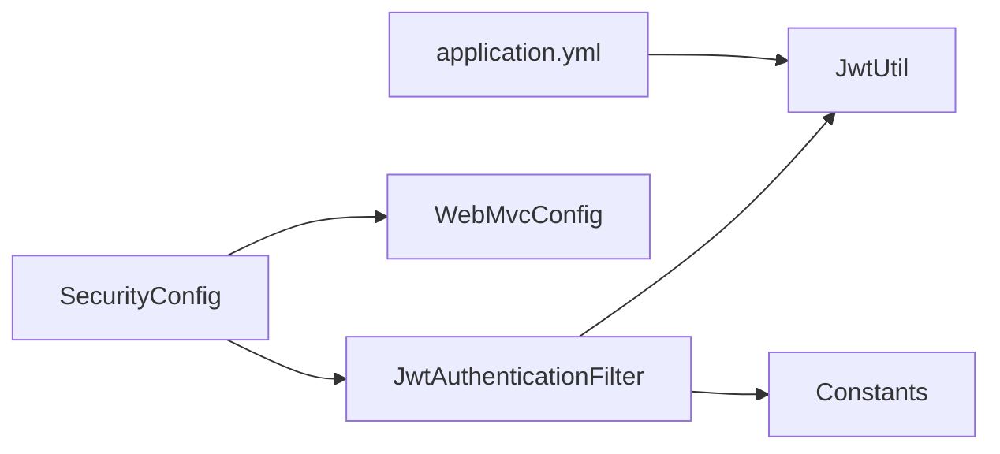

# Spring Security配置

<cite>
**本文引用的文件**
- [SecurityConfig.java](file://src/main/java/org/example/backend/config/SecurityConfig.java)
- [JwtUtil.java](file://src/main/java/org/example/backend/config/JwtUtil.java)
- [JwtAuthenticationFilter.java](file://src/main/java/org/example/backend/modules/auth/filter/JwtAuthenticationFilter.java)
- [Constants.java](file://src/main/java/org/example/backend/common/constants/Constants.java)
- [WebMvcConfig.java](file://src/main/java/org/example/backend/config/WebMvcConfig.java)
- [application.yml](file://src/main/resources/application.yml)
- [AuthController.java](file://src/main/java/org/example/backend/modules/auth/controller/AuthController.java)
- [UserController.java](file://src/main/java/org/example/backend/modules/user/controller/UserController.java)
- [UserContext.java](file://src/main/java/org/example/backend/common/util/UserContext.java)
- [User.java](file://src/main/java/org/example/backend/entity/User.java)
- [Role.java](file://src/main/java/org/example/backend/entity/Role.java)
</cite>

## 目录
1. [简介](#简介)
2. [项目结构](#项目结构)
3. [核心组件](#核心组件)
4. [架构总览](#架构总览)
5. [详细组件分析](#详细组件分析)
6. [依赖关系分析](#依赖关系分析)
7. [性能考虑](#性能考虑)
8. [故障排查指南](#故障排查指南)
9. [结论](#结论)

## 简介
本文件面向智能图书推荐系统的Spring Security安全配置，围绕SecurityConfig类展开，系统性阐述HTTP安全配置、会话管理策略、CSRF防护、URL权限控制规则、CORS跨域配置、密码加密策略以及过滤器链管理与异常处理机制。文档同时给出最佳实践建议与具体配置示例路径，帮助开发者快速理解并正确实施安全策略。

## 项目结构
安全相关代码主要分布在以下模块：
- 安全配置：config/SecurityConfig.java
- JWT工具：config/JwtUtil.java
- JWT认证过滤器：modules/auth/filter/JwtAuthenticationFilter.java
- 常量定义：common/constants/Constants.java
- Web MVC静态资源映射：config/WebMvcConfig.java
- 应用配置：resources/application.yml
- 控制器示例：modules/auth/controller/AuthController.java、modules/user/controller/UserController.java
- 用户上下文工具：common/util/UserContext.java
- 实体模型：entity/User.java、entity/Role.java

图表来源
- [SecurityConfig.java](file://src/main/java/org/example/backend/config/SecurityConfig.java#L46-L81)
- [JwtAuthenticationFilter.java](file://src/main/java/org/example/backend/modules/auth/filter/JwtAuthenticationFilter.java#L22-L56)
- [JwtUtil.java](file://src/main/java/org/example/backend/config/JwtUtil.java#L18-L89)
- [Constants.java](file://src/main/java/org/example/backend/common/constants/Constants.java#L6-L41)
- [WebMvcConfig.java](file://src/main/java/org/example/backend/config/WebMvcConfig.java#L11-L25)
- [application.yml](file://src/main/resources/application.yml#L44-L47)
- [AuthController.java](file://src/main/java/org/example/backend/modules/auth/controller/AuthController.java#L18-L38)
- [UserController.java](file://src/main/java/org/example/backend/modules/user/controller/UserController.java#L24-L215)
- [UserContext.java](file://src/main/java/org/example/backend/common/util/UserContext.java#L12-L47)

章节来源
- [SecurityConfig.java](file://src/main/java/org/example/backend/config/SecurityConfig.java#L27-L81)
- [application.yml](file://src/main/resources/application.yml#L44-L47)

## 核心组件
- 安全配置类：负责HTTP安全策略、URL授权规则、CORS配置、会话策略与过滤器链装配。
- JWT工具类：负责令牌生成、解析、校验与密钥管理。
- JWT认证过滤器：负责从请求中提取令牌、验证有效性并将认证信息写入SecurityContext。
- 常量定义：统一管理令牌前缀、请求头、用户ID传递头等常量。
- Web MVC配置：静态资源映射，确保上传文件可访问。
- 应用配置：JWT密钥与过期时间、Swagger路径、文件上传路径等。

章节来源
- [SecurityConfig.java](file://src/main/java/org/example/backend/config/SecurityConfig.java#L30-L98)
- [JwtUtil.java](file://src/main/java/org/example/backend/config/JwtUtil.java#L18-L89)
- [JwtAuthenticationFilter.java](file://src/main/java/org/example/backend/modules/auth/filter/JwtAuthenticationFilter.java#L22-L67)
- [Constants.java](file://src/main/java/org/example/backend/common/constants/Constants.java#L6-L41)
- [WebMvcConfig.java](file://src/main/java/org/example/backend/config/WebMvcConfig.java#L11-L25)
- [application.yml](file://src/main/resources/application.yml#L44-L47)

## 架构总览
下图展示了从客户端请求到后端处理的关键流程，重点体现JWT认证过滤器如何在Spring Security过滤器链中生效，并将用户身份注入到后续控制器中。

图表来源
- [SecurityConfig.java](file://src/main/java/org/example/backend/config/SecurityConfig.java#L46-L81)
- [JwtAuthenticationFilter.java](file://src/main/java/org/example/backend/modules/auth/filter/JwtAuthenticationFilter.java#L28-L56)
- [JwtUtil.java](file://src/main/java/org/example/backend/config/JwtUtil.java#L30-L81)
- [UserContext.java](file://src/main/java/org/example/backend/common/util/UserContext.java#L17-L23)
- [AuthController.java](file://src/main/java/org/example/backend/modules/auth/controller/AuthController.java#L26-L38)

## 详细组件分析

### HTTP安全配置与会话管理策略
- CSRF防护：显式禁用CSRF，适用于无状态的前后端分离应用。
- 会话管理：采用STATELESS策略，不创建会话，避免服务器端状态存储。
- 过滤器链：在UsernamePasswordAuthenticationFilter之前插入自定义JWT认证过滤器，实现无用户名密码的认证流程。
- URL授权规则：通过authorizeRequests对不同路径进行细粒度授权控制；未匹配到规则的请求默认需要认证。

章节来源
- [SecurityConfig.java](file://src/main/java/org/example/backend/config/SecurityConfig.java#L46-L81)

### URL权限控制规则
- 公开接口：认证相关、Swagger、书籍列表/详情/搜索/筛选、评论列表、图书浏览埋点、推荐接口、静态资源等均无需认证。
- 管理员接口：/api/admin/** 需要ADMIN角色。
- 其他接口：未显式声明的请求均需认证。
- GET评论列表与图书浏览埋点等特殊场景允许匿名访问，便于前端展示与统计。

章节来源
- [SecurityConfig.java](file://src/main/java/org/example/backend/config/SecurityConfig.java#L52-L76)
- [AuthController.java](file://src/main/java/org/example/backend/modules/auth/controller/AuthController.java#L18-L38)
- [UserController.java](file://src/main/java/org/example/backend/modules/user/controller/UserController.java#L24-L215)

### CORS跨域资源共享配置
- 允许源：使用通配符模式，支持任意来源。
- 允许方法：GET、POST、PUT、DELETE、OPTIONS。
- 允许头部：通配符，允许所有自定义头部。
- 凭证：允许携带凭据（如Cookie、Authorization）。
- 缓存时间：预检请求缓存1小时。

章节来源
- [SecurityConfig.java](file://src/main/java/org/example/backend/config/SecurityConfig.java#L86-L98)
- [application.yml](file://src/main/resources/application.yml#L49-L55)

### 密码加密策略与安全存储
- 密码编码器：使用BCryptPasswordEncoder，具备自适应成本参数与盐值随机化，适合生产环境。
- 存储格式：User实体的password字段用于存储BCrypt哈希后的密码。
- 注册/登录流程：AuthService在注册时对明文密码进行编码存储；登录时比对输入密码与数据库中的哈希值。

章节来源
- [SecurityConfig.java](file://src/main/java/org/example/backend/config/SecurityConfig.java#L35-L38)
- [User.java](file://src/main/java/org/example/backend/entity/User.java#L33-L36)

### JWT认证过滤器与用户上下文
- 过滤器职责：从Authorization头提取Bearer Token，调用JwtUtil校验并解析用户ID与角色，构建认证对象写入SecurityContext。
- 用户ID透传：将用户ID写入请求属性，供UserContext与业务逻辑使用。
- 异常处理：Token解析异常时继续放行，交由Spring Security后续逻辑处理。

章节来源
- [JwtAuthenticationFilter.java](file://src/main/java/org/example/backend/modules/auth/filter/JwtAuthenticationFilter.java#L28-L56)
- [JwtUtil.java](file://src/main/java/org/example/backend/config/JwtUtil.java#L30-L81)
- [Constants.java](file://src/main/java/org/example/backend/common/constants/Constants.java#L10-L21)
- [UserContext.java](file://src/main/java/org/example/backend/common/util/UserContext.java#L17-L34)

### 静态资源与文件上传访问
- 静态资源：/uploads/** 路径下的文件通过WebMvcConfig映射到本地文件系统，便于前端直接访问。
- Swagger：Swagger UI与OpenAPI文档路径已开放，便于调试。

章节来源
- [WebMvcConfig.java](file://src/main/java/org/example/backend/config/WebMvcConfig.java#L20-L25)
- [SecurityConfig.java](file://src/main/java/org/example/backend/config/SecurityConfig.java#L57-L62)

### 角色权限管理
- 角色常量：ADMIN、USER等角色常量集中定义于Constants。
- 授权表达式：SecurityConfig启用prePostEnabled，可在方法级别使用@PreAuthorize/@PostAuthorize等注解（若后续扩展）。
- 角色前缀：过滤器中将角色转换为ROLE_ADMIN/ROLE_USER形式写入认证信息。

章节来源
- [Constants.java](file://src/main/java/org/example/backend/common/constants/Constants.java#L35-L41)
- [JwtAuthenticationFilter.java](file://src/main/java/org/example/backend/modules/auth/filter/JwtAuthenticationFilter.java#L43)
- [Role.java](file://src/main/java/org/example/backend/entity/Role.java#L22-L24)

### 类关系图（代码级）

图表来源
- [SecurityConfig.java](file://src/main/java/org/example/backend/config/SecurityConfig.java#L30-L98)
- [JwtAuthenticationFilter.java](file://src/main/java/org/example/backend/modules/auth/filter/JwtAuthenticationFilter.java#L22-L67)
- [JwtUtil.java](file://src/main/java/org/example/backend/config/JwtUtil.java#L18-L89)
- [Constants.java](file://src/main/java/org/example/backend/common/constants/Constants.java#L6-L41)
- [UserContext.java](file://src/main/java/org/example/backend/common/util/UserContext.java#L12-L47)

## 依赖关系分析
- SecurityConfig依赖JwtAuthenticationFilter与JwtUtil，通过@Bean方式暴露认证管理器与密码编码器。
- JwtAuthenticationFilter依赖JwtUtil与Constants，负责从请求中提取并验证令牌。
- WebMvcConfig与SecurityConfig共同保障静态资源与API文档的可访问性。
- application.yml提供JWT密钥与过期时间，影响JwtUtil的行为。

图表来源
- [SecurityConfig.java](file://src/main/java/org/example/backend/config/SecurityConfig.java#L30-L98)
- [JwtAuthenticationFilter.java](file://src/main/java/org/example/backend/modules/auth/filter/JwtAuthenticationFilter.java#L22-L67)
- [JwtUtil.java](file://src/main/java/org/example/backend/config/JwtUtil.java#L18-L89)
- [WebMvcConfig.java](file://src/main/java/org/example/backend/config/WebMvcConfig.java#L11-L25)
- [application.yml](file://src/main/resources/application.yml#L44-L47)

章节来源
- [SecurityConfig.java](file://src/main/java/org/example/backend/config/SecurityConfig.java#L30-L98)
- [application.yml](file://src/main/resources/application.yml#L44-L47)

## 性能考虑
- 无状态设计：STATELESS会话策略降低服务器内存占用，提升横向扩展能力。
- 过滤器链优化：仅在必要处进行令牌解析与校验，避免重复计算。
- CORS缓存：预检请求缓存1小时，减少重复OPTIONS请求。
- 密码编码成本：BCrypt默认成本适中，可根据硬件条件调整（需在PasswordEncoder配置中体现）。

## 故障排查指南
- 登录后仍提示未认证
  - 检查前端是否正确携带Authorization头且以Bearer前缀开头。
  - 确认JwtUtil的密钥与过期时间配置与后端一致。
  - 查看SecurityConfig的URL授权规则是否误放行了该接口。
- 跨域问题
  - 确认CORS配置的允许源、方法、头部与凭证设置满足前端需求。
  - 检查浏览器开发者工具Network面板中的预检请求响应头。
- 静态资源无法访问
  - 确认WebMvcConfig的静态资源映射路径与实际上传路径一致。
  - 检查文件上传目录是否存在且具备读取权限。
- 角色权限不生效
  - 确认用户角色在JWT中正确设置，并在过滤器中转换为ROLE_前缀。
  - 检查SecurityConfig中对应路径的角色要求是否正确。

章节来源
- [JwtAuthenticationFilter.java](file://src/main/java/org/example/backend/modules/auth/filter/JwtAuthenticationFilter.java#L32-L56)
- [SecurityConfig.java](file://src/main/java/org/example/backend/config/SecurityConfig.java#L52-L76)
- [WebMvcConfig.java](file://src/main/java/org/example/backend/config/WebMvcConfig.java#L20-L25)
- [application.yml](file://src/main/resources/application.yml#L44-L47)

## 结论
本安全配置以无状态JWT为核心，结合细粒度URL授权、严格的CORS策略与BCrypt密码编码，构建了适合前后端分离的图书推荐系统安全体系。通过明确的过滤器链装配与常量统一管理，既保证了安全性，也提升了可维护性。建议在生产环境中进一步完善日志审计、令牌刷新机制与更细粒度的方法级权限控制。