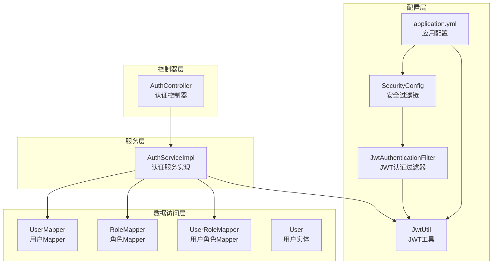
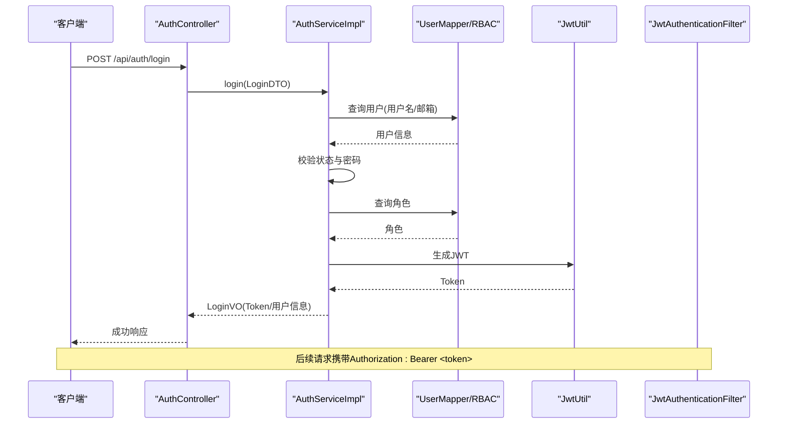
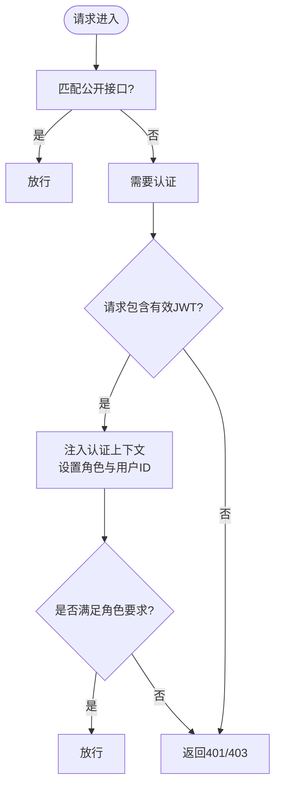
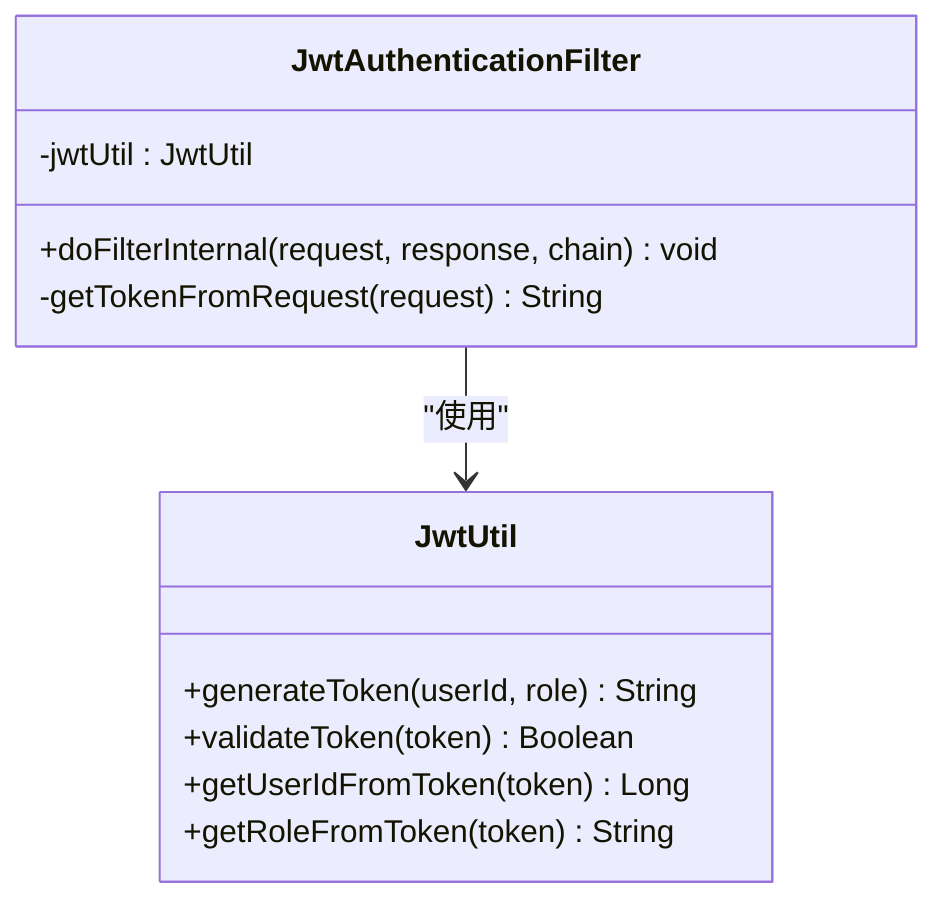
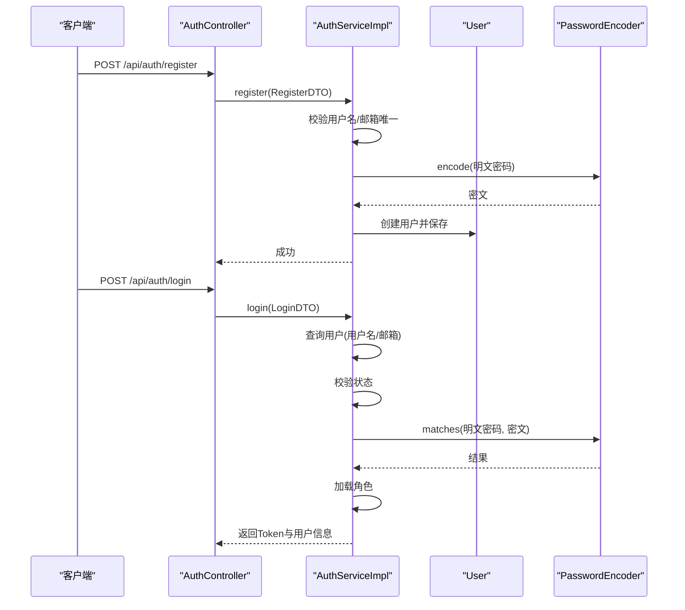
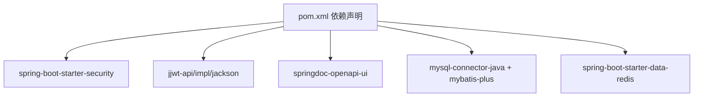

# 安全最佳实践

<cite>
**本文档引用的文件**
- [SecurityConfig.java](file://src/main/java/org/example/backend/config/SecurityConfig.java)
- [JwtUtil.java](file://src/main/java/org/example/backend/config/JwtUtil.java)
- [JwtAuthenticationFilter.java](file://src/main/java/org/example/backend/modules/auth/filter/JwtAuthenticationFilter.java)
- [Constants.java](file://src/main/java/org/example/backend/common/constants/Constants.java)
- [application.yml](file://src/main/resources/application.yml)
- [GlobalExceptionHandler.java](file://src/main/java/org/example/backend/common/exception/GlobalExceptionHandler.java)
- [AuthController.java](file://src/main/java/org/example/backend/modules/auth/controller/AuthController.java)
- [LoginDTO.java](file://src/main/java/org/example/backend/dto/auth/LoginDTO.java)
- [RegisterDTO.java](file://src/main/java/org/example/backend/dto/auth/RegisterDTO.java)
- [AuthServiceImpl.java](file://src/main/java/org/example/backend/modules/auth/service/impl/AuthServiceImpl.java)
- [User.java](file://src/main/java/org/example/backend/entity/User.java)
- [pom.xml](file://pom.xml)
- [data_library126_db.sql](file://src/main/resources/data_library126_db.sql)
</cite>

## 目录
1. [引言](#引言)
2. [项目结构](#项目结构)
3. [核心组件](#核心组件)
4. [架构总览](#架构总览)
5. [详细组件分析](#详细组件分析)
6. [依赖关系分析](#依赖关系分析)
7. [性能考虑](#性能考虑)
8. [故障排除指南](#故障排除指南)
9. [结论](#结论)
10. [附录](#附录)

## 引言
本文件面向智能图书推荐系统的安全最佳实践，基于现有代码库进行深入分析，总结项目采用的安全设计原则与实现策略，并提出可操作的安全开发指南、配置检查清单与定期评估建议。重点覆盖以下方面：
- 安全设计原则：最小权限、纵深防御、零信任
- 密码安全策略：强度要求、哈希算法、轮换机制
- 数据安全保护：传输、存储与静态数据加密
- 日志与审计：访问日志、异常处理与安全事件监控
- 安全开发：代码审查、安全测试与漏洞扫描
- 安全配置检查清单与持续评估

## 项目结构
后端采用Spring Boot + Spring Security + JWT + MyBatis-Plus的典型分层架构：
- 配置层：安全配置、JWT工具、跨域配置
- 控制器层：认证、图书、交互、推荐、用户等模块控制器
- 服务层：认证服务、业务逻辑封装
- 数据访问层：MyBatis-Plus Mapper与实体映射
- 常量与异常：统一常量定义与全局异常处理
- 资源配置：应用配置、数据库初始化脚本

图表来源
- [SecurityConfig.java](file://src/main/java/org/example/backend/config/SecurityConfig.java#L30-L81)
- [JwtUtil.java](file://src/main/java/org/example/backend/config/JwtUtil.java#L18-L92)
- [JwtAuthenticationFilter.java](file://src/main/java/org/example/backend/modules/auth/filter/JwtAuthenticationFilter.java#L22-L68)
- [application.yml](file://src/main/resources/application.yml#L1-L71)
- [AuthController.java](file://src/main/java/org/example/backend/modules/auth/controller/AuthController.java#L18-L41)
- [AuthServiceImpl.java](file://src/main/java/org/example/backend/modules/auth/service/impl/AuthServiceImpl.java#L25-L122)
- [User.java](file://src/main/java/org/example/backend/entity/User.java#L13-L64)

章节来源
- [SecurityConfig.java](file://src/main/java/org/example/backend/config/SecurityConfig.java#L24-L81)
- [application.yml](file://src/main/resources/application.yml#L1-L71)

## 核心组件
- 安全过滤链与认证管理：通过SecurityConfig配置无状态会话、CORS、公开接口与受保护接口；结合JWT认证过滤器实现零信任式逐请求验证。
- JWT工具与过滤器：JwtUtil负责签发与解析令牌，JwtAuthenticationFilter从请求头提取令牌并注入认证上下文。
- 认证服务：AuthServiceImpl完成用户查询、密码校验、角色加载与令牌签发。
- DTO与实体：LoginDTO/ RegisterDTO定义输入约束；User实体承载密码字段（BCrypt存储）。

章节来源
- [SecurityConfig.java](file://src/main/java/org/example/backend/config/SecurityConfig.java#L30-L81)
- [JwtUtil.java](file://src/main/java/org/example/backend/config/JwtUtil.java#L18-L92)
- [JwtAuthenticationFilter.java](file://src/main/java/org/example/backend/modules/auth/filter/JwtAuthenticationFilter.java#L22-L68)
- [AuthServiceImpl.java](file://src/main/java/org/example/backend/modules/auth/service/impl/AuthServiceImpl.java#L25-L122)
- [LoginDTO.java](file://src/main/java/org/example/backend/dto/auth/LoginDTO.java#L10-L20)
- [RegisterDTO.java](file://src/main/java/org/example/backend/dto/auth/RegisterDTO.java#L12-L30)
- [User.java](file://src/main/java/org/example/backend/entity/User.java#L13-L64)

## 架构总览
系统采用“零信任+最小权限”的安全架构：
- 零信任：所有接口默认需要认证，仅对公开接口放行；JWT用于逐请求身份验证与授权。
- 最小权限：基于角色的访问控制（RBAC），管理员接口需ADMIN角色。
- 纵深防御：多层防护（输入校验、参数校验、异常处理、日志审计）。

图表来源
- [AuthController.java](file://src/main/java/org/example/backend/modules/auth/controller/AuthController.java#L26-L38)
- [AuthServiceImpl.java](file://src/main/java/org/example/backend/modules/auth/service/impl/AuthServiceImpl.java#L80-L119)
- [JwtUtil.java](file://src/main/java/org/example/backend/config/JwtUtil.java#L30-L42)
- [JwtAuthenticationFilter.java](file://src/main/java/org/example/backend/modules/auth/filter/JwtAuthenticationFilter.java#L28-L56)

## 详细组件分析

### 安全配置与过滤链（SecurityConfig）
- 无状态会话：禁用会话，确保横向扩展与零信任。
- 公开接口白名单：认证、Swagger、部分只读接口无需认证。
- 受保护接口：其他接口均需认证；管理员接口需ADMIN角色。
- CORS：允许凭证与多种方法/头部，便于前端跨域访问。
- 密码编码器：BCryptPasswordEncoder用于密码存储。

图表来源
- [SecurityConfig.java](file://src/main/java/org/example/backend/config/SecurityConfig.java#L46-L81)
- [JwtAuthenticationFilter.java](file://src/main/java/org/example/backend/modules/auth/filter/JwtAuthenticationFilter.java#L28-L56)
- [Constants.java](file://src/main/java/org/example/backend/common/constants/Constants.java#L6-L79)

章节来源
- [SecurityConfig.java](file://src/main/java/org/example/backend/config/SecurityConfig.java#L30-L98)

### JWT工具与认证过滤器（JwtUtil、JwtAuthenticationFilter）
- JWT签发：包含用户ID与角色，使用HS256签名，默认有效期可配置。
- 过滤器：从Authorization头解析Bearer Token，校验有效性，注入认证信息与用户ID到请求属性。
- 常量：TOKEN_HEADER、TOKEN_PREFIX、USER_ID_HEADER等统一管理。

图表来源
- [JwtUtil.java](file://src/main/java/org/example/backend/config/JwtUtil.java#L18-L92)
- [JwtAuthenticationFilter.java](file://src/main/java/org/example/backend/modules/auth/filter/JwtAuthenticationFilter.java#L22-L68)

章节来源
- [JwtUtil.java](file://src/main/java/org/example/backend/config/JwtUtil.java#L18-L92)
- [JwtAuthenticationFilter.java](file://src/main/java/org/example/backend/modules/auth/filter/JwtAuthenticationFilter.java#L22-L68)
- [Constants.java](file://src/main/java/org/example/backend/common/constants/Constants.java#L6-L22)

### 认证流程与密码安全（AuthController、AuthServiceImpl、DTO、User）
- 输入约束：LoginDTO/ RegisterDTO使用注解保证非空与格式正确性。
- 密码处理：注册时使用BCrypt编码存储；登录时通过PasswordEncoder.matches校验。
- 用户状态：禁用用户不可登录。
- 角色分配：默认分配USER角色，管理员接口需ADMIN角色。

图表来源
- [AuthController.java](file://src/main/java/org/example/backend/modules/auth/controller/AuthController.java#L26-L38)
- [AuthServiceImpl.java](file://src/main/java/org/example/backend/modules/auth/service/impl/AuthServiceImpl.java#L43-L119)
- [RegisterDTO.java](file://src/main/java/org/example/backend/dto/auth/RegisterDTO.java#L12-L30)
- [LoginDTO.java](file://src/main/java/org/example/backend/dto/auth/LoginDTO.java#L10-L20)
- [User.java](file://src/main/java/org/example/backend/entity/User.java#L33-L36)

章节来源
- [AuthController.java](file://src/main/java/org/example/backend/modules/auth/controller/AuthController.java#L18-L41)
- [AuthServiceImpl.java](file://src/main/java/org/example/backend/modules/auth/service/impl/AuthServiceImpl.java#L25-L122)
- [RegisterDTO.java](file://src/main/java/org/example/backend/dto/auth/RegisterDTO.java#L12-L30)
- [LoginDTO.java](file://src/main/java/org/example/backend/dto/auth/LoginDTO.java#L10-L20)
- [User.java](file://src/main/java/org/example/backend/entity/User.java#L33-L36)

### 日志与异常处理（GlobalExceptionHandler）
- 统一异常处理：业务异常、参数校验异常、认证失败、权限不足、其他异常分类处理。
- 日志记录：warn/error级别输出，便于审计与问题定位。
- 响应规范：统一 ApiResponse 包装，避免泄露内部细节。

章节来源
- [GlobalExceptionHandler.java](file://src/main/java/org/example/backend/common/exception/GlobalExceptionHandler.java#L25-L111)

## 依赖关系分析
- 安全框架：Spring Security + Spring Security Test
- JWT：jjwt-api/impl/jackson
- 文档：springdoc-openapi-ui
- 数据库：MySQL + MyBatis-Plus
- 缓存：Redis（可选）

图表来源
- [pom.xml](file://pom.xml#L19-L89)

章节来源
- [pom.xml](file://pom.xml#L19-L115)

## 性能考虑
- 无状态会话：减少服务器端会话存储压力，利于水平扩展。
- JWT短生命周期：配合刷新令牌策略（建议）降低长期令牌风险。
- 参数校验前置：减少无效请求进入业务层，降低数据库与CPU压力。
- 缓存策略：Redis可选配置可用于热点数据缓存，需注意缓存键与过期策略。

## 故障排除指南
- 认证失败：检查Authorization头格式（Bearer）、令牌是否过期、签名密钥是否一致。
- 权限不足：确认用户角色是否正确分配，管理员接口是否具备ADMIN角色。
- 参数校验失败：关注DTO注解提示，确保请求体符合约束。
- 数据库连接：核对application.yml中的数据库URL、用户名与密码。
- 日志级别：适当提高DEBUG级别以辅助排查，生产环境建议回归INFO。

章节来源
- [GlobalExceptionHandler.java](file://src/main/java/org/example/backend/common/exception/GlobalExceptionHandler.java#L33-L108)
- [application.yml](file://src/main/resources/application.yml#L10-L16)

## 结论
本项目在安全设计上体现了零信任与最小权限原则，通过JWT实现无状态认证、BCrypt保障密码存储安全、统一异常处理与日志记录提升可观测性。建议在此基础上进一步完善传输加密、令牌轮换、访问审计与漏洞扫描流程，形成持续改进的安全闭环。

## 附录

### 安全设计原则与实现策略
- 最小权限：仅授予完成任务所需的最低权限；管理员接口强制ADMIN角色。
- 纵深防御：输入校验、参数校验、异常处理、日志审计、安全过滤链多层协同。
- 零信任：所有接口默认需要认证，逐请求验证JWT有效性与角色。

章节来源
- [SecurityConfig.java](file://src/main/java/org/example/backend/config/SecurityConfig.java#L52-L78)
- [JwtAuthenticationFilter.java](file://src/main/java/org/example/backend/modules/auth/filter/JwtAuthenticationFilter.java#L34-L52)

### 密码安全策略
- 强度要求：用户名长度、邮箱格式、密码最小长度等在DTO中约束。
- 哈希算法：使用BCrypt进行密码编码与匹配，数据库字段存储密文。
- 轮换机制：建议引入密码历史与到期策略（当前实现未体现，建议补充）。

章节来源
- [RegisterDTO.java](file://src/main/java/org/example/backend/dto/auth/RegisterDTO.java#L15-L25)
- [LoginDTO.java](file://src/main/java/org/example/backend/dto/auth/LoginDTO.java#L13-L17)
- [AuthServiceImpl.java](file://src/main/java/org/example/backend/modules/auth/service/impl/AuthServiceImpl.java#L97-L100)
- [User.java](file://src/main/java/org/example/backend/entity/User.java#L33-L36)
- [data_library126_db.sql](file://src/main/resources/data_library126_db.sql#L1040-L1045)

### 数据安全保护措施
- 传输安全：建议启用HTTPS（当前未见显式HTTPS配置，建议在部署层强制）。
- 存储安全：数据库凭据在application.yml中明文配置，建议迁移到环境变量或密管系统。
- 静态数据：SQL脚本中包含示例用户数据，生产环境需清理并使用安全初始化流程。

章节来源
- [application.yml](file://src/main/resources/application.yml#L11-L16)
- [data_library126_db.sql](file://src/main/resources/data_library126_db.sql#L1037-L1095)

### 日志安全与审计策略
- 访问日志：建议接入统一网关或反向代理日志，记录请求时间、IP、URI、状态码。
- 异常日志：GlobalExceptionHandler已记录warn/error，建议统一输出到集中式日志系统。
- 安全事件监控：结合日志系统与告警规则，监控异常登录、频繁失败、越权访问等。

章节来源
- [GlobalExceptionHandler.java](file://src/main/java/org/example/backend/common/exception/GlobalExceptionHandler.java#L28-L108)
- [application.yml](file://src/main/resources/application.yml#L63-L71)

### 安全开发指南
- 代码审查要点：输入校验、异常处理、角色判断、敏感信息脱敏、日志脱敏。
- 安全测试方法：单元测试覆盖边界条件；集成测试验证鉴权链路；渗透测试验证常见漏洞。
- 漏洞扫描实践：依赖扫描（OWASP Dependency-Check）、静态分析（SpotBugs/Checkmarx）、动态扫描（OWASP ZAP）。

章节来源
- [pom.xml](file://pom.xml#L104-L114)

### 安全配置检查清单
- 应用配置
  - 是否启用HTTPS（建议在网关/反向代理层强制）
  - 数据库凭据是否使用环境变量或密管
  - JWT密钥是否足够随机且妥善保管
  - CORS配置是否最小化（仅允许必要来源）
- 安全过滤链
  - 是否禁用CSRF（前后端分离场景可接受）
  - 是否开启无状态会话
  - 是否正确配置公开接口与受保护接口
- 认证与授权
  - 是否使用BCrypt存储密码
  - 是否对管理员接口强制ADMIN角色
  - 是否对敏感操作进行二次校验（如二次确认）
- 日志与监控
  - 是否记录必要的审计日志
  - 是否有异常告警与事件监控
- 依赖与版本
  - 是否及时升级Spring Security、JWT、MyBatis-Plus等依赖

章节来源
- [application.yml](file://src/main/resources/application.yml#L1-L71)
- [SecurityConfig.java](file://src/main/java/org/example/backend/config/SecurityConfig.java#L46-L98)
- [JwtUtil.java](file://src/main/java/org/example/backend/config/JwtUtil.java#L21-L25)
- [pom.xml](file://pom.xml#L19-L89)

### 定期安全评估建议
- 月度：依赖漏洞扫描、配置基线检查
- 季度：渗透测试、权限与数据访问评估
- 半年：安全培训与演练、事件复盘
- 年度：全面安全审计与合规检查