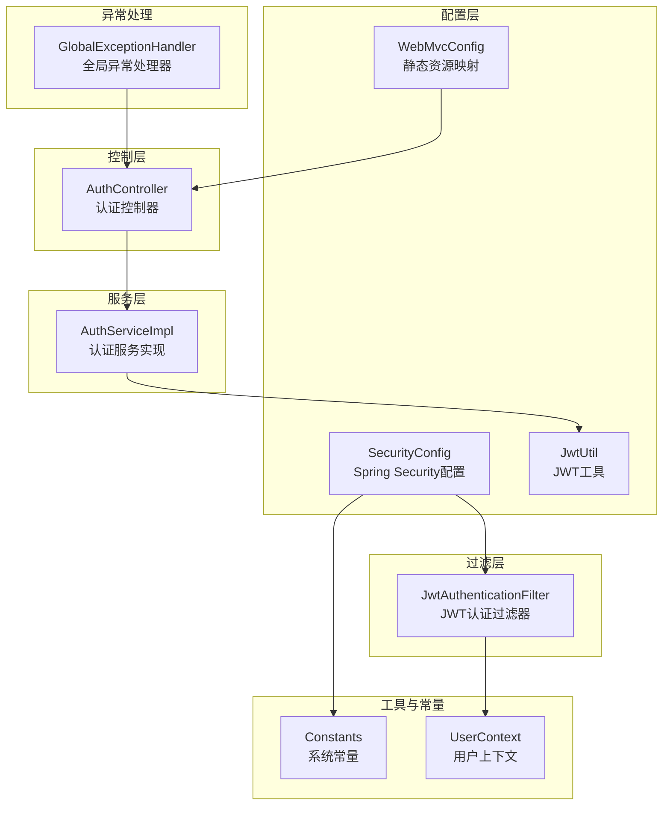
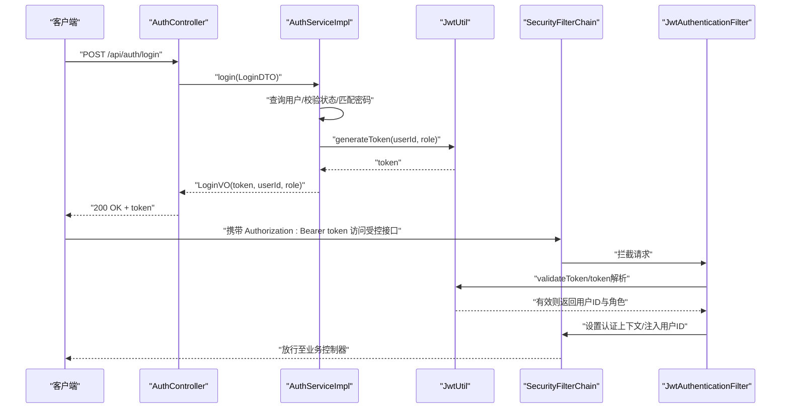
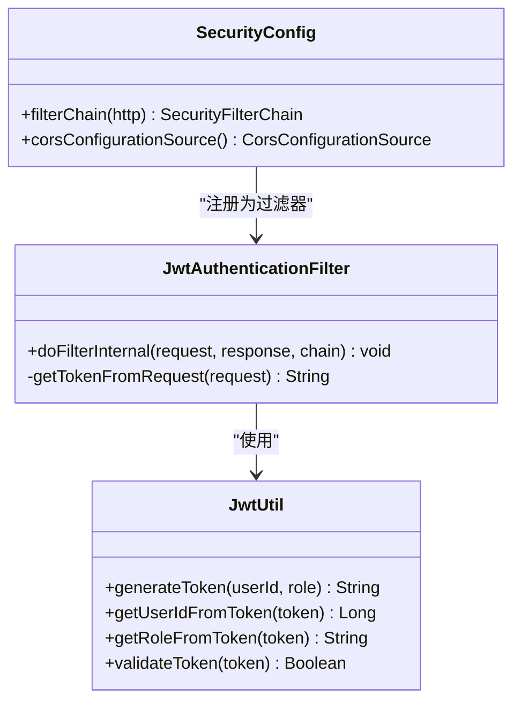
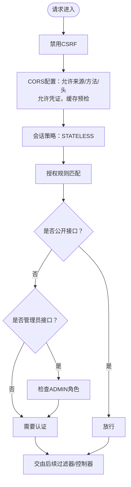
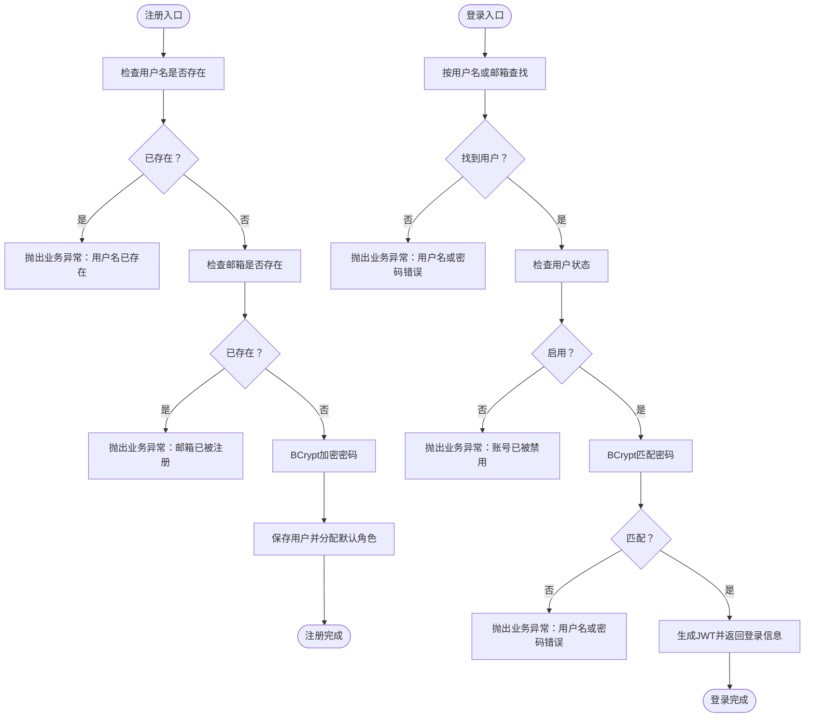
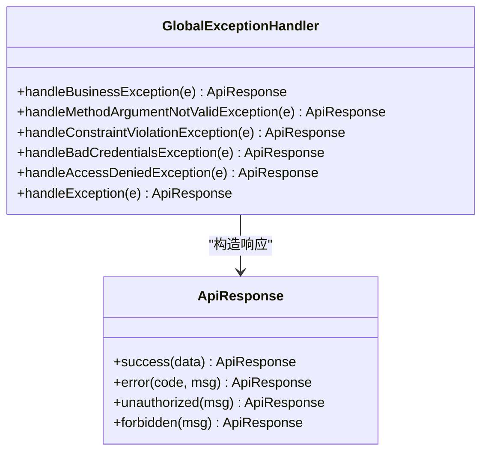
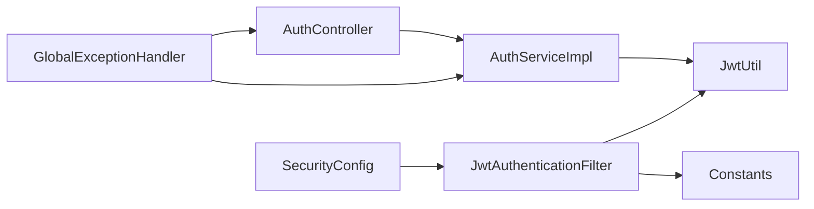

# 安全设计

<cite>
**本文引用的文件**
- [SecurityConfig.java](file://src/main/java/org/example/backend/config/SecurityConfig.java)
- [JwtUtil.java](file://src/main/java/org/example/backend/config/JwtUtil.java)
- [JwtAuthenticationFilter.java](file://src/main/java/org/example/backend/modules/auth/filter/JwtAuthenticationFilter.java)
- [GlobalExceptionHandler.java](file://src/main/java/org/example/backend/common/exception/GlobalExceptionHandler.java)
- [Constants.java](file://src/main/java/org/example/backend/common/constants/Constants.java)
- [AuthController.java](file://src/main/java/org/example/backend/modules/auth/controller/AuthController.java)
- [AuthServiceImpl.java](file://src/main/java/org/example/backend/modules/auth/service/impl/AuthServiceImpl.java)
- [application.yml](file://src/main/resources/application.yml)
- [ApiResponse.java](file://src/main/java/org/example/backend/common/ApiResponse.java)
- [LoginDTO.java](file://src/main/java/org/example/backend/dto/auth/LoginDTO.java)
- [RegisterDTO.java](file://src/main/java/org/example/backend/dto/auth/RegisterDTO.java)
- [UserContext.java](file://src/main/java/org/example/backend/common/util/UserContext.java)
- [WebMvcConfig.java](file://src/main/java/org/example/backend/config/WebMvcConfig.java)
</cite>

## 目录
1. [引言](#引言)
2. [项目结构](#项目结构)
3. [核心组件](#核心组件)
4. [架构总览](#架构总览)
5. [详细组件分析](#详细组件分析)
6. [依赖关系分析](#依赖关系分析)
7. [性能与安全特性](#性能与安全特性)
8. [故障排查指南](#故障排查指南)
9. [结论](#结论)
10. [附录](#附录)

## 引言
本文件面向智能图书推荐系统的安全设计，聚焦于基于JWT的认证授权机制、Spring Security的安全配置与权限控制策略、密码加密存储、输入验证规则与安全防护措施，以及跨域资源共享（CORS）、CSRF防护与XSS防范思路。同时给出安全异常处理机制、日志记录与监控策略、最佳实践与常见漏洞预防建议，以及开发者安全编码指导与测试建议。

## 项目结构
系统采用分层架构与模块化组织，安全相关的关键位置如下：
- 配置层：Spring Security配置、JWT工具、CORS配置
- 过滤层：JWT认证过滤器
- 控制层：认证控制器
- 服务层：认证服务（密码编码、令牌签发）
- DTO层：登录/注册输入验证
- 工具与常量：用户上下文、常量定义
- 异常处理：全局异常处理器
- 资源配置：静态资源映射

图表来源
- [SecurityConfig.java](file://src/main/java/org/example/backend/config/SecurityConfig.java#L46-L81)
- [JwtUtil.java](file://src/main/java/org/example/backend/config/JwtUtil.java#L30-L42)
- [JwtAuthenticationFilter.java](file://src/main/java/org/example/backend/modules/auth/filter/JwtAuthenticationFilter.java#L28-L56)
- [AuthController.java](file://src/main/java/org/example/backend/modules/auth/controller/AuthController.java#L26-L38)
- [AuthServiceImpl.java](file://src/main/java/org/example/backend/modules/auth/service/impl/AuthServiceImpl.java#L44-L78)
- [Constants.java](file://src/main/java/org/example/backend/common/constants/Constants.java#L11-L21)
- [UserContext.java](file://src/main/java/org/example/backend/common/util/UserContext.java#L17-L47)
- [WebMvcConfig.java](file://src/main/java/org/example/backend/config/WebMvcConfig.java#L20-L25)
- [GlobalExceptionHandler.java](file://src/main/java/org/example/backend/common/exception/GlobalExceptionHandler.java#L33-L98)

章节来源
- [SecurityConfig.java](file://src/main/java/org/example/backend/config/SecurityConfig.java#L24-L99)
- [application.yml](file://src/main/resources/application.yml#L44-L71)

## 核心组件
- Spring Security配置：禁用CSRF，配置CORS，无状态会话，公开接口白名单，管理员接口角色限制，添加JWT过滤器。
- JWT工具：生成与解析令牌、提取用户ID与角色、校验过期时间、HMAC-SHA签名密钥。
- JWT认证过滤器：从请求头提取Bearer Token，校验有效性，设置认证上下文，注入用户ID到请求属性。
- 认证服务：注册时BCrypt加密密码、分配默认角色；登录时校验状态与密码，签发JWT。
- 输入验证：登录/注册DTO使用JSR-303注解进行非空、长度、邮箱格式校验。
- 全局异常处理：统一返回码、日志记录、区分业务异常、认证失败、权限不足与系统异常。
- 用户上下文：从安全上下文或请求属性中获取当前用户ID与角色。
- CORS配置：允许所有来源、方法、头，允许凭证，缓存预检请求。

章节来源
- [SecurityConfig.java](file://src/main/java/org/example/backend/config/SecurityConfig.java#L46-L98)
- [JwtUtil.java](file://src/main/java/org/example/backend/config/JwtUtil.java#L30-L81)
- [JwtAuthenticationFilter.java](file://src/main/java/org/example/backend/modules/auth/filter/JwtAuthenticationFilter.java#L28-L67)
- [AuthServiceImpl.java](file://src/main/java/org/example/backend/modules/auth/service/impl/AuthServiceImpl.java#L44-L119)
- [LoginDTO.java](file://src/main/java/org/example/backend/dto/auth/LoginDTO.java#L13-L17)
- [RegisterDTO.java](file://src/main/java/org/example/backend/dto/auth/RegisterDTO.java#L15-L25)
- [GlobalExceptionHandler.java](file://src/main/java/org/example/backend/common/exception/GlobalExceptionHandler.java#L33-L108)
- [UserContext.java](file://src/main/java/org/example/backend/common/util/UserContext.java#L17-L47)
- [Constants.java](file://src/main/java/org/example/backend/common/constants/Constants.java#L11-L21)

## 架构总览
系统采用无状态认证（JWT），通过过滤器链在请求进入业务逻辑之前完成身份识别与权限判定。认证流程贯穿注册、登录、接口访问三个阶段，异常与日志在全局处理器中统一处理。

图表来源
- [AuthController.java](file://src/main/java/org/example/backend/modules/auth/controller/AuthController.java#L33-L38)
- [AuthServiceImpl.java](file://src/main/java/org/example/backend/modules/auth/service/impl/AuthServiceImpl.java#L80-L119)
- [JwtUtil.java](file://src/main/java/org/example/backend/config/JwtUtil.java#L30-L42)
- [SecurityConfig.java](file://src/main/java/org/example/backend/config/SecurityConfig.java#L46-L81)
- [JwtAuthenticationFilter.java](file://src/main/java/org/example/backend/modules/auth/filter/JwtAuthenticationFilter.java#L28-L56)

## 详细组件分析

### 基于JWT的认证授权机制
- 令牌生成：服务端根据用户ID与角色生成JWT，并设置签发时间与过期时间。
- 令牌解析：过滤器从请求头读取Bearer Token，校验签名与有效期，提取用户ID与角色。
- 认证上下文：将用户ID与角色封装为认证对象，写入SecurityContext，便于后续授权与审计。
- 授权策略：通过SecurityConfig对不同路径设置访问规则，管理员接口要求ADMIN角色，其余接口需认证。

图表来源
- [JwtUtil.java](file://src/main/java/org/example/backend/config/JwtUtil.java#L30-L81)
- [JwtAuthenticationFilter.java](file://src/main/java/org/example/backend/modules/auth/filter/JwtAuthenticationFilter.java#L28-L67)
- [SecurityConfig.java](file://src/main/java/org/example/backend/config/SecurityConfig.java#L46-L81)

章节来源
- [JwtUtil.java](file://src/main/java/org/example/backend/config/JwtUtil.java#L30-L81)
- [JwtAuthenticationFilter.java](file://src/main/java/org/example/backend/modules/auth/filter/JwtAuthenticationFilter.java#L28-L67)
- [SecurityConfig.java](file://src/main/java/org/example/backend/config/SecurityConfig.java#L46-L81)

### Spring Security安全配置与权限控制
- 禁用CSRF：系统为无状态API，关闭CSRF保护。
- CORS：允许任意来源、方法、头，允许凭证，预检请求缓存1小时。
- 会话策略：STATELESS，避免会话劫持与服务端状态膨胀。
- 授权规则：
  - 公开接口：认证相关、Swagger、部分只读接口、推荐接口、静态资源。
  - 管理员接口：/api/admin/** 需要ADMIN角色。
  - 其他接口：需认证。
- 方法级安全：开启prePostEnabled，配合注解进行细粒度授权。

图表来源
- [SecurityConfig.java](file://src/main/java/org/example/backend/config/SecurityConfig.java#L47-L78)

章节来源
- [SecurityConfig.java](file://src/main/java/org/example/backend/config/SecurityConfig.java#L46-L98)

### 密码加密存储与输入验证
- 密码加密：注册时使用BCrypt对明文密码进行编码存储；登录时使用matches进行比对。
- 输入验证：登录DTO要求用户名/密码非空；注册DTO要求用户名长度、邮箱格式、密码长度，非空校验。
- 业务异常：重复用户名/邮箱、账号被禁用、用户名或密码错误等均以业务异常形式返回。

图表来源
- [AuthServiceImpl.java](file://src/main/java/org/example/backend/modules/auth/service/impl/AuthServiceImpl.java#L44-L78)
- [AuthServiceImpl.java](file://src/main/java/org/example/backend/modules/auth/service/impl/AuthServiceImpl.java#L80-L119)
- [RegisterDTO.java](file://src/main/java/org/example/backend/dto/auth/RegisterDTO.java#L15-L25)
- [LoginDTO.java](file://src/main/java/org/example/backend/dto/auth/LoginDTO.java#L13-L17)

章节来源
- [AuthServiceImpl.java](file://src/main/java/org/example/backend/modules/auth/service/impl/AuthServiceImpl.java#L44-L119)
- [RegisterDTO.java](file://src/main/java/org/example/backend/dto/auth/RegisterDTO.java#L15-L25)
- [LoginDTO.java](file://src/main/java/org/example/backend/dto/auth/LoginDTO.java#L13-L17)

### 跨域资源共享（CORS）与CSRF/XSS防护
- CORS：允许任意来源、方法、头，允许凭证，预检缓存1小时，满足前端开发调试需求。
- CSRF：系统为无状态API，默认禁用CSRF，不使用表单提交场景下的CSRF令牌。
- XSS：建议在前端渲染与模板输出处进行内容转义与CSP策略配置；后端返回JSON数据时无需额外XSS处理，但应避免在响应中拼接不可信输入。

章节来源
- [SecurityConfig.java](file://src/main/java/org/example/backend/config/SecurityConfig.java#L87-L98)
- [application.yml](file://src/main/resources/application.yml#L44-L47)

### 安全异常处理机制与日志记录
- 统一响应体：ApiResponse提供成功/失败/未授权/禁止访问等静态方法，确保前后端一致的响应格式。
- 全局异常处理：捕获业务异常、参数校验异常、认证失败、权限不足与系统异常，分别记录日志并返回对应状态码。
- 日志级别：开启Spring Security与业务包的日志级别，便于问题定位与审计。

图表来源
- [ApiResponse.java](file://src/main/java/org/example/backend/common/ApiResponse.java#L42-L86)
- [GlobalExceptionHandler.java](file://src/main/java/org/example/backend/common/exception/GlobalExceptionHandler.java#L33-L108)

章节来源
- [ApiResponse.java](file://src/main/java/org/example/backend/common/ApiResponse.java#L42-L86)
- [GlobalExceptionHandler.java](file://src/main/java/org/example/backend/common/exception/GlobalExceptionHandler.java#L25-L108)
- [application.yml](file://src/main/resources/application.yml#L64-L71)

### 用户上下文与权限控制
- 用户上下文：提供从安全上下文与请求属性中获取当前用户ID与角色的方法，便于在业务层进行权限判断与审计。
- 请求头注入：过滤器将用户ID写入请求属性，常量定义了头部键名，便于后续中间件或拦截器使用。

章节来源
- [UserContext.java](file://src/main/java/org/example/backend/common/util/UserContext.java#L17-L47)
- [JwtAuthenticationFilter.java](file://src/main/java/org/example/backend/modules/auth/filter/JwtAuthenticationFilter.java#L49)
- [Constants.java](file://src/main/java/org/example/backend/common/constants/Constants.java#L21)

### 静态资源与文件上传
- 静态资源映射：通过WebMvcConfig将上传目录映射为可访问的URL前缀，便于图片等资源的直接访问。
- 安全建议：生产环境应限制上传类型与大小，增加访问鉴权与病毒扫描。

章节来源
- [WebMvcConfig.java](file://src/main/java/org/example/backend/config/WebMvcConfig.java#L20-L25)

## 依赖关系分析
- 认证链路：AuthController -> AuthServiceImpl -> JwtUtil；JwtAuthenticationFilter依赖JwtUtil与Constants。
- 安全链路：SecurityConfig配置过滤器链，注入JwtAuthenticationFilter；JwtAuthenticationFilter设置认证上下文。
- 异常链路：全局异常处理器统一捕获并记录日志，返回标准化响应。

图表来源
- [AuthController.java](file://src/main/java/org/example/backend/modules/auth/controller/AuthController.java#L26-L38)
- [AuthServiceImpl.java](file://src/main/java/org/example/backend/modules/auth/service/impl/AuthServiceImpl.java#L44-L119)
- [JwtUtil.java](file://src/main/java/org/example/backend/config/JwtUtil.java#L30-L42)
- [SecurityConfig.java](file://src/main/java/org/example/backend/config/SecurityConfig.java#L46-L81)
- [JwtAuthenticationFilter.java](file://src/main/java/org/example/backend/modules/auth/filter/JwtAuthenticationFilter.java#L28-L56)
- [Constants.java](file://src/main/java/org/example/backend/common/constants/Constants.java#L11-L21)
- [GlobalExceptionHandler.java](file://src/main/java/org/example/backend/common/exception/GlobalExceptionHandler.java#L33-L108)

章节来源
- [SecurityConfig.java](file://src/main/java/org/example/backend/config/SecurityConfig.java#L46-L81)
- [JwtAuthenticationFilter.java](file://src/main/java/org/example/backend/modules/auth/filter/JwtAuthenticationFilter.java#L28-L56)
- [AuthServiceImpl.java](file://src/main/java/org/example/backend/modules/auth/service/impl/AuthServiceImpl.java#L44-L119)

## 性能与安全特性
- 无状态会话：STATELESS策略降低服务端状态维护成本，提升横向扩展能力。
- 过滤器优先：JWT过滤器在用户名密码过滤器之前执行，减少不必要的认证开销。
- 缓存与预检：CORS预检缓存1小时，减少OPTIONS请求次数。
- 密码强度：BCrypt具备自适应成本因子，抵御暴力破解。
- 输入验证：DTO层前置校验，减少无效请求进入业务层。

章节来源
- [SecurityConfig.java](file://src/main/java/org/example/backend/config/SecurityConfig.java#L50)
- [application.yml](file://src/main/resources/application.yml#L44-L47)

## 故障排查指南
- 认证失败：检查Authorization头格式是否为Bearer token，确认密钥与过期时间配置。
- 权限不足：确认用户角色是否为ADMIN，接口是否正确标注所需角色。
- 参数校验失败：查看全局异常返回的字段错误信息，修正请求体或查询参数。
- 系统异常：查看日志中的堆栈信息，定位具体异常发生点。

章节来源
- [GlobalExceptionHandler.java](file://src/main/java/org/example/backend/common/exception/GlobalExceptionHandler.java#L83-L108)
- [application.yml](file://src/main/resources/application.yml#L64-L71)

## 结论
本系统采用无状态JWT认证与Spring Security组合，实现了清晰的认证授权链路与统一的异常处理机制。通过严格的输入验证、密码加密存储与CORS/CSRF/XSS相关策略，整体安全基线较高。建议在生产环境中进一步完善上传安全、速率限制、审计日志与监控告警体系。

## 附录

### 安全最佳实践
- 密钥管理：使用强随机密钥，定期轮换；避免硬编码密钥。
- 传输安全：强制HTTPS，禁用HTTP。
- 最小权限：接口最小暴露面，管理员接口严格鉴权。
- 输入净化：对不可信输入进行白名单校验与转义。
- 审计与监控：记录登录、权限变更、敏感操作日志，建立告警机制。
- 依赖更新：定期更新依赖与框架版本，修复已知漏洞。

### 常见安全漏洞预防
- 注入攻击：使用ORM参数化查询，避免动态SQL拼接。
- 会话劫持：禁用会话或采用安全的会话策略（本系统为无状态）。
- 强制浏览：对敏感接口进行角色与资源级权限控制。
- 暴力破解：登录失败次数限制、账户锁定策略。
- 信息泄露：避免在错误信息中暴露内部实现细节。

### 开发者安全编码指导
- 使用DTO进行输入校验，避免在控制器直接接收原始请求对象。
- 在业务层使用用户上下文获取当前用户ID与角色，避免从请求头直接解析。
- 对外部依赖调用进行超时与重试策略配置。
- 对日志输出进行脱敏，避免敏感信息泄露。

### 安全测试建议
- 单元测试：覆盖注册/登录/权限控制分支，模拟异常场景。
- 集成测试：验证JWT生成与解析、CORS跨域行为、异常处理器响应。
- 渗透测试：模拟越权访问、SQL注入、XSS、CSRF等典型攻击。
- 性能与压测：评估高并发下的认证与授权性能，结合安全策略进行容量规划。