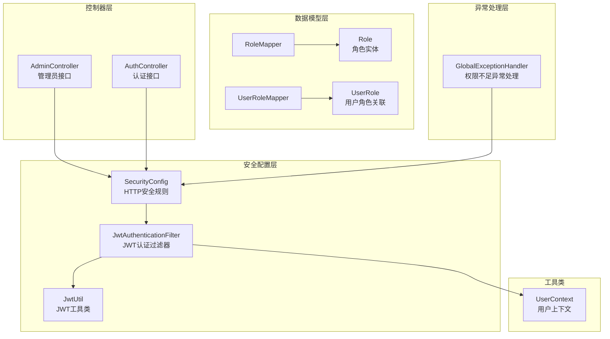
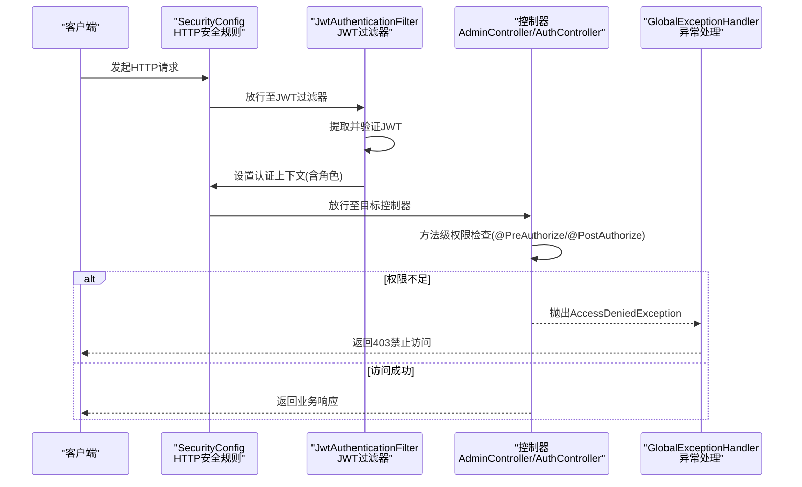
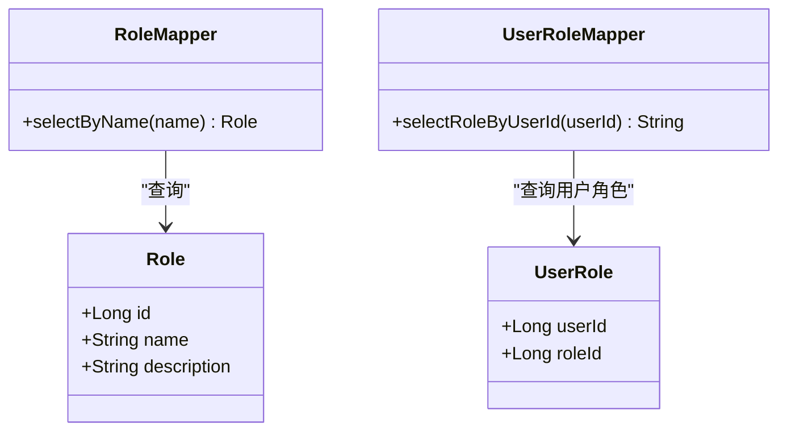
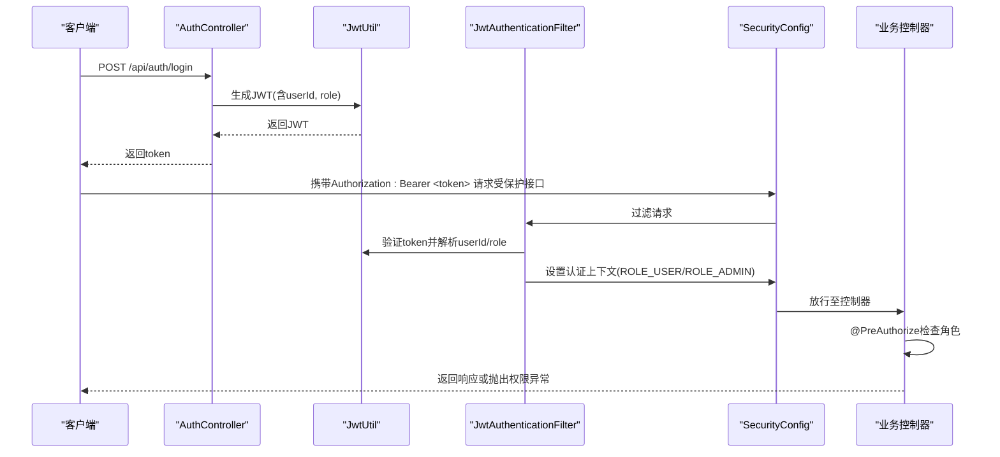
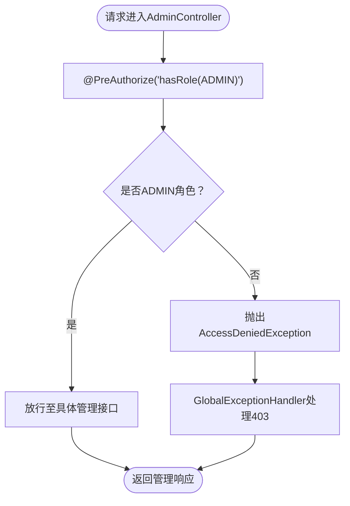
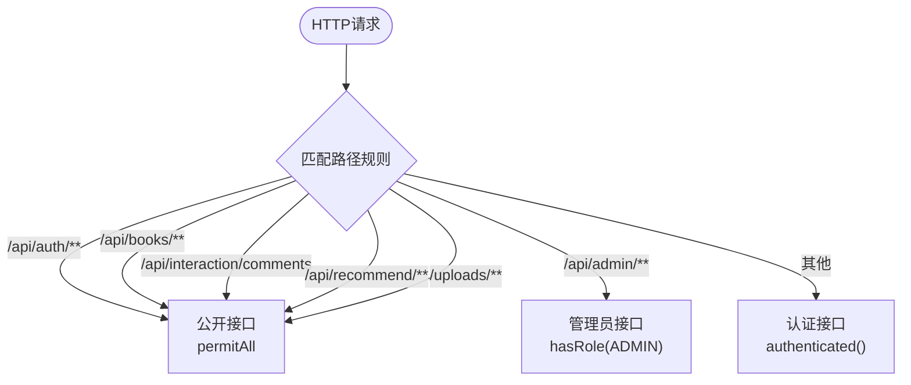
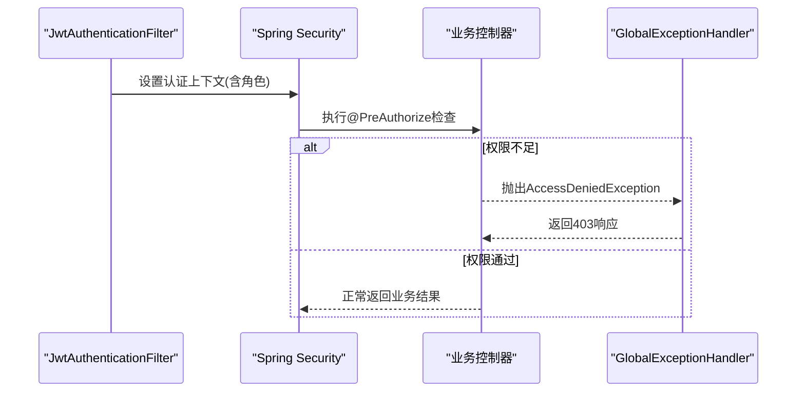
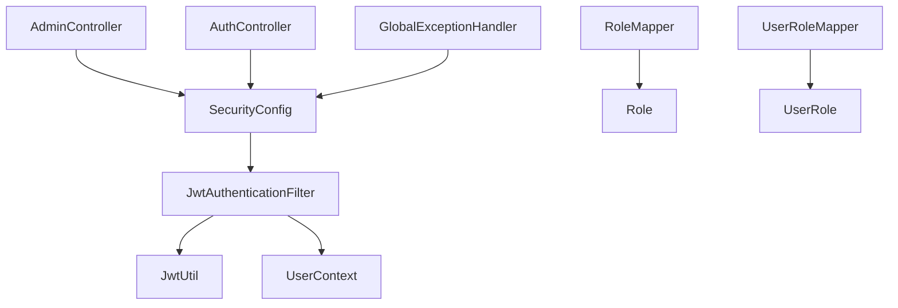

# 权限控制策略

<cite>
**本文档引用的文件**
- [SecurityConfig.java](file://src/main/java/org/example/backend/config/SecurityConfig.java)
- [JwtAuthenticationFilter.java](file://src/main/java/org/example/backend/modules/auth/filter/JwtAuthenticationFilter.java)
- [JwtUtil.java](file://src/main/java/org/example/backend/config/JwtUtil.java)
- [GlobalExceptionHandler.java](file://src/main/java/org/example/backend/common/exception/GlobalExceptionHandler.java)
- [UserContext.java](file://src/main/java/org/example/backend/common/util/UserContext.java)
- [Role.java](file://src/main/java/org/example/backend/entity/Role.java)
- [UserRole.java](file://src/main/java/org/example/backend/entity/UserRole.java)
- [RoleMapper.java](file://src/main/java/org/example/backend/modules/user/repository/RoleMapper.java)
- [UserRoleMapper.java](file://src/main/java/org/example/backend/modules/user/repository/UserRoleMapper.java)
- [AdminController.java](file://src/main/java/org/example/backend/modules/admin/controller/AdminController.java)
- [AuthController.java](file://src/main/java/org/example/backend/modules/auth/controller/AuthController.java)
- [User.java](file://src/main/java/org/example/backend/entity/User.java)
</cite>

## 目录
1. [引言](#引言)
2. [项目结构](#项目结构)
3. [核心组件](#核心组件)
4. [架构总览](#架构总览)
5. [详细组件分析](#详细组件分析)
6. [依赖关系分析](#依赖关系分析)
7. [性能考虑](#性能考虑)
8. [故障排除指南](#故障排除指南)
9. [结论](#结论)

## 引言
本文件面向智能图书推荐系统的权限控制策略，系统采用基于角色的访问控制（RBAC）与Spring Security结合的实现方式，通过JWT进行无状态认证，配合方法级权限注解实现细粒度的权限控制。本文档将深入解析角色定义、用户角色分配、权限继承机制、管理员特权操作、方法级权限注解的使用场景、API接口的权限分级策略、权限验证的实现原理与异常处理机制，并提供最佳实践与常见安全风险的预防措施。

## 项目结构
权限控制相关代码主要分布在以下模块：
- 安全配置层：Spring Security配置、CORS配置、方法级权限启用
- 认证与授权层：JWT工具类、JWT认证过滤器、用户上下文工具类
- 数据模型层：角色实体、用户角色关联表、角色映射器
- 控制器层：认证控制器（公开接口）、管理员控制器（管理员接口）
- 异常处理层：全局异常处理器，统一处理权限不足等异常

**图表来源**
- [SecurityConfig.java](file://src/main/java/org/example/backend/config/SecurityConfig.java#L27-L81)
- [JwtAuthenticationFilter.java](file://src/main/java/org/example/backend/modules/auth/filter/JwtAuthenticationFilter.java#L23-L68)
- [JwtUtil.java](file://src/main/java/org/example/backend/config/JwtUtil.java#L18-L92)
- [AdminController.java](file://src/main/java/org/example/backend/modules/admin/controller/AdminController.java#L24-L314)
- [AuthController.java](file://src/main/java/org/example/backend/modules/auth/controller/AuthController.java#L18-L41)
- [Role.java](file://src/main/java/org/example/backend/entity/Role.java#L11-L32)
- [UserRole.java](file://src/main/java/org/example/backend/entity/UserRole.java#L9-L24)
- [RoleMapper.java](file://src/main/java/org/example/backend/modules/user/repository/RoleMapper.java#L11-L21)
- [UserRoleMapper.java](file://src/main/java/org/example/backend/modules/user/repository/UserRoleMapper.java#L11-L23)
- [GlobalExceptionHandler.java](file://src/main/java/org/example/backend/common/exception/GlobalExceptionHandler.java#L25-L111)
- [UserContext.java](file://src/main/java/org/example/backend/common/util/UserContext.java#L12-L50)

**章节来源**
- [SecurityConfig.java](file://src/main/java/org/example/backend/config/SecurityConfig.java#L27-L81)
- [JwtAuthenticationFilter.java](file://src/main/java/org/example/backend/modules/auth/filter/JwtAuthenticationFilter.java#L23-L68)
- [JwtUtil.java](file://src/main/java/org/example/backend/config/JwtUtil.java#L18-L92)
- [GlobalExceptionHandler.java](file://src/main/java/org/example/backend/common/exception/GlobalExceptionHandler.java#L25-L111)
- [UserContext.java](file://src/main/java/org/example/backend/common/util/UserContext.java#L12-L50)
- [Role.java](file://src/main/java/org/example/backend/entity/Role.java#L11-L32)
- [UserRole.java](file://src/main/java/org/example/backend/entity/UserRole.java#L9-L24)
- [RoleMapper.java](file://src/main/java/org/example/backend/modules/user/repository/RoleMapper.java#L11-L21)
- [UserRoleMapper.java](file://src/main/java/org/example/backend/modules/user/repository/UserRoleMapper.java#L11-L23)
- [AdminController.java](file://src/main/java/org/example/backend/modules/admin/controller/AdminController.java#L24-L314)
- [AuthController.java](file://src/main/java/org/example/backend/modules/auth/controller/AuthController.java#L18-L41)

## 核心组件
- 安全配置（SecurityConfig）：定义HTTP安全规则，声明公开接口、认证接口与管理员接口的访问策略，启用方法级权限注解。
- JWT认证过滤器（JwtAuthenticationFilter）：从请求头提取JWT，验证有效性并设置认证上下文，注入用户ID到请求属性。
- JWT工具类（JwtUtil）：生成、解析与验证JWT，提取用户ID与角色信息。
- 用户上下文（UserContext）：在运行时获取当前用户ID与角色，供业务逻辑使用。
- 角色与用户角色映射（Role、UserRole、RoleMapper、UserRoleMapper）：支撑RBAC的数据模型与查询能力。
- 全局异常处理（GlobalExceptionHandler）：统一处理权限不足等异常，返回标准化响应与日志记录。
- 控制器层：认证控制器提供公开的注册与登录接口；管理员控制器使用@PreAuthorize限制ADMIN角色访问。

**章节来源**
- [SecurityConfig.java](file://src/main/java/org/example/backend/config/SecurityConfig.java#L27-L81)
- [JwtAuthenticationFilter.java](file://src/main/java/org/example/backend/modules/auth/filter/JwtAuthenticationFilter.java#L23-L68)
- [JwtUtil.java](file://src/main/java/org/example/backend/config/JwtUtil.java#L18-L92)
- [UserContext.java](file://src/main/java/org/example/backend/common/util/UserContext.java#L12-L50)
- [Role.java](file://src/main/java/org/example/backend/entity/Role.java#L11-L32)
- [UserRole.java](file://src/main/java/org/example/backend/entity/UserRole.java#L9-L24)
- [RoleMapper.java](file://src/main/java/org/example/backend/modules/user/repository/RoleMapper.java#L11-L21)
- [UserRoleMapper.java](file://src/main/java/org/example/backend/modules/user/repository/UserRoleMapper.java#L11-L23)
- [GlobalExceptionHandler.java](file://src/main/java/org/example/backend/common/exception/GlobalExceptionHandler.java#L25-L111)
- [AdminController.java](file://src/main/java/org/example/backend/modules/admin/controller/AdminController.java#L24-L314)
- [AuthController.java](file://src/main/java/org/example/backend/modules/auth/controller/AuthController.java#L18-L41)

## 架构总览
系统采用无状态认证与RBAC相结合的权限控制架构。JWT用于传递用户身份与角色，Spring Security负责HTTP层面的访问控制与方法级权限检查，业务控制器通过@PreAuthorize/@PostAuthorize实现细粒度权限控制。

**图表来源**
- [SecurityConfig.java](file://src/main/java/org/example/backend/config/SecurityConfig.java#L46-L81)
- [JwtAuthenticationFilter.java](file://src/main/java/org/example/backend/modules/auth/filter/JwtAuthenticationFilter.java#L28-L56)
- [AdminController.java](file://src/main/java/org/example/backend/modules/admin/controller/AdminController.java#L27-L314)
- [GlobalExceptionHandler.java](file://src/main/java/org/example/backend/common/exception/GlobalExceptionHandler.java#L93-L98)

## 详细组件分析

### RBAC角色模型与数据结构
系统采用经典的RBAC模型，包含角色实体与用户角色关联表，支持角色查询与用户角色查询。

**图表来源**
- [Role.java](file://src/main/java/org/example/backend/entity/Role.java#L13-L30)
- [UserRole.java](file://src/main/java/org/example/backend/entity/UserRole.java#L11-L22)
- [RoleMapper.java](file://src/main/java/org/example/backend/modules/user/repository/RoleMapper.java#L17-L18)
- [UserRoleMapper.java](file://src/main/java/org/example/backend/modules/user/repository/UserRoleMapper.java#L17-L20)

**章节来源**
- [Role.java](file://src/main/java/org/example/backend/entity/Role.java#L11-L32)
- [UserRole.java](file://src/main/java/org/example/backend/entity/UserRole.java#L9-L24)
- [RoleMapper.java](file://src/main/java/org/example/backend/modules/user/repository/RoleMapper.java#L11-L21)
- [UserRoleMapper.java](file://src/main/java/org/example/backend/modules/user/repository/UserRoleMapper.java#L11-L23)

### JWT认证流程与权限验证
JWT认证流程包括令牌生成、请求携带、过滤器解析与验证、认证上下文设置以及方法级权限检查。

**图表来源**
- [JwtUtil.java](file://src/main/java/org/example/backend/config/JwtUtil.java#L30-L58)
- [JwtAuthenticationFilter.java](file://src/main/java/org/example/backend/modules/auth/filter/JwtAuthenticationFilter.java#L32-L56)
- [SecurityConfig.java](file://src/main/java/org/example/backend/config/SecurityConfig.java#L74-L78)
- [AuthController.java](file://src/main/java/org/example/backend/modules/auth/controller/AuthController.java#L33-L38)

**章节来源**
- [JwtUtil.java](file://src/main/java/org/example/backend/config/JwtUtil.java#L18-L92)
- [JwtAuthenticationFilter.java](file://src/main/java/org/example/backend/modules/auth/filter/JwtAuthenticationFilter.java#L23-L68)
- [SecurityConfig.java](file://src/main/java/org/example/backend/config/SecurityConfig.java#L27-L81)
- [AuthController.java](file://src/main/java/org/example/backend/modules/auth/controller/AuthController.java#L18-L41)

### 管理员权限管理与安全边界
管理员控制器通过@PreAuthorize("hasRole('ADMIN')")对整个控制器进行角色限制，确保只有ADMIN角色用户可访问所有管理接口。同时，HTTP安全规则对/admin路径强制要求ADMIN角色，形成双重保障。

**图表来源**
- [AdminController.java](file://src/main/java/org/example/backend/modules/admin/controller/AdminController.java#L27-L314)
- [SecurityConfig.java](file://src/main/java/org/example/backend/config/SecurityConfig.java#L74-L74)
- [GlobalExceptionHandler.java](file://src/main/java/org/example/backend/common/exception/GlobalExceptionHandler.java#L93-L98)

**章节来源**
- [AdminController.java](file://src/main/java/org/example/backend/modules/admin/controller/AdminController.java#L24-L314)
- [SecurityConfig.java](file://src/main/java/org/example/backend/config/SecurityConfig.java#L74-L74)
- [GlobalExceptionHandler.java](file://src/main/java/org/example/backend/common/exception/GlobalExceptionHandler.java#L93-L98)

### 方法级别的权限控制注解
- @PreAuthorize：在方法执行前进行权限检查，适用于控制器层的接口级权限控制。
- @PostAuthorize：在方法执行后进行权限检查，适用于需要根据返回值再做权限判断的场景（本项目中AdminController未使用@PostAuthorize）。

应用示例：
- 管理员控制器：@PreAuthorize("hasRole('ADMIN')")对整个控制器生效。
- 具体接口：如新增图书、更新图书、删除图书等均受该注解保护。

**章节来源**
- [AdminController.java](file://src/main/java/org/example/backend/modules/admin/controller/AdminController.java#L27-L40)
- [SecurityConfig.java](file://src/main/java/org/example/backend/config/SecurityConfig.java#L29-L29)

### API接口的权限分级策略
系统按照访问需求将API分为三类：
- 公开接口：无需认证即可访问，如注册、登录、图书列表/详情、搜索/筛选、评论列表、推荐接口、静态资源等。
- 认证接口：需要有效JWT认证，但不要求特定角色，如用户相关接口（本项目中未显式标注，遵循anyRequest().authenticated()）。
- 管理员接口：仅ADMIN角色可访问，如/admin/**路径下的所有接口。

**图表来源**
- [SecurityConfig.java](file://src/main/java/org/example/backend/config/SecurityConfig.java#L54-L76)

**章节来源**
- [SecurityConfig.java](file://src/main/java/org/example/backend/config/SecurityConfig.java#L52-L76)

### 权限验证实现原理与异常处理机制
- 权限验证原理：JWT过滤器解析令牌后，构造UsernamePasswordAuthenticationToken并设置角色（ROLE_USER/ROLE_ADMIN），随后由Spring Security进行方法级权限检查。
- 异常处理机制：当发生权限不足时，抛出AccessDeniedException，由GlobalExceptionHandler捕获并返回403禁止访问的标准响应，同时记录警告日志。

**图表来源**
- [JwtAuthenticationFilter.java](file://src/main/java/org/example/backend/modules/auth/filter/JwtAuthenticationFilter.java#L34-L46)
- [GlobalExceptionHandler.java](file://src/main/java/org/example/backend/common/exception/GlobalExceptionHandler.java#L93-L98)

**章节来源**
- [JwtAuthenticationFilter.java](file://src/main/java/org/example/backend/modules/auth/filter/JwtAuthenticationFilter.java#L28-L56)
- [GlobalExceptionHandler.java](file://src/main/java/org/example/backend/common/exception/GlobalExceptionHandler.java#L93-L98)

### 用户上下文与角色查询
- UserContext提供获取当前用户ID与角色的方法，便于在业务逻辑中进行用户识别与权限判断。
- UserRoleMapper通过SQL查询用户对应的角色名称，RoleMapper提供按名称查询角色的能力，支撑RBAC的动态查询与校验。

**章节来源**
- [UserContext.java](file://src/main/java/org/example/backend/common/util/UserContext.java#L17-L47)
- [UserRoleMapper.java](file://src/main/java/org/example/backend/modules/user/repository/UserRoleMapper.java#L17-L20)
- [RoleMapper.java](file://src/main/java/org/example/backend/modules/user/repository/RoleMapper.java#L17-L18)

## 依赖关系分析
权限控制各组件之间的依赖关系如下：

**图表来源**
- [SecurityConfig.java](file://src/main/java/org/example/backend/config/SecurityConfig.java#L33-L33)
- [JwtAuthenticationFilter.java](file://src/main/java/org/example/backend/modules/auth/filter/JwtAuthenticationFilter.java#L26-L26)
- [JwtUtil.java](file://src/main/java/org/example/backend/config/JwtUtil.java#L18-L92)
- [AdminController.java](file://src/main/java/org/example/backend/modules/admin/controller/AdminController.java#L24-L314)
- [AuthController.java](file://src/main/java/org/example/backend/modules/auth/controller/AuthController.java#L18-L41)
- [UserContext.java](file://src/main/java/org/example/backend/common/util/UserContext.java#L12-L50)
- [RoleMapper.java](file://src/main/java/org/example/backend/modules/user/repository/RoleMapper.java#L11-L21)
- [UserRoleMapper.java](file://src/main/java/org/example/backend/modules/user/repository/UserRoleMapper.java#L11-L23)
- [GlobalExceptionHandler.java](file://src/main/java/org/example/backend/common/exception/GlobalExceptionHandler.java#L25-L111)

**章节来源**
- [SecurityConfig.java](file://src/main/java/org/example/backend/config/SecurityConfig.java#L33-L33)
- [JwtAuthenticationFilter.java](file://src/main/java/org/example/backend/modules/auth/filter/JwtAuthenticationFilter.java#L26-L26)
- [JwtUtil.java](file://src/main/java/org/example/backend/config/JwtUtil.java#L18-L92)
- [AdminController.java](file://src/main/java/org/example/backend/modules/admin/controller/AdminController.java#L24-L314)
- [AuthController.java](file://src/main/java/org/example/backend/modules/auth/controller/AuthController.java#L18-L41)
- [UserContext.java](file://src/main/java/org/example/backend/common/util/UserContext.java#L12-L50)
- [RoleMapper.java](file://src/main/java/org/example/backend/modules/user/repository/RoleMapper.java#L11-L21)
- [UserRoleMapper.java](file://src/main/java/org/example/backend/modules/user/repository/UserRoleMapper.java#L11-L23)
- [GlobalExceptionHandler.java](file://src/main/java/org/example/backend/common/exception/GlobalExceptionHandler.java#L25-L111)

## 性能考虑
- 无状态认证：JWT避免了服务器端会话存储，降低内存占用与扩展复杂度。
- 单次请求过滤：OncePerRequestFilter确保每个请求仅处理一次，减少重复认证开销。
- 方法级权限缓存：Spring Security通常对方法级权限有缓存机制，建议合理设计角色与权限粒度以提升命中率。
- 密钥与过期时间：合理设置JWT密钥长度与过期时间，在安全性与性能间取得平衡。

## 故障排除指南
- 权限不足（403）：检查请求头是否包含有效的Bearer Token，确认Token中的角色是否为ADMIN；核对控制器上的@PreAuthorize注解与HTTP安全规则。
- 认证失败（401）：检查用户名/密码是否正确，确认密码编码方式与登录流程一致。
- 参数校验失败（400）：检查请求参数格式与字段约束，关注全局异常处理器对校验异常的统一处理。
- 日志定位：全局异常处理器会记录权限不足与认证失败的日志，可通过日志排查问题。

**章节来源**
- [GlobalExceptionHandler.java](file://src/main/java/org/example/backend/common/exception/GlobalExceptionHandler.java#L83-L98)

## 结论
本系统通过Spring Security与JWT实现了完善的无状态认证与授权体系，结合RBAC模型与方法级权限注解，清晰地划分了公开接口、认证接口与管理员接口的访问边界。管理员特权通过@PreAuthorize与HTTP安全规则双重保障，异常处理机制提供了标准化的错误响应与日志记录。建议在实际部署中持续优化角色与权限粒度，加强密钥管理与日志审计，以进一步提升系统的安全性与可维护性。