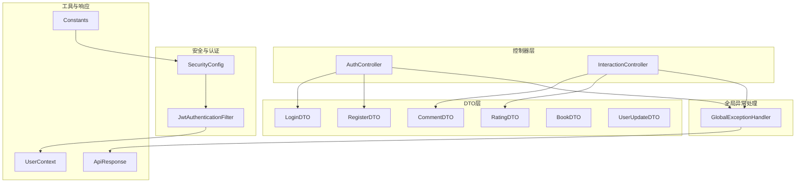
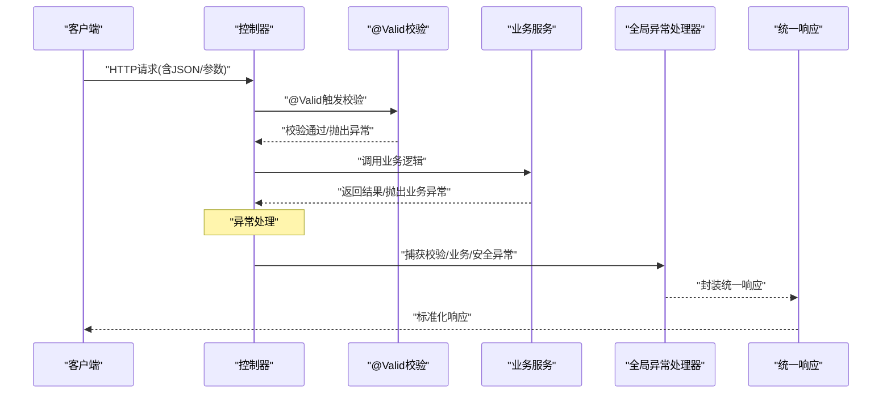
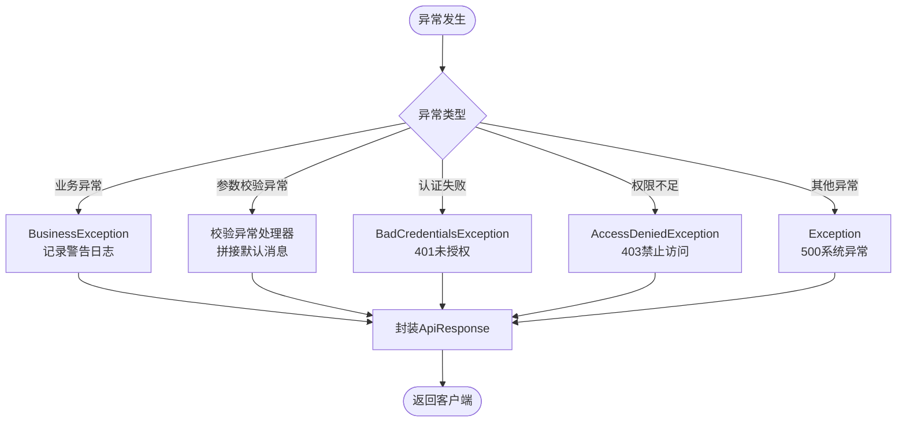
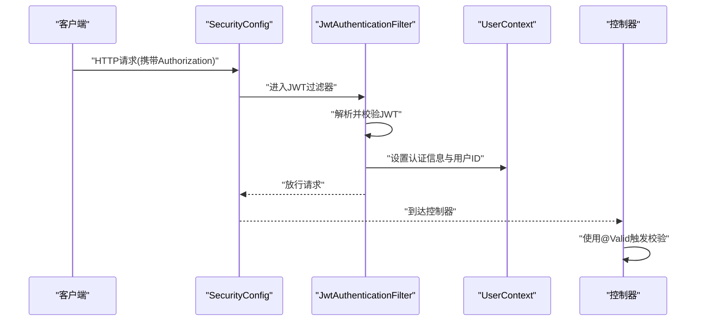
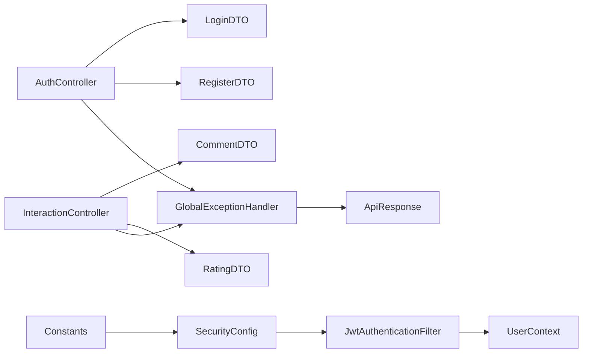

# 输入验证与安全防护

<cite>
**本文引用的文件**
- [GlobalExceptionHandler.java](file://src/main/java/org/example/backend/common/exception/GlobalExceptionHandler.java)
- [BusinessException.java](file://src/main/java/org/example/backend/common/exception/BusinessException.java)
- [ApiResponse.java](file://src/main/java/org/example/backend/common/ApiResponse.java)
- [Constants.java](file://src/main/java/org/example/backend/common/constants/Constants.java)
- [UserContext.java](file://src/main/java/org/example/backend/common/util/UserContext.java)
- [LoginDTO.java](file://src/main/java/org/example/backend/dto/auth/LoginDTO.java)
- [RegisterDTO.java](file://src/main/java/org/example/backend/dto/auth/RegisterDTO.java)
- [BookDTO.java](file://src/main/java/org/example/backend/dto/admin/BookDTO.java)
- [CommentDTO.java](file://src/main/java/org/example/backend/dto/interaction/CommentDTO.java)
- [RatingDTO.java](file://src/main/java/org/example/backend/dto/interaction/RatingDTO.java)
- [UserUpdateDTO.java](file://src/main/java/org/example/backend/dto/user/UserUpdateDTO.java)
- [AuthController.java](file://src/main/java/org/example/backend/modules/auth/controller/AuthController.java)
- [InteractionController.java](file://src/main/java/org/example/backend/modules/interaction/controller/InteractionController.java)
- [SecurityConfig.java](file://src/main/java/org/example/backend/config/SecurityConfig.java)
- [JwtAuthenticationFilter.java](file://src/main/java/org/example/backend/modules/auth/filter/JwtAuthenticationFilter.java)
- [application.yml](file://src/main/resources/application.yml)
</cite>

## 目录
1. [引言](#引言)
2. [项目结构](#项目结构)
3. [核心组件](#核心组件)
4. [架构总览](#架构总览)
5. [详细组件分析](#详细组件分析)
6. [依赖关系分析](#依赖关系分析)
7. [性能考虑](#性能考虑)
8. [故障排查指南](#故障排查指南)
9. [结论](#结论)
10. [附录](#附录)

## 引言
本文件聚焦于智能图书推荐系统的输入验证与安全防护，系统采用Spring Validation注解对DTO进行字段约束、格式验证与业务规则检查，并通过全局异常处理器统一处理参数校验异常与业务异常；同时结合Spring Security与JWT实现认证授权、CORS与CSRF防护策略，以及日志与统一响应封装，形成前后端协同的安全输入验证体系。

## 项目结构
系统采用分层架构，重点涉及以下模块：
- DTO层：定义各业务场景的输入对象，使用JSR-303注解进行声明式校验
- 控制器层：在方法参数上使用@Valid触发校验
- 全局异常处理：统一捕获校验异常与业务异常，返回标准化响应
- 安全配置：基于Spring Security与JWT实现认证授权、CORS与CSRF策略
- 工具与常量：用户上下文、响应封装、系统常量

图表来源
- [AuthController.java](file://src/main/java/org/example/backend/modules/auth/controller/AuthController.java#L1-L41)
- [InteractionController.java](file://src/main/java/org/example/backend/modules/interaction/controller/InteractionController.java#L1-L88)
- [LoginDTO.java](file://src/main/java/org/example/backend/dto/auth/LoginDTO.java#L1-L20)
- [RegisterDTO.java](file://src/main/java/org/example/backend/dto/auth/RegisterDTO.java#L1-L30)
- [CommentDTO.java](file://src/main/java/org/example/backend/dto/interaction/CommentDTO.java#L1-L27)
- [RatingDTO.java](file://src/main/java/org/example/backend/dto/interaction/RatingDTO.java#L1-L23)
- [BookDTO.java](file://src/main/java/org/example/backend/dto/admin/BookDTO.java#L1-L32)
- [UserUpdateDTO.java](file://src/main/java/org/example/backend/dto/user/UserUpdateDTO.java#L1-L28)
- [GlobalExceptionHandler.java](file://src/main/java/org/example/backend/common/exception/GlobalExceptionHandler.java#L1-L111)
- [SecurityConfig.java](file://src/main/java/org/example/backend/config/SecurityConfig.java#L1-L101)
- [JwtAuthenticationFilter.java](file://src/main/java/org/example/backend/modules/auth/filter/JwtAuthenticationFilter.java#L1-L70)
- [UserContext.java](file://src/main/java/org/example/backend/common/util/UserContext.java#L1-L50)
- [ApiResponse.java](file://src/main/java/org/example/backend/common/ApiResponse.java#L1-L89)
- [Constants.java](file://src/main/java/org/example/backend/common/constants/Constants.java#L1-L79)

章节来源
- [AuthController.java](file://src/main/java/org/example/backend/modules/auth/controller/AuthController.java#L1-L41)
- [InteractionController.java](file://src/main/java/org/example/backend/modules/interaction/controller/InteractionController.java#L1-L88)
- [GlobalExceptionHandler.java](file://src/main/java/org/example/backend/common/exception/GlobalExceptionHandler.java#L1-L111)
- [SecurityConfig.java](file://src/main/java/org/example/backend/config/SecurityConfig.java#L1-L101)

## 核心组件
- DTO数据传输对象：在字段上声明校验注解，如@NotBlank、@Email、@Size、@Min/@Max、@NotNull等，覆盖必填性、格式与范围约束
- 控制器层：在方法参数上使用@Valid触发校验，确保进入业务逻辑前完成参数清洗与校验
- 全局异常处理：统一捕获参数校验异常（@RequestBody、@ModelAttribute、@RequestParam），业务异常与认证/授权异常，返回标准化响应
- 安全与认证：基于Spring Security与JWT，禁用CSRF，开启CORS，设置无状态会话，按角色控制访问
- 工具与常量：UserContext用于获取当前用户上下文，Constants集中管理令牌头、用户ID头、角色与状态常量

章节来源
- [LoginDTO.java](file://src/main/java/org/example/backend/dto/auth/LoginDTO.java#L1-L20)
- [RegisterDTO.java](file://src/main/java/org/example/backend/dto/auth/RegisterDTO.java#L1-L30)
- [CommentDTO.java](file://src/main/java/org/example/backend/dto/interaction/CommentDTO.java#L1-L27)
- [RatingDTO.java](file://src/main/java/org/example/backend/dto/interaction/RatingDTO.java#L1-L23)
- [BookDTO.java](file://src/main/java/org/example/backend/dto/admin/BookDTO.java#L1-L32)
- [UserUpdateDTO.java](file://src/main/java/org/example/backend/dto/user/UserUpdateDTO.java#L1-L28)
- [AuthController.java](file://src/main/java/org/example/backend/modules/auth/controller/AuthController.java#L1-L41)
- [InteractionController.java](file://src/main/java/org/example/backend/modules/interaction/controller/InteractionController.java#L1-L88)
- [GlobalExceptionHandler.java](file://src/main/java/org/example/backend/common/exception/GlobalExceptionHandler.java#L1-L111)
- [SecurityConfig.java](file://src/main/java/org/example/backend/config/SecurityConfig.java#L1-L101)
- [JwtAuthenticationFilter.java](file://src/main/java/org/example/backend/modules/auth/filter/JwtAuthenticationFilter.java#L1-L70)
- [UserContext.java](file://src/main/java/org/example/backend/common/util/UserContext.java#L1-L50)
- [Constants.java](file://src/main/java/org/example/backend/common/constants/Constants.java#L1-L79)

## 架构总览
系统通过“控制器+DTO+全局异常处理+安全配置”的组合实现输入验证与安全防护闭环。控制器负责触发校验，DTO定义约束，全局异常处理统一输出，安全配置保障访问控制与会话策略。

图表来源
- [AuthController.java](file://src/main/java/org/example/backend/modules/auth/controller/AuthController.java#L26-L38)
- [InteractionController.java](file://src/main/java/org/example/backend/modules/interaction/controller/InteractionController.java#L29-L51)
- [GlobalExceptionHandler.java](file://src/main/java/org/example/backend/common/exception/GlobalExceptionHandler.java#L33-L78)
- [ApiResponse.java](file://src/main/java/org/example/backend/common/ApiResponse.java#L42-L86)

## 详细组件分析

### DTO验证机制与注解使用
- 字段约束与格式验证
  - 必填性：@NotBlank用于字符串非空；@NotNull用于数值/对象非空
  - 格式校验：@Email用于邮箱格式；可结合正则表达式注解进行更严格校验
  - 长度与范围：@Size用于用户名长度；@Min/@Max用于评分范围
- 业务规则检查
  - 在DTO层面声明业务约束，如评分必须在1-5之间、用户名长度限制等
  - 对于复杂业务规则（如唯一性、关联状态），建议在服务层补充校验并在必要时抛出业务异常

示例路径
- 登录DTO字段约束：[LoginDTO.java](file://src/main/java/org/example/backend/dto/auth/LoginDTO.java#L13-L17)
- 注册DTO字段约束：[RegisterDTO.java](file://src/main/java/org/example/backend/dto/auth/RegisterDTO.java#L15-L25)
- 评分DTO范围约束：[RatingDTO.java](file://src/main/java/org/example/backend/dto/interaction/RatingDTO.java#L17-L20)
- 评论DTO评分与内容约束：[CommentDTO.java](file://src/main/java/org/example/backend/dto/interaction/CommentDTO.java#L15-L24)
- 图书DTO必填字段约束：[BookDTO.java](file://src/main/java/org/example/backend/dto/admin/BookDTO.java#L15-L22)
- 用户更新DTO（可扩展）：[UserUpdateDTO.java](file://src/main/java/org/example/backend/dto/user/UserUpdateDTO.java#L9-L25)

章节来源
- [LoginDTO.java](file://src/main/java/org/example/backend/dto/auth/LoginDTO.java#L1-L20)
- [RegisterDTO.java](file://src/main/java/org/example/backend/dto/auth/RegisterDTO.java#L1-L30)
- [RatingDTO.java](file://src/main/java/org/example/backend/dto/interaction/RatingDTO.java#L1-L23)
- [CommentDTO.java](file://src/main/java/org/example/backend/dto/interaction/CommentDTO.java#L1-L27)
- [BookDTO.java](file://src/main/java/org/example/backend/dto/admin/BookDTO.java#L1-L32)
- [UserUpdateDTO.java](file://src/main/java/org/example/backend/dto/user/UserUpdateDTO.java#L1-L28)

### 控制器层触发校验与统一响应
- 控制器方法参数使用@Valid触发校验，确保进入业务逻辑前完成参数清洗
- 使用ApiResponse统一封装响应，支持成功/失败/未授权/禁止访问等场景

示例路径
- 注册与登录接口触发校验：[AuthController.java](file://src/main/java/org/example/backend/modules/auth/controller/AuthController.java#L26-L38)
- 评分与评论接口触发校验：[InteractionController.java](file://src/main/java/org/example/backend/modules/interaction/controller/InteractionController.java#L29-L51)

章节来源
- [AuthController.java](file://src/main/java/org/example/backend/modules/auth/controller/AuthController.java#L1-L41)
- [InteractionController.java](file://src/main/java/org/example/backend/modules/interaction/controller/InteractionController.java#L1-L88)
- [ApiResponse.java](file://src/main/java/org/example/backend/common/ApiResponse.java#L1-L89)

### 全局异常处理机制
- 业务异常：BusinessException统一返回业务错误码与消息
- 参数校验异常：
  - @RequestBody：MethodArgumentNotValidException
  - @ModelAttribute：BindException
  - @RequestParam：ConstraintViolationException
- 认证/授权异常：BadCredentialsException、AccessDeniedException
- 其他异常：捕获未知异常并返回系统异常提示

图表来源
- [GlobalExceptionHandler.java](file://src/main/java/org/example/backend/common/exception/GlobalExceptionHandler.java#L33-L108)
- [BusinessException.java](file://src/main/java/org/example/backend/common/exception/BusinessException.java#L1-L25)
- [ApiResponse.java](file://src/main/java/org/example/backend/common/ApiResponse.java#L63-L86)

章节来源
- [GlobalExceptionHandler.java](file://src/main/java/org/example/backend/common/exception/GlobalExceptionHandler.java#L1-L111)
- [BusinessException.java](file://src/main/java/org/example/backend/common/exception/BusinessException.java#L1-L25)
- [ApiResponse.java](file://src/main/java/org/example/backend/common/ApiResponse.java#L1-L89)

### 安全防护策略
- CSRF防护：禁用CSRF，适用于前后端分离的无状态应用
- CORS配置：允许跨域请求，设置允许的方法与头部
- 无状态会话：SessionCreationPolicy.STATELESS，降低会话攻击风险
- 认证链路：JWT过滤器从请求头解析令牌，校验后写入SecurityContext，并将用户ID注入请求属性
- 角色控制：基于注解与路径匹配实现ADMIN角色访问控制

图表来源
- [SecurityConfig.java](file://src/main/java/org/example/backend/config/SecurityConfig.java#L46-L78)
- [JwtAuthenticationFilter.java](file://src/main/java/org/example/backend/modules/auth/filter/JwtAuthenticationFilter.java#L28-L56)
- [UserContext.java](file://src/main/java/org/example/backend/common/util/UserContext.java#L17-L34)
- [AuthController.java](file://src/main/java/org/example/backend/modules/auth/controller/AuthController.java#L26-L38)

章节来源
- [SecurityConfig.java](file://src/main/java/org/example/backend/config/SecurityConfig.java#L1-L101)
- [JwtAuthenticationFilter.java](file://src/main/java/org/example/backend/modules/auth/filter/JwtAuthenticationFilter.java#L1-L70)
- [UserContext.java](file://src/main/java/org/example/backend/common/util/UserContext.java#L1-L50)
- [Constants.java](file://src/main/java/org/example/backend/common/constants/Constants.java#L1-L79)

### 输入验证最佳实践
- 前后端协同
  - 前端先行校验提升用户体验，后端必须保留@Valid校验作为最终防线
  - DTO注解覆盖必填、格式、长度与范围，避免仅依赖前端校验
- 敏感数据过滤
  - 密码字段不在响应中返回；注册/登录接口仅返回必要信息
  - 用户更新接口可选择性暴露字段，避免泄露内部标识
- 日志记录策略
  - 全局异常处理器记录校验失败与业务异常日志，便于审计与问题定位
  - 应避免在日志中输出敏感信息（如完整密码）

示例路径
- 响应封装与错误码：[ApiResponse.java](file://src/main/java/org/example/backend/common/ApiResponse.java#L42-L86)
- 异常日志记录：[GlobalExceptionHandler.java](file://src/main/java/org/example/backend/common/exception/GlobalExceptionHandler.java#L36-L107)

章节来源
- [ApiResponse.java](file://src/main/java/org/example/backend/common/ApiResponse.java#L1-L89)
- [GlobalExceptionHandler.java](file://src/main/java/org/example/backend/common/exception/GlobalExceptionHandler.java#L1-L111)

## 依赖关系分析
- 控制器依赖DTO与全局异常处理，确保参数在进入业务逻辑前被校验
- 安全配置与JWT过滤器共同保障认证链路，UserContext提供便捷的用户上下文访问
- 常量集中管理令牌头、用户ID头与角色常量，减少硬编码

图表来源
- [AuthController.java](file://src/main/java/org/example/backend/modules/auth/controller/AuthController.java#L1-L41)
- [InteractionController.java](file://src/main/java/org/example/backend/modules/interaction/controller/InteractionController.java#L1-L88)
- [GlobalExceptionHandler.java](file://src/main/java/org/example/backend/common/exception/GlobalExceptionHandler.java#L1-L111)
- [SecurityConfig.java](file://src/main/java/org/example/backend/config/SecurityConfig.java#L1-L101)
- [JwtAuthenticationFilter.java](file://src/main/java/org/example/backend/modules/auth/filter/JwtAuthenticationFilter.java#L1-L70)
- [UserContext.java](file://src/main/java/org/example/backend/common/util/UserContext.java#L1-L50)
- [Constants.java](file://src/main/java/org/example/backend/common/constants/Constants.java#L1-L79)
- [ApiResponse.java](file://src/main/java/org/example/backend/common/ApiResponse.java#L1-L89)

章节来源
- [AuthController.java](file://src/main/java/org/example/backend/modules/auth/controller/AuthController.java#L1-L41)
- [InteractionController.java](file://src/main/java/org/example/backend/modules/interaction/controller/InteractionController.java#L1-L88)
- [GlobalExceptionHandler.java](file://src/main/java/org/example/backend/common/exception/GlobalExceptionHandler.java#L1-L111)
- [SecurityConfig.java](file://src/main/java/org/example/backend/config/SecurityConfig.java#L1-L101)
- [JwtAuthenticationFilter.java](file://src/main/java/org/example/backend/modules/auth/filter/JwtAuthenticationFilter.java#L1-L70)
- [UserContext.java](file://src/main/java/org/example/backend/common/util/UserContext.java#L1-L50)
- [Constants.java](file://src/main/java/org/example/backend/common/constants/Constants.java#L1-L79)
- [ApiResponse.java](file://src/main/java/org/example/backend/common/ApiResponse.java#L1-L89)

## 性能考虑
- 校验开销：@Valid在控制器层触发，建议在DTO中合理设置校验范围，避免过度复杂的嵌套校验
- 过滤器链路：JWT过滤器仅在必要时解析令牌，避免重复计算
- 响应封装：统一响应体减少序列化差异带来的额外开销

## 故障排查指南
- 参数校验失败
  - 现象：返回400与校验失败消息
  - 排查：检查对应DTO注解是否正确，控制器是否使用@Valid
  - 参考路径：[GlobalExceptionHandler.java](file://src/main/java/org/example/backend/common/exception/GlobalExceptionHandler.java#L43-L78)
- 业务异常
  - 现象：返回业务错误码与消息
  - 排查：定位抛出BusinessException的位置，确认业务规则
  - 参考路径：[BusinessException.java](file://src/main/java/org/example/backend/common/exception/BusinessException.java#L1-L25)
- 认证失败
  - 现象：返回401未授权
  - 排查：确认请求头Authorization格式与JWT有效性
  - 参考路径：[GlobalExceptionHandler.java](file://src/main/java/org/example/backend/common/exception/GlobalExceptionHandler.java#L83-L88)
- 权限不足
  - 现象：返回403禁止访问
  - 排查：确认用户角色与路径权限配置
  - 参考路径：[GlobalExceptionHandler.java](file://src/main/java/org/example/backend/common/exception/GlobalExceptionHandler.java#L93-L98)

章节来源
- [GlobalExceptionHandler.java](file://src/main/java/org/example/backend/common/exception/GlobalExceptionHandler.java#L1-L111)
- [BusinessException.java](file://src/main/java/org/example/backend/common/exception/BusinessException.java#L1-L25)

## 结论
系统通过“DTO注解+控制器@Valid+全局异常处理+Spring Security/JWT”的组合，实现了完善的输入验证与安全防护。建议持续优化校验粒度与日志策略，确保在保证安全性的同时兼顾性能与可维护性。

## 附录
- 配置参考
  - 数据库与MyBatis-Plus配置：[application.yml](file://src/main/resources/application.yml#L10-L30)
  - JWT配置：[application.yml](file://src/main/resources/application.yml#L44-L47)
  - Swagger配置：[application.yml](file://src/main/resources/application.yml#L49-L55)
  - 文件上传配置：[application.yml](file://src/main/resources/application.yml#L57-L62)
  - 日志配置：[application.yml](file://src/main/resources/application.yml#L63-L71)

章节来源
- [application.yml](file://src/main/resources/application.yml#L1-L71)