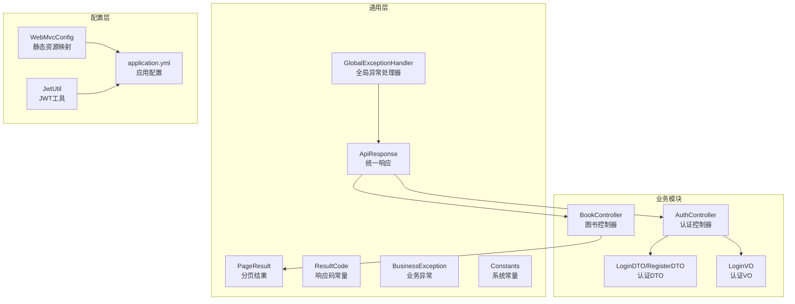
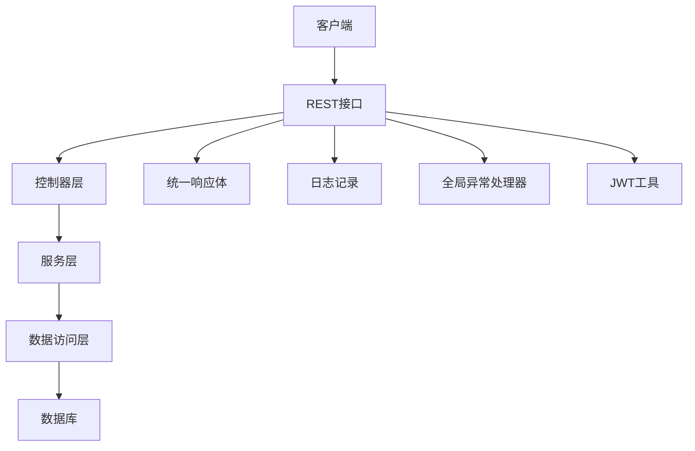
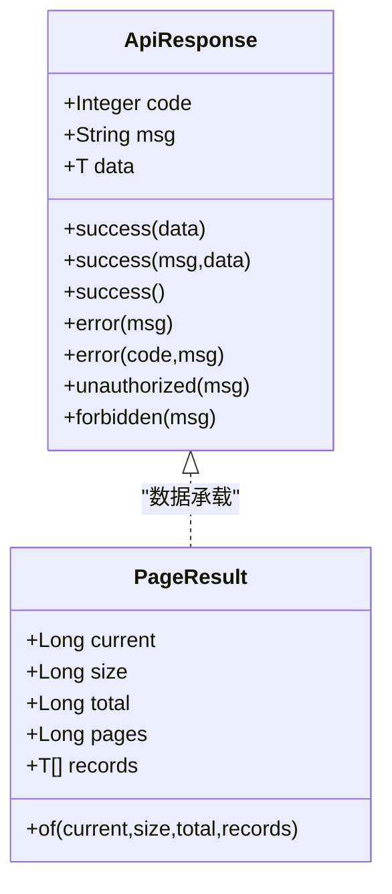
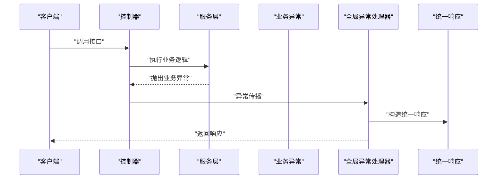
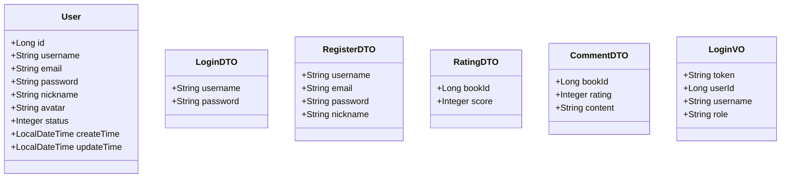
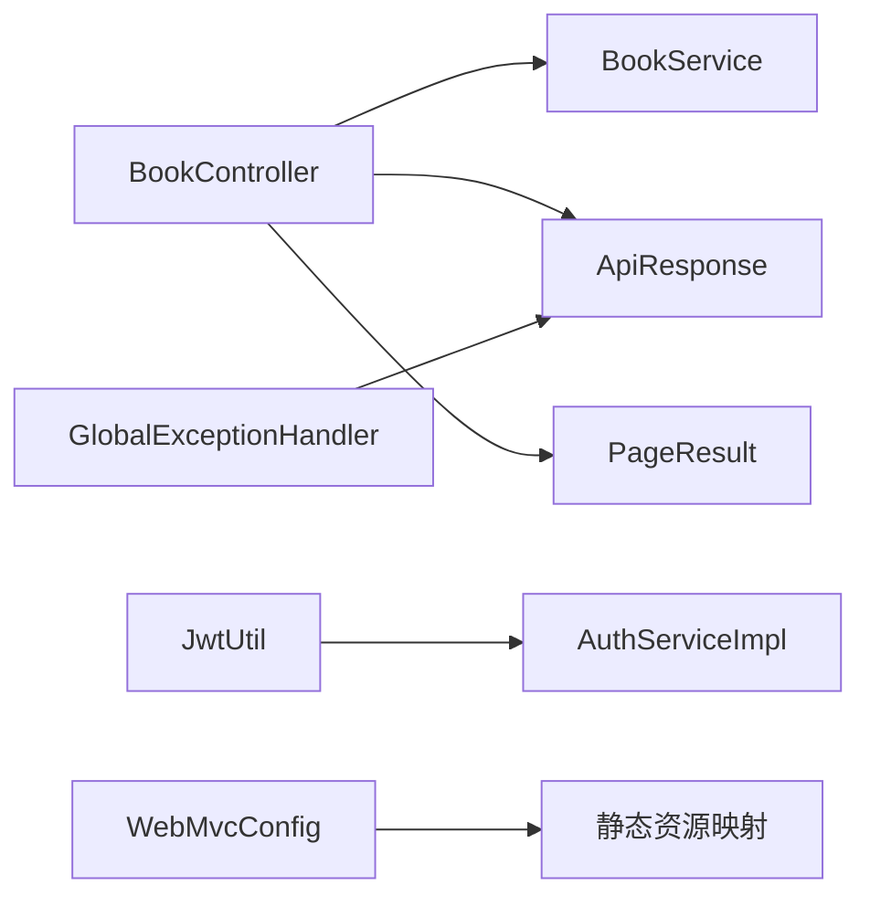

# 代码规范

<cite>
**本文引用的文件**
- [ApiResponse.java](file://src/main/java/org/example/backend/common/ApiResponse.java)
- [PageResult.java](file://src/main/java/org/example/backend/common/PageResult.java)
- [ResultCode.java](file://src/main/java/org/example/backend/common/ResultCode.java)
- [BusinessException.java](file://src/main/java/org/example/backend/common/exception/BusinessException.java)
- [GlobalExceptionHandler.java](file://src/main/java/org/example/backend/common/exception/GlobalExceptionHandler.java)
- [Constants.java](file://src/main/java/org/example/backend/common/constants/Constants.java)
- [User.java](file://src/main/java/org/example/backend/entity/User.java)
- [LoginDTO.java](file://src/main/java/org/example/backend/dto/auth/LoginDTO.java)
- [RegisterDTO.java](file://src/main/java/org/example/backend/dto/auth/RegisterDTO.java)
- [RatingDTO.java](file://src/main/java/org/example/backend/dto/interaction/RatingDTO.java)
- [CommentDTO.java](file://src/main/java/org/example/backend/dto/interaction/CommentDTO.java)
- [LoginVO.java](file://src/main/java/org/example/backend/vo/auth/LoginVO.java)
- [BookController.java](file://src/main/java/org/example/backend/modules/book/controller/BookController.java)
- [AuthService.java](file://src/main/java/org/example/backend/modules/auth/service/AuthService.java)
- [WebMvcConfig.java](file://src/main/java/org/example/backend/config/WebMvcConfig.java)
- [JwtUtil.java](file://src/main/java/org/example/backend/config/JwtUtil.java)
- [application.yml](file://src/main/resources/application.yml)
</cite>

## 目录
1. [引言](#引言)
2. [项目结构](#项目结构)
3. [核心组件](#核心组件)
4. [架构总览](#架构总览)
5. [详细组件分析](#详细组件分析)
6. [依赖关系分析](#依赖关系分析)
7. [性能考虑](#性能考虑)
8. [故障排查指南](#故障排查指南)
9. [结论](#结论)
10. [附录](#附录)

## 引言
本文件为智能图书推荐系统的代码规范文档，面向开发与维护人员，系统性阐述Java编码标准、命名约定、代码风格、Lombok注解规范、异常处理模式、统一响应格式、DTO/VO设计规范、实体类字段定义规则、接口命名约定、注释与日志规范以及错误码定义规范，并结合项目中的实际代码示例，给出正确实践与常见问题的解决方案。

## 项目结构
项目采用按功能域划分的层次化组织方式，主要模块包括通用层(common)、配置层(config)、各业务模块(controller/service/repository/entity/dto/vo)。统一响应、分页结果、全局异常处理、常量等位于通用层；认证、图书、交互、推荐、搜索、用户、管理等模块分别位于modules子包内；前端交互通过Swagger进行接口文档展示。

**图表来源**
- [ApiResponse.java](file://src/main/java/org/example/backend/common/ApiResponse.java#L1-L89)
- [PageResult.java](file://src/main/java/org/example/backend/common/PageResult.java#L1-L60)
- [ResultCode.java](file://src/main/java/org/example/backend/common/ResultCode.java#L1-L44)
- [BusinessException.java](file://src/main/java/org/example/backend/common/exception/BusinessException.java#L1-L25)
- [GlobalExceptionHandler.java](file://src/main/java/org/example/backend/common/exception/GlobalExceptionHandler.java#L1-L111)
- [Constants.java](file://src/main/java/org/example/backend/common/constants/Constants.java#L1-L79)
- [WebMvcConfig.java](file://src/main/java/org/example/backend/config/WebMvcConfig.java#L1-L29)
- [JwtUtil.java](file://src/main/java/org/example/backend/config/JwtUtil.java#L1-L92)
- [application.yml](file://src/main/resources/application.yml#L1-L71)
- [BookController.java](file://src/main/java/org/example/backend/modules/book/controller/BookController.java#L1-L60)
- [AuthService.java](file://src/main/java/org/example/backend/modules/auth/service/AuthService.java#L1-L23)
- [LoginDTO.java](file://src/main/java/org/example/backend/dto/auth/LoginDTO.java#L1-L20)
- [RegisterDTO.java](file://src/main/java/org/example/backend/dto/auth/RegisterDTO.java#L1-L29)
- [LoginVO.java](file://src/main/java/org/example/backend/vo/auth/LoginVO.java#L1-L32)

**章节来源**
- [application.yml](file://src/main/resources/application.yml#L1-L71)

## 核心组件
- 统一响应体：所有HTTP接口返回统一结构，包含状态码、消息与数据体，便于前端统一处理与调试。
- 分页结果：封装分页信息与数据列表，简化分页接口实现。
- 响应码常量：集中定义业务状态码，避免魔法数。
- 业务异常：用于抛出业务层面的错误，配合全局异常处理器输出统一响应。
- 全局异常处理器：捕获各类异常，输出标准化响应，并记录日志。
- 系统常量：集中管理JWT头、分页默认值、角色与状态枚举等。

**章节来源**
- [ApiResponse.java](file://src/main/java/org/example/backend/common/ApiResponse.java#L1-L89)
- [PageResult.java](file://src/main/java/org/example/backend/common/PageResult.java#L1-L60)
- [ResultCode.java](file://src/main/java/org/example/backend/common/ResultCode.java#L1-L44)
- [BusinessException.java](file://src/main/java/org/example/backend/common/exception/BusinessException.java#L1-L25)
- [GlobalExceptionHandler.java](file://src/main/java/org/example/backend/common/exception/GlobalExceptionHandler.java#L1-L111)
- [Constants.java](file://src/main/java/org/example/backend/common/constants/Constants.java#L1-L79)

## 架构总览
系统采用前后端分离架构，后端通过REST接口提供统一响应；认证基于JWT；MyBatis-Plus负责数据持久化；Spring Security与过滤器链实现鉴权；Swagger提供接口文档；日志级别在配置文件中集中设置。

**图表来源**
- [BookController.java](file://src/main/java/org/example/backend/modules/book/controller/BookController.java#L1-L60)
- [ApiResponse.java](file://src/main/java/org/example/backend/common/ApiResponse.java#L1-L89)
- [GlobalExceptionHandler.java](file://src/main/java/org/example/backend/common/exception/GlobalExceptionHandler.java#L1-L111)
- [JwtUtil.java](file://src/main/java/org/example/backend/config/JwtUtil.java#L1-L92)
- [application.yml](file://src/main/resources/application.yml#L63-L71)

## 详细组件分析

### 统一响应与分页规范
- 统一响应体包含状态码、消息与数据体，提供成功与失败的静态工厂方法，确保接口一致性。
- 分页结果包含当前页、每页大小、总记录数、总页数与数据列表，提供of工厂方法快速构建。
- 控制器层统一以ApiResponse包装返回值，分页场景使用PageResult。

**图表来源**
- [ApiResponse.java](file://src/main/java/org/example/backend/common/ApiResponse.java#L1-L89)
- [PageResult.java](file://src/main/java/org/example/backend/common/PageResult.java#L1-L60)

**章节来源**
- [ApiResponse.java](file://src/main/java/org/example/backend/common/ApiResponse.java#L1-L89)
- [PageResult.java](file://src/main/java/org/example/backend/common/PageResult.java#L1-L60)
- [BookController.java](file://src/main/java/org/example/backend/modules/book/controller/BookController.java#L25-L57)

### 异常处理与统一响应
- 业务异常：继承运行时异常，携带业务状态码，配合全局异常处理器输出统一响应。
- 全局异常处理器：覆盖业务异常、参数校验异常、认证失败、权限不足与通用异常，分别映射到不同HTTP状态与响应码。
- 日志记录：对业务异常、参数校验失败、认证失败、权限不足与系统异常进行分级记录。

**图表来源**
- [BusinessException.java](file://src/main/java/org/example/backend/common/exception/BusinessException.java#L1-L25)
- [GlobalExceptionHandler.java](file://src/main/java/org/example/backend/common/exception/GlobalExceptionHandler.java#L1-L111)
- [ApiResponse.java](file://src/main/java/org/example/backend/common/ApiResponse.java#L1-L89)

**章节来源**
- [BusinessException.java](file://src/main/java/org/example/backend/common/exception/BusinessException.java#L1-L25)
- [GlobalExceptionHandler.java](file://src/main/java/org/example/backend/common/exception/GlobalExceptionHandler.java#L1-L111)

### Lombok注解规范
- 实体类与DTO/VO普遍使用@Data注解，自动生成getter/setter/toString等，提升可读性与减少样板代码。
- 建议在需要序列化的类上显式声明serialVersionUID，保持兼容性。
- DTO/VO中使用javax.validation注解进行参数校验，如@NotBlank、@Email、@Size、@Min/@Max等。

**图表来源**
- [User.java](file://src/main/java/org/example/backend/entity/User.java#L1-L64)
- [LoginDTO.java](file://src/main/java/org/example/backend/dto/auth/LoginDTO.java#L1-L20)
- [RegisterDTO.java](file://src/main/java/org/example/backend/dto/auth/RegisterDTO.java#L1-L29)
- [RatingDTO.java](file://src/main/java/org/example/backend/dto/interaction/RatingDTO.java#L1-L22)
- [CommentDTO.java](file://src/main/java/org/example/backend/dto/interaction/CommentDTO.java#L1-L26)
- [LoginVO.java](file://src/main/java/org/example/backend/vo/auth/LoginVO.java#L1-L32)

**章节来源**
- [User.java](file://src/main/java/org/example/backend/entity/User.java#L1-L64)
- [LoginDTO.java](file://src/main/java/org/example/backend/dto/auth/LoginDTO.java#L1-L20)
- [RegisterDTO.java](file://src/main/java/org/example/backend/dto/auth/RegisterDTO.java#L1-L29)
- [RatingDTO.java](file://src/main/java/org/example/backend/dto/interaction/RatingDTO.java#L1-L22)
- [CommentDTO.java](file://src/main/java/org/example/backend/dto/interaction/CommentDTO.java#L1-L26)
- [LoginVO.java](file://src/main/java/org/example/backend/vo/auth/LoginVO.java#L1-L32)

### 实体类字段定义规则
- 主键：使用MyBatis-Plus注解标识主键类型，如自增主键。
- 表名：使用@TableName指定表名，保持与数据库一致。
- 时间字段：使用LocalDateTime表示创建与更新时间，便于统一时区与时序管理。
- 字段命名：遵循驼峰命名，与数据库下划线字段通过MyBatis-Plus自动映射。

**章节来源**
- [User.java](file://src/main/java/org/example/backend/entity/User.java#L1-L64)
- [application.yml](file://src/main/resources/application.yml#L17-L29)

### DTO/VO设计规范
- DTO：仅承载传输数据，不包含业务逻辑；使用验证注解保证入参合法性。
- VO：面向前端的视图对象，包含必要的展示字段与派生信息。
- 命名约定：DTO以DTO结尾，VO以VO结尾；与实体类区分，避免混淆。

**章节来源**
- [LoginDTO.java](file://src/main/java/org/example/backend/dto/auth/LoginDTO.java#L1-L20)
- [RegisterDTO.java](file://src/main/java/org/example/backend/dto/auth/RegisterDTO.java#L1-L29)
- [RatingDTO.java](file://src/main/java/org/example/backend/dto/interaction/RatingDTO.java#L1-L22)
- [CommentDTO.java](file://src/main/java/org/example/backend/dto/interaction/CommentDTO.java#L1-L26)
- [LoginVO.java](file://src/main/java/org/example/backend/vo/auth/LoginVO.java#L1-L32)

### 接口命名约定
- 控制器：使用名词复数形式，如BookController；方法使用动词短语+名词，如listBooks、filterBooks、getBookDetail。
- 服务接口：使用动词短语，如AuthService、BookService、InteractionService。
- 命名清晰表达意图，避免缩写，保持与业务职责一致。

**章节来源**
- [BookController.java](file://src/main/java/org/example/backend/modules/book/controller/BookController.java#L1-L60)
- [AuthService.java](file://src/main/java/org/example/backend/modules/auth/service/AuthService.java#L1-L23)

### 代码注释与日志规范
- 类注释：简述职责与作用域，如“统一API响应体”、“分页结果封装”。
- 字段注释：说明字段含义与约束，如“状态：0-禁用，1-启用”。
- 方法注释：说明用途、参数与返回值，如“分页查询图书列表”。
- 日志记录：使用SLF4J记录业务异常、参数校验失败、认证失败、权限不足与系统异常，级别分别为warn与error。

**章节来源**
- [ApiResponse.java](file://src/main/java/org/example/backend/common/ApiResponse.java#L6-L28)
- [User.java](file://src/main/java/org/example/backend/entity/User.java#L10-L62)
- [GlobalExceptionHandler.java](file://src/main/java/org/example/backend/common/exception/GlobalExceptionHandler.java#L22-L109)
- [application.yml](file://src/main/resources/application.yml#L63-L71)

### 错误码定义规范
- 成功：200
- 参数错误：400
- 未授权：401
- 禁止访问：403
- 资源不存在：404
- 服务器错误：500
- 业务错误：600
- 使用ResultCode集中管理，避免散落的魔法数。

**章节来源**
- [ResultCode.java](file://src/main/java/org/example/backend/common/ResultCode.java#L1-L44)

### JWT与安全配置
- JWT工具：生成Token、解析用户ID与角色、校验有效性与签名密钥。
- 安全配置：通过过滤器链与Security配置实现认证与授权，结合JWT工具完成令牌解析。
- 配置文件：集中管理JWT密钥、过期时间、文件上传路径与URL前缀、日志级别等。

**章节来源**
- [JwtUtil.java](file://src/main/java/org/example/backend/config/JwtUtil.java#L1-L92)
- [application.yml](file://src/main/resources/application.yml#L44-L62)

### 文件上传与静态资源
- WebMvc配置：将上传目录映射为静态资源，支持通过URL前缀访问上传文件。
- 配置项：上传路径与URL前缀由application.yml提供，默认相对路径与前缀。

**章节来源**
- [WebMvcConfig.java](file://src/main/java/org/example/backend/config/WebMvcConfig.java#L1-L29)
- [application.yml](file://src/main/resources/application.yml#L57-L62)

## 依赖关系分析
- 控制器依赖服务接口，服务实现依赖数据访问层，数据访问层依赖MyBatis-Plus与数据库。
- 统一响应与异常处理贯穿所有控制器，形成横切关注点。
- JWT工具被认证过滤器与服务层共同使用，确保令牌解析一致性。

**图表来源**
- [BookController.java](file://src/main/java/org/example/backend/modules/book/controller/BookController.java#L1-L60)
- [ApiResponse.java](file://src/main/java/org/example/backend/common/ApiResponse.java#L1-L89)
- [PageResult.java](file://src/main/java/org/example/backend/common/PageResult.java#L1-L60)
- [GlobalExceptionHandler.java](file://src/main/java/org/example/backend/common/exception/GlobalExceptionHandler.java#L1-L111)
- [JwtUtil.java](file://src/main/java/org/example/backend/config/JwtUtil.java#L1-L92)
- [WebMvcConfig.java](file://src/main/java/org/example/backend/config/WebMvcConfig.java#L1-L29)

**章节来源**
- [BookController.java](file://src/main/java/org/example/backend/modules/book/controller/BookController.java#L1-L60)
- [GlobalExceptionHandler.java](file://src/main/java/org/example/backend/common/exception/GlobalExceptionHandler.java#L1-L111)

## 性能考虑
- 统一分页参数与最大分页限制：通过Constants定义默认与最大分页大小，防止超大分页导致性能问题。
- DTO/VO精简字段：仅暴露必要字段，减少序列化与网络传输开销。
- 日志级别控制：生产环境建议降低日志级别，避免I/O瓶颈。
- 缓存策略：可结合Redis缓存热点数据（如图书详情、热门榜单），减少数据库压力。

**章节来源**
- [Constants.java](file://src/main/java/org/example/backend/common/constants/Constants.java#L24-L31)
- [application.yml](file://src/main/resources/application.yml#L63-L71)

## 故障排查指南
- 参数校验失败：检查DTO上的验证注解与全局异常处理器对MethodArgumentNotValidException、BindException、ConstraintViolationException的处理。
- 业务异常：确认业务逻辑抛出BusinessException并携带合理状态码，查看全局异常处理器的日志输出。
- 认证失败：确认用户名或密码错误触发BadCredentialsException，返回401并提示信息。
- 权限不足：确认AccessDeniedException触发，返回403并提示信息。
- 系统异常：捕获Exception并记录错误日志，返回500与通用提示。

**章节来源**
- [GlobalExceptionHandler.java](file://src/main/java/org/example/backend/common/exception/GlobalExceptionHandler.java#L33-L108)

## 结论
本规范以统一响应、分页结果、异常处理与常量管理为核心，结合Lombok注解与参数校验，形成清晰、一致且易于维护的代码风格。通过明确的命名约定、注释与日志规范，以及JWT与静态资源配置，确保系统在可扩展性、可读性与可运维性方面达到工程化标准。

## 附录
- 响应码对照：参考ResultCode接口定义。
- 常量一览：参考Constants类，涵盖JWT头、分页大小、角色与状态等。
- 配置项：参考application.yml，涵盖数据库、MyBatis-Plus、Redis、JWT、Swagger与日志等。

**章节来源**
- [ResultCode.java](file://src/main/java/org/example/backend/common/ResultCode.java#L1-L44)
- [Constants.java](file://src/main/java/org/example/backend/common/constants/Constants.java#L1-L79)
- [application.yml](file://src/main/resources/application.yml#L1-L71)