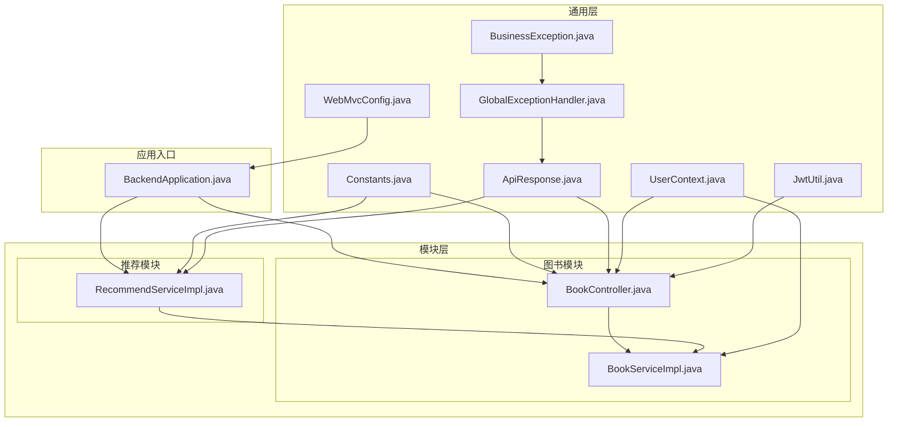
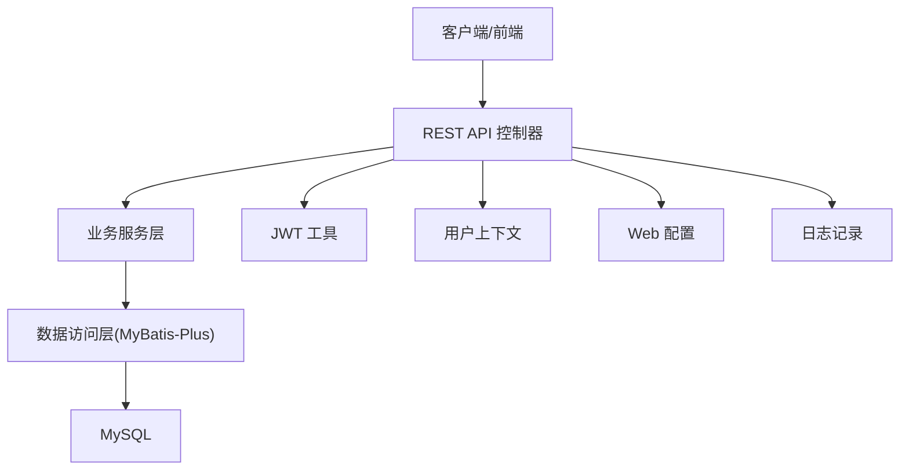
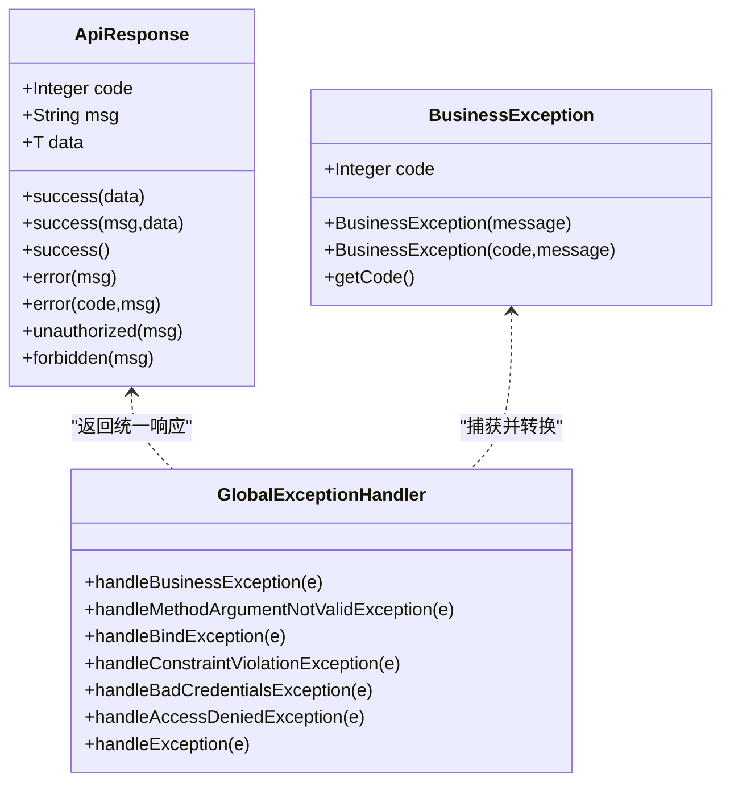
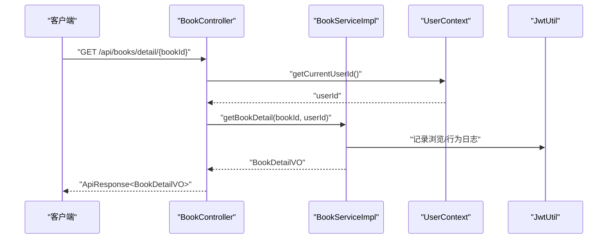
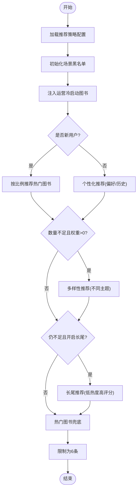
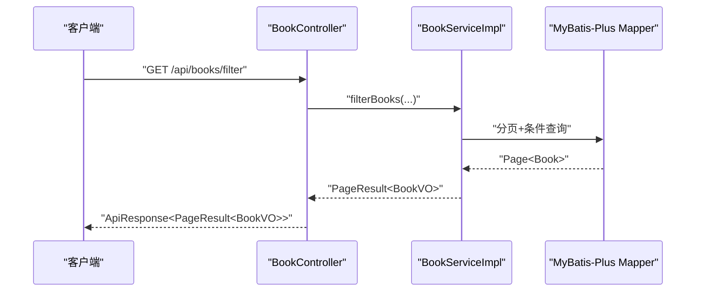
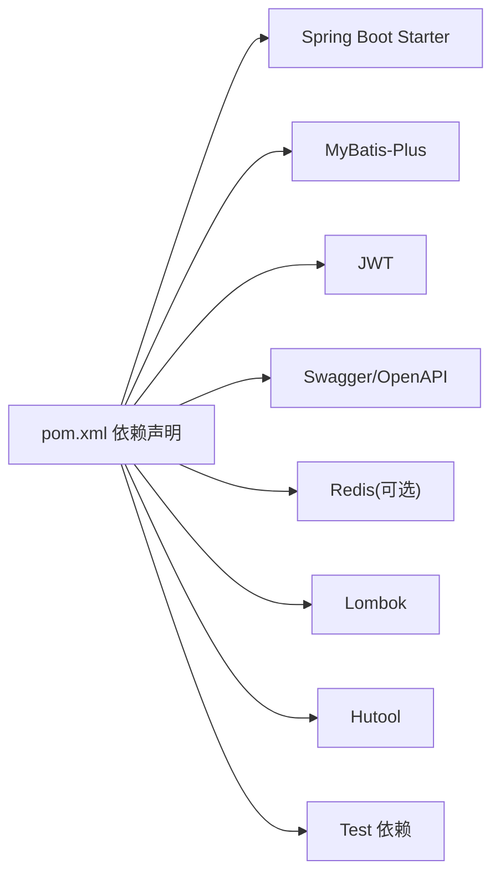

# 开发指南

<cite>
**本文引用的文件**
- [pom.xml](file://pom.xml)
- [application.yml](file://src/main/resources/application.yml)
- [BackendApplication.java](file://src/main/java/org/example/backend/BackendApplication.java)
- [BackendApplicationTests.java](file://src/test/java/org/example/backend/BackendApplicationTests.java)
- [Constants.java](file://src/main/java/org/example/backend/common/constants/Constants.java)
- [ApiResponse.java](file://src/main/java/org/example/backend/common/ApiResponse.java)
- [BusinessException.java](file://src/main/java/org/example/backend/common/exception/BusinessException.java)
- [GlobalExceptionHandler.java](file://src/main/java/org/example/backend/common/exception/GlobalExceptionHandler.java)
- [JwtUtil.java](file://src/main/java/org/example/backend/config/JwtUtil.java)
- [WebMvcConfig.java](file://src/main/java/org/example/backend/config/WebMvcConfig.java)
- [UserContext.java](file://src/main/java/org/example/backend/common/util/UserContext.java)
- [BookController.java](file://src/main/java/org/example/backend/modules/book/controller/BookController.java)
- [BookServiceImpl.java](file://src/main/java/org/example/backend/modules/book/service/impl/BookServiceImpl.java)
- [RecommendServiceImpl.java](file://src/main/java/org/example/backend/modules/recommend/service/impl/RecommendServiceImpl.java)
</cite>

## 目录
1. [简介](#简介)
2. [项目结构](#项目结构)
3. [核心组件](#核心组件)
4. [架构总览](#架构总览)
5. [详细组件分析](#详细组件分析)
6. [依赖分析](#依赖分析)
7. [性能考虑](#性能考虑)
8. [故障排查指南](#故障排查指南)
9. [结论](#结论)
10. [附录](#附录)

## 简介
本开发指南面向智能图书推荐系统的后端团队，覆盖代码规范、注释标准、提交规范、代码审查流程、开发环境配置、IDE 设置、调试技巧、常用工具类使用、异常处理模式、日志记录规范、单元测试与集成测试策略、测试覆盖率要求、代码重构原则、技术债务管理以及持续集成流程，并为新成员提供入职指导与最佳实践建议。

## 项目结构
项目采用 Spring Boot 标准分层架构，按功能域划分模块，统一在 common 层提供常量、响应体、异常与工具类；各模块包含 controller、service、repository、vo/dto 实体与配置类，便于职责清晰与扩展维护。

图表来源
- [BackendApplication.java](file://src/main/java/org/example/backend/BackendApplication.java#L1-L14)
- [Constants.java](file://src/main/java/org/example/backend/common/constants/Constants.java#L1-L79)
- [ApiResponse.java](file://src/main/java/org/example/backend/common/ApiResponse.java#L1-L89)
- [BusinessException.java](file://src/main/java/org/example/backend/common/exception/BusinessException.java#L1-L25)
- [GlobalExceptionHandler.java](file://src/main/java/org/example/backend/common/exception/GlobalExceptionHandler.java#L1-L111)
- [UserContext.java](file://src/main/java/org/example/backend/common/util/UserContext.java#L1-L50)
- [JwtUtil.java](file://src/main/java/org/example/backend/config/JwtUtil.java#L1-L92)
- [WebMvcConfig.java](file://src/main/java/org/example/backend/config/WebMvcConfig.java#L1-L29)
- [BookController.java](file://src/main/java/org/example/backend/modules/book/controller/BookController.java#L1-L60)
- [BookServiceImpl.java](file://src/main/java/org/example/backend/modules/book/service/impl/BookServiceImpl.java#L1-L249)
- [RecommendServiceImpl.java](file://src/main/java/org/example/backend/modules/recommend/service/impl/RecommendServiceImpl.java#L1-L800)

章节来源
- [BackendApplication.java](file://src/main/java/org/example/backend/BackendApplication.java#L1-L14)
- [pom.xml](file://pom.xml#L1-L161)

## 核心组件
- 统一响应体与状态码：通过 ApiResponse 提供统一的响应结构，配合 ResultCode 常量约定状态码与消息。
- 全局异常处理：GlobalExceptionHandler 将业务异常、参数校验异常、认证/鉴权异常与未知异常进行分类处理，保证对外一致的错误格式。
- 用户上下文：UserContext 提供从安全上下文或请求属性中提取当前用户 ID 与角色的能力，贯穿控制器与服务层。
- JWT 工具：JwtUtil 负责签发、解析与校验 Token，读取配置中心的密钥与过期时间。
- Web 配置：WebMvcConfig 将文件上传目录映射为静态资源，便于文件访问。
- 常量集中：Constants 定义请求头、分页、角色、状态与搜索模式等常量，避免魔法值。

章节来源
- [ApiResponse.java](file://src/main/java/org/example/backend/common/ApiResponse.java#L1-L89)
- [GlobalExceptionHandler.java](file://src/main/java/org/example/backend/common/exception/GlobalExceptionHandler.java#L1-L111)
- [UserContext.java](file://src/main/java/org/example/backend/common/util/UserContext.java#L1-L50)
- [JwtUtil.java](file://src/main/java/org/example/backend/config/JwtUtil.java#L1-L92)
- [WebMvcConfig.java](file://src/main/java/org/example/backend/config/WebMvcConfig.java#L1-L29)
- [Constants.java](file://src/main/java/org/example/backend/common/constants/Constants.java#L1-L79)

## 架构总览
系统采用前后端分离，后端以 Spring MVC + Spring Security + MyBatis-Plus 为核心，提供 REST 接口与 OpenAPI 文档。推荐模块包含冷启动、个性化、多样性与长尾策略组合，形成多阶段融合的推荐流水线。

图表来源
- [BookController.java](file://src/main/java/org/example/backend/modules/book/controller/BookController.java#L1-L60)
- [BookServiceImpl.java](file://src/main/java/org/example/backend/modules/book/service/impl/BookServiceImpl.java#L1-L249)
- [RecommendServiceImpl.java](file://src/main/java/org/example/backend/modules/recommend/service/impl/RecommendServiceImpl.java#L1-L800)
- [JwtUtil.java](file://src/main/java/org/example/backend/config/JwtUtil.java#L1-L92)
- [UserContext.java](file://src/main/java/org/example/backend/common/util/UserContext.java#L1-L50)
- [WebMvcConfig.java](file://src/main/java/org/example/backend/config/WebMvcConfig.java#L1-L29)

## 详细组件分析

### 统一响应与异常处理
- 响应体设计：统一 code/msg/data 结构，成功/失败/未授权/禁止访问均有对应工厂方法，便于前端统一处理。
- 异常分类：业务异常、参数校验异常、认证失败、权限不足与通用异常分别处理，确保 HTTP 状态与业务状态码一致。
- 日志记录：对业务异常与参数校验失败进行 warn 级别记录，对未知异常进行 error 级别记录，便于问题追踪。

图表来源
- [ApiResponse.java](file://src/main/java/org/example/backend/common/ApiResponse.java#L1-L89)
- [BusinessException.java](file://src/main/java/org/example/backend/common/exception/BusinessException.java#L1-L25)
- [GlobalExceptionHandler.java](file://src/main/java/org/example/backend/common/exception/GlobalExceptionHandler.java#L1-L111)

章节来源
- [ApiResponse.java](file://src/main/java/org/example/backend/common/ApiResponse.java#L1-L89)
- [BusinessException.java](file://src/main/java/org/example/backend/common/exception/BusinessException.java#L1-L25)
- [GlobalExceptionHandler.java](file://src/main/java/org/example/backend/common/exception/GlobalExceptionHandler.java#L1-L111)

### 用户上下文与 JWT
- 用户上下文：从安全上下文与请求属性中提取用户 ID 与角色，支持控制器与服务层共享当前用户信息。
- JWT 工具：基于配置的密钥与过期时间生成 Token，解析并验证 Token 的有效性。

图表来源
- [BookController.java](file://src/main/java/org/example/backend/modules/book/controller/BookController.java#L1-L60)
- [BookServiceImpl.java](file://src/main/java/org/example/backend/modules/book/service/impl/BookServiceImpl.java#L1-L249)
- [UserContext.java](file://src/main/java/org/example/backend/common/util/UserContext.java#L1-L50)
- [JwtUtil.java](file://src/main/java/org/example/backend/config/JwtUtil.java#L1-L92)

章节来源
- [UserContext.java](file://src/main/java/org/example/backend/common/util/UserContext.java#L1-L50)
- [JwtUtil.java](file://src/main/java/org/example/backend/config/JwtUtil.java#L1-L92)

### 推荐服务流程
推荐模块实现“冷启动运营位注入 → 新用户热门推荐 → 老用户个性化 → 多样性补充 → 长尾兜底 → 热门兜底”的多阶段融合策略，并支持曝光、点击、反馈与黑名单控制。

图表来源
- [RecommendServiceImpl.java](file://src/main/java/org/example/backend/modules/recommend/service/impl/RecommendServiceImpl.java#L1-L800)

章节来源
- [RecommendServiceImpl.java](file://src/main/java/org/example/backend/modules/recommend/service/impl/RecommendServiceImpl.java#L1-L800)

### 图书服务与控制器
- 控制器：提供分页列表、多条件筛选与详情接口，统一返回 ApiResponse。
- 服务层：实现分页查询、条件过滤、排序、主题关联与浏览记录写入，同时处理非管理员可见性与浏览行为同步。

图表来源
- [BookController.java](file://src/main/java/org/example/backend/modules/book/controller/BookController.java#L1-L60)
- [BookServiceImpl.java](file://src/main/java/org/example/backend/modules/book/service/impl/BookServiceImpl.java#L1-L249)

章节来源
- [BookController.java](file://src/main/java/org/example/backend/modules/book/controller/BookController.java#L1-L60)
- [BookServiceImpl.java](file://src/main/java/org/example/backend/modules/book/service/impl/BookServiceImpl.java#L1-L249)

## 依赖分析
- 核心框架：Spring Boot、Spring MVC、Spring Security、MyBatis-Plus。
- 数据库与连接：MySQL 驱动、MyBatis-Plus。
- 安全与认证：JWT。
- 文档：Swagger/OpenAPI。
- 缓存：Redis（可选）。
- 工具：Lombok、Hutool。
- 测试：Spring Boot Test、Spring Security Test。

图表来源
- [pom.xml](file://pom.xml#L1-L161)

章节来源
- [pom.xml](file://pom.xml#L1-L161)

## 性能考虑
- 分页与排序：服务层使用 MyBatis-Plus 分页器与合理排序字段，避免一次性加载大量数据。
- 查询优化：对高频查询建立必要索引，减少 N+1 查询；对主题关联查询进行批量查询与去重。
- 缓存策略：可结合 Redis 对热点数据与会话缓存进行优化（需在配置中启用）。
- IO 与日志：文件上传路径映射为静态资源，减少不必要的动态路由开销。
- 推荐算法：长尾与多样性的阈值与权重可通过策略表动态调整，避免硬编码。

## 故障排查指南
- 参数校验失败：查看全局异常处理器对 MethodArgumentNotValidException、BindException、ConstraintViolationException 的聚合提示。
- 认证失败：确认 Authorization 头与 Token 前缀，检查密钥与过期时间配置。
- 权限不足：确认用户角色与接口权限配置。
- 业务异常：捕获 BusinessException 并查看业务提示与状态码。
- 日志定位：根据日志级别与包名定位问题，关注 warn/error 级别的异常堆栈。

章节来源
- [GlobalExceptionHandler.java](file://src/main/java/org/example/backend/common/exception/GlobalExceptionHandler.java#L1-L111)
- [application.yml](file://src/main/resources/application.yml#L64-L71)

## 结论
本指南提供了从架构到实现细节的完整开发指引，涵盖统一响应、异常处理、用户上下文、JWT、文件上传、推荐策略与控制器/服务层协作。建议团队在日常开发中严格遵循统一规范，持续完善测试与文档，保障系统稳定性与可维护性。

## 附录

### 开发环境配置与 IDE 设置
- JDK 版本：1.8（见构建配置）。
- Maven：使用本地仓库与镜像加速，确保依赖下载稳定。
- IDE：IntelliJ IDEA 或 Eclipse，启用 Lombok 插件；配置代码风格与检查规则。
- Spring Boot 运行：通过 BackendApplication 启动，或使用 Maven 插件打包运行。

章节来源
- [pom.xml](file://pom.xml#L10-L18)
- [BackendApplication.java](file://src/main/java/org/example/backend/BackendApplication.java#L1-L14)

### 代码规范与注释标准
- 类与方法命名：采用英文、驼峰式，语义明确。
- 注释：公共接口与复杂逻辑需提供简洁说明；避免显而易见的注释。
- 常量：集中于 Constants，避免魔法值。
- 响应：统一使用 ApiResponse，错误码与消息保持一致。
- 异常：业务异常使用 BusinessException，避免吞掉异常。

章节来源
- [Constants.java](file://src/main/java/org/example/backend/common/constants/Constants.java#L1-L79)
- [ApiResponse.java](file://src/main/java/org/example/backend/common/ApiResponse.java#L1-L89)
- [BusinessException.java](file://src/main/java/org/example/backend/common/exception/BusinessException.java#L1-L25)

### 提交规范与代码审查流程
- 提交信息：简明描述变更目的与影响范围，引用 Issue 编号。
- 分支策略：feature/*、fix/*、docs/* 等前缀区分类型。
- 代码审查：至少一名同事审查，关注安全性、性能与可维护性；通过 CI 检查。

### 日志记录规范
- 日志级别：warn 用于业务异常与参数校验失败；error 用于未捕获异常；DEBUG 仅在开发环境开启。
- 包名与格式：按包名设置级别，统一控制台输出格式。

章节来源
- [application.yml](file://src/main/resources/application.yml#L64-L71)
- [GlobalExceptionHandler.java](file://src/main/java/org/example/backend/common/exception/GlobalExceptionHandler.java#L1-L111)

### 单元测试与集成测试
- 单测：针对服务层核心逻辑（如推荐策略、过滤条件、分页）编写用例，覆盖正常与异常分支。
- 集成测试：使用 @SpringBootTest 启动容器，验证控制器与数据库交互。
- 覆盖率：建议关键模块达到 80%+ 行覆盖率与 70%+ 方法覆盖率。

章节来源
- [BackendApplicationTests.java](file://src/test/java/org/example/backend/BackendApplicationTests.java#L1-L14)

### 代码重构原则与技术债务管理
- 重构原则：优先消除重复、提升内聚、降低耦合；保持小步快跑，每次改动可控。
- 技术债务：记录在需求或任务中，设定偿还计划与优先级；定期回顾与清理。

### 持续集成流程
- 构建：使用 Maven 插件执行编译与打包，指定主类。
- 测试：在 CI 中自动执行单元测试与集成测试。
- 发布：制品部署至目标环境，结合配置文件与环境变量。

章节来源
- [pom.xml](file://pom.xml#L128-L158)

### 常用工具类使用
- UserContext：在控制器与服务层获取当前用户 ID 与角色。
- JwtUtil：签发、解析与校验 Token，读取配置中心密钥与过期时间。
- WebMvcConfig：将上传目录映射为静态资源，便于文件访问。
- Constants：集中常量，避免魔法值。

章节来源
- [UserContext.java](file://src/main/java/org/example/backend/common/util/UserContext.java#L1-L50)
- [JwtUtil.java](file://src/main/java/org/example/backend/config/JwtUtil.java#L1-L92)
- [WebMvcConfig.java](file://src/main/java/org/example/backend/config/WebMvcConfig.java#L1-L29)
- [Constants.java](file://src/main/java/org/example/backend/common/constants/Constants.java#L1-L79)

### 调试技巧
- 断点：在控制器与服务层关键节点设置断点，观察参数与返回值。
- 日志：在异常路径增加日志，快速定位问题。
- 参数校验：利用全局异常处理器输出的聚合错误信息，快速修正请求参数。