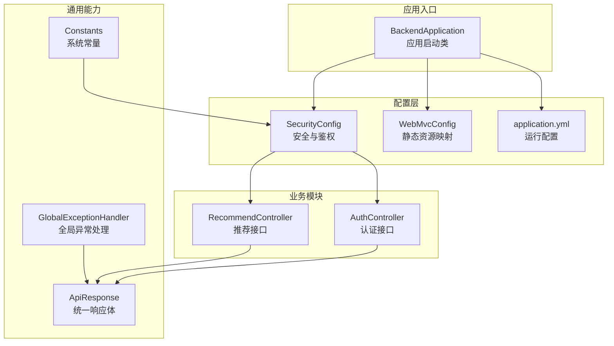
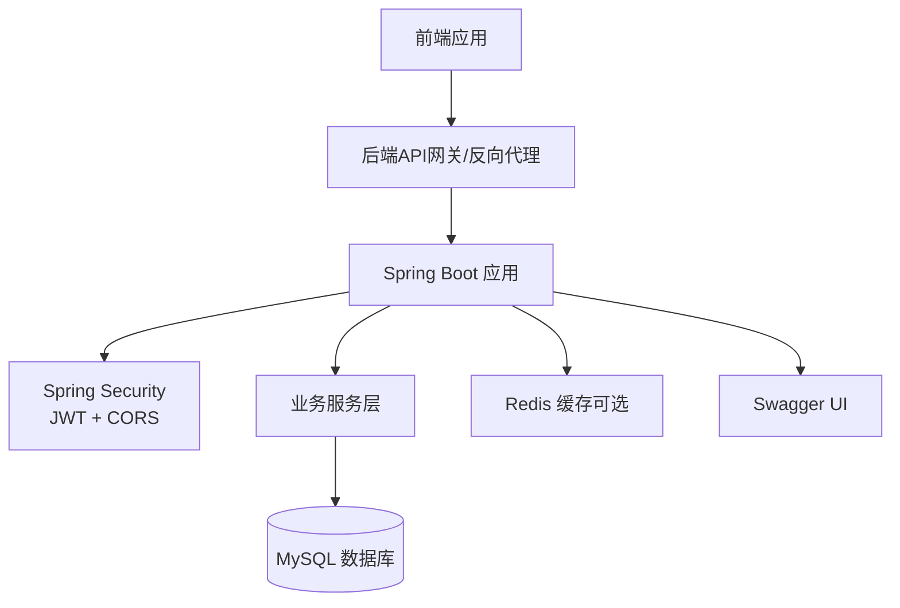
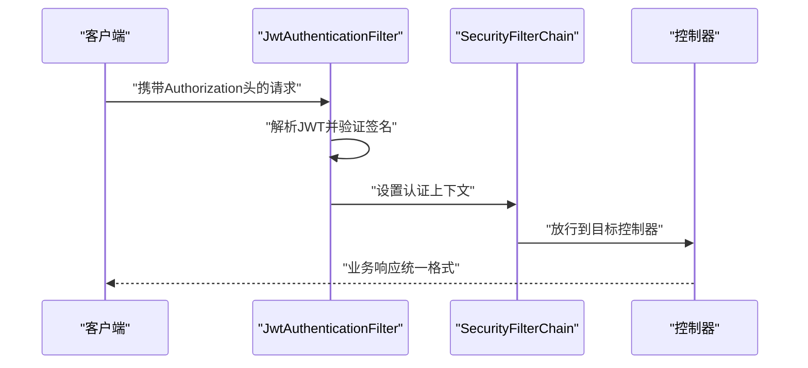
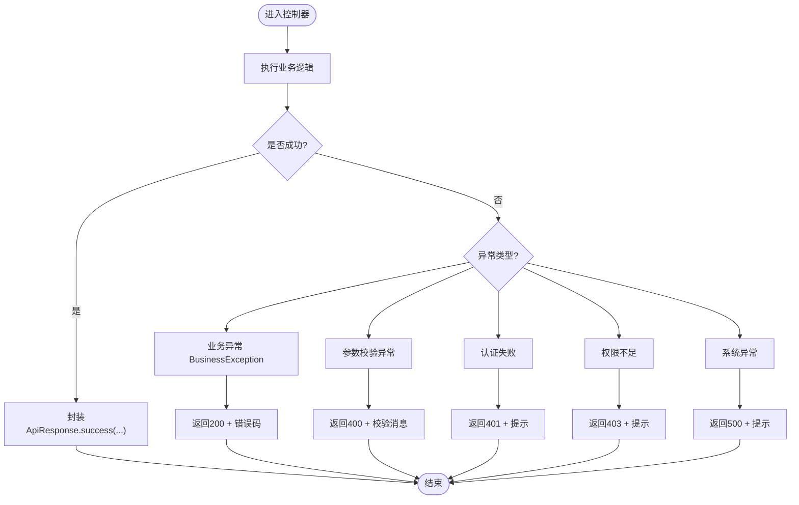
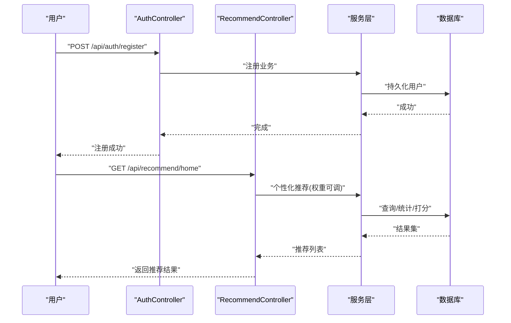
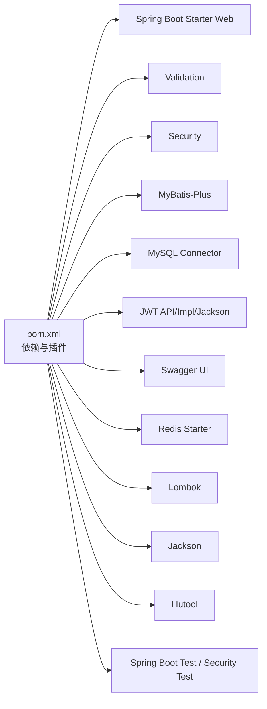

# 开发流程

<cite>
**本文引用的文件**
- [pom.xml](file://pom.xml)
- [application.yml](file://src/main/resources/application.yml)
- [BackendApplication.java](file://src/main/java/org/example/backend/BackendApplication.java)
- [SecurityConfig.java](file://src/main/java/org/example/backend/config/SecurityConfig.java)
- [WebMvcConfig.java](file://src/main/java/org/example/backend/config/WebMvcConfig.java)
- [GlobalExceptionHandler.java](file://src/main/java/org/example/backend/common/exception/GlobalExceptionHandler.java)
- [ApiResponse.java](file://src/main/java/org/example/backend/common/ApiResponse.java)
- [Constants.java](file://src/main/java/org/example/backend/common/constants/Constants.java)
- [AuthController.java](file://src/main/java/org/example/backend/modules/auth/controller/AuthController.java)
- [RecommendController.java](file://src/main/java/org/example/backend/modules/recommend/controller/RecommendController.java)
- [.gitignore](file://.gitignore)
- [HELP.md](file://HELP.md)
</cite>

## 目录
1. [引言](#引言)
2. [项目结构](#项目结构)
3. [核心组件](#核心组件)
4. [架构总览](#架构总览)
5. [详细组件分析](#详细组件分析)
6. [依赖分析](#依赖分析)
7. [性能考虑](#性能考虑)
8. [故障排查指南](#故障排查指南)
9. [结论](#结论)
10. [附录](#附录)

## 引言
本文件面向智能图书推荐系统的后端团队，提供从需求分析到代码上线的标准化开发流程与DevOps实践指南。内容覆盖Git分支管理策略、功能分支创建与合并流程、代码审查标准、Pull Request规范、合并条件、持续集成与自动化测试、部署前检查清单、版本发布与回滚策略，并结合Spring Boot与Maven的实际使用场景给出可落地的工程化建议。

## 项目结构
后端采用Spring Boot + MyBatis-Plus + Maven的标准分层架构，主要模块包括认证、图书、交互、推荐、搜索、用户与管理等子系统，配合统一响应体、全局异常处理、安全配置与跨域支持，形成清晰的职责边界与扩展空间。

图表来源
- [BackendApplication.java](file://src/main/java/org/example/backend/BackendApplication.java#L1-L14)
- [SecurityConfig.java](file://src/main/java/org/example/backend/config/SecurityConfig.java#L1-L101)
- [WebMvcConfig.java](file://src/main/java/org/example/backend/config/WebMvcConfig.java#L1-L29)
- [application.yml](file://src/main/resources/application.yml#L1-L71)
- [ApiResponse.java](file://src/main/java/org/example/backend/common/ApiResponse.java#L1-L89)
- [GlobalExceptionHandler.java](file://src/main/java/org/example/backend/common/exception/GlobalExceptionHandler.java#L1-L111)
- [Constants.java](file://src/main/java/org/example/backend/common/constants/Constants.java#L1-L79)
- [AuthController.java](file://src/main/java/org/example/backend/modules/auth/controller/AuthController.java#L1-L41)
- [RecommendController.java](file://src/main/java/org/example/backend/modules/recommend/controller/RecommendController.java#L1-L130)

章节来源
- [BackendApplication.java](file://src/main/java/org/example/backend/BackendApplication.java#L1-L14)
- [application.yml](file://src/main/resources/application.yml#L1-L71)
- [pom.xml](file://pom.xml#L1-L161)

## 核心组件
- 应用启动类负责引导Spring Boot容器加载配置与组件扫描。
- 安全配置启用无状态会话、CORS、公开接口白名单与基于角色的访问控制。
- Web MVC配置将本地文件上传目录映射为静态资源访问路径。
- 统一响应体封装所有接口返回格式，便于前端消费与监控。
- 全局异常处理器集中处理业务异常、参数校验异常、认证与权限异常及未知异常。
- 常量类集中管理令牌前缀、分页默认值、角色与状态枚举等系统级常量。
- 控制器层提供认证与推荐相关接口，遵循REST风格并标注OpenAPI信息。

章节来源
- [BackendApplication.java](file://src/main/java/org/example/backend/BackendApplication.java#L1-L14)
- [SecurityConfig.java](file://src/main/java/org/example/backend/config/SecurityConfig.java#L1-L101)
- [WebMvcConfig.java](file://src/main/java/org/example/backend/config/WebMvcConfig.java#L1-L29)
- [ApiResponse.java](file://src/main/java/org/example/backend/common/ApiResponse.java#L1-L89)
- [GlobalExceptionHandler.java](file://src/main/java/org/example/backend/common/exception/GlobalExceptionHandler.java#L1-L111)
- [Constants.java](file://src/main/java/org/example/backend/common/constants/Constants.java#L1-L79)
- [AuthController.java](file://src/main/java/org/example/backend/modules/auth/controller/AuthController.java#L1-L41)
- [RecommendController.java](file://src/main/java/org/example/backend/modules/recommend/controller/RecommendController.java#L1-L130)

## 架构总览
系统采用前后端分离架构，后端通过REST接口提供认证、推荐、图书检索与交互等功能；安全层基于JWT与Spring Security实现无状态鉴权；MyBatis-Plus负责数据库访问；Swagger提供在线接口文档；Maven管理依赖与构建。

图表来源
- [SecurityConfig.java](file://src/main/java/org/example/backend/config/SecurityConfig.java#L46-L81)
- [application.yml](file://src/main/resources/application.yml#L10-L43)
- [application.yml](file://src/main/resources/application.yml#L49-L56)

## 详细组件分析

### 安全与鉴权组件
- 无状态会话策略：禁用CSRF，使用STATELESS会话策略，确保多实例水平扩展。
- 路由白名单：认证、Swagger、公开图书接口、评论列表、推荐接口、静态资源等无需认证。
- 角色控制：管理端接口要求ADMIN角色。
- CORS：允许任意来源、方法与头，支持凭据与预检缓存。
- 过滤器链：在用户名密码过滤器之前插入JWT过滤器进行令牌解析与用户注入。

图表来源
- [SecurityConfig.java](file://src/main/java/org/example/backend/config/SecurityConfig.java#L32-L81)
- [WebMvcConfig.java](file://src/main/java/org/example/backend/config/WebMvcConfig.java#L12-L25)
- [ApiResponse.java](file://src/main/java/org/example/backend/common/ApiResponse.java#L42-L58)

章节来源
- [SecurityConfig.java](file://src/main/java/org/example/backend/config/SecurityConfig.java#L1-L101)
- [Constants.java](file://src/main/java/org/example/backend/common/constants/Constants.java#L9-L21)

### 统一响应与异常处理
- 统一响应体：包含状态码、消息与数据三段式结构，便于前端一致化处理。
- 异常分类：业务异常、参数校验异常（多种绑定形式）、认证失败、权限不足、系统异常。
- 返回策略：业务异常以200状态码返回错误码与消息；参数校验与认证/权限异常返回对应HTTP状态码；未知异常返回500。

图表来源
- [GlobalExceptionHandler.java](file://src/main/java/org/example/backend/common/exception/GlobalExceptionHandler.java#L33-L108)
- [ApiResponse.java](file://src/main/java/org/example/backend/common/ApiResponse.java#L42-L86)

章节来源
- [GlobalExceptionHandler.java](file://src/main/java/org/example/backend/common/exception/GlobalExceptionHandler.java#L1-L111)
- [ApiResponse.java](file://src/main/java/org/example/backend/common/ApiResponse.java#L1-L89)

### 认证与推荐接口
- 认证接口：注册与登录，返回登录VO，供前端存储令牌与用户信息。
- 推荐接口：首页个性化推荐、新书、热门、主题、相似图书、关联阅读、曝光/点击/反馈、热门主题、长尾推荐等。
- 用户上下文：通过UserContext获取当前登录用户ID，用于行为记录与个性化计算。

图表来源
- [AuthController.java](file://src/main/java/org/example/backend/modules/auth/controller/AuthController.java#L26-L38)
- [RecommendController.java](file://src/main/java/org/example/backend/modules/recommend/controller/RecommendController.java#L27-L127)

章节来源
- [AuthController.java](file://src/main/java/org/example/backend/modules/auth/controller/AuthController.java#L1-L41)
- [RecommendController.java](file://src/main/java/org/example/backend/modules/recommend/controller/RecommendController.java#L1-L130)

## 依赖分析
- 构建工具：Maven管理依赖与打包，Spring Boot插件负责可执行JAR生成。
- 运行配置：application.yml集中管理服务器端口、数据源、MyBatis-Plus、Redis、JWT、Swagger、文件上传与日志级别。
- 依赖关系：Spring Web、Validation、Security、MySQL驱动、MyBatis-Plus、JWT、Swagger、Redis、Lombok、Jackson、Hutool、测试依赖。

图表来源
- [pom.xml](file://pom.xml#L19-L115)
- [application.yml](file://src/main/resources/application.yml#L1-L71)

章节来源
- [pom.xml](file://pom.xml#L1-L161)
- [application.yml](file://src/main/resources/application.yml#L1-L71)

## 性能考虑
- 无状态设计：避免会话粘性，利于横向扩展与负载均衡。
- 缓存策略：可选Redis用于热点数据与会话缓存，需结合业务热点评估。
- 分页与限制：默认分页与最大分页在常量中集中管理，防止超大查询。
- 日志级别：生产环境建议提升根日志级别，仅保留必要DEBUG级别以便观测。
- SQL优化：MyBatis-Plus开启驼峰映射与日志输出，便于定位慢SQL。

章节来源
- [SecurityConfig.java](file://src/main/java/org/example/backend/config/SecurityConfig.java#L50-L76)
- [Constants.java](file://src/main/java/org/example/backend/common/constants/Constants.java#L24-L31)
- [application.yml](file://src/main/resources/application.yml#L64-L71)

## 故障排查指南
- 启动失败：检查application.yml中的数据库连接、端口占用与JVM版本。
- 认证问题：确认Authorization头格式（Bearer Token），核对JWT密钥与过期时间。
- 参数校验失败：关注全局异常返回的字段校验消息，逐项修正请求体。
- 权限不足：确认用户角色与受保护接口的访问规则。
- 文件上传：确认上传目录与URL前缀配置，以及静态资源映射是否生效。

章节来源
- [application.yml](file://src/main/resources/application.yml#L1-L71)
- [GlobalExceptionHandler.java](file://src/main/java/org/example/backend/common/exception/GlobalExceptionHandler.java#L43-L78)
- [WebMvcConfig.java](file://src/main/java/org/example/backend/config/WebMvcConfig.java#L14-L25)

## 结论
本开发流程文档以Spring Boot与Maven为基础，结合统一响应、全局异常、安全配置与OpenAPI，给出了从需求到上线的标准化实践。建议团队严格遵循分支策略、代码审查与CI/CD流程，确保质量与交付效率。

## 附录

### Git分支管理策略
- 主干分支
  - main：稳定发布分支，仅允许通过PR合并。
  - develop：开发主分支，日常功能在此合并。
- 功能分支
  - 命名规范：feature/模块名/任务简述
  - 创建时机：新功能开发前从develop切出
  - 同步策略：定期rebase develop，保持线性历史
- 发布分支
  - 命名规范：release/vX.Y.Z
  - 用途：修复紧急问题、准备发布包
- 热修复分支
  - 命名规范：hotfix/问题简述
  - 合并：同时合并至main与develop

### Pull Request规范
- 必填要素
  - 标题简洁明确，描述变更动机与范围
  - 关联Issue或需求文档链接
  - 变更摘要与风险说明
- 审查清单
  - 单元测试覆盖率与通过率
  - 代码风格与命名一致性
  - 安全与性能影响评估
  - 文档更新（OpenAPI、README）
- 合并条件
  - 至少一名审查者批准
  - CI流水线全部通过
  - 无未解决冲突
  - 代码异味与安全扫描通过

### 持续集成与自动化测试
- 构建与测试
  - Maven命令：编译、测试、打包
  - 测试策略：单元测试、集成测试、API测试
- 安全扫描
  - 依赖漏洞扫描（如OWASP Dependency-Check）
  - 代码质量扫描（SonarQube/SpotBugs）
- 部署前检查清单
  - 依赖版本一致性
  - 配置文件环境变量替换
  - 数据库迁移脚本（如有）
  - 健康检查与端到端测试

### 版本发布与回滚
- 版本号规范：语义化版本（主.次.修订）
- 发布流程
  - 在release分支打标签并构建制品
  - 更新CHANGELOG，记录变更与已知问题
  - 推送镜像/制品至制品库
- 回滚策略
  - 快速回滚：回退到上一个稳定版本
  - 渐进式回滚：灰度释放回退版本
  - 数据回滚：必要时执行数据库备份恢复

### 部署与运维要点
- 运行配置
  - 使用环境变量覆盖敏感配置
  - 生产日志级别与输出位置
- 健康检查
  - 提供/health端点（如需）
  - 监控CPU、内存、连接池与慢查询
- 备份与恢复
  - 数据库定时备份
  - 配置与日志归档策略

### 与Spring Boot/Maven的结合实践
- 依赖管理
  - 使用dependencyManagement统一版本
  - 明确作用域（compile/runtime/test）
- 插件配置
  - spring-boot-maven-plugin指定主类与repackage
  - 编译插件设置源/目标版本与编码
- 打包与运行
  - mvn clean package生成可执行JAR
  - java -jar启动，或容器化部署

章节来源
- [pom.xml](file://pom.xml#L128-L157)
- [HELP.md](file://HELP.md#L1-L18)
- [.gitignore](file://.gitignore#L1-L34)