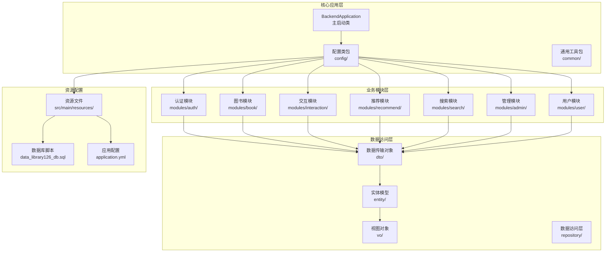
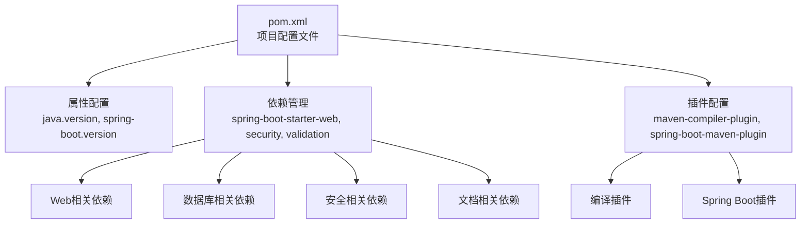
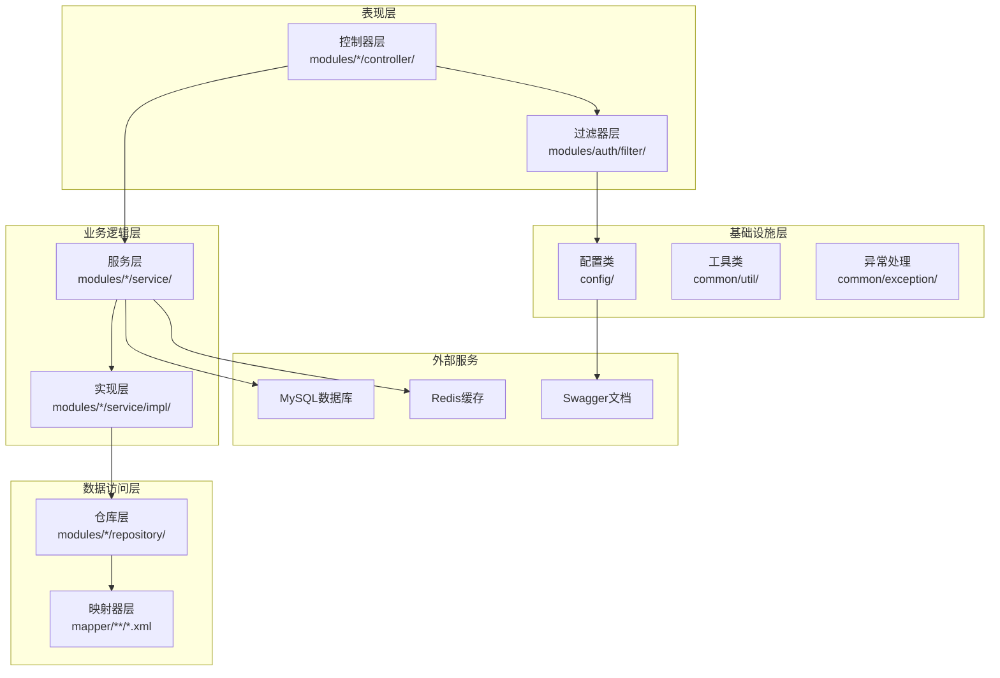
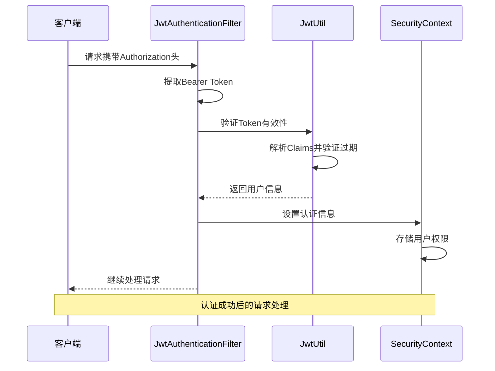
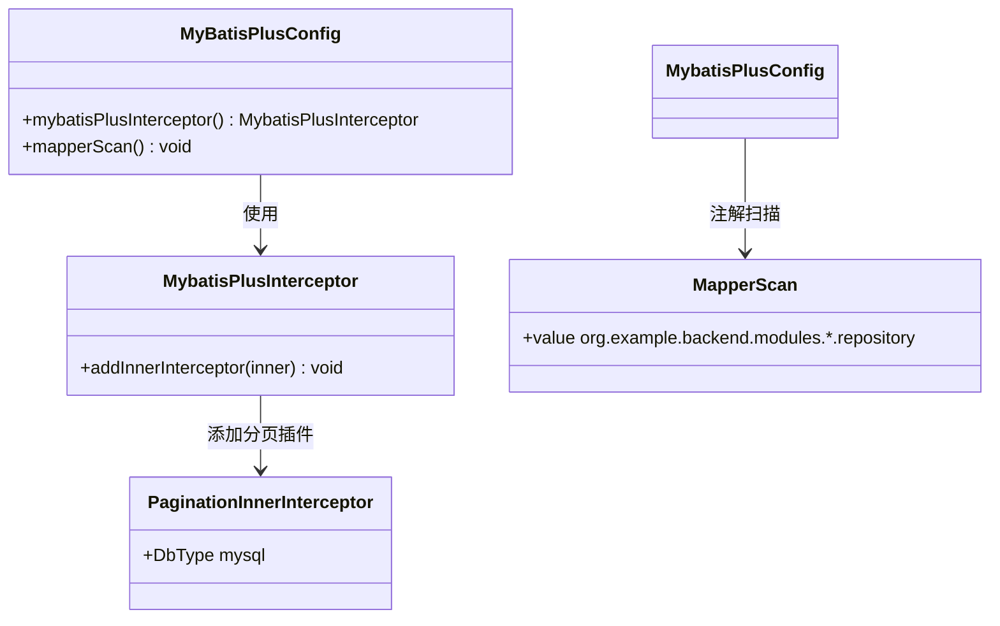
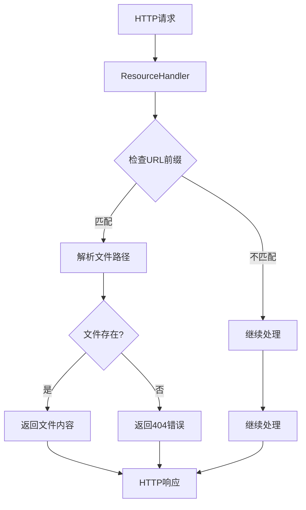
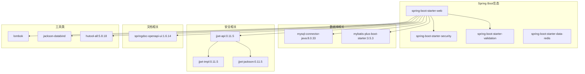

# 开发环境配置

<cite>
**本文档引用的文件**
- [pom.xml](file://pom.xml)
- [application.yml](file://src/main/resources/application.yml)
- [BackendApplication.java](file://src/main/java/org/example/backend/BackendApplication.java)
- [JwtUtil.java](file://src/main/java/org/example/backend/config/JwtUtil.java)
- [SwaggerConfig.java](file://src/main/java/org/example/backend/config/SwaggerConfig.java)
- [WebMvcConfig.java](file://src/main/java/org/example/backend/config/WebMvcConfig.java)
- [SecurityConfig.java](file://src/main/java/org/example/backend/config/SecurityConfig.java)
- [MyBatisPlusConfig.java](file://src/main/java/org/example/backend/config/MyBatisPlusConfig.java)
- [JwtAuthenticationFilter.java](file://src/main/java/org/example/backend/modules/auth/filter/JwtAuthenticationFilter.java)
- [data_library126_db.sql](file://src/main/resources/data_library126_db.sql)
- [misc.xml](file://.idea/misc.xml)
- [compiler.xml](file://.idea/compiler.xml)
- [workspace.xml](file://.idea/workspace.xml)
- [HELP.md](file://HELP.md)
</cite>

## 目录
1. [简介](#简介)
2. [项目结构](#项目结构)
3. [核心组件](#核心组件)
4. [架构概览](#架构概览)
5. [详细组件分析](#详细组件分析)
6. [依赖分析](#依赖分析)
7. [性能考虑](#性能考虑)
8. [故障排除指南](#故障排除指南)
9. [结论](#结论)
10. [附录](#附录)

## 简介

智能图书推荐系统是一个基于Spring Boot的后端服务，采用现代化的微服务架构设计。本项目实现了完整的图书推荐功能，包括用户行为分析、协同过滤算法、内容推荐策略等核心业务逻辑。

项目采用多模块架构，包含认证授权、图书管理、交互功能、推荐引擎、搜索服务等多个功能模块。系统支持RESTful API设计，提供完整的Swagger文档，具备良好的扩展性和维护性。

## 项目结构

该项目采用标准的Maven多模块项目结构，主要分为以下几个核心部分：

**图表来源**
- [BackendApplication.java](file://src/main/java/org/example/backend/BackendApplication.java#L1-L14)
- [pom.xml](file://pom.xml#L1-L161)

**章节来源**
- [pom.xml](file://pom.xml#L1-L161)
- [BackendApplication.java](file://src/main/java/org/example/backend/BackendApplication.java#L1-L14)

## 核心组件

### JDK版本要求

项目使用Java 8作为开发和运行环境，确保与Spring Boot 2.6.13版本的兼容性。建议使用以下版本组合：

- **JDK版本**: Java 8 (1.8)
- **Spring Boot版本**: 2.6.13
- **MySQL驱动**: 8.0.33
- **MyBatis-Plus版本**: 3.5.3

### Maven项目配置

项目采用Maven作为构建工具，配置了完整的依赖管理和构建流程：

**图表来源**
- [pom.xml](file://pom.xml#L10-L161)

**章节来源**
- [pom.xml](file://pom.xml#L10-L161)
- [.idea/misc.xml](file://.idea/misc.xml#L1-L12)

### 数据库连接配置

系统默认配置了本地MySQL数据库连接，支持完整的图书推荐业务数据存储：

- **数据库类型**: MySQL 8.0+
- **默认端口**: 3306
- **默认数据库名**: library_db
- **默认用户名**: root
- **默认密码**: 123456
- **字符集**: UTF-8 (utf8mb4)
- **时区**: Asia/Shanghai

**章节来源**
- [application.yml](file://src/main/resources/application.yml#L11-L15)

### JWT密钥设置

项目实现了基于JWT的无状态认证机制，配置了完整的密钥管理和过期时间控制：

- **密钥长度**: 至少256位（符合HS256算法要求）
- **默认密钥**: your-secret-key-must-be-at-least-256-bits-long-for-HS256-algorithm
- **过期时间**: 24小时（86400000毫秒）
- **签名算法**: HS256

**章节来源**
- [application.yml](file://src/main/resources/application.yml#L45-L47)
- [JwtUtil.java](file://src/main/java/org/example/backend/config/JwtUtil.java#L21-L25)

### Swagger API文档配置

系统集成了SpringDoc OpenAPI，提供完整的API文档和测试界面：

- **API文档路径**: /v3/api-docs
- **Swagger UI路径**: /swagger-ui.html
- **启用状态**: true
- **文档版本**: 1.0.0
- **项目名称**: 智能图书推荐系统 API

**章节来源**
- [application.yml](file://src/main/resources/application.yml#L50-L55)
- [SwaggerConfig.java](file://src/main/java/org/example/backend/config/SwaggerConfig.java#L15-L25)

## 架构概览

系统采用分层架构设计，实现了清晰的关注点分离：

**图表来源**
- [SecurityConfig.java](file://src/main/java/org/example/backend/config/SecurityConfig.java#L46-L81)
- [JwtAuthenticationFilter.java](file://src/main/java/org/example/backend/modules/auth/filter/JwtAuthenticationFilter.java#L23-L56)

**章节来源**
- [SecurityConfig.java](file://src/main/java/org/example/backend/config/SecurityConfig.java#L27-L101)
- [JwtAuthenticationFilter.java](file://src/main/java/org/example/backend/modules/auth/filter/JwtAuthenticationFilter.java#L1-L70)

## 详细组件分析

### 安全配置组件

系统实现了基于JWT的无状态认证机制，支持多种权限级别的访问控制：

**图表来源**
- [JwtAuthenticationFilter.java](file://src/main/java/org/example/backend/modules/auth/filter/JwtAuthenticationFilter.java#L29-L56)
- [JwtUtil.java](file://src/main/java/org/example/backend/config/JwtUtil.java#L30-L81)

**章节来源**
- [SecurityConfig.java](file://src/main/java/org/example/backend/config/SecurityConfig.java#L46-L81)
- [JwtAuthenticationFilter.java](file://src/main/java/org/example/backend/modules/auth/filter/JwtAuthenticationFilter.java#L23-L68)

### 数据库配置组件

MyBatis-Plus配置实现了完整的分页查询和逻辑删除功能：

**图表来源**
- [MyBatisPlusConfig.java](file://src/main/java/org/example/backend/config/MyBatisPlusConfig.java#L14-L25)

**章节来源**
- [MyBatisPlusConfig.java](file://src/main/java/org/example/backend/config/MyBatisPlusConfig.java#L1-L28)

### 文件上传配置组件

系统支持静态资源访问和文件上传功能：

**图表来源**
- [WebMvcConfig.java](file://src/main/java/org/example/backend/config/WebMvcConfig.java#L21-L25)

**章节来源**
- [WebMvcConfig.java](file://src/main/java/org/example/backend/config/WebMvcConfig.java#L1-L29)

### API路由配置组件

系统实现了灵活的权限控制和路由管理：

| 路径模式 | 权限要求 | 描述 |
|---------|---------|------|
| `/api/auth/**` | 匿名访问 | 用户认证相关接口 |
| `/api/books/list` | 匿名访问 | 图书列表查询 |
| `/api/books/detail/**` | 匿名访问 | 图书详情查询 |
| `/api/books/search` | 匿名访问 | 图书搜索功能 |
| `/api/interaction/comments` | GET匿名访问 | 评论列表 |
| `/api/recommend/**` | 匿名访问 | 推荐算法接口 |
| `/api/admin/**` | ADMIN角色 | 管理员后台接口 |
| `/uploads/**` | 匿名访问 | 文件上传访问 |

**章节来源**
- [SecurityConfig.java](file://src/main/java/org/example/backend/config/SecurityConfig.java#L54-L76)

## 依赖分析

项目依赖关系采用Maven管理，实现了清晰的模块化设计：

**图表来源**
- [pom.xml](file://pom.xml#L19-L115)

**章节来源**
- [pom.xml](file://pom.xml#L19-L126)

## 性能考虑

### 缓存策略

系统集成了Redis作为缓存层，建议配置合理的缓存策略：

- **缓存键前缀**: `library:recommend:`
- **缓存过期时间**: 5-15分钟（根据业务需求调整）
- **热点数据**: 推荐结果、热门图书、用户偏好
- **失效策略**: LRU淘汰，支持手动清理

### 数据库优化

- **索引设计**: 为常用查询字段建立复合索引
- **分页查询**: 使用MyBatis-Plus分页插件
- **连接池**: 配置合理的最大连接数和超时时间
- **慢查询**: 启用日志监控慢查询操作

### 并发处理

- **线程池**: 为耗时操作配置独立线程池
- **限流策略**: 对API接口实施合理的QPS限制
- **降级预案**: 在高负载时提供基础功能保证

## 故障排除指南

### 常见启动问题

**问题1: 数据库连接失败**
- 检查MySQL服务是否启动
- 验证数据库连接参数配置
- 确认数据库用户权限设置

**问题2: JWT密钥验证失败**
- 确认密钥长度至少256位
- 检查密钥配置格式
- 验证Token生成和解析流程

**问题3: Swagger文档无法访问**
- 确认springdoc配置正确
- 检查CORS跨域设置
- 验证API路径映射

### 调试技巧

1. **日志级别**: 将`org.example.backend`设置为DEBUG级别
2. **数据库日志**: 启用MyBatis SQL日志输出
3. **网络抓包**: 使用工具监控API请求响应
4. **内存监控**: 关注GC和堆内存使用情况

**章节来源**
- [application.yml](file://src/main/resources/application.yml#L64-L71)
- [HELP.md](file://HELP.md#L1-L18)

## 结论

智能图书推荐系统的开发环境配置完整且规范，采用了现代化的Spring Boot技术栈和最佳实践。项目结构清晰，依赖管理合理，配置文件完整，为后续的功能扩展和维护奠定了良好基础。

通过遵循本文档的配置指南，开发者可以快速搭建一致的开发环境，确保团队协作的效率和质量。建议在实际开发中持续关注依赖版本更新，及时应用安全补丁，并根据业务发展调整配置参数。

## 附录

### 开发环境要求清单

| 组件 | 版本要求 | 用途 |
|------|----------|------|
| JDK | 1.8 | 编译和运行 |
| Maven | 3.6+ | 项目构建 |
| MySQL | 8.0+ | 数据存储 |
| Redis | 5.0+ | 缓存服务 |
| IntelliJ IDEA | 2023+ | 开发工具 |

### 快速启动步骤

1. **克隆项目**: `git clone [repository-url]`
2. **安装依赖**: `mvn install`
3. **启动数据库**: 确保MySQL服务运行
4. **导入项目**: 在IDE中导入Maven项目
5. **运行应用**: 执行`BackendApplication.main()`

### 配置文件位置

- **主配置**: `src/main/resources/application.yml`
- **数据库脚本**: `src/main/resources/data_library126_db.sql`
- **IDE配置**: `.idea/`目录下的XML文件