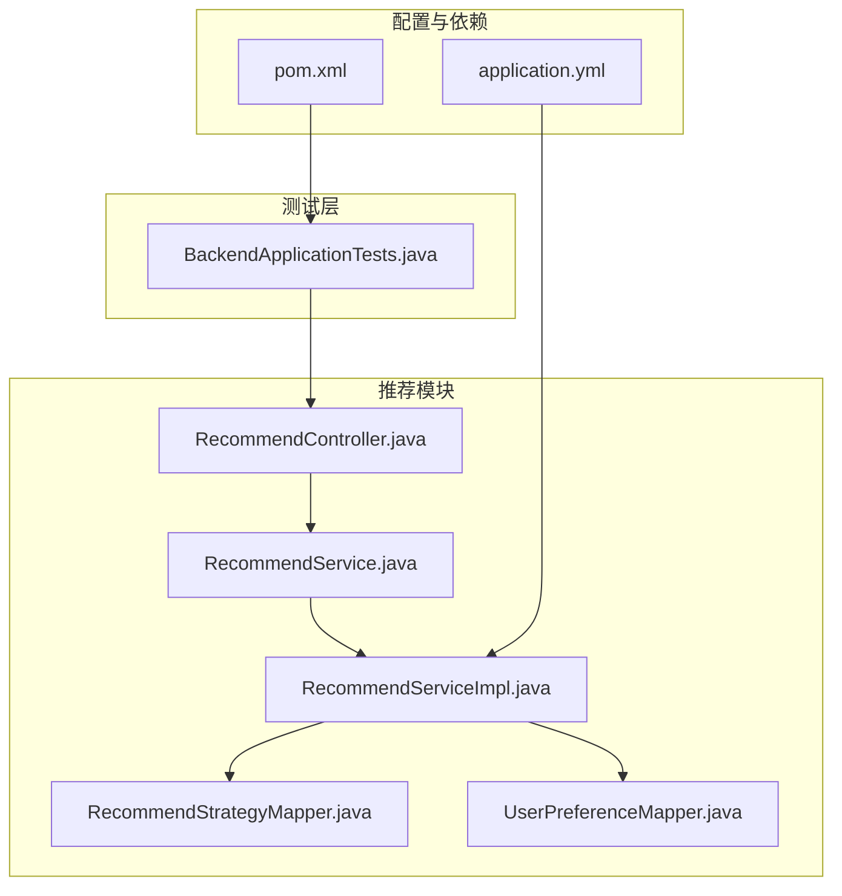
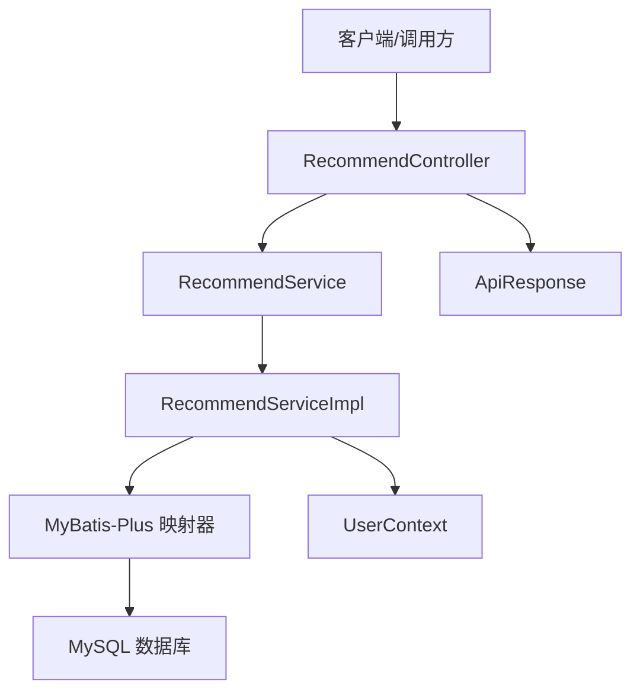
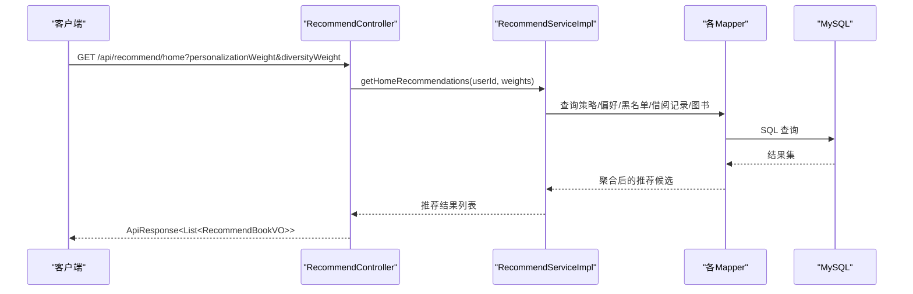
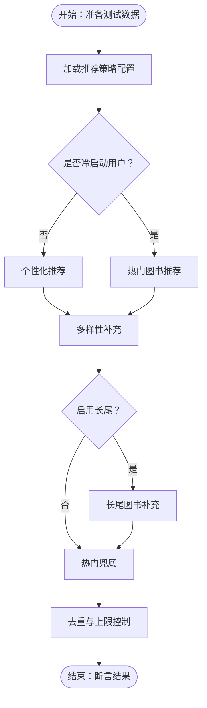
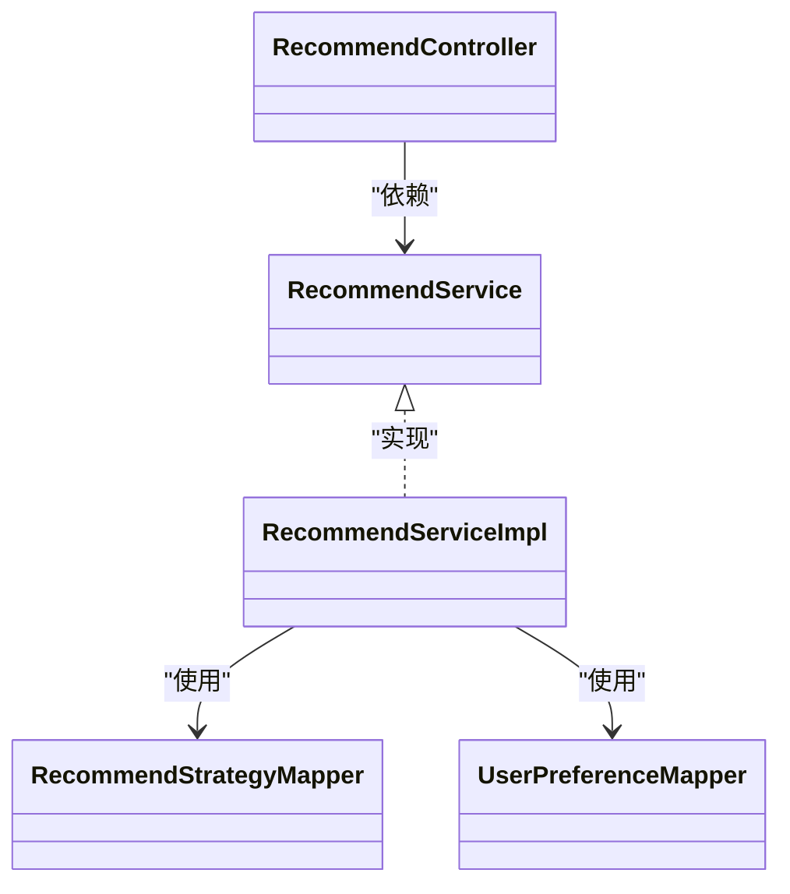

# 测试策略

<cite>
**本文引用的文件**
- [BackendApplicationTests.java](file://src/test/java/org/example/backend/BackendApplicationTests.java)
- [pom.xml](file://pom.xml)
- [application.yml](file://src/main/resources/application.yml)
- [RecommendService.java](file://src/main/java/org/example/backend/modules/recommend/service/RecommendService.java)
- [RecommendServiceImpl.java](file://src/main/java/org/example/backend/modules/recommend/service/impl/RecommendServiceImpl.java)
- [RecommendController.java](file://src/main/java/org/example/backend/modules/recommend/controller/RecommendController.java)
- [RecommendStrategyMapper.java](file://src/main/java/org/example/backend/modules/recommend/repository/RecommendStrategyMapper.java)
- [UserPreferenceMapper.java](file://src/main/java/org/example/backend/modules/recommend/repository/UserPreferenceMapper.java)
- [RecommendStrategy.java](file://src/main/java/org/example/backend/entity/RecommendStrategy.java)
- [UserPreference.java](file://src/main/java/org/example/backend/entity/UserPreference.java)
- [UserContext.java](file://src/main/java/org/example/backend/common/util/UserContext.java)
</cite>

## 目录
1. [引言](#引言)
2. [项目结构](#项目结构)
3. [核心组件](#核心组件)
4. [架构总览](#架构总览)
5. [详细组件分析](#详细组件分析)
6. [依赖关系分析](#依赖关系分析)
7. [性能考虑](#性能考虑)
8. [故障排查指南](#故障排查指南)
9. [结论](#结论)
10. [附录](#附录)

## 引言
本测试策略文档面向智能图书推荐系统，围绕单元测试、集成测试、API测试、数据库测试、推荐算法验证、性能与负载测试、覆盖率要求、测试数据准备与环境搭建等方面，提供可操作的规范与最佳实践。文档以项目现有代码为依据，结合推荐模块的业务逻辑与技术实现，给出分层测试建议与可视化图示。

## 项目结构
后端采用 Spring Boot 标准工程结构，测试入口位于 src/test 下，核心推荐功能位于 modules/recommend 包内，包含控制器、服务与持久层 Mapper。应用配置集中在 application.yml 中，Maven 构建与依赖在 pom.xml 中定义。

**图表来源**
- [BackendApplicationTests.java](file://src/test/java/org/example/backend/BackendApplicationTests.java#L1-L14)
- [RecommendController.java](file://src/main/java/org/example/backend/modules/recommend/controller/RecommendController.java#L1-L130)
- [RecommendService.java](file://src/main/java/org/example/backend/modules/recommend/service/RecommendService.java#L1-L70)
- [RecommendServiceImpl.java](file://src/main/java/org/example/backend/modules/recommend/service/impl/RecommendServiceImpl.java#L1-L927)
- [RecommendStrategyMapper.java](file://src/main/java/org/example/backend/modules/recommend/repository/RecommendStrategyMapper.java#L1-L14)
- [UserPreferenceMapper.java](file://src/main/java/org/example/backend/modules/recommend/repository/UserPreferenceMapper.java#L1-L14)
- [pom.xml](file://pom.xml#L1-L161)
- [application.yml](file://src/main/resources/application.yml#L1-L71)

**章节来源**
- [BackendApplicationTests.java](file://src/test/java/org/example/backend/BackendApplicationTests.java#L1-L14)
- [pom.xml](file://pom.xml#L1-L161)
- [application.yml](file://src/main/resources/application.yml#L1-L71)

## 核心组件
- 推荐控制器：提供首页推荐、新书、热门、主题、相似、关联、曝光、点击、反馈、热门主题、长尾等接口，统一返回 ApiResponse 包装。
- 推荐服务接口与实现：封装个性化、多样性、长尾、冷启动等策略，组合多张表查询与聚合逻辑。
- 推荐策略与用户偏好：通过 Mapper 读取策略配置与用户偏好，驱动推荐权重与内容选择。
- 用户上下文：从安全上下文或请求属性中提取当前用户标识，供控制器与服务使用。

**章节来源**
- [RecommendController.java](file://src/main/java/org/example/backend/modules/recommend/controller/RecommendController.java#L1-L130)
- [RecommendService.java](file://src/main/java/org/example/backend/modules/recommend/service/RecommendService.java#L1-L70)
- [RecommendServiceImpl.java](file://src/main/java/org/example/backend/modules/recommend/service/impl/RecommendServiceImpl.java#L1-L927)
- [RecommendStrategyMapper.java](file://src/main/java/org/example/backend/modules/recommend/repository/RecommendStrategyMapper.java#L1-L14)
- [UserPreferenceMapper.java](file://src/main/java/org/example/backend/modules/recommend/repository/UserPreferenceMapper.java#L1-L14)
- [UserContext.java](file://src/main/java/org/example/backend/common/util/UserContext.java#L1-L50)

## 架构总览
推荐模块遵循典型的 MVC 分层：Controller 负责参数解析与响应包装；Service 实现业务规则与策略；Repository Mapper 提供数据访问；Entity 与 VO 作为数据载体。整体通过 Spring 容器装配，配合 MyBatis-Plus 与数据源配置。

**图表来源**
- [RecommendController.java](file://src/main/java/org/example/backend/modules/recommend/controller/RecommendController.java#L1-L130)
- [RecommendServiceImpl.java](file://src/main/java/org/example/backend/modules/recommend/service/impl/RecommendServiceImpl.java#L1-L927)
- [UserContext.java](file://src/main/java/org/example/backend/common/util/UserContext.java#L1-L50)
- [application.yml](file://src/main/resources/application.yml#L1-L71)

## 详细组件分析

### 单元测试编写规范
- 测试类命名：以被测类名+Test 结尾，例如 RecommendServiceImplTest。
- 测试方法命名：使用语义化命名，如 testGetHomeRecommendations_WithValidInputs_ReturnsExpected。
- 断言风格：优先使用断言集合大小、字段相等、异常类型等明确条件。
- 测试隔离：每个测试独立运行，避免共享状态；必要时使用 @BeforeEach/@AfterEach 清理。
- 参数化测试：对边界值与典型输入进行组合覆盖，如 limit=0、limit=1、limit=正大数。
- Mock 对象：使用 Mockito 模拟 Mapper 与外部依赖，确保单元测试聚焦业务逻辑。

**章节来源**
- [RecommendServiceImpl.java](file://src/main/java/org/example/backend/modules/recommend/service/impl/RecommendServiceImpl.java#L1-L927)
- [RecommendStrategyMapper.java](file://src/main/java/org/example/backend/modules/recommend/repository/RecommendStrategyMapper.java#L1-L14)
- [UserPreferenceMapper.java](file://src/main/java/org/example/backend/modules/recommend/repository/UserPreferenceMapper.java#L1-L14)

### 测试用例设计原则
- 功能覆盖：至少覆盖首页推荐、新书、热门、主题、相似、关联、曝光、点击、反馈、热门主题、长尾等主要接口。
- 边界与异常：空输入、空结果集、权限缺失、策略表缺失、阈值越界等。
- 策略分支：冷启动用户、老用户、多样性权重为0、长尾开关关闭等分支。
- 数据一致性：黑名单、运营位、去重与上限控制。

**章节来源**
- [RecommendController.java](file://src/main/java/org/example/backend/modules/recommend/controller/RecommendController.java#L1-L130)
- [RecommendServiceImpl.java](file://src/main/java/org/example/backend/modules/recommend/service/impl/RecommendServiceImpl.java#L1-L927)

### Mock 对象使用方法
- 使用 @Mock 注入 Mapper 与依赖，@InjectMocks 创建被测 Service 实例。
- 使用 @RunWith(MockitoJUnitRunner.class) 或 @ExtendWith(MockitoExtension.class) 启用 Mockito。
- 使用 when(...).thenReturn(...) 配置返回值；verify(...) 校验调用次数与参数。
- 对复杂查询使用 ArgumentCaptor 捕获查询条件，断言查询参数正确性。

**章节来源**
- [RecommendServiceImpl.java](file://src/main/java/org/example/backend/modules/recommend/service/impl/RecommendServiceImpl.java#L1-L927)
- [RecommendStrategyMapper.java](file://src/main/java/org/example/backend/modules/recommend/repository/RecommendStrategyMapper.java#L1-L14)
- [UserPreferenceMapper.java](file://src/main/java/org/example/backend/modules/recommend/repository/UserPreferenceMapper.java#L1-L14)

### 集成测试策略
- 控制器集成：使用 @WebMvcTest 或 @SpringBootTest 启动 Web 层，验证请求到响应的完整链路。
- 服务集成：在 @SpringBootTest 中加载完整上下文，验证策略配置、黑名单、用户偏好等跨组件协作。
- 数据访问集成：验证 MyBatis-Plus 映射器与数据库交互，包括条件查询、批量查询、事务注解等。
- 安全集成：验证用户上下文提取、鉴权拦截器、JWT 过滤器等在集成测试中的行为。

**章节来源**
- [BackendApplicationTests.java](file://src/test/java/org/example/backend/BackendApplicationTests.java#L1-L14)
- [RecommendController.java](file://src/main/java/org/example/backend/modules/recommend/controller/RecommendController.java#L1-L130)
- [application.yml](file://src/main/resources/application.yml#L1-L71)

### API 测试流程
- 接口清单：基于控制器暴露的端点，准备请求参数、期望响应结构与状态码。
- 认证与授权：构造带用户身份的请求，或模拟 UserContext 返回值。
- 响应校验：校验 ApiResponse 的状态码、消息与数据体结构；对推荐结果校验数量与字段。
- 场景覆盖：首页推荐（含权重）、新书/热门/主题/相似/关联、曝光/点击/反馈、热门主题、长尾。

**图表来源**
- [RecommendController.java](file://src/main/java/org/example/backend/modules/recommend/controller/RecommendController.java#L1-L130)
- [RecommendServiceImpl.java](file://src/main/java/org/example/backend/modules/recommend/service/impl/RecommendServiceImpl.java#L1-L927)

### 数据库测试配置
- 测试数据库：建议使用内存数据库（如 H2）或 Docker MySQL，保证可重复执行。
- 初始化脚本：准备最小化测试数据，覆盖冷启动、偏好、黑名单、借阅记录等。
- 事务回滚：使用 @Transactional + @Rollback 确保测试后数据恢复。
- 连接配置：在 application-test.yml 中设置独立数据源与日志级别。

**章节来源**
- [application.yml](file://src/main/resources/application.yml#L1-L71)
- [RecommendStrategy.java](file://src/main/java/org/example/backend/entity/RecommendStrategy.java#L1-L54)
- [UserPreference.java](file://src/main/java/org/example/backend/entity/UserPreference.java#L1-L49)

### 推荐算法测试方法
- 个性化推荐：构造用户偏好与借阅历史，断言返回图书主题一致、数量符合权重分配。
- 多样性推荐：断言返回图书来自不同主题，避免重复主题过度集中。
- 冷启动策略：断言新用户场景下以热门图书为主，运营位图书优先展示。
- 长尾策略：断言在开启长尾时，低借阅高评分图书被纳入并排序合理。
- 黑名单与上限：断言黑名单生效、总数不超过上限、去重逻辑正确。
- 策略配置降级：当策略表不可用时，断言使用默认值并流程正常。

**图表来源**
- [RecommendServiceImpl.java](file://src/main/java/org/example/backend/modules/recommend/service/impl/RecommendServiceImpl.java#L70-L188)
- [RecommendStrategy.java](file://src/main/java/org/example/backend/entity/RecommendStrategy.java#L1-L54)

**章节来源**
- [RecommendServiceImpl.java](file://src/main/java/org/example/backend/modules/recommend/service/impl/RecommendServiceImpl.java#L1-L927)

### 性能测试方案
- 单接口压测：针对首页推荐、热门、相似等高频接口，使用 JMeter/Gatling 进行并发与吞吐测试。
- 关键路径剖析：定位 RecommendServiceImpl 中热点查询（如借阅记录、偏好、主题映射），评估索引与分页优化。
- 数据库优化：为常用查询建立复合索引（如 user_id/borrow_time、book_id/topic_name），减少 N+1 查询。
- 缓存策略：对热门主题与策略配置引入缓存，降低数据库压力。

**章节来源**
- [RecommendServiceImpl.java](file://src/main/java/org/example/backend/modules/recommend/service/impl/RecommendServiceImpl.java#L1-L927)

### 负载测试策略
- 场景设计：模拟多用户同时请求首页推荐、浏览详情页触发相似/关联推荐。
- 资源监控：观察 CPU、内存、数据库连接池与慢查询日志。
- 瓶颈定位：逐步关闭缓存、关闭长尾策略、降低多样性权重，观察性能变化以定位瓶颈。
- 自动化回归：将关键场景加入 CI，每次构建后自动执行基础性能回归。

**章节来源**
- [RecommendController.java](file://src/main/java/org/example/backend/modules/recommend/controller/RecommendController.java#L1-L130)

## 依赖关系分析
推荐服务实现依赖多个 Mapper 与实体，形成复杂的查询与聚合链路。通过依赖注入与事务注解保障一致性与可测试性。

**图表来源**
- [RecommendController.java](file://src/main/java/org/example/backend/modules/recommend/controller/RecommendController.java#L1-L130)
- [RecommendService.java](file://src/main/java/org/example/backend/modules/recommend/service/RecommendService.java#L1-L70)
- [RecommendServiceImpl.java](file://src/main/java/org/example/backend/modules/recommend/service/impl/RecommendServiceImpl.java#L1-L927)
- [RecommendStrategyMapper.java](file://src/main/java/org/example/backend/modules/recommend/repository/RecommendStrategyMapper.java#L1-L14)
- [UserPreferenceMapper.java](file://src/main/java/org/example/backend/modules/recommend/repository/UserPreferenceMapper.java#L1-L14)

**章节来源**
- [RecommendServiceImpl.java](file://src/main/java/org/example/backend/modules/recommend/service/impl/RecommendServiceImpl.java#L1-L927)

## 性能考虑
- 查询优化：对高频查询使用 LIMIT、索引与投影，避免全表扫描。
- 批量操作：对批量 ID 查询使用 selectBatchIds，减少多次往返。
- 事务边界：将写操作（曝光、点击、反馈）置于事务中，保证一致性。
- 缓存与降级：热门策略与主题统计可缓存，异常时快速降级返回兜底数据。

**章节来源**
- [RecommendServiceImpl.java](file://src/main/java/org/example/backend/modules/recommend/service/impl/RecommendServiceImpl.java#L1-L927)

## 故障排查指南
- 策略配置异常：当策略表缺失或解析失败时，服务会使用默认值。可通过日志与单元测试验证默认值分支。
- 黑名单误判：检查 loadBlacklistedBookIds 的类型与位置匹配逻辑，确保全局与场景化黑名单正确合并。
- 用户上下文为空：确认 UserContext 在测试中通过 SecurityContext 或请求属性注入了用户 ID。
- 数据库连接问题：核对 application.yml 中的数据源配置与驱动版本，确保测试环境一致。

**章节来源**
- [RecommendServiceImpl.java](file://src/main/java/org/example/backend/modules/recommend/service/impl/RecommendServiceImpl.java#L417-L479)
- [UserContext.java](file://src/main/java/org/example/backend/common/util/UserContext.java#L1-L50)
- [application.yml](file://src/main/resources/application.yml#L1-L71)

## 结论
本测试策略以推荐模块为核心，结合单元测试、集成测试、API 测试与数据库测试，覆盖推荐算法的关键路径与边界条件。通过 Mock 与测试数据准备，确保测试可重复、可维护；通过性能与负载测试，保障系统在高并发下的稳定性。建议在 CI 中持续运行关键测试，配合覆盖率指标与回归场景，持续提升质量。

## 附录

### 测试覆盖率要求
- 单元测试：核心业务方法（如 getHomeRecommendations、getPersonalizedRecommendations 等）达到 80%+ 行覆盖率。
- 接口测试：主要控制器端点 100% 覆盖，重点参数组合与异常分支覆盖。
- 数据访问：Mapper 与事务方法 80%+ 行覆盖率，关键 SQL 有对应单测。

### 测试数据准备
- 用户：普通用户、未完成兴趣引导的新用户、有借阅历史的老用户。
- 图书：上架状态、不同借阅次数、不同平均评分、主题标签。
- 策略：启用/禁用的推荐策略键值，缺失策略时的默认值。
- 黑名单：全局与场景化黑名单，运营位冷启动配置。
- 借阅与偏好：近 N 次借阅记录、用户偏好主题与权重。

### 测试环境搭建指南
- 本地开发：使用 application.yml 的默认数据源配置，确保 MySQL 可连通。
- 测试环境：准备 application-test.yml，指向独立数据库实例或内存数据库。
- 依赖工具：确保 Maven 依赖完整，Spring Boot 与 MyBatis-Plus 版本兼容。
- 安全上下文：在测试中通过 SecurityContext 或请求属性注入用户 ID，满足 UserContext 的读取逻辑。

**章节来源**
- [application.yml](file://src/main/resources/application.yml#L1-L71)
- [UserContext.java](file://src/main/java/org/example/backend/common/util/UserContext.java#L1-L50)
- [pom.xml](file://pom.xml#L1-L161)