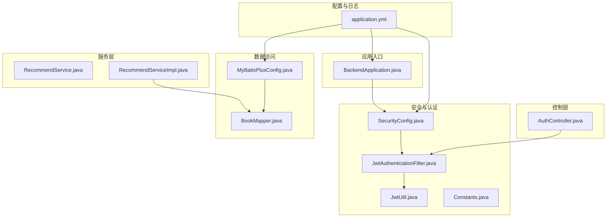
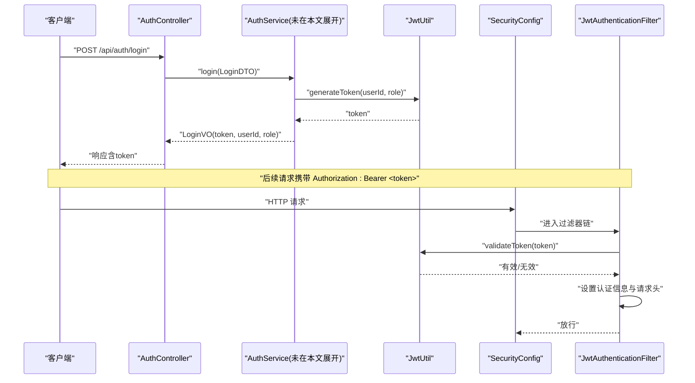
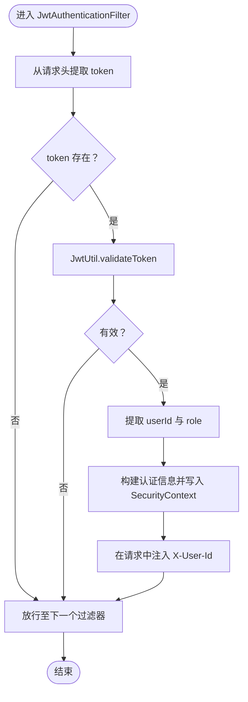
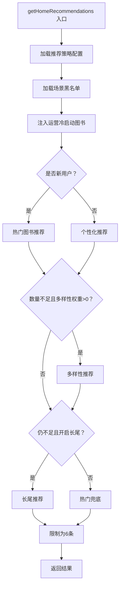
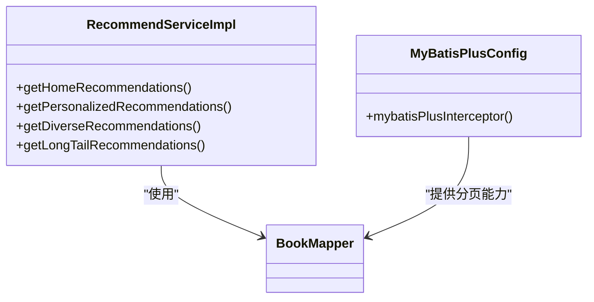
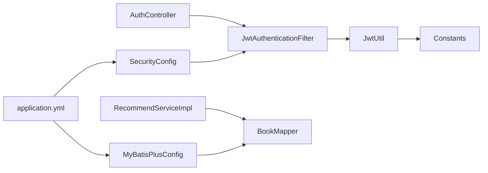

# 调试工具与技巧

<cite>
**本文引用的文件**
- [application.yml](file://src/main/resources/application.yml)
- [BackendApplication.java](file://src/main/java/org/example/backend/BackendApplication.java)
- [JwtUtil.java](file://src/main/java/org/example/backend/config/JwtUtil.java)
- [SecurityConfig.java](file://src/main/java/org/example/backend/config/SecurityConfig.java)
- [JwtAuthenticationFilter.java](file://src/main/java/org/example/backend/modules/auth/filter/JwtAuthenticationFilter.java)
- [GlobalExceptionHandler.java](file://src/main/java/org/example/backend/common/exception/GlobalExceptionHandler.java)
- [Constants.java](file://src/main/java/org/example/backend/common/constants/Constants.java)
- [AuthController.java](file://src/main/java/org/example/backend/modules/auth/controller/AuthController.java)
- [RecommendService.java](file://src/main/java/org/example/backend/modules/recommend/service/RecommendService.java)
- [RecommendServiceImpl.java](file://src/main/java/org/example/backend/modules/recommend/service/impl/RecommendServiceImpl.java)
- [BookMapper.java](file://src/main/java/org/example/backend/modules/book/repository/BookMapper.java)
- [MyBatisPlusConfig.java](file://src/main/java/org/example/backend/config/MyBatisPlusConfig.java)
- [LoginDTO.java](file://src/main/java/org/example/backend/dto/auth/LoginDTO.java)
- [LoginVO.java](file://src/main/java/org/example/backend/vo/auth/LoginVO.java)
</cite>

## 目录
1. [简介](#简介)
2. [项目结构](#项目结构)
3. [核心组件](#核心组件)
4. [架构总览](#架构总览)
5. [详细组件分析](#详细组件分析)
6. [依赖关系分析](#依赖关系分析)
7. [性能考虑](#性能考虑)
8. [故障排查指南](#故障排查指南)
9. [结论](#结论)
10. [附录](#附录)

## 简介
本指南面向智能图书推荐系统的开发与运维人员，聚焦于实际调试与排障实践。内容涵盖：
- IntelliJ IDEA 调试功能、断点设置与变量监控
- Spring Boot 应用日志配置、日志级别与关键日志追踪
- 数据库查询调试、SQL 执行计划分析与慢查询优化
- JWT 令牌调试、API 接口测试与 Postman 使用
- 推荐算法调试技巧、用户行为追踪与性能瓶颈定位

## 项目结构
后端采用 Spring Boot + MyBatis-Plus 架构，模块化清晰，便于分层调试与问题定位。

图表来源
- [BackendApplication.java](file://src/main/java/org/example/backend/BackendApplication.java#L1-L14)
- [SecurityConfig.java](file://src/main/java/org/example/backend/config/SecurityConfig.java#L1-L101)
- [JwtAuthenticationFilter.java](file://src/main/java/org/example/backend/modules/auth/filter/JwtAuthenticationFilter.java#L1-L70)
- [JwtUtil.java](file://src/main/java/org/example/backend/config/JwtUtil.java#L1-L92)
- [Constants.java](file://src/main/java/org/example/backend/common/constants/Constants.java#L1-L79)
- [AuthController.java](file://src/main/java/org/example/backend/modules/auth/controller/AuthController.java#L1-L41)
- [RecommendService.java](file://src/main/java/org/example/backend/modules/recommend/service/RecommendService.java#L1-L70)
- [RecommendServiceImpl.java](file://src/main/java/org/example/backend/modules/recommend/service/impl/RecommendServiceImpl.java#L1-L800)
- [MyBatisPlusConfig.java](file://src/main/java/org/example/backend/config/MyBatisPlusConfig.java#L1-L27)
- [BookMapper.java](file://src/main/java/org/example/backend/modules/book/repository/BookMapper.java#L1-L14)
- [application.yml](file://src/main/resources/application.yml#L1-L71)

章节来源
- [BackendApplication.java](file://src/main/java/org/example/backend/BackendApplication.java#L1-L14)
- [application.yml](file://src/main/resources/application.yml#L1-L71)

## 核心组件
- 安全与认证链路：通过 SecurityConfig 配置无状态过滤器链，JwtAuthenticationFilter 在请求进入时解析并验证 JWT，随后将用户身份写入 SecurityContext，并在请求属性中注入用户 ID，供后续业务使用。
- 推荐服务：RecommendServiceImpl 实现多场景推荐策略（首页、新书、热门、相似、关联、长尾等），并提供曝光、点击、反馈等行为记录接口。
- 数据访问：MyBatis-Plus 配置分页插件，BookMapper 提供基础 CRUD 能力；推荐服务通过多个 Mapper 组合查询与统计。
- 日志与异常：application.yml 中配置日志级别与输出格式；GlobalExceptionHandler 统一捕获异常并输出结构化响应。

章节来源
- [SecurityConfig.java](file://src/main/java/org/example/backend/config/SecurityConfig.java#L1-L101)
- [JwtAuthenticationFilter.java](file://src/main/java/org/example/backend/modules/auth/filter/JwtAuthenticationFilter.java#L1-L70)
- [JwtUtil.java](file://src/main/java/org/example/backend/config/JwtUtil.java#L1-L92)
- [RecommendService.java](file://src/main/java/org/example/backend/modules/recommend/service/RecommendService.java#L1-L70)
- [RecommendServiceImpl.java](file://src/main/java/org/example/backend/modules/recommend/service/impl/RecommendServiceImpl.java#L1-L800)
- [MyBatisPlusConfig.java](file://src/main/java/org/example/backend/config/MyBatisPlusConfig.java#L1-L27)
- [BookMapper.java](file://src/main/java/org/example/backend/modules/book/repository/BookMapper.java#L1-L14)
- [GlobalExceptionHandler.java](file://src/main/java/org/example/backend/common/exception/GlobalExceptionHandler.java#L1-L111)
- [application.yml](file://src/main/resources/application.yml#L63-L71)

## 架构总览
以下序列图展示一次典型登录请求的端到端调用链，包括 JWT 生成与认证过滤器处理。

图表来源
- [AuthController.java](file://src/main/java/org/example/backend/modules/auth/controller/AuthController.java#L1-L41)
- [JwtUtil.java](file://src/main/java/org/example/backend/config/JwtUtil.java#L1-L92)
- [SecurityConfig.java](file://src/main/java/org/example/backend/config/SecurityConfig.java#L1-L101)
- [JwtAuthenticationFilter.java](file://src/main/java/org/example/backend/modules/auth/filter/JwtAuthenticationFilter.java#L1-L70)

## 详细组件分析

### 安全与认证链路调试要点
- 断点位置建议
  - JwtAuthenticationFilter.doFilterInternal：验证 Token 的入口，可观察 token 解析、用户 ID 与角色提取、认证上下文设置。
  - JwtUtil.validateToken/generateToken：验证签名与有效期，便于定位签发与解析问题。
  - SecurityConfig.filterChain：确认放行规则与 CORS 配置，避免跨域导致的认证失败。
- 变量监控
  - 请求头 Authorization 是否以 Bearer 开头，是否正确传递。
  - SecurityContext 中的认证主体与权限集合。
  - 请求属性 X-User-Id 是否被正确注入。
- 常见问题
  - Token 过期或签名不一致：检查 jwt.secret 与过期时间配置。
  - 未携带或格式错误的 Authorization 头：确认前端是否按规范拼接 Bearer 前缀。
  - CORS 导致预检失败：核对 allowed origins/methods/headers。

图表来源
- [JwtAuthenticationFilter.java](file://src/main/java/org/example/backend/modules/auth/filter/JwtAuthenticationFilter.java#L1-L70)
- [JwtUtil.java](file://src/main/java/org/example/backend/config/JwtUtil.java#L1-L92)
- [Constants.java](file://src/main/java/org/example/backend/common/constants/Constants.java#L1-L79)

章节来源
- [JwtAuthenticationFilter.java](file://src/main/java/org/example/backend/modules/auth/filter/JwtAuthenticationFilter.java#L1-L70)
- [JwtUtil.java](file://src/main/java/org/example/backend/config/JwtUtil.java#L1-L92)
- [SecurityConfig.java](file://src/main/java/org/example/backend/config/SecurityConfig.java#L1-L101)
- [Constants.java](file://src/main/java/org/example/backend/common/constants/Constants.java#L1-L79)

### 推荐服务调试要点
- 断点位置建议
  - RecommendServiceImpl.getHomeRecommendations：观察策略加载、冷启动判断、个性化与多样性补足、长尾与兜底逻辑。
  - RecommendServiceImpl.getPersonalizedRecommendations：关注用户偏好与借阅历史的融合策略。
  - RecommendServiceImpl.getDiverseRecommendations：检查主题多样性与黑名单过滤。
  - RecommendServiceImpl.getLongTailRecommendations：验证阈值与评分筛选。
  - 行为记录接口 recordExposure/recordClick/feedback：事务边界与插入时机。
- 变量监控
  - 推荐策略配置（权重、比例、开关）是否按预期生效。
  - 黑名单集合 excludeBookIds 是否正确累积与过滤。
  - 个性化推荐中偏好主题、借阅历史、相似图书与关联用户的聚合结果。
- 性能关注
  - SQL 数量与复杂度：首页推荐涉及多次查询与排序，注意 LIMIT 与索引。
  - 缓存策略：Redis 可用于热点数据缓存（已在配置中预留）。

图表来源
- [RecommendServiceImpl.java](file://src/main/java/org/example/backend/modules/recommend/service/impl/RecommendServiceImpl.java#L93-L188)

章节来源
- [RecommendService.java](file://src/main/java/org/example/backend/modules/recommend/service/RecommendService.java#L1-L70)
- [RecommendServiceImpl.java](file://src/main/java/org/example/backend/modules/recommend/service/impl/RecommendServiceImpl.java#L1-L800)

### 数据访问与 SQL 调试
- MyBatis-Plus 配置
  - 分页插件：PaginationInnerInterceptor，确保分页查询的正确性。
  - 日志输出：StdOutImpl 将 SQL 输出到控制台，便于调试。
- 常见调试步骤
  - 在 RecommendServiceImpl 的关键查询处设置断点，观察查询条件、排序与 LIMIT。
  - 关注 LambdaQueryWrapper 的组合条件与 last("LIMIT ...") 的使用。
  - 核对 BookMapper、BookTopicMapper、TopicMapper、BorrowRecordMapper 等的调用是否符合预期。
- 慢查询优化建议
  - 为常用过滤字段（如 status、borrow_count、avg_rating）建立索引。
  - 对排序字段（如 borrow_count、avg_rating）建立复合索引。
  - 控制单次查询的数据量，避免一次性拉取过多数据。

图表来源
- [MyBatisPlusConfig.java](file://src/main/java/org/example/backend/config/MyBatisPlusConfig.java#L1-L27)
- [BookMapper.java](file://src/main/java/org/example/backend/modules/book/repository/BookMapper.java#L1-L14)
- [RecommendServiceImpl.java](file://src/main/java/org/example/backend/modules/recommend/service/impl/RecommendServiceImpl.java#L1-L800)

章节来源
- [MyBatisPlusConfig.java](file://src/main/java/org/example/backend/config/MyBatisPlusConfig.java#L1-L27)
- [BookMapper.java](file://src/main/java/org/example/backend/modules/book/repository/BookMapper.java#L1-L14)
- [application.yml](file://src/main/resources/application.yml#L17-L30)

### 异常处理与日志追踪
- 全局异常处理
  - GlobalExceptionHandler 统一捕获业务异常、参数校验异常、认证失败与权限不足，并输出结构化响应。
- 日志配置
  - application.yml 中设置 root 与包级日志级别，控制台输出格式。
  - MyBatis-Plus 的 StdOutImpl 输出 SQL 与参数，便于快速定位问题。
- 调试建议
  - 在控制器与服务层的关键节点增加日志，区分 DEBUG/INFO/WARN/ERROR。
  - 对外部依赖（如 JWT 解析、数据库查询）增加耗时日志，辅助性能分析。

章节来源
- [GlobalExceptionHandler.java](file://src/main/java/org/example/backend/common/exception/GlobalExceptionHandler.java#L1-L111)
- [application.yml](file://src/main/resources/application.yml#L63-L71)

## 依赖关系分析

图表来源
- [AuthController.java](file://src/main/java/org/example/backend/modules/auth/controller/AuthController.java#L1-L41)
- [JwtAuthenticationFilter.java](file://src/main/java/org/example/backend/modules/auth/filter/JwtAuthenticationFilter.java#L1-L70)
- [JwtUtil.java](file://src/main/java/org/example/backend/config/JwtUtil.java#L1-L92)
- [Constants.java](file://src/main/java/org/example/backend/common/constants/Constants.java#L1-L79)
- [RecommendServiceImpl.java](file://src/main/java/org/example/backend/modules/recommend/service/impl/RecommendServiceImpl.java#L1-L800)
- [BookMapper.java](file://src/main/java/org/example/backend/modules/book/repository/BookMapper.java#L1-L14)
- [MyBatisPlusConfig.java](file://src/main/java/org/example/backend/config/MyBatisPlusConfig.java#L1-L27)
- [SecurityConfig.java](file://src/main/java/org/example/backend/config/SecurityConfig.java#L1-L101)
- [application.yml](file://src/main/resources/application.yml#L1-L71)

章节来源
- [application.yml](file://src/main/resources/application.yml#L1-L71)
- [SecurityConfig.java](file://src/main/java/org/example/backend/config/SecurityConfig.java#L1-L101)

## 性能考虑
- 推荐算法
  - 首页推荐包含多轮查询与集合操作，建议对用户偏好、借阅历史与主题映射进行缓存。
  - 控制每步推荐的数量上限，避免超大结果集。
- 数据库
  - 为高频查询字段建立索引，减少排序与过滤成本。
  - 使用 LIMIT 与分页插件，避免全表扫描。
- 日志与监控
  - 对关键路径增加耗时日志，结合 APM 工具定位瓶颈。
  - 控制日志级别，避免生产环境产生过多 IO。

## 故障排查指南
- JWT 令牌相关
  - 现象：登录成功但后续接口 401/403
  - 排查：确认 Authorization 头格式、token 有效性、签名密钥与过期时间
  - 断点：JwtAuthenticationFilter.validateToken、JwtUtil.validateToken
- 参数校验失败
  - 现象：400 错误，提示参数校验失败
  - 排查：检查 DTO 字段注解与前端传参
  - 断点：GlobalExceptionHandler.handleMethodArgumentNotValidException
- 权限不足
  - 现象：403
  - 排查：确认用户角色与接口权限配置
  - 断点：GlobalExceptionHandler.handleAccessDeniedException
- 推荐结果异常
  - 现象：推荐重复、缺失或不符合策略
  - 排查：检查黑名单、权重配置与查询条件
  - 断点：RecommendServiceImpl.getHomeRecommendations 等关键方法
- SQL 性能问题
  - 现象：接口响应慢
  - 排查：查看控制台 SQL 输出，分析排序与过滤字段
  - 优化：为常用字段建索引，拆分复杂查询

章节来源
- [JwtAuthenticationFilter.java](file://src/main/java/org/example/backend/modules/auth/filter/JwtAuthenticationFilter.java#L1-L70)
- [JwtUtil.java](file://src/main/java/org/example/backend/config/JwtUtil.java#L1-L92)
- [GlobalExceptionHandler.java](file://src/main/java/org/example/backend/common/exception/GlobalExceptionHandler.java#L1-L111)
- [RecommendServiceImpl.java](file://src/main/java/org/example/backend/modules/recommend/service/impl/RecommendServiceImpl.java#L1-L800)
- [application.yml](file://src/main/resources/application.yml#L17-L30)

## 结论
通过结合 IDE 断点调试、统一日志与异常处理、数据库 SQL 观察与索引优化，以及 JWT 与认证过滤器的深入理解，可以高效定位与解决智能图书推荐系统中的各类问题。建议在开发与测试阶段持续完善日志与监控，形成闭环的调试与优化流程。

## 附录
- IntelliJ IDEA 调试小贴士
  - 使用“方法入口断点”定位控制器与服务层入口
  - 使用“异常断点”捕获未处理异常
  - 使用“计算表达式”实时评估关键变量
  - 使用“变量监视”持续观察对象状态变化
- Postman 使用建议
  - 登录接口获取 token 后，在“Authorization”标签选择 Bearer Token 并粘贴
  - 对需要用户 ID 的接口，可在“Headers”中手动添加 X-User-Id
  - 使用“Tests”脚本保存 token，实现自动化测试