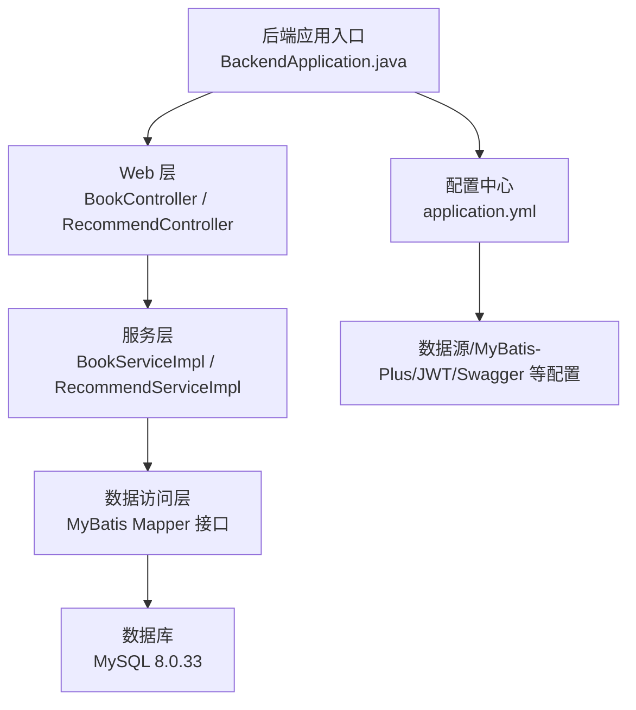
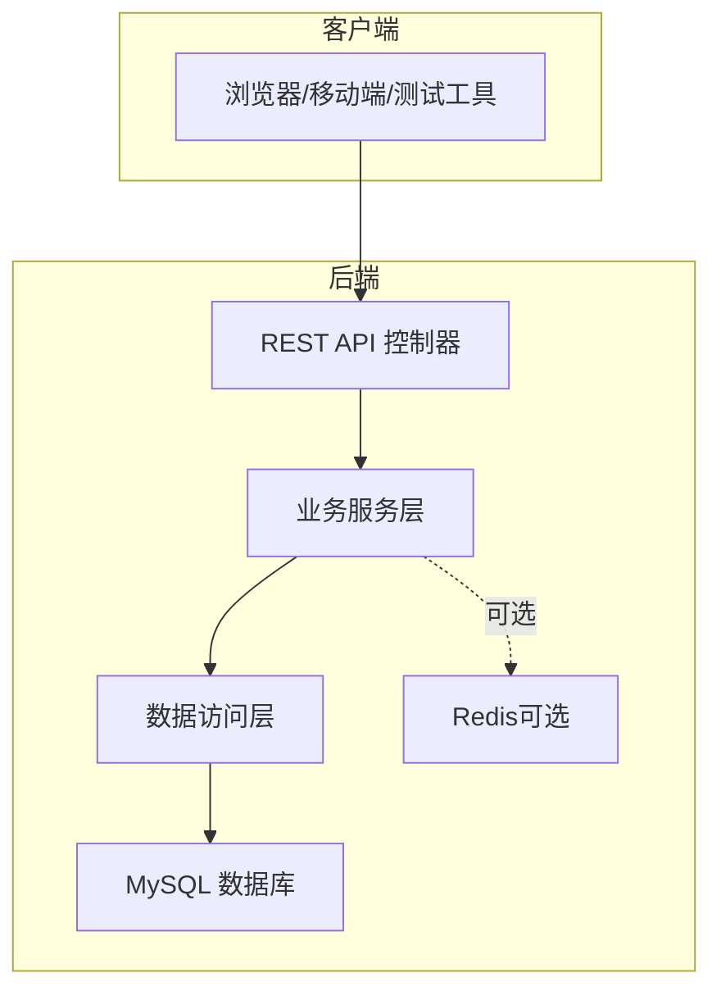
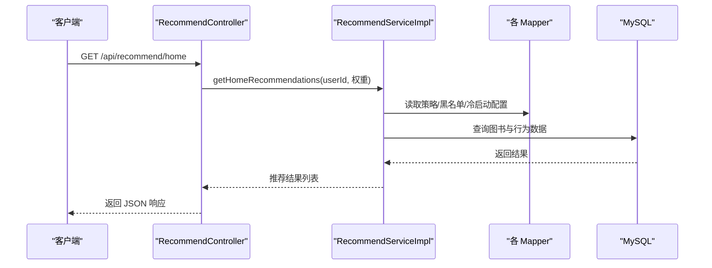
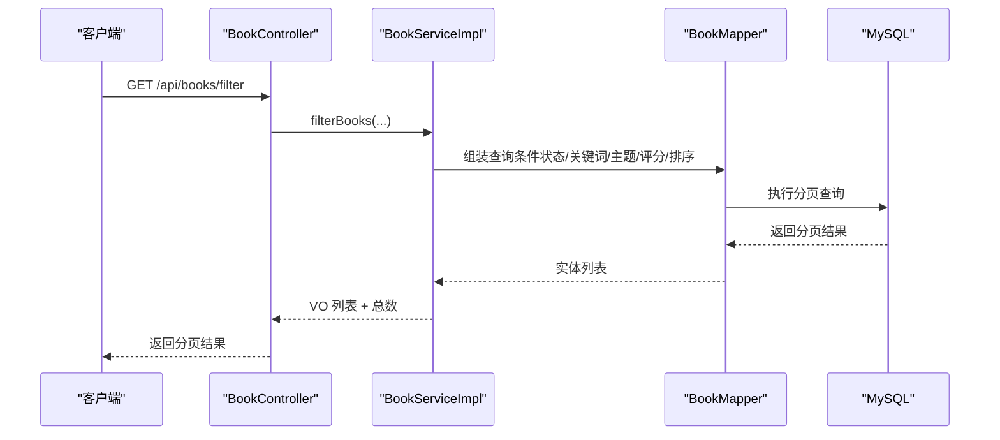
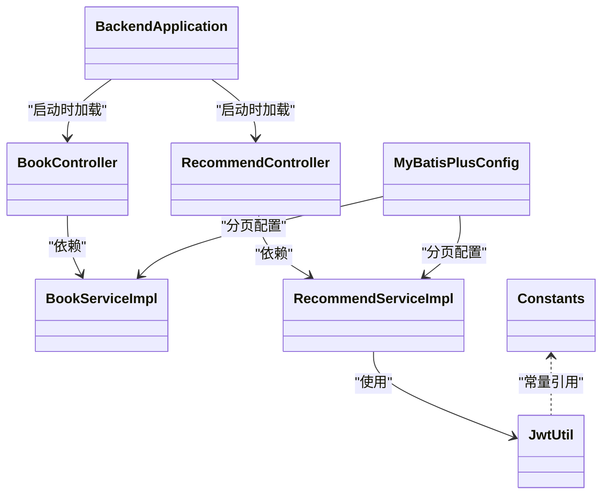

# 快速开始

<cite>
**本文引用的文件**
- [pom.xml](file://pom.xml)
- [application.yml](file://src/main/resources/application.yml)
- [BackendApplication.java](file://src/main/java/org/example/backend/BackendApplication.java)
- [data_library126_db.sql](file://src/main/resources/data_library126_db.sql)
- [Help 文档](file://HELP.md)
- [Constants.java](file://src/main/java/org/example/backend/common/constants/Constants.java)
- [JwtUtil.java](file://src/main/java/org/example/backend/config/JwtUtil.java)
- [MyBatisPlusConfig.java](file://src/main/java/org/example/backend/config/MyBatisPlusConfig.java)
- [BookController.java](file://src/main/java/org/example/backend/modules/book/controller/BookController.java)
- [RecommendController.java](file://src/main/java/org/example/backend/modules/recommend/controller/RecommendController.java)
- [BookServiceImpl.java](file://src/main/java/org/example/backend/modules/book/service/impl/BookServiceImpl.java)
- [RecommendServiceImpl.java](file://src/main/java/org/example/backend/modules/recommend/service/impl/RecommendServiceImpl.java)
</cite>

## 目录
1. [简介](#简介)
2. [项目结构](#项目结构)
3. [核心组件](#核心组件)
4. [架构总览](#架构总览)
5. [详细组件分析](#详细组件分析)
6. [依赖分析](#依赖分析)
7. [性能考虑](#性能考虑)
8. [故障排查指南](#故障排查指南)
9. [结论](#结论)
10. [附录](#附录)

## 简介
本指南面向首次搭建“智能图书推荐系统后端”的开发者，提供从环境准备、数据库初始化、项目构建到启动运行的完整步骤，并给出常见问题排查与验证方法。系统基于 Spring Boot 2.6.13、MyBatis-Plus、MySQL 8.0.33、JWT 与 Swagger/OpenAPI，采用模块化分层设计，覆盖图书管理、交互行为、推荐引擎与后台管理等能力。

## 项目结构
后端采用标准 Maven 结构，核心模块位于 modules 下，包含 book、interaction、recommend、search、user、admin、auth 等子模块；资源文件集中于 src/main/resources，包含数据库初始化 SQL 与 Spring 配置。

图表来源
- [BackendApplication.java](file://src/main/java/org/example/backend/BackendApplication.java#L1-L14)
- [BookController.java](file://src/main/java/org/example/backend/modules/book/controller/BookController.java#L1-L60)
- [RecommendController.java](file://src/main/java/org/example/backend/modules/recommend/controller/RecommendController.java#L1-L130)
- [application.yml](file://src/main/resources/application.yml#L1-L71)

章节来源
- [pom.xml](file://pom.xml#L1-L161)
- [application.yml](file://src/main/resources/application.yml#L1-L71)

## 核心组件
- 应用入口与启动
  - 后端入口类负责启动 Spring Boot 应用，监听端口并加载配置。
- 配置中心
  - application.yml 定义服务器端口、数据源、MyBatis-Plus、Redis、JWT、Swagger、文件上传与日志级别等。
- 安全与认证
  - JWT 工具类提供签发、解析与校验能力；常量定义了 Token 头部、用户角色等约定。
- ORM 与分页
  - MyBatis-Plus 配置扫描 Mapper 并启用分页插件。
- 控制器与服务
  - BookController 提供图书列表、筛选与详情；RecommendController 提供首页推荐、新书、热门、相似、点击/曝光记录与反馈等。

章节来源
- [BackendApplication.java](file://src/main/java/org/example/backend/BackendApplication.java#L1-L14)
- [application.yml](file://src/main/resources/application.yml#L1-L71)
- [JwtUtil.java](file://src/main/java/org/example/backend/config/JwtUtil.java#L1-L92)
- [Constants.java](file://src/main/java/org/example/backend/common/constants/Constants.java#L1-L79)
- [MyBatisPlusConfig.java](file://src/main/java/org/example/backend/config/MyBatisPlusConfig.java#L1-L28)
- [BookController.java](file://src/main/java/org/example/backend/modules/book/controller/BookController.java#L1-L60)
- [RecommendController.java](file://src/main/java/org/example/backend/modules/recommend/controller/RecommendController.java#L1-L130)

## 架构总览
系统采用前后端分离，后端提供 REST API，前端通过 Swagger UI 进行接口调试与联调。

图表来源
- [application.yml](file://src/main/resources/application.yml#L1-L71)
- [BookController.java](file://src/main/java/org/example/backend/modules/book/controller/BookController.java#L1-L60)
- [RecommendController.java](file://src/main/java/org/example/backend/modules/recommend/controller/RecommendController.java#L1-L130)

## 详细组件分析

### 环境准备与安装
- JDK 8+
  - 确保系统已安装 JDK 8 或以上版本，并配置 JAVA_HOME 与 PATH。
- Maven
  - 安装 Maven 并确保 mvn 命令可用；建议使用本地仓库加速下载。
- MySQL 8.0.33
  - 安装 MySQL 8.0.33，创建数据库与用户，设置字符集为 utf8mb4，时区为 Asia/Shanghai。
  - 注意：项目默认使用驱动 com.mysql.cj.jdbc.Driver，需匹配 MySQL Connector/J 8.0.33。

章节来源
- [pom.xml](file://pom.xml#L38-L43)
- [application.yml](file://src/main/resources/application.yml#L11-L15)

### 数据库初始化
- 步骤
  1) 在 MySQL 中创建数据库（如 library_db），字符集为 utf8mb4，排序规则为 utf8mb4_0900_ai_ci。
  2) 使用 data_library126_db.sql 脚本初始化表结构与基础数据。
  3) 修改 application.yml 中的数据库连接参数（地址、端口、用户名、密码、数据库名）以匹配本地环境。
- 验证
  - 登录 MySQL 执行查询，确认 books、borrow_records、recommend_* 等核心表存在且有数据。
  - 启动应用后观察控制台日志，确认数据源连接成功。

章节来源
- [data_library126_db.sql](file://src/main/resources/data_library126_db.sql#L1-L120)
- [application.yml](file://src/main/resources/application.yml#L11-L15)

### 项目克隆、依赖安装与启动
- 克隆与构建
  - 使用 Maven 清理并编译项目，生成 target 目录与可执行 JAR。
- 启动方式
  - 方式一：使用 Maven 插件直接启动（推荐用于开发）。
  - 方式二：打包后使用 Java -jar 运行。
- 访问 API
  - 应用启动后，访问 Swagger UI 进行接口调试与验证。

章节来源
- [pom.xml](file://pom.xml#L128-L158)
- [BackendApplication.java](file://src/main/java/org/example/backend/BackendApplication.java#L1-L14)
- [application.yml](file://src/main/resources/application.yml#L1-L71)
- [Help 文档](file://HELP.md#L1-L18)

### 核心流程时序

#### 首页推荐流程（用户视角）

图表来源
- [RecommendController.java](file://src/main/java/org/example/backend/modules/recommend/controller/RecommendController.java#L27-L39)
- [RecommendServiceImpl.java](file://src/main/java/org/example/backend/modules/recommend/service/impl/RecommendServiceImpl.java#L94-L188)

#### 图书筛选与分页流程

图表来源
- [BookController.java](file://src/main/java/org/example/backend/modules/book/controller/BookController.java#L34-L49)
- [BookServiceImpl.java](file://src/main/java/org/example/backend/modules/book/service/impl/BookServiceImpl.java#L78-L173)

### 类关系概览

图表来源
- [BackendApplication.java](file://src/main/java/org/example/backend/BackendApplication.java#L1-L14)
- [BookController.java](file://src/main/java/org/example/backend/modules/book/controller/BookController.java#L1-L60)
- [RecommendController.java](file://src/main/java/org/example/backend/modules/recommend/controller/RecommendController.java#L1-L130)
- [BookServiceImpl.java](file://src/main/java/org/example/backend/modules/book/service/impl/BookServiceImpl.java#L1-L200)
- [RecommendServiceImpl.java](file://src/main/java/org/example/backend/modules/recommend/service/impl/RecommendServiceImpl.java#L1-L200)
- [JwtUtil.java](file://src/main/java/org/example/backend/config/JwtUtil.java#L1-L92)
- [MyBatisPlusConfig.java](file://src/main/java/org/example/backend/config/MyBatisPlusConfig.java#L1-L28)
- [Constants.java](file://src/main/java/org/example/backend/common/constants/Constants.java#L1-L79)

## 依赖分析
- 核心框架与组件
  - Spring Boot Web、Validation、Security、OpenAPI/Swagger UI
  - MyBatis-Plus 与 MySQL Connector/J 8.0.33
  - JWT（jjwt-api/impl/jackson）
  - Redis（可选）
  - Lombok、Jackson、Hutool
- 版本与兼容性
  - Java 1.8、Spring Boot 2.6.13、MyBatis-Plus 3.5.3、JWT 0.11.5、springdoc 1.6.14
- 构建与打包
  - Maven 编译插件与 Spring Boot Maven 插件配置，主类为 BackendApplication

章节来源
- [pom.xml](file://pom.xml#L10-L126)

## 性能考虑
- 分页与索引
  - 使用 MyBatis-Plus 分页插件，合理设计数据库索引（如图书表的标题/作者/状态/借阅次数等）以提升筛选与排序性能。
- 缓存策略
  - 可结合 Redis 缓存热点数据（如热门图书、推荐策略配置），降低数据库压力。
- 推荐策略
  - 控制首页推荐条目上限（如 6 条），避免一次性返回过多数据导致响应延迟。
- 日志级别
  - 开发阶段可提高日志级别便于定位问题，生产环境建议调整为 INFO 或更严格级别。

## 故障排查指南
- 数据库连接失败
  - 检查 application.yml 中的数据库 URL、用户名、密码与数据库名是否正确；确认 MySQL 服务已启动且端口 3306 可访问。
- 启动报错找不到主类
  - 确认 Maven 已正确编译并生成 target/classes；或使用 mvn spring-boot:run 启动。
- Swagger UI 无法访问
  - 确认 server.port 与 springdoc 配置正确，默认端点为 /swagger-ui.html。
- JWT 校验失败
  - 检查 jwt.secret 是否与客户端一致，过期时间是否合理。
- 推荐结果为空
  - 检查推荐黑名单、冷启动配置与策略开关；确认 books 表存在上架图书且行为数据正常。

章节来源
- [application.yml](file://src/main/resources/application.yml#L1-L71)
- [JwtUtil.java](file://src/main/java/org/example/backend/config/JwtUtil.java#L74-L81)
- [RecommendServiceImpl.java](file://src/main/java/org/example/backend/modules/recommend/service/impl/RecommendServiceImpl.java#L94-L188)

## 结论
按照本指南完成环境准备、数据库初始化与项目启动后，即可通过 Swagger UI 对图书与推荐接口进行验证。建议在开发过程中关注分页与缓存策略，结合业务场景优化推荐策略配置，持续完善日志与监控体系。

## 附录

### 快速操作清单
- 环境准备
  - JDK 8+、Maven、MySQL 8.0.33
- 数据库
  - 创建数据库与用户，执行 data_library126_db.sql
  - 修改 application.yml 的数据库连接参数
- 构建与启动
  - mvn clean compile 或 mvn spring-boot:run
  - 访问 http://localhost:9090/swagger-ui.html

章节来源
- [pom.xml](file://pom.xml#L128-L158)
- [application.yml](file://src/main/resources/application.yml#L1-L71)
- [data_library126_db.sql](file://src/main/resources/data_library126_db.sql#L1-L120)
- [Help 文档](file://HELP.md#L1-L18)