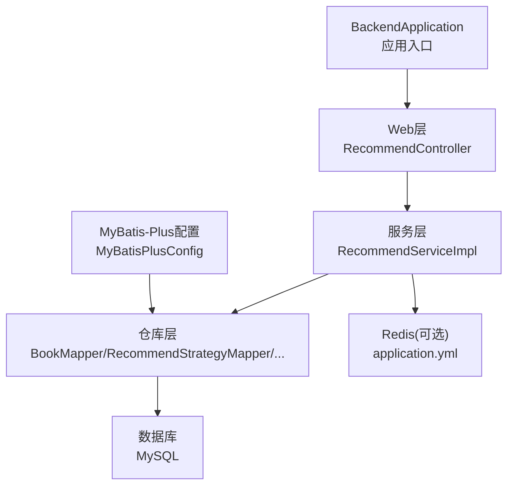
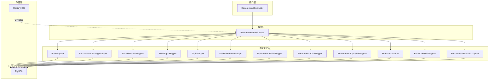
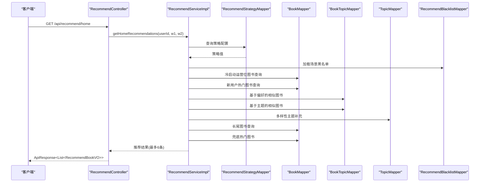
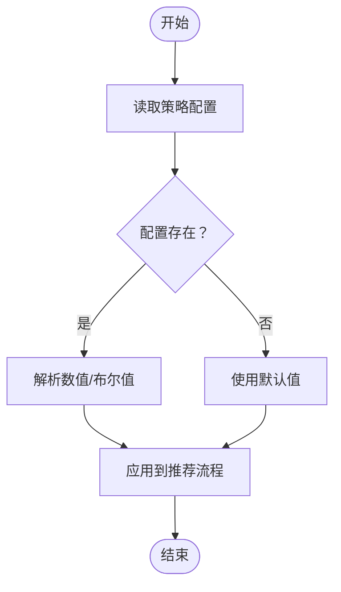
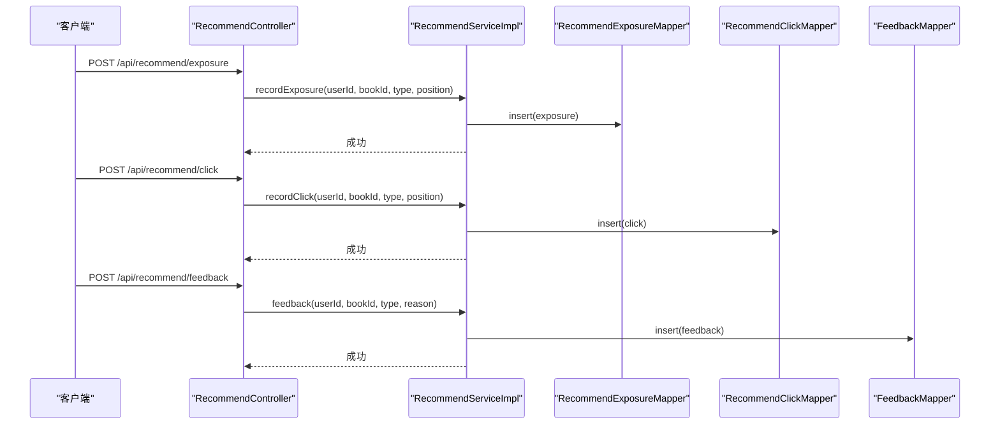
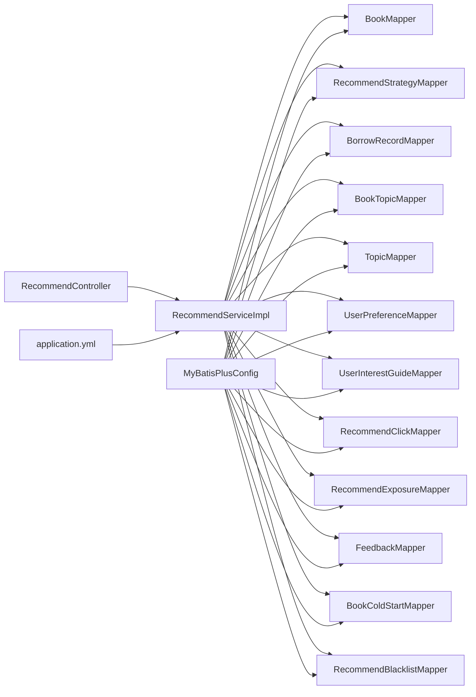

# 性能优化

<cite>
**本文引用的文件**
- [BackendApplication.java](file://src/main/java/org/example/backend/BackendApplication.java)
- [MyBatisPlusConfig.java](file://src/main/java/org/example/backend/config/MyBatisPlusConfig.java)
- [application.yml](file://src/main/resources/application.yml)
- [pom.xml](file://pom.xml)
- [PageResult.java](file://src/main/java/org/example/backend/common/PageResult.java)
- [Constants.java](file://src/main/java/org/example/backend/common/constants/Constants.java)
- [RecommendController.java](file://src/main/java/org/example/backend/modules/recommend/controller/RecommendController.java)
- [RecommendServiceImpl.java](file://src/main/java/org/example/backend/modules/recommend/service/impl/RecommendServiceImpl.java)
- [RecommendStrategyMapper.java](file://src/main/java/org/example/backend/modules/recommend/repository/RecommendStrategyMapper.java)
- [BookMapper.java](file://src/main/java/org/example/backend/modules/book/repository/BookMapper.java)
- [AdminStatsMapper.java](file://src/main/java/org/example/backend/modules/admin/repository/AdminStatsMapper.java)
- [Book.java](file://src/main/java/org/example/backend/entity/Book.java)
- [UserBehavior.java](file://src/main/java/org/example/backend/entity/UserBehavior.java)
- [RecommendStrategy.java](file://src/main/java/org/example/backend/entity/RecommendStrategy.java)
- [RecommendExposure.java](file://src/main/java/org/example/backend/entity/RecommendExposure.java)
- [data_library126_db.sql](file://src/main/resources/data_library126_db.sql)
- [DashboardVO.java](file://src/main/java/org/example/backend/vo/admin/DashboardVO.java)
- [RecommendFunnelVO.java](file://src/main/java/org/example/backend/vo/admin/RecommendFunnelVO.java)
</cite>

## 目录
1. [简介](#简介)
2. [项目结构](#项目结构)
3. [核心组件](#核心组件)
4. [架构总览](#架构总览)
5. [详细组件分析](#详细组件分析)
6. [依赖关系分析](#依赖关系分析)
7. [性能考量](#性能考量)
8. [故障排查指南](#故障排查指南)
9. [结论](#结论)
10. [附录](#附录)

## 简介
本指南面向智能图书推荐系统的性能优化，围绕数据库查询优化、缓存策略设计、接口性能提升展开；同时覆盖MyBatis-Plus分页查询优化、索引使用策略、SQL性能调优；并给出推荐算法的性能优化、内存管理与并发处理机制建议；最后涵盖静态资源优化、CDN与负载均衡策略、性能监控指标、瓶颈分析方法与性能测试方案，并提供不同场景下的优化建议与最佳实践。

## 项目结构
后端采用Spring Boot + MyBatis-Plus标准分层架构：入口类负责启动，配置类定义MyBatis-Plus分页插件与数据源、Redis连接参数，模块化控制器/服务/仓库分别承担接口、业务与数据访问职责；实体与VO用于数据传输与视图展示；资源文件包含应用配置与数据库初始化脚本。

图表来源
- [BackendApplication.java](file://src/main/java/org/example/backend/BackendApplication.java#L1-L14)
- [RecommendController.java](file://src/main/java/org/example/backend/modules/recommend/controller/RecommendController.java#L1-L130)
- [RecommendServiceImpl.java](file://src/main/java/org/example/backend/modules/recommend/service/impl/RecommendServiceImpl.java#L1-L927)
- [MyBatisPlusConfig.java](file://src/main/java/org/example/backend/config/MyBatisPlusConfig.java#L1-L28)
- [application.yml](file://src/main/resources/application.yml#L1-L71)

章节来源
- [BackendApplication.java](file://src/main/java/org/example/backend/BackendApplication.java#L1-L14)
- [MyBatisPlusConfig.java](file://src/main/java/org/example/backend/config/MyBatisPlusConfig.java#L1-L28)
- [application.yml](file://src/main/resources/application.yml#L1-L71)

## 核心组件
- 应用入口与容器：负责Spring Boot应用启动。
- MyBatis-Plus配置：启用分页插件，扫描各模块mapper包。
- 控制器：提供推荐相关REST接口，统一响应包装。
- 服务实现：聚合多表查询、策略配置、黑名单过滤、曝光/点击/反馈埋点。
- 实体与VO：承载数据模型与接口返回结构。
- 配置文件：数据源、MyBatis-Plus、Redis、Swagger、文件上传、日志等。

章节来源
- [RecommendController.java](file://src/main/java/org/example/backend/modules/recommend/controller/RecommendController.java#L1-L130)
- [RecommendServiceImpl.java](file://src/main/java/org/example/backend/modules/recommend/service/impl/RecommendServiceImpl.java#L1-L927)
- [Book.java](file://src/main/java/org/example/backend/entity/Book.java#L1-L95)
- [UserBehavior.java](file://src/main/java/org/example/backend/entity/UserBehavior.java#L1-L51)
- [RecommendStrategy.java](file://src/main/java/org/example/backend/entity/RecommendStrategy.java#L1-L54)
- [RecommendExposure.java](file://src/main/java/org/example/backend/entity/RecommendExposure.java#L1-L49)
- [application.yml](file://src/main/resources/application.yml#L1-L71)

## 架构总览
推荐系统整体由“接口层-服务层-数据访问层-存储层”构成，结合Redis作为可选缓存层，支持推荐策略动态配置与行为埋点统计。

图表来源
- [RecommendController.java](file://src/main/java/org/example/backend/modules/recommend/controller/RecommendController.java#L1-L130)
- [RecommendServiceImpl.java](file://src/main/java/org/example/backend/modules/recommend/service/impl/RecommendServiceImpl.java#L1-L927)
- [BookMapper.java](file://src/main/java/org/example/backend/modules/book/repository/BookMapper.java#L1-L14)
- [RecommendStrategyMapper.java](file://src/main/java/org/example/backend/modules/recommend/repository/RecommendStrategyMapper.java#L1-L14)
- [application.yml](file://src/main/resources/application.yml#L31-L43)

## 详细组件分析

### 推荐服务实现（RecommendServiceImpl）
- 多策略组合：首页推荐综合“冷启动运营位、热门、个性化、多样性、长尾、兜底热门”，通过权重与比例控制产出规模与质量。
- 黑名单过滤：按场景与位置维度加载黑名单，避免重复与违规展示。
- 冷启动策略：根据兴趣引导完成情况与借阅次数判断新用户，优先推荐热门图书。
- 个性化推荐：基于用户偏好主题与近期借阅历史，计算相似度并批量查询图书详情。
- 多样性推荐：过滤用户已涉猎主题，按主题集合补充不同领域图书。
- 长尾推荐：在阈值内筛选高评分低热度图书，提升冷门优质内容曝光。
- 兜底策略：不足时以热门图书补齐，确保返回数量上限。
- 埋点记录：曝光、点击、反馈写入对应表，支撑后续效果评估与策略迭代。

图表来源
- [RecommendController.java](file://src/main/java/org/example/backend/modules/recommend/controller/RecommendController.java#L27-L39)
- [RecommendServiceImpl.java](file://src/main/java/org/example/backend/modules/recommend/service/impl/RecommendServiceImpl.java#L94-L188)
- [RecommendStrategyMapper.java](file://src/main/java/org/example/backend/modules/recommend/repository/RecommendStrategyMapper.java#L1-L14)
- [BookMapper.java](file://src/main/java/org/example/backend/modules/book/repository/BookMapper.java#L1-L14)

章节来源
- [RecommendServiceImpl.java](file://src/main/java/org/example/backend/modules/recommend/service/impl/RecommendServiceImpl.java#L70-L188)
- [RecommendController.java](file://src/main/java/org/example/backend/modules/recommend/controller/RecommendController.java#L27-L39)

### 推荐策略配置（RecommendStrategy）
- 动态配置项：热推比例、全局多样性权重、冷启动热推比例、长尾比例、长尾阈值、是否启用长尾等。
- 默认回退：当配置表不可用或查询异常时，服务侧提供默认值，保证系统可用性。

图表来源
- [RecommendServiceImpl.java](file://src/main/java/org/example/backend/modules/recommend/service/impl/RecommendServiceImpl.java#L417-L479)
- [RecommendStrategy.java](file://src/main/java/org/example/backend/entity/RecommendStrategy.java#L1-L54)

章节来源
- [RecommendServiceImpl.java](file://src/main/java/org/example/backend/modules/recommend/service/impl/RecommendServiceImpl.java#L417-L479)
- [RecommendStrategy.java](file://src/main/java/org/example/backend/entity/RecommendStrategy.java#L1-L54)

### 推荐埋点与反馈（曝光/点击/反馈）
- 曝光记录：记录推荐类型、位置与时间，便于后续点击率与转化漏斗分析。
- 点击记录：记录用户对推荐内容的点击行为。
- 反馈记录：收集用户“不感兴趣”等反馈，用于策略调整。

图表来源
- [RecommendController.java](file://src/main/java/org/example/backend/modules/recommend/controller/RecommendController.java#L82-L113)
- [RecommendServiceImpl.java](file://src/main/java/org/example/backend/modules/recommend/service/impl/RecommendServiceImpl.java#L659-L692)

章节来源
- [RecommendController.java](file://src/main/java/org/example/backend/modules/recommend/controller/RecommendController.java#L82-L113)
- [RecommendServiceImpl.java](file://src/main/java/org/example/backend/modules/recommend/service/impl/RecommendServiceImpl.java#L659-L692)

### 分页查询与结果封装（PageResult）
- 统一分页结果封装，包含当前页、每页大小、总记录数、总页数与数据列表。
- 提供of工厂方法，便于控制器直接返回分页结果。

章节来源
- [PageResult.java](file://src/main/java/org/example/backend/common/PageResult.java#L1-L59)

### 常量与默认配置（Constants）
- 定义分页默认值与最大值，便于控制器与服务层统一约束分页范围。
- 定义角色、状态、搜索模式等常量，减少魔法值。

章节来源
- [Constants.java](file://src/main/java/org/example/backend/common/constants/Constants.java#L1-L79)

### 数据库索引与表结构要点（来自SQL脚本）
- 主题表topics：主键、唯一索引name、常用查询索引idx_name与idx_status。
- 图书主题关联表book_topics：双索引idx_book_id与idx_topic_name，支撑按图书/主题检索。
- 用户行为表user_behaviors：多字段索引idx_user_id、idx_book_id、idx_behavior_type、idx_create_time，支撑行为日志查询与统计。
- 推荐曝光表recommend_exposure：主键与多字段索引，支撑按类型、位置、时间统计。
- 系统配置表system_config：唯一索引config_key与普通索引idx_config_key，支撑配置读取。

章节来源
- [data_library126_db.sql](file://src/main/resources/data_library126_db.sql#L831-L852)
- [data_library126_db.sql](file://src/main/resources/data_library126_db.sql#L890-L895)
- [data_library126_db.sql](file://src/main/resources/data_library126_db.sql#L7-L83)
- [data_library126_db.sql](file://src/main/resources/data_library126_db.sql#L572-L658)
- [data_library126_db.sql](file://src/main/resources/data_library126_db.sql#L34-L941)

## 依赖关系分析
- 控制器依赖服务接口；服务实现依赖多个Mapper；Mapper通过MyBatis-Plus访问数据库。
- Redis配置在application.yml中声明，服务层可按需使用（当前实现未显式引入Redis依赖，可按需启用）。
- Maven依赖包含Spring Web、Security、MyBatis-Plus、JWT、Swagger、Redis Starter、工具类等。

图表来源
- [RecommendController.java](file://src/main/java/org/example/backend/modules/recommend/controller/RecommendController.java#L1-L130)
- [RecommendServiceImpl.java](file://src/main/java/org/example/backend/modules/recommend/service/impl/RecommendServiceImpl.java#L1-L927)
- [MyBatisPlusConfig.java](file://src/main/java/org/example/backend/config/MyBatisPlusConfig.java#L1-L28)
- [application.yml](file://src/main/resources/application.yml#L31-L43)

章节来源
- [RecommendServiceImpl.java](file://src/main/java/org/example/backend/modules/recommend/service/impl/RecommendServiceImpl.java#L1-L927)
- [MyBatisPlusConfig.java](file://src/main/java/org/example/backend/config/MyBatisPlusConfig.java#L1-L28)
- [application.yml](file://src/main/resources/application.yml#L1-L71)

## 性能考量

### 数据库查询优化
- 精准索引
  - topics：按name/status查询频繁，现有索引满足需求。
  - book_topics：按book_id与topic_name查询频繁，现有索引满足需求。
  - user_behaviors：按user_id、book_id、behavior_type、create_time查询频繁，现有索引满足需求。
  - recommend_exposure：按recommend_type、position、create_time查询频繁，现有索引满足需求。
  - system_config：按config_key查询频繁，现有索引满足需求。
- SQL优化建议
  - 首页推荐中涉及的多表联结与排序（如按借阅次数、评分、时间）应确保相关列建立合适索引，避免全表扫描。
  - 对于“LIMIT N”的查询，尽量将排序列与过滤条件走索引，避免临时表与filesort。
  - 使用EXPLAIN分析慢查询，关注是否存在回表、索引失效、隐式转换等问题。
- 分页优化
  - 使用MyBatis-Plus分页插件，避免一次性加载大量数据；合理设置默认与最大分页大小，防止超大offset导致性能下降。
  - 对于大数据量分页，考虑使用基于游标的分页策略（如按最大主键ID分页）替代OFFSET/LIMIT。

章节来源
- [data_library126_db.sql](file://src/main/resources/data_library126_db.sql#L831-L852)
- [data_library126_db.sql](file://src/main/resources/data_library126_db.sql#L890-L895)
- [data_library126_db.sql](file://src/main/resources/data_library126_db.sql#L7-L83)
- [data_library126_db.sql](file://src/main/resources/data_library126_db.sql#L572-L658)
- [data_library126_db.sql](file://src/main/resources/data_library126_db.sql#L34-L941)
- [MyBatisPlusConfig.java](file://src/main/java/org/example/backend/config/MyBatisPlusConfig.java#L1-L28)
- [Constants.java](file://src/main/java/org/example/backend/common/constants/Constants.java#L24-L31)

### 缓存策略设计
- Redis可选启用：配置文件中提供Redis连接参数，服务层可按需引入Redis依赖与缓存逻辑。
- 缓存键设计：按场景与参数组合生成稳定键，避免缓存穿透与雪崩。
- TTL策略：系统配置表提供cache.ttl，可在运行时动态调整。
- 缓存粒度：热点数据（如热门图书、主题列表、策略配置）可缓存；短期活动（如冷启动运营位）可短TTL。
- 缓存一致性：写操作采用先更新数据库再删除缓存策略，或使用消息队列异步同步。

章节来源
- [application.yml](file://src/main/resources/application.yml#L31-L43)
- [AdminServiceImpl.java](file://src/main/java/org/example/backend/modules/admin/service/impl/AdminServiceImpl.java#L342-L406)
- [data_library126_db.sql](file://src/main/resources/data_library126_db.sql#L831-L852)

### 接口性能提升方案
- 控制器层
  - 参数校验与默认值：对limit、权重参数设置合理默认值，避免空值带来的分支开销。
  - 统一响应封装：减少重复序列化开销，保持一致的响应结构。
- 服务层
  - 批量查询：对相似图书、主题关联等场景使用selectBatchIds减少多次往返。
  - 集合去重与过滤：使用Set进行去重，减少重复计算。
  - 流式处理：对中间结果使用流式处理，降低内存峰值。
- 数据访问层
  - 合理使用LambdaQueryWrapper，避免不必要的OR条件与复杂表达式。
  - 对高频查询建立复合索引，减少排序与过滤成本。

章节来源
- [RecommendController.java](file://src/main/java/org/example/backend/modules/recommend/controller/RecommendController.java#L27-L127)
- [RecommendServiceImpl.java](file://src/main/java/org/example/backend/modules/recommend/service/impl/RecommendServiceImpl.java#L216-L314)
- [BookMapper.java](file://src/main/java/org/example/backend/modules/book/repository/BookMapper.java#L1-L14)

### 推荐算法性能优化
- 冷启动策略：优先命中运营位与热门图书，减少复杂计算。
- 个性化与多样性：通过权重控制产出规模，避免过度计算。
- 长尾策略：设置阈值与评分门槛，限定候选集规模。
- 内存管理：使用HashMap统计相似度，及时释放中间集合；对大集合使用流式处理。
- 并发处理：推荐流程为无状态纯计算+数据库访问，可在控制器层增加限流与熔断，避免瞬时高峰压垮数据库。

章节来源
- [RecommendServiceImpl.java](file://src/main/java/org/example/backend/modules/recommend/service/impl/RecommendServiceImpl.java#L70-L188)
- [RecommendServiceImpl.java](file://src/main/java/org/example/backend/modules/recommend/service/impl/RecommendServiceImpl.java#L387-L412)

### 静态资源优化、CDN与负载均衡
- 静态资源优化：压缩CSS/JS、图片优化、开启Gzip/Brotli；合理设置缓存头。
- CDN配置：将封面、图标等静态资源接入CDN，降低源站压力。
- 负载均衡：前端Nginx/网关层做会话亲和或无状态分发，配合Redis共享会话与缓存。

（本节为通用实践指导，不直接分析具体文件）

### 性能监控指标、瓶颈分析与测试方案
- 监控指标
  - 接口级：P95/P99延迟、错误率、吞吐量、线程池排队长度。
  - 服务级：数据库QPS/RT、慢查询数、连接池占用、Redis命中率。
  - 业务级：推荐点击率CTR、曝光UV、用户活跃度、馆藏周转率。
- 瓶颈分析
  - 使用APM工具（如SkyWalking/Jaeger）追踪链路，定位慢SQL与慢方法。
  - 数据库层面：EXPLAIN分析执行计划，检查索引使用与回表情况。
- 性能测试
  - 压力测试：JMeter/Gatling模拟并发请求，逐步提升并发至系统瓶颈。
  - 场景化测试：首页推荐、热门排行、相似推荐等关键路径专项压测。
  - 回归测试：每次优化后回归验证关键指标不退化。

章节来源
- [DashboardVO.java](file://src/main/java/org/example/backend/vo/admin/DashboardVO.java#L1-L31)
- [RecommendFunnelVO.java](file://src/main/java/org/example/backend/vo/admin/RecommendFunnelVO.java#L1-L19)

## 故障排查指南
- 推荐策略配置异常
  - 现象：推荐结果不符合预期或抛出异常。
  - 排查：确认recommend_strategy表存在且isEnabled=1；检查strategyKey是否正确；查看服务层默认值回退逻辑。
- 黑名单过滤问题
  - 现象：推荐出现不应出现的图书。
  - 排查：核对recommend_blacklist表的recommend_type与position匹配规则；确认加载逻辑是否包含全局黑名单。
- 数据库慢查询
  - 现象：接口响应时间飙升。
  - 排查：使用EXPLAIN分析SQL；检查索引是否命中；确认是否有隐式转换或函数作用在索引列上。
- Redis不可用
  - 现象：缓存相关功能异常。
  - 排查：确认application.yml中Redis配置；检查网络连通性；确认服务层是否正确引入Redis依赖。

章节来源
- [RecommendServiceImpl.java](file://src/main/java/org/example/backend/modules/recommend/service/impl/RecommendServiceImpl.java#L417-L479)
- [RecommendServiceImpl.java](file://src/main/java/org/example/backend/modules/recommend/service/impl/RecommendServiceImpl.java#L724-L750)
- [application.yml](file://src/main/resources/application.yml#L31-L43)

## 结论
通过合理的数据库索引设计、MyBatis-Plus分页优化、缓存策略与接口性能提升，结合推荐算法的权重控制与内存管理，可显著改善系统整体性能与用户体验。建议在生产环境持续监控关键指标，定期进行压测与回归测试，确保系统在高并发场景下的稳定性与可扩展性。

## 附录

### 不同场景优化建议与最佳实践
- 首页推荐
  - 优先运营位与热门图书，减少个性化计算；对主题与评分建立索引；使用黑名单快速过滤。
- 热门排行/新书推荐
  - 基于状态与时间排序，确保索引覆盖；限制返回数量，避免超大LIMIT。
- 相似推荐/关联推荐
  - 使用selectBatchIds批量查询图书详情；对中间结果使用Set去重；控制候选集规模。
- 长尾推荐
  - 设置评分与借阅次数阈值；使用复合索引减少排序成本。
- 管理后台统计
  - 使用原生SQL统计用户增长、图书点击排行等，注意按时间区间与分组聚合的索引设计。

章节来源
- [RecommendServiceImpl.java](file://src/main/java/org/example/backend/modules/recommend/service/impl/RecommendServiceImpl.java#L496-L523)
- [RecommendServiceImpl.java](file://src/main/java/org/example/backend/modules/recommend/service/impl/RecommendServiceImpl.java#L525-L545)
- [RecommendServiceImpl.java](file://src/main/java/org/example/backend/modules/recommend/service/impl/RecommendServiceImpl.java#L548-L602)
- [RecommendServiceImpl.java](file://src/main/java/org/example/backend/modules/recommend/service/impl/RecommendServiceImpl.java#L604-L656)
- [AdminStatsMapper.java](file://src/main/java/org/example/backend/modules/admin/repository/AdminStatsMapper.java#L1-L42)