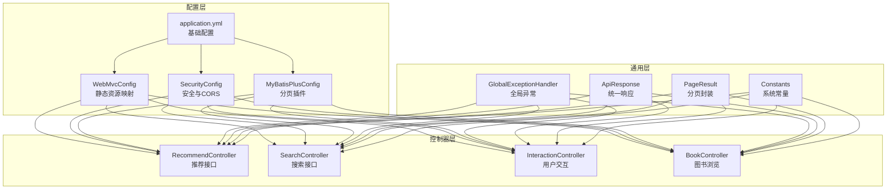
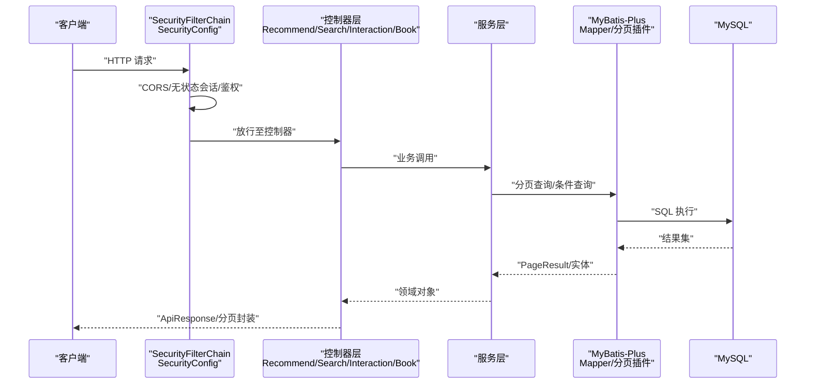
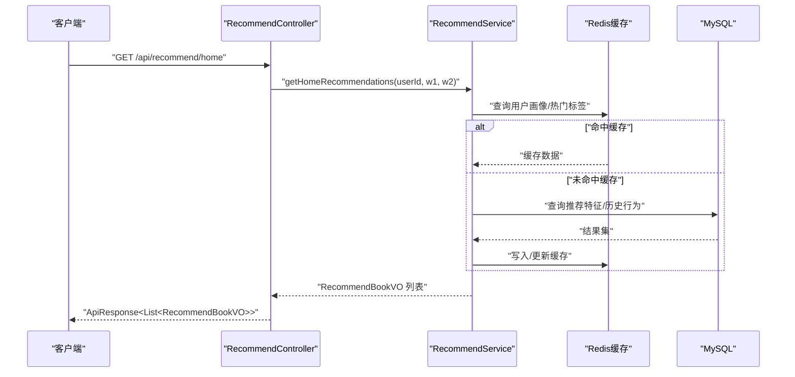
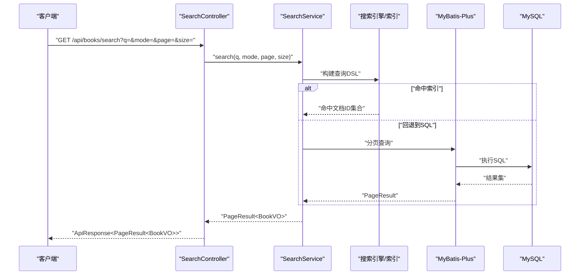
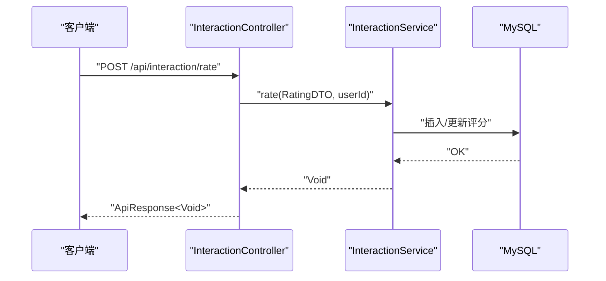
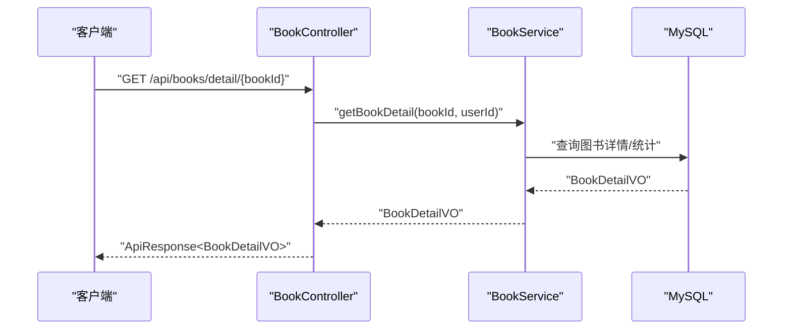
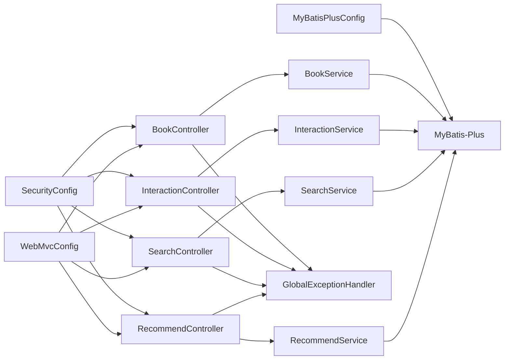

# 接口性能优化

<cite>
**本文档引用的文件**
- [WebMvcConfig.java](file://src/main/java/org/example/backend/config/WebMvcConfig.java)
- [SecurityConfig.java](file://src/main/java/org/example/backend/config/SecurityConfig.java)
- [MyBatisPlusConfig.java](file://src/main/java/org/example/backend/config/MyBatisPlusConfig.java)
- [application.yml](file://src/main/resources/application.yml)
- [pom.xml](file://pom.xml)
- [RecommendController.java](file://src/main/java/org/example/backend/modules/recommend/controller/RecommendController.java)
- [SearchController.java](file://src/main/java/org/example/backend/modules/search/controller/SearchController.java)
- [InteractionController.java](file://src/main/java/org/example/backend/modules/interaction/controller/InteractionController.java)
- [BookController.java](file://src/main/java/org/example/backend/modules/book/controller/BookController.java)
- [GlobalExceptionHandler.java](file://src/main/java/org/example/backend/common/exception/GlobalExceptionHandler.java)
- [Constants.java](file://src/main/java/org/example/backend/common/constants/Constants.java)
- [ApiResponse.java](file://src/main/java/org/example/backend/common/ApiResponse.java)
- [PageResult.java](file://src/main/java/org/example/backend/common/PageResult.java)
- [BackendApplication.java](file://src/main/java/org/example/backend/BackendApplication.java)
</cite>

## 目录
1. [简介](#简介)
2. [项目结构](#项目结构)
3. [核心组件](#核心组件)
4. [架构总览](#架构总览)
5. [详细组件分析](#详细组件分析)
6. [依赖关系分析](#依赖关系分析)
7. [性能考虑](#性能考虑)
8. [故障排查指南](#故障排查指南)
9. [结论](#结论)
10. [附录](#附录)

## 简介
本指南聚焦于Spring MVC接口性能优化与高并发场景下的工程实践，结合当前代码库现状，系统阐述以下内容：
- Spring MVC配置优化与请求处理优化
- 响应式编程与异步处理思路（基于现有同步实现的扩展建议）
- 线程池配置与限流、熔断、降级策略
- 接口压缩与GZIP传输优化、静态资源缓存策略
- 性能测试方法、响应时间监控与并发压力测试方案
- 高频接口（推荐、搜索、用户交互）优化实践

## 项目结构
后端采用标准Spring Boot分层架构：配置层、控制器层、服务层、数据访问层、通用工具与异常处理。核心配置集中在config包，高频接口分布在recommend、search、interaction、book模块。

图表来源
- [WebMvcConfig.java](file://src/main/java/org/example/backend/config/WebMvcConfig.java#L20-L25)
- [SecurityConfig.java](file://src/main/java/org/example/backend/config/SecurityConfig.java#L46-L81)
- [MyBatisPlusConfig.java](file://src/main/java/org/example/backend/config/MyBatisPlusConfig.java#L20-L25)
- [application.yml](file://src/main/resources/application.yml#L1-L71)
- [RecommendController.java](file://src/main/java/org/example/backend/modules/recommend/controller/RecommendController.java#L27-L128)
- [SearchController.java](file://src/main/java/org/example/backend/modules/search/controller/SearchController.java#L24-L33)
- [InteractionController.java](file://src/main/java/org/example/backend/modules/interaction/controller/InteractionController.java#L29-L85)
- [BookController.java](file://src/main/java/org/example/backend/modules/book/controller/BookController.java#L25-L57)
- [GlobalExceptionHandler.java](file://src/main/java/org/example/backend/common/exception/GlobalExceptionHandler.java#L33-L108)
- [ApiResponse.java](file://src/main/java/org/example/backend/common/ApiResponse.java#L42-L58)
- [PageResult.java](file://src/main/java/org/example/backend/common/PageResult.java#L55-L57)
- [Constants.java](file://src/main/java/org/example/backend/common/constants/Constants.java#L25-L31)

章节来源
- [WebMvcConfig.java](file://src/main/java/org/example/backend/config/WebMvcConfig.java#L1-L29)
- [SecurityConfig.java](file://src/main/java/org/example/backend/config/SecurityConfig.java#L1-L101)
- [MyBatisPlusConfig.java](file://src/main/java/org/example/backend/config/MyBatisPlusConfig.java#L1-L28)
- [application.yml](file://src/main/resources/application.yml#L1-L71)

## 核心组件
- WebMvc配置：静态资源映射，确保上传资源可被正确访问。
- 安全配置：无状态会话、CORS、公开接口白名单、JWT过滤器链。
- MyBatis-Plus：全局分页插件，提升查询性能与可维护性。
- 统一响应与分页：标准化返回结构，便于前端与监控侧处理。
- 全局异常：集中处理业务异常、参数校验异常与安全异常，避免重复逻辑。

章节来源
- [WebMvcConfig.java](file://src/main/java/org/example/backend/config/WebMvcConfig.java#L20-L25)
- [SecurityConfig.java](file://src/main/java/org/example/backend/config/SecurityConfig.java#L46-L98)
- [MyBatisPlusConfig.java](file://src/main/java/org/example/backend/config/MyBatisPlusConfig.java#L20-L25)
- [ApiResponse.java](file://src/main/java/org/example/backend/common/ApiResponse.java#L42-L58)
- [PageResult.java](file://src/main/java/org/example/backend/common/PageResult.java#L55-L57)
- [GlobalExceptionHandler.java](file://src/main/java/org/example/backend/common/exception/GlobalExceptionHandler.java#L33-L108)

## 架构总览
下图展示从客户端到控制器、服务与数据访问的整体调用链路，以及安全与静态资源的关键节点。

图表来源
- [SecurityConfig.java](file://src/main/java/org/example/backend/config/SecurityConfig.java#L46-L81)
- [RecommendController.java](file://src/main/java/org/example/backend/modules/recommend/controller/RecommendController.java#L27-L39)
- [SearchController.java](file://src/main/java/org/example/backend/modules/search/controller/SearchController.java#L24-L33)
- [InteractionController.java](file://src/main/java/org/example/backend/modules/interaction/controller/InteractionController.java#L29-L35)
- [BookController.java](file://src/main/java/org/example/backend/modules/book/controller/BookController.java#L51-L57)
- [MyBatisPlusConfig.java](file://src/main/java/org/example/backend/config/MyBatisPlusConfig.java#L20-L25)

## 详细组件分析

### WebMvc配置优化
- 静态资源映射：通过资源处理器将上传目录映射为可访问URL，避免额外代理配置。
- 建议：结合Nginx/CDN进行静态资源加速与缓存控制；在生产环境开启ETag/Last-Modified缓存策略。

章节来源
- [WebMvcConfig.java](file://src/main/java/org/example/backend/config/WebMvcConfig.java#L20-L25)
- [application.yml](file://src/main/resources/application.yml#L57-L62)

### 安全与CORS配置
- 无状态会话：SessionCreationPolicy.STATELESS，降低会话存储开销。
- CORS：允许所有来源与方法，设置凭证与缓存时间，减少预检请求开销。
- 白名单接口：对公开接口（如登录、搜索、推荐、静态资源）免鉴权，减少不必要的鉴权成本。

章节来源
- [SecurityConfig.java](file://src/main/java/org/example/backend/config/SecurityConfig.java#L46-L98)

### MyBatis-Plus分页插件
- 全局分页拦截器：自动注入分页能力，避免重复分页逻辑，提升查询性能与一致性。
- 建议：结合数据库索引与LIMIT/OFFSET优化，必要时使用覆盖索引与游标分页。

章节来源
- [MyBatisPlusConfig.java](file://src/main/java/org/example/backend/config/MyBatisPlusConfig.java#L20-L25)

### 统一响应与分页封装
- ApiResponse：统一状态码与消息格式，便于前端与监控侧处理。
- PageResult：封装分页字段，计算总页数，减少前端重复计算。

章节来源
- [ApiResponse.java](file://src/main/java/org/example/backend/common/ApiResponse.java#L42-L58)
- [PageResult.java](file://src/main/java/org/example/backend/common/PageResult.java#L55-L57)

### 全局异常处理
- 业务异常：以200状态返回业务错误码，避免HTTP状态污染。
- 参数校验异常：聚合字段错误信息，快速定位问题。
- 安全异常：区分未授权与权限不足，便于前端引导登录或提示。

章节来源
- [GlobalExceptionHandler.java](file://src/main/java/org/example/backend/common/exception/GlobalExceptionHandler.java#L33-L108)

### 推荐接口（高频）
- 接口类型：首页推荐、新书、热门、主题、相似、用户也读、曝光/点击、反馈、热门主题、长尾推荐。
- 性能要点：参数权重默认值、曝光/点击/反馈记录需幂等与去重；建议引入Redis缓存热门榜单与用户画像特征。

图表来源
- [RecommendController.java](file://src/main/java/org/example/backend/modules/recommend/controller/RecommendController.java#L27-L39)

章节来源
- [RecommendController.java](file://src/main/java/org/example/backend/modules/recommend/controller/RecommendController.java#L27-L128)

### 搜索接口（高频）
- 接口类型：关键词/语义/混合搜索，支持分页。
- 性能要点：结合分页插件与合理LIMIT；建议引入ES或搜索引擎以提升检索性能；对热门词建立缓存。

图表来源
- [SearchController.java](file://src/main/java/org/example/backend/modules/search/controller/SearchController.java#L24-L33)
- [MyBatisPlusConfig.java](file://src/main/java/org/example/backend/config/MyBatisPlusConfig.java#L20-L25)

章节来源
- [SearchController.java](file://src/main/java/org/example/backend/modules/search/controller/SearchController.java#L24-L33)
- [Constants.java](file://src/main/java/org/example/backend/common/constants/Constants.java#L64-L77)

### 用户交互接口（高频）
- 接口类型：评分、收藏/取消收藏、评论增删改查、借阅/归还申请。
- 性能要点：评论列表分页；评分/收藏/评论写操作需幂等与去重；建议对热点图书的评论总数与评分做缓存。

图表来源
- [InteractionController.java](file://src/main/java/org/example/backend/modules/interaction/controller/InteractionController.java#L29-L35)

章节来源
- [InteractionController.java](file://src/main/java/org/example/backend/modules/interaction/controller/InteractionController.java#L29-L85)

### 图书浏览接口（高频）
- 接口类型：列表、筛选、详情。
- 性能要点：详情接口记录浏览埋点（匿名支持），建议对热门图书详情与列表加缓存；筛选条件走索引。

图表来源
- [BookController.java](file://src/main/java/org/example/backend/modules/book/controller/BookController.java#L51-L57)

章节来源
- [BookController.java](file://src/main/java/org/example/backend/modules/book/controller/BookController.java#L25-L57)

## 依赖关系分析
- 控制器依赖服务接口，服务依赖Mapper与实体；异常处理器对全局生效。
- 配置类贯穿请求生命周期：WebMvc负责静态资源，Security负责鉴权与CORS，MyBatis-Plus负责分页。

图表来源
- [RecommendController.java](file://src/main/java/org/example/backend/modules/recommend/controller/RecommendController.java#L24-L25)
- [SearchController.java](file://src/main/java/org/example/backend/modules/search/controller/SearchController.java#L21-L22)
- [InteractionController.java](file://src/main/java/org/example/backend/modules/interaction/controller/InteractionController.java#L26-L27)
- [BookController.java](file://src/main/java/org/example/backend/modules/book/controller/BookController.java#L22-L23)
- [GlobalExceptionHandler.java](file://src/main/java/org/example/backend/common/exception/GlobalExceptionHandler.java#L25-L26)
- [WebMvcConfig.java](file://src/main/java/org/example/backend/config/WebMvcConfig.java#L11-L12)
- [SecurityConfig.java](file://src/main/java/org/example/backend/config/SecurityConfig.java#L30-L33)
- [MyBatisPlusConfig.java](file://src/main/java/org/example/backend/config/MyBatisPlusConfig.java#L13-L15)

章节来源
- [pom.xml](file://pom.xml#L19-L115)

## 性能考虑

### Spring MVC配置优化
- 静态资源优化：结合Nginx/CDN设置强缓存与压缩；在application.yml中可增加静态资源缓存策略（如max-age）。
- 跨域优化：生产环境限制AllowedOriginPatterns，避免通配符带来的安全与性能风险。
- 会话优化：保持STATELESS，避免服务器端会话存储。

章节来源
- [WebMvcConfig.java](file://src/main/java/org/example/backend/config/WebMvcConfig.java#L20-L25)
- [SecurityConfig.java](file://src/main/java/org/example/backend/config/SecurityConfig.java#L46-L98)
- [application.yml](file://src/main/resources/application.yml#L57-L62)

### 请求处理优化
- 参数校验前置：利用全局异常处理减少分支判断，提升代码可读性与一致性。
- 分页策略：使用MyBatis-Plus分页插件，限制最大分页大小，防止超大offset导致慢查询。
- 响应封装：统一ApiResponse与PageResult，便于前端与监控侧处理。

章节来源
- [GlobalExceptionHandler.java](file://src/main/java/org/example/backend/common/exception/GlobalExceptionHandler.java#L33-L108)
- [MyBatisPlusConfig.java](file://src/main/java/org/example/backend/config/MyBatisPlusConfig.java#L20-L25)
- [Constants.java](file://src/main/java/org/example/backend/common/constants/Constants.java#L25-L31)
- [ApiResponse.java](file://src/main/java/org/example/backend/common/ApiResponse.java#L42-L58)
- [PageResult.java](file://src/main/java/org/example/backend/common/PageResult.java#L55-L57)

### 响应式编程与异步处理
- 现状：当前控制器均为同步阻塞实现。
- 建议（扩展方向）：
  - 引入WebFlux与响应式数据源（如R2DBC），将IO密集型接口（如搜索、推荐）改造为非阻塞。
  - 对写操作（评分、收藏、评论、借阅）采用异步队列（消息中间件）削峰填谷，保证读性能稳定。
  - 使用线程池隔离不同业务类型（读/写/计算），避免相互影响。

[本节为概念性指导，不直接分析具体文件]

### 线程池配置
- Tomcat/NIO线程池：根据CPU核数与QPS设定最大连接数与线程池大小。
- 自定义线程池：针对耗时任务（如日志、报表、外部调用）单独配置，避免占用Web线程。
- 建议：使用有界队列与饱和策略，防止内存溢出。

[本节为通用指导，不直接分析具体文件]

### 接口限流、熔断与降级
- 限流：基于令牌桶/滑动窗口对高频接口（搜索、推荐、详情）进行QPS限制。
- 熔断：对下游依赖（外部服务、搜索引擎）设置熔断器，超阈值快速失败。
- 降级：在高峰期返回兜底数据（如缓存热门榜）、延迟加载非关键信息。

[本节为通用指导，不直接分析具体文件]

### 接口压缩与GZIP传输优化
- 开启GZIP：在Nginx/Tomcat层面启用压缩，对JSON响应体进行gzip压缩，显著降低带宽。
- 前端缓存：静态资源设置长期缓存与版本号，减少重复下载。

[本节为通用指导，不直接分析具体文件]

### 静态资源缓存策略
- 上传资源：通过WebMvcConfig映射到本地文件系统，建议配合CDN与强缓存策略。
- 前端静态资源：构建时加入哈希后缀，结合浏览器缓存与Service Worker离线缓存。

章节来源
- [WebMvcConfig.java](file://src/main/java/org/example/backend/config/WebMvcConfig.java#L20-L25)
- [application.yml](file://src/main/resources/application.yml#L57-L62)

### 性能测试方法
- 压力测试：使用JMeter/Gatling对推荐、搜索、交互接口施加阶梯负载，观察P99延迟与错误率。
- 并发测试：模拟高并发用户同时访问首页推荐与搜索，评估线程池与数据库连接池表现。
- 监控指标：关注CPU、内存、GC、连接池、数据库QPS与慢查询、Redis命中率。

[本节为通用指导，不直接分析具体文件]

### 接口响应时间监控
- 埋点：在控制器入口与关键服务方法埋点，记录请求开始、结束与异常时间。
- 报表：结合Prometheus+Grafana或APM工具，可视化响应时间分布与趋势。

[本节为通用指导，不直接分析具体文件]

### 高频接口优化实践
- 推荐接口
  - 缓存热门主题、长尾推荐、用户画像特征。
  - 曝光/点击/反馈记录采用幂等写入与批量入库。
- 搜索接口
  - 热门词与搜索建议缓存；混合模式下优先走索引。
  - 分页LIMIT上限控制，避免深度分页。
- 用户交互接口
  - 评论列表分页与总数缓存；评分/收藏/评论写操作异步化。

章节来源
- [RecommendController.java](file://src/main/java/org/example/backend/modules/recommend/controller/RecommendController.java#L27-L128)
- [SearchController.java](file://src/main/java/org/example/backend/modules/search/controller/SearchController.java#L24-L33)
- [InteractionController.java](file://src/main/java/org/example/backend/modules/interaction/controller/InteractionController.java#L29-L85)

## 故障排查指南
- 参数校验失败：检查全局异常处理器对MethodArgumentNotValidException、BindException、ConstraintViolationException的聚合输出。
- 权限不足：确认SecurityConfig中的白名单与角色配置是否匹配。
- 业务异常：统一通过BusinessException抛出，由全局异常处理器以200状态返回业务错误码。
- 数据库慢查询：结合分页插件与LIMIT上限，检查索引与SQL执行计划。

章节来源
- [GlobalExceptionHandler.java](file://src/main/java/org/example/backend/common/exception/GlobalExceptionHandler.java#L33-L108)
- [SecurityConfig.java](file://src/main/java/org/example/backend/config/SecurityConfig.java#L52-L78)
- [MyBatisPlusConfig.java](file://src/main/java/org/example/backend/config/MyBatisPlusConfig.java#L20-L25)

## 结论
本指南基于现有代码库现状，总结了Spring MVC配置、安全与CORS、分页插件、统一响应与异常处理等关键组件的性能优化要点，并提出了面向高并发的响应式改造、异步处理、线程池配置、限流熔断与降级、GZIP压缩与静态资源缓存、性能测试与监控等系统性方案。高频接口（推荐、搜索、用户交互）的优化建议可作为后续迭代的重点方向。

## 附录
- 项目启动类：BackendApplication.java
- Maven依赖：pom.xml中包含Spring Web、Security、MyBatis-Plus、Swagger、Redis等依赖

章节来源
- [BackendApplication.java](file://src/main/java/org/example/backend/BackendApplication.java)
- [pom.xml](file://pom.xml#L19-L115)