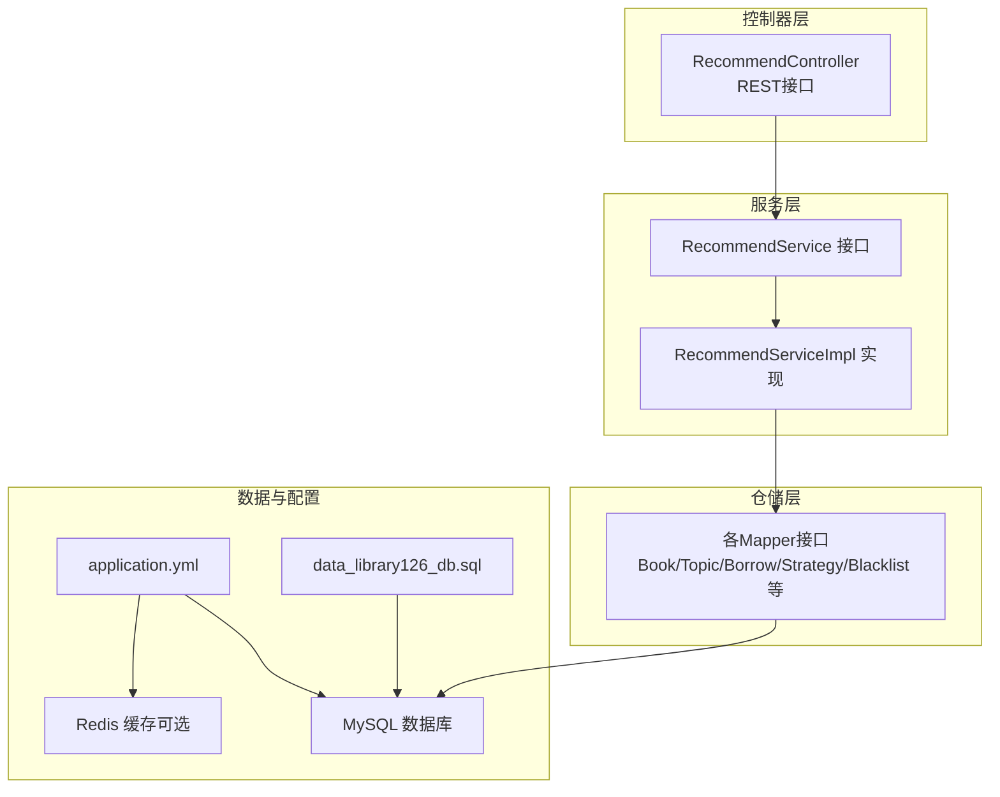
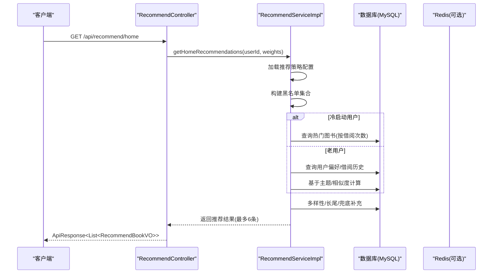
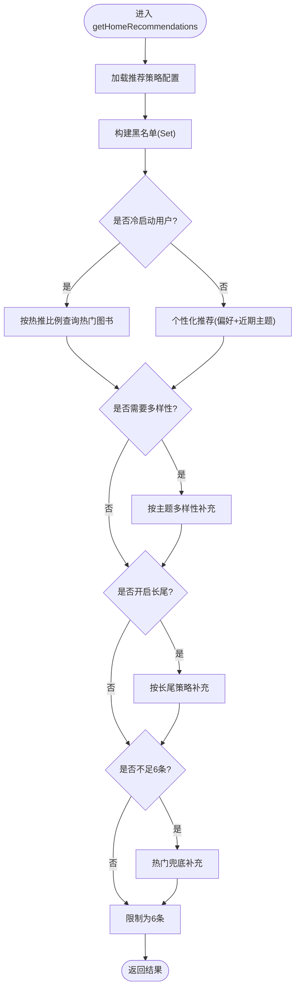
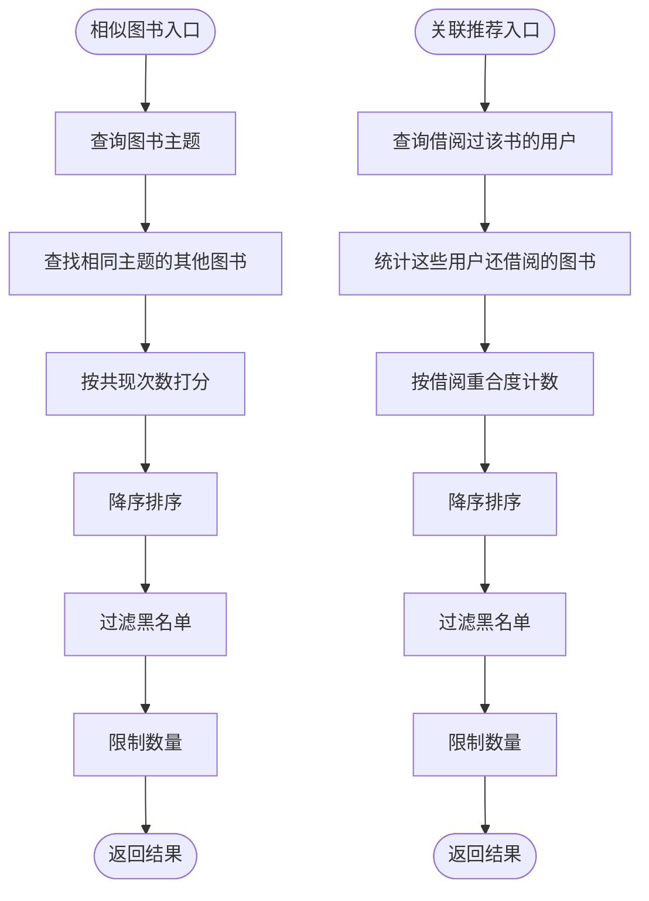
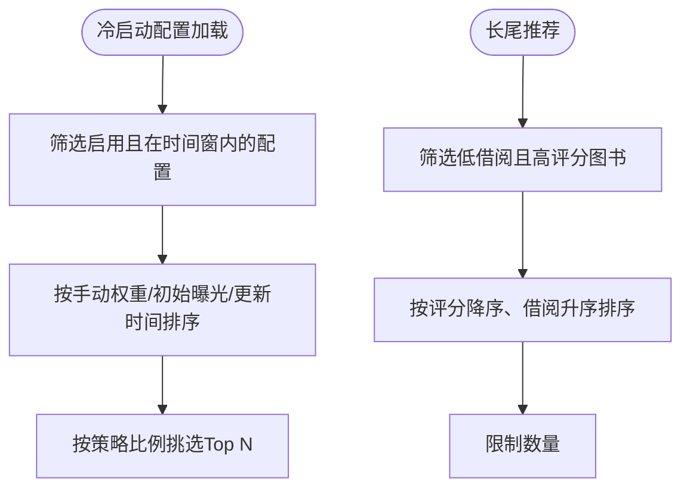
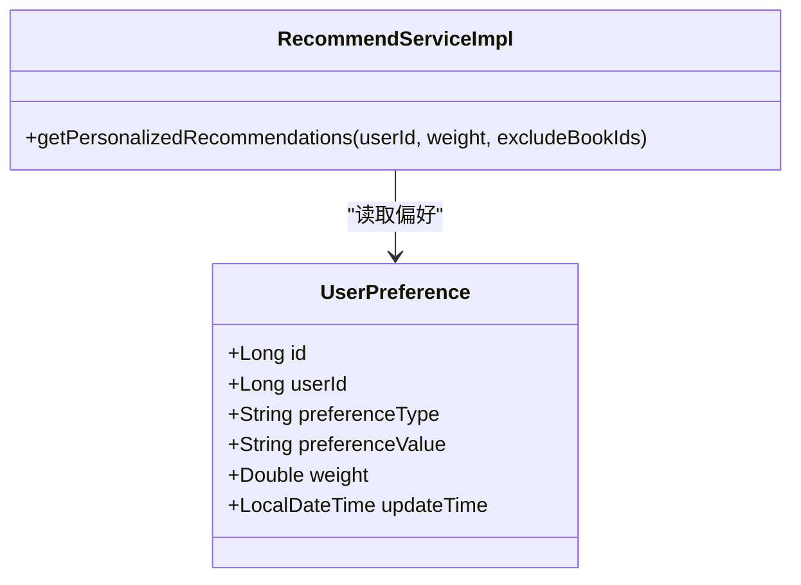
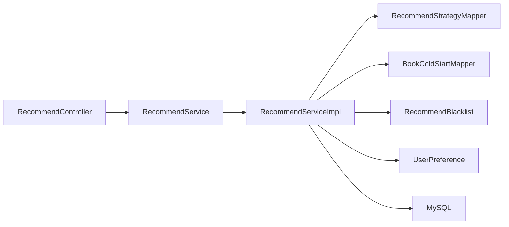

# 推荐算法优化

<cite>
**本文引用的文件**
- [RecommendServiceImpl.java](file://src/main/java/org/example/backend/modules/recommend/service/impl/RecommendServiceImpl.java)
- [RecommendController.java](file://src/main/java/org/example/backend/modules/recommend/controller/RecommendController.java)
- [RecommendService.java](file://src/main/java/org/example/backend/modules/recommend/service/RecommendService.java)
- [application.yml](file://src/main/resources/application.yml)
- [data_library126_db.sql](file://src/main/resources/data_library126_db.sql)
- [RecommendStrategy.java](file://src/main/java/org/example/backend/entity/RecommendStrategy.java)
- [RecommendStrategyMapper.java](file://src/main/java/org/example/backend/modules/recommend/repository/RecommendStrategyMapper.java)
- [BookColdStart.java](file://src/main/java/org/example/backend/entity/BookColdStart.java)
- [BookColdStartMapper.java](file://src/main/java/org/example/backend/modules/recommend/repository/BookColdStartMapper.java)
- [RecommendBookVO.java](file://src/main/java/org/example/backend/vo/recommend/RecommendBookVO.java)
- [RecommendBlacklist.java](file://src/main/java/org/example/backend/entity/RecommendBlacklist.java)
- [UserPreference.java](file://src/main/java/org/example/backend/entity/UserPreference.java)
- [AdminServiceImpl.java](file://src/main/java/org/example/backend/modules/admin/service/impl/AdminServiceImpl.java)
- [AdminStatsMapper.java](file://src/main/java/org/example/backend/modules/admin/repository/AdminStatsMapper.java)
</cite>

## 目录
1. [简介](#简介)
2. [项目结构](#项目结构)
3. [核心组件](#核心组件)
4. [架构总览](#架构总览)
5. [详细组件分析](#详细组件分析)
6. [依赖分析](#依赖分析)
7. [性能考量](#性能考量)
8. [故障排查指南](#故障排查指南)
9. [结论](#结论)
10. [附录](#附录)

## 简介
本指南聚焦于个性化推荐算法在本项目的性能优化实践，围绕时间复杂度优化、空间复杂度控制、计算资源管理、并行化与批处理、增量更新策略、用户画像更新、相似度计算加速、向量运算优化、推荐结果去重、排序优化、实时延迟控制、内存与缓存策略、冷启动与长尾平衡、以及算法性能测试与评估指标展开。文档以代码为依据，结合数据库结构与配置，给出可落地的优化建议与可视化图示。

## 项目结构
推荐模块采用分层架构：控制器层负责HTTP接口与参数解析；服务层实现推荐主流程与子策略；仓储层通过MyBatis-Plus访问数据库；VO/实体类承载数据模型；配置文件提供数据库与Redis连接参数；SQL脚本定义表结构与索引。

图表来源
- [RecommendController.java](file://src/main/java/org/example/backend/modules/recommend/controller/RecommendController.java#L1-L130)
- [RecommendService.java](file://src/main/java/org/example/backend/modules/recommend/service/RecommendService.java#L1-L70)
- [RecommendServiceImpl.java](file://src/main/java/org/example/backend/modules/recommend/service/impl/RecommendServiceImpl.java#L1-L927)
- [application.yml](file://src/main/resources/application.yml#L1-L71)
- [data_library126_db.sql](file://src/main/resources/data_library126_db.sql#L1-L200)

章节来源
- [RecommendController.java](file://src/main/java/org/example/backend/modules/recommend/controller/RecommendController.java#L1-L130)
- [RecommendService.java](file://src/main/java/org/example/backend/modules/recommend/service/RecommendService.java#L1-L70)
- [application.yml](file://src/main/resources/application.yml#L1-L71)
- [data_library126_db.sql](file://src/main/resources/data_library126_db.sql#L1-L200)

## 核心组件
- 推荐控制器：提供首页推荐、新书、热门、主题、相似、关联、曝光、点击、反馈、热门主题、长尾等接口，统一参数解析与响应封装。
- 推荐服务实现：实现首页多策略组合（冷启动、个性化、多样性、长尾、兜底）、相似度计算、黑名单过滤、曝光/点击/反馈记录等。
- 数据模型与策略：推荐策略配置、冷启动配置、黑名单、用户偏好、推荐结果VO等。
- 数据库与索引：book_topics、book_views、user_behaviors、recommend_strategy、book_cold_start、recommend_blacklist等表及索引设计支撑推荐逻辑。

章节来源
- [RecommendController.java](file://src/main/java/org/example/backend/modules/recommend/controller/RecommendController.java#L1-L130)
- [RecommendServiceImpl.java](file://src/main/java/org/example/backend/modules/recommend/service/impl/RecommendServiceImpl.java#L1-L927)
- [RecommendStrategy.java](file://src/main/java/org/example/backend/entity/RecommendStrategy.java#L1-L54)
- [BookColdStart.java](file://src/main/java/org/example/backend/entity/BookColdStart.java#L1-L48)
- [RecommendBookVO.java](file://src/main/java/org/example/backend/vo/recommend/RecommendBookVO.java#L1-L42)
- [RecommendBlacklist.java](file://src/main/java/org/example/backend/entity/RecommendBlacklist.java#L1-L44)
- [UserPreference.java](file://src/main/java/org/example/backend/entity/UserPreference.java#L1-L49)

## 架构总览
推荐系统整体流程：控制器接收请求，调用服务层；服务层根据策略加载配置、构建黑名单、执行冷启动/个性化/多样性/长尾/兜底策略，最终返回推荐结果。曝光、点击、反馈作为离线/准实时信号用于后续策略迭代。

图表来源
- [RecommendController.java](file://src/main/java/org/example/backend/modules/recommend/controller/RecommendController.java#L27-L39)
- [RecommendServiceImpl.java](file://src/main/java/org/example/backend/modules/recommend/service/impl/RecommendServiceImpl.java#L94-L188)
- [application.yml](file://src/main/resources/application.yml#L31-L43)

## 详细组件分析

### 首页推荐主流程与多策略组合
- 策略加载：从recommend_strategy表按key读取热推比例、全局多样性权重、冷启动热推比例、长尾比例、阈值、开关等。
- 冷启动：新用户或未完成兴趣引导的用户，按冷启动热推比例优先推荐热门图书。
- 个性化：老用户基于偏好主题与近期阅读主题进行相似图书检索与打分。
- 多样性：补充用户未涉猎的主题图书，避免信息茧房。
- 长尾：在开启状态下，补充低借阅但高评分的图书。
- 兜底：不足时用热门图书补齐，排除黑名单与已推荐项。
- 结果上限：最终限制为6条。

图表来源
- [RecommendServiceImpl.java](file://src/main/java/org/example/backend/modules/recommend/service/impl/RecommendServiceImpl.java#L94-L188)
- [RecommendStrategy.java](file://src/main/java/org/example/backend/entity/RecommendStrategy.java#L1-L54)

章节来源
- [RecommendServiceImpl.java](file://src/main/java/org/example/backend/modules/recommend/service/impl/RecommendServiceImpl.java#L94-L188)
- [RecommendStrategy.java](file://src/main/java/org/example/backend/entity/RecommendStrategy.java#L1-L54)

### 相似度计算与去重优化
- 相似图书：基于book_topics表统计同一主题下的图书共现频次，按频次降序排序，过滤黑名单后取Top N。
- 关联推荐：基于共同借阅用户，统计其他图书的借阅重合度，过滤黑名单后取Top N。
- 去重策略：使用Set维护黑名单与已推荐ID，避免重复与跨场景污染。

图表来源
- [RecommendServiceImpl.java](file://src/main/java/org/example/backend/modules/recommend/service/impl/RecommendServiceImpl.java#L548-L602)
- [RecommendServiceImpl.java](file://src/main/java/org/example/backend/modules/recommend/service/impl/RecommendServiceImpl.java#L604-L656)
- [RecommendBlacklist.java](file://src/main/java/org/example/backend/entity/RecommendBlacklist.java#L1-L44)

章节来源
- [RecommendServiceImpl.java](file://src/main/java/org/example/backend/modules/recommend/service/impl/RecommendServiceImpl.java#L548-L602)
- [RecommendServiceImpl.java](file://src/main/java/org/example/backend/modules/recommend/service/impl/RecommendServiceImpl.java#L604-L656)
- [RecommendBlacklist.java](file://src/main/java/org/example/backend/entity/RecommendBlacklist.java#L1-L44)

### 冷启动与长尾策略
- 冷启动：通过book_cold_start表配置运营扶持（手动权重、初始曝光、时间窗口），加载时按权重/曝光/更新时间排序，优先展示。
- 长尾：基于借阅次数阈值与平均评分筛选，先按评分降序、再按借阅次数升序，兼顾质量与曝光机会。

图表来源
- [RecommendServiceImpl.java](file://src/main/java/org/example/backend/modules/recommend/service/impl/RecommendServiceImpl.java#L697-L716)
- [RecommendServiceImpl.java](file://src/main/java/org/example/backend/modules/recommend/service/impl/RecommendServiceImpl.java#L387-L412)
- [BookColdStart.java](file://src/main/java/org/example/backend/entity/BookColdStart.java#L1-L48)

章节来源
- [RecommendServiceImpl.java](file://src/main/java/org/example/backend/modules/recommend/service/impl/RecommendServiceImpl.java#L697-L716)
- [RecommendServiceImpl.java](file://src/main/java/org/example/backend/modules/recommend/service/impl/RecommendServiceImpl.java#L387-L412)
- [BookColdStart.java](file://src/main/java/org/example/backend/entity/BookColdStart.java#L1-L48)

### 用户画像与偏好更新
- 用户偏好：user_preference表存储用户偏好的类型与值，服务层按偏好主题检索book_topics并统计共现，作为个性化推荐依据。
- 偏好权重：实体含weight字段，可在扩展中用于加权打分（当前实现按共现次数计数）。

图表来源
- [UserPreference.java](file://src/main/java/org/example/backend/entity/UserPreference.java#L1-L49)
- [RecommendServiceImpl.java](file://src/main/java/org/example/backend/modules/recommend/service/impl/RecommendServiceImpl.java#L216-L314)

章节来源
- [UserPreference.java](file://src/main/java/org/example/backend/entity/UserPreference.java#L1-L49)
- [RecommendServiceImpl.java](file://src/main/java/org/example/backend/modules/recommend/service/impl/RecommendServiceImpl.java#L216-L314)

### 排序与结果封装
- 排序：热门、长尾、相似、关联等均采用降序/升序排序，配合LIMIT限制输出规模。
- 结果封装：RecommendBookVO包含book基础信息与reason字段，reason用于标注推荐理由（便于运营与分析）。

章节来源
- [RecommendServiceImpl.java](file://src/main/java/org/example/backend/modules/recommend/service/impl/RecommendServiceImpl.java#L133-L138)
- [RecommendServiceImpl.java](file://src/main/java/org/example/backend/modules/recommend/service/impl/RecommendServiceImpl.java#L394-L403)
- [RecommendServiceImpl.java](file://src/main/java/org/example/backend/modules/recommend/service/impl/RecommendServiceImpl.java#L576-L580)
- [RecommendServiceImpl.java](file://src/main/java/org/example/backend/modules/recommend/service/impl/RecommendServiceImpl.java#L630-L634)
- [RecommendBookVO.java](file://src/main/java/org/example/backend/vo/recommend/RecommendBookVO.java#L1-L42)

## 依赖分析
- 控制器依赖服务接口，服务实现依赖多个Mapper与实体。
- 推荐策略与冷启动配置通过Mapper访问数据库，策略值决定各阶段权重与阈值。
- 黑名单支持按推荐类型与位置过滤，提升跨场景一致性。

图表来源
- [RecommendController.java](file://src/main/java/org/example/backend/modules/recommend/controller/RecommendController.java#L1-L130)
- [RecommendService.java](file://src/main/java/org/example/backend/modules/recommend/service/RecommendService.java#L1-L70)
- [RecommendServiceImpl.java](file://src/main/java/org/example/backend/modules/recommend/service/impl/RecommendServiceImpl.java#L1-L927)
- [RecommendStrategyMapper.java](file://src/main/java/org/example/backend/modules/recommend/repository/RecommendStrategyMapper.java#L1-L14)
- [BookColdStartMapper.java](file://src/main/java/org/example/backend/modules/recommend/repository/BookColdStartMapper.java#L1-L13)
- [RecommendBlacklist.java](file://src/main/java/org/example/backend/entity/RecommendBlacklist.java#L1-L44)
- [UserPreference.java](file://src/main/java/org/example/backend/entity/UserPreference.java#L1-L49)

章节来源
- [RecommendController.java](file://src/main/java/org/example/backend/modules/recommend/controller/RecommendController.java#L1-L130)
- [RecommendService.java](file://src/main/java/org/example/backend/modules/recommend/service/RecommendService.java#L1-L70)
- [RecommendServiceImpl.java](file://src/main/java/org/example/backend/modules/recommend/service/impl/RecommendServiceImpl.java#L1-L927)

## 性能考量

### 时间复杂度优化
- 热门/长尾/多样补全：使用ORDER BY + LIMIT，避免全表扫描；确保相关列建立索引（如book.borrow_count、book.avg_rating、book_topics.topic_name等）。
- 相似/关联：利用IN/EXISTS/JOIN与GROUP BY聚合，减少嵌套循环；对大集合使用Set去重与过滤。
- 个性化：偏好主题检索与近期主题统计应限制查询规模（如LIMIT 10/20），避免全量扫描。

章节来源
- [RecommendServiceImpl.java](file://src/main/java/org/example/backend/modules/recommend/service/impl/RecommendServiceImpl.java#L133-L138)
- [RecommendServiceImpl.java](file://src/main/java/org/example/backend/modules/recommend/service/impl/RecommendServiceImpl.java#L394-L403)
- [RecommendServiceImpl.java](file://src/main/java/org/example/backend/modules/recommend/service/impl/RecommendServiceImpl.java#L225-L230)
- [RecommendServiceImpl.java](file://src/main/java/org/example/backend/modules/recommend/service/impl/RecommendServiceImpl.java#L325-L329)

### 空间复杂度控制
- 中间集合：Map/HashSet仅保存必要键值（如bookId、topicName），及时释放无用引用。
- 批量查询：selectBatchIds按需批量拉取，避免一次性加载过多对象。
- VO封装：仅传递前端所需字段，避免冗余序列化开销。

章节来源
- [RecommendServiceImpl.java](file://src/main/java/org/example/backend/modules/recommend/service/impl/RecommendServiceImpl.java#L250-L260)
- [RecommendServiceImpl.java](file://src/main/java/org/example/backend/modules/recommend/service/impl/RecommendServiceImpl.java#L280-L286)
- [RecommendServiceImpl.java](file://src/main/java/org/example/backend/modules/recommend/service/impl/RecommendServiceImpl.java#L232-L234)

### 计算资源管理
- 事务边界：曝光/点击/反馈使用@Transactional，避免频繁提交造成资源浪费。
- 策略读取：推荐策略配置读取异常时回退默认值，避免阻塞主流程。

章节来源
- [RecommendServiceImpl.java](file://src/main/java/org/example/backend/modules/recommend/service/impl/RecommendServiceImpl.java#L659-L692)
- [RecommendServiceImpl.java](file://src/main/java/org/example/backend/modules/recommend/service/impl/RecommendServiceImpl.java#L467-L476)

### 并行化与批处理
- 批量查询：selectBatchIds、selectList(LIMIT N)减少多次往返。
- 并行建议：在多线程环境下，对独立任务（如不同场景的补全）可考虑并行执行，但需注意线程安全与锁竞争。

章节来源
- [RecommendServiceImpl.java](file://src/main/java/org/example/backend/modules/recommend/service/impl/RecommendServiceImpl.java#L263-L264)
- [RecommendServiceImpl.java](file://src/main/java/org/example/backend/modules/recommend/service/impl/RecommendServiceImpl.java#L301-L302)
- [RecommendServiceImpl.java](file://src/main/java/org/example/backend/modules/recommend/service/impl/RecommendServiceImpl.java#L542-L544)

### 增量更新策略
- 偏好与行为：用户偏好与借阅行为可作为增量输入，结合黑名单与策略动态调整推荐权重。
- 冷启动：按时间窗口与手动权重增量投放，避免全量重算。

章节来源
- [RecommendServiceImpl.java](file://src/main/java/org/example/backend/modules/recommend/service/impl/RecommendServiceImpl.java#L697-L716)
- [UserPreference.java](file://src/main/java/org/example/backend/entity/UserPreference.java#L1-L49)

### 相似度计算加速
- 基于共现计数：使用GROUP BY与COUNT聚合，避免双重循环。
- 索引优化：book_topics.idx_topic_name、idx_book_id；recommend_blacklist.idx_recommend_type等。

章节来源
- [RecommendServiceImpl.java](file://src/main/java/org/example/backend/modules/recommend/service/impl/RecommendServiceImpl.java#L280-L286)
- [RecommendServiceImpl.java](file://src/main/java/org/example/backend/modules/recommend/service/impl/RecommendServiceImpl.java#L570-L580)
- [data_library126_db.sql](file://src/main/resources/data_library126_db.sql#L72-L83)
- [data_library126_db.sql](file://src/main/resources/data_library126_db.sql#L100-L116)
- [data_library126_db.sql](file://src/main/resources/data_library126_db.sql#L195-L200)

### 向量运算优化
- 当前实现以主题共现与评分排序为主，未涉及高维向量运算。若引入向量相似（如Embedding），建议：
  - 使用近似最近邻（ANN）库（如Faiss/PGVector）；
  - 分片/索引预构建，定期增量更新；
  - 采用批式查询与缓存TopK候选。

（本节为概念性建议，不直接对应现有代码）

### 实时推荐延迟控制
- 控制器层参数校验与默认值设置在服务层之前，减少无效调用。
- 服务层按策略短路返回，避免不必要的数据库访问。
- Redis缓存热点推荐结果（见配置），降低数据库压力。

章节来源
- [RecommendController.java](file://src/main/java/org/example/backend/modules/recommend/controller/RecommendController.java#L29-L34)
- [application.yml](file://src/main/resources/application.yml#L31-L43)

### 内存管理与缓存策略
- 内存：中间Map/HashSet及时清理，避免长期持有大对象；对高频字段（如bookId）优先使用基本类型容器。
- 缓存：Redis可用于缓存热门主题、热门图书、策略配置、黑名单等；结合TTL与失效策略。

章节来源
- [application.yml](file://src/main/resources/application.yml#L31-L43)

### 冷启动与长尾平衡
- 冷启动：通过book_cold_start的manual_weight与initial_exposure实现运营可控的曝光与权重倾斜。
- 长尾：通过recommend_strategy.long_tail_ratio与threshold平衡曝光与质量。

章节来源
- [RecommendServiceImpl.java](file://src/main/java/org/example/backend/modules/recommend/service/impl/RecommendServiceImpl.java#L697-L716)
- [RecommendServiceImpl.java](file://src/main/java/org/example/backend/modules/recommend/service/impl/RecommendServiceImpl.java#L417-L479)

### 推荐效果评估与测试
- 漏斗指标：曝光、点击、收藏、评分等按推荐类型与时间窗口统计。
- 点击率：推荐CTR = clicks/exposures。
- 运营指标：活跃用户数、周转率等。

章节来源
- [AdminStatsMapper.java](file://src/main/java/org/example/backend/modules/admin/repository/AdminStatsMapper.java#L44-L62)
- [AdminServiceImpl.java](file://src/main/java/org/example/backend/modules/admin/service/impl/AdminServiceImpl.java#L316-L336)
- [RecommendServiceImpl.java](file://src/main/java/org/example/backend/modules/recommend/service/impl/RecommendServiceImpl.java#L659-L692)

## 故障排查指南
- 策略配置异常：当recommend_strategy表不可用或值非法时，服务层回退默认值，检查数据库连接与表结构。
- 黑名单误伤：核对recommend_blacklist的recommend_type与position匹配规则，确保空值场景正确。
- 性能瓶颈：关注book_topics、book_views、user_behaviors等表索引是否覆盖查询条件；必要时增加复合索引。
- 缓存未命中：确认Redis连接配置与键空间规划，避免缓存穿透与雪崩。

章节来源
- [RecommendServiceImpl.java](file://src/main/java/org/example/backend/modules/recommend/service/impl/RecommendServiceImpl.java#L467-L476)
- [RecommendServiceImpl.java](file://src/main/java/org/example/backend/modules/recommend/service/impl/RecommendServiceImpl.java#L724-L750)
- [data_library126_db.sql](file://src/main/resources/data_library126_db.sql#L72-L83)
- [application.yml](file://src/main/resources/application.yml#L31-L43)

## 结论
本推荐系统以策略驱动与多阶段补全为核心，通过合理的数据库索引、批处理与黑名单过滤，在保证效果的同时控制了时间与空间复杂度。建议在现有基础上引入Redis缓存、热点数据预热、ANN相似度加速与更细粒度的评估体系，持续优化实时延迟与推荐质量。

## 附录
- 接口清单与用途概览
  - 首页推荐：获取个性化/多样性/长尾/兜底组合结果
  - 新书/热门/主题：基础检索接口
  - 相似/关联：基于主题与用户行为的协同推荐
  - 曝光/点击/反馈：行为埋点与离线分析

章节来源
- [RecommendController.java](file://src/main/java/org/example/backend/modules/recommend/controller/RecommendController.java#L27-L127)
- [RecommendService.java](file://src/main/java/org/example/backend/modules/recommend/service/RecommendService.java#L14-L67)