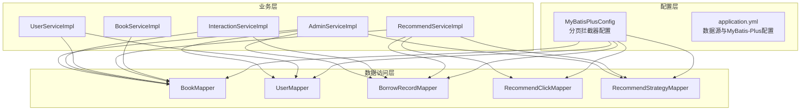
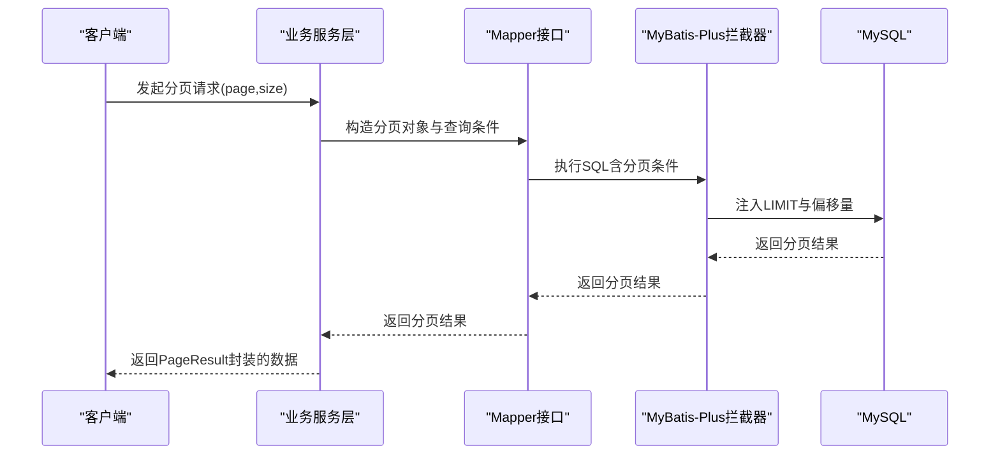
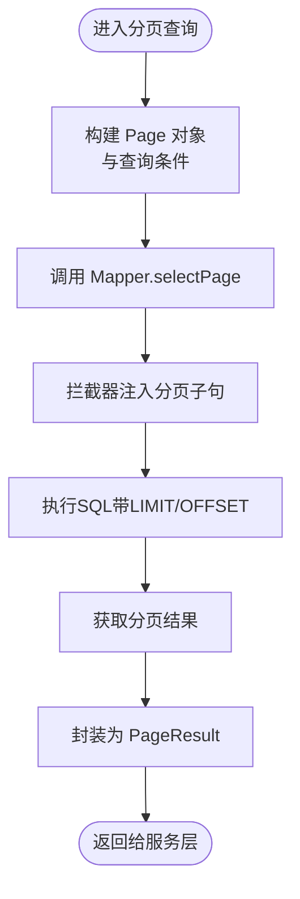
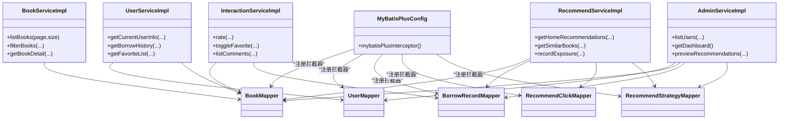

# 数据库优化

<cite>
**本文引用的文件**
- [MyBatisPlusConfig.java](file://src/main/java/org/example/backend/config/MyBatisPlusConfig.java)
- [application.yml](file://src/main/resources/application.yml)
- [BookServiceImpl.java](file://src/main/java/org/example/backend/modules/book/service/impl/BookServiceImpl.java)
- [RecommendServiceImpl.java](file://src/main/java/org/example/backend/modules/recommend/service/impl/RecommendServiceImpl.java)
- [UserServiceImpl.java](file://src/main/java/org/example/backend/modules/user/service/impl/UserServiceImpl.java)
- [InteractionServiceImpl.java](file://src/main/java/org/example/backend/modules/interaction/service/impl/InteractionServiceImpl.java)
- [AdminServiceImpl.java](file://src/main/java/org/example/backend/modules/admin/service/impl/AdminServiceImpl.java)
- [BookMapper.java](file://src/main/java/org/example/backend/modules/book/repository/BookMapper.java)
- [UserMapper.java](file://src/main/java/org/example/backend/modules/user/repository/UserMapper.java)
- [BorrowRecordMapper.java](file://src/main/java/org/example/backend/modules/interaction/repository/BorrowRecordMapper.java)
- [RecommendClickMapper.java](file://src/main/java/org/example/backend/modules/recommend/repository/RecommendClickMapper.java)
- [RecommendStrategyMapper.java](file://src/main/java/org/example/backend/modules/recommend/repository/RecommendStrategyMapper.java)
- [PageResult.java](file://src/main/java/org/example/backend/common/PageResult.java)
</cite>

## 目录
1. [简介](#简介)
2. [项目结构](#项目结构)
3. [核心组件](#核心组件)
4. [架构总览](#架构总览)
5. [详细组件分析](#详细组件分析)
6. [依赖关系分析](#依赖关系分析)
7. [性能考量](#性能考量)
8. [故障排查指南](#故障排查指南)
9. [结论](#结论)
10. [附录](#附录)

## 简介
本指南聚焦于数据库性能优化，结合本项目的实际实现，系统讲解以下内容：
- MyBatis-Plus 分页插件配置与使用，重点解析 PaginationInnerInterceptor 的工作原理与 MySQL 适配
- SQL 查询优化策略：索引设计原则、查询计划分析、慢查询优化
- 数据库连接池配置、事务管理优化与批量操作性能提升
- 具体 SQL 优化案例、执行计划分析与性能监控指标
- 针对图书推荐系统特点的数据库优化建议，覆盖高频查询表的优化策略

## 项目结构
项目采用分层架构与模块化组织，数据库访问通过 MyBatis-Plus 实现，分页由拦截器统一处理，各业务模块通过 Mapper 接口进行数据交互。

图表来源
- [MyBatisPlusConfig.java](file://src/main/java/org/example/backend/config/MyBatisPlusConfig.java#L1-L28)
- [application.yml](file://src/main/resources/application.yml#L1-L71)
- [BookServiceImpl.java](file://src/main/java/org/example/backend/modules/book/service/impl/BookServiceImpl.java#L1-L249)
- [RecommendServiceImpl.java](file://src/main/java/org/example/backend/modules/recommend/service/impl/RecommendServiceImpl.java#L1-L927)
- [UserServiceImpl.java](file://src/main/java/org/example/backend/modules/user/service/impl/UserServiceImpl.java#L1-L476)
- [InteractionServiceImpl.java](file://src/main/java/org/example/backend/modules/interaction/service/impl/InteractionServiceImpl.java#L1-L340)
- [AdminServiceImpl.java](file://src/main/java/org/example/backend/modules/admin/service/impl/AdminServiceImpl.java#L1-L1049)
- [BookMapper.java](file://src/main/java/org/example/backend/modules/book/repository/BookMapper.java#L1-L14)
- [UserMapper.java](file://src/main/java/org/example/backend/modules/user/repository/UserMapper.java#L1-L27)
- [BorrowRecordMapper.java](file://src/main/java/org/example/backend/modules/interaction/repository/BorrowRecordMapper.java#L1-L14)
- [RecommendClickMapper.java](file://src/main/java/org/example/backend/modules/recommend/repository/RecommendClickMapper.java#L1-L14)
- [RecommendStrategyMapper.java](file://src/main/java/org/example/backend/modules/recommend/repository/RecommendStrategyMapper.java#L1-L14)

章节来源
- [MyBatisPlusConfig.java](file://src/main/java/org/example/backend/config/MyBatisPlusConfig.java#L1-L28)
- [application.yml](file://src/main/resources/application.yml#L1-L71)

## 核心组件
- MyBatis-Plus 分页拦截器：在配置类中注册 PaginationInnerInterceptor，适配 MySQL，自动为分页查询注入 LIMIT 子句，避免全表扫描
- 数据源与 MyBatis-Plus 全局配置：在 application.yml 中设置驱动、URL、用户名、密码、驼峰映射、日志输出、全局逻辑删除字段等
- 业务服务层：围绕图书、推荐、用户、互动、管理等模块，大量使用分页查询与多表联结，是性能优化的关键入口
- 结果封装：PageResult 提供分页结果的统一封装，便于前端消费与监控

章节来源
- [MyBatisPlusConfig.java](file://src/main/java/org/example/backend/config/MyBatisPlusConfig.java#L10-L25)
- [application.yml](file://src/main/resources/application.yml#L10-L30)
- [PageResult.java](file://src/main/java/org/example/backend/common/PageResult.java#L1-L59)

## 架构总览
下图展示了数据库访问链路与分页拦截器的协作关系：

图表来源
- [MyBatisPlusConfig.java](file://src/main/java/org/example/backend/config/MyBatisPlusConfig.java#L20-L25)
- [BookServiceImpl.java](file://src/main/java/org/example/backend/modules/book/service/impl/BookServiceImpl.java#L55-L76)
- [application.yml](file://src/main/resources/application.yml#L17-L24)

## 详细组件分析

### MyBatis-Plus 分页插件配置与使用
- 配置要点
  - 在配置类中注册 MybatisPlusInterceptor，并添加 PaginationInnerInterceptor(DbType.MYSQL)
  - Mapper 扫描路径通过 @MapperScan 指定，确保拦截器生效
- 使用方式
  - 服务层构造 Page 对象与 LambdaQueryWrapper 条件，调用 Mapper 的 selectPage 完成分页
  - 分页结果通过 PageResult 统一封装，包含 total、pages、records 等字段
- 工作原理（概念）
  - 拦截器在 SQL 编译阶段识别分页查询，自动追加 LIMIT 与偏移量，避免一次性加载全表
  - 对排序字段与过滤条件进行安全校验，防止越界与非法参数

图表来源
- [MyBatisPlusConfig.java](file://src/main/java/org/example/backend/config/MyBatisPlusConfig.java#L20-L25)
- [BookServiceImpl.java](file://src/main/java/org/example/backend/modules/book/service/impl/BookServiceImpl.java#L55-L76)
- [PageResult.java](file://src/main/java/org/example/backend/common/PageResult.java#L41-L58)

章节来源
- [MyBatisPlusConfig.java](file://src/main/java/org/example/backend/config/MyBatisPlusConfig.java#L10-L25)
- [BookServiceImpl.java](file://src/main/java/org/example/backend/modules/book/service/impl/BookServiceImpl.java#L55-L76)
- [PageResult.java](file://src/main/java/org/example/backend/common/PageResult.java#L1-L59)

### SQL 查询优化策略
- 索引设计原则
  - 为高频过滤字段建立索引：如图书状态、用户状态、借阅记录状态、评论状态等
  - 为排序字段建立复合索引：如按创建时间倒序、借阅次数倒序、评分倒序等
  - 为关联字段建立索引：如 book_id、user_id、book_id+状态等
- 查询计划分析
  - 使用 EXPLAIN 分析 SQL 执行计划，关注是否使用索引、是否存在全表扫描、回表次数
  - 关注排序与过滤顺序，尽量让过滤条件走索引
- 慢查询优化
  - 避免 SELECT *，仅选择必要列
  - 合理使用 LIMIT，配合分页拦截器
  - 将复杂聚合放在应用层或物化视图中，减少数据库压力
  - 对热点数据引入缓存（Redis），降低数据库访问频次

### 数据库连接池配置
- 建议在 application.yml 中增加连接池参数（如 HikariCP），控制最大连接数、空闲连接、超时时间等
- 与 MyBatis-Plus 的配合：确保连接池容量与业务并发相匹配，避免连接争用导致的排队

章节来源
- [application.yml](file://src/main/resources/application.yml#L10-L30)

### 事务管理优化
- 事务粒度：将多个写操作合并到同一事务中，减少提交次数
- 读写分离：对只读查询（如分页列表、推荐列表）考虑从库读取
- 幂等设计：对重复请求进行幂等校验，避免重复写入

章节来源
- [InteractionServiceImpl.java](file://src/main/java/org/example/backend/modules/interaction/service/impl/InteractionServiceImpl.java#L59-L95)
- [UserServiceImpl.java](file://src/main/java/org/example/backend/modules/user/service/impl/UserServiceImpl.java#L101-L126)

### 批量操作性能提升
- 批量插入/更新：使用批处理或批量工具，减少网络往返
- 批量查询：使用 in 查询或临时表，避免 N+1 查询
- 事件异步化：对非关键路径的操作（如浏览记录、行为日志）异步写入，降低主流程阻塞

章节来源
- [RecommendServiceImpl.java](file://src/main/java/org/example/backend/modules/recommend/service/impl/RecommendServiceImpl.java#L658-L680)
- [InteractionServiceImpl.java](file://src/main/java/org/example/backend/modules/interaction/service/impl/InteractionServiceImpl.java#L266-L282)

### 具体 SQL 优化案例与执行计划分析
- 案例一：图书列表分页
  - 优化点：对状态字段建立索引；排序按创建时间倒序，确保索引命中
  - 执行计划关注：是否使用索引扫描；是否发生临时表或文件排序
- 案例二：推荐系统相似图书查询
  - 优化点：对主题表的 book_id 与 topic_name 建立联合索引；使用 in 子句减少多次查询
  - 执行计划关注：是否存在回表；是否使用临时表进行分组
- 案例三：用户偏好与借阅历史关联
  - 优化点：对用户偏好表的 user_id 与 preference_type 建立索引；对借阅记录表的 user_id 建立索引
  - 执行计划关注：连接顺序与连接算法；是否使用索引嵌套循环或哈希连接

章节来源
- [BookServiceImpl.java](file://src/main/java/org/example/backend/modules/book/service/impl/BookServiceImpl.java#L78-L173)
- [RecommendServiceImpl.java](file://src/main/java/org/example/backend/modules/recommend/service/impl/RecommendServiceImpl.java#L216-L314)
- [InteractionServiceImpl.java](file://src/main/java/org/example/backend/modules/interaction/service/impl/InteractionServiceImpl.java#L202-L220)

### 性能监控指标
- QPS/TPS：接口吞吐量与事务数
- 响应时间：P50/P95/P99 延迟
- 数据库指标：连接数、锁等待、慢查询数、缓冲池命中率
- 缓存指标：命中率、淘汰率、过期率
- 推荐系统指标：曝光量、点击量、点击率、收藏转化率、评分转化率

章节来源
- [AdminServiceImpl.java](file://src/main/java/org/example/backend/modules/admin/service/impl/AdminServiceImpl.java#L312-L336)
- [RecommendServiceImpl.java](file://src/main/java/org/example/backend/modules/recommend/service/impl/RecommendServiceImpl.java#L658-L680)

### 针对图书推荐系统特点的数据库优化建议
- 高频查询表优化
  - books：对 status、borrow_count、create_time 建立索引；对 avg_rating 建立索引以支持评分排序
  - book_topics：对 book_id、topic_name 建立联合索引；对 topic_name 建立独立索引
  - borrow_records：对 user_id、book_id、status 建立联合索引；对 borrow_time 建立索引
  - comments：对 book_id、status、create_time 建立联合索引
  - user_preferences：对 user_id、preference_type 建立联合索引
- 分页与排序
  - 优先使用覆盖索引，避免回表
  - 对排序字段建立合适索引，避免文件排序
- 缓存策略
  - 推荐策略配置、热门图书、长尾图书等静态/半静态数据放入缓存
  - 用户偏好与兴趣引导结果短期缓存，结合失效策略
- 异步化与降级
  - 浏览记录、曝光与点击等非关键路径异步写入
  - 降级策略：当数据库压力过大时，返回兜底数据或降级推荐

章节来源
- [Book.java](file://src/main/java/org/example/backend/entity/Book.java#L1-L95)
- [User.java](file://src/main/java/org/example/backend/entity/User.java#L1-L64)
- [RecommendServiceImpl.java](file://src/main/java/org/example/backend/modules/recommend/service/impl/RecommendServiceImpl.java#L133-L188)
- [BookServiceImpl.java](file://src/main/java/org/example/backend/modules/book/service/impl/BookServiceImpl.java#L55-L76)

## 依赖关系分析
- 服务层依赖 Mapper 接口，Mapper 由 MyBatis-Plus 动态代理实现
- 分页拦截器对所有分页查询生效，无需在每个 Mapper 中重复处理
- 事务注解集中在服务层，保证业务原子性

图表来源
- [MyBatisPlusConfig.java](file://src/main/java/org/example/backend/config/MyBatisPlusConfig.java#L14-L25)
- [BookServiceImpl.java](file://src/main/java/org/example/backend/modules/book/service/impl/BookServiceImpl.java#L34-L54)
- [RecommendServiceImpl.java](file://src/main/java/org/example/backend/modules/recommend/service/impl/RecommendServiceImpl.java#L33-L67)
- [UserServiceImpl.java](file://src/main/java/org/example/backend/modules/user/service/impl/UserServiceImpl.java#L34-L68)
- [InteractionServiceImpl.java](file://src/main/java/org/example/backend/modules/interaction/service/impl/InteractionServiceImpl.java#L35-L57)
- [AdminServiceImpl.java](file://src/main/java/org/example/backend/modules/admin/service/impl/AdminServiceImpl.java#L44-L90)

## 性能考量
- 分页查询：确保过滤与排序字段均有索引，避免大偏移量分页带来的性能问题
- 复杂联结：对联结字段建立索引，必要时拆分查询或引入物化视图
- 写入优化：批量写入、异步化、事务合并
- 监控与告警：建立数据库与应用层面的监控体系，及时发现性能瓶颈

## 故障排查指南
- 分页异常
  - 现象：分页查询无结果或结果不正确
  - 排查：确认分页拦截器是否生效；检查查询条件与排序字段是否命中索引
- 慢查询
  - 现象：接口响应时间长
  - 排查：使用 EXPLAIN 分析执行计划；检查索引使用情况；评估是否需要添加索引或改写 SQL
- 事务冲突
  - 现象：并发写入冲突或死锁
  - 排查：减少事务粒度；调整锁顺序；必要时引入重试机制
- 缓存穿透/击穿
  - 现象：缓存未命中导致数据库压力骤增
  - 排查：引入布隆过滤器、热点数据永不过期、互斥锁更新

章节来源
- [application.yml](file://src/main/resources/application.yml#L21-L23)
- [BookServiceImpl.java](file://src/main/java/org/example/backend/modules/book/service/impl/BookServiceImpl.java#L55-L76)
- [InteractionServiceImpl.java](file://src/main/java/org/example/backend/modules/interaction/service/impl/InteractionServiceImpl.java#L266-L282)

## 结论
通过合理配置 MyBatis-Plus 分页拦截器、完善索引设计、优化 SQL 查询与事务管理，并结合缓存与异步化策略，可显著提升图书推荐系统的数据库性能与稳定性。建议持续监控关键指标，定期复盘热点 SQL，动态调整索引与查询策略，确保系统在高并发场景下的稳定运行。

## 附录
- 配置参考
  - 数据源与 MyBatis-Plus 全局配置：见 application.yml
  - 分页拦截器注册：见 MyBatisPlusConfig
- 常用 SQL 优化清单
  - 为过滤与排序字段建立索引
  - 使用 LIMIT 控制返回行数
  - 避免 SELECT *，仅取必要列
  - 对复杂联结使用合适的连接顺序与索引