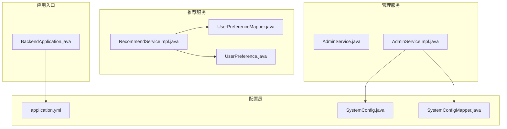
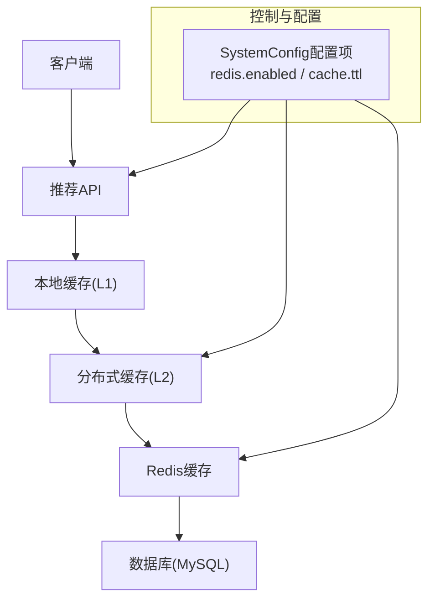
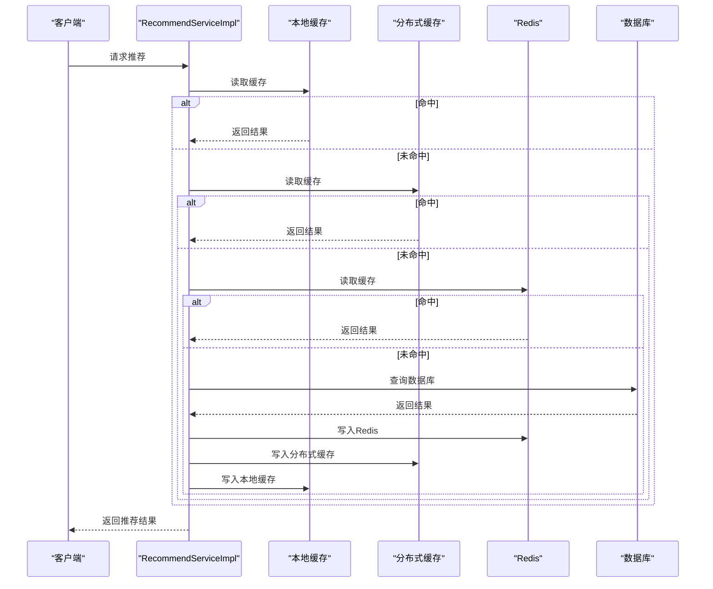
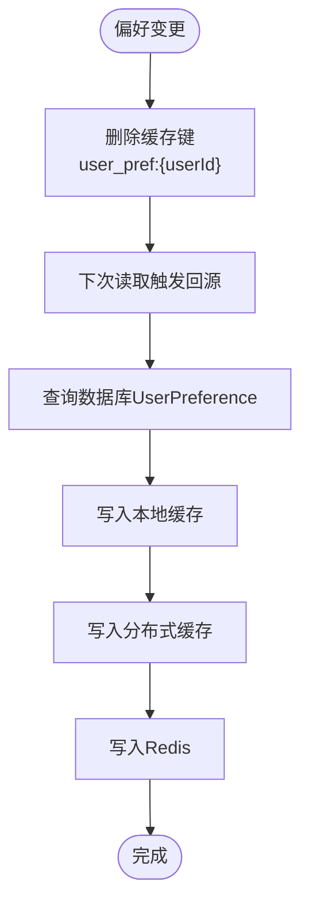
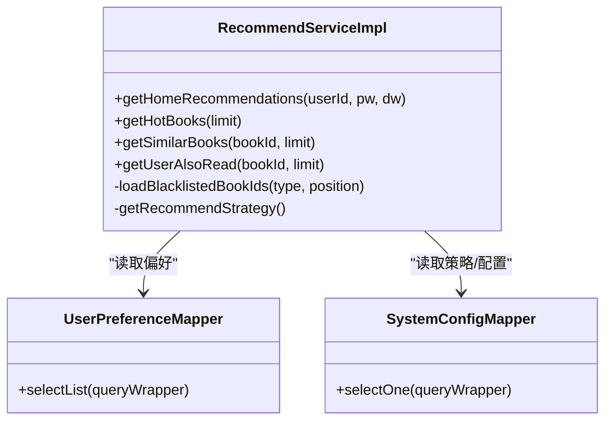
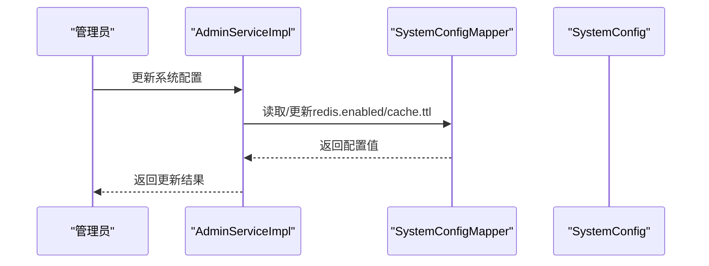
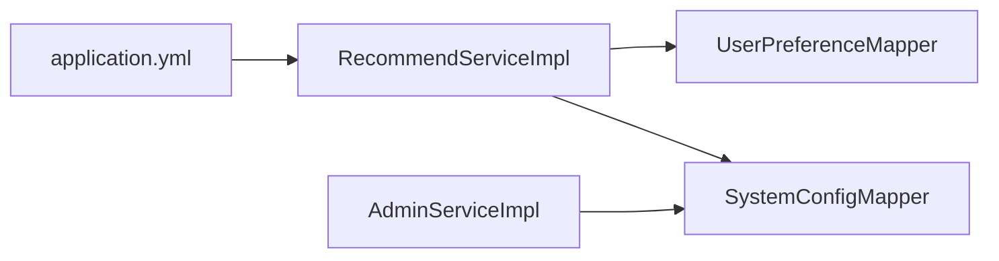

# 缓存策略

<cite>
**本文引用的文件**
- [BackendApplication.java](file://src/main/java/org/example/backend/BackendApplication.java)
- [application.yml](file://src/main/resources/application.yml)
- [Constants.java](file://src/main/java/org/example/backend/common/constants/Constants.java)
- [AdminService.java](file://src/main/java/org/example/backend/modules/admin/service/AdminService.java)
- [AdminServiceImpl.java](file://src/main/java/org/example/backend/modules/admin/service/impl/AdminServiceImpl.java)
- [SystemConfig.java](file://src/main/java/org/example/backend/entity/SystemConfig.java)
- [SystemConfigMapper.java](file://src/main/java/org/example/backend/modules/admin/repository/SystemConfigMapper.java)
- [data_library126_db.sql](file://src/main/resources/data_library126_db.sql)
- [RecommendServiceImpl.java](file://src/main/java/org/example/backend/modules/recommend/service/impl/RecommendServiceImpl.java)
- [UserPreference.java](file://src/main/java/org/example/backend/entity/UserPreference.java)
- [UserPreferenceMapper.java](file://src/main/java/org/example/backend/modules/recommend/repository/UserPreferenceMapper.java)
- [UserServiceImpl.java](file://src/main/java/org/example/backend/modules/user/service/impl/UserServiceImpl.java)
</cite>

## 目录
1. [引言](#引言)
2. [项目结构](#项目结构)
3. [核心组件](#核心组件)
4. [架构总览](#架构总览)
5. [详细组件分析](#详细组件分析)
6. [依赖关系分析](#依赖关系分析)
7. [性能考量](#性能考量)
8. [故障排查指南](#故障排查指南)
9. [结论](#结论)
10. [附录](#附录)

## 引言
本指南面向图书推荐场景，系统化阐述多级缓存架构的设计与实现要点，覆盖本地缓存、分布式缓存与Redis缓存的协同使用；解释缓存失效、穿透防护与雪崩预防策略；给出热点数据处理、缓存更新同步与一致性的保障方法；并提供命中率优化、缓存预热与清理策略。文档以代码库现有能力为基础，结合推荐系统典型业务（用户偏好、推荐结果、热门图书）给出可落地的方案。

## 项目结构
后端采用Spring Boot工程，模块化组织业务域，推荐服务位于recommend模块，系统配置通过system_config表持久化，应用层通过application.yml进行基础配置（含Redis连接参数）。整体结构清晰，便于在不侵入核心逻辑的前提下扩展缓存层。

**图示来源**
- [BackendApplication.java](file://src/main/java/org/example/backend/BackendApplication.java#L1-L14)
- [application.yml](file://src/main/resources/application.yml#L1-L71)
- [SystemConfig.java](file://src/main/java/org/example/backend/entity/SystemConfig.java#L1-L49)
- [SystemConfigMapper.java](file://src/main/java/org/example/backend/modules/admin/repository/SystemConfigMapper.java#L1-L14)
- [RecommendServiceImpl.java](file://src/main/java/org/example/backend/modules/recommend/service/impl/RecommendServiceImpl.java#L1-L927)
- [UserPreference.java](file://src/main/java/org/example/backend/entity/UserPreference.java#L1-L49)
- [UserPreferenceMapper.java](file://src/main/java/org/example/backend/modules/recommend/repository/UserPreferenceMapper.java#L1-L14)
- [AdminService.java](file://src/main/java/org/example/backend/modules/admin/service/AdminService.java#L1-L68)
- [AdminServiceImpl.java](file://src/main/java/org/example/backend/modules/admin/service/impl/AdminServiceImpl.java#L344-L406)

**章节来源**
- [BackendApplication.java](file://src/main/java/org/example/backend/BackendApplication.java#L1-L14)
- [application.yml](file://src/main/resources/application.yml#L1-L71)

## 核心组件
- 应用配置与Redis连接：通过application.yml配置Redis连接参数，为后续引入Redis缓存提供基础。
- 系统配置中心：system_config表与SystemConfig实体/Mapper配合，支持运行时开关与参数（如redis.enabled、cache.ttl）的读取与更新。
- 推荐服务：RecommendServiceImpl负责首页推荐、个性化推荐、多样性与长尾策略、热门图书兜底等，是缓存策略落地的关键执行层。
- 用户偏好：UserPreference实体与UserPreferenceMapper支撑个性化推荐的数据基础。
- 管理服务：AdminServiceImpl通过system_config表读取/写入缓存相关配置，提供动态调整能力。

**章节来源**
- [application.yml](file://src/main/resources/application.yml#L31-L43)
- [SystemConfig.java](file://src/main/java/org/example/backend/entity/SystemConfig.java#L1-L49)
- [SystemConfigMapper.java](file://src/main/java/org/example/backend/modules/admin/repository/SystemConfigMapper.java#L1-L14)
- [RecommendServiceImpl.java](file://src/main/java/org/example/backend/modules/recommend/service/impl/RecommendServiceImpl.java#L94-L188)
- [UserPreference.java](file://src/main/java/org/example/backend/entity/UserPreference.java#L1-L49)
- [UserPreferenceMapper.java](file://src/main/java/org/example/backend/modules/recommend/repository/UserPreferenceMapper.java#L1-L14)
- [AdminServiceImpl.java](file://src/main/java/org/example/backend/modules/admin/service/impl/AdminServiceImpl.java#L344-L406)

## 架构总览
推荐系统缓存架构建议采用“多级缓存”策略：
- 本地缓存（进程内缓存）：用于热点数据的快速访问，降低数据库压力。
- 分布式缓存（本地缓存之上）：用于跨实例共享热点数据，避免重复计算。
- Redis缓存：持久化与高可用，支持跨节点共享与统一失效。

**图示来源**
- [application.yml](file://src/main/resources/application.yml#L31-L43)
- [AdminServiceImpl.java](file://src/main/java/org/example/backend/modules/admin/service/impl/AdminServiceImpl.java#L344-L406)
- [RecommendServiceImpl.java](file://src/main/java/org/example/backend/modules/recommend/service/impl/RecommendServiceImpl.java#L94-L188)

## 详细组件分析

### 推荐服务缓存策略设计
- 缓存粒度与键空间
  - 用户偏好缓存：以用户维度缓存UserPreference列表，键可采用“user_pref:{userId}”，TTL由系统配置决定。
  - 推荐结果缓存：对首页推荐、热门图书、相似图书、也读过等接口结果进行缓存，键采用“rec:{scene}:{params}”，区分场景与参数组合。
  - 热门图书缓存：对热门TopN图书列表缓存，键“hot_books:{limit}”，定期刷新。
- 缓存写入策略
  - 写入时机：用户偏好变更、推荐策略更新、热门榜单更新、长尾阈值变化时触发失效或更新。
  - 写入顺序：先写Redis，再写本地缓存，确保一致性与可用性。
- 缓存读取策略
  - 读取顺序：本地缓存 → 分布式缓存 → Redis → 数据库。
  - 失效策略：基于TTL与事件驱动（策略开关/阈值变更）双重保障。
- 缓存穿透与空值缓存
  - 对空结果设置短TTL的空值占位，避免持续穿透数据库。
- 缓存雪崩与击穿
  - TTL随机化：在基础TTL基础上增加抖动，避免同时过期。
  - 热点键互斥：热点键更新时加分布式锁，仅允许单实例更新，其余返回旧值或等待。
- 热点数据策略
  - 热点识别：基于命中率与QPS统计，对TopK键提升本地缓存容量与淘汰策略。
  - 预热：在低峰期批量加载热点键至本地与Redis。
- 缓存一致性
  - 写后失效：写入数据库后主动失效相关缓存键。
  - 版本号/时间戳：在缓存中携带版本或更新时间，读取时校验是否需要回源。
- 命中率优化
  - 键命名规范与压缩；合理TTL；批量预热；热点键隔离；淘汰策略偏向LRU/LFU。
- 清理策略
  - 定期扫描与清理过期键；内存阈值告警触发清理；灰度释放策略。

**图示来源**
- [RecommendServiceImpl.java](file://src/main/java/org/example/backend/modules/recommend/service/impl/RecommendServiceImpl.java#L94-L188)

**章节来源**
- [RecommendServiceImpl.java](file://src/main/java/org/example/backend/modules/recommend/service/impl/RecommendServiceImpl.java#L94-L188)
- [AdminServiceImpl.java](file://src/main/java/org/example/backend/modules/admin/service/impl/AdminServiceImpl.java#L344-L406)

### 用户偏好缓存
- 缓存键：user_pref:{userId}
- 读取流程：优先本地缓存 → 分布式缓存 → Redis → 数据库；数据库读取后写回各层级。
- 写入流程：用户偏好更新后，删除对应键；下次读取时回源重建。
- TTL：由系统配置cache.ttl决定。
- 一致性：偏好变更通过事务完成后失效缓存，保证读取到最新值。

**图示来源**
- [UserPreferenceMapper.java](file://src/main/java/org/example/backend/modules/recommend/repository/UserPreferenceMapper.java#L1-L14)
- [UserServiceImpl.java](file://src/main/java/org/example/backend/modules/user/service/impl/UserServiceImpl.java#L382-L413)
- [AdminServiceImpl.java](file://src/main/java/org/example/backend/modules/admin/service/impl/AdminServiceImpl.java#L344-L406)

**章节来源**
- [UserPreference.java](file://src/main/java/org/example/backend/entity/UserPreference.java#L1-L49)
- [UserPreferenceMapper.java](file://src/main/java/org/example/backend/modules/recommend/repository/UserPreferenceMapper.java#L1-L14)
- [UserServiceImpl.java](file://src/main/java/org/example/backend/modules/user/service/impl/UserServiceImpl.java#L382-L413)

### 推荐结果缓存
- 首页推荐：键“rec:home:{userId}:{weights}”，根据策略配置与黑名单动态生成。
- 热门图书：键“rec:hot:{limit}”，按借阅次数排序。
- 相似图书/也读过：键“rec:similar:{bookId}:{limit}”、“rec:also-read:{bookId}:{limit}”。
- 缓存更新：当推荐策略、黑名单、长尾阈值、运营配置变化时，失效对应键或全量预热。

**图示来源**
- [RecommendServiceImpl.java](file://src/main/java/org/example/backend/modules/recommend/service/impl/RecommendServiceImpl.java#L94-L188)
- [UserPreferenceMapper.java](file://src/main/java/org/example/backend/modules/recommend/repository/UserPreferenceMapper.java#L1-L14)
- [SystemConfigMapper.java](file://src/main/java/org/example/backend/modules/admin/repository/SystemConfigMapper.java#L1-L14)

**章节来源**
- [RecommendServiceImpl.java](file://src/main/java/org/example/backend/modules/recommend/service/impl/RecommendServiceImpl.java#L94-L188)

### 热门图书缓存
- 缓存键：hot_books:{limit}
- 刷新策略：定时任务或事件驱动（如新增借阅记录、评分更新）触发刷新。
- 读取流程：本地缓存 → 分布式缓存 → Redis → 数据库。

**章节来源**
- [RecommendServiceImpl.java](file://src/main/java/org/example/backend/modules/recommend/service/impl/RecommendServiceImpl.java#L510-L523)

### 缓存配置与动态开关
- redis.enabled：控制是否启用Redis缓存。
- cache.ttl：缓存TTL（秒），用于统一控制缓存有效期。
- model.version：模型版本，可用于缓存键版本化，实现灰度与平滑切换。

**图示来源**
- [AdminServiceImpl.java](file://src/main/java/org/example/backend/modules/admin/service/impl/AdminServiceImpl.java#L344-L406)
- [SystemConfigMapper.java](file://src/main/java/org/example/backend/modules/admin/repository/SystemConfigMapper.java#L1-L14)
- [SystemConfig.java](file://src/main/java/org/example/backend/entity/SystemConfig.java#L1-L49)

**章节来源**
- [AdminServiceImpl.java](file://src/main/java/org/example/backend/modules/admin/service/impl/AdminServiceImpl.java#L344-L406)
- [SystemConfig.java](file://src/main/java/org/example/backend/entity/SystemConfig.java#L1-L49)
- [data_library126_db.sql](file://src/main/resources/data_library126_db.sql#L831-L852)

## 依赖关系分析
- 推荐服务依赖用户偏好与各类Mapper进行数据查询，是缓存策略的主要落点。
- 管理服务通过SystemConfigMapper读取/更新缓存相关配置，形成闭环控制。
- 应用配置文件提供Redis连接参数，为引入Redis缓存奠定基础。

**图示来源**
- [RecommendServiceImpl.java](file://src/main/java/org/example/backend/modules/recommend/service/impl/RecommendServiceImpl.java#L1-L927)
- [UserPreferenceMapper.java](file://src/main/java/org/example/backend/modules/recommend/repository/UserPreferenceMapper.java#L1-L14)
- [SystemConfigMapper.java](file://src/main/java/org/example/backend/modules/admin/repository/SystemConfigMapper.java#L1-L14)
- [AdminServiceImpl.java](file://src/main/java/org/example/backend/modules/admin/service/impl/AdminServiceImpl.java#L344-L406)
- [application.yml](file://src/main/resources/application.yml#L31-L43)

**章节来源**
- [RecommendServiceImpl.java](file://src/main/java/org/example/backend/modules/recommend/service/impl/RecommendServiceImpl.java#L1-L927)
- [AdminServiceImpl.java](file://src/main/java/org/example/backend/modules/admin/service/impl/AdminServiceImpl.java#L344-L406)

## 性能考量
- 读放大控制：通过多级缓存与合理的TTL，减少数据库直连频率。
- 写放大控制：热点键更新采用互斥与延迟合并，避免频繁回源。
- 内存占用：对高频键设置更短TTL与更小容量，对低频键设置更长TTL与更大容量。
- 预热：在低峰期批量加载热点键，降低首屏延迟。
- 监控指标：命中率、平均响应时间、缓存键数量、内存使用率、Redis连接数等。

## 故障排查指南
- Redis不可用
  - 现象：推荐接口降级为仅本地缓存/数据库直连。
  - 处理：检查application.yml中的Redis连接参数；确认redis.enabled开关；查看系统日志。
- 缓存穿透
  - 现象：大量空结果请求导致数据库压力增大。
  - 处理：对空结果设置短TTL占位；检查黑名单与参数合法性。
- 缓存雪崩
  - 现象：大量键同时过期，瞬时数据库压力激增。
  - 处理：启用TTL随机化；热点键互斥更新；逐步扩容Redis实例。
- 缓存不一致
  - 现象：用户看到过时的推荐结果。
  - 处理：完善写后失效策略；引入版本号/时间戳校验；检查事务边界。

**章节来源**
- [application.yml](file://src/main/resources/application.yml#L31-L43)
- [AdminServiceImpl.java](file://src/main/java/org/example/backend/modules/admin/service/impl/AdminServiceImpl.java#L344-L406)
- [RecommendServiceImpl.java](file://src/main/java/org/example/backend/modules/recommend/service/impl/RecommendServiceImpl.java#L94-L188)

## 结论
通过在现有代码基础上引入多级缓存（本地缓存、分布式缓存、Redis），并结合动态配置与事件驱动的失效/更新机制，可显著提升推荐系统的性能与稳定性。建议优先实现用户偏好与热门图书两类高频缓存，随后扩展到推荐结果缓存，并配套完善的监控与治理策略。

## 附录
- 关键配置项
  - redis.enabled：是否启用Redis缓存
  - cache.ttl：缓存TTL（秒）
  - model.version：模型版本
- 建议的缓存键命名规范
  - 用户偏好：user_pref:{userId}
  - 推荐结果：rec:{scene}:{params}
  - 热门图书：hot_books:{limit}

**章节来源**
- [AdminServiceImpl.java](file://src/main/java/org/example/backend/modules/admin/service/impl/AdminServiceImpl.java#L344-L406)
- [data_library126_db.sql](file://src/main/resources/data_library126_db.sql#L831-L852)