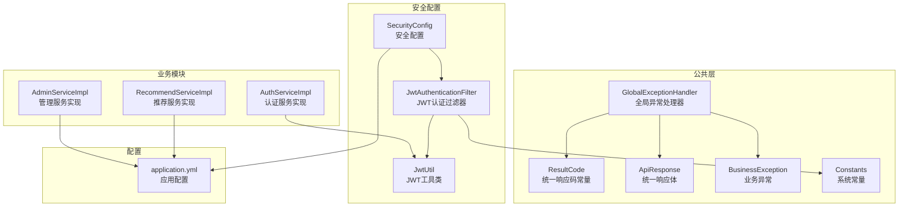
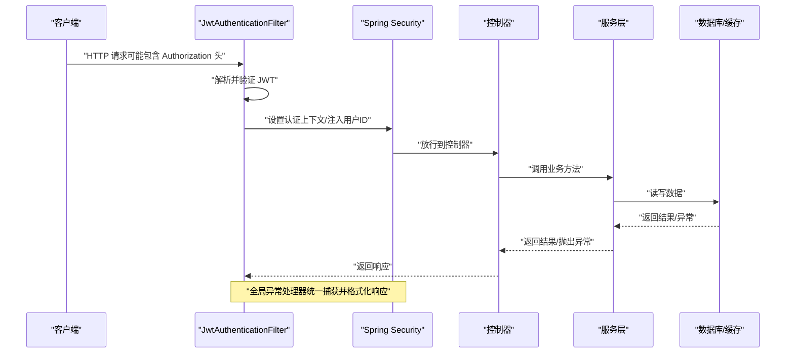
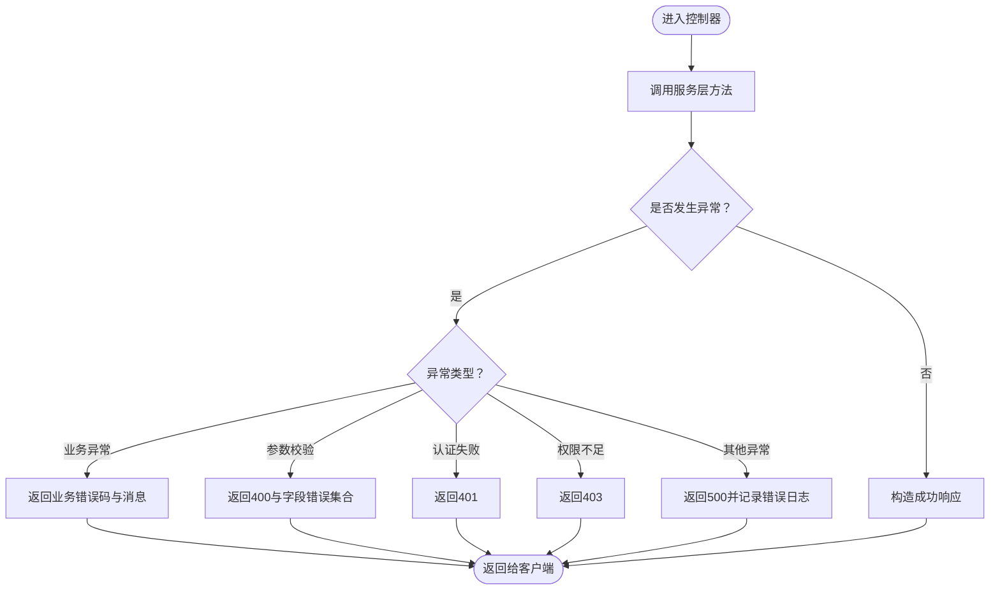
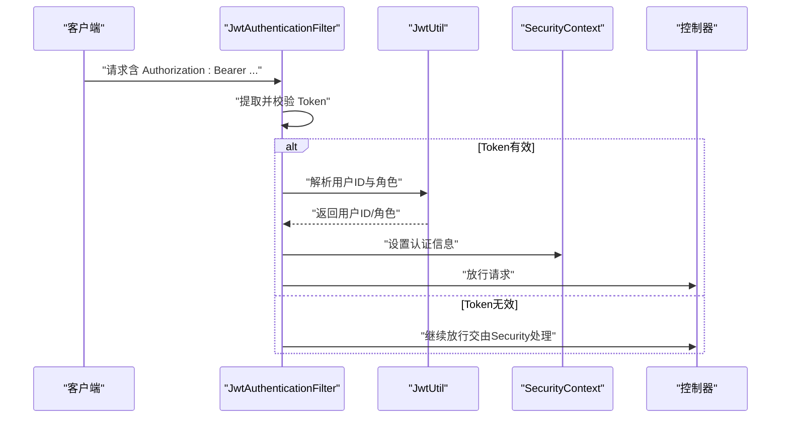
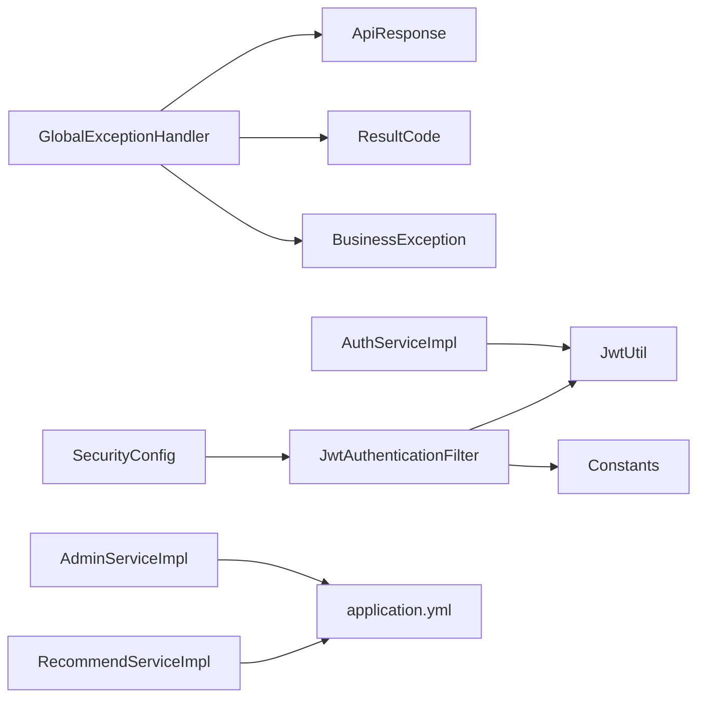

# 常见问题诊断

<cite>
**本文引用的文件**
- [GlobalExceptionHandler.java](file://src/main/java/org/example/backend/common/exception/GlobalExceptionHandler.java)
- [BusinessException.java](file://src/main/java/org/example/backend/common/exception/BusinessException.java)
- [ResultCode.java](file://src/main/java/org/example/backend/common/ResultCode.java)
- [ApiResponse.java](file://src/main/java/org/example/backend/common/ApiResponse.java)
- [Constants.java](file://src/main/java/org/example/backend/common/constants/Constants.java)
- [SecurityConfig.java](file://src/main/java/org/example/backend/config/SecurityConfig.java)
- [JwtUtil.java](file://src/main/java/org/example/backend/config/JwtUtil.java)
- [JwtAuthenticationFilter.java](file://src/main/java/org/example/backend/modules/auth/filter/JwtAuthenticationFilter.java)
- [application.yml](file://src/main/resources/application.yml)
- [AuthServiceImpl.java](file://src/main/java/org/example/backend/modules/auth/service/impl/AuthServiceImpl.java)
- [RecommendServiceImpl.java](file://src/main/java/org/example/backend/modules/recommend/service/impl/RecommendServiceImpl.java)
- [AdminServiceImpl.java](file://src/main/java/org/example/backend/modules/admin/service/impl/AdminServiceImpl.java)
</cite>

## 目录
1. [简介](#简介)
2. [项目结构](#项目结构)
3. [核心组件](#核心组件)
4. [架构总览](#架构总览)
5. [详细组件分析](#详细组件分析)
6. [依赖关系分析](#依赖关系分析)
7. [性能考虑](#性能考虑)
8. [故障排查指南](#故障排查指南)
9. [结论](#结论)
10. [附录](#附录)

## 简介
本指南面向技术支持人员，聚焦智能图书推荐系统在运行过程中常见的问题类型与定位方法，覆盖业务异常、参数校验异常、认证失败与权限不足等场景。文档解释异常处理机制的工作原理，结合统一响应体与全局异常处理器，帮助通过日志快速定位问题根因，并给出具体错误码含义与对应解决方案，涵盖数据库连接异常、API 接口调用失败、推荐算法异常等典型场景的排查步骤。

## 项目结构
系统采用分层架构与模块化设计，关键异常处理与安全配置集中在公共模块与配置模块中，业务逻辑分布在各功能模块的服务层与控制器层。

图表来源
- [GlobalExceptionHandler.java](file://src/main/java/org/example/backend/common/exception/GlobalExceptionHandler.java#L1-L111)
- [BusinessException.java](file://src/main/java/org/example/backend/common/exception/BusinessException.java#L1-L25)
- [ResultCode.java](file://src/main/java/org/example/backend/common/ResultCode.java#L1-L44)
- [ApiResponse.java](file://src/main/java/org/example/backend/common/ApiResponse.java#L1-L89)
- [Constants.java](file://src/main/java/org/example/backend/common/constants/Constants.java#L1-L79)
- [SecurityConfig.java](file://src/main/java/org/example/backend/config/SecurityConfig.java#L1-L101)
- [JwtUtil.java](file://src/main/java/org/example/backend/config/JwtUtil.java#L1-L92)
- [JwtAuthenticationFilter.java](file://src/main/java/org/example/backend/modules/auth/filter/JwtAuthenticationFilter.java#L1-L70)
- [application.yml](file://src/main/resources/application.yml#L1-L71)
- [AuthServiceImpl.java](file://src/main/java/org/example/backend/modules/auth/service/impl/AuthServiceImpl.java#L1-L122)
- [RecommendServiceImpl.java](file://src/main/java/org/example/backend/modules/recommend/service/impl/RecommendServiceImpl.java#L1-L200)
- [AdminServiceImpl.java](file://src/main/java/org/example/backend/modules/admin/service/impl/AdminServiceImpl.java#L210-L222)

章节来源
- [GlobalExceptionHandler.java](file://src/main/java/org/example/backend/common/exception/GlobalExceptionHandler.java#L1-L111)
- [SecurityConfig.java](file://src/main/java/org/example/backend/config/SecurityConfig.java#L1-L101)
- [application.yml](file://src/main/resources/application.yml#L1-L71)

## 核心组件
- 统一响应体与响应码：统一输出 code、msg、data 字段，便于前端与监控系统解析。
- 全局异常处理器：集中捕获业务异常、参数校验异常、认证失败、权限不足与通用异常，标准化返回格式与日志记录。
- 安全配置与认证过滤器：基于 JWT 的无状态认证，拦截请求提取令牌并设置认证上下文。
- 业务异常：业务层面的错误以 BusinessException 抛出，携带自定义 code 与 message。

章节来源
- [ApiResponse.java](file://src/main/java/org/example/backend/common/ApiResponse.java#L1-L89)
- [ResultCode.java](file://src/main/java/org/example/backend/common/ResultCode.java#L1-L44)
- [GlobalExceptionHandler.java](file://src/main/java/org/example/backend/common/exception/GlobalExceptionHandler.java#L1-L111)
- [BusinessException.java](file://src/main/java/org/example/backend/common/exception/BusinessException.java#L1-L25)
- [SecurityConfig.java](file://src/main/java/org/example/backend/config/SecurityConfig.java#L1-L101)
- [JwtAuthenticationFilter.java](file://src/main/java/org/example/backend/modules/auth/filter/JwtAuthenticationFilter.java#L1-L70)

## 架构总览
系统通过安全过滤器链对请求进行认证与授权，随后进入控制器与服务层；异常统一由全局处理器接管，确保一致的错误反馈与日志记录。

图表来源
- [JwtAuthenticationFilter.java](file://src/main/java/org/example/backend/modules/auth/filter/JwtAuthenticationFilter.java#L1-L70)
- [SecurityConfig.java](file://src/main/java/org/example/backend/config/SecurityConfig.java#L1-L101)
- [GlobalExceptionHandler.java](file://src/main/java/org/example/backend/common/exception/GlobalExceptionHandler.java#L1-L111)

## 详细组件分析

### 异常处理机制与统一响应
- 统一响应体包含 code、msg、data 三要素，便于前后端约定与监控系统采集。
- 全局异常处理器针对不同异常类型进行分类处理：
  - 业务异常：返回业务自定义 code 与 message。
  - 参数校验异常：聚合字段级错误信息，返回 400。
  - 认证失败：返回 401。
  - 权限不足：返回 403。
  - 其他异常：返回 500 并记录错误日志。
- 日志记录：warn/info/error 级别区分问题严重程度，便于快速定位。

图表来源
- [GlobalExceptionHandler.java](file://src/main/java/org/example/backend/common/exception/GlobalExceptionHandler.java#L1-L111)
- [ApiResponse.java](file://src/main/java/org/example/backend/common/ApiResponse.java#L1-L89)
- [ResultCode.java](file://src/main/java/org/example/backend/common/ResultCode.java#L1-L44)

章节来源
- [GlobalExceptionHandler.java](file://src/main/java/org/example/backend/common/exception/GlobalExceptionHandler.java#L1-L111)
- [ApiResponse.java](file://src/main/java/org/example/backend/common/ApiResponse.java#L1-L89)
- [ResultCode.java](file://src/main/java/org/example/backend/common/ResultCode.java#L1-L44)

### 认证与权限控制
- 安全配置：
  - 放行公开接口（如认证、Swagger、部分只读接口）。
  - 管理员接口需 ADMIN 角色。
  - 其他接口需认证。
  - 无状态会话策略，CORS 允许跨域。
- JWT 过滤器：
  - 从请求头提取 Bearer Token。
  - 校验有效性并解析用户ID与角色。
  - 设置认证上下文，同时将用户ID写入请求属性，供后续使用。
- JWT 工具类：
  - 生成与解析 Token，校验过期时间，提供密钥管理。

图表来源
- [JwtAuthenticationFilter.java](file://src/main/java/org/example/backend/modules/auth/filter/JwtAuthenticationFilter.java#L1-L70)
- [JwtUtil.java](file://src/main/java/org/example/backend/config/JwtUtil.java#L1-L92)
- [SecurityConfig.java](file://src/main/java/org/example/backend/config/SecurityConfig.java#L1-L101)

章节来源
- [SecurityConfig.java](file://src/main/java/org/example/backend/config/SecurityConfig.java#L1-L101)
- [JwtAuthenticationFilter.java](file://src/main/java/org/example/backend/modules/auth/filter/JwtAuthenticationFilter.java#L1-L70)
- [JwtUtil.java](file://src/main/java/org/example/backend/config/JwtUtil.java#L1-L92)
- [Constants.java](file://src/main/java/org/example/backend/common/constants/Constants.java#L1-L79)

### 业务异常与参数校验
- 业务异常 BusinessException：用于承载业务规则违反的错误，支持自定义 code 与 message。
- 参数校验异常：
  - 方法参数校验（@RequestBody）：聚合字段错误信息返回。
  - 模型绑定校验（@ModelAttribute）：同上。
  - 请求参数校验（@RequestParam）：聚合约束错误信息返回。
- 认证失败与权限不足：
  - BadCredentialsException：用户名或密码错误，返回 401。
  - AccessDeniedException：权限不足，返回 403。

章节来源
- [BusinessException.java](file://src/main/java/org/example/backend/common/exception/BusinessException.java#L1-L25)
- [GlobalExceptionHandler.java](file://src/main/java/org/example/backend/common/exception/GlobalExceptionHandler.java#L1-L111)

### 推荐服务与潜在异常场景
- 推荐服务实现包含多策略组合（冷启动、个性化、多样性、长尾、热门兜底），若任一环节出现数据缺失或配置异常，可能导致推荐结果为空或异常。
- 常见异常场景：
  - 缺少推荐策略配置或黑名单配置不完整。
  - 数据库查询返回空集导致推荐不足。
  - 用户行为数据缺失影响个性化权重计算。
- 建议：通过日志观察推荐流程中的关键步骤与数据来源，定位具体环节。

章节来源
- [RecommendServiceImpl.java](file://src/main/java/org/example/backend/modules/recommend/service/impl/RecommendServiceImpl.java#L1-L200)

## 依赖关系分析
- 全局异常处理器依赖统一响应体与响应码常量，确保错误返回的一致性。
- 安全配置依赖 JWT 认证过滤器与 JWT 工具类，形成完整的认证链路。
- 业务服务（如认证、推荐、管理）依赖配置文件中的数据源、Redis、日志级别等，异常时需检查配置项。

图表来源
- [GlobalExceptionHandler.java](file://src/main/java/org/example/backend/common/exception/GlobalExceptionHandler.java#L1-L111)
- [ApiResponse.java](file://src/main/java/org/example/backend/common/ApiResponse.java#L1-L89)
- [ResultCode.java](file://src/main/java/org/example/backend/common/ResultCode.java#L1-L44)
- [BusinessException.java](file://src/main/java/org/example/backend/common/exception/BusinessException.java#L1-L25)
- [SecurityConfig.java](file://src/main/java/org/example/backend/config/SecurityConfig.java#L1-L101)
- [JwtAuthenticationFilter.java](file://src/main/java/org/example/backend/modules/auth/filter/JwtAuthenticationFilter.java#L1-L70)
- [JwtUtil.java](file://src/main/java/org/example/backend/config/JwtUtil.java#L1-L92)
- [application.yml](file://src/main/resources/application.yml#L1-L71)
- [AuthServiceImpl.java](file://src/main/java/org/example/backend/modules/auth/service/impl/AuthServiceImpl.java#L1-L122)
- [RecommendServiceImpl.java](file://src/main/java/org/example/backend/modules/recommend/service/impl/RecommendServiceImpl.java#L1-L200)
- [AdminServiceImpl.java](file://src/main/java/org/example/backend/modules/admin/service/impl/AdminServiceImpl.java#L210-L222)

## 性能考虑
- 无状态认证避免会话存储开销，但需关注 JWT 解析与校验成本。
- 推荐算法涉及多表关联与排序，建议在热点查询上增加索引与缓存。
- 日志级别在生产环境建议调整为 INFO，避免过多 DEBUG 输出影响性能。

## 故障排查指南

### 一、业务异常（code=600）
- 现象：接口返回业务错误码与提示信息，通常由服务层主动抛出 BusinessException。
- 排查步骤：
  - 查看响应体中的 code 与 msg。
  - 在日志中搜索“业务异常”关键字，定位抛出位置。
  - 常见触发点：用户注册/登录重复、状态检查、权限判断等。
- 示例触发位置参考：
  - 用户名或邮箱重复、账号被禁用、密码错误等。
- 解决方案：
  - 修正输入参数或业务条件，确保满足前置校验。
  - 对于重复性错误，先查询再操作或使用幂等设计。

章节来源
- [BusinessException.java](file://src/main/java/org/example/backend/common/exception/BusinessException.java#L1-L25)
- [GlobalExceptionHandler.java](file://src/main/java/org/example/backend/common/exception/GlobalExceptionHandler.java#L30-L38)
- [AuthServiceImpl.java](file://src/main/java/org/example/backend/modules/auth/service/impl/AuthServiceImpl.java#L44-L78)
- [AuthServiceImpl.java](file://src/main/java/org/example/backend/modules/auth/service/impl/AuthServiceImpl.java#L80-L119)
- [AdminServiceImpl.java](file://src/main/java/org/example/backend/modules/admin/service/impl/AdminServiceImpl.java#L210-L222)

### 二、参数校验异常（code=400）
- 现象：接口返回 400，message 包含字段级或约束级错误集合。
- 排查步骤：
  - 检查请求体、路径变量、查询参数是否符合约束。
  - 关注处理器对三种校验场景的处理分支。
- 解决方案：
  - 修正必填字段、格式、范围等约束条件。
  - 对批量参数校验，逐条核对错误项。

章节来源
- [GlobalExceptionHandler.java](file://src/main/java/org/example/backend/common/exception/GlobalExceptionHandler.java#L40-L78)

### 三、认证失败（code=401）
- 现象：返回 401，提示用户名或密码错误。
- 排查步骤：
  - 确认请求头 Authorization 是否正确携带 Bearer Token。
  - 检查 JWT 密钥与过期时间配置。
  - 核对用户状态是否启用。
- 解决方案：
  - 重新登录获取有效 Token。
  - 检查 JWT 配置与服务端密钥一致性。

章节来源
- [GlobalExceptionHandler.java](file://src/main/java/org/example/backend/common/exception/GlobalExceptionHandler.java#L80-L98)
- [JwtAuthenticationFilter.java](file://src/main/java/org/example/backend/modules/auth/filter/JwtAuthenticationFilter.java#L28-L56)
- [JwtUtil.java](file://src/main/java/org/example/backend/config/JwtUtil.java#L74-L81)
- [application.yml](file://src/main/resources/application.yml#L44-L48)
- [AuthServiceImpl.java](file://src/main/java/org/example/backend/modules/auth/service/impl/AuthServiceImpl.java#L80-L119)

### 四、权限不足（code=403）
- 现象：返回 403，提示权限不足。
- 排查步骤：
  - 确认当前用户角色是否具备 ADMIN 权限。
  - 检查安全配置中对管理员接口的角色要求。
- 解决方案：
  - 为当前用户分配 ADMIN 角色或改用具备权限的账户。

章节来源
- [GlobalExceptionHandler.java](file://src/main/java/org/example/backend/common/exception/GlobalExceptionHandler.java#L90-L98)
- [SecurityConfig.java](file://src/main/java/org/example/backend/config/SecurityConfig.java#L73-L76)

### 五、数据库连接异常
- 现象：服务启动或运行时报数据库连接失败、SQL 执行异常。
- 排查步骤：
  - 检查数据源 URL、用户名、密码是否正确。
  - 确认数据库服务可用与网络连通。
  - 查看 MyBatis Plus 日志输出与 SQL 执行情况。
- 解决方案：
  - 修正 application.yml 中的数据源配置。
  - 确保数据库实例在线并开放相应端口。

章节来源
- [application.yml](file://src/main/resources/application.yml#L10-L30)
- [application.yml](file://src/main/resources/application.yml#L17-L30)

### 六、API 接口调用失败
- 现象：接口返回 500 或业务错误，响应体 code=500。
- 排查步骤：
  - 查看全局异常处理器对通用异常的处理分支。
  - 检查控制器到服务层的调用链路与依赖注入。
  - 关注服务层事务与数据一致性。
- 解决方案：
  - 修复未捕获异常，完善边界条件处理。
  - 对外部依赖（如 Redis、第三方接口）增加降级与超时控制。

章节来源
- [GlobalExceptionHandler.java](file://src/main/java/org/example/backend/common/exception/GlobalExceptionHandler.java#L100-L108)

### 七、推荐算法异常
- 现象：推荐结果为空或异常，或推荐流程中断。
- 排查步骤：
  - 检查推荐策略配置、黑名单配置与冷启动配置。
  - 关注数据查询（借阅记录、偏好、主题）是否返回空集。
  - 观察日志中推荐流程的关键节点与耗时。
- 解决方案：
  - 完善策略配置与兜底逻辑（热门图书补足）。
  - 优化查询条件与索引，提升推荐性能与稳定性。

章节来源
- [RecommendServiceImpl.java](file://src/main/java/org/example/backend/modules/recommend/service/impl/RecommendServiceImpl.java#L70-L188)

### 八、日志定位与根因分析
- 日志级别：
  - 生产环境建议 INFO，开发调试可临时提升至 DEBUG。
  - 关注统一异常处理器的日志输出，快速识别异常类型。
- 关键日志关键词：
  - “业务异常”、“参数校验失败”、“认证失败”、“权限不足”、“系统异常”。

章节来源
- [application.yml](file://src/main/resources/application.yml#L63-L71)
- [GlobalExceptionHandler.java](file://src/main/java/org/example/backend/common/exception/GlobalExceptionHandler.java#L30-L108)

## 结论
通过统一异常处理与安全配置，系统实现了对常见问题的标准化响应与快速定位。技术支持人员可依据错误码与日志信息，结合本文提供的排查步骤，高效定位并解决业务异常、认证与权限问题、数据库与接口异常以及推荐算法相关问题。建议在生产环境中持续完善日志策略与监控告警，进一步缩短故障恢复时间。

## 附录

### 错误码对照表
- 200：成功
- 400：参数错误
- 401：未授权
- 403：禁止访问
- 404：资源不存在
- 500：服务器错误
- 600：业务错误

章节来源
- [ResultCode.java](file://src/main/java/org/example/backend/common/ResultCode.java#L1-L44)
- [ApiResponse.java](file://src/main/java/org/example/backend/common/ApiResponse.java#L60-L86)
- [GlobalExceptionHandler.java](file://src/main/java/org/example/backend/common/exception/GlobalExceptionHandler.java#L30-L108)