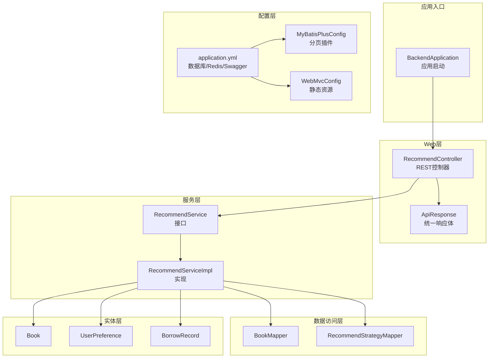
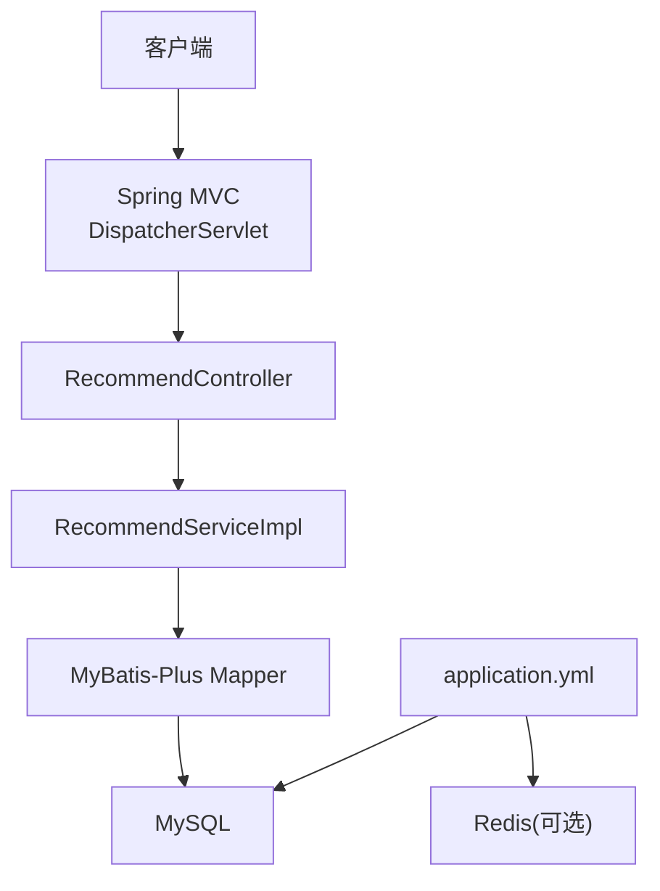
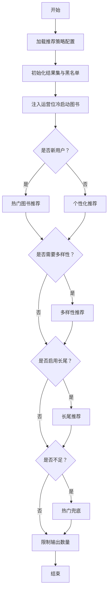
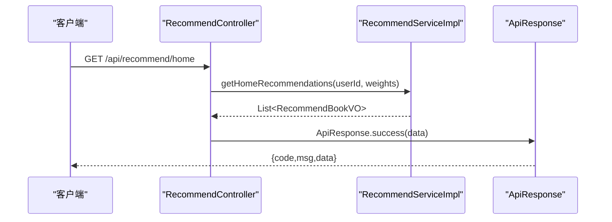
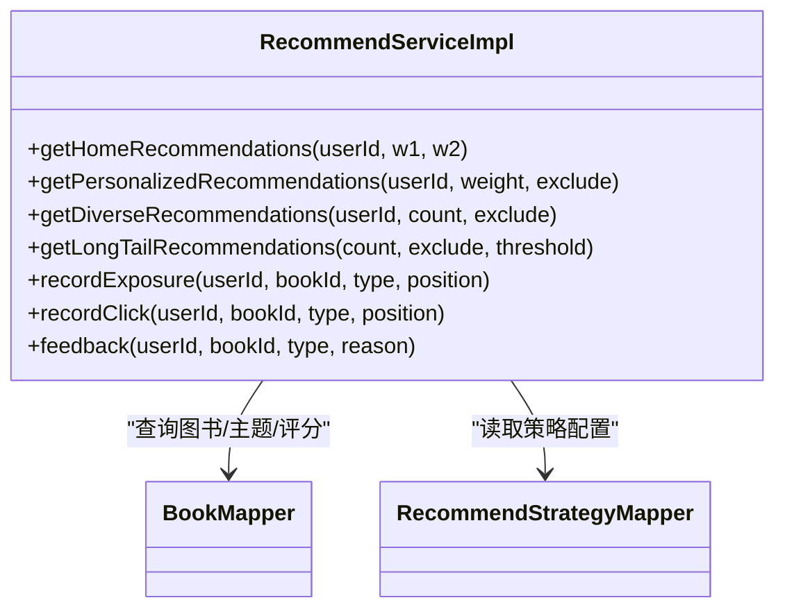
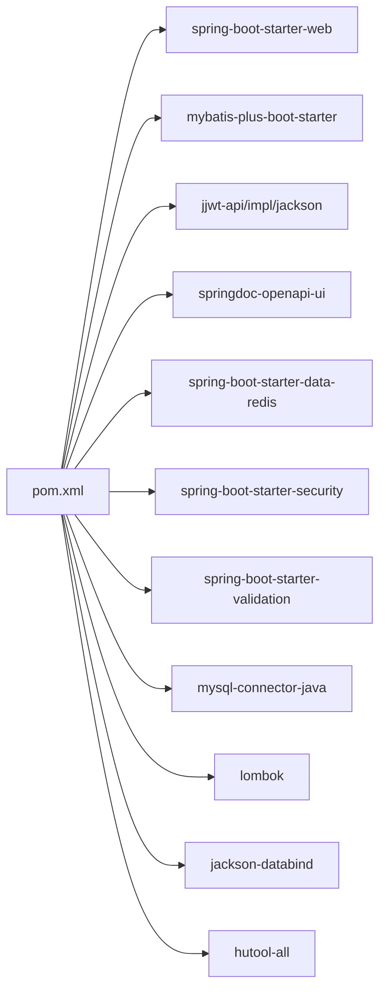

# 性能问题诊断

<cite>
**本文引用的文件**
- [BackendApplication.java](file://src/main/java/org/example/backend/BackendApplication.java)
- [application.yml](file://src/main/resources/application.yml)
- [MyBatisPlusConfig.java](file://src/main/java/org/example/backend/config/MyBatisPlusConfig.java)
- [WebMvcConfig.java](file://src/main/java/org/example/backend/config/WebMvcConfig.java)
- [RecommendServiceImpl.java](file://src/main/java/org/example/backend/modules/recommend/service/impl/RecommendServiceImpl.java)
- [RecommendController.java](file://src/main/java/org/example/backend/modules/recommend/controller/RecommendController.java)
- [ApiResponse.java](file://src/main/java/org/example/backend/common/ApiResponse.java)
- [BookMapper.java](file://src/main/java/org/example/backend/modules/book/repository/BookMapper.java)
- [RecommendStrategyMapper.java](file://src/main/java/org/example/backend/modules/recommend/repository/RecommendStrategyMapper.java)
- [pom.xml](file://pom.xml)
- [Book.java](file://src/main/java/org/example/backend/entity/Book.java)
- [UserPreference.java](file://src/main/java/org/example/backend/entity/UserPreference.java)
- [BorrowRecord.java](file://src/main/java/org/example/backend/entity/BorrowRecord.java)
</cite>

## 目录
1. [简介](#简介)
2. [项目结构](#项目结构)
3. [核心组件](#核心组件)
4. [架构总览](#架构总览)
5. [详细组件分析](#详细组件分析)
6. [依赖关系分析](#依赖关系分析)
7. [性能考虑](#性能考虑)
8. [故障排查指南](#故障排查指南)
9. [结论](#结论)
10. [附录](#附录)

## 简介
本指南面向性能工程师，围绕智能图书推荐系统的关键路径进行性能问题诊断与优化。重点覆盖以下方面：
- CPU使用率异常识别与定位
- 内存泄漏检测与常见风险点
- 网络延迟分析与接口性能监控
- 推荐算法性能诊断：复杂度分析、缓存命中率、计算资源分配
- API接口性能监控：响应时间、吞吐量、并发能力
- 数据库查询优化：慢查询日志、索引使用、执行计划
- 提供完整工具链与优化策略建议

## 项目结构
系统采用Spring Boot + MyBatis-Plus的标准分层架构，核心模块包括：
- 控制器层：对外提供REST API
- 业务服务层：封装推荐算法与业务逻辑
- 数据访问层：基于MyBatis-Plus的Mapper接口
- 配置层：数据库、Redis、Web、Swagger等配置
- 实体层：领域模型定义

**图表来源**
- [BackendApplication.java](file://src/main/java/org/example/backend/BackendApplication.java#L1-L14)
- [RecommendController.java](file://src/main/java/org/example/backend/modules/recommend/controller/RecommendController.java#L1-L130)
- [RecommendServiceImpl.java](file://src/main/java/org/example/backend/modules/recommend/service/impl/RecommendServiceImpl.java#L1-L927)
- [BookMapper.java](file://src/main/java/org/example/backend/modules/book/repository/BookMapper.java#L1-L14)
- [RecommendStrategyMapper.java](file://src/main/java/org/example/backend/modules/recommend/repository/RecommendStrategyMapper.java#L1-L14)
- [application.yml](file://src/main/resources/application.yml#L1-L71)
- [MyBatisPlusConfig.java](file://src/main/java/org/example/backend/config/MyBatisPlusConfig.java#L1-L28)
- [WebMvcConfig.java](file://src/main/java/org/example/backend/config/WebMvcConfig.java#L1-L29)
- [Book.java](file://src/main/java/org/example/backend/entity/Book.java#L1-L95)
- [UserPreference.java](file://src/main/java/org/example/backend/entity/UserPreference.java#L1-L49)
- [BorrowRecord.java](file://src/main/java/org/example/backend/entity/BorrowRecord.java#L1-L84)

**章节来源**
- [BackendApplication.java](file://src/main/java/org/example/backend/BackendApplication.java#L1-L14)
- [application.yml](file://src/main/resources/application.yml#L1-L71)
- [MyBatisPlusConfig.java](file://src/main/java/org/example/backend/config/MyBatisPlusConfig.java#L1-L28)
- [WebMvcConfig.java](file://src/main/java/org/example/backend/config/WebMvcConfig.java#L1-L29)

## 核心组件
- 推荐控制器：提供首页推荐、热门榜、新书、主题、相似图书、关联阅读、曝光/点击/反馈等接口，统一返回格式。
- 推荐服务实现：包含多策略组合的推荐算法，涉及用户偏好、借阅历史、主题多样性、长尾挖掘、黑名单过滤、冷启动运营位等。
- 数据访问层：基于MyBatis-Plus的Mapper接口，配合分页插件与SQL映射。
- 配置层：数据库连接、MyBatis-Plus、Redis、Swagger、静态资源等。

**章节来源**
- [RecommendController.java](file://src/main/java/org/example/backend/modules/recommend/controller/RecommendController.java#L1-L130)
- [RecommendServiceImpl.java](file://src/main/java/org/example/backend/modules/recommend/service/impl/RecommendServiceImpl.java#L1-L927)
- [BookMapper.java](file://src/main/java/org/example/backend/modules/book/repository/BookMapper.java#L1-L14)
- [RecommendStrategyMapper.java](file://src/main/java/org/example/backend/modules/recommend/repository/RecommendStrategyMapper.java#L1-L14)
- [application.yml](file://src/main/resources/application.yml#L1-L71)

## 架构总览
系统采用经典的三层架构，结合Spring MVC与MyBatis-Plus，推荐算法在服务层集中实现，支持多策略组合与可配置权重。

**图表来源**
- [RecommendController.java](file://src/main/java/org/example/backend/modules/recommend/controller/RecommendController.java#L1-L130)
- [RecommendServiceImpl.java](file://src/main/java/org/example/backend/modules/recommend/service/impl/RecommendServiceImpl.java#L1-L927)
- [application.yml](file://src/main/resources/application.yml#L1-L71)

## 详细组件分析

### 推荐服务实现（RecommendServiceImpl）
- 主流程：首页推荐按“运营位→冷启动/个性化→多样性→长尾→兜底热门”的顺序拼装，最终限制为固定条目。
- 关键子流程：
  - 冷启动判断：依据兴趣引导完成状态与借阅次数。
  - 个性化推荐：基于用户偏好主题与近期借阅历史，统计相似度并去重。
  - 多样性推荐：过滤用户已借阅主题，按主题维度补充图书。
  - 长尾推荐：低借阅次数、高评分图书筛选。
  - 黑名单过滤：支持全局与场景化位置过滤。
  - 曝光/点击/反馈埋点：记录推荐行为，支撑后续效果评估。
- 数据来源：Book、UserPreference、BorrowRecord、BookTopic、Topic、RecommendStrategy、RecommendBlacklist等。

**图表来源**
- [RecommendServiceImpl.java](file://src/main/java/org/example/backend/modules/recommend/service/impl/RecommendServiceImpl.java#L70-L188)

**章节来源**
- [RecommendServiceImpl.java](file://src/main/java/org/example/backend/modules/recommend/service/impl/RecommendServiceImpl.java#L1-L927)
- [Book.java](file://src/main/java/org/example/backend/entity/Book.java#L1-L95)
- [UserPreference.java](file://src/main/java/org/example/backend/entity/UserPreference.java#L1-L49)
- [BorrowRecord.java](file://src/main/java/org/example/backend/entity/BorrowRecord.java#L1-L84)

### 推荐控制器（RecommendController）
- 提供首页推荐、新书、热门、主题、相似图书、关联阅读、曝光/点击/反馈、热门主题、长尾推荐等接口。
- 统一响应体ApiResponse，便于前端与监控系统解析。

**图表来源**
- [RecommendController.java](file://src/main/java/org/example/backend/modules/recommend/controller/RecommendController.java#L27-L39)
- [RecommendServiceImpl.java](file://src/main/java/org/example/backend/modules/recommend/service/impl/RecommendServiceImpl.java#L94-L188)
- [ApiResponse.java](file://src/main/java/org/example/backend/common/ApiResponse.java#L1-L89)

**章节来源**
- [RecommendController.java](file://src/main/java/org/example/backend/modules/recommend/controller/RecommendController.java#L1-L130)
- [ApiResponse.java](file://src/main/java/org/example/backend/common/ApiResponse.java#L1-L89)

### 数据访问层与配置
- BookMapper、RecommendStrategyMapper等Mapper接口由MyBatis-Plus自动生成实现。
- MyBatisPlusConfig启用分页插件，避免全表扫描。
- application.yml配置数据库、Redis、Swagger、文件上传路径等。

**图表来源**
- [RecommendServiceImpl.java](file://src/main/java/org/example/backend/modules/recommend/service/impl/RecommendServiceImpl.java#L1-L927)
- [BookMapper.java](file://src/main/java/org/example/backend/modules/book/repository/BookMapper.java#L1-L14)
- [RecommendStrategyMapper.java](file://src/main/java/org/example/backend/modules/recommend/repository/RecommendStrategyMapper.java#L1-L14)

**章节来源**
- [BookMapper.java](file://src/main/java/org/example/backend/modules/book/repository/BookMapper.java#L1-L14)
- [RecommendStrategyMapper.java](file://src/main/java/org/example/backend/modules/recommend/repository/RecommendStrategyMapper.java#L1-L14)
- [MyBatisPlusConfig.java](file://src/main/java/org/example/backend/config/MyBatisPlusConfig.java#L1-L28)
- [application.yml](file://src/main/resources/application.yml#L1-L71)

## 依赖关系分析
- Maven依赖：Spring Boot Web、Validation、Security、MySQL驱动、MyBatis-Plus、JWT、Swagger、Redis Starter、Lombok、Jackson、Hutool等。
- 版本管理集中在dependencyManagement中，确保一致性。

**图表来源**
- [pom.xml](file://pom.xml#L1-L161)

**章节来源**
- [pom.xml](file://pom.xml#L1-L161)

## 性能考虑

### CPU使用率异常识别与分析
- 推荐主流程存在多次集合操作与排序，需关注：
  - 基于用户偏好的主题匹配与计分
  - 借阅历史到主题的映射与聚合
  - 多策略权重下的分段推荐与去重
- 建议：
  - 对频繁使用的集合建立缓存（如用户偏好、主题映射）
  - 使用批量查询减少往返（selectBatchIds）
  - 降低排序与过滤的复杂度，必要时引入外部缓存或预计算指标

**章节来源**
- [RecommendServiceImpl.java](file://src/main/java/org/example/backend/modules/recommend/service/impl/RecommendServiceImpl.java#L216-L314)
- [RecommendServiceImpl.java](file://src/main/java/org/example/backend/modules/recommend/service/impl/RecommendServiceImpl.java#L319-L382)
- [RecommendServiceImpl.java](file://src/main/java/org/example/backend/modules/recommend/service/impl/RecommendServiceImpl.java#L387-L412)

### 内存泄漏检测与风险点
- 常见风险：
  - 流式处理中未及时释放中间集合
  - 大对象（如大量VO）在单次请求中累积
  - 缓存未设置过期或淘汰策略
- 建议：
  - 使用流式收集并及时限制大小
  - 明确缓存TTL与容量上限
  - 定期巡检堆内存与GC日志

**章节来源**
- [RecommendServiceImpl.java](file://src/main/java/org/example/backend/modules/recommend/service/impl/RecommendServiceImpl.java#L216-L314)

### 网络延迟分析与API性能监控
- 接口监控要点：
  - 响应时间分布（P50/P95/P99）
  - 吞吐量（QPS/RPS）
  - 并发连接数与线程池饱和度
- 建议：
  - 在控制器层增加统一拦截器或AOP切面记录耗时
  - 使用Prometheus+Grafana采集指标
  - 对热点接口做异步化或限流降载

**章节来源**
- [RecommendController.java](file://src/main/java/org/example/backend/modules/recommend/controller/RecommendController.java#L1-L130)
- [application.yml](file://src/main/resources/application.yml#L1-L71)

### 推荐算法性能诊断流程
- 复杂度分析：
  - 个性化：O(U×T)（U为用户数，T为主题数）
  - 多样性：O(T)主题过滤与选取
  - 长尾：O(B)图书筛选与排序
- 缓存命中率监控：
  - 用户偏好、主题映射、热门榜单、长尾候选集
- 计算资源分配优化：
  - 为推荐服务单独配置线程池与队列
  - 对批量查询使用selectBatchIds
  - 将可预计算的指标写入缓存

**章节来源**
- [RecommendServiceImpl.java](file://src/main/java/org/example/backend/modules/recommend/service/impl/RecommendServiceImpl.java#L216-L314)
- [RecommendServiceImpl.java](file://src/main/java/org/example/backend/modules/recommend/service/impl/RecommendServiceImpl.java#L319-L382)
- [RecommendServiceImpl.java](file://src/main/java/org/example/backend/modules/recommend/service/impl/RecommendServiceImpl.java#L387-L412)

### API接口性能监控方法
- 响应时间分析：按接口维度统计耗时直方图
- 吞吐量评估：统计每分钟请求数与错误率
- 并发处理能力测试：逐步提升并发，观察P99与错误率拐点
- 建议工具：Micrometer、Actuator、Prometheus、Grafana、JMeter

**章节来源**
- [RecommendController.java](file://src/main/java/org/example/backend/modules/recommend/controller/RecommendController.java#L1-L130)
- [ApiResponse.java](file://src/main/java/org/example/backend/common/ApiResponse.java#L1-L89)

### 数据库查询性能优化
- 慢查询日志分析：开启慢查询阈值，定位超时SQL
- 索引使用检查：对常用过滤字段（status、userId、bookId、topicName）建立复合索引
- 查询计划优化：避免SELECT *，仅取必要字段；合理使用LIMIT；避免N+1查询
- 分页与批量：
  - MyBatis-Plus分页插件已在配置中启用
  - 使用selectBatchIds替代多次单条查询

**章节来源**
- [MyBatisPlusConfig.java](file://src/main/java/org/example/backend/config/MyBatisPlusConfig.java#L1-L28)
- [BookMapper.java](file://src/main/java/org/example/backend/modules/book/repository/BookMapper.java#L1-L14)
- [application.yml](file://src/main/resources/application.yml#L11-L29)

## 故障排查指南

### CPU使用率异常
- 现象：接口响应时间飙升，线程池排队积压
- 排查步骤：
  - 查看推荐主流程中是否存在重复集合构建与排序
  - 检查是否遗漏selectBatchIds导致多次单条查询
  - 核查缓存命中率，确认热点数据是否被缓存
- 优化建议：
  - 引入本地缓存（如Caffeine）与分布式缓存（Redis）
  - 对高频字段建立索引，减少排序成本

**章节来源**
- [RecommendServiceImpl.java](file://src/main/java/org/example/backend/modules/recommend/service/impl/RecommendServiceImpl.java#L216-L314)

### 内存泄漏
- 现象：GC频率升高，堆内存持续增长
- 排查步骤：
  - 检查流式处理是否正确终止
  - 确认大对象VO是否在单次请求中被过度累积
  - 核查缓存是否设置TTL与容量上限
- 优化建议：
  - 使用流式收集并限制最大元素个数
  - 明确缓存淘汰策略与过期时间

**章节来源**
- [RecommendServiceImpl.java](file://src/main/java/org/example/backend/modules/recommend/service/impl/RecommendServiceImpl.java#L216-L314)

### 网络延迟与接口性能
- 现象：P99延迟高，错误率上升
- 排查步骤：
  - 统计各接口耗时分布，定位慢接口
  - 观察并发与线程池饱和度
  - 检查数据库连接池与Redis连接池
- 优化建议：
  - 对热点接口做异步化或限流
  - 增加线程池与连接池容量
  - 使用连接池监控工具

**章节来源**
- [RecommendController.java](file://src/main/java/org/example/backend/modules/recommend/controller/RecommendController.java#L1-L130)
- [application.yml](file://src/main/resources/application.yml#L31-L43)

### 推荐算法性能问题
- 现象：个性化/多样性/长尾推荐耗时过长
- 排查步骤：
  - 分析各子流程的SQL与集合操作
  - 检查主题映射与用户偏好的缓存命中
  - 核查策略权重与阈值是否合理
- 优化建议：
  - 预计算主题-图书映射与用户偏好
  - 使用批量查询与缓存热点数据

**章节来源**
- [RecommendServiceImpl.java](file://src/main/java/org/example/backend/modules/recommend/service/impl/RecommendServiceImpl.java#L216-L314)
- [RecommendServiceImpl.java](file://src/main/java/org/example/backend/modules/recommend/service/impl/RecommendServiceImpl.java#L319-L382)
- [RecommendServiceImpl.java](file://src/main/java/org/example/backend/modules/recommend/service/impl/RecommendServiceImpl.java#L387-L412)

### 数据库查询性能问题
- 现象：慢查询增多，锁等待与行扫描频繁
- 排查步骤：
  - 开启慢查询日志，定位TOP SQL
  - 检查索引覆盖与执行计划
  - 核查是否使用LIMIT与分页插件
- 优化建议：
  - 为常用过滤字段建立复合索引
  - 使用selectBatchIds减少往返
  - 优化ORDER BY与GROUP BY字段

**章节来源**
- [MyBatisPlusConfig.java](file://src/main/java/org/example/backend/config/MyBatisPlusConfig.java#L1-L28)
- [BookMapper.java](file://src/main/java/org/example/backend/modules/book/repository/BookMapper.java#L1-L14)
- [application.yml](file://src/main/resources/application.yml#L11-L29)

## 结论
本指南从系统架构、核心组件、性能瓶颈与优化策略四个维度，提供了针对智能图书推荐系统的性能诊断与优化方法。建议以“接口监控—数据库优化—算法缓存—资源扩容”为主线，结合工具链持续观测与迭代，确保系统在高并发场景下的稳定性与低延迟。

## 附录

### 推荐监控指标清单
- 接口级：QPS、P50/P95/P99、错误率、超时率
- 数据库：慢查询数、连接池使用率、锁等待
- 算法：缓存命中率、平均推荐耗时、推荐结果条数
- 资源：CPU使用率、内存占用、GC频次

### 常用工具与配置参考
- 应用配置：数据库、Redis、Swagger、文件上传路径
- MyBatis-Plus：分页插件、SQL日志输出
- Web：静态资源映射

**章节来源**
- [application.yml](file://src/main/resources/application.yml#L1-L71)
- [MyBatisPlusConfig.java](file://src/main/java/org/example/backend/config/MyBatisPlusConfig.java#L1-L28)
- [WebMvcConfig.java](file://src/main/java/org/example/backend/config/WebMvcConfig.java#L1-L29)