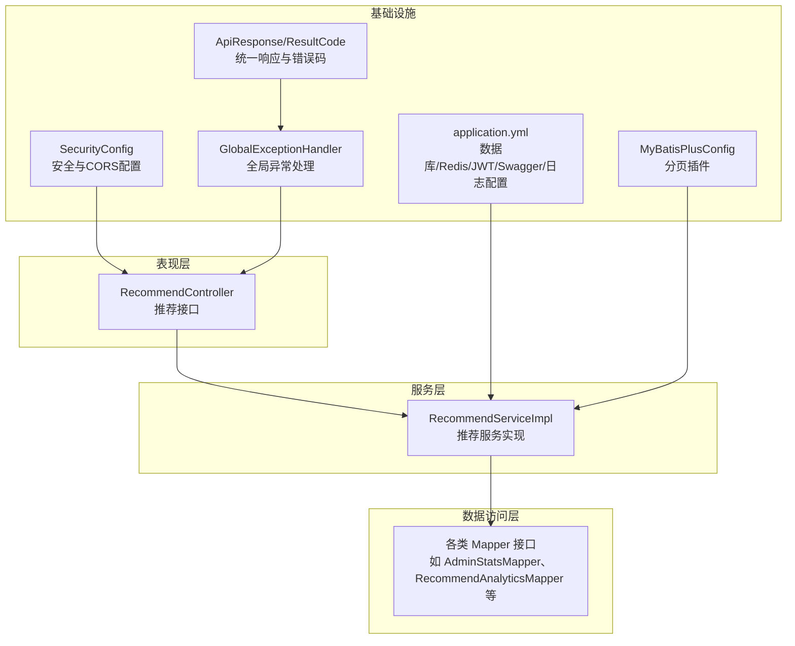
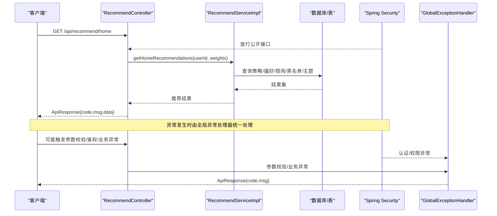
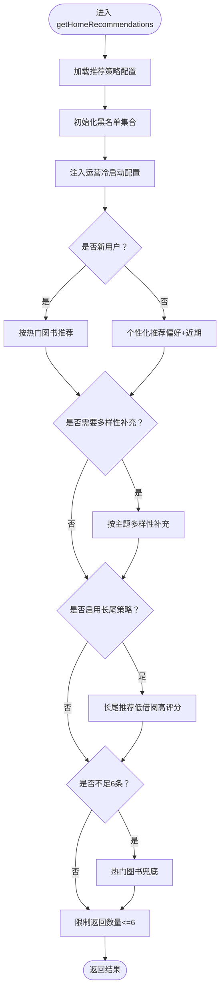
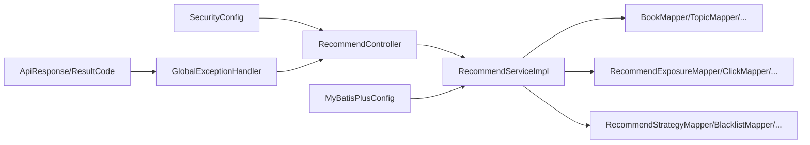

# 故障排查

<cite>
**本文引用的文件**   
- [application.yml](file://src/main/resources/application.yml)
- [MyBatisPlusConfig.java](file://src/main/java/org/example/backend/config/MyBatisPlusConfig.java)
- [SecurityConfig.java](file://src/main/java/org/example/backend/config/SecurityConfig.java)
- [GlobalExceptionHandler.java](file://src/main/java/org/example/backend/common/exception/GlobalExceptionHandler.java)
- [BusinessException.java](file://src/main/java/org/example/backend/common/exception/BusinessException.java)
- [ResultCode.java](file://src/main/java/org/example/backend/common/ResultCode.java)
- [ApiResponse.java](file://src/main/java/org/example/backend/common/ApiResponse.java)
- [RecommendController.java](file://src/main/java/org/example/backend/modules/recommend/controller/RecommendController.java)
- [RecommendServiceImpl.java](file://src/main/java/org/example/backend/modules/recommend/service/impl/RecommendServiceImpl.java)
- [AdminStatsMapper.java](file://src/main/java/org/example/backend/modules/admin/repository/AdminStatsMapper.java)
- [RecommendAnalyticsMapper.java](file://src/main/java/org/example/backend/modules/recommend/repository/RecommendAnalyticsMapper.java)
- [data_library126_db.sql](file://src/main/resources/data_library126_db.sql)
</cite>

## 目录
1. [简介](#简介)
2. [项目结构](#项目结构)
3. [核心组件](#核心组件)
4. [架构总览](#架构总览)
5. [详细组件分析](#详细组件分析)
6. [依赖关系分析](#依赖关系分析)
7. [性能考量](#性能考量)
8. [故障排查指南](#故障排查指南)
9. [结论](#结论)
10. [附录](#附录)

## 简介
本指南面向技术支持人员，围绕智能图书推荐系统在数据库连接、API接口异常、推荐算法失效与性能问题方面的故障排查，提供系统化的诊断方法、日志分析技巧、异常处理机制解读、错误码含义说明、监控指标与容量预警建议，以及复现与调试方法。文档同时给出代码级架构图与序列图，帮助快速定位问题根因。

## 项目结构
系统采用分层架构：控制器层负责对外接口；服务层承载业务逻辑；数据访问层通过 MyBatis-Plus 访问数据库；统一异常处理与响应封装贯穿各层；安全配置基于 Spring Security 与 JWT；日志与监控由配置文件集中管理。

图表来源
- [RecommendController.java](file://src/main/java/org/example/backend/modules/recommend/controller/RecommendController.java#L1-L130)
- [RecommendServiceImpl.java](file://src/main/java/org/example/backend/modules/recommend/service/impl/RecommendServiceImpl.java#L1-L927)
- [application.yml](file://src/main/resources/application.yml#L1-L71)
- [SecurityConfig.java](file://src/main/java/org/example/backend/config/SecurityConfig.java#L1-L101)
- [MyBatisPlusConfig.java](file://src/main/java/org/example/backend/config/MyBatisPlusConfig.java#L1-L28)
- [GlobalExceptionHandler.java](file://src/main/java/org/example/backend/common/exception/GlobalExceptionHandler.java#L1-L111)
- [ApiResponse.java](file://src/main/java/org/example/backend/common/ApiResponse.java#L1-L89)
- [ResultCode.java](file://src/main/java/org/example/backend/common/ResultCode.java#L1-L44)
- [AdminStatsMapper.java](file://src/main/java/org/example/backend/modules/admin/repository/AdminStatsMapper.java#L1-L65)
- [RecommendAnalyticsMapper.java](file://src/main/java/org/example/backend/modules/recommend/repository/RecommendAnalyticsMapper.java#L1-L14)

章节来源
- [application.yml](file://src/main/resources/application.yml#L1-L71)
- [MyBatisPlusConfig.java](file://src/main/java/org/example/backend/config/MyBatisPlusConfig.java#L1-L28)
- [SecurityConfig.java](file://src/main/java/org/example/backend/config/SecurityConfig.java#L1-L101)
- [GlobalExceptionHandler.java](file://src/main/java/org/example/backend/common/exception/GlobalExceptionHandler.java#L1-L111)
- [ApiResponse.java](file://src/main/java/org/example/backend/common/ApiResponse.java#L1-L89)
- [ResultCode.java](file://src/main/java/org/example/backend/common/ResultCode.java#L1-L44)
- [RecommendController.java](file://src/main/java/org/example/backend/modules/recommend/controller/RecommendController.java#L1-L130)
- [RecommendServiceImpl.java](file://src/main/java/org/example/backend/modules/recommend/service/impl/RecommendServiceImpl.java#L1-L927)
- [AdminStatsMapper.java](file://src/main/java/org/example/backend/modules/admin/repository/AdminStatsMapper.java#L1-L65)
- [RecommendAnalyticsMapper.java](file://src/main/java/org/example/backend/modules/recommend/repository/RecommendAnalyticsMapper.java#L1-L14)

## 核心组件
- 统一响应与错误码：统一响应体封装与标准错误码，便于前端与监控系统解析。
- 全局异常处理：集中捕获业务异常、参数校验异常、认证/鉴权异常与通用异常，输出结构化错误响应。
- 安全与CORS：开放推荐与公开接口，对管理端接口进行角色控制，支持跨域。
- 数据访问与分页：MyBatis-Plus 分页插件扫描各模块 repository 包，提供分页能力。
- 推荐服务：首页推荐、多样化/长尾/热门兜底、相似推荐、关联推荐、曝光/点击/反馈埋点。
- 监控与统计：管理员统计报表与推荐效果分析表映射。

章节来源
- [ApiResponse.java](file://src/main/java/org/example/backend/common/ApiResponse.java#L1-L89)
- [ResultCode.java](file://src/main/java/org/example/backend/common/ResultCode.java#L1-L44)
- [GlobalExceptionHandler.java](file://src/main/java/org/example/backend/common/exception/GlobalExceptionHandler.java#L1-L111)
- [SecurityConfig.java](file://src/main/java/org/example/backend/config/SecurityConfig.java#L1-L101)
- [MyBatisPlusConfig.java](file://src/main/java/org/example/backend/config/MyBatisPlusConfig.java#L1-L28)
- [RecommendServiceImpl.java](file://src/main/java/org/example/backend/modules/recommend/service/impl/RecommendServiceImpl.java#L1-L927)
- [AdminStatsMapper.java](file://src/main/java/org/example/backend/modules/admin/repository/AdminStatsMapper.java#L1-L65)
- [RecommendAnalyticsMapper.java](file://src/main/java/org/example/backend/modules/recommend/repository/RecommendAnalyticsMapper.java#L1-L14)

## 架构总览
下图展示请求从控制器到服务与数据访问层的调用链路，以及异常处理与安全拦截的关键节点。

图表来源
- [RecommendController.java](file://src/main/java/org/example/backend/modules/recommend/controller/RecommendController.java#L1-L130)
- [RecommendServiceImpl.java](file://src/main/java/org/example/backend/modules/recommend/service/impl/RecommendServiceImpl.java#L1-L927)
- [GlobalExceptionHandler.java](file://src/main/java/org/example/backend/common/exception/GlobalExceptionHandler.java#L1-L111)
- [SecurityConfig.java](file://src/main/java/org/example/backend/config/SecurityConfig.java#L1-L101)

## 详细组件分析

### 推荐服务实现（RecommendServiceImpl）
- 首页推荐主流程：加载策略配置、注入运营冷启动、判断新用户、个性化推荐、多样性补充、长尾策略、热门兜底，最终限制返回条数。
- 关键子流程：个性化推荐（偏好主题+近期主题）、多样性推荐（主题覆盖）、长尾推荐（低借阅高评分）、相似/关联推荐（基于主题与共同借阅者）。
- 埋点接口：曝光、点击、反馈，均使用事务写入对应表。
- 策略与黑名单：从策略表加载权重与阈值，黑名单支持按推荐类型与位置过滤。

图表来源
- [RecommendServiceImpl.java](file://src/main/java/org/example/backend/modules/recommend/service/impl/RecommendServiceImpl.java#L94-L188)

章节来源
- [RecommendServiceImpl.java](file://src/main/java/org/example/backend/modules/recommend/service/impl/RecommendServiceImpl.java#L1-L927)

### 控制器（RecommendController）
- 提供首页推荐、新书/热门/主题/相似/关联/长尾、曝光/点击/反馈、热门主题等接口。
- 默认权重与分页参数处理，统一返回 ApiResponse。

章节来源
- [RecommendController.java](file://src/main/java/org/example/backend/modules/recommend/controller/RecommendController.java#L1-L130)

### 安全与CORS（SecurityConfig）
- 公开接口放行：认证、图书列表/详情/搜索/筛选、评论列表、浏览埋点、推荐接口、静态资源。
- 管理端接口需 ADMIN 角色。
- CORS 允许任意来源与方法，凭证允许，预检缓存1小时。

章节来源
- [SecurityConfig.java](file://src/main/java/org/example/backend/config/SecurityConfig.java#L1-L101)

### 数据访问与分页（MyBatisPlusConfig）
- 自动扫描模块下的 repository 包，注册 MySQL 分页插件。

章节来源
- [MyBatisPlusConfig.java](file://src/main/java/org/example/backend/config/MyBatisPlusConfig.java#L1-L28)

### 统一异常处理与响应（GlobalExceptionHandler、ApiResponse、ResultCode）
- 业务异常：返回 200 + 自定义业务错误码。
- 参数校验异常：返回 400。
- 认证失败：返回 401。
- 权限不足：返回 403。
- 通用异常：返回 500。
- ApiResponse 封装 code/msg/data；ResultCode 定义标准错误码。

章节来源
- [GlobalExceptionHandler.java](file://src/main/java/org/example/backend/common/exception/GlobalExceptionHandler.java#L1-L111)
- [ApiResponse.java](file://src/main/java/org/example/backend/common/ApiResponse.java#L1-L89)
- [ResultCode.java](file://src/main/java/org/example/backend/common/ResultCode.java#L1-L44)
- [BusinessException.java](file://src/main/java/org/example/backend/common/exception/BusinessException.java#L1-L25)

## 依赖关系分析
- 控制器依赖服务；服务依赖多个 Mapper；服务与控制器均依赖统一响应与异常处理。
- 安全配置影响控制器放行规则；MyBatis-Plus 配置影响数据访问层行为。
- 推荐服务内部多表关联查询，策略与黑名单直接影响推荐结果与性能。

图表来源
- [RecommendController.java](file://src/main/java/org/example/backend/modules/recommend/controller/RecommendController.java#L1-L130)
- [RecommendServiceImpl.java](file://src/main/java/org/example/backend/modules/recommend/service/impl/RecommendServiceImpl.java#L1-L927)
- [SecurityConfig.java](file://src/main/java/org/example/backend/config/SecurityConfig.java#L1-L101)
- [MyBatisPlusConfig.java](file://src/main/java/org/example/backend/config/MyBatisPlusConfig.java#L1-L28)
- [GlobalExceptionHandler.java](file://src/main/java/org/example/backend/common/exception/GlobalExceptionHandler.java#L1-L111)
- [ApiResponse.java](file://src/main/java/org/example/backend/common/ApiResponse.java#L1-L89)
- [ResultCode.java](file://src/main/java/org/example/backend/common/ResultCode.java#L1-L44)

## 性能考量
- 推荐算法涉及多次表查询与排序，建议：
  - 为常用查询字段建立索引（如图书状态、借阅时间、主题名、黑名单组合键）。
  - 合理设置分页大小与 LIMIT，避免一次性返回过多数据。
  - 对热点接口增加缓存（如热门主题、策略配置），结合系统配置项启用缓存。
- 数据库连接池与超时：
  - application.yml 中配置了 MySQL 连接参数与 MyBatis 输出日志，便于定位慢查询。
  - Redis 可选配置可用于热点数据缓存，提升响应速度。
- 日志级别：
  - application.yml 设置了包级日志级别，便于在问题定位时临时提高日志级别。

章节来源
- [application.yml](file://src/main/resources/application.yml#L1-L71)
- [data_library126_db.sql](file://src/main/resources/data_library126_db.sql#L831-L852)

## 故障排查指南

### 一、数据库连接问题
- 症状
  - 接口报 500，日志出现数据库连接失败或超时。
  - MyBatis SQL 执行异常或无法获取连接。
- 诊断步骤
  - 检查 application.yml 中数据库驱动、URL、账号密码是否正确。
  - 使用数据库客户端验证连通性与权限。
  - 查看 MyBatis 日志输出（StdOutImpl）确认 SQL 是否执行。
  - 关注连接池配置与最大活跃连接数，避免连接泄漏。
- 解决方案
  - 修正连接参数；确保数据库服务运行正常；优化慢查询与索引。
  - 如使用 Redis 缓存，检查 Redis 连接配置与可用性。

章节来源
- [application.yml](file://src/main/resources/application.yml#L10-L30)
- [MyBatisPlusConfig.java](file://src/main/java/org/example/backend/config/MyBatisPlusConfig.java#L1-L28)

### 二、API 接口异常
- 错误码与含义
  - 200：业务错误（业务异常抛出），携带自定义错误码与消息。
  - 400：参数校验失败（多种参数校验异常）。
  - 401：认证失败（用户名/密码错误）。
  - 403：权限不足（无访问权限）。
  - 500：系统异常（未捕获异常）。
- 常见异常定位
  - 参数校验异常：检查请求体/路径/查询参数格式与约束。
  - 业务异常：服务层抛出 BusinessException，查看具体业务分支与输入。
  - 认证/权限异常：确认 JWT 是否有效、用户角色是否满足管理端接口要求。
- 处理流程
  - 前端根据 code/msg 判断错误类型，提示用户或重试。
  - 运维根据日志级别与异常栈定位具体控制器与服务方法。

章节来源
- [ResultCode.java](file://src/main/java/org/example/backend/common/ResultCode.java#L1-L44)
- [GlobalExceptionHandler.java](file://src/main/java/org/example/backend/common/exception/GlobalExceptionHandler.java#L1-L111)
- [BusinessException.java](file://src/main/java/org/example/backend/common/exception/BusinessException.java#L1-L25)
- [ApiResponse.java](file://src/main/java/org/example/backend/common/ApiResponse.java#L1-L89)

### 三、推荐算法失效
- 症状
  - 首页推荐为空或数量不足；多样性/长尾策略未生效；相似/关联推荐异常。
- 诊断步骤
  - 检查推荐策略表是否存在与启用状态，确认权重与阈值是否合理。
  - 核对黑名单配置（按推荐类型与位置）是否误伤。
  - 验证用户是否为“新用户”判定条件（兴趣引导完成与否、借阅次数）。
  - 检查主题/图书状态与评分、借阅次数等基础数据。
- 解决方案
  - 在策略表中调整权重与阈值；清理误加入黑名单的图书；修复用户兴趣引导状态。
  - 对高频查询字段建立索引，优化排序与 LIMIT 子句。

章节来源
- [RecommendServiceImpl.java](file://src/main/java/org/example/backend/modules/recommend/service/impl/RecommendServiceImpl.java#L94-L188)
- [RecommendServiceImpl.java](file://src/main/java/org/example/backend/modules/recommend/service/impl/RecommendServiceImpl.java#L417-L479)
- [RecommendServiceImpl.java](file://src/main/java/org/example/backend/modules/recommend/service/impl/RecommendServiceImpl.java#L724-L750)

### 四、性能问题
- 症状
  - 接口响应缓慢；数据库慢查询增多；CPU/内存占用升高。
- 诊断步骤
  - 开启数据库慢查询日志与应用日志，定位耗时 SQL。
  - 检查分页参数是否过大；确认索引是否命中。
  - 评估推荐算法中多次排序与 LIMIT 的成本，必要时引入缓存。
- 解决方案
  - 优化 SQL 与索引；限制分页大小；对热点数据做缓存；升级数据库实例规格。

章节来源
- [application.yml](file://src/main/resources/application.yml#L63-L71)
- [RecommendServiceImpl.java](file://src/main/java/org/example/backend/modules/recommend/service/impl/RecommendServiceImpl.java#L1-L927)

### 五、异常处理机制与错误码
- 业务异常 BusinessException：服务层主动抛出，返回 200 + 自定义业务错误码。
- 参数校验异常：MethodArgumentNotValidException、BindException、ConstraintViolationException 统一返回 400。
- 认证/权限异常：BadCredentialsException 返回 401，AccessDeniedException 返回 403。
- 通用异常：Exception 返回 500。

章节来源
- [GlobalExceptionHandler.java](file://src/main/java/org/example/backend/common/exception/GlobalExceptionHandler.java#L1-L111)
- [BusinessException.java](file://src/main/java/org/example/backend/common/exception/BusinessException.java#L1-L25)
- [ResultCode.java](file://src/main/java/org/example/backend/common/ResultCode.java#L1-L44)

### 六、系统监控指标与容量预警
- 推荐效果指标（管理员统计）
  - 曝光数、点击数、收藏数、评分数（按推荐类型与时间窗口统计）。
  - 热门图书排行（基于推荐点击与收藏）。
- 建议监控项
  - 推荐漏斗转化率（曝光→点击→收藏/评分）。
  - 推荐响应时间 P50/P95。
  - 数据库 QPS/慢查询数、连接池使用率。
  - 应用错误率（4xx/5xx）与业务错误率（200+业务错误）。
- 容量预警
  - 当推荐响应时间持续超过阈值或错误率上升时，触发告警并回滚策略调整。

章节来源
- [AdminStatsMapper.java](file://src/main/java/org/example/backend/modules/admin/repository/AdminStatsMapper.java#L1-L65)
- [RecommendAnalyticsMapper.java](file://src/main/java/org/example/backend/modules/recommend/repository/RecommendAnalyticsMapper.java#L1-L14)

### 七、日志分析工具与调试技巧
- 日志配置
  - 控制台输出格式与级别；可临时提高包级别（如后端包、安全包）以获取更详细信息。
- 调试技巧
  - 使用 Swagger UI 或 Postman 调用推荐接口，观察返回码与消息。
  - 在服务层关键节点打印上下文参数（用户ID、推荐类型、位置、权重）。
  - 对照异常处理器日志，定位异常类型与堆栈。
- 问题复现
  - 构造新用户场景（未完成兴趣引导或借阅次数少）复现首页推荐策略分支。
  - 修改策略表与黑名单配置，验证推荐结果变化。

章节来源
- [application.yml](file://src/main/resources/application.yml#L63-L71)
- [GlobalExceptionHandler.java](file://src/main/java/org/example/backend/common/exception/GlobalExceptionHandler.java#L1-L111)
- [RecommendController.java](file://src/main/java/org/example/backend/modules/recommend/controller/RecommendController.java#L1-L130)

## 结论
本指南提供了从数据库、接口、算法到性能的全链路故障排查方法。通过统一异常处理与标准错误码、安全放行策略、推荐算法流程梳理与监控指标建设，能够快速定位并解决常见问题。建议在生产环境中持续完善索引、缓存与容量规划，并结合日志与监控体系形成闭环。

## 附录

### A. 常见错误码速查
- 200：业务错误（业务异常）
- 400：参数校验失败
- 401：认证失败
- 403：权限不足
- 404：资源不存在
- 500：系统异常

章节来源
- [ResultCode.java](file://src/main/java/org/example/backend/common/ResultCode.java#L1-L44)

### B. 推荐接口一览（便于复现与测试）
- GET /api/recommend/home：首页推荐
- GET /api/recommend/new：新书抢先看
- GET /api/recommend/hot：热门排行榜
- GET /api/recommend/topic：主题漫游
- GET /api/recommend/similar/{bookId}：相似图书推荐
- GET /api/recommend/user-also-read/{bookId}：阅读此书的用户也读
- POST /api/recommend/exposure：记录曝光
- POST /api/recommend/click：记录点击
- POST /api/recommend/feedback：反馈
- GET /api/recommend/topics：热门主题
- GET /api/recommend/long-tail：长尾推荐

章节来源
- [RecommendController.java](file://src/main/java/org/example/backend/modules/recommend/controller/RecommendController.java#L1-L130)