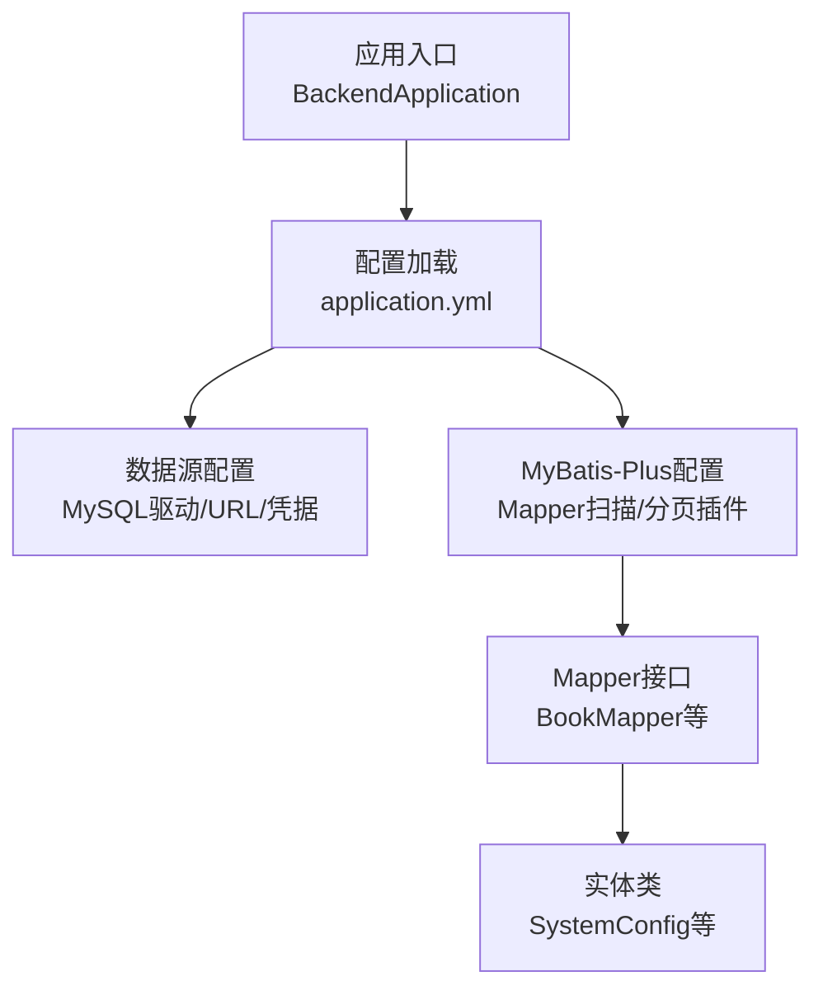
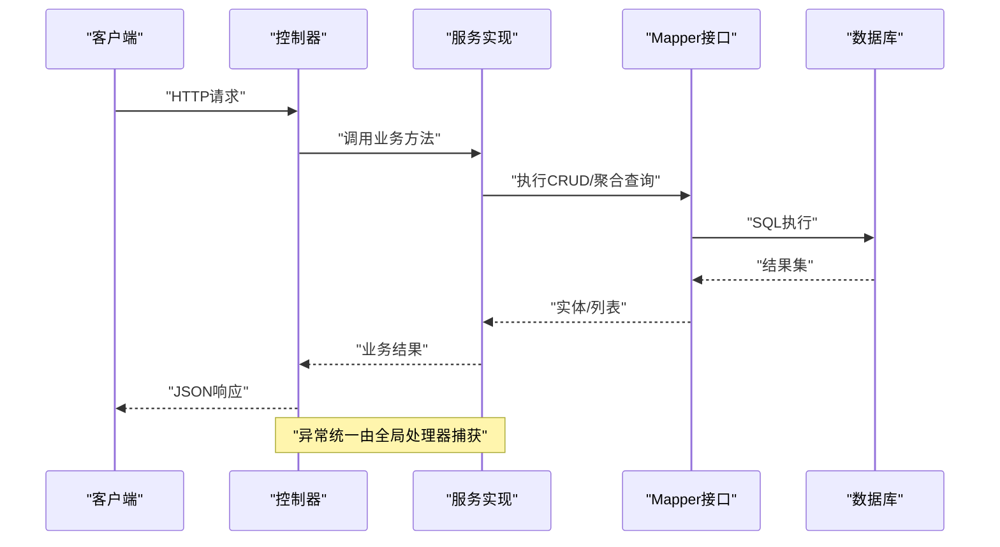
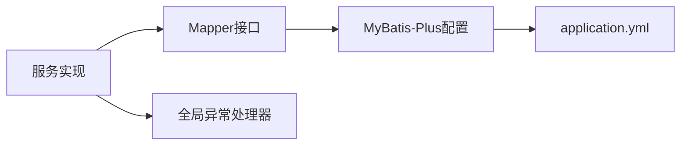

# 数据库问题排查

<cite>
**本文引用的文件**
- [application.yml](file://src/main/resources/application.yml)
- [MyBatisPlusConfig.java](file://src/main/java/org/example/backend/config/MyBatisPlusConfig.java)
- [BackendApplication.java](file://src/main/java/org/example/backend/BackendApplication.java)
- [BusinessException.java](file://src/main/java/org/example/backend/common/exception/BusinessException.java)
- [GlobalExceptionHandler.java](file://src/main/java/org/example/backend/common/exception/GlobalExceptionHandler.java)
- [Constants.java](file://src/main/java/org/example/backend/common/constants/Constants.java)
- [BookMapper.java](file://src/main/java/org/example/backend/modules/book/repository/BookMapper.java)
- [SystemConfig.java](file://src/main/java/org/example/backend/entity/SystemConfig.java)
- [SystemConfigMapper.java](file://src/main/java/org/example/backend/modules/admin/repository/SystemConfigMapper.java)
- [AdminServiceImpl.java](file://src/main/java/org/example/backend/modules/admin/service/impl/AdminServiceImpl.java)
- [InteractionServiceImpl.java](file://src/main/java/org/example/backend/modules/interaction/service/impl/InteractionServiceImpl.java)
- [data_library126_db.sql](file://src/main/resources/data_library126_db.sql)
</cite>

## 目录
1. [简介](#简介)
2. [项目结构](#项目结构)
3. [核心组件](#核心组件)
4. [架构总览](#架构总览)
5. [详细组件分析](#详细组件分析)
6. [依赖关系分析](#依赖关系分析)
7. [性能考虑](#性能考虑)
8. [故障排查指南](#故障排查指南)
9. [结论](#结论)
10. [附录](#附录)

## 简介
本指南面向DBA与技术支持人员，围绕智能图书推荐系统的数据库问题提供系统化排查方法。内容涵盖数据库连接问题诊断（连接池配置、服务状态、超时处理）、MyBatis-Plus配置问题排查（SQL执行异常、分页问题、事务异常）、数据库性能分析（慢查询识别、索引优化、查询计划）、以及数据一致性问题（并发冲突、数据同步）的完整处理手册。

## 项目结构
后端采用Spring Boot工程，数据库配置集中在application.yml中，MyBatis-Plus通过配置类启用分页插件，并扫描各模块的Repository包。异常统一由全局处理器捕获并标准化返回。

图表来源
- [application.yml](file://src/main/resources/application.yml#L10-L30)
- [MyBatisPlusConfig.java](file://src/main/java/org/example/backend/config/MyBatisPlusConfig.java#L13-L25)
- [BackendApplication.java](file://src/main/java/org/example/backend/BackendApplication.java#L6-L11)

章节来源
- [application.yml](file://src/main/resources/application.yml#L1-L71)
- [MyBatisPlusConfig.java](file://src/main/java/org/example/backend/config/MyBatisPlusConfig.java#L1-L28)
- [BackendApplication.java](file://src/main/java/org/example/backend/BackendApplication.java#L1-L14)

## 核心组件
- 数据源与MyBatis-Plus配置：包含数据源驱动、URL、凭据、MyBatis-Plus的Mapper扫描路径、驼峰映射、日志实现、全局逻辑删除字段配置等。
- 异常处理：统一捕获业务异常、参数校验异常、认证/授权异常及通用异常，标准化响应码与消息。
- 常量定义：默认分页大小、最大分页大小等常量，便于在服务层进行分页控制。
- Mapper与实体：以BookMapper、SystemConfigMapper为代表，展示标准的MyBatis-Plus使用方式；SystemConfig实体映射system_config表。

章节来源
- [application.yml](file://src/main/resources/application.yml#L10-L30)
- [GlobalExceptionHandler.java](file://src/main/java/org/example/backend/common/exception/GlobalExceptionHandler.java#L25-L109)
- [Constants.java](file://src/main/java/org/example/backend/common/constants/Constants.java#L23-L31)
- [BookMapper.java](file://src/main/java/org/example/backend/modules/book/repository/BookMapper.java#L1-L14)
- [SystemConfig.java](file://src/main/java/org/example/backend/entity/SystemConfig.java#L1-L48)
- [SystemConfigMapper.java](file://src/main/java/org/example/backend/modules/admin/repository/SystemConfigMapper.java#L1-L13)

## 架构总览
系统数据库交互链路自上而下：控制器调用服务层，服务层通过MyBatis-Plus的Mapper访问数据库；异常在全局处理器统一拦截并返回。

图表来源
- [GlobalExceptionHandler.java](file://src/main/java/org/example/backend/common/exception/GlobalExceptionHandler.java#L33-L38)
- [BookMapper.java](file://src/main/java/org/example/backend/modules/book/repository/BookMapper.java#L10-L11)

## 详细组件分析

### 数据库连接与MyBatis-Plus配置
- 连接配置要点
  - 驱动类名、JDBC URL、用户名、密码均在配置文件中集中管理，便于统一排查。
  - MyBatis-Plus开启驼峰映射与日志输出，有助于定位SQL与字段映射问题。
  - 逻辑删除字段配置用于软删除场景，需确保对应表结构存在相应字段。
- 分页插件
  - 在配置类中注册分页插件并指定数据库类型为MySQL，避免跨库方言导致的分页异常。
  - Mapper扫描范围限定在modules.*.repository，确保仅扫描业务Mapper。
- 常量与分页
  - 默认分页大小与最大分页大小常量可用于服务层参数校验与分页限制。

章节来源
- [application.yml](file://src/main/resources/application.yml#L10-L30)
- [MyBatisPlusConfig.java](file://src/main/java/org/example/backend/config/MyBatisPlusConfig.java#L13-L25)
- [Constants.java](file://src/main/java/org/example/backend/common/constants/Constants.java#L23-L31)

### SQL执行异常排查
- 现象特征
  - 控制器返回业务错误码但消息提示不明确；或出现通用异常。
- 排查步骤
  - 检查全局异常处理器对业务异常的捕获与响应码设置。
  - 核对Mapper接口与XML映射文件是否匹配，确认Mapper扫描路径正确。
  - 开启MyBatis日志查看实际执行SQL，定位字段映射或语法问题。
  - 若涉及软删除，确认逻辑删除字段配置与表结构一致。
- 关联实现参考
  - 业务异常封装与统一返回。
  - Mapper接口示例（如BookMapper）。

章节来源
- [GlobalExceptionHandler.java](file://src/main/java/org/example/backend/common/exception/GlobalExceptionHandler.java#L33-L38)
- [BookMapper.java](file://src/main/java/org/example/backend/modules/book/repository/BookMapper.java#L10-L11)
- [application.yml](file://src/main/resources/application.yml#L17-L29)

### 分页查询问题排查
- 现象特征
  - 分页结果异常、总数不准确、或出现跨数据库方言的分页错误。
- 排查步骤
  - 确认分页插件已注册且数据库类型为MySQL。
  - 检查服务层传入的分页参数是否超过最大限制。
  - 使用Mapper的分页构造器进行查询，避免手动拼接LIMIT。
- 关联实现参考
  - 分页插件配置。
  - 默认与最大分页常量。

章节来源
- [MyBatisPlusConfig.java](file://src/main/java/org/example/backend/config/MyBatisPlusConfig.java#L20-L25)
- [Constants.java](file://src/main/java/org/example/backend/common/constants/Constants.java#L23-L31)

### 事务处理异常排查
- 现象特征
  - 数据未回滚、并发写入冲突、或事务边界不清晰导致的数据不一致。
- 排查步骤
  - 检查服务方法上的事务注解是否生效（基于Spring声明式事务）。
  - 确认异常抛出位置是否在事务边界内，避免吞掉异常导致未回滚。
  - 对于批量操作，评估单条插入与多条插入的事务策略。
- 关联实现参考
  - 管理员添加图书与更新图书的事务方法。
  - 互动模块新增评论与删除评论的事务方法。

章节来源
- [AdminServiceImpl.java](file://src/main/java/org/example/backend/modules/admin/service/impl/AdminServiceImpl.java#L96-L118)
- [AdminServiceImpl.java](file://src/main/java/org/example/backend/modules/admin/service/impl/AdminServiceImpl.java#L121-L132)
- [InteractionServiceImpl.java](file://src/main/java/org/example/backend/modules/interaction/service/impl/InteractionServiceImpl.java#L137-L154)
- [InteractionServiceImpl.java](file://src/main/java/org/example/backend/modules/interaction/service/impl/InteractionServiceImpl.java#L157-L170)

### 数据一致性与并发冲突
- 并发写入
  - 对于热点数据（如图书计数字段），应使用原子更新或数据库层面的乐观锁。
  - 服务层在更新前先查询再更新时，需在事务中进行，避免ABA问题。
- 软删除与逻辑删除
  - 确保查询默认过滤逻辑删除标记，避免脏读。
- 关联实现参考
  - 逻辑删除字段配置。
  - 业务实体与Mapper映射。

章节来源
- [application.yml](file://src/main/resources/application.yml#L24-L29)
- [SystemConfig.java](file://src/main/java/org/example/backend/entity/SystemConfig.java#L1-L48)

## 依赖关系分析
- 组件耦合
  - 服务层依赖Mapper接口，Mapper依赖MyBatis-Plus的基础设施。
  - 全局异常处理器与所有服务解耦，统一处理异常。
- 外部依赖
  - MySQL驱动与连接池（由Spring Boot自动配置）。
  - MyBatis-Plus版本与数据库类型兼容性。

图表来源
- [MyBatisPlusConfig.java](file://src/main/java/org/example/backend/config/MyBatisPlusConfig.java#L13-L25)
- [application.yml](file://src/main/resources/application.yml#L10-L30)
- [GlobalExceptionHandler.java](file://src/main/java/org/example/backend/common/exception/GlobalExceptionHandler.java#L25-L109)

章节来源
- [MyBatisPlusConfig.java](file://src/main/java/org/example/backend/config/MyBatisPlusConfig.java#L1-L28)
- [application.yml](file://src/main/resources/application.yml#L1-L71)
- [GlobalExceptionHandler.java](file://src/main/java/org/example/backend/common/exception/GlobalExceptionHandler.java#L1-L110)

## 性能考虑
- 慢查询识别
  - 启用MyBatis日志，观察SQL执行时间与返回行数。
  - 结合数据库慢查询日志定位热点SQL。
- 索引优化建议
  - 唯一索引与常用查询条件字段建立索引（如系统配置表的键字段）。
  - 避免全表扫描，优先使用覆盖索引。
- 查询计划分析
  - 使用EXPLAIN分析SQL执行计划，关注是否存在Extra列的Using filesort或Using temporary。
- 分页性能
  - 大偏移量分页会带来性能问题，建议使用基于游标或“书签”的分页方案。

章节来源
- [application.yml](file://src/main/resources/application.yml#L22-L23)
- [data_library126_db.sql](file://src/main/resources/data_library126_db.sql#L831-L846)

## 故障排查指南

### 一、数据库连接问题诊断
- 连接池配置检查
  - 确认驱动类名与JDBC URL正确，用户名与密码有效。
  - 检查连接超时与空闲连接回收策略（由Spring Boot默认提供）。
- 数据库服务状态监控
  - 使用数据库客户端工具验证连通性与登录。
  - 查看数据库进程与资源占用情况（CPU、内存、连接数）。
- 连接超时处理
  - 如遇超时，优先检查网络延迟与防火墙策略。
  - 适当增大超时阈值并优化SQL执行时间。

章节来源
- [application.yml](file://src/main/resources/application.yml#L10-L16)

### 二、MyBatis-Plus配置问题排查
- SQL执行异常
  - 打开日志查看实际SQL，核对字段映射与表结构。
  - 检查Mapper扫描路径与命名规范。
- 分页查询问题
  - 确认分页插件已注册且数据库类型正确。
  - 控制分页参数范围，避免过大页大小。
- 事务处理异常
  - 检查事务注解与异常传播策略。
  - 确保异常抛出位置在事务边界内。

章节来源
- [application.yml](file://src/main/resources/application.yml#L17-L29)
- [MyBatisPlusConfig.java](file://src/main/java/org/example/backend/config/MyBatisPlusConfig.java#L13-L25)
- [GlobalExceptionHandler.java](file://src/main/java/org/example/backend/common/exception/GlobalExceptionHandler.java#L33-L38)

### 三、数据库性能问题分析
- 慢查询识别
  - 通过日志与数据库慢查询日志定位热点SQL。
- 索引优化建议
  - 为高频查询字段建立合适索引，避免重复索引。
- 查询计划分析
  - 使用EXPLAIN分析执行计划，优化WHERE、JOIN与ORDER子句。

章节来源
- [application.yml](file://src/main/resources/application.yml#L22-L23)
- [data_library126_db.sql](file://src/main/resources/data_library126_db.sql#L831-L846)

### 四、数据一致性问题排查
- 并发冲突处理
  - 对关键写入使用原子更新或数据库层面的锁机制。
  - 在事务中完成相关联的多次写入，保证原子性。
- 数据同步问题
  - 对于软删除与逻辑删除，确保查询侧默认过滤已删除记录。
  - 定期校验主从复制或分片一致性。

章节来源
- [application.yml](file://src/main/resources/application.yml#L24-L29)
- [AdminServiceImpl.java](file://src/main/java/org/example/backend/modules/admin/service/impl/AdminServiceImpl.java#L96-L118)

### 五、DBA与技术支持操作清单
- 快速检查
  - 应用能否正常启动并连接数据库。
  - MyBatis日志是否输出SQL与参数。
  - 分页与事务注解是否按预期工作。
- 常见问题定位
  - 业务异常统一返回码与消息是否符合预期。
  - 系统配置表的键值是否正确，索引是否合理。
- 性能优化
  - 识别并优化慢查询，补充缺失索引。
  - 控制分页大小，避免大偏移量分页。

章节来源
- [BackendApplication.java](file://src/main/java/org/example/backend/BackendApplication.java#L6-L11)
- [GlobalExceptionHandler.java](file://src/main/java/org/example/backend/common/exception/GlobalExceptionHandler.java#L25-L109)
- [SystemConfig.java](file://src/main/java/org/example/backend/entity/SystemConfig.java#L1-L48)
- [SystemConfigMapper.java](file://src/main/java/org/example/backend/modules/admin/repository/SystemConfigMapper.java#L1-L13)

## 结论
本指南提供了从连接、ORM配置、事务到性能与一致性的全栈排查路径。建议在生产环境启用完善的日志与监控，结合本文提供的检查点与优化建议，快速定位并解决数据库相关问题。

## 附录
- 关键配置与实体参考
  - 数据源与MyBatis-Plus配置
  - 分页插件与Mapper扫描
  - 业务异常与全局异常处理
  - 系统配置实体与Mapper

章节来源
- [application.yml](file://src/main/resources/application.yml#L10-L30)
- [MyBatisPlusConfig.java](file://src/main/java/org/example/backend/config/MyBatisPlusConfig.java#L13-L25)
- [BusinessException.java](file://src/main/java/org/example/backend/common/exception/BusinessException.java#L1-L24)
- [GlobalExceptionHandler.java](file://src/main/java/org/example/backend/common/exception/GlobalExceptionHandler.java#L25-L109)
- [SystemConfig.java](file://src/main/java/org/example/backend/entity/SystemConfig.java#L1-L48)
- [SystemConfigMapper.java](file://src/main/java/org/example/backend/modules/admin/repository/SystemConfigMapper.java#L1-L13)