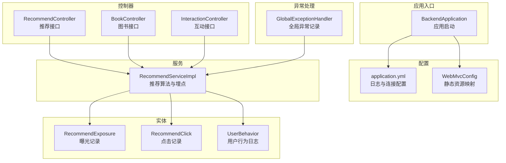
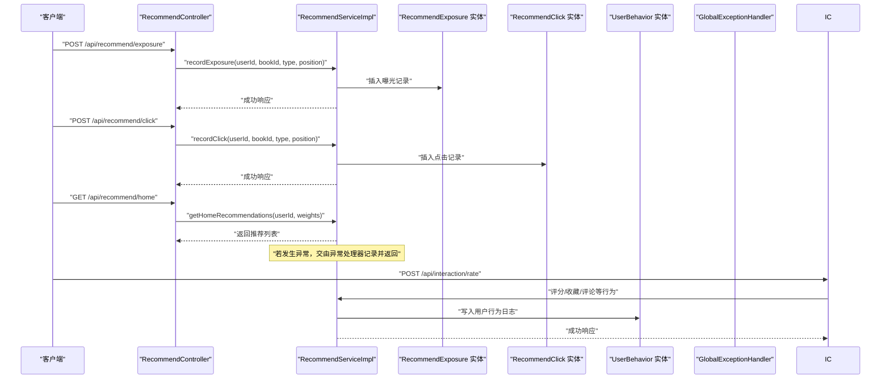
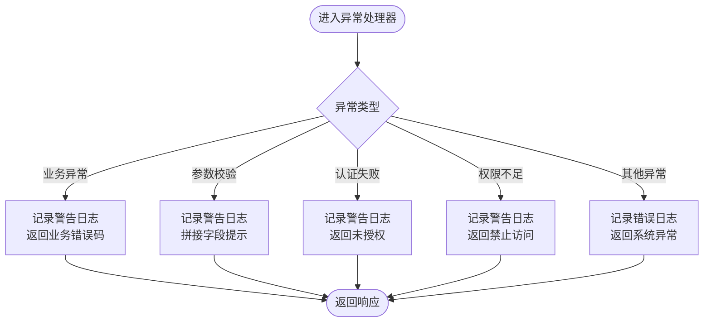
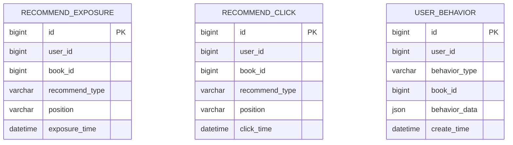
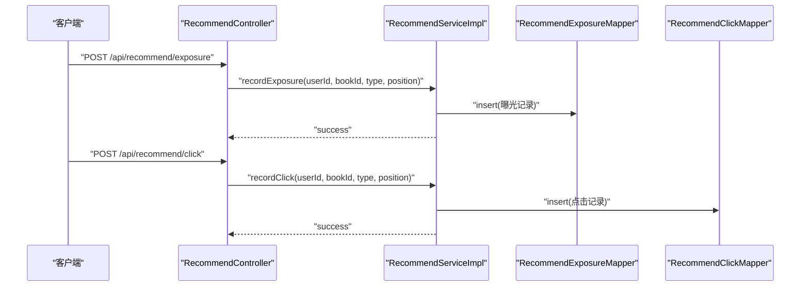
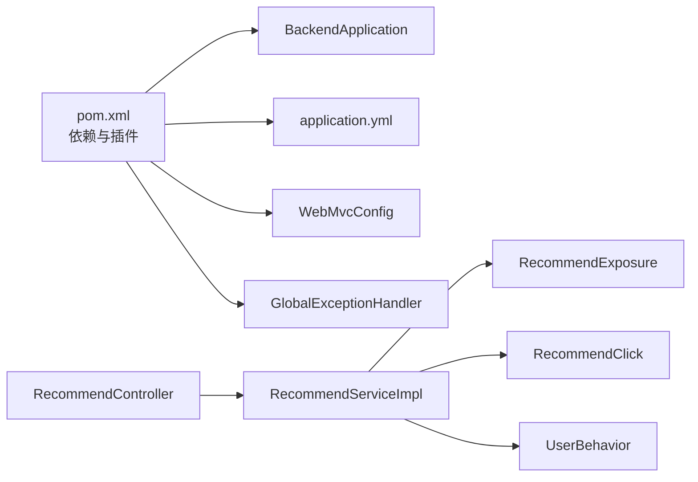

# 日志分析与监控

<cite>
**本文引用的文件**
- [application.yml](file://src/main/resources/application.yml)
- [BackendApplication.java](file://src/main/java/org/example/backend/BackendApplication.java)
- [GlobalExceptionHandler.java](file://src/main/java/org/example/backend/common/exception/GlobalExceptionHandler.java)
- [Constants.java](file://src/main/java/org/example/backend/common/constants/Constants.java)
- [WebMvcConfig.java](file://src/main/java/org/example/backend/config/WebMvcConfig.java)
- [RecommendController.java](file://src/main/java/org/example/backend/modules/recommend/controller/RecommendController.java)
- [RecommendServiceImpl.java](file://src/main/java/org/example/backend/modules/recommend/service/impl/RecommendServiceImpl.java)
- [RecommendClick.java](file://src/main/java/org/example/backend/entity/RecommendClick.java)
- [RecommendExposure.java](file://src/main/java/org/example/backend/entity/RecommendExposure.java)
- [UserBehavior.java](file://src/main/java/org/example/backend/entity/UserBehavior.java)
- [BookController.java](file://src/main/java/org/example/backend/modules/book/controller/BookController.java)
- [InteractionController.java](file://src/main/java/org/example/backend/modules/interaction/controller/InteractionController.java)
- [pom.xml](file://pom.xml)
</cite>

## 目录
1. [简介](#简介)
2. [项目结构](#项目结构)
3. [核心组件](#核心组件)
4. [架构总览](#架构总览)
5. [详细组件分析](#详细组件分析)
6. [依赖关系分析](#依赖关系分析)
7. [性能考量](#性能考量)
8. [故障排查指南](#故障排查指南)
9. [结论](#结论)
10. [附录](#附录)

## 简介
本指南面向智能图书推荐系统的运维与开发团队，围绕日志系统配置、关键业务日志分析、实时监控指标与告警、以及日志分析工具（如 ELK Stack）的集成与使用，提供一套可落地的最佳实践。文档结合现有代码库中的日志配置、异常处理、业务埋点与实体模型，给出可执行的建议与图示。

## 项目结构
后端采用 Spring Boot 应用，主要模块包括：
- 控制器层：对外暴露 REST 接口，负责接收请求与返回响应
- 服务层：实现推荐、图书、互动等业务逻辑
- 实体与持久层：定义推荐曝光、点击、用户行为等业务实体
- 异常处理：统一捕获并记录异常，输出结构化响应
- 配置：应用启动入口、日志级别、静态资源映射等

图表来源
- [BackendApplication.java](file://src/main/java/org/example/backend/BackendApplication.java#L1-L14)
- [application.yml](file://src/main/resources/application.yml#L63-L71)
- [WebMvcConfig.java](file://src/main/java/org/example/backend/config/WebMvcConfig.java#L1-L28)
- [RecommendController.java](file://src/main/java/org/example/backend/modules/recommend/controller/RecommendController.java#L1-L130)
- [RecommendServiceImpl.java](file://src/main/java/org/example/backend/modules/recommend/service/impl/RecommendServiceImpl.java#L658-L692)
- [RecommendExposure.java](file://src/main/java/org/example/backend/entity/RecommendExposure.java#L1-L49)
- [RecommendClick.java](file://src/main/java/org/example/backend/entity/RecommendClick.java#L1-L49)
- [UserBehavior.java](file://src/main/java/org/example/backend/entity/UserBehavior.java#L1-L51)
- [GlobalExceptionHandler.java](file://src/main/java/org/example/backend/common/exception/GlobalExceptionHandler.java#L1-L111)

章节来源
- [BackendApplication.java](file://src/main/java/org/example/backend/BackendApplication.java#L1-L14)
- [application.yml](file://src/main/resources/application.yml#L1-L71)
- [WebMvcConfig.java](file://src/main/java/org/example/backend/config/WebMvcConfig.java#L1-L28)

## 核心组件
- 日志配置：通过 YAML 设置根日志级别与控制台输出格式，便于在开发与生产环境进行差异化管理
- 全局异常处理：集中记录业务异常、参数校验异常、认证/授权异常与系统异常，统一返回结构化响应
- 推荐埋点：提供曝光与点击接口，服务层实现写入推荐曝光/点击记录，支撑后续分析
- 用户行为埋点：提供用户行为实体，支持浏览、收藏、评分、借阅等行为的结构化记录
- 控制器与服务：承载业务入口与算法实现，是日志采集与监控的关键节点

章节来源
- [application.yml](file://src/main/resources/application.yml#L63-L71)
- [GlobalExceptionHandler.java](file://src/main/java/org/example/backend/common/exception/GlobalExceptionHandler.java#L1-L111)
- [RecommendController.java](file://src/main/java/org/example/backend/modules/recommend/controller/RecommendController.java#L82-L102)
- [RecommendServiceImpl.java](file://src/main/java/org/example/backend/modules/recommend/service/impl/RecommendServiceImpl.java#L658-L692)
- [UserBehavior.java](file://src/main/java/org/example/backend/entity/UserBehavior.java#L1-L51)

## 架构总览
下图展示了日志与监控在系统中的位置与流向：控制器接收请求，服务层执行业务并写入埋点数据，异常处理器统一记录异常，最终由日志系统收集并供分析工具消费。

图表来源
- [RecommendController.java](file://src/main/java/org/example/backend/modules/recommend/controller/RecommendController.java#L82-L102)
- [RecommendServiceImpl.java](file://src/main/java/org/example/backend/modules/recommend/service/impl/RecommendServiceImpl.java#L658-L692)
- [RecommendExposure.java](file://src/main/java/org/example/backend/entity/RecommendExposure.java#L1-L49)
- [RecommendClick.java](file://src/main/java/org/example/backend/entity/RecommendClick.java#L1-L49)
- [UserBehavior.java](file://src/main/java/org/example/backend/entity/UserBehavior.java#L1-L51)
- [InteractionController.java](file://src/main/java/org/example/backend/modules/interaction/controller/InteractionController.java#L1-L88)

## 详细组件分析

### 日志系统配置与使用
- 日志级别
  - 根级别：INFO
  - 包级别：org.example.backend 为 DEBUG，便于开发调试
  - 安全包级别：org.springframework.security 为 DEBUG，便于排查鉴权问题
- 日志格式
  - 控制台格式包含时间、线程、级别、Logger 与消息，便于快速定位
- 建议
  - 生产环境建议将包级别调整为 WARN 或 ERROR，并结合文件输出与轮转策略
  - 对关键业务方法增加结构化日志（如 TraceId、用户标识、请求参数摘要、耗时）

章节来源
- [application.yml](file://src/main/resources/application.yml#L63-L71)

### 全局异常处理与日志
- 异常分类与记录
  - 业务异常：记录警告级别与错误码
  - 参数校验异常：记录警告级别与具体字段提示
  - 认证/授权异常：记录警告级别与原因
  - 其他异常：记录错误级别并返回通用错误响应
- 建议
  - 在异常处理器中加入 TraceId 与用户上下文，便于跨系统追踪
  - 对高频异常建立告警阈值，避免雪崩效应

图表来源
- [GlobalExceptionHandler.java](file://src/main/java/org/example/backend/common/exception/GlobalExceptionHandler.java#L33-L108)

章节来源
- [GlobalExceptionHandler.java](file://src/main/java/org/example/backend/common/exception/GlobalExceptionHandler.java#L1-L111)

### 关键业务日志分析方法
- 推荐曝光日志
  - 字段：用户ID、图书ID、推荐类型、推荐位置、曝光时间
  - 分析要点：曝光量、各推荐类型/位置的曝光分布、新用户与老用户的差异
- 推荐点击日志
  - 字段：用户ID、图书ID、推荐类型、推荐位置、点击时间
  - 分析要点：点击率、CTR、不同场景下的点击分布、新用户点击行为
- 用户行为日志
  - 字段：用户ID、行为类型（浏览/收藏/评分/借阅）、图书ID、行为数据（JSON）、时间
  - 分析要点：行为序列、转化漏斗、用户活跃度与留存

图表来源
- [RecommendExposure.java](file://src/main/java/org/example/backend/entity/RecommendExposure.java#L1-L49)
- [RecommendClick.java](file://src/main/java/org/example/backend/entity/RecommendClick.java#L1-L49)
- [UserBehavior.java](file://src/main/java/org/example/backend/entity/UserBehavior.java#L1-L51)

章节来源
- [RecommendExposure.java](file://src/main/java/org/example/backend/entity/RecommendExposure.java#L1-L49)
- [RecommendClick.java](file://src/main/java/org/example/backend/entity/RecommendClick.java#L1-L49)
- [UserBehavior.java](file://src/main/java/org/example/backend/entity/UserBehavior.java#L1-L51)

### 推荐埋点与控制器
- 曝光接口：记录推荐曝光，便于计算曝光量与分布
- 点击接口：记录推荐点击，便于计算点击率与转化
- 服务层实现：事务性写入，确保数据一致性

图表来源
- [RecommendController.java](file://src/main/java/org/example/backend/modules/recommend/controller/RecommendController.java#L82-L102)
- [RecommendServiceImpl.java](file://src/main/java/org/example/backend/modules/recommend/service/impl/RecommendServiceImpl.java#L658-L692)

章节来源
- [RecommendController.java](file://src/main/java/org/example/backend/modules/recommend/controller/RecommendController.java#L82-L102)
- [RecommendServiceImpl.java](file://src/main/java/org/example/backend/modules/recommend/service/impl/RecommendServiceImpl.java#L658-L692)

### 用户行为埋点与控制器
- 互动接口：评分、收藏、评论、借阅、还书等
- 服务层写入用户行为日志，支持后续分析用户路径与转化

章节来源
- [InteractionController.java](file://src/main/java/org/example/backend/modules/interaction/controller/InteractionController.java#L1-L88)
- [UserBehavior.java](file://src/main/java/org/example/backend/entity/UserBehavior.java#L1-L51)

### 日志格式规范与轮转策略
- 格式规范
  - 时间戳、线程名、日志级别、Logger 名称、消息正文
  - 建议在结构化日志中加入 TraceId、用户ID、请求URI、耗时等上下文字段
- 轮转策略
  - 基于时间与大小的滚动策略（如按日切分、最大文件大小限制）
  - 保留周期建议：开发环境 7 天，生产环境 30–90 天
  - 归档与压缩：对旧日志进行压缩归档，降低存储成本

章节来源
- [application.yml](file://src/main/resources/application.yml#L69-L71)

## 依赖关系分析
- 启动与配置
  - 应用启动类负责加载配置与装配组件
  - WebMvcConfig 提供静态资源映射，便于文件上传与访问
- 日志与异常
  - application.yml 中的日志配置影响全局输出
  - GlobalExceptionHandler 统一记录异常，减少重复日志逻辑
- 业务埋点
  - 控制器通过服务层写入推荐曝光/点击与用户行为日志
  - 实体类定义了埋点字段，保证数据一致性

图表来源
- [pom.xml](file://pom.xml#L1-L161)
- [BackendApplication.java](file://src/main/java/org/example/backend/BackendApplication.java#L1-L14)
- [application.yml](file://src/main/resources/application.yml#L63-L71)
- [WebMvcConfig.java](file://src/main/java/org/example/backend/config/WebMvcConfig.java#L1-L28)
- [GlobalExceptionHandler.java](file://src/main/java/org/example/backend/common/exception/GlobalExceptionHandler.java#L1-L111)
- [RecommendController.java](file://src/main/java/org/example/backend/modules/recommend/controller/RecommendController.java#L1-L130)
- [RecommendServiceImpl.java](file://src/main/java/org/example/backend/modules/recommend/service/impl/RecommendServiceImpl.java#L658-L692)
- [RecommendExposure.java](file://src/main/java/org/example/backend/entity/RecommendExposure.java#L1-L49)
- [RecommendClick.java](file://src/main/java/org/example/backend/entity/RecommendClick.java#L1-L49)
- [UserBehavior.java](file://src/main/java/org/example/backend/entity/UserBehavior.java#L1-L51)

章节来源
- [pom.xml](file://pom.xml#L1-L161)

## 性能考量
- 日志性能
  - 控制台输出仅用于开发；生产环境建议落盘并启用异步/缓冲
  - 避免在热点路径中进行复杂字符串拼接与高成本对象序列化
- 异常处理
  - 将异常日志与业务日志分离，避免相互干扰
  - 对频繁发生的异常进行降采样或聚合统计
- 埋点写入
  - 曝光/点击写入建议使用批量或异步队列，降低对主流程的影响
  - 对数据库写入进行必要的索引优化与分区策略

## 故障排查指南
- 常见问题定位步骤
  - 查看异常处理器日志，确认异常类型与堆栈
  - 结合 TraceId 与用户上下文，回溯请求链路
  - 检查推荐埋点与用户行为埋点是否正常入库
- 建议的排查清单
  - 确认 application.yml 的日志级别与格式是否符合预期
  - 检查数据库连接与事务配置，确保埋点写入成功
  - 对高频接口进行采样日志与慢查询分析

章节来源
- [GlobalExceptionHandler.java](file://src/main/java/org/example/backend/common/exception/GlobalExceptionHandler.java#L103-L108)
- [application.yml](file://src/main/resources/application.yml#L63-L71)

## 结论
通过合理的日志配置、统一的异常处理、完善的业务埋点与清晰的数据模型，智能图书推荐系统可以构建起可观测、可分析、可预警的监控体系。配合 ELK 等日志分析平台，能够高效地进行趋势分析、异常检测与容量规划，保障系统稳定运行与持续优化。

## 附录

### 实时监控指标与告警建议
- 系统健康
  - CPU/内存/IO 使用率、GC 次数与停顿时间、连接池占用
- 业务指标
  - 推荐曝光量、点击量、点击率（CTR）、转化率、用户活跃度
  - 新用户与老用户的差异指标、主题维度的曝光与点击分布
- 告警策略
  - 异常率突增、关键接口 RT 超阈、数据库连接池耗尽、磁盘空间不足
  - 建议分级告警：Warn（自动恢复）、Error（值班）、Critical（全量通知）

### 日志分析工具与集成（ELK Stack）
- EFK（Elasticsearch + Fluentd/Fluent Bit + Kibana）
  - Fluentd 收集应用日志，解析结构化字段（TraceId、用户ID、URI、耗时）
  - Elasticsearch 存储与索引，Kibana 可视化仪表板与告警
- 建议
  - 为推荐与用户行为日志建立专门的索引模板与字段映射
  - 配置日志轮转与归档，设置合理的保留策略
  - 建立常见查询模板与仪表板，覆盖关键业务指标