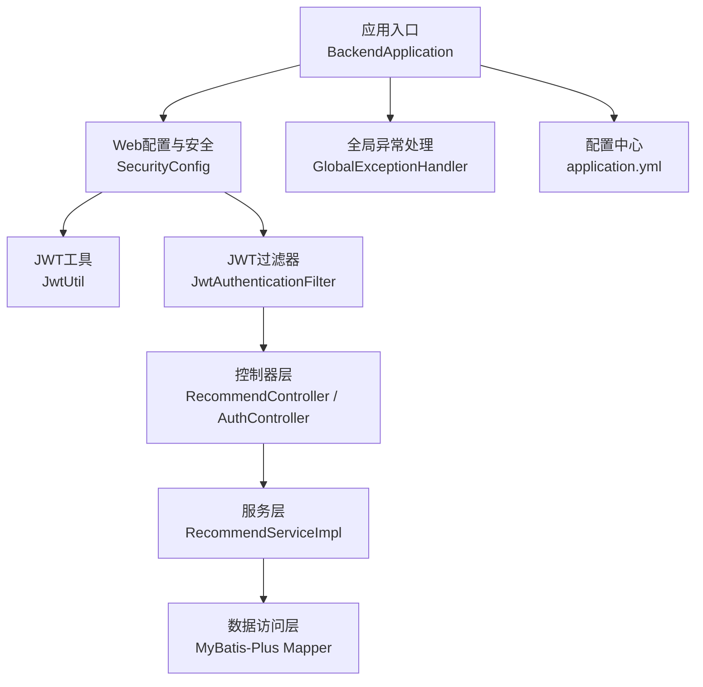
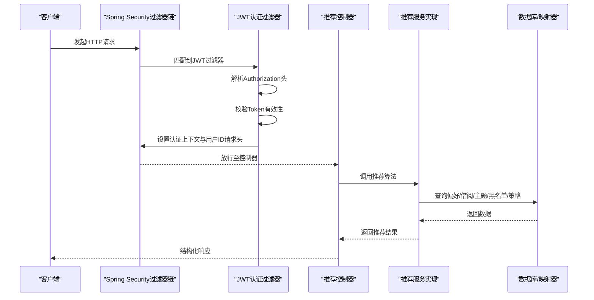
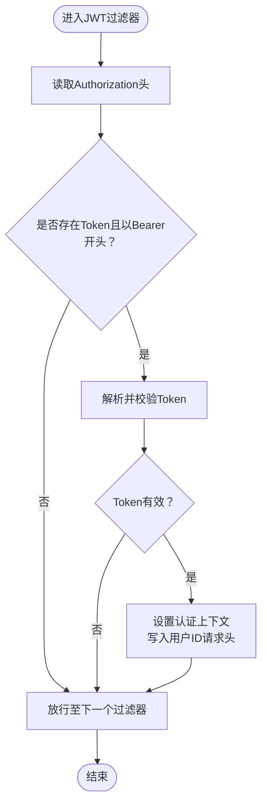
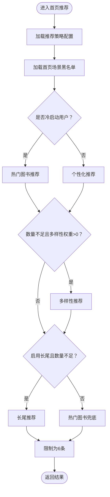
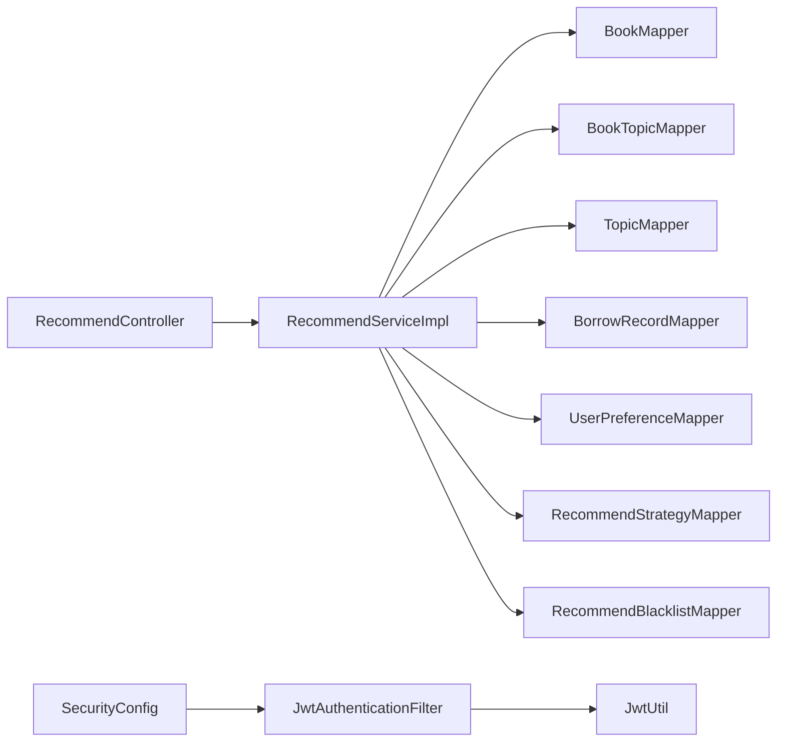

# 调试技巧与工具

<cite>
**本文引用的文件**   
- [BackendApplication.java](file://src/main/java/org/example/backend/BackendApplication.java)
- [SecurityConfig.java](file://src/main/java/org/example/backend/config/SecurityConfig.java)
- [JwtUtil.java](file://src/main/java/org/example/backend/config/JwtUtil.java)
- [JwtAuthenticationFilter.java](file://src/main/java/org/example/backend/modules/auth/filter/JwtAuthenticationFilter.java)
- [Constants.java](file://src/main/java/org/example/backend/common/constants/Constants.java)
- [GlobalExceptionHandler.java](file://src/main/java/org/example/backend/common/exception/GlobalExceptionHandler.java)
- [application.yml](file://src/main/resources/application.yml)
- [RecommendServiceImpl.java](file://src/main/java/org/example/backend/modules/recommend/service/impl/RecommendServiceImpl.java)
- [RecommendController.java](file://src/main/java/org/example/backend/modules/recommend/controller/RecommendController.java)
- [AuthController.java](file://src/main/java/org/example/backend/modules/auth/controller/AuthController.java)
- [BackendApplicationTests.java](file://src/test/java/org/example/backend/BackendApplicationTests.java)
- [pom.xml](file://pom.xml)
</cite>

## 目录
1. [简介](#简介)
2. [项目结构](#项目结构)
3. [核心组件](#核心组件)
4. [架构总览](#架构总览)
5. [详细组件分析](#详细组件分析)
6. [依赖关系分析](#依赖关系分析)
7. [性能考量](#性能考量)
8. [故障排查指南](#故障排查指南)
9. [结论](#结论)
10. [附录](#附录)

## 简介
本指南面向智能图书推荐系统的开发者，聚焦于开发与生产环境下的调试方法与工具使用。内容覆盖：
- 开发环境调试：IDE断点、变量监控、日志级别调整
- Spring Security 与 JWT 调试：认证流程、权限链路、过滤器链分析
- 推荐算法调试：输入输出验证、中间结果检查、性能瓶颈定位
- 远程与生产调试：远程连接、日志分析、热修复思路
- 完整工具使用与问题复现技巧

## 项目结构
后端采用 Spring Boot 标准分层：入口类、配置、控制器、服务、实体与仓库、通用常量与异常处理。推荐模块包含首页推荐、新书、热门、主题、相似、关联、长尾等多条算法链路；安全模块通过自定义 JWT 过滤器接入 Spring Security。

图表来源
- [BackendApplication.java](file://src/main/java/org/example/backend/BackendApplication.java#L1-L14)
- [SecurityConfig.java](file://src/main/java/org/example/backend/config/SecurityConfig.java#L1-L101)
- [JwtUtil.java](file://src/main/java/org/example/backend/config/JwtUtil.java#L1-L92)
- [JwtAuthenticationFilter.java](file://src/main/java/org/example/backend/modules/auth/filter/JwtAuthenticationFilter.java#L1-L70)
- [RecommendController.java](file://src/main/java/org/example/backend/modules/recommend/controller/RecommendController.java#L1-L130)
- [RecommendServiceImpl.java](file://src/main/java/org/example/backend/modules/recommend/service/impl/RecommendServiceImpl.java#L1-L927)
- [GlobalExceptionHandler.java](file://src/main/java/org/example/backend/common/exception/GlobalExceptionHandler.java#L1-L111)
- [application.yml](file://src/main/resources/application.yml#L1-L71)

章节来源
- [BackendApplication.java](file://src/main/java/org/example/backend/BackendApplication.java#L1-L14)
- [application.yml](file://src/main/resources/application.yml#L1-L71)

## 核心组件
- 应用入口与启动：负责应用上下文初始化与运行。
- 安全配置与过滤器链：禁用 CSRF、无状态会话、CORS 放通、在用户名密码过滤器之前加入 JWT 过滤器。
- JWT 工具：生成、解析、校验 Token，并从 Token 中提取用户 ID 与角色。
- JWT 认证过滤器：从请求头解析 Bearer Token，校验有效性，设置认证上下文与用户 ID 请求头。
- 控制器与服务：推荐控制器调用推荐服务；服务内含多条推荐算法分支与黑/白名单、策略配置加载。
- 全局异常处理：统一捕获业务异常、参数校验异常、认证/授权异常与通用异常，输出结构化响应。

章节来源
- [SecurityConfig.java](file://src/main/java/org/example/backend/config/SecurityConfig.java#L1-L101)
- [JwtUtil.java](file://src/main/java/org/example/backend/config/JwtUtil.java#L1-L92)
- [JwtAuthenticationFilter.java](file://src/main/java/org/example/backend/modules/auth/filter/JwtAuthenticationFilter.java#L1-L70)
- [RecommendController.java](file://src/main/java/org/example/backend/modules/recommend/controller/RecommendController.java#L1-L130)
- [RecommendServiceImpl.java](file://src/main/java/org/example/backend/modules/recommend/service/impl/RecommendServiceImpl.java#L1-L927)
- [GlobalExceptionHandler.java](file://src/main/java/org/example/backend/common/exception/GlobalExceptionHandler.java#L1-L111)

## 架构总览
下图展示了请求从客户端到推荐服务的关键流转，以及安全过滤器链对请求的拦截与放行。

图表来源
- [SecurityConfig.java](file://src/main/java/org/example/backend/config/SecurityConfig.java#L46-L81)
- [JwtAuthenticationFilter.java](file://src/main/java/org/example/backend/modules/auth/filter/JwtAuthenticationFilter.java#L28-L56)
- [RecommendController.java](file://src/main/java/org/example/backend/modules/recommend/controller/RecommendController.java#L27-L39)
- [RecommendServiceImpl.java](file://src/main/java/org/example/backend/modules/recommend/service/impl/RecommendServiceImpl.java#L94-L188)

## 详细组件分析

### Spring Security 与 JWT 调试
- 断点设置建议
  - 在 JWT 过滤器的入口处设置断点，观察 Authorization 头是否正确传递、Token 前缀是否匹配、Token 是否为空。
  - 在过滤器内部校验逻辑处设置断点，检查 Token 解析与过期判断。
  - 在控制器入口设置断点，确认认证上下文是否已设置，请求头中是否包含用户 ID。
- 变量监控要点
  - 请求头：Authorization、X-User-Id
  - 认证对象：SecurityContextHolder 中的认证信息
  - 角色与用户 ID：从 Token 提取的角色与用户 ID
- 过滤器链分析
  - 关注 SecurityFilterChain 的顺序：CSRF 关闭、CORS 放通、无状态会话、公开接口放行规则、JWT 过滤器插入位置。
- 常见问题定位
  - 403/401：检查角色权限与公开接口放行规则；确认 Token 是否过期或签名不一致。
  - CORS 失败：核对允许的源、方法、头与凭据配置。
  - 未设置用户上下文：检查过滤器是否被正确装配与执行。

图表来源
- [JwtAuthenticationFilter.java](file://src/main/java/org/example/backend/modules/auth/filter/JwtAuthenticationFilter.java#L28-L67)
- [Constants.java](file://src/main/java/org/example/backend/common/constants/Constants.java#L11-L21)
- [SecurityConfig.java](file://src/main/java/org/example/backend/config/SecurityConfig.java#L46-L81)

章节来源
- [SecurityConfig.java](file://src/main/java/org/example/backend/config/SecurityConfig.java#L1-L101)
- [JwtUtil.java](file://src/main/java/org/example/backend/config/JwtUtil.java#L1-L92)
- [JwtAuthenticationFilter.java](file://src/main/java/org/example/backend/modules/auth/filter/JwtAuthenticationFilter.java#L1-L70)
- [Constants.java](file://src/main/java/org/example/backend/common/constants/Constants.java#L1-L79)

### 推荐算法调试
- 输入输出验证
  - 输入：用户 ID、个性化权重、多样性权重、场景黑名单、策略配置（热推比例、多样性权重、冷启动热推比例、长尾比例、阈值、开关）
  - 输出：推荐结果列表（上限 6），包含图书信息与推荐理由
- 中间结果检查
  - 冷启动判定：兴趣引导完成状态与借阅次数
  - 个性化推荐：用户偏好主题集合、近 N 次借阅历史、相似主题统计
  - 多样性推荐：用户已借阅主题集合、可用主题集合
  - 长尾推荐：借阅次数阈值、平均评分阈值、黑名单合并
  - 黑名单加载：按推荐类型与位置精确匹配
- 性能瓶颈定位
  - 关注 SQL 查询与排序 LIMIT 使用，如热门图书、长尾图书、相似/关联图书的排序与分页
  - 关注集合操作复杂度（去重、计数、排序）与流式处理
  - 关注策略配置加载与默认值回退逻辑
- 调试断点建议
  - 首页推荐主流程入口、冷启动分支、个性化分支、多样性分支、长尾分支、兜底热门分支
  - 策略加载与默认值回退处
  - 黑名单加载与去重逻辑处
  - VO 转换与评分字段转换处

图表来源
- [RecommendServiceImpl.java](file://src/main/java/org/example/backend/modules/recommend/service/impl/RecommendServiceImpl.java#L94-L188)

章节来源
- [RecommendServiceImpl.java](file://src/main/java/org/example/backend/modules/recommend/service/impl/RecommendServiceImpl.java#L1-L927)
- [RecommendController.java](file://src/main/java/org/example/backend/modules/recommend/controller/RecommendController.java#L1-L130)

### 异常与日志调试
- 全局异常处理
  - 业务异常：返回结构化错误码与消息
  - 参数校验异常：聚合字段错误信息
  - 认证/授权异常：统一 401/403 响应
  - 通用异常：记录错误日志并返回服务器错误
- 日志级别
  - application.yml 中已开启后端包与 Spring Security 的调试日志，便于定位认证与授权问题
- 调试建议
  - 在控制器与服务层抛出业务异常时，确保携带明确的错误码与提示
  - 对关键算法分支增加条件日志，记录输入参数与中间结果

章节来源
- [GlobalExceptionHandler.java](file://src/main/java/org/example/backend/common/exception/GlobalExceptionHandler.java#L1-L111)
- [application.yml](file://src/main/resources/application.yml#L63-L71)

## 依赖关系分析
- 组件耦合
  - 控制器依赖服务接口；服务实现依赖多个 Mapper 与策略/黑名单/曝光/点击/反馈等仓储
  - 安全配置装配 JWT 过滤器，过滤器依赖 JWT 工具
- 外部依赖
  - Spring Security、JWT、MyBatis-Plus、Swagger/OpenAPI、MySQL、可选 Redis
- 循环依赖风险
  - 当前结构清晰，无明显循环依赖迹象

图表来源
- [RecommendController.java](file://src/main/java/org/example/backend/modules/recommend/controller/RecommendController.java#L1-L130)
- [RecommendServiceImpl.java](file://src/main/java/org/example/backend/modules/recommend/service/impl/RecommendServiceImpl.java#L1-L927)
- [SecurityConfig.java](file://src/main/java/org/example/backend/config/SecurityConfig.java#L1-L101)
- [JwtAuthenticationFilter.java](file://src/main/java/org/example/backend/modules/auth/filter/JwtAuthenticationFilter.java#L1-L70)
- [JwtUtil.java](file://src/main/java/org/example/backend/config/JwtUtil.java#L1-L92)

章节来源
- [pom.xml](file://pom.xml#L1-L161)

## 性能考量
- 推荐算法
  - SQL 排序与 LIMIT：热门、长尾、相似/关联等查询需关注排序字段与 LIMIT 使用
  - 集合操作：去重、计数、排序与流式处理的复杂度控制
  - 策略加载：异常回退与默认值处理的成本
- 安全与网络
  - CORS 放通与无状态会话减少额外开销
  - JWT 校验在过滤器阶段一次性完成，避免重复计算
- 日志
  - 调试阶段开启 DEBUG 级别，生产环境建议降级为 INFO，避免日志风暴

## 故障排查指南
- 开发环境调试
  - IDE 断点：在控制器入口、服务算法分支、过滤器关键节点设置断点；监控请求头 Authorization、X-User-Id 与认证上下文
  - 日志：利用 application.yml 中的日志配置，观察安全与业务日志
  - 单元测试：使用 SpringBootTest 启动上下文进行集成测试
- Spring Security 与 JWT
  - 401/403：核对公开接口放行规则、角色权限、Token 有效性与过期
  - CORS：核对允许的源、方法、头与凭据
  - 过滤器链：确认 JWT 过滤器插入位置与顺序
- 推荐算法
  - 输入输出：打印用户 ID、权重、场景黑名单、策略配置
  - 中间结果：记录冷启动判定、偏好主题、借阅历史、多样性主题、长尾阈值与黑名单合并
  - 性能：定位慢查询与高复杂度集合操作
- 生产环境调试
  - 远程调试：通过 JVM 参数开启远程调试端口，连接生产实例进行断点调试
  - 日志分析：集中化日志收集，结合错误码与异常堆栈定位问题
  - 热修复：通过配置中心动态调整策略参数（如权重、阈值、开关），降低变更风险

章节来源
- [application.yml](file://src/main/resources/application.yml#L63-L71)
- [BackendApplicationTests.java](file://src/test/java/org/example/backend/BackendApplicationTests.java#L1-L14)

## 结论
本指南提供了从开发到生产的完整调试路径：以断点与日志为核心，结合 Spring Security 与 JWT 的过滤器链分析，配合推荐算法的输入输出与中间结果验证，辅以性能瓶颈定位与生产环境远程调试与热修复思路。建议在开发阶段充分利用 IDE 断点与日志，在测试与生产阶段通过配置中心与日志体系快速定位与修复问题。

## 附录
- 常用调试命令与参数
  - 启动参数：可通过 Maven 插件或 IDE 启动参数传入 JVM 调试参数
  - 远程调试：在生产环境以 JVM 参数开启调试端口，IDE 连接进行断点调试
- 快速复现场景
  - 未登录访问受保护接口：验证 401/403 与异常处理器行为
  - 无效 Token：验证过滤器链中 Token 校验与异常处理
  - 冷启动用户：验证首页推荐冷启动分支与热门图书填充
  - 长尾策略：调整策略配置与阈值，观察长尾推荐结果变化