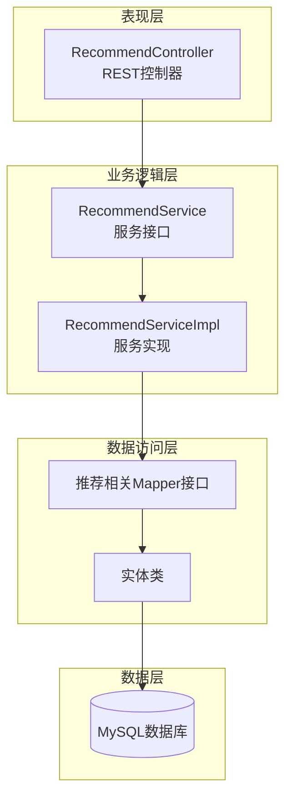
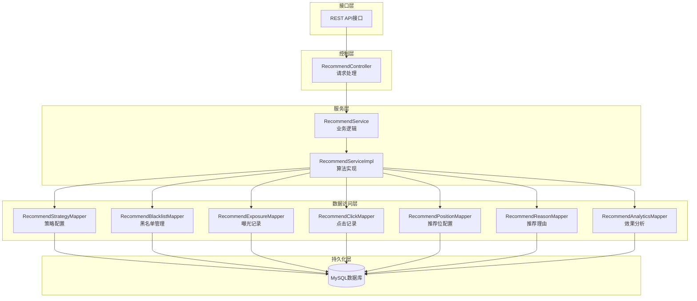
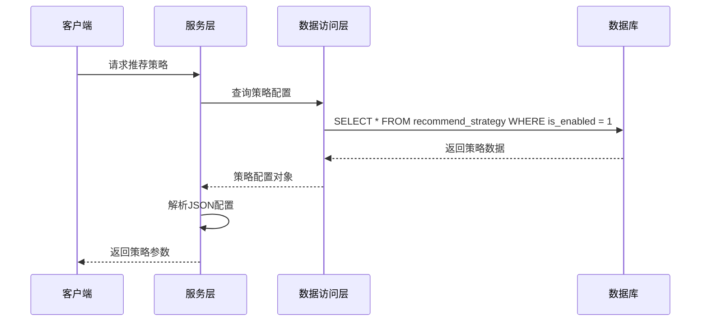
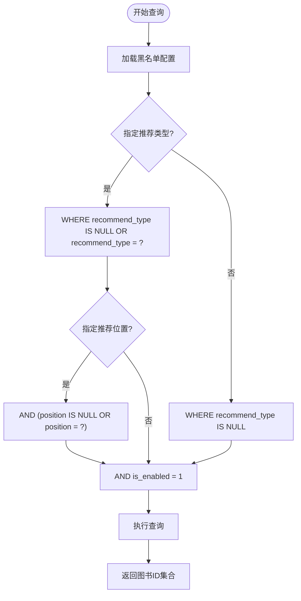
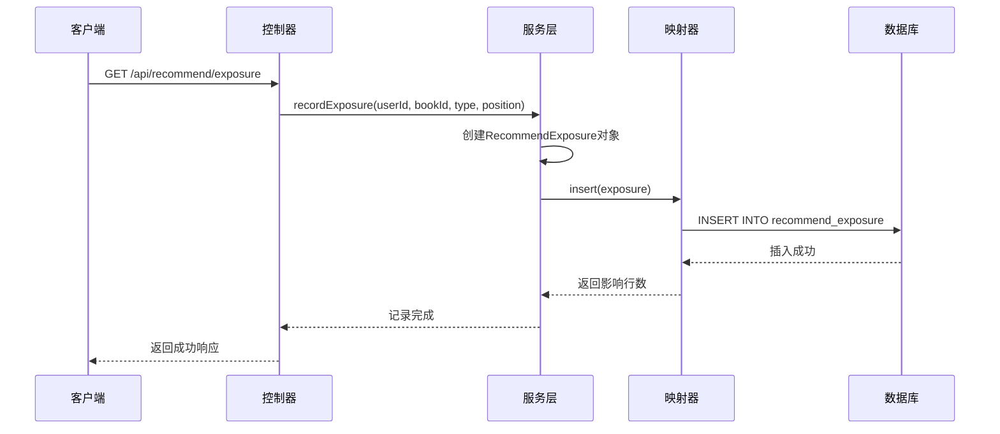
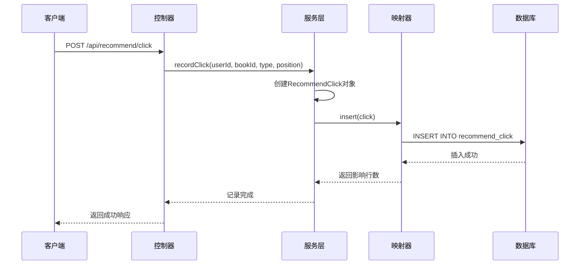
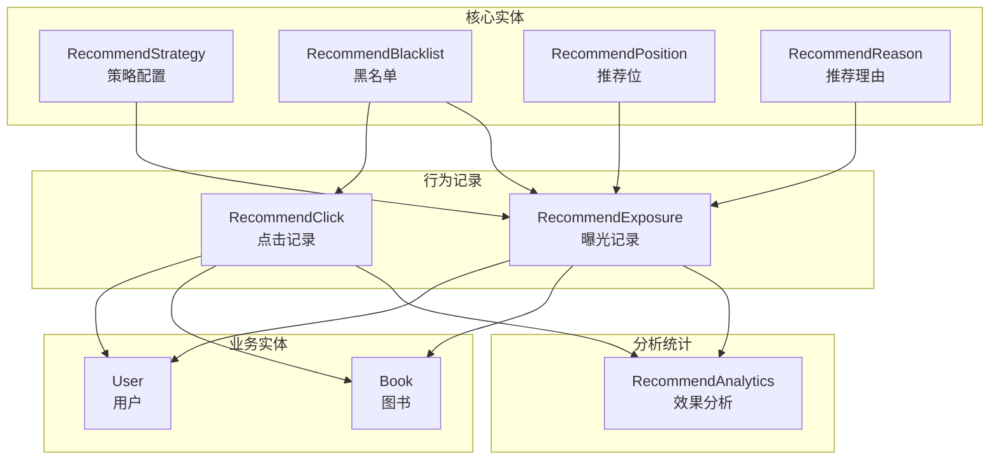
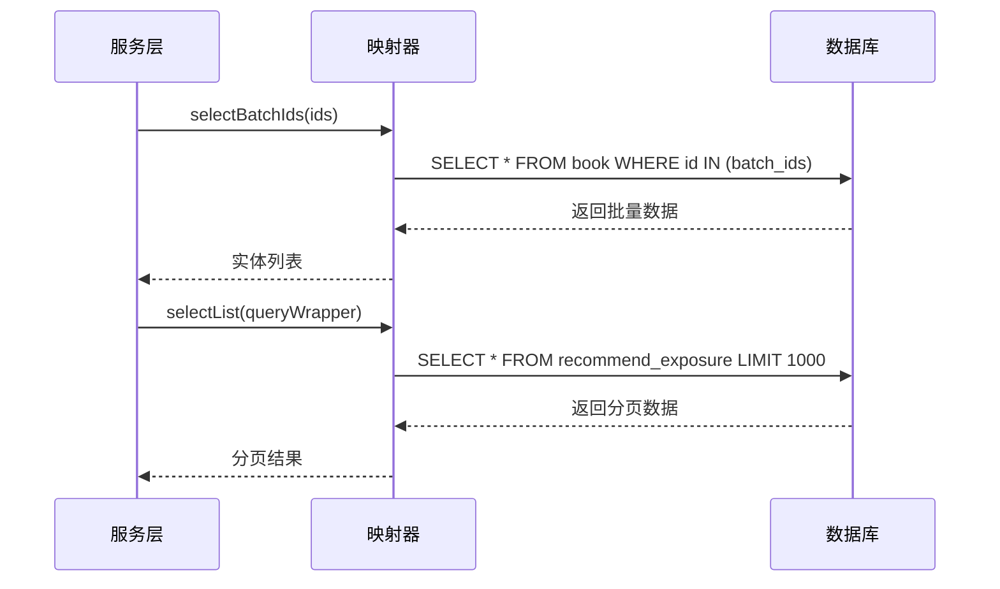
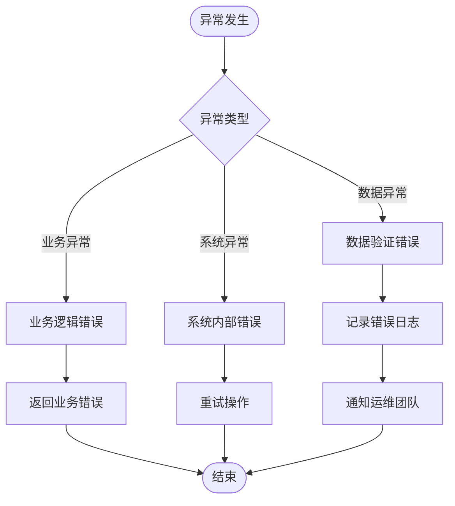

# 推荐系统表设计

<cite>
**本文档引用的文件**
- [RecommendStrategy.java](file://src/main/java/org/example/backend/entity/RecommendStrategy.java)
- [RecommendBlacklist.java](file://src/main/java/org/example/backend/entity/RecommendBlacklist.java)
- [RecommendExposure.java](file://src/main/java/org/example/backend/entity/RecommendExposure.java)
- [RecommendClick.java](file://src/main/java/org/example/backend/entity/RecommendClick.java)
- [RecommendPosition.java](file://src/main/java/org/example/backend/entity/RecommendPosition.java)
- [RecommendReason.java](file://src/main/java/org/example/backend/entity/RecommendReason.java)
- [RecommendAnalytics.java](file://src/main/java/org/example/backend/entity/RecommendAnalytics.java)
- [RecommendStrategyMapper.java](file://src/main/java/org/example/backend/modules/recommend/repository/RecommendStrategyMapper.java)
- [RecommendBlacklistMapper.java](file://src/main/java/org/example/backend/modules/recommend/repository/RecommendBlacklistMapper.java)
- [RecommendExposureMapper.java](file://src/main/java/org/example/backend/modules/recommend/repository/RecommendExposureMapper.java)
- [RecommendClickMapper.java](file://src/main/java/org/example/backend/modules/recommend/repository/RecommendClickMapper.java)
- [RecommendPositionMapper.java](file://src/main/java/org/example/backend/modules/recommend/repository/RecommendPositionMapper.java)
- [RecommendReasonMapper.java](file://src/main/java/org/example/backend/modules/recommend/repository/RecommendReasonMapper.java)
- [RecommendAnalyticsMapper.java](file://src/main/java/org/example/backend/modules/recommend/repository/RecommendAnalyticsMapper.java)
- [RecommendService.java](file://src/main/java/org/example/backend/modules/recommend/service/RecommendService.java)
- [RecommendServiceImpl.java](file://src/main/java/org/example/backend/modules/recommend/service/impl/RecommendServiceImpl.java)
- [RecommendController.java](file://src/main/java/org/example/backend/modules/recommend/controller/RecommendController.java)
</cite>

## 目录
1. [简介](#简介)
2. [项目结构](#项目结构)
3. [核心组件](#核心组件)
4. [架构概览](#架构概览)
5. [详细组件分析](#详细组件分析)
6. [依赖关系分析](#依赖关系分析)
7. [性能考虑](#性能考虑)
8. [故障排除指南](#故障排除指南)
9. [结论](#结论)

## 简介

智能图书推荐系统是一个基于用户行为和图书特征的个性化推荐平台。该系统通过多种推荐算法为用户提供精准的图书推荐，包括首页推荐、相似图书推荐、关联推荐等多种推荐场景。系统采用分层架构设计，包含数据访问层、业务逻辑层和服务接口层。

本设计文档专注于推荐系统的数据库表结构设计，涵盖推荐策略配置、黑名单管理、曝光和点击追踪、推荐位配置以及推荐理由记录等核心功能模块。通过合理的数据结构设计和索引策略，确保推荐系统的高效运行和准确的推荐效果评估。

## 项目结构

推荐系统采用标准的MVC架构模式，主要分为以下几个层次：



**图表来源**
- [RecommendController.java](file://src/main/java/org/example/backend/modules/recommend/controller/RecommendController.java#L1-L130)
- [RecommendService.java](file://src/main/java/org/example/backend/modules/recommend/service/RecommendService.java#L1-L70)
- [RecommendServiceImpl.java](file://src/main/java/org/example/backend/modules/recommend/service/impl/RecommendServiceImpl.java#L1-L927)

**章节来源**
- [RecommendController.java](file://src/main/java/org/example/backend/modules/recommend/controller/RecommendController.java#L1-L130)
- [RecommendService.java](file://src/main/java/org/example/backend/modules/recommend/service/RecommendService.java#L1-L70)
- [RecommendServiceImpl.java](file://src/main/java/org/example/backend/modules/recommend/service/impl/RecommendServiceImpl.java#L1-L927)

## 核心组件

推荐系统的核心数据模型围绕以下关键实体构建：

### 推荐策略配置表
存储推荐算法的动态配置参数，支持运行时调整推荐权重和策略。

### 推荐黑名单表  
管理需要排除在推荐结果外的图书，支持按推荐类型和推荐位置的精细化控制。

### 推荐曝光记录表
追踪用户的推荐曝光行为，为推荐效果分析提供基础数据。

### 推荐点击记录表
记录用户的点击行为，用于计算点击率和评估推荐质量。

### 推荐位配置表
管理推荐位的静态配置，包括位置标识、优先级和时间范围。

### 推荐理由表
存储推荐算法的决策依据和权重信息，支持推荐透明度和可解释性。

**章节来源**
- [RecommendStrategy.java](file://src/main/java/org/example/backend/entity/RecommendStrategy.java#L1-L54)
- [RecommendBlacklist.java](file://src/main/java/org/example/backend/entity/RecommendBlacklist.java#L1-L44)
- [RecommendExposure.java](file://src/main/java/org/example/backend/entity/RecommendExposure.java#L1-L49)
- [RecommendClick.java](file://src/main/java/org/example/backend/entity/RecommendClick.java#L1-L49)
- [RecommendPosition.java](file://src/main/java/org/example/backend/entity/RecommendPosition.java#L1-L69)
- [RecommendReason.java](file://src/main/java/org/example/backend/entity/RecommendReason.java#L1-L59)

## 架构概览

推荐系统的整体架构采用分层设计，确保各层职责清晰、耦合度低：



**图表来源**
- [RecommendController.java](file://src/main/java/org/example/backend/modules/recommend/controller/RecommendController.java#L1-L130)
- [RecommendService.java](file://src/main/java/org/example/backend/modules/recommend/service/RecommendService.java#L1-L70)
- [RecommendServiceImpl.java](file://src/main/java/org/example/backend/modules/recommend/service/impl/RecommendServiceImpl.java#L1-L927)

## 详细组件分析

### 推荐策略配置表设计

推荐策略配置表是整个推荐系统的核心参数管理中心，支持动态调整推荐算法的行为。

```mermaid
erDiagram
RECOMMEND_STRATEGY {
bigint id PK
varchar strategy_key UK
varchar strategy_value
varchar description
tinyint is_enabled
datetime create_time
datetime update_time
}
RECOMMEND_STRATEGY {
+ 主键: id
+ 唯一键: strategy_key
+ 启用状态: 0禁用/1启用
+ 时间戳: create_time/update_time
}
```

**图表来源**
- [RecommendStrategy.java](file://src/main/java/org/example/backend/entity/RecommendStrategy.java#L1-L54)

#### 关键字段设计原理

- **strategy_key**: 唯一标识推荐策略的键名，如"hot_recommend_ratio"、"global_diversity_weight"等
- **strategy_value**: JSON格式存储策略参数，支持灵活的数据结构
- **isEnabled**: 控制策略的启用状态，便于快速开关特定推荐功能
- **时间戳字段**: 支持策略变更的历史追踪和审计

#### 策略加载流程



**图表来源**
- [RecommendServiceImpl.java](file://src/main/java/org/example/backend/modules/recommend/service/impl/RecommendServiceImpl.java#L417-L479)

**章节来源**
- [RecommendStrategy.java](file://src/main/java/org/example/backend/entity/RecommendStrategy.java#L1-L54)
- [RecommendStrategyMapper.java](file://src/main/java/org/example/backend/modules/recommend/repository/RecommendStrategyMapper.java#L1-L14)
- [RecommendServiceImpl.java](file://src/main/java/org/example/backend/modules/recommend/service/impl/RecommendServiceImpl.java#L417-L479)

### 推荐黑名单表设计

推荐黑名单表实现了精细化的图书排除机制，支持按推荐类型和推荐位置的组合过滤。

```mermaid
erDiagram
RECOMMEND_BLACKLIST {
bigint id PK
bigint book_id
varchar recommend_type
varchar position
varchar reason
tinyint is_enabled
datetime create_time
}
RECOMMEND_BLACKLIST {
+ 复合过滤: recommend_type + position
+ 启用状态: 0禁用/1启用
+ 时间戳: create_time
}
```

**图表来源**
- [RecommendBlacklist.java](file://src/main/java/org/example/backend/entity/RecommendBlacklist.java#L1-L44)

#### 黑名单匹配策略

黑名单查询采用灵活的匹配规则，支持全局生效和精确匹配：



**图表来源**
- [RecommendServiceImpl.java](file://src/main/java/org/example/backend/modules/recommend/service/impl/RecommendServiceImpl.java#L724-L750)

**章节来源**
- [RecommendBlacklist.java](file://src/main/java/org/example/backend/entity/RecommendBlacklist.java#L1-L44)
- [RecommendBlacklistMapper.java](file://src/main/java/org/example/backend/modules/recommend/repository/RecommendBlacklistMapper.java#L1-L13)
- [RecommendServiceImpl.java](file://src/main/java/org/example/backend/modules/recommend/service/impl/RecommendServiceImpl.java#L724-L750)

### 推荐曝光记录表设计

曝光记录表追踪用户的推荐展示行为，为推荐效果分析提供基础数据支撑。

```mermaid
erDiagram
RECOMMEND_EXPOSURE {
bigint id PK
bigint user_id
bigint book_id
varchar recommend_type
varchar position
datetime exposure_time
}
RECOMMEND_EXPOSURE {
+ 复合索引: user_id + recommend_type
+ 时间戳: exposure_time
}
```

**图表来源**
- [RecommendExposure.java](file://src/main/java/org/example/backend/entity/RecommendExposure.java#L1-L49)

#### 曝光记录流程



**图表来源**
- [RecommendController.java](file://src/main/java/org/example/backend/modules/recommend/controller/RecommendController.java#L82-L91)
- [RecommendServiceImpl.java](file://src/main/java/org/example/backend/modules/recommend/service/impl/RecommendServiceImpl.java#L658-L680)

**章节来源**
- [RecommendExposure.java](file://src/main/java/org/example/backend/entity/RecommendExposure.java#L1-L49)
- [RecommendExposureMapper.java](file://src/main/java/org/example/backend/modules/recommend/repository/RecommendExposureMapper.java#L1-L14)
- [RecommendController.java](file://src/main/java/org/example/backend/modules/recommend/controller/RecommendController.java#L82-L91)
- [RecommendServiceImpl.java](file://src/main/java/org/example/backend/modules/recommend/service/impl/RecommendServiceImpl.java#L658-L680)

### 推荐点击记录表设计

点击记录表专门记录用户的推荐点击行为，用于计算点击率和评估推荐质量。

```mermaid
erDiagram
RECOMMEND_CLICK {
bigint id PK
bigint user_id
bigint book_id
varchar recommend_type
varchar position
datetime click_time
}
RECOMMEND_CLICK {
+ 复合索引: book_id + click_time
+ 时间戳: click_time
}
```

**图表来源**
- [RecommendClick.java](file://src/main/java/org/example/backend/entity/RecommendClick.java#L1-L49)

#### 点击记录处理流程



**图表来源**
- [RecommendController.java](file://src/main/java/org/example/backend/modules/recommend/controller/RecommendController.java#L93-L102)
- [RecommendServiceImpl.java](file://src/main/java/org/example/backend/modules/recommend/service/impl/RecommendServiceImpl.java#L670-L680)

**章节来源**
- [RecommendClick.java](file://src/main/java/org/example/backend/entity/RecommendClick.java#L1-L49)
- [RecommendClickMapper.java](file://src/main/java/org/example/backend/modules/recommend/repository/RecommendClickMapper.java#L1-L14)
- [RecommendController.java](file://src/main/java/org/example/backend/modules/recommend/controller/RecommendController.java#L93-L102)
- [RecommendServiceImpl.java](file://src/main/java/org/example/backend/modules/recommend/service/impl/RecommendServiceImpl.java#L670-L680)

### 推荐位配置表设计

推荐位配置表管理推荐位的静态配置信息，支持优先级排序和时间范围控制。

```mermaid
erDiagram
RECOMMEND_POSITIONS {
bigint id PK
varchar position_key UK
varchar position_name
bigint book_id
int priority
datetime start_time
datetime end_time
tinyint is_enabled
datetime create_time
datetime update_time
}
RECOMMEND_POSITIONS {
+ 唯一键: position_key
+ 优先级: 数字越大优先级越高
+ 时间范围: start_time/end_time
+ 启用状态: 0禁用/1启用
+ 时间戳: create_time/update_time
}
```

**图表来源**
- [RecommendPosition.java](file://src/main/java/org/example/backend/entity/RecommendPosition.java#L1-L69)

#### 推荐位配置管理

推荐位配置支持手动指定图书和自动优先级排序两种模式：

**章节来源**
- [RecommendPosition.java](file://src/main/java/org/example/backend/entity/RecommendPosition.java#L1-L69)
- [RecommendPositionMapper.java](file://src/main/java/org/example/backend/modules/recommend/repository/RecommendPositionMapper.java#L1-L14)

### 推荐理由表设计

推荐理由表记录推荐算法的决策依据和权重信息，支持推荐透明度和可解释性。

```mermaid
erDiagram
RECOMMEND_REASONS {
bigint id PK
bigint user_id
bigint book_id
varchar recommend_type
varchar reason_type
varchar reason_content
double weight
datetime create_time
}
RECOMMEND_REASONS {
+ 复合索引: user_id + recommend_type
+ 权重: 影响推荐结果排序
+ 时间戳: create_time
}
```

**图表来源**
- [RecommendReason.java](file://src/main/java/org/example/backend/entity/RecommendReason.java#L1-L59)

#### 推荐理由存储结构

推荐理由采用JSON格式存储，支持多种推荐算法的解释信息：

**章节来源**
- [RecommendReason.java](file://src/main/java/org/example/backend/entity/RecommendReason.java#L1-L59)
- [RecommendReasonMapper.java](file://src/main/java/org/example/backend/modules/recommend/repository/RecommendReasonMapper.java#L1-L14)

### 推荐效果分析表设计

推荐效果分析表汇总推荐系统的统计指标，支持A/B测试和效果评估。

```mermaid
erDiagram
RECOMMEND_ANALYTICS {
bigint id PK
varchar recommend_type
date date
bigint exposure_count
bigint click_count
double ctr
double avg_rating
datetime create_time
datetime update_time
}
RECOMMEND_ANALYTICS {
+ 复合唯一键: recommend_type + date
+ 点击率: ctr = click_count / exposure_count
+ 时间戳: create_time/update_time
}
```

**图表来源**
- [RecommendAnalytics.java](file://src/main/java/org/example/backend/entity/RecommendAnalytics.java#L1-L65)

#### 效果分析指标计算

推荐效果分析表提供多维度的推荐质量评估指标：

**章节来源**
- [RecommendAnalytics.java](file://src/main/java/org/example/backend/entity/RecommendAnalytics.java#L1-L65)
- [RecommendAnalyticsMapper.java](file://src/main/java/org/example/backend/modules/recommend/repository/RecommendAnalyticsMapper.java#L1-L14)

## 依赖关系分析

推荐系统的数据模型之间存在复杂的依赖关系，通过外键约束和业务逻辑确保数据一致性：



**图表来源**
- [RecommendServiceImpl.java](file://src/main/java/org/example/backend/modules/recommend/service/impl/RecommendServiceImpl.java#L1-L927)

### 数据一致性保证

系统通过以下机制确保数据一致性：

1. **事务管理**: 曝光和点击记录采用事务处理，确保数据完整性
2. **外键约束**: 通过业务逻辑维护实体间的引用关系
3. **索引优化**: 为常用查询条件建立复合索引
4. **数据验证**: 在业务层进行数据有效性检查

**章节来源**
- [RecommendServiceImpl.java](file://src/main/java/org/example/backend/modules/recommend/service/impl/RecommendServiceImpl.java#L658-L692)

## 性能考虑

### 索引策略

针对推荐系统的查询特点，建议建立以下索引：

```mermaid
flowchart TD
subgraph "查询模式分析"
A[用户行为查询] --> B[user_id + recommend_type]
C[图书相关查询] --> D[book_id + status]
E[时间范围查询] --> F[exposure_time + click_time]
G[组合过滤查询] --> H[recommend_type + position]
end
subgraph "索引设计"
B --> I[复合索引: (user_id, recommend_type)]
D --> J[复合索引: (book_id, status)]
F --> K[复合索引: (exposure_time, click_time)]
H --> L[复合索引: (recommend_type, position)]
end
```

### 缓存策略

推荐系统可以采用多层缓存架构：

1. **策略配置缓存**: 缓存推荐策略配置，减少数据库查询
2. **黑名单缓存**: 缓存黑名单数据，提高过滤效率
3. **热门图书缓存**: 缓存热门图书列表，降低查询压力
4. **用户偏好缓存**: 缓存用户偏好信息，加速个性化推荐

### 分页和批量操作



### 异步处理

对于非关键路径的操作，建议采用异步处理：

- **日志记录**: 曝光和点击事件可以异步写入
- **统计计算**: 推荐效果分析可以定时批量计算
- **数据同步**: 大量数据的导入导出采用异步方式

## 故障排除指南

### 常见问题诊断

#### 推荐结果异常

**症状**: 用户收到不相关的推荐结果

**排查步骤**:
1. 检查推荐策略配置是否正确
2. 验证黑名单设置是否过于严格
3. 确认用户偏好数据是否完整
4. 查看推荐理由表中的权重配置

#### 推荐效果统计异常

**症状**: 点击率和曝光量统计数据不准确

**排查步骤**:
1. 检查曝光和点击记录的时间戳
2. 验证推荐类型和位置的标识一致性
3. 确认统计计算逻辑的正确性
4. 检查数据清理和归档策略

#### 性能问题

**症状**: 推荐接口响应缓慢

**排查步骤**:
1. 分析慢查询日志
2. 检查索引使用情况
3. 优化复杂查询语句
4. 考虑增加缓存层

### 错误处理机制

推荐系统采用统一的错误处理机制：



**章节来源**
- [RecommendServiceImpl.java](file://src/main/java/org/example/backend/modules/recommend/service/impl/RecommendServiceImpl.java#L467-L476)

## 结论

智能图书推荐系统的表设计充分考虑了推荐算法的复杂性和实时性要求。通过合理的数据结构设计、完善的索引策略和严格的事务管理，系统能够提供准确、及时的个性化推荐服务。

关键设计要点包括：

1. **模块化设计**: 各个推荐功能模块相对独立，便于维护和扩展
2. **灵活配置**: 通过策略配置表实现推荐算法的动态调整
3. **全面追踪**: 曝光和点击记录为推荐效果评估提供完整数据
4. **精细控制**: 黑名单机制支持推荐质量的精细化控制
5. **性能优化**: 多层缓存和索引优化确保系统的高并发处理能力

未来可以在以下方面进一步优化：

- 增加更多推荐算法的支持
- 完善实时推荐功能
- 扩展推荐效果分析维度
- 优化大数据量下的查询性能