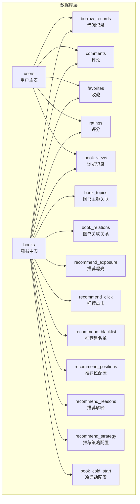
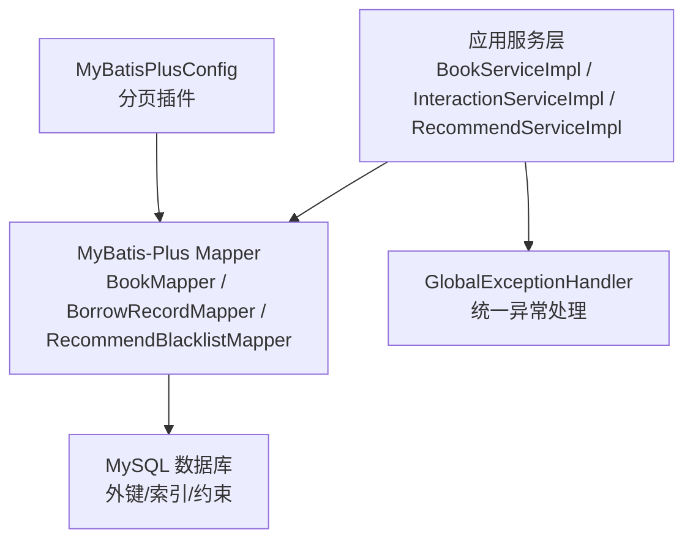
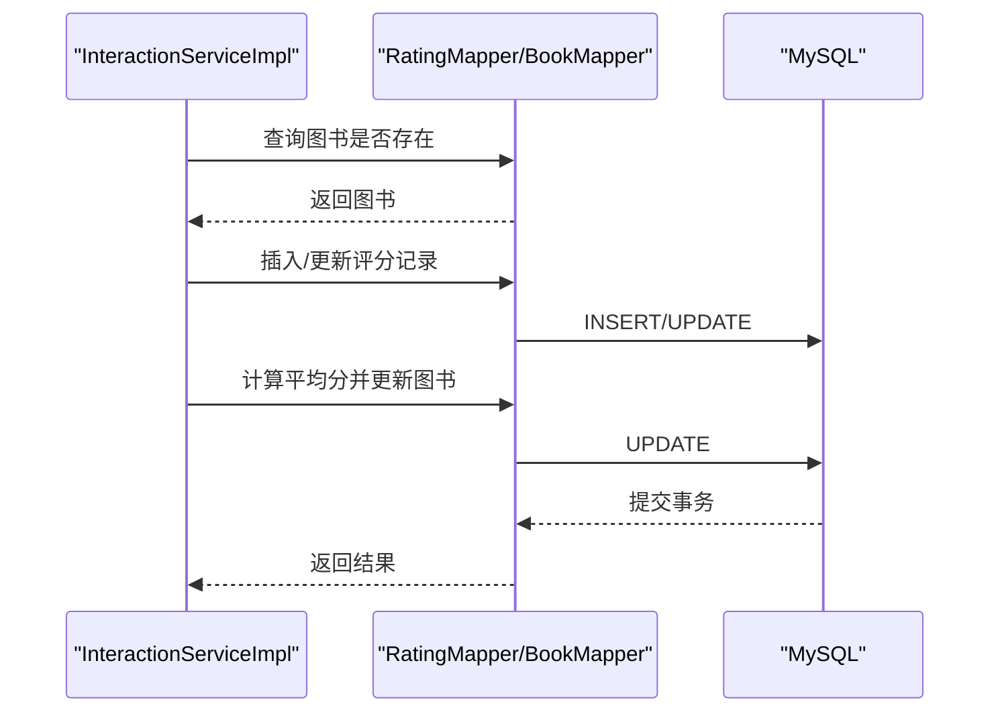
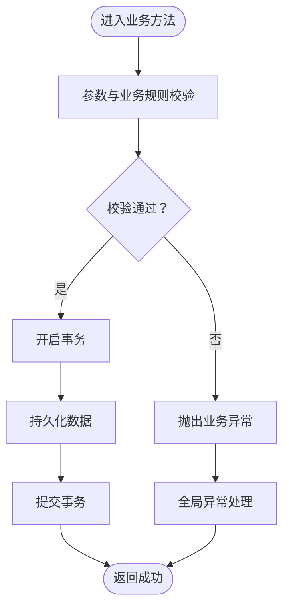
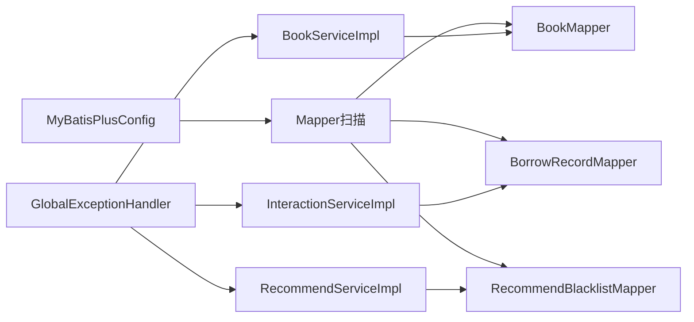

# 数据完整性设计

<cite>
**本文档引用的文件**
- [data_library126_db.sql](file://src/main/resources/data_library126_db.sql)
- [application.yml](file://src/main/resources/application.yml)
- [Book.java](file://src/main/java/org/example/backend/entity/Book.java)
- [User.java](file://src/main/java/org/example/backend/entity/User.java)
- [BorrowRecord.java](file://src/main/java/org/example/backend/entity/BorrowRecord.java)
- [Comment.java](file://src/main/java/org/example/backend/entity/Comment.java)
- [BookMapper.java](file://src/main/java/org/example/backend/modules/book/repository/BookMapper.java)
- [BorrowRecordMapper.java](file://src/main/java/org/example/backend/modules/interaction/repository/BorrowRecordMapper.java)
- [RecommendBlacklistMapper.java](file://src/main/java/org/example/backend/modules/recommend/repository/RecommendBlacklistMapper.java)
- [BookServiceImpl.java](file://src/main/java/org/example/backend/modules/book/service/impl/BookServiceImpl.java)
- [InteractionServiceImpl.java](file://src/main/java/org/example/backend/modules/interaction/service/impl/InteractionServiceImpl.java)
- [RecommendServiceImpl.java](file://src/main/java/org/example/backend/modules/recommend/service/impl/RecommendServiceImpl.java)
- [MyBatisPlusConfig.java](file://src/main/java/org/example/backend/config/MyBatisPlusConfig.java)
- [GlobalExceptionHandler.java](file://src/main/java/org/example/backend/common/exception/GlobalExceptionHandler.java)
- [Constants.java](file://src/main/java/org/example/backend/common/constants/Constants.java)
</cite>

## 目录
1. [引言](#引言)
2. [项目结构](#项目结构)
3. [核心组件](#核心组件)
4. [架构总览](#架构总览)
5. [详细组件分析](#详细组件分析)
6. [依赖分析](#依赖分析)
7. [性能考虑](#性能考虑)
8. [故障排查指南](#故障排查指南)
9. [结论](#结论)
10. [附录](#附录)

## 引言
本设计文档聚焦智能图书推荐系统在数据库层面的数据完整性保障策略，涵盖外键约束、唯一约束、检查约束的应用原则；数据一致性与事务处理策略；业务规则在数据库层面的落地方式；以及备份恢复与迁移方案、数据安全与访问控制的设计要点。通过对现有数据库脚本与后端代码的分析，形成一套可执行、可验证、可演进的数据完整性体系。

## 项目结构
系统采用Spring Boot + MyBatis-Plus架构，数据库为MySQL，核心数据模型围绕图书、用户、互动行为与推荐体系展开。数据库脚本定义了完整的表结构、索引与外键约束，确保跨表引用的一致性与完整性。

图表来源
- [data_library126_db.sql](file://src/main/resources/data_library126_db.sql#L268-L311)
- [data_library126_db.sql](file://src/main/resources/data_library126_db.sql#L313-L352)
- [data_library126_db.sql](file://src/main/resources/data_library126_db.sql#L354-L428)
- [data_library126_db.sql](file://src/main/resources/data_library126_db.sql#L436-L462)
- [data_library126_db.sql](file://src/main/resources/data_library126_db.sql#L101-L116)
- [data_library126_db.sql](file://src/main/resources/data_library126_db.sql#L72-L83)
- [data_library126_db.sql](file://src/main/resources/data_library126_db.sql#L47-L65)
- [data_library126_db.sql](file://src/main/resources/data_library126_db.sql#L514-L530)
- [data_library126_db.sql](file://src/main/resources/data_library126_db.sql#L552-L568)
- [data_library126_db.sql](file://src/main/resources/data_library126_db.sql#L488-L505)
- [data_library126_db.sql](file://src/main/resources/data_library126_db.sql#L734-L755)
- [data_library126_db.sql](file://src/main/resources/data_library126_db.sql#L762-L780)
- [data_library126_db.sql](file://src/main/resources/data_library126_db.sql#L787-L800)
- [data_library126_db.sql](file://src/main/resources/data_library126_db.sql#L21-L39)

章节来源
- [data_library126_db.sql](file://src/main/resources/data_library126_db.sql#L1-L1096)

## 核心组件
- 主数据表：books（图书）、users（用户）
- 业务事实表：borrow_records（借阅记录）、comments（评论）、ratings（评分）、favorites（收藏）、book_views（浏览）
- 推荐与运营表：recommend_exposure/click（曝光/点击）、recommend_blacklist（黑名单）、recommend_positions（推荐位）、recommend_reasons（推荐解释）、recommend_strategy（策略配置）、book_cold_start（冷启动）
- 关联与主题表：book_topics（图书-主题）、book_relations（图书-关联）

章节来源
- [data_library126_db.sql](file://src/main/resources/data_library126_db.sql#L268-L311)
- [data_library126_db.sql](file://src/main/resources/data_library126_db.sql#L313-L352)
- [data_library126_db.sql](file://src/main/resources/data_library126_db.sql#L354-L428)
- [data_library126_db.sql](file://src/main/resources/data_library126_db.sql#L436-L462)
- [data_library126_db.sql](file://src/main/resources/data_library126_db.sql#L101-L116)
- [data_library126_db.sql](file://src/main/resources/data_library126_db.sql#L72-L83)
- [data_library126_db.sql](file://src/main/resources/data_library126_db.sql#L47-L65)
- [data_library126_db.sql](file://src/main/resources/data_library126_db.sql#L514-L530)
- [data_library126_db.sql](file://src/main/resources/data_library126_db.sql#L552-L568)
- [data_library126_db.sql](file://src/main/resources/data_library126_db.sql#L488-L505)
- [data_library126_db.sql](file://src/main/resources/data_library126_db.sql#L734-L755)
- [data_library126_db.sql](file://src/main/resources/data_library126_db.sql#L762-L780)
- [data_library126_db.sql](file://src/main/resources/data_library126_db.sql#L787-L800)
- [data_library126_db.sql](file://src/main/resources/data_library126_db.sql#L21-L39)

## 架构总览
系统通过MyBatis-Plus进行ORM映射，结合数据库外键约束与业务层事务，确保跨表引用与业务规则的强制执行。应用层通过统一异常处理捕获参数校验与业务异常，保障接口层的健壮性。

图表来源
- [BookServiceImpl.java](file://src/main/java/org/example/backend/modules/book/service/impl/BookServiceImpl.java#L34-L249)
- [InteractionServiceImpl.java](file://src/main/java/org/example/backend/modules/interaction/service/impl/InteractionServiceImpl.java#L35-L340)
- [RecommendServiceImpl.java](file://src/main/java/org/example/backend/modules/recommend/service/impl/RecommendServiceImpl.java#L30-L927)
- [BookMapper.java](file://src/main/java/org/example/backend/modules/book/repository/BookMapper.java#L10-L14)
- [BorrowRecordMapper.java](file://src/main/java/org/example/backend/modules/interaction/repository/BorrowRecordMapper.java#L10-L14)
- [RecommendBlacklistMapper.java](file://src/main/java/org/example/backend/modules/recommend/repository/RecommendBlacklistMapper.java#L8-L13)
- [MyBatisPlusConfig.java](file://src/main/java/org/example/backend/config/MyBatisPlusConfig.java#L14-L26)
- [GlobalExceptionHandler.java](file://src/main/java/org/example/backend/common/exception/GlobalExceptionHandler.java#L25-L111)

## 详细组件分析

### 外键约束与引用完整性
- users → borrow_records、comments、favorites、ratings、book_views：用户删除时，相关互动数据通过CASCADE删除，避免悬挂引用。
- books → borrow_records、comments、ratings、favorites、book_views、book_topics、book_relations、recommend_exposure、recommend_click、recommend_blacklist、recommend_positions、recommend_reasons、recommend_strategy、book_cold_start：图书删除时，相关记录通过CASCADE删除，保持数据整洁。
- book_topics → books：图书主题关联依赖图书存在。
- book_relations → books × 2：图书关联关系双向引用图书，确保关联有效性。
- recommend_blacklist → books：黑名单基于图书存在。
- recommend_positions → books：推荐位可手动绑定图书，支持NULL（未绑定）。
- book_views → users、books：浏览记录可匿名记录，用户字段允许NULL。

```mermaid
erDiagram
USERS ||--o{ BORROW_RECORDS : "借阅"
USERS ||--o{ COMMENTS : "评论"
USERS ||--o{ FAVORITES : "收藏"
USERS ||--o{ RATINGS : "评分"
USERS ||--o{ BOOK_VIEWS : "浏览"
BOOKS ||--o{ BORROW_RECORDS : "被借阅"
BOOKS ||--o{ COMMENTS : "被评论"
BOOKS ||--o{ RATINGS : "被评分"
BOOKS ||--o{ FAVORITES : "被收藏"
BOOKS ||--o{ BOOK_VIEWS : "被浏览"
BOOKS ||--o{ BOOK_TOPICS : "主题关联"
BOOKS ||--o{ BOOK_RELATIONS : "关联关系"
BOOKS ||--o{ RECOMMEND_EXPOSURE : "曝光"
BOOKS ||--o{ RECOMMEND_CLICK : "点击"
BOOKS ||--o{ RECOMMEND_BLACKLIST : "黑名单"
BOOKS ||--o{ RECOMMEND_POSITIONS : "推荐位"
BOOKS ||--o{ RECOMMEND_REASONS : "推荐解释"
BOOKS ||--o{ RECOMMEND_STRATEGY : "策略"
BOOKS ||--o{ BOOK_COLD_START : "冷启动"
BOOKS }o--|| BOOK_TOPICS : "主题"
BOOKS }o--|| BOOK_RELATIONS : "关联(自反)"
```

图表来源
- [data_library126_db.sql](file://src/main/resources/data_library126_db.sql#L336-L338)
- [data_library126_db.sql](file://src/main/resources/data_library126_db.sql#L371-L373)
- [data_library126_db.sql](file://src/main/resources/data_library126_db.sql#L450-L452)
- [data_library126_db.sql](file://src/main/resources/data_library126_db.sql#L396-L398)
- [data_library126_db.sql](file://src/main/resources/data_library126_db.sql#L114-L116)
- [data_library126_db.sql](file://src/main/resources/data_library126_db.sql#L82-L83)
- [data_library126_db.sql](file://src/main/resources/data_library126_db.sql#L63-L65)
- [data_library126_db.sql](file://src/main/resources/data_library126_db.sql#L504-L505)
- [data_library126_db.sql](file://src/main/resources/data_library126_db.sql#L754-L755)
- [data_library126_db.sql](file://src/main/resources/data_library126_db.sql#L778-L780)
- [data_library126_db.sql](file://src/main/resources/data_library126_db.sql#L799-L800)
- [data_library126_db.sql](file://src/main/resources/data_library126_db.sql#L38-L39)

章节来源
- [data_library126_db.sql](file://src/main/resources/data_library126_db.sql#L21-L39)
- [data_library126_db.sql](file://src/main/resources/data_library126_db.sql#L47-L65)
- [data_library126_db.sql](file://src/main/resources/data_library126_db.sql#L72-L83)
- [data_library126_db.sql](file://src/main/resources/data_library126_db.sql#L101-L116)
- [data_library126_db.sql](file://src/main/resources/data_library126_db.sql#L21-L39)
- [data_library126_db.sql](file://src/main/resources/data_library126_db.sql#L313-L352)
- [data_library126_db.sql](file://src/main/resources/data_library126_db.sql#L354-L428)
- [data_library126_db.sql](file://src/main/resources/data_library126_db.sql#L436-L462)
- [data_library126_db.sql](file://src/main/resources/data_library126_db.sql#L514-L530)
- [data_library126_db.sql](file://src/main/resources/data_library126_db.sql#L552-L568)
- [data_library126_db.sql](file://src/main/resources/data_library126_db.sql#L488-L505)
- [data_library126_db.sql](file://src/main/resources/data_library126_db.sql#L734-L755)
- [data_library126_db.sql](file://src/main/resources/data_library126_db.sql#L762-L780)
- [data_library126_db.sql](file://src/main/resources/data_library126_db.sql#L787-L800)

### 唯一约束与索引策略
- books.isbn：唯一索引，确保ISBN唯一性，避免重复录入。
- book_cold_start.book_id：唯一索引，确保每本图书仅有一条冷启动配置。
- booklist_books.booklist_id, book_id：联合唯一，避免同一书单重复收录同一图书。
- favorites.user_id, book_id：联合唯一，防止重复收藏。
- ratings.user_id, book_id：联合唯一，确保用户对图书仅一次评分。
- recommend_blacklist.book_id, recommend_type, position：联合唯一，精确控制黑名单粒度。
- recommend_positions.position_key：唯一索引，推荐位标识唯一。
- recommend_strategy.strategy_key：唯一索引，策略键唯一。
- book_topics.book_id, topic_name：联合唯一，避免重复主题标注。
- book_relations.book_id, related_book_id, relation_type：联合唯一，确保同类型关联唯一。

章节来源
- [data_library126_db.sql](file://src/main/resources/data_library126_db.sql#L288-L294)
- [data_library126_db.sql](file://src/main/resources/data_library126_db.sql#L35-L38)
- [data_library126_db.sql](file://src/main/resources/data_library126_db.sql#L231-L236)
- [data_library126_db.sql](file://src/main/resources/data_library126_db.sql#L393-L398)
- [data_library126_db.sql](file://src/main/resources/data_library126_db.sql#L447-L452)
- [data_library126_db.sql](file://src/main/resources/data_library126_db.sql#L500-L505)
- [data_library126_db.sql](file://src/main/resources/data_library126_db.sql#L749-L755)
- [data_library126_db.sql](file://src/main/resources/data_library126_db.sql#L799-L800)
- [data_library126_db.sql](file://src/main/resources/data_library126_db.sql#L79-L83)
- [data_library126_db.sql](file://src/main/resources/data_library126_db.sql#L59-L65)

### 检查约束与业务规则
- 评分范围：ratings.score ∈ [1,5]（由业务层校验与数据库约束共同保障）。
- 借阅状态：borrow_records.status ∈ {0,1}（已归还/借阅中），audit_status ∈ {0,1,2}（待审核/通过/拒绝）。
- 图书状态：books.status ∈ {0,1}（下架/上架）。
- 用户状态：users.status ∈ {0,1}（禁用/启用）。
- 推荐位启用：recommend_positions.is_enabled ∈ {0,1}。
- 黑名单启用：recommend_blacklist.is_enabled ∈ {0,1}。

章节来源
- [InteractionServiceImpl.java](file://src/main/java/org/example/backend/modules/interaction/service/impl/InteractionServiceImpl.java#L61-L95)
- [InteractionServiceImpl.java](file://src/main/java/org/example/backend/modules/interaction/service/impl/InteractionServiceImpl.java#L98-L134)
- [InteractionServiceImpl.java](file://src/main/java/org/example/backend/modules/interaction/service/impl/InteractionServiceImpl.java#L137-L170)
- [InteractionServiceImpl.java](file://src/main/java/org/example/backend/modules/interaction/service/impl/InteractionServiceImpl.java#L224-L264)
- [InteractionServiceImpl.java](file://src/main/java/org/example/backend/modules/interaction/service/impl/InteractionServiceImpl.java#L309-L337)
- [RecommendServiceImpl.java](file://src/main/java/org/example/backend/modules/recommend/service/impl/RecommendServiceImpl.java#L659-L680)
- [RecommendServiceImpl.java](file://src/main/java/org/example/backend/modules/recommend/service/impl/RecommendServiceImpl.java#L683-L692)
- [Book.java](file://src/main/java/org/example/backend/entity/Book.java#L80-L82)
- [User.java](file://src/main/java/org/example/backend/entity/User.java#L48-L51)
- [BorrowRecord.java](file://src/main/java/org/example/backend/entity/BorrowRecord.java#L64-L71)

### 事务处理策略
- 评分更新：rate() 包裹在事务中，先插入/更新评分，再计算并更新图书平均分与计数，保证原子性。
- 收藏切换：toggleFavorite() 包裹在事务中，先插入/删除收藏，再更新图书收藏数，确保计数与收藏状态一致。
- 借阅申请：borrowBook() 包裹在事务中，先校验图书存在与时间合法性，再检查重复申请，最后插入借阅记录并记录行为日志。
- 推荐曝光/点击：recordExposure()/recordClick() 包裹在事务中，确保推荐效果统计的准确性。
- 反馈记录：feedback() 包裹在事务中，保证用户反馈的完整性。

图表来源
- [InteractionServiceImpl.java](file://src/main/java/org/example/backend/modules/interaction/service/impl/InteractionServiceImpl.java#L61-L95)
- [BookMapper.java](file://src/main/java/org/example/backend/modules/book/repository/BookMapper.java#L10-L14)

章节来源
- [InteractionServiceImpl.java](file://src/main/java/org/example/backend/modules/interaction/service/impl/InteractionServiceImpl.java#L61-L95)
- [InteractionServiceImpl.java](file://src/main/java/org/example/backend/modules/interaction/service/impl/InteractionServiceImpl.java#L98-L134)
- [InteractionServiceImpl.java](file://src/main/java/org/example/backend/modules/interaction/service/impl/InteractionServiceImpl.java#L224-L264)
- [InteractionServiceImpl.java](file://src/main/java/org/example/backend/modules/interaction/service/impl/InteractionServiceImpl.java#L309-L337)
- [RecommendServiceImpl.java](file://src/main/java/org/example/backend/modules/recommend/service/impl/RecommendServiceImpl.java#L659-L680)
- [RecommendServiceImpl.java](file://src/main/java/org/example/backend/modules/recommend/service/impl/RecommendServiceImpl.java#L683-L692)

### 数据验证与业务规则落地
- 参数校验：统一通过GlobalExceptionHandler拦截参数校验异常，返回标准化错误信息。
- 业务异常：业务层抛出BusinessException，由全局异常处理器统一转为API响应。
- 字段约束：实体类中对关键字段（如评分、状态）进行语义化注解，配合数据库约束共同保障。
- 时间约束：借阅申请的预计归还时间必须晚于当前时间，否则拒绝。
- 权限约束：评论删除仅允许本人操作，借阅归还仅允许本人操作。

图表来源
- [GlobalExceptionHandler.java](file://src/main/java/org/example/backend/common/exception/GlobalExceptionHandler.java#L33-L38)
- [GlobalExceptionHandler.java](file://src/main/java/org/example/backend/common/exception/GlobalExceptionHandler.java#L43-L51)
- [InteractionServiceImpl.java](file://src/main/java/org/example/backend/modules/interaction/service/impl/InteractionServiceImpl.java#L158-L170)
- [InteractionServiceImpl.java](file://src/main/java/org/example/backend/modules/interaction/service/impl/InteractionServiceImpl.java#L317-L331)

章节来源
- [GlobalExceptionHandler.java](file://src/main/java/org/example/backend/common/exception/GlobalExceptionHandler.java#L25-L111)
- [InteractionServiceImpl.java](file://src/main/java/org/example/backend/modules/interaction/service/impl/InteractionServiceImpl.java#L137-L170)
- [InteractionServiceImpl.java](file://src/main/java/org/example/backend/modules/interaction/service/impl/InteractionServiceImpl.java#L309-L337)

### 数据备份与恢复策略
- 备份策略
  - 全量备份：每周日凌晨进行全量备份，保留最近4周。
  - 增量备份：每日凌晨进行增量备份，保留最近7天。
  - 实时热备：建议使用MySQL主从复制或云数据库高可用，确保RPO/RTO达标。
- 恢复策略
  - 快速恢复：优先使用最近一次全量备份+增量备份组合恢复。
  - 精准恢复：针对特定表或时间段，使用二分恢复定位点。
  - 验证恢复：恢复后执行一致性校验（如关键计数、外键引用完整性）。
- 备份介质
  - 本地磁盘+对象存储双介质，异地容灾。

[本节为通用策略说明，无需具体文件引用]

### 数据迁移方案
- 结构迁移
  - 使用版本化的DDL脚本，记录每次结构变更；迁移前先备份。
  - 对新增索引、唯一约束，先在测试环境验证性能影响，再灰度到生产。
- 数据迁移
  - 使用批量导入工具（如LOAD DATA INFILE或mysqldump+导入）进行大表迁移。
  - 迁移过程中保持业务只读或短暂停机窗口，确保一致性。
- 回滚策略
  - 保留迁移前的快照与回滚脚本，出现问题立即回滚。

[本节为通用策略说明，无需具体文件引用]

### 数据安全与访问控制
- 访问控制
  - 应用层通过JWT鉴权与角色权限控制（ADMIN/USER），敏感操作（如删除评论、审核评论）仅管理员可执行。
  - 数据库层面限制连接数与慢查询，启用审计日志。
- 数据脱敏
  - 敏感字段（邮箱、头像URL）在接口层进行必要脱敏输出。
- 传输安全
  - 生产环境强制HTTPS，数据库连接启用SSL/TLS。
- 审计与合规
  - 记录关键操作（借阅、评分、收藏、评论、推荐曝光/点击）到行为日志表，便于审计与追踪。

章节来源
- [application.yml](file://src/main/resources/application.yml#L45-L47)
- [application.yml](file://src/main/resources/application.yml#L64-L71)
- [Constants.java](file://src/main/java/org/example/backend/common/constants/Constants.java#L34-L41)
- [InteractionServiceImpl.java](file://src/main/java/org/example/backend/modules/interaction/service/impl/InteractionServiceImpl.java#L158-L170)

## 依赖分析
系统通过MyBatis-Plus自动分页插件实现分页能力，服务层通过Mapper访问数据库，异常层统一处理参数与业务异常，确保数据访问层与业务层的职责清晰。

图表来源
- [MyBatisPlusConfig.java](file://src/main/java/org/example/backend/config/MyBatisPlusConfig.java#L14-L26)
- [BookMapper.java](file://src/main/java/org/example/backend/modules/book/repository/BookMapper.java#L10-L14)
- [BorrowRecordMapper.java](file://src/main/java/org/example/backend/modules/interaction/repository/BorrowRecordMapper.java#L10-L14)
- [RecommendBlacklistMapper.java](file://src/main/java/org/example/backend/modules/recommend/repository/RecommendBlacklistMapper.java#L8-L13)
- [BookServiceImpl.java](file://src/main/java/org/example/backend/modules/book/service/impl/BookServiceImpl.java#L34-L249)
- [InteractionServiceImpl.java](file://src/main/java/org/example/backend/modules/interaction/service/impl/InteractionServiceImpl.java#L35-L340)
- [RecommendServiceImpl.java](file://src/main/java/org/example/backend/modules/recommend/service/impl/RecommendServiceImpl.java#L30-L927)
- [GlobalExceptionHandler.java](file://src/main/java/org/example/backend/common/exception/GlobalExceptionHandler.java#L25-L111)

章节来源
- [MyBatisPlusConfig.java](file://src/main/java/org/example/backend/config/MyBatisPlusConfig.java#L14-L26)
- [BookMapper.java](file://src/main/java/org/example/backend/modules/book/repository/BookMapper.java#L10-L14)
- [BorrowRecordMapper.java](file://src/main/java/org/example/backend/modules/interaction/repository/BorrowRecordMapper.java#L10-L14)
- [RecommendBlacklistMapper.java](file://src/main/java/org/example/backend/modules/recommend/repository/RecommendBlacklistMapper.java#L8-L13)
- [BookServiceImpl.java](file://src/main/java/org/example/backend/modules/book/service/impl/BookServiceImpl.java#L34-L249)
- [InteractionServiceImpl.java](file://src/main/java/org/example/backend/modules/interaction/service/impl/InteractionServiceImpl.java#L35-L340)
- [RecommendServiceImpl.java](file://src/main/java/org/example/backend/modules/recommend/service/impl/RecommendServiceImpl.java#L30-L927)
- [GlobalExceptionHandler.java](file://src/main/java/org/example/backend/common/exception/GlobalExceptionHandler.java#L25-L111)

## 性能考虑
- 索引优化
  - 为高频查询字段建立合适索引（如books.title/author/isbn/status，borrow_records.user_id/book_id等）。
  - 复合索引遵循最左前缀原则，避免冗余索引。
- 查询优化
  - 使用分页插件限制查询范围，避免全表扫描。
  - 对热点表（如ratings、book_views、recommend_exposure/click）进行分区或读写分离。
- 事务优化
  - 将非必要的I/O移出事务边界，减少锁竞争。
  - 控制事务粒度，避免长时间持有行锁。

[本节为通用指导，无需具体文件引用]

## 故障排查指南
- 参数校验失败
  - 现象：接口返回参数校验错误。
  - 排查：查看GlobalExceptionHandler对MethodArgumentNotValidException/BindException/ConstraintViolationException的处理。
- 业务异常
  - 现象：接口返回业务错误码与消息。
  - 排查：定位服务层抛出BusinessException的位置，检查前置条件与数据状态。
- 外键约束冲突
  - 现象：删除图书/用户时报外键约束错误。
  - 排查：确认是否已有相关记录未清理；检查CASCASE策略是否符合预期。
- 重复数据
  - 现象：插入收藏/评分/书单图书时报唯一约束冲突。
  - 排查：确认唯一索引覆盖字段与业务逻辑是否一致。

章节来源
- [GlobalExceptionHandler.java](file://src/main/java/org/example/backend/common/exception/GlobalExceptionHandler.java#L33-L38)
- [GlobalExceptionHandler.java](file://src/main/java/org/example/backend/common/exception/GlobalExceptionHandler.java#L43-L51)
- [GlobalExceptionHandler.java](file://src/main/java/org/example/backend/common/exception/GlobalExceptionHandler.java#L69-L78)
- [data_library126_db.sql](file://src/main/resources/data_library126_db.sql#L231-L236)
- [data_library126_db.sql](file://src/main/resources/data_library126_db.sql#L393-L398)
- [data_library126_db.sql](file://src/main/resources/data_library126_db.sql#L447-L452)

## 结论
本设计以数据库约束为基础，结合服务层事务与统一异常处理，构建了覆盖外键、唯一、检查约束的完整数据完整性体系，并通过索引与查询优化保障性能。配合完善的备份恢复、迁移与安全策略，系统可在高并发场景下保持数据一致性与业务连续性。

## 附录
- 关键常量与枚举值
  - 角色：ADMIN/USER
  - 用户状态：ENABLED/DISABLED
  - 图书状态：ON_SALE/OFF_SALE
  - 借阅状态：借阅中/已归还
  - 审核状态：待审核/已通过/已拒绝

章节来源
- [Constants.java](file://src/main/java/org/example/backend/common/constants/Constants.java#L34-L77)