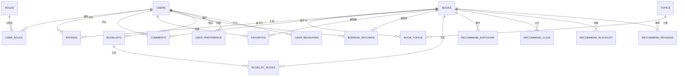
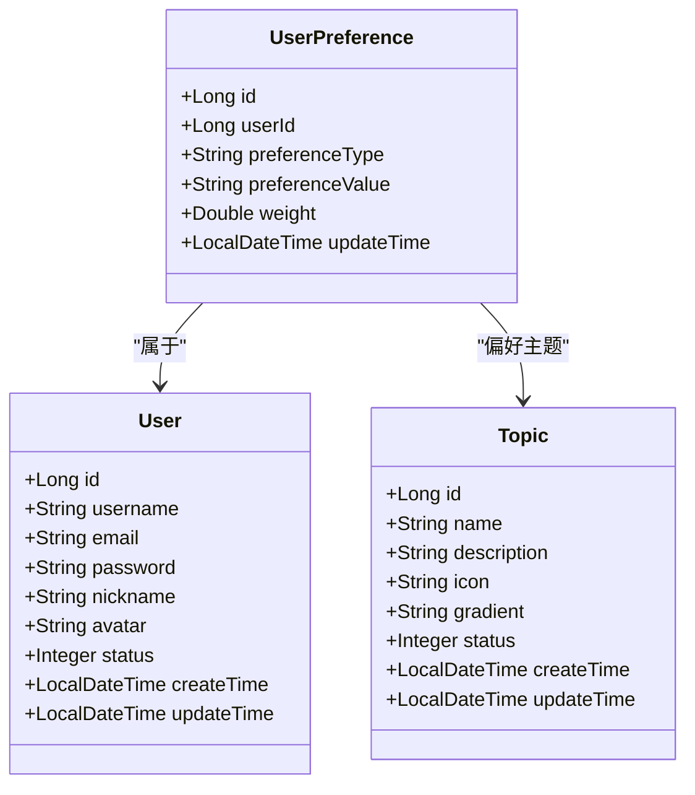
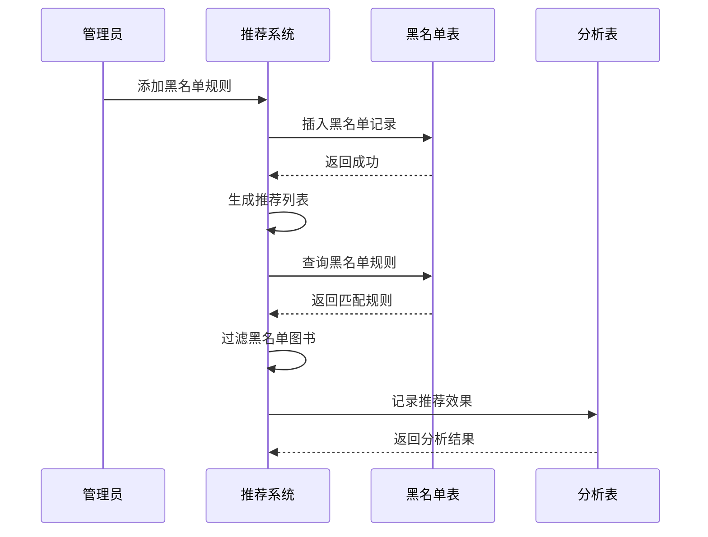
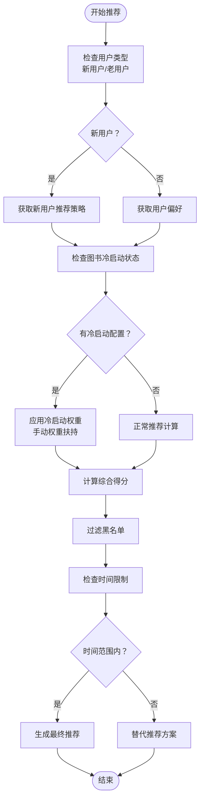

# 数据库总体设计

<cite>
**本文档引用的文件**
- [data_library126_db.sql](file://src/main/resources/data_library126_db.sql)
- [User.java](file://src/main/java/org/example/backend/entity/User.java)
- [Book.java](file://src/main/java/org/example/backend/entity/Book.java)
- [RecommendStrategy.java](file://src/main/java/org/example/backend/entity/RecommendStrategy.java)
- [Role.java](file://src/main/java/org/example/backend/entity/Role.java)
- [SystemConfig.java](file://src/main/java/org/example/backend/entity/SystemConfig.java)
- [UserRole.java](file://src/main/java/org/example/backend/entity/UserRole.java)
- [UserPreference.java](file://src/main/java/org/example/backend/entity/UserPreference.java)
- [Topic.java](file://src/main/java/org/example/backend/entity/Topic.java)
- [BookTopic.java](file://src/main/java/org/example/backend/entity/BookTopic.java)
- [BorrowRecord.java](file://src/main/java/org/example/backend/entity/BorrowRecord.java)
- [Rating.java](file://src/main/java/org/example/backend/entity/Rating.java)
- [Comment.java](file://src/main/java/org/example/backend/entity/Comment.java)
- [Favorite.java](file://src/main/java/org/example/backend/entity/Favorite.java)
- [Booklist.java](file://src/main/java/org/example/backend/entity/Booklist.java)
</cite>

## 目录
1. [引言](#引言)
2. [项目结构](#项目结构)
3. [核心组件](#核心组件)
4. [架构概览](#架构概览)
5. [详细组件分析](#详细组件分析)
6. [依赖分析](#依赖分析)
7. [性能考虑](#性能考虑)
8. [故障排除指南](#故障排除指南)
9. [结论](#结论)

## 引言

智能图书推荐系统是一个基于MySQL数据库的企业级应用，旨在为用户提供个性化的图书推荐服务。该系统采用现代化的数据库设计理念，结合推荐算法和用户行为分析，为不同类型的用户提供精准的图书推荐。

系统的核心目标是通过多维度的数据建模和关系设计，实现高效的图书检索、个性化推荐、用户行为追踪和数据分析功能。数据库设计充分考虑了扩展性、性能优化和数据完整性，为未来的业务发展奠定了坚实的技术基础。

## 项目结构

### 数据库整体架构

```mermaid
graph TB
subgraph "用户管理层"
Users[用户表]
Roles[角色表]
UserRoles[用户角色关联表]
UserPreference[用户偏好表]
UserInterestGuide[用户兴趣引导表]
end
subgraph "图书管理层"
Books[图书表]
BookTopics[图书主题关联表]
Topics[主题表]
BookRelations[图书关联关系表]
BookViews[图书浏览记录表]
end
subgraph "交互管理层"
Ratings[评分表]
Comments[评论表]
Favorites[收藏表]
BorrowRecords[借阅记录表]
Booklist[书单表]
BooklistBooks[书单图书关联表]
end
subgraph "推荐管理层"
RecommendStrategy[推荐策略配置表]
RecommendPositions[推荐位配置表]
RecommendBlacklist[推荐黑名单]
RecommendExposure[推荐曝光记录表]
RecommendClick[推荐点击记录表]
RecommendReasons[推荐解释详情表]
RecommendAnalytics[推荐效果分析表]
UserBehaviors[用户行为日志表]
BookColdStart[图书冷启动配置表]
end
subgraph "系统配置层"
SystemConfig[系统配置表]
end
Users --> UserRoles
Users --> UserPreference
Users --> UserInterestGuide
Users --> Ratings
Users --> Comments
Users --> Favorites
Users --> BorrowRecords
Users --> Booklist
Books --> BookTopics
Books --> BookRelations
Books --> Ratings
Books --> Comments
Books --> Favorites
Books --> BorrowRecords
Books --> BooklistBooks
Books --> BookViews
Books --> RecommendExposure
Books --> RecommendClick
Books --> RecommendReasons
Topics --> BookTopics
Topics --> BookRelations
Roles < --> UserRoles
UserPreference --> Users
UserInterestGuide --> Users
Booklist --> Users
BooklistBooks --> Booklist
BooklistBooks --> Books
```

**图表来源**
- [data_library126_db.sql](file://src/main/resources/data_library126_db.sql#L20-L1096)
- [User.java](file://src/main/java/org/example/backend/entity/User.java#L1-L64)
- [Book.java](file://src/main/java/org/example/backend/entity/Book.java#L1-L95)

### 数据库设计原则

系统采用以下核心设计原则：

1. **规范化设计**：遵循第三范式，消除数据冗余
2. **外键约束**：确保数据完整性和引用一致性
3. **索引优化**：针对高频查询建立复合索引
4. **分层架构**：清晰的业务模块划分
5. **扩展性考虑**：支持未来功能扩展

## 核心组件

### 用户管理模块

用户管理模块是整个系统的基础，负责用户身份认证、权限管理和个性化设置。

#### 用户表设计

| 字段名 | 数据类型 | 约束条件 | 描述 |
|--------|----------|----------|------|
| id | bigint | 主键, 自增 | 用户唯一标识符 |
| username | varchar(50) | 唯一, NOT NULL | 用户名 |
| email | varchar(100) | 唯一, NOT NULL | 邮箱地址 |
| password | varchar(255) | NOT NULL | BCrypt加密密码 |
| nickname | varchar(50) | 可空 | 昵称 |
| avatar | varchar(255) | 可空 | 头像URL |
| status | tinyint | 默认1 | 用户状态(0禁用,1启用) |
| create_time | datetime | 默认当前时间 | 创建时间 |
| update_time | datetime | 默认当前时间 | 更新时间 |

#### 角色权限体系

系统采用RBAC（基于角色的访问控制）模型，通过角色表和用户角色关联表实现灵活的权限管理。

**图表来源**
- [data_library126_db.sql](file://src/main/resources/data_library126_db.sql#L1037-L1096)
- [User.java](file://src/main/java/org/example/backend/entity/User.java#L1-L64)
- [Role.java](file://src/main/java/org/example/backend/entity/Role.java#L1-L32)
- [UserRole.java](file://src/main/java/org/example/backend/entity/UserRole.java#L1-L24)

### 图书管理模块

图书管理模块提供完整的图书信息管理功能，支持多维度的图书分类和关联。

#### 图书表设计

| 字段名 | 数据类型 | 约束条件 | 描述 |
|--------|----------|----------|------|
| id | bigint | 主键, 自增 | 图书唯一标识符 |
| isbn | varchar(50) | 可空 | ISBN编号 |
| title | varchar(255) | NOT NULL | 书名 |
| author | varchar(100) | 可空 | 作者 |
| publisher | varchar(100) | 可空 | 出版社 |
| publish_date | varchar(50) | 可空 | 出版日期 |
| cover_url | varchar(255) | 可空 | 封面URL |
| summary | text | 可空 | 图书摘要 |
| avg_rating | decimal(3,1) | 默认0.0 | 平均评分 |
| rating_count | int | 默认0 | 评分人数 |
| borrow_count | int | 默认0 | 借阅次数 |
| favorite_count | int | 默认0 | 收藏次数 |
| status | tinyint | 默认1 | 图书状态(0下架,1上架) |
| create_time | datetime | 默认当前时间 | 创建时间 |
| update_time | datetime | 默认当前时间 | 更新时间 |

#### 主题关联机制

系统通过图书主题关联表实现图书与主题的多对多关系，支持复杂的图书分类和标签管理。

**图表来源**
- [data_library126_db.sql](file://src/main/resources/data_library126_db.sql#L268-L311)
- [Book.java](file://src/main/java/org/example/backend/entity/Book.java#L1-L95)
- [BookTopic.java](file://src/main/java/org/example/backend/entity/BookTopic.java#L1-L32)
- [Topic.java](file://src/main/java/org/example/backend/entity/Topic.java#L1-L60)

### 推荐系统模块

推荐系统模块是系统的核心功能，通过多种算法和策略为用户提供个性化的图书推荐。

#### 推荐策略配置

| 字段名 | 数据类型 | 约束条件 | 描述 |
|--------|----------|----------|------|
| id | bigint | 主键, 自增 | 策略唯一标识符 |
| strategy_key | varchar(100) | 唯一, NOT NULL | 策略键名 |
| strategy_value | varchar(500) | 可空 | 策略配置值(JSON格式) |
| description | varchar(255) | 可空 | 策略描述 |
| is_enabled | tinyint | 默认1 | 是否启用(0禁用,1启用) |
| create_time | datetime | 默认当前时间 | 创建时间 |
| update_time | datetime | 默认当前时间 | 更新时间 |

#### 推荐位配置

系统支持灵活的推荐位配置，可以为不同的页面位置设置特定的推荐规则和优先级。

**图表来源**
- [data_library126_db.sql](file://src/main/resources/data_library126_db.sql#L787-L802)
- [RecommendStrategy.java](file://src/main/java/org/example/backend/entity/RecommendStrategy.java#L1-L54)

### 用户交互模块

用户交互模块记录用户的各类行为，为推荐算法提供丰富的数据支撑。

#### 行为日志设计

系统通过用户行为日志表统一记录用户的浏览、收藏、评分、借阅等行为，支持复杂的行为分析和推荐计算。

**图表来源**
- [data_library126_db.sql](file://src/main/resources/data_library126_db.sql#L916-L933)
- [BorrowRecord.java](file://src/main/java/org/example/backend/entity/BorrowRecord.java#L1-L84)
- [Rating.java](file://src/main/java/org/example/backend/entity/Rating.java#L1-L49)
- [Comment.java](file://src/main/java/org/example/backend/entity/Comment.java#L1-L59)
- [Favorite.java](file://src/main/java/org/example/backend/entity/Favorite.java#L1-L39)

## 架构概览

### 数据库范式应用

系统严格遵循数据库范式设计原则：

1. **第一范式（1NF）**：所有字段都是原子性的，不可再分
2. **第二范式（2NF）**：消除部分函数依赖，主键完全决定非主属性
3. **第三范式（3NF）**：消除传递函数依赖，非主属性不依赖于其他非主属性

### 外键关系设计

系统建立了完善的外键约束关系，确保数据的一致性和完整性：



**图表来源**
- [data_library126_db.sql](file://src/main/resources/data_library126_db.sql#L20-L1096)

### 索引策略

系统针对高频查询场景建立了全面的索引策略：

1. **主键索引**：所有表的主键自动建立唯一索引
2. **唯一索引**：用户名、邮箱、ISBN等唯一性字段
3. **复合索引**：针对常见查询条件组合建立复合索引
4. **全文索引**：图书标题、作者、摘要的全文搜索支持

## 详细组件分析

### 用户偏好管理系统

用户偏好系统通过用户偏好表记录用户的兴趣主题、作者偏好等个性化信息，为推荐算法提供重要依据。

#### 偏好数据模型



**图表来源**
- [UserPreference.java](file://src/main/java/org/example/backend/entity/UserPreference.java#L1-L49)
- [User.java](file://src/main/java/org/example/backend/entity/User.java#L1-L64)
- [Topic.java](file://src/main/java/org/example/backend/entity/Topic.java#L1-L60)

#### 偏好权重机制

系统采用权重机制来量化用户的偏好程度，权重范围在0-1之间，数值越大表示偏好越强烈。

### 推荐黑名单系统

推荐黑名单系统允许管理员对特定图书进行推荐限制，支持按推荐类型和推荐位置的精细化控制。

#### 黑名单数据流



**图表来源**
- [data_library126_db.sql](file://src/main/resources/data_library126_db.sql#L488-L505)

### 冷启动处理机制

针对新上线图书或新用户，系统提供了冷启动处理机制，通过初始曝光量和手动权重扶持来提升新内容的可见性。

#### 冷启动流程



**图表来源**
- [data_library126_db.sql](file://src/main/resources/data_library126_db.sql#L21-L39)

## 依赖分析

### 组件耦合度分析

系统采用模块化设计，各模块间保持适当的耦合度：

1. **低耦合高内聚**：每个业务模块内部高度内聚，模块间耦合度适中
2. **接口清晰**：通过外键约束定义明确的业务关系
3. **扩展性强**：新增功能不影响现有模块的稳定性

### 数据完整性保障

系统通过多种机制确保数据完整性：

1. **外键约束**：防止孤儿记录的产生
2. **唯一约束**：保证关键字段的唯一性
3. **触发器机制**：自动维护相关统计数据
4. **事务处理**：确保数据操作的原子性

**章节来源**
- [data_library126_db.sql](file://src/main/resources/data_library126_db.sql#L20-L1096)

## 性能考虑

### 查询优化策略

1. **索引优化**：为高频查询字段建立合适的索引
2. **查询计划**：定期分析SQL执行计划，优化慢查询
3. **分页查询**：大数据量场景使用分页机制
4. **缓存策略**：热点数据采用缓存机制

### 存储优化

1. **分区策略**：按时间维度对大表进行分区
2. **压缩存储**：对文本字段采用压缩存储
3. **归档机制**：历史数据定期归档到冷存储

### 扩展性设计

1. **水平扩展**：支持读写分离和分库分表
2. **垂直扩展**：单表字段按使用频率分组
3. **异步处理**：耗时操作采用消息队列异步处理

## 故障排除指南

### 常见问题诊断

1. **连接超时**：检查数据库连接池配置和网络状况
2. **查询缓慢**：分析慢查询日志，优化索引设计
3. **死锁问题**：检查事务边界，避免循环依赖
4. **内存不足**：调整JVM参数和数据库缓冲区大小

### 数据备份策略

1. **定期备份**：制定完整的备份计划
2. **增量备份**：结合全量和增量备份策略
3. **异地备份**：确保数据安全性和可用性
4. **恢复测试**：定期进行数据恢复演练

## 结论

智能图书推荐系统的数据库设计体现了现代企业级应用的最佳实践。通过合理的范式设计、完善的外键约束、优化的索引策略和灵活的扩展机制，系统能够有效支撑复杂的推荐算法和大规模用户访问。

系统的核心优势在于：

1. **数据完整性**：通过严格的约束机制确保数据质量
2. **性能优化**：针对推荐场景进行专门的性能调优
3. **扩展性强**：模块化设计支持业务快速发展
4. **维护友好**：清晰的架构和完善的监控机制

未来可以在以下方面进一步优化：
- 引入更先进的缓存策略
- 实现更精细的权限控制
- 增强数据分析和报表功能
- 优化移动端的数据库访问性能