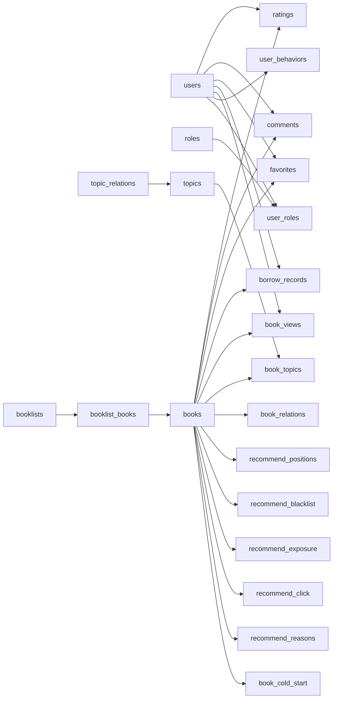

# 数据库设计

<cite>
**本文档引用的文件**
- [data_library126_db.sql](file://src/main/resources/data_library126_db.sql)
- [User.java](file://src/main/java/org/example/backend/entity/User.java)
- [Book.java](file://src/main/java/org/example/backend/entity/Book.java)
- [RecommendStrategy.java](file://src/main/java/org/example/backend/entity/RecommendStrategy.java)
- [UserBehavior.java](file://src/main/java/org/example/backend/entity/UserBehavior.java)
- [RecommendClick.java](file://src/main/java/org/example/backend/entity/RecommendClick.java)
- [RecommendExposure.java](file://src/main/java/org/example/backend/entity/RecommendExposure.java)
- [RecommendBlacklist.java](file://src/main/java/org/example/backend/entity/RecommendBlacklist.java)
- [Rating.java](file://src/main/java/org/example/backend/entity/Rating.java)
- [Comment.java](file://src/main/java/org/example/backend/entity/Comment.java)
- [Favorite.java](file://src/main/java/org/example/backend/entity/Favorite.java)
- [BorrowRecord.java](file://src/main/java/org/example/backend/entity/BorrowRecord.java)
- [Booklist.java](file://src/main/java/org/example/backend/entity/Booklist.java)
- [BooklistBook.java](file://src/main/java/org/example/backend/entity/BooklistBook.java)
- [BookTopic.java](file://src/main/java/org/example/backend/entity/BookTopic.java)
</cite>

## 目录
1. [简介](#简介)
2. [项目结构](#项目结构)
3. [核心组件](#核心组件)
4. [架构总览](#架构总览)
5. [详细组件分析](#详细组件分析)
6. [依赖分析](#依赖分析)
7. [性能考量](#性能考量)
8. [故障排查指南](#故障排查指南)
9. [结论](#结论)
10. [附录](#附录)

## 简介
本数据库设计文档面向智能图书推荐系统，围绕用户、图书、推荐策略、用户行为等核心数据模型，给出整体设计思路、表结构、主外键约束与索引策略，并结合实体类映射关系，提供数据访问模式、缓存策略与性能优化建议，同时涵盖数据迁移路径、版本管理与数据安全要点。

## 项目结构
后端采用分层模块化组织，数据库脚本集中于资源目录，实体类位于 entity 包内，对应各业务域的表结构与索引策略。核心模块包括：
- 用户与权限：users、roles、user_roles
- 图书与主题：books、book_topics、topics、book_relations、topic_relations
- 交互与行为：ratings、comments、favorites、borrow_records、book_views、user_behaviors
- 推荐体系：recommend_strategy、recommend_positions、recommend_blacklist、recommend_exposure、recommend_click、recommend_reasons、recommend_analytics、book_cold_start
- 公共配置：system_config、user_interest_guide、user_preference、booklist、booklist_books

```mermaid
graph TB
subgraph "用户域"
U["users"]
UR["user_roles"]
R["roles"]
end
subgraph "图书域"
B["books"]
BT["book_topics"]
T["topics"]
BR["book_relations"]
TR["topic_relations"]
end
subgraph "交互域"
RA["ratings"]
C["comments"]
F["favorites"]
BRD["borrow_records"]
BV["book_views"]
UB["user_behaviors"]
end
subgraph "推荐域"
RS["recommend_strategy"]
RP["recommend_positions"]
RB["recommend_blacklist"]
RE["recommend_exposure"]
RC["recommend_click"]
RR["recommend_reasons"]
RAN["recommend_analytics"]
BCS["book_cold_start"]
end
subgraph "公共域"
SC["system_config"]
UIG["user_interest_guide"]
UP["user_preference"]
BL["booklists"]
BLB["booklist_books"]
end
UR --> U
UR --> R
BT --> B
BT --> T
BR --> B
TR --> T
RA --> U
RA --> B
C --> U
C --> B
F --> U
F --> B
BRD --> U
BRD --> B
BV --> U
BV --> B
UB --> U
UB --> B
RP --> B
RB --> B
RE --> U
RE --> B
RC --> U
RC --> B
RR --> U
RR --> B
RAN --> RS
BCS --> B
BL --> U
BLB --> BL
BLB --> B
```

图表来源
- [data_library126_db.sql](file://src/main/resources/data_library126_db.sql#L20-L1096)
- [User.java](file://src/main/java/org/example/backend/entity/User.java#L14-L61)
- [Book.java](file://src/main/java/org/example/backend/entity/Book.java#L15-L92)

章节来源
- [data_library126_db.sql](file://src/main/resources/data_library126_db.sql#L20-L1096)
- [User.java](file://src/main/java/org/example/backend/entity/User.java#L14-L61)
- [Book.java](file://src/main/java/org/example/backend/entity/Book.java#L15-L92)

## 核心组件
本节概述关键数据模型及其职责边界：
- 用户表 users：存储用户身份信息、状态与时间戳，支持唯一索引 username、email。
- 图书表 books：存储图书元数据、评分统计与状态，支持全文检索索引 ft_title_author。
- 推荐策略表 recommend_strategy：以键值对形式存储推荐参数，便于动态调整。
- 用户行为表 user_behaviors：统一记录浏览、收藏、评分、借阅等行为，支持 JSON 扩展。
- 推荐曝光/点击表 recommend_exposure/recommend_click：记录推荐位曝光与点击，支撑效果分析。
- 推荐黑名单表 recommend_blacklist：按图书、推荐类型、推荐位维度进行屏蔽控制。
- 评分/评论/收藏/借阅记录：分别承载用户与图书之间的交互证据链。
- 书单与书单图书关联：支持用户自建书单并公开分享。

章节来源
- [data_library126_db.sql](file://src/main/resources/data_library126_db.sql#L268-L311)
- [data_library126_db.sql](file://src/main/resources/data_library126_db.sql#L436-L462)
- [data_library126_db.sql](file://src/main/resources/data_library126_db.sql#L354-L382)
- [data_library126_db.sql](file://src/main/resources/data_library126_db.sql#L384-L411)
- [data_library126_db.sql](file://src/main/resources/data_library126_db.sql#L313-L351)
- [data_library126_db.sql](file://src/main/resources/data_library126_db.sql#L244-L260)
- [data_library126_db.sql](file://src/main/resources/data_library126_db.sql#L222-L236)

## 架构总览
推荐系统数据流由“用户行为采集 → 推荐策略执行 → 结果曝光/点击 → 效果分析”构成。实体类与数据库表一一映射，确保 ORM 层与持久层一致性。

```mermaid
erDiagram
USERS {
bigint id PK
varchar username UK
varchar email UK
varchar password
varchar nickname
varchar avatar
tinyint status
datetime create_time
datetime update_time
}
BOOKS {
bigint id PK
varchar isbn UK
varchar title
varchar author
varchar publisher
varchar publish_date
varchar cover_url
text summary
decimal avg_rating
int rating_count
int borrow_count
int favorite_count
tinyint status
datetime create_time
datetime update_time
}
RATINGS {
bigint id PK
bigint user_id FK
bigint book_id FK
tinyint score
datetime create_time
datetime update_time
}
COMMENTS {
bigint id PK
bigint user_id FK
bigint book_id FK
tinyint rating
text content
tinyint status
datetime create_time
datetime update_time
}
FAVORITES {
bigint id PK
bigint user_id FK
bigint book_id FK
datetime create_time
}
BORROW_RECORDS {
bigint id PK
bigint user_id FK
bigint book_id FK
datetime apply_time
datetime borrow_time
datetime expected_return_time
datetime return_apply_time
datetime return_time
int overdue_days
tinyint status
tinyint audit_status
datetime audit_time
bigint audit_admin_id
}
BOOK_VIEWS {
bigint id PK
bigint user_id FK
bigint book_id FK
datetime view_time
int duration
}
USER_BEHAVIORS {
bigint id PK
bigint user_id FK
varchar behavior_type
bigint book_id FK
json behavior_data
datetime create_time
}
RECOMMEND_STRATEGY {
bigint id PK
varchar strategy_key UK
varchar strategy_value
varchar description
tinyint is_enabled
datetime create_time
datetime update_time
}
RECOMMEND_POSITIONS {
bigint id PK
varchar position_key UK
varchar position_name
bigint book_id FK
int priority
datetime start_time
datetime end_time
tinyint is_enabled
datetime create_time
datetime update_time
}
RECOMMEND_BLACKLIST {
bigint id PK
bigint book_id FK
varchar recommend_type
varchar position
varchar reason
tinyint is_enabled
datetime create_time
}
RECOMMEND_EXPOSURE {
bigint id PK
bigint user_id FK
bigint book_id FK
varchar recommend_type
varchar position
datetime exposure_time
}
RECOMMEND_CLICK {
bigint id PK
bigint user_id FK
bigint book_id FK
varchar recommend_type
varchar position
datetime click_time
}
RECOMMEND_REASONS {
bigint id PK
bigint user_id FK
bigint book_id FK
varchar recommend_type
varchar reason_type
text reason_content
double weight
datetime create_time
}
RECOMMEND_ANALYTICS {
bigint id PK
varchar recommend_type
date date
bigint exposure_count
bigint click_count
double ctr
double avg_rating
datetime create_time
datetime update_time
}
BOOK_COLD_START {
bigint id PK
bigint book_id FK
int initial_exposure
double manual_weight
datetime start_time
datetime end_time
tinyint is_enabled
datetime create_time
datetime update_time
}
BOOK_TOPICS {
bigint id PK
bigint book_id FK
varchar topic_name
}
TOPICS {
bigint id PK
varchar name UK
varchar description
varchar icon
varchar gradient
tinyint status
datetime create_time
datetime update_time
}
BOOK_RELATIONS {
bigint id PK
bigint book_id FK
bigint related_book_id FK
varchar relation_type
double weight
datetime create_time
datetime update_time
}
USER_PREFERENCE {
bigint id PK
bigint user_id FK
varchar preference_type
varchar preference_value
double weight
datetime update_time
}
USER_INTEREST_GUIDE {
bigint id PK
bigint user_id FK
text selected_topics
text selected_authors
tinyint is_completed
datetime create_time
datetime update_time
}
BOOKLISTS {
bigint id PK
bigint user_id FK
varchar name
varchar description
tinyint is_public
int book_count
datetime create_time
datetime update_time
}
BOOKLIST_BOOKS {
bigint id PK
bigint booklist_id FK
bigint book_id FK
datetime add_time
}
ROLES {
bigint id PK
varchar name UK
varchar description
}
USER_ROLES {
bigint user_id FK
bigint role_id FK
}
RATINGS }o--|| BOOKS : "评分"
RATINGS }o--|| USERS : "评分"
COMMENTS }o--|| BOOKS : "评论"
COMMENTS }o--|| USERS : "评论"
FAVORITES }o--|| BOOKS : "收藏"
FAVORITES }o--|| USERS : "收藏"
BORROW_RECORDS }o--|| BOOKS : "借阅"
BORROW_RECORDS }o--|| USERS : "借阅"
BOOK_VIEWS }o--|| BOOKS : "浏览"
BOOK_VIEWS }o--|| USERS : "浏览"
USER_BEHAVIORS }o--|| BOOKS : "行为"
USER_BEHAVIORS }o--|| USERS : "行为"
RECOMMEND_POSITIONS }o--|| BOOKS : "固定推荐"
RECOMMEND_BLACKLIST }o--|| BOOKS : "屏蔽"
RECOMMEND_EXPOSURE }o--|| BOOKS : "曝光"
RECOMMEND_EXPOSURE }o--|| USERS : "曝光"
RECOMMEND_CLICK }o--|| BOOKS : "点击"
RECOMMEND_CLICK }o--|| USERS : "点击"
RECOMMEND_REASONS }o--|| BOOKS : "解释"
RECOMMEND_REASONS }o--|| USERS : "解释"
BOOK_COLD_START }o--|| BOOKS : "冷启动"
BOOK_TOPICS }o--|| BOOKS : "主题"
BOOK_TOPICS }o--|| TOPICS : "主题"
BOOK_RELATIONS }o--|| BOOKS : "关联"
USER_PREFERENCE }o--|| USERS : "偏好"
USER_INTEREST_GUIDE }o--|| USERS : "引导"
BOOKLISTS }o--|| USERS : "书单"
BOOKLIST_BOOKS }o--|| BOOKS : "书单图书"
BOOKLIST_BOOKS }o--|| BOOKLISTS : "书单"
USER_ROLES }o--|| USERS : "角色"
USER_ROLES }o--|| ROLES : "角色"
```

图表来源
- [data_library126_db.sql](file://src/main/resources/data_library126_db.sql#L268-L311)
- [data_library126_db.sql](file://src/main/resources/data_library126_db.sql#L436-L462)
- [data_library126_db.sql](file://src/main/resources/data_library126_db.sql#L354-L382)
- [data_library126_db.sql](file://src/main/resources/data_library126_db.sql#L384-L411)
- [data_library126_db.sql](file://src/main/resources/data_library126_db.sql#L313-L351)
- [data_library126_db.sql](file://src/main/resources/data_library126_db.sql#L103-L116)
- [data_library126_db.sql](file://src/main/resources/data_library126_db.sql#L916-L933)
- [data_library126_db.sql](file://src/main/resources/data_library126_db.sql#L787-L802)
- [data_library126_db.sql](file://src/main/resources/data_library126_db.sql#L734-L755)
- [data_library126_db.sql](file://src/main/resources/data_library126_db.sql#L488-L505)
- [data_library126_db.sql](file://src/main/resources/data_library126_db.sql#L552-L568)
- [data_library126_db.sql](file://src/main/resources/data_library126_db.sql#L514-L530)
- [data_library126_db.sql](file://src/main/resources/data_library126_db.sql#L762-L780)
- [data_library126_db.sql](file://src/main/resources/data_library126_db.sql#L464-L481)
- [data_library126_db.sql](file://src/main/resources/data_library126_db.sql#L21-L39)
- [data_library126_db.sql](file://src/main/resources/data_library126_db.sql#L72-L83)
- [data_library126_db.sql](file://src/main/resources/data_library126_db.sql#L856-L872)
- [data_library126_db.sql](file://src/main/resources/data_library126_db.sql#L991-L1005)
- [data_library126_db.sql](file://src/main/resources/data_library126_db.sql#L966-L981)
- [data_library126_db.sql](file://src/main/resources/data_library126_db.sql#L244-L260)
- [data_library126_db.sql](file://src/main/resources/data_library126_db.sql#L222-L236)
- [data_library126_db.sql](file://src/main/resources/data_library126_db.sql#L815-L824)
- [data_library126_db.sql](file://src/main/resources/data_library126_db.sql#L1017-L1028)

## 详细组件分析

### 用户表 users
- 设计要点
  - 主键自增 id；用户名与邮箱唯一；状态字段用于账户治理。
  - 时间戳字段支持审计与排序。
- 索引策略
  - 唯一索引：username、email
  - 普通索引：status
- 实体映射
  - 字段与注解映射至 Lombok 的 @Data 与 MyBatis-Plus 的 @TableName

章节来源
- [data_library126_db.sql](file://src/main/resources/data_library126_db.sql#L1037-L1056)
- [User.java](file://src/main/java/org/example/backend/entity/User.java#L14-L61)

### 图书表 books
- 设计要点
  - ISBN 唯一；全文索引 ft_title_author 支持模糊检索。
  - 统计字段 avg_rating、rating_count、borrow_count、favorite_count 便于快速展示。
- 索引策略
  - 唯一索引：isbn
  - 普通索引：title、author、status、borrow_count
  - 全文索引：ft_title_author
- 实体映射
  - 字段与注解映射至 Lombok 的 @Data 与 MyBatis-Plus 的 @TableName

章节来源
- [data_library126_db.sql](file://src/main/resources/data_library126_db.sql#L268-L295)
- [Book.java](file://src/main/java/org/example/backend/entity/Book.java#L15-L92)

### 推荐策略表 recommend_strategy
- 设计要点
  - 键值对配置，is_enabled 控制开关；支持 JSON 字符串扩展策略值。
- 索引策略
  - 唯一索引：strategy_key
  - 普通索引：is_enabled

章节来源
- [data_library126_db.sql](file://src/main/resources/data_library126_db.sql#L787-L802)
- [RecommendStrategy.java](file://src/main/java/org/example/backend/entity/RecommendStrategy.java#L14-L51)

### 用户行为表 user_behaviors
- 设计要点
  - 统一日志表，behavior_type 标识行为类型；behavior_data 使用 JSON 存储扩展数据。
- 索引策略
  - 普通索引：user_id、book_id、behavior_type、create_time

章节来源
- [data_library126_db.sql](file://src/main/resources/data_library126_db.sql#L916-L933)
- [UserBehavior.java](file://src/main/java/org/example/backend/entity/UserBehavior.java#L14-L46)

### 推荐曝光/点击表 recommend_exposure/recommend_click
- 设计要点
  - 记录推荐位曝光与点击，支持按推荐类型与位置聚合分析。
- 索引策略
  - 普通索引：user_id、book_id、exposure_time/click_time

章节来源
- [data_library126_db.sql](file://src/main/resources/data_library126_db.sql#L552-L568)
- [data_library126_db.sql](file://src/main/resources/data_library126_db.sql#L514-L530)
- [RecommendExposure.java](file://src/main/java/org/example/backend/entity/RecommendExposure.java#L14-L46)
- [RecommendClick.java](file://src/main/java/org/example/backend/entity/RecommendClick.java#L14-L46)

### 推荐黑名单表 recommend_blacklist
- 设计要点
  - 支持按图书、推荐类型、推荐位组合进行屏蔽；is_enabled 控制生效。
- 索引策略
  - 唯一索引：book_id + recommend_type + position
  - 普通索引：is_enabled、type_pos

章节来源
- [data_library126_db.sql](file://src/main/resources/data_library126_db.sql#L488-L505)
- [RecommendBlacklist.java](file://src/main/java/org/example/backend/entity/RecommendBlacklist.java#L14-L39)

### 评分/评论/收藏/借阅记录
- 设计要点
  - 评分表 ratings：唯一约束 user_id + book_id，保证单用户对单图书仅一次评分。
  - 评论表 comments：含审核状态字段，支持内容治理。
  - 收藏表 favorites：唯一约束 user_id + book_id。
  - 借阅记录 borrow_records：完整生命周期字段，支持逾期与审核流程。
- 索引策略
  - 各表均在 user_id、book_id 上建立普通索引，支撑高频查询。

章节来源
- [data_library126_db.sql](file://src/main/resources/data_library126_db.sql#L436-L462)
- [data_library126_db.sql](file://src/main/resources/data_library126_db.sql#L354-L382)
- [data_library126_db.sql](file://src/main/resources/data_library126_db.sql#L384-L411)
- [data_library126_db.sql](file://src/main/resources/data_library126_db.sql#L313-L351)
- [Rating.java](file://src/main/java/org/example/backend/entity/Rating.java#L14-L46)
- [Comment.java](file://src/main/java/org/example/backend/entity/Comment.java#L14-L56)
- [Favorite.java](file://src/main/java/org/example/backend/entity/Favorite.java#L14-L36)
- [BorrowRecord.java](file://src/main/java/org/example/backend/entity/BorrowRecord.java#L14-L81)

### 书单与书单图书关联
- 设计要点
  - 书单表 booklists：支持公开/私有切换与图书数量统计。
  - 关联表 booklist_books：唯一约束 booklist_id + book_id，保证去重。
- 索引策略
  - 普通索引：user_id、is_public

章节来源
- [data_library126_db.sql](file://src/main/resources/data_library126_db.sql#L244-L260)
- [data_library126_db.sql](file://src/main/resources/data_library126_db.sql#L222-L236)
- [Booklist.java](file://src/main/java/org/example/backend/entity/Booklist.java#L14-L56)
- [BooklistBook.java](file://src/main/java/org/example/backend/entity/BooklistBook.java#L14-L36)

### 图书主题与关联关系
- 设计要点
  - 图书主题关联表 book_topics：多主题多图书关系。
  - 图书关联关系表 book_relations：相似、续作、前传、系列等类型。
  - 主题关联关系表 topic_relations：主题间层级或关联。
- 索引策略
  - 复合唯一索引与单列索引覆盖常见查询维度。

章节来源
- [data_library126_db.sql](file://src/main/resources/data_library126_db.sql#L72-L83)
- [data_library126_db.sql](file://src/main/resources/data_library126_db.sql#L47-L65)
- [data_library126_db.sql](file://src/main/resources/data_library126_db.sql#L856-L872)
- [BookTopic.java](file://src/main/java/org/example/backend/entity/BookTopic.java#L12-L29)

## 依赖分析
- 外键关系
  - 所有明细表均以 user_id、book_id 引用 users、books，确保数据一致性。
  - 推荐位表 recommend_positions 可选引用书籍，支持手动置顶。
  - 角色关联 user_roles 联结 users 与 roles。
- 耦合度与内聚性
  - 行为日志 user_behaviors 提供统一入口，降低各交互表的耦合。
  - 推荐相关表围绕 recommend_strategy 与 positions 解耦配置与执行。
- 循环依赖
  - 当前设计无循环依赖风险。

图表来源
- [data_library126_db.sql](file://src/main/resources/data_library126_db.sql#L1037-L1056)
- [data_library126_db.sql](file://src/main/resources/data_library126_db.sql#L268-L295)
- [data_library126_db.sql](file://src/main/resources/data_library126_db.sql#L436-L462)
- [data_library126_db.sql](file://src/main/resources/data_library126_db.sql#L354-L382)
- [data_library126_db.sql](file://src/main/resources/data_library126_db.sql#L384-L411)
- [data_library126_db.sql](file://src/main/resources/data_library126_db.sql#L313-L351)
- [data_library126_db.sql](file://src/main/resources/data_library126_db.sql#L103-L116)
- [data_library126_db.sql](file://src/main/resources/data_library126_db.sql#L916-L933)
- [data_library126_db.sql](file://src/main/resources/data_library126_db.sql#L734-L755)
- [data_library126_db.sql](file://src/main/resources/data_library126_db.sql#L488-L505)
- [data_library126_db.sql](file://src/main/resources/data_library126_db.sql#L552-L568)
- [data_library126_db.sql](file://src/main/resources/data_library126_db.sql#L514-L530)
- [data_library126_db.sql](file://src/main/resources/data_library126_db.sql#L762-L780)
- [data_library126_db.sql](file://src/main/resources/data_library126_db.sql#L21-L39)
- [data_library126_db.sql](file://src/main/resources/data_library126_db.sql#L72-L83)
- [data_library126_db.sql](file://src/main/resources/data_library126_db.sql#L856-L872)
- [data_library126_db.sql](file://src/main/resources/data_library126_db.sql#L244-L260)
- [data_library126_db.sql](file://src/main/resources/data_library126_db.sql#L222-L236)
- [data_library126_db.sql](file://src/main/resources/data_library126_db.sql#L815-L824)
- [data_library126_db.sql](file://src/main/resources/data_library126_db.sql#L1017-L1028)

## 性能考量
- 查询优化
  - 为高频过滤字段建立索引：users(email/username/status)，books(isbn/title/author/status/borrow_count)，交互表(user_id/book_id)。
  - 全文索引 ft_title_author 用于模糊检索场景。
- 写入优化
  - 推荐曝光/点击表采用时间戳索引，便于按天聚合统计。
  - user_behaviors 作为统一入口，减少重复索引与写放大。
- 缓存策略
  - 系统配置 system_config 中包含 redis.enabled 与 cache.ttl，建议对热点图书详情、用户偏好、推荐位结果进行缓存。
  - 缓存失效策略：基于时间 TTL 与事件驱动（如评分/收藏变更触发失效）。
- 分区与归档
  - 建议对 user_behaviors、recommend_exposure、recommend_click 按 create_time/曝光时间进行分区归档，降低热数据扫描范围。
- 读写分离
  - 读多写少场景（图书详情、推荐列表）可引入只读副本，写操作集中在主库。

## 故障排查指南
- 常见问题定位
  - 重复评分/收藏：检查唯一索引 uk_user_book、uk_user_book 或 uk_booklist_book，避免并发导致的重复插入。
  - 推荐异常：核查 recommend_blacklist 是否误屏蔽、recommend_positions 是否启用、recommend_strategy 参数是否正确。
  - 行为缺失：确认 user_behaviors 行为类型枚举与前端一致，JSON 扩展字段是否正确写入。
- 日志与监控
  - 建议在推荐服务层增加埋点，记录推荐输入特征、候选集规模、最终命中条数与点击率，结合 recommend_analytics 进行 A/B 对比。
- 数据修复
  - 评分/收藏统计不准确：可通过定时任务重新计算 books.avg_rating、rating_count、borrow_count、favorite_count。
  - 黑名单误判：提供后台管理界面，支持按条件批量启停与解除屏蔽。

章节来源
- [data_library126_db.sql](file://src/main/resources/data_library126_db.sql#L446-L451)
- [data_library126_db.sql](file://src/main/resources/data_library126_db.sql#L392-L397)
- [data_library126_db.sql](file://src/main/resources/data_library126_db.sql#L229-L235)
- [data_library126_db.sql](file://src/main/resources/data_library126_db.sql#L488-L505)
- [data_library126_db.sql](file://src/main/resources/data_library126_db.sql#L734-L755)
- [data_library126_db.sql](file://src/main/resources/data_library126_db.sql#L464-L481)

## 结论
该数据库设计以用户与图书为核心，围绕行为日志与推荐体系构建了高内聚、低耦合的数据模型。通过合理的索引策略、外键约束与统一的配置表，既满足当前业务需求，也为后续扩展（如冷启动、长尾、多样性控制）提供了良好基础。配合缓存与分区归档策略，可在高并发场景下保持稳定性能。

## 附录
- 数据迁移路径
  - 版本化：使用 recommend_strategy 中的 model.version 字段标识模型版本，迁移时按版本号执行增量 SQL。
  - 渐进式：先新增表与索引，再迁移数据，最后启用新功能并回滚旧逻辑。
- 版本管理
  - 建议在 CI/CD 中集成数据库迁移脚本，确保迁移幂等与可回滚。
- 数据安全
  - 用户密码采用 BCrypt 加密存储；敏感字段（如邮箱）在接口层脱敏返回。
  - 推荐解释 recommend_reasons 仅记录必要上下文，避免泄露隐私。

章节来源
- [data_library126_db.sql](file://src/main/resources/data_library126_db.sql#L833-L846)
- [data_library126_db.sql](file://src/main/resources/data_library126_db.sql#L1037-L1056)
- [data_library126_db.sql](file://src/main/resources/data_library126_db.sql#L762-L780)