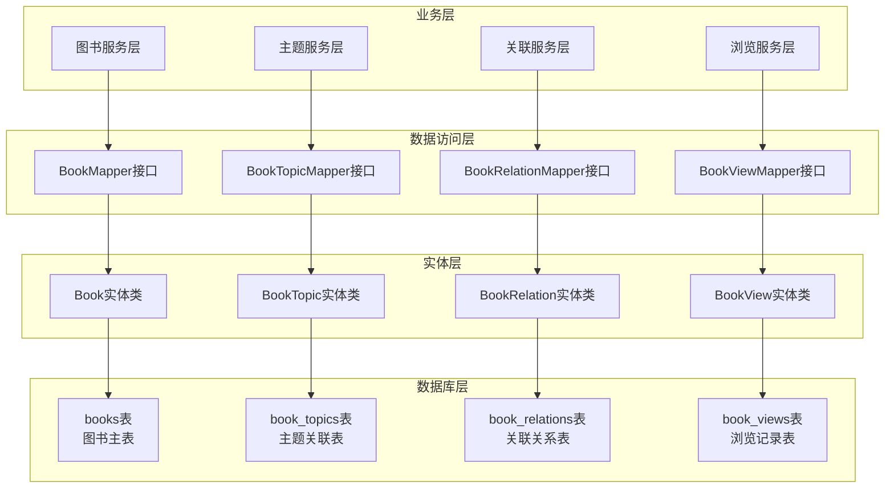
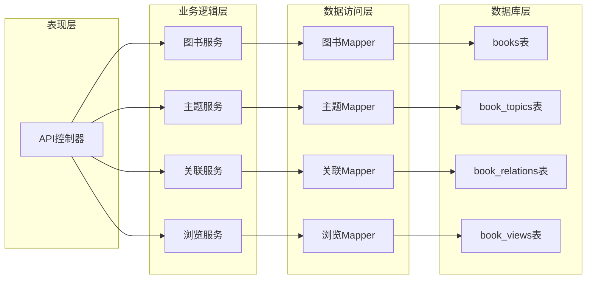
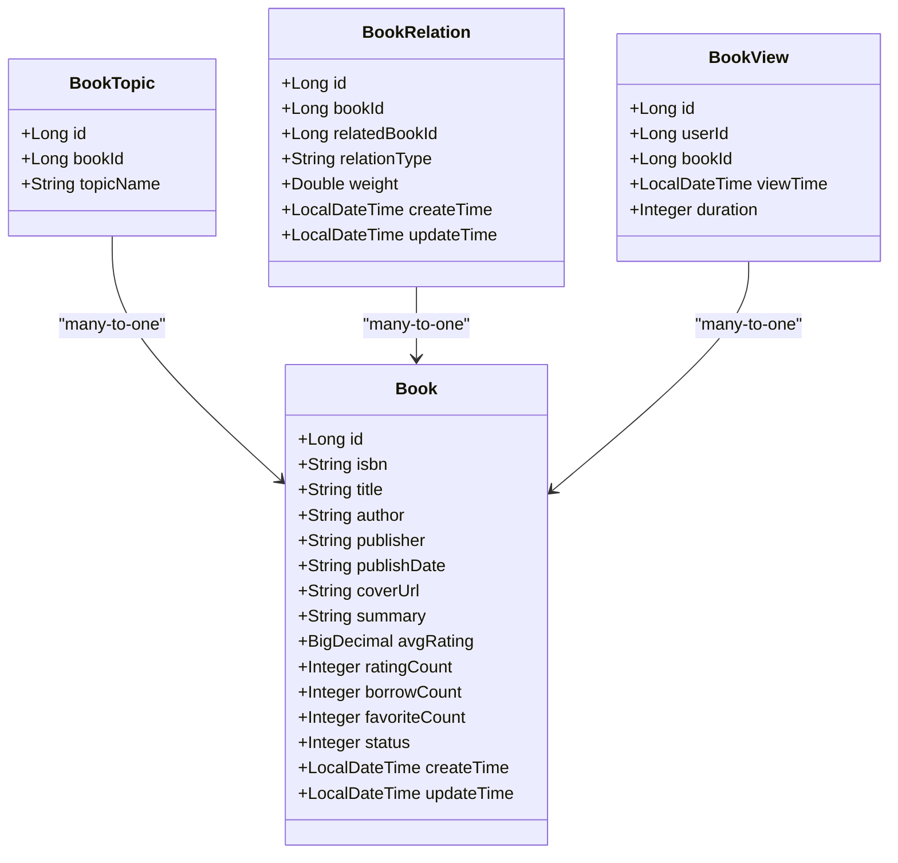
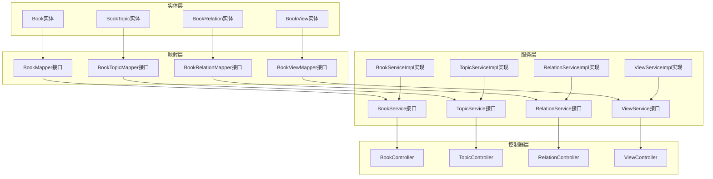

# 图书相关表设计

<cite>
**本文档引用的文件**
- [Book.java](file://src/main/java/org/example/backend/entity/Book.java)
- [BookTopic.java](file://src/main/java/org/example/backend/entity/BookTopic.java)
- [BookRelation.java](file://src/main/java/org/example/backend/entity/BookRelation.java)
- [BookView.java](file://src/main/java/org/example/backend/entity/BookView.java)
- [data_library126_db.sql](file://src/main/resources/data_library126_db.sql)
- [BookMapper.java](file://src/main/java/org/example/backend/modules/book/repository/BookMapper.java)
- [BookTopicMapper.java](file://src/main/java/org/example/backend/modules/book/repository/BookTopicMapper.java)
- [BookRelationMapper.java](file://src/main/java/org/example/backend/modules/book/repository/BookRelationMapper.java)
- [BookViewMapper.java](file://src/main/java/org/example/backend/modules/user/repository/BookViewMapper.java)
</cite>

## 目录
1. [简介](#简介)
2. [项目结构](#项目结构)
3. [核心组件](#核心组件)
4. [架构概览](#架构概览)
5. [详细组件分析](#详细组件分析)
6. [依赖关系分析](#依赖关系分析)
7. [性能考虑](#性能考虑)
8. [故障排除指南](#故障排除指南)
9. [结论](#结论)

## 简介

本文档详细描述了智能图书推荐系统中图书相关表的设计方案。该系统包含四个核心表：图书主表(books)、图书主题关联表(book_topics)、图书关联关系表(book_relations)、图书浏览记录表(book_views)。这些表共同构成了图书信息管理、主题分类、关联推荐和浏览统计的完整数据库实现。

系统采用MySQL数据库，使用MyBatis-Plus框架进行ORM映射，通过实体类与数据库表建立对应关系。每个表都经过精心设计，确保数据完整性、查询效率和扩展性。

## 项目结构

智能图书推荐系统的数据库层采用分层架构设计：

**图表来源**
- [Book.java](file://src/main/java/org/example/backend/entity/Book.java#L14-L93)
- [BookTopic.java](file://src/main/java/org/example/backend/entity/BookTopic.java#L12-L30)
- [BookRelation.java](file://src/main/java/org/example/backend/entity/BookRelation.java#L14-L52)
- [BookView.java](file://src/main/java/org/example/backend/entity/BookView.java#L14-L42)

**章节来源**
- [Book.java](file://src/main/java/org/example/backend/entity/Book.java#L1-L95)
- [BookTopic.java](file://src/main/java/org/example/backend/entity/BookTopic.java#L1-L32)
- [BookRelation.java](file://src/main/java/org/example/backend/entity/BookRelation.java#L1-L54)
- [BookView.java](file://src/main/java/org/example/backend/entity/BookView.java#L1-L44)

## 核心组件

### 图书主表(books)

图书主表是整个图书管理系统的核心，存储图书的基本信息和统计数据。

**表结构设计要点：**
- 主键采用自增ID，确保唯一性和查询效率
- ISBN字段设置唯一索引，保证图书唯一性
- 多个业务相关字段：标题、作者、出版社、出版日期、封面URL、摘要
- 统计字段：平均评分、评分人数、借阅次数、收藏次数
- 状态字段控制图书上下架
- 全文索引支持搜索功能

**章节来源**
- [data_library126_db.sql](file://src/main/resources/data_library126_db.sql#L268-L295)

### 图书主题关联表(book_topics)

主题关联表实现了图书与主题的多对多关系，支持灵活的主题分类。

**表结构设计要点：**
- 轻量级设计，仅包含三个核心字段
- book_id外键关联books表，确保数据一致性
- topic_name作为主题标识，支持模糊匹配
- 单独的索引优化查询性能

**章节来源**
- [data_library126_db.sql](file://src/main/resources/data_library126_db.sql#L72-L83)

### 图书关联关系表(book_relations)

关联关系表构建了图书的知识图谱，支持相似推荐和关联发现。

**表结构设计要点：**
- 支持多种关联类型：similar(相似)、sequel(续集)、prequel(前传)、series(系列)
- 权重字段(0-1)用于推荐算法的排序依据
- 时间戳字段记录创建和更新时间
- 双重外键约束确保关联图书的有效性

**章节来源**
- [data_library126_db.sql](file://src/main/resources/data_library126_db.sql#L47-L65)

### 图书浏览记录表(book_views)

浏览记录表记录用户的图书浏览行为，为个性化推荐提供数据支撑。

**表结构设计要点：**
- 支持登录和未登录用户的浏览记录
- 记录浏览时间和时长，支持行为分析
- 复合索引优化查询性能
- 外键约束确保数据完整性

**章节来源**
- [data_library126_db.sql](file://src/main/resources/data_library126_db.sql#L101-L116)

## 架构概览

系统采用分层架构，各层职责明确：

**图表来源**
- [BookMapper.java](file://src/main/java/org/example/backend/modules/book/repository/BookMapper.java#L10-L12)
- [BookTopicMapper.java](file://src/main/java/org/example/backend/modules/book/repository/BookTopicMapper.java#L10-L12)
- [BookRelationMapper.java](file://src/main/java/org/example/backend/modules/book/repository/BookRelationMapper.java#L10-L12)
- [BookViewMapper.java](file://src/main/java/org/example/backend/modules/user/repository/BookViewMapper.java#L10-L12)

## 详细组件分析

### 图书实体类设计

**图表来源**
- [Book.java](file://src/main/java/org/example/backend/entity/Book.java#L14-L93)
- [BookTopic.java](file://src/main/java/org/example/backend/entity/BookTopic.java#L12-L30)
- [BookRelation.java](file://src/main/java/org/example/backend/entity/BookRelation.java#L14-L52)
- [BookView.java](file://src/main/java/org/example/backend/entity/BookView.java#L14-L42)

### 数据库索引策略

系统采用多层次索引策略确保查询性能：

#### 主表books索引策略
- 主键索引：PRIMARY KEY(id)
- 唯一索引：UNIQUE(isbn) - 确保ISBN唯一性
- 普通索引：
  - idx_title(title) - 支持按标题搜索
  - idx_author(author) - 支持按作者搜索
  - idx_isbn(isbn) - 支持按ISBN查询
  - idx_status(status) - 支持状态过滤
  - idx_borrow_count(borrow_count) - 支持热门图书排序
  - FULLTEXT ft_title_author(summary) - 支持全文搜索

#### 关联表索引策略
- book_topics表：
  - idx_book_id(book_id) - 支持按图书查询主题
  - idx_topic_name(topic_name) - 支持按主题查询图书

- book_relations表：
  - idx_book_id(book_id) - 支持按图书查询关联
  - idx_related_book_id(related_book_id) - 支持按关联图书查询
  - idx_relation_type(relation_type) - 支持按关联类型查询
  - 唯一索引 uk_book_relation(book_id, related_book_id, relation_type) - 防止重复关联

- book_views表：
  - idx_user_id(user_id) - 支持按用户查询浏览记录
  - idx_book_id(book_id) - 支持按图书查询浏览记录
  - idx_view_time(view_time) - 支持按时间范围查询

**章节来源**
- [data_library126_db.sql](file://src/main/resources/data_library126_db.sql#L287-L294)
- [data_library126_db.sql](file://src/main/resources/data_library126_db.sql#L79-L82)
- [data_library126_db.sql](file://src/main/resources/data_library126_db.sql#L58-L62)
- [data_library126_db.sql](file://src/main/resources/data_library126_db.sql#L110-L113)

### 外键约束设计

系统采用严格的外键约束确保数据完整性：

#### 主从关系约束
- book_topics.book_id → books.id (CASCADE ON DELETE)
- book_relations.book_id → books.id (CASCADE ON DELETE)
- book_relations.related_book_id → books.id (CASCADE ON DELETE)
- book_views.user_id → users.id (SET NULL ON DELETE)
- book_views.book_id → books.id (CASCADE ON DELETE)

#### 约束设计原则
- 删除图书时自动删除相关主题和关联关系
- 删除用户时浏览记录保留但用户字段置空
- 防止悬挂引用，确保数据一致性

**章节来源**
- [data_library126_db.sql](file://src/main/resources/data_library126_db.sql#L38-L39)
- [data_library126_db.sql](file://src/main/resources/data_library126_db.sql#L63-L64)
- [data_library126_db.sql](file://src/main/resources/data_library126_db.sql#L114-L115)

## 依赖关系分析

系统各组件之间的依赖关系如下：

**图表来源**
- [Book.java](file://src/main/java/org/example/backend/entity/Book.java#L14-L93)
- [BookTopic.java](file://src/main/java/org/example/backend/entity/BookTopic.java#L12-L30)
- [BookRelation.java](file://src/main/java/org/example/backend/entity/BookRelation.java#L14-L52)
- [BookView.java](file://src/main/java/org/example/backend/entity/BookView.java#L14-L42)

**章节来源**
- [BookMapper.java](file://src/main/java/org/example/backend/modules/book/repository/BookMapper.java#L10-L12)
- [BookTopicMapper.java](file://src/main/java/org/example/backend/modules/book/repository/BookTopicMapper.java#L10-L12)
- [BookRelationMapper.java](file://src/main/java/org/example/backend/modules/book/repository/BookRelationMapper.java#L10-L12)
- [BookViewMapper.java](file://src/main/java/org/example/backend/modules/user/repository/BookViewMapper.java#L10-L12)

## 性能考虑

### 查询性能优化

1. **索引优化策略**
   - 为高频查询字段建立适当索引
   - 使用复合索引优化多条件查询
   - 全文索引支持模糊搜索需求

2. **缓存策略**
   - 热门图书信息缓存
   - 主题分类数据缓存
   - 推荐结果缓存

3. **分页查询**
   - 大数据量场景使用分页查询
   - 合理设置每页大小
   - 使用覆盖索引减少回表

### 存储优化

1. **数据类型选择**
   - 使用合适的数据类型节省存储空间
   - 数值类型根据业务范围选择
   - 字符串类型设置合理长度

2. **压缩策略**
   - 文本字段考虑压缩存储
   - 日志类数据定期清理

## 故障排除指南

### 常见问题及解决方案

1. **索引失效问题**
   - 检查查询条件是否使用了合适的索引
   - 避免在索引列上使用函数或表达式
   - 定期分析查询执行计划

2. **外键约束冲突**
   - 确认删除顺序是否正确
   - 检查是否存在悬挂引用
   - 使用事务确保数据一致性

3. **性能问题诊断**
   - 使用EXPLAIN分析慢查询
   - 监控索引使用情况
   - 调整索引策略

**章节来源**
- [data_library126_db.sql](file://src/main/resources/data_library126_db.sql#L17-L18)

## 结论

智能图书推荐系统的图书相关表设计体现了以下特点：

1. **完整性设计**：通过外键约束确保数据一致性
2. **性能优化**：合理的索引策略支持高效查询
3. **扩展性考虑**：模块化设计便于功能扩展
4. **业务适配**：满足图书管理、主题分类、关联推荐、浏览统计等核心业务需求

该设计方案为智能图书推荐系统提供了坚实的数据基础，能够有效支持个性化推荐、智能搜索和数据分析等功能。通过持续的性能监控和优化，系统能够适应不断增长的业务需求。