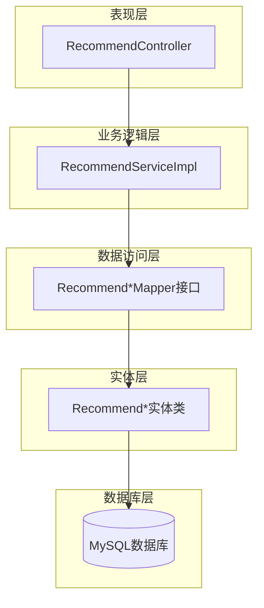
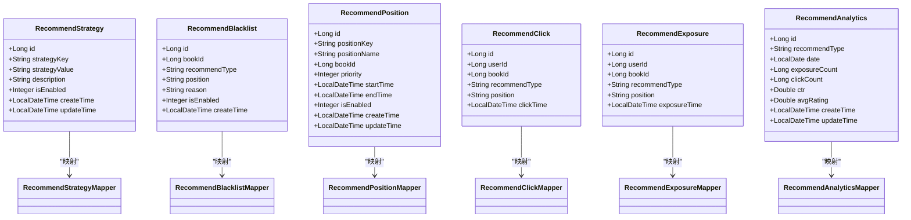
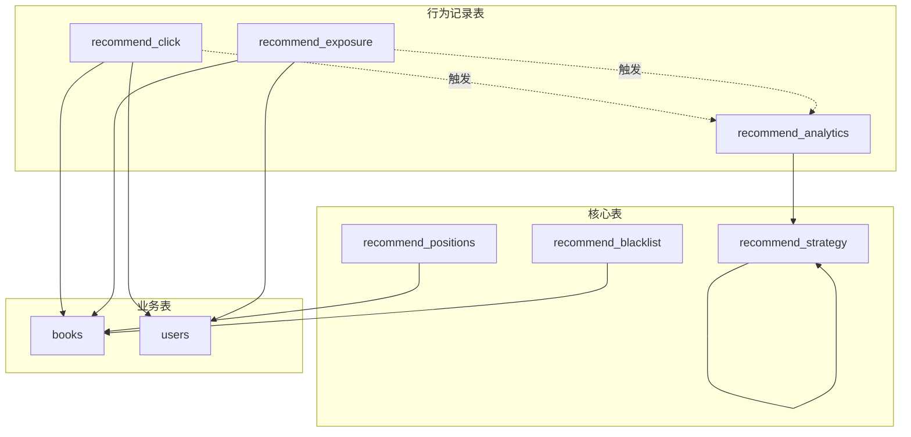
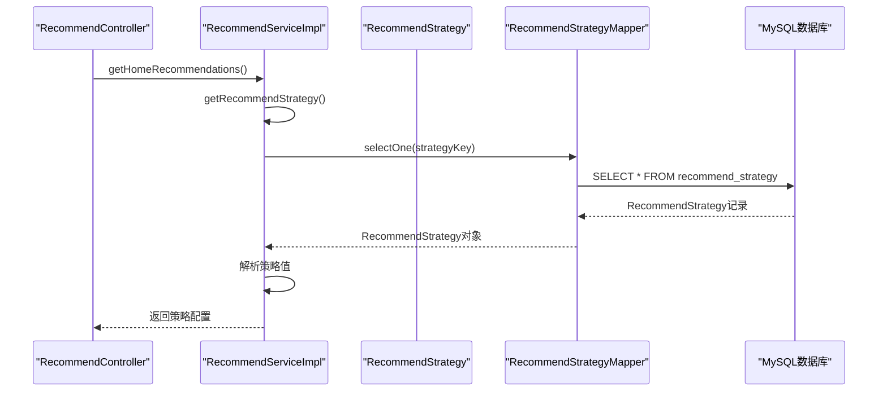
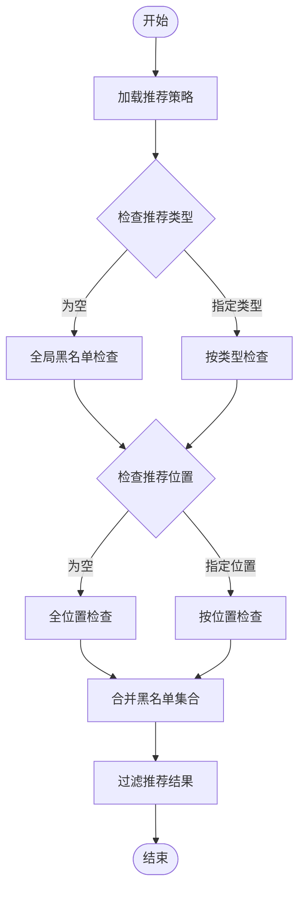

# 推荐系统表设计

<cite>
**本文档引用的文件**
- [RecommendStrategy.java](file://src/main/java/org/example/backend/entity/RecommendStrategy.java)
- [RecommendBlacklist.java](file://src/main/java/org/example/backend/entity/RecommendBlacklist.java)
- [RecommendPosition.java](file://src/main/java/org/example/backend/entity/RecommendPosition.java)
- [RecommendClick.java](file://src/main/java/org/example/backend/entity/RecommendClick.java)
- [RecommendExposure.java](file://src/main/java/org/example/backend/entity/RecommendExposure.java)
- [RecommendAnalytics.java](file://src/main/java/org/example/backend/entity/RecommendAnalytics.java)
- [RecommendStrategyMapper.java](file://src/main/java/org/example/backend/modules/recommend/repository/RecommendStrategyMapper.java)
- [RecommendBlacklistMapper.java](file://src/main/java/org/example/backend/modules/recommend/repository/RecommendBlacklistMapper.java)
- [RecommendPositionMapper.java](file://src/main/java/org/example/backend/modules/recommend/repository/RecommendPositionMapper.java)
- [RecommendClickMapper.java](file://src/main/java/org/example/backend/modules/recommend/repository/RecommendClickMapper.java)
- [RecommendExposureMapper.java](file://src/main/java/org/example/backend/modules/recommend/repository/RecommendExposureMapper.java)
- [RecommendAnalyticsMapper.java](file://src/main/java/org/example/backend/modules/recommend/repository/RecommendAnalyticsMapper.java)
- [data_library126_db.sql](file://src/main/resources/data_library126_db.sql)
- [RecommendController.java](file://src/main/java/org/example/backend/modules/recommend/controller/RecommendController.java)
- [RecommendServiceImpl.java](file://src/main/java/org/example/backend/modules/recommend/service/impl/RecommendServiceImpl.java)
</cite>

## 目录
1. [简介](#简介)
2. [项目结构](#项目结构)
3. [核心组件](#核心组件)
4. [架构概览](#架构概览)
5. [详细组件分析](#详细组件分析)
6. [依赖分析](#依赖分析)
7. [性能考虑](#性能考虑)
8. [故障排除指南](#故障排除指南)
9. [结论](#结论)

## 简介

本文档为智能图书推荐系统的数据库表设计文档，详细描述了推荐系统核心表结构，包括推荐策略表、推荐黑名单表、推荐位配置表、推荐点击记录表、推荐曝光记录表和推荐效果分析表。文档涵盖每个表的字段定义、数据类型选择、约束条件和索引策略，并解释推荐算法配置、黑名单管理、推荐位管理、效果追踪的数据库实现方式。

## 项目结构

推荐系统采用分层架构设计，主要包含以下模块：

**图表来源**
- [RecommendController.java](file://src/main/java/org/example/backend/modules/recommend/controller/RecommendController.java#L1-L130)
- [RecommendServiceImpl.java](file://src/main/java/org/example/backend/modules/recommend/service/impl/RecommendServiceImpl.java#L1-L927)

**章节来源**
- [RecommendController.java](file://src/main/java/org/example/backend/modules/recommend/controller/RecommendController.java#L1-L130)
- [RecommendServiceImpl.java](file://src/main/java/org/example/backend/modules/recommend/service/impl/RecommendServiceImpl.java#L1-L927)

## 核心组件

推荐系统包含六个核心数据表，每个表都有明确的职责分工：

### 推荐策略配置表 (recommend_strategy)
存储推荐算法的配置参数，支持动态调整推荐权重和比例。

### 推荐黑名单表 (recommend_blacklist)
管理需要屏蔽的图书，支持按推荐类型和推荐位置进行精细化控制。

### 推荐位配置表 (recommend_positions)
配置推荐位的显示规则，包括优先级、时间范围和手动推荐图书。

### 推荐点击记录表 (recommend_click)
记录用户的点击行为，用于分析用户偏好和推荐效果。

### 推荐曝光记录表 (recommend_exposure)
记录推荐内容的曝光情况，支持推荐效果追踪。

### 推荐效果分析表 (recommend_analytics)
存储推荐效果的统计数据，支持数据分析和报表生成。

**章节来源**
- [RecommendStrategy.java](file://src/main/java/org/example/backend/entity/RecommendStrategy.java#L1-L54)
- [RecommendBlacklist.java](file://src/main/java/org/example/backend/entity/RecommendBlacklist.java#L1-L44)
- [RecommendPosition.java](file://src/main/java/org/example/backend/entity/RecommendPosition.java#L1-L69)
- [RecommendClick.java](file://src/main/java/org/example/backend/entity/RecommendClick.java#L1-L49)
- [RecommendExposure.java](file://src/main/java/org/example/backend/entity/RecommendExposure.java#L1-L49)
- [RecommendAnalytics.java](file://src/main/java/org/example/backend/entity/RecommendAnalytics.java#L1-L65)

## 架构概览

推荐系统采用MyBatis-Plus框架，通过实体类映射数据库表结构，提供完整的CRUD操作和复杂查询功能。

**图表来源**
- [RecommendStrategy.java](file://src/main/java/org/example/backend/entity/RecommendStrategy.java#L1-L54)
- [RecommendBlacklist.java](file://src/main/java/org/example/backend/entity/RecommendBlacklist.java#L1-L44)
- [RecommendPosition.java](file://src/main/java/org/example/backend/entity/RecommendPosition.java#L1-L69)
- [RecommendClick.java](file://src/main/java/org/example/backend/entity/RecommendClick.java#L1-L49)
- [RecommendExposure.java](file://src/main/java/org/example/backend/entity/RecommendExposure.java#L1-L49)
- [RecommendAnalytics.java](file://src/main/java/org/example/backend/entity/RecommendAnalytics.java#L1-L65)

## 详细组件分析

### 推荐策略配置表 (recommend_strategy)

#### 字段定义
| 字段名 | 数据类型 | 约束条件 | 描述 |
|--------|----------|----------|------|
| id | bigint | PRIMARY KEY, AUTO_INCREMENT | 主键ID |
| strategy_key | varchar(100) | UNIQUE, NOT NULL | 策略键，唯一标识 |
| strategy_value | varchar(500) | NULL | 策略值（JSON格式） |
| description | varchar(255) | NULL | 策略描述 |
| is_enabled | tinyint | DEFAULT 1 | 是否启用：0-禁用，1-启用 |
| create_time | datetime | DEFAULT CURRENT_TIMESTAMP | 创建时间 |
| update_time | datetime | DEFAULT CURRENT_TIMESTAMP ON UPDATE CURRENT_TIMESTAMP | 更新时间 |

#### 索引策略
- 主键索引：PRIMARY KEY (id)
- 唯一索引：UNIQUE INDEX strategy_key (strategy_key)
- 普通索引：INDEX idx_strategy_key (strategy_key)
- 普通索引：INDEX idx_is_enabled (is_enabled)

#### 数据约束
- 唯一性约束：strategy_key 必须唯一
- 默认值：is_enabled 默认为1（启用）
- 时间戳：自动维护创建和更新时间

**章节来源**
- [RecommendStrategy.java](file://src/main/java/org/example/backend/entity/RecommendStrategy.java#L1-L54)
- [data_library126_db.sql](file://src/main/resources/data_library126_db.sql#L787-L802)

### 推荐黑名单表 (recommend_blacklist)

#### 字段定义
| 字段名 | 数据类型 | 约束条件 | 描述 |
|--------|----------|----------|------|
| id | bigint | PRIMARY KEY, AUTO_INCREMENT | 主键ID |
| book_id | bigint | NOT NULL | 图书ID |
| recommend_type | varchar(50) | NULL | 推荐类型（为空表示全局） |
| position | varchar(50) | NULL | 推荐位（为空表示全位置） |
| reason | varchar(255) | NULL | 屏蔽原因 |
| is_enabled | tinyint | DEFAULT 1 | 是否启用：0-禁用，1-启用 |
| create_time | datetime | DEFAULT CURRENT_TIMESTAMP | 创建时间 |

#### 索引策略
- 主键索引：PRIMARY KEY (id)
- 唯一索引：UNIQUE INDEX uk_blacklist (book_id, recommend_type, position)
- 普通索引：INDEX idx_book_id (book_id)
- 普通索引：INDEX idx_enabled (is_enabled)
- 复合索引：INDEX idx_type_pos (recommend_type, position)

#### 关系约束
- 外键约束：book_id → books.id (CASCADE ON UPDATE RESTRICT)

#### 数据约束
- 唯一性约束：组合唯一约束确保同一图书在相同场景下的唯一性
- 默认值：is_enabled 默认为1（启用）

**章节来源**
- [RecommendBlacklist.java](file://src/main/java/org/example/backend/entity/RecommendBlacklist.java#L1-L44)
- [data_library126_db.sql](file://src/main/resources/data_library126_db.sql#L488-L505)

### 推荐位配置表 (recommend_positions)

#### 字段定义
| 字段名 | 数据类型 | 约束条件 | 描述 |
|--------|----------|----------|------|
| id | bigint | PRIMARY KEY, AUTO_INCREMENT | 主键ID |
| position_key | varchar(100) | NOT NULL, UNIQUE | 推荐位标识（home_recommend, new_book等） |
| position_name | varchar(100) | NOT NULL | 推荐位名称 |
| book_id | bigint | NULL | 推荐图书ID（手动配置） |
| priority | int | DEFAULT 0 | 优先级（数字越大优先级越高） |
| start_time | datetime | NULL | 开始时间 |
| end_time | datetime | NULL | 结束时间 |
| is_enabled | tinyint | DEFAULT 1 | 是否启用：0-禁用，1-启用 |
| create_time | datetime | DEFAULT CURRENT_TIMESTAMP | 创建时间 |
| update_time | datetime | DEFAULT CURRENT_TIMESTAMP ON UPDATE CURRENT_TIMESTAMP | 更新时间 |

#### 索引策略
- 主键索引：PRIMARY KEY (id)
- 唯一索引：UNIQUE INDEX position_key (position_key)
- 普通索引：INDEX book_id (book_id)
- 普通索引：INDEX idx_position_key (position_key)
- 普通索引：INDEX idx_is_enabled (is_enabled)
- 普通索引：INDEX idx_priority (priority)

#### 关系约束
- 外键约束：book_id → books.id (SET NULL ON UPDATE RESTRICT)

#### 数据约束
- 唯一性约束：position_key 必须唯一
- 默认值：priority 默认为0，is_enabled 默认为1

**章节来源**
- [RecommendPosition.java](file://src/main/java/org/example/backend/entity/RecommendPosition.java#L1-L69)
- [data_library126_db.sql](file://src/main/resources/data_library126_db.sql#L734-L755)

### 推荐点击记录表 (recommend_click)

#### 字段定义
| 字段名 | 数据类型 | 约束条件 | 描述 |
|--------|----------|----------|------|
| id | bigint | PRIMARY KEY, AUTO_INCREMENT | 主键ID |
| user_id | bigint | NULL | 用户ID |
| book_id | bigint | NOT NULL | 图书ID |
| recommend_type | varchar(50) | NULL | 推荐类型 |
| position | varchar(50) | NULL | 推荐位置 |
| click_time | datetime | DEFAULT CURRENT_TIMESTAMP | 点击时间 |

#### 索引策略
- 主键索引：PRIMARY KEY (id)
- 普通索引：INDEX idx_user_id (user_id)
- 普通索引：INDEX idx_book_id (book_id)
- 普通索引：INDEX idx_click_time (click_time)

#### 关系约束
- 外键约束：user_id → users.id (SET NULL ON UPDATE RESTRICT)
- 外键约束：book_id → books.id (CASCADE ON UPDATE RESTRICT)

#### 数据约束
- 可空性：user_id 可以为NULL（未登录用户）
- 默认值：click_time 默认为当前时间

**章节来源**
- [RecommendClick.java](file://src/main/java/org/example/backend/entity/RecommendClick.java#L1-L49)
- [data_library126_db.sql](file://src/main/resources/data_library126_db.sql#L514-L530)

### 推荐曝光记录表 (recommend_exposure)

#### 字段定义
| 字段名 | 数据类型 | 约束条件 | 描述 |
|--------|----------|----------|------|
| id | bigint | PRIMARY KEY, AUTO_INCREMENT | 主键ID |
| user_id | bigint | NULL | 用户ID |
| book_id | bigint | NOT NULL | 图书ID |
| recommend_type | varchar(50) | NULL | 推荐类型 |
| position | varchar(50) | NULL | 推荐位置 |
| exposure_time | datetime | DEFAULT CURRENT_TIMESTAMP | 曝光时间 |

#### 索引策略
- 主键索引：PRIMARY KEY (id)
- 普通索引：INDEX idx_user_id (user_id)
- 普通索引：INDEX idx_book_id (book_id)
- 普通索引：INDEX idx_exposure_time (exposure_time)

#### 关系约束
- 外键约束：user_id → users.id (SET NULL ON UPDATE RESTRICT)
- 外键约束：book_id → books.id (CASCADE ON UPDATE RESTRICT)

#### 数据约束
- 可空性：user_id 可以为NULL（未登录用户）
- 默认值：exposure_time 默认为当前时间

**章节来源**
- [RecommendExposure.java](file://src/main/java/org/example/backend/entity/RecommendExposure.java#L1-L49)
- [data_library126_db.sql](file://src/main/resources/data_library126_db.sql#L552-L568)

### 推荐效果分析表 (recommend_analytics)

#### 字段定义
| 字段名 | 数据类型 | 约束条件 | 描述 |
|--------|----------|----------|------|
| id | bigint | PRIMARY KEY, AUTO_INCREMENT | 主键ID |
| recommend_type | varchar(50) | NOT NULL | 推荐类型（home, similar, user_also_read等） |
| date | date | NOT NULL | 统计日期 |
| exposure_count | bigint | DEFAULT 0 | 曝光次数 |
| click_count | bigint | DEFAULT 0 | 点击次数 |
| ctr | double | DEFAULT 0 | 点击率 |
| avg_rating | double | DEFAULT 0 | 平均评分 |
| create_time | datetime | DEFAULT CURRENT_TIMESTAMP | 创建时间 |
| update_time | datetime | DEFAULT CURRENT_TIMESTAMP ON UPDATE CURRENT_TIMESTAMP | 更新时间 |

#### 索引策略
- 主键索引：PRIMARY KEY (id)
- 唯一索引：UNIQUE INDEX uk_type_date (recommend_type, date)
- 普通索引：INDEX idx_recommend_type (recommend_type)
- 普通索引：INDEX idx_date (date)

#### 数据约束
- 唯一性约束：组合唯一约束确保每种推荐类型每天的数据唯一性
- 默认值：所有数值字段默认为0

**章节来源**
- [RecommendAnalytics.java](file://src/main/java/org/example/backend/entity/RecommendAnalytics.java#L1-L65)
- [data_library126_db.sql](file://src/main/resources/data_library126_db.sql#L464-L481)

## 依赖分析

推荐系统各表之间存在复杂的依赖关系，通过外键约束保证数据一致性。

**图表来源**
- [data_library126_db.sql](file://src/main/resources/data_library126_db.sql#L488-L568)
- [RecommendServiceImpl.java](file://src/main/java/org/example/backend/modules/recommend/service/impl/RecommendServiceImpl.java#L658-L680)

### 推荐算法配置流程

**图表来源**
- [RecommendController.java](file://src/main/java/org/example/backend/modules/recommend/controller/RecommendController.java#L27-L39)
- [RecommendServiceImpl.java](file://src/main/java/org/example/backend/modules/recommend/service/impl/RecommendServiceImpl.java#L416-L479)

### 黑名单管理流程

**图表来源**
- [RecommendServiceImpl.java](file://src/main/java/org/example/backend/modules/recommend/service/impl/RecommendServiceImpl.java#L724-L750)

**章节来源**
- [RecommendServiceImpl.java](file://src/main/java/org/example/backend/modules/recommend/service/impl/RecommendServiceImpl.java#L718-L750)

## 性能考虑

### 索引优化策略

1. **复合索引设计**
   - recommend_blacklist: (book_id, recommend_type, position) 唯一索引
   - recommend_analytics: (recommend_type, date) 唯一索引
   - recommend_positions: (position_key) 唯一索引

2. **查询性能优化**
   - 使用精确匹配查询替代LIKE模糊查询
   - 合理使用LIMIT限制结果集大小
   - 避免SELECT *，只查询必要字段

3. **缓存策略**
   - 推荐策略配置可缓存到Redis
   - 热门图书信息可缓存
   - 用户偏好数据可缓存

### 数据库连接池配置

建议配置合理的连接池参数：
- 最小连接数：5
- 最大连接数：20
- 连接超时：30秒
- 查询超时：60秒

## 故障排除指南

### 常见问题及解决方案

1. **推荐策略配置无效**
   - 检查strategy_key是否存在
   - 确认is_enabled字段为1
   - 验证strategy_value格式正确

2. **黑名单不生效**
   - 检查recommend_type和position字段是否正确设置
   - 确认is_enabled字段为1
   - 验证book_id是否存在于books表中

3. **推荐位配置错误**
   - 检查position_key是否唯一
   - 验证start_time和end_time时间范围
   - 确认priority优先级设置合理

4. **性能问题**
   - 分析慢查询日志
   - 检查索引使用情况
   - 优化WHERE条件和JOIN操作

**章节来源**
- [RecommendServiceImpl.java](file://src/main/java/org/example/backend/modules/recommend/service/impl/RecommendServiceImpl.java#L467-L476)

## 结论

智能图书推荐系统的数据库表设计采用了规范化的第三范式，通过合理的字段设计、约束条件和索引策略，确保了数据的一致性和查询性能。六个核心表各司其职，形成了完整的推荐生态系统。

关键设计亮点：
- **灵活的策略配置**：支持动态调整推荐权重和比例
- **精细化的黑名单管理**：支持多维度的图书屏蔽控制
- **高效的查询性能**：通过合理的索引设计优化查询效率
- **完整的数据追踪**：提供全面的用户行为记录和效果分析

该设计为后续的功能扩展和性能优化奠定了良好的基础，能够满足智能图书推荐系统在准确性、实时性和可扩展性方面的需求。