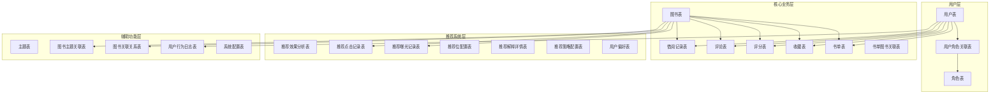
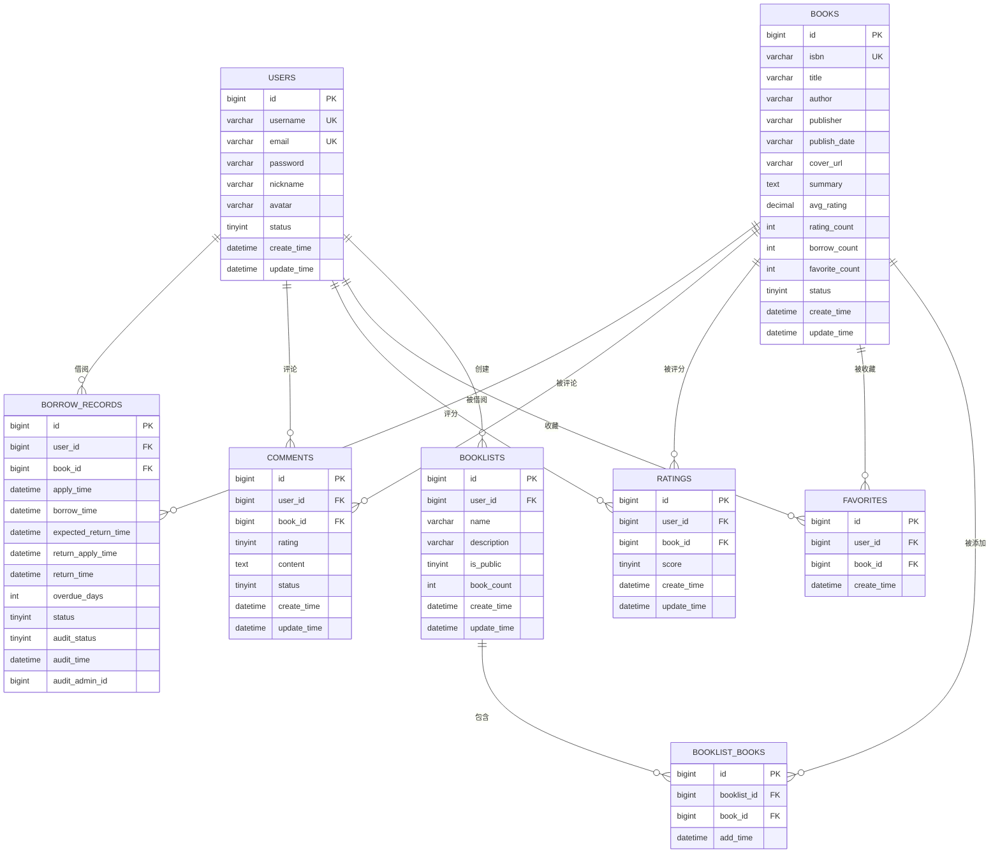

# 核心业务表设计

<cite>
**本文档引用的文件**
- [User.java](file://src/main/java/org/example/backend/entity/User.java)
- [Book.java](file://src/main/java/org/example/backend/entity/Book.java)
- [BorrowRecord.java](file://src/main/java/org/example/backend/entity/BorrowRecord.java)
- [Comment.java](file://src/main/java/org/example/backend/entity/Comment.java)
- [Rating.java](file://src/main/java/org/example/backend/entity/Rating.java)
- [Favorite.java](file://src/main/java/org/example/backend/entity/Favorite.java)
- [Booklist.java](file://src/main/java/org/example/backend/entity/Booklist.java)
- [BooklistBook.java](file://src/main/java/org/example/backend/entity/BooklistBook.java)
- [data_library126_db.sql](file://src/main/resources/data_library126_db.sql)
</cite>

## 目录
1. [项目概述](#项目概述)
2. [数据库架构总览](#数据库架构总览)
3. [核心业务表设计](#核心业务表设计)
4. [表间关系与约束](#表间关系与约束)
5. [索引策略分析](#索引策略分析)
6. [业务规则实现](#业务规则实现)
7. [数据字典](#数据字典)
8. [性能优化建议](#性能优化建议)
9. [总结](#总结)

## 项目概述

智能图书推荐系统是一个基于Spring Boot框架开发的现代化图书管理平台，集成了智能推荐算法、用户交互功能和完善的权限管理体系。该系统通过多维度的数据建模支持图书推荐、用户行为分析、社交互动等功能。

## 数据库架构总览

系统采用MySQL作为主要存储引擎，使用InnoDB存储引擎支持事务处理和外键约束。整体架构分为以下几个层次：

**图表来源**
- [data_library126_db.sql](file://src/main/resources/data_library126_db.sql#L268-L398)
- [data_library126_db.sql](file://src/main/resources/data_library126_db.sql#L313-L452)

## 核心业务表设计

### 用户表 (users)

用户表是整个系统的核心基础表，存储系统用户的基本信息和认证数据。

**表结构设计：**

| 字段名 | 数据类型 | 约束条件 | 描述 |
|--------|----------|----------|------|
| id | bigint | PRIMARY KEY, AUTO_INCREMENT | 用户唯一标识符 |
| username | varchar(50) | UNIQUE NOT NULL | 用户名，唯一约束 |
| email | varchar(100) | UNIQUE NOT NULL | 邮箱地址，唯一约束 |
| password | varchar(255) | NOT NULL | BCrypt加密后的密码 |
| nickname | varchar(50) | NULL | 昵称 |
| avatar | varchar(255) | NULL | 头像URL |
| status | tinyint | DEFAULT 1 | 用户状态：0-禁用，1-启用 |
| create_time | datetime | DEFAULT CURRENT_TIMESTAMP | 创建时间 |
| update_time | datetime | DEFAULT CURRENT_TIMESTAMP ON UPDATE CURRENT_TIMESTAMP | 更新时间 |

**索引策略：**
- 主键索引：PRIMARY KEY (id)
- 唯一索引：UNIQUE (username), UNIQUE (email)
- 普通索引：INDEX (username), INDEX (email), INDEX (status)

**业务规则：**
- 用户名和邮箱必须唯一
- 密码必须经过BCrypt加密存储
- 默认状态为启用状态

**图表来源**
- [User.java](file://src/main/java/org/example/backend/entity/User.java#L15-L62)
- [data_library126_db.sql](file://src/main/resources/data_library126_db.sql#L1037-L1056)

### 图书表 (books)

图书表存储图书的基本信息和统计指标，是推荐系统的核心数据源。

**表结构设计：**

| 字段名 | 数据类型 | 约束条件 | 描述 |
|--------|----------|----------|------|
| id | bigint | PRIMARY KEY, AUTO_INCREMENT | 图书唯一标识符 |
| isbn | varchar(50) | NULL | ISBN国际标准书号 |
| title | varchar(255) | NOT NULL | 书名 |
| author | varchar(100) | NULL | 作者 |
| publisher | varchar(100) | NULL | 出版社 |
| publish_date | varchar(50) | NULL | 出版日期 |
| cover_url | varchar(255) | NULL | 封面图片URL |
| summary | text | NULL | 图书简介 |
| avg_rating | decimal(3,1) | DEFAULT 0.0 | 平均评分 |
| rating_count | int | DEFAULT 0 | 评分人数 |
| borrow_count | int | DEFAULT 0 | 借阅次数 |
| favorite_count | int | DEFAULT 0 | 收藏次数 |
| status | tinyint | DEFAULT 1 | 图书状态：0-下架，1-上架 |
| create_time | datetime | DEFAULT CURRENT_TIMESTAMP | 创建时间 |
| update_time | datetime | DEFAULT CURRENT_TIMESTAMP ON UPDATE CURRENT_TIMESTAMP | 更新时间 |

**索引策略：**
- 主键索引：PRIMARY KEY (id)
- 唯一索引：UNIQUE (isbn)
- 普通索引：INDEX (title), INDEX (author), INDEX (isbn), INDEX (status), INDEX (borrow_count)
- 全文索引：FULLTEXT (title, author, summary)

**业务规则：**
- ISBN可以为空，但应尽量保证唯一性
- 图书默认状态为上架
- 统计字段需要实时更新维护

**图表来源**
- [Book.java](file://src/main/java/org/example/backend/entity/Book.java#L15-L93)
- [data_library126_db.sql](file://src/main/resources/data_library126_db.sql#L268-L295)

### 借阅记录表 (borrow_records)

借阅记录表跟踪用户的图书借阅生命周期，支持完整的借阅流程管理。

**表结构设计：**

| 字段名 | 数据类型 | 约束条件 | 描述 |
|--------|----------|----------|------|
| id | bigint | PRIMARY KEY, AUTO_INCREMENT | 借阅记录唯一标识符 |
| user_id | bigint | NOT NULL | 用户ID，外键关联users表 |
| book_id | bigint | NOT NULL | 图书ID，外键关联books表 |
| apply_time | datetime | DEFAULT CURRENT_TIMESTAMP | 借阅申请时间 |
| borrow_time | datetime | DEFAULT CURRENT_TIMESTAMP | 实际借阅时间 |
| expected_return_time | datetime | NULL | 预计归还时间 |
| return_apply_time | datetime | NULL | 归还申请时间 |
| return_time | datetime | NULL | 实际归还时间 |
| overdue_days | int | DEFAULT 0 | 逾期天数 |
| status | tinyint | DEFAULT 1 | 借阅状态：0-已归还，1-借阅中 |
| audit_status | tinyint | DEFAULT 0 | 审核状态：0-待审核，1-已通过，2-已拒绝 |
| audit_time | datetime | NULL | 审核时间 |
| audit_admin_id | bigint | NULL | 审核管理员ID |

**索引策略：**
- 主键索引：PRIMARY KEY (id)
- 普通索引：INDEX (user_id), INDEX (book_id), INDEX (borrow_time), INDEX (audit_status), INDEX (expected_return_time)

**业务规则：**
- 支持完整的借阅生命周期管理
- 审核流程需要管理员参与
- 逾期天数自动计算

**图表来源**
- [BorrowRecord.java](file://src/main/java/org/example/backend/entity/BorrowRecord.java#L15-L82)
- [data_library126_db.sql](file://src/main/resources/data_library126_db.sql#L313-L338)

### 评论表 (comments)

评论表记录用户对图书的评价和反馈，支持多维度的内容审核机制。

**表结构设计：**

| 字段名 | 数据类型 | 约束条件 | 描述 |
|--------|----------|----------|------|
| id | bigint | PRIMARY KEY, AUTO_INCREMENT | 评论唯一标识符 |
| user_id | bigint | NOT NULL | 用户ID，外键关联users表 |
| book_id | bigint | NOT NULL | 图书ID，外键关联books表 |
| rating | tinyint | NULL | 评分等级（1-5星） |
| content | text | NOT NULL | 评论内容 |
| status | tinyint | DEFAULT 1 | 审核状态：0-待审核，1-已通过，2-已拒绝 |
| create_time | datetime | DEFAULT CURRENT_TIMESTAMP | 创建时间 |
| update_time | datetime | DEFAULT CURRENT_TIMESTAMP ON UPDATE CURRENT_TIMESTAMP | 更新时间 |

**索引策略：**
- 主键索引：PRIMARY KEY (id)
- 普通索引：INDEX (user_id), INDEX (book_id), INDEX (create_time), INDEX (status)

**业务规则：**
- 支持带评分的评论和纯文本评论
- 审核状态控制内容展示
- 评分与图书平均分同步更新

**图表来源**
- [Comment.java](file://src/main/java/org/example/backend/entity/Comment.java#L15-L57)
- [data_library126_db.sql](file://src/main/resources/data_library126_db.sql#L354-L373)

### 评分表 (ratings)

评分表存储用户对图书的具体评分数据，支持去重和历史追踪。

**表结构设计：**

| 字段名 | 数据类型 | 约束条件 | 描述 |
|--------|----------|----------|------|
| id | bigint | PRIMARY KEY, AUTO_INCREMENT | 评分记录唯一标识符 |
| user_id | bigint | NOT NULL | 用户ID，外键关联users表 |
| book_id | bigint | NOT NULL | 图书ID，外键关联books表 |
| score | tinyint | NOT NULL | 评分数值（1-5分） |
| create_time | datetime | DEFAULT CURRENT_TIMESTAMP | 创建时间 |
| update_time | datetime | DEFAULT CURRENT_TIMESTAMP ON UPDATE CURRENT_TIMESTAMP | 更新时间 |

**索引策略：**
- 主键索引：PRIMARY KEY (id)
- 唯一索引：UNIQUE (user_id, book_id)
- 普通索引：INDEX (user_id), INDEX (book_id)

**业务规则：**
- 用户对同一图书只能评分一次
- 评分范围限制在1-5之间
- 自动维护图书平均分和评分人数

**图表来源**
- [Rating.java](file://src/main/java/org/example/backend/entity/Rating.java#L15-L47)
- [data_library126_db.sql](file://src/main/resources/data_library126_db.sql#L436-L452)

### 收藏表 (favorites)

收藏表记录用户的图书收藏行为，支持快速访问和个性化推荐。

**表结构设计：**

| 字段名 | 数据类型 | 约束条件 | 描述 |
|--------|----------|----------|------|
| id | bigint | PRIMARY KEY, AUTO_INCREMENT | 收藏记录唯一标识符 |
| user_id | bigint | NOT NULL | 用户ID，外键关联users表 |
| book_id | bigint | NOT NULL | 图书ID，外键关联books表 |
| create_time | datetime | DEFAULT CURRENT_TIMESTAMP | 收藏时间 |

**索引策略：**
- 主键索引：PRIMARY KEY (id)
- 唯一索引：UNIQUE (user_id, book_id)
- 普通索引：INDEX (user_id), INDEX (book_id)

**业务规则：**
- 用户对同一图书只能收藏一次
- 收藏数量影响图书热度指标
- 支持批量收藏和取消收藏操作

**图表来源**
- [Favorite.java](file://src/main/java/org/example/backend/entity/Favorite.java#L15-L37)
- [data_library126_db.sql](file://src/main/resources/data_library126_db.sql#L384-L398)

### 书单表 (booklists)

书单表支持用户创建和管理个人图书清单，提供社交分享功能。

**表结构设计：**

| 字段名 | 数据类型 | 约束条件 | 描述 |
|--------|----------|----------|------|
| id | bigint | PRIMARY KEY, AUTO_INCREMENT | 书单唯一标识符 |
| user_id | bigint | NOT NULL | 创建者用户ID，外键关联users表 |
| name | varchar(100) | NOT NULL | 书单名称 |
| description | varchar(500) | NULL | 书单描述 |
| is_public | tinyint | DEFAULT 0 | 公开状态：0-私有，1-公开 |
| book_count | int | DEFAULT 0 | 包含图书数量 |
| create_time | datetime | DEFAULT CURRENT_TIMESTAMP | 创建时间 |
| update_time | datetime | DEFAULT CURRENT_TIMESTAMP ON UPDATE CURRENT_TIMESTAMP | 更新时间 |

**索引策略：**
- 主键索引：PRIMARY KEY (id)
- 普通索引：INDEX (user_id), INDEX (is_public)

**业务规则：**
- 支持私有和公开两种模式
- 公开书单可被其他用户查看
- 自动维护书单中的图书数量

**图表来源**
- [Booklist.java](file://src/main/java/org/example/backend/entity/Booklist.java#L15-L57)
- [data_library126_db.sql](file://src/main/resources/data_library126_db.sql#L244-L260)

### 书单图书关联表 (booklist_books)

书单图书关联表实现书单与图书的一对多关系，支持灵活的图书组织。

**表结构设计：**

| 字段名 | 数据类型 | 约束条件 | 描述 |
|--------|----------|----------|------|
| id | bigint | PRIMARY KEY, AUTO_INCREMENT | 关联记录唯一标识符 |
| booklist_id | bigint | NOT NULL | 书单ID，外键关联booklists表 |
| book_id | bigint | NOT NULL | 图书ID，外键关联books表 |
| add_time | datetime | DEFAULT CURRENT_TIMESTAMP | 添加时间 |

**索引策略：**
- 主键索引：PRIMARY KEY (id)
- 唯一索引：UNIQUE (booklist_id, book_id)
- 普通索引：INDEX (booklist_id), INDEX (book_id)

**业务规则：**
- 同一书单中不能重复添加同一图书
- 支持按添加时间排序展示图书
- 删除书单时级联删除关联记录

**图表来源**
- [BooklistBook.java](file://src/main/java/org/example/backend/entity/BooklistBook.java#L15-L37)
- [data_library126_db.sql](file://src/main/resources/data_library126_db.sql#L222-L236)

## 表间关系与约束

系统采用外键约束确保数据完整性和一致性，建立了清晰的层次化关系：

**图表来源**
- [data_library126_db.sql](file://src/main/resources/data_library126_db.sql#L313-L452)
- [data_library126_db.sql](file://src/main/resources/data_library126_db.sql#L244-L260)

## 索引策略分析

系统采用了多层次的索引策略来优化查询性能：

### 主键索引
- 所有表都使用自增主键，确保数据唯一性和插入性能
- 主键索引自动建立，无需额外配置

### 唯一索引
- 用户名和邮箱唯一索引：确保用户标识的唯一性
- ISBN唯一索引：保证图书标识的唯一性
- 用户-图书唯一组合索引：防止重复评分和收藏

### 普通索引
- 高频查询字段索引：
  - 用户表：username, email, status
  - 图书表：title, author, isbn, status, borrow_count
  - 借阅记录表：user_id, book_id, borrow_time, audit_status, expected_return_time
  - 评论表：user_id, book_id, create_time, status
  - 评分表：user_id, book_id
  - 收藏表：user_id, book_id
  - 书单表：user_id, is_public

### 全文索引
- 图书表全文索引：title, author, summary
- 支持复杂的文本搜索和模糊匹配

### 复合索引
- 书单图书关联表：(booklist_id, book_id)唯一复合索引
- 推荐相关表：多字段组合索引优化推荐查询

## 业务规则实现

系统通过数据库层面实现了多项关键业务规则：

### 数据完整性约束
- 外键约束确保引用完整性
- 唯一约束防止重复数据
- 非空约束保证必要字段存在

### 状态管理
- 用户状态：0-禁用，1-启用
- 图书状态：0-下架，1-上架
- 审核状态：0-待审核，1-已通过，2-已拒绝
- 借阅状态：0-已归还，1-借阅中

### 时间戳管理
- 自动维护创建时间和更新时间
- 支持审计追踪和数据变更记录

### 权限控制
- 角色表支持用户权限分级
- 用户角色关联表实现多角色管理
- 不同角色具有不同的操作权限

## 数据字典

### 用户相关数据字典

| 字段名 | 类型 | 取值范围 | 描述 |
|--------|------|----------|------|
| status | tinyint | 0, 1 | 用户状态：0-禁用，1-启用 |
| is_public | tinyint | 0, 1 | 公开状态：0-私有，1-公开 |

### 内容审核数据字典

| 字段名 | 类型 | 取值范围 | 描述 |
|--------|------|----------|------|
| audit_status | tinyint | 0, 1, 2 | 审核状态：0-待审核，1-已通过，2-已拒绝 |
| status | tinyint | 0, 1, 2 | 通用审核状态：0-待审核，1-已通过，2-已拒绝 |

### 评分数据字典

| 字段名 | 类型 | 取值范围 | 描述 |
|--------|------|----------|------|
| score | tinyint | 1, 2, 3, 4, 5 | 评分等级：1-5星 |
| rating | tinyint | 1, 2, 3, 4, 5 | 评分等级：1-5星 |

## 性能优化建议

### 查询优化
- 为高频查询字段建立合适的索引
- 使用EXPLAIN分析复杂查询的执行计划
- 避免SELECT *，只查询必要字段

### 索引优化
- 定期分析和重建碎片化的索引
- 考虑使用覆盖索引减少回表查询
- 对于高选择性的字段优先建立索引

### 缓存策略
- 利用Redis缓存热点数据
- 实现读写分离提高并发性能
- 合理设置缓存过期时间

### 分表分库
- 对于超大表考虑水平分表
- 按时间或用户ID进行分片
- 实现分布式事务管理

## 总结

智能图书推荐系统的数据库设计充分考虑了业务需求和技术要求，通过合理的表结构设计、严格的约束管理和优化的索引策略，为系统的稳定运行和高性能提供了坚实基础。

核心特点包括：
- 清晰的业务分层和表关系设计
- 完善的数据完整性约束和业务规则
- 高效的索引策略和查询优化
- 灵活的扩展性和维护性

这套设计方案不仅满足了当前的功能需求，也为未来的业务发展和系统扩展预留了充足的空间。