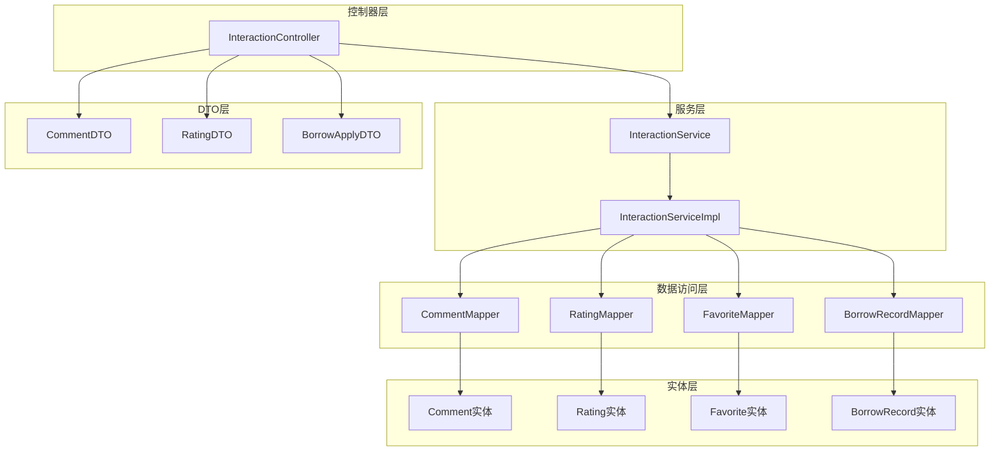
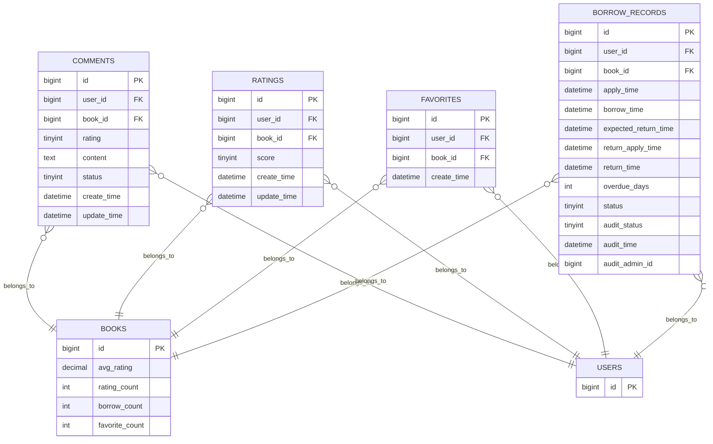
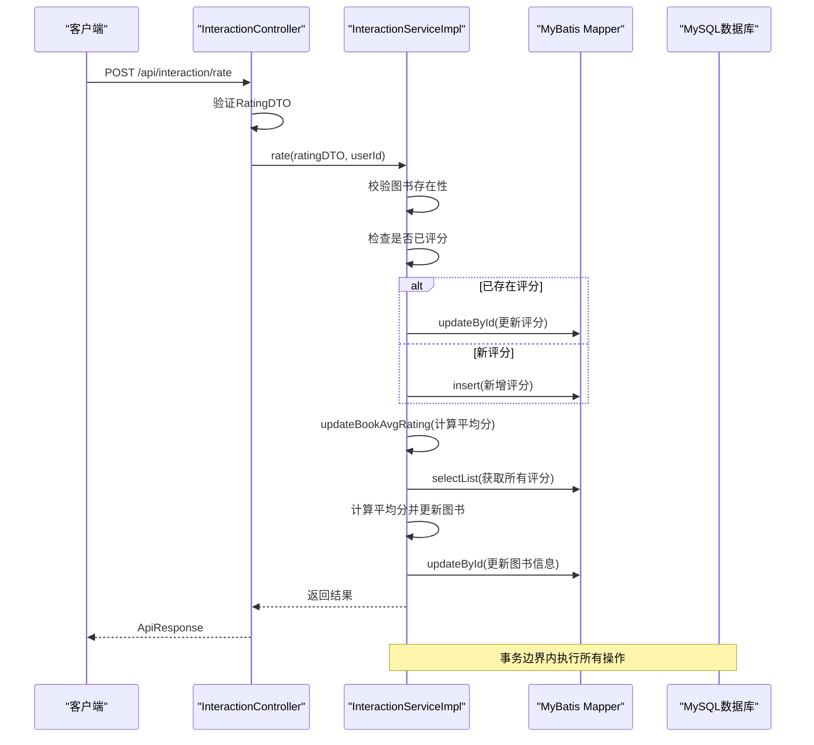
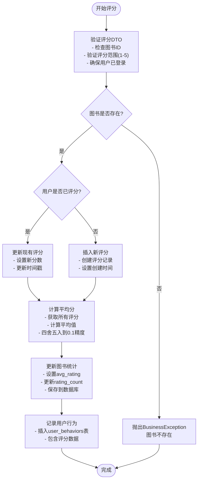
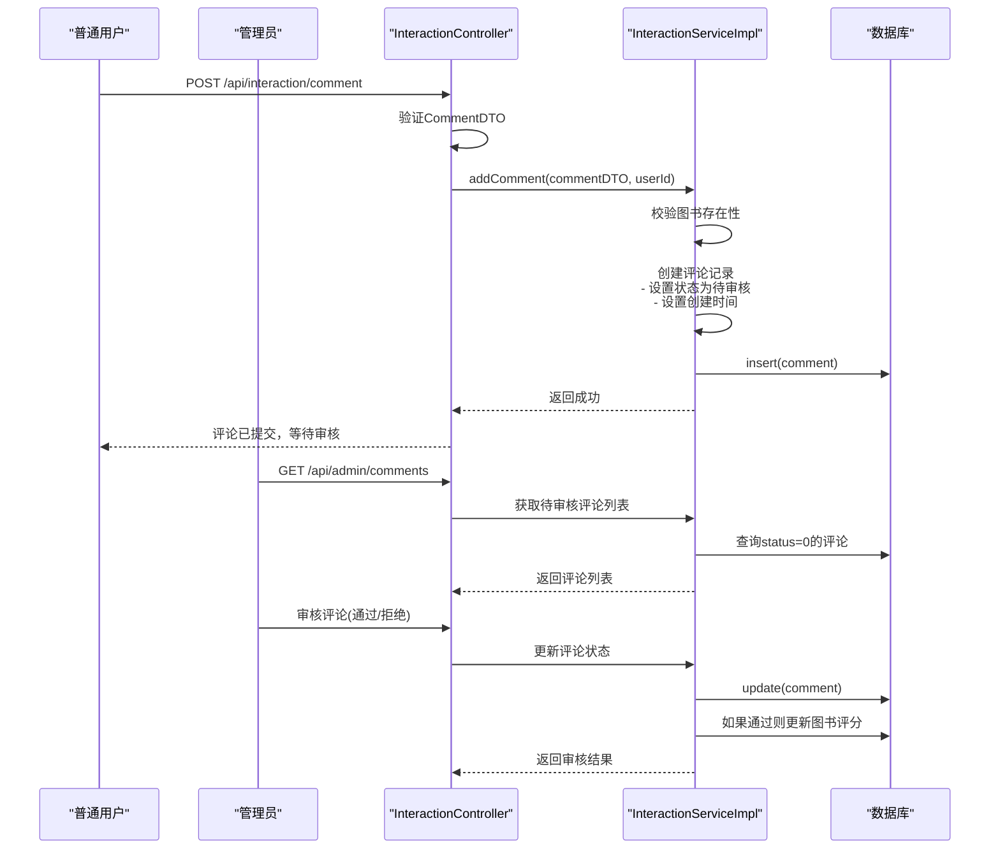
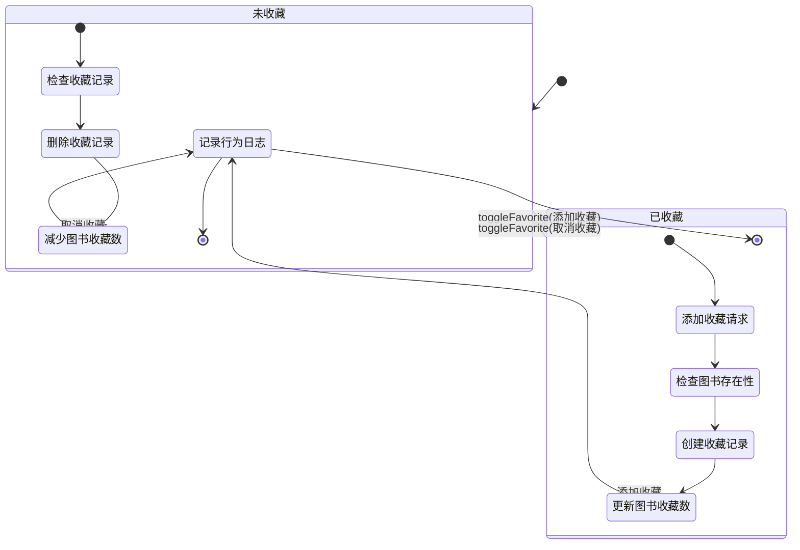
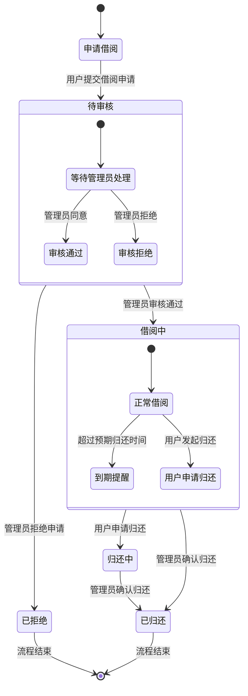
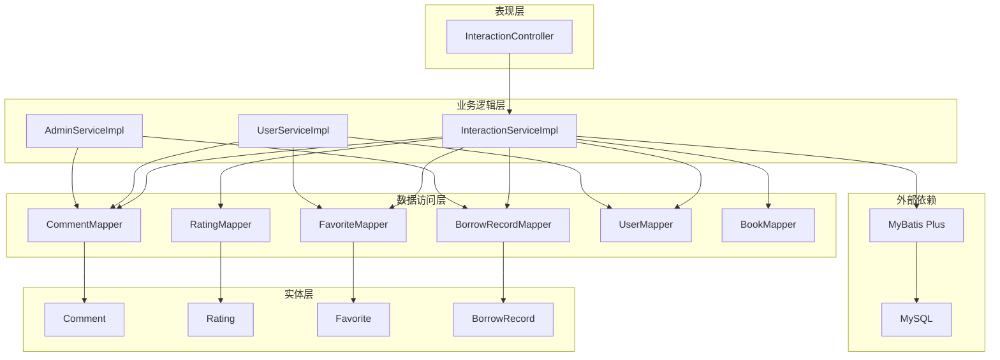

# 用户交互表设计

<cite>
**本文档引用的文件**
- [Comment.java](file://src/main/java/org/example/backend/entity/Comment.java)
- [Rating.java](file://src/main/java/org/example/backend/entity/Rating.java)
- [Favorite.java](file://src/main/java/org/example/backend/entity/Favorite.java)
- [BorrowRecord.java](file://src/main/java/org/example/backend/entity/BorrowRecord.java)
- [CommentDTO.java](file://src/main/java/org/example/backend/dto/interaction/CommentDTO.java)
- [RatingDTO.java](file://src/main/java/org/example/backend/dto/interaction/RatingDTO.java)
- [BorrowApplyDTO.java](file://src/main/java/org/example/backend/dto/interaction/BorrowApplyDTO.java)
- [CommentMapper.java](file://src/main/java/org/example/backend/modules/interaction/repository/CommentMapper.java)
- [RatingMapper.java](file://src/main/java/org/example/backend/modules/interaction/repository/RatingMapper.java)
- [FavoriteMapper.java](file://src/main/java/org/example/backend/modules/interaction/repository/FavoriteMapper.java)
- [BorrowRecordMapper.java](file://src/main/java/org/example/backend/modules/interaction/repository/BorrowRecordMapper.java)
- [InteractionService.java](file://src/main/java/org/example/backend/modules/interaction/service/InteractionService.java)
- [InteractionServiceImpl.java](file://src/main/java/org/example/backend/modules/interaction/service/impl/InteractionServiceImpl.java)
- [InteractionController.java](file://src/main/java/org/example/backend/modules/interaction/controller/InteractionController.java)
- [data_library126_db.sql](file://src/main/resources/data_library126_db.sql)
</cite>

## 目录
1. [简介](#简介)
2. [项目结构](#项目结构)
3. [核心组件](#核心组件)
4. [架构概览](#架构概览)
5. [详细组件分析](#详细组件分析)
6. [依赖关系分析](#依赖关系分析)
7. [性能考虑](#性能考虑)
8. [故障排除指南](#故障排除指南)
9. [结论](#结论)

## 简介

智能图书推荐系统中的用户交互表设计是整个系统的核心组成部分，负责存储和管理用户的评分、评论、收藏和借阅行为。本文档详细分析了四个关键表的设计：评论表(comments)、评分表(ratings)、收藏表(favorites)和借阅记录表(borrow_records)，并解释了相应的业务逻辑实现。

该系统采用Spring Boot + MyBatis Plus框架，实现了完整的用户交互功能，包括评分机制、评论审核、收藏管理和借阅流程控制。所有表都设计有适当的索引策略以确保查询性能，并通过外键约束保证数据完整性。

## 项目结构

系统采用标准的MVC架构模式，用户交互功能主要分布在以下模块中：

**图表来源**
- [InteractionController.java](file://src/main/java/org/example/backend/modules/interaction/controller/InteractionController.java#L1-L88)
- [InteractionService.java](file://src/main/java/org/example/backend/modules/interaction/service/InteractionService.java#L1-L49)
- [InteractionServiceImpl.java](file://src/main/java/org/example/backend/modules/interaction/service/impl/InteractionServiceImpl.java#L1-L340)

**章节来源**
- [InteractionController.java](file://src/main/java/org/example/backend/modules/interaction/controller/InteractionController.java#L1-L88)
- [InteractionService.java](file://src/main/java/org/example/backend/modules/interaction/service/InteractionService.java#L1-L49)
- [InteractionServiceImpl.java](file://src/main/java/org/example/backend/modules/interaction/service/impl/InteractionServiceImpl.java#L1-L340)

## 核心组件

系统的核心组件围绕四个用户交互表构建，每个表都有明确的职责和约束条件：

### 数据模型概览

**图表来源**
- [Comment.java](file://src/main/java/org/example/backend/entity/Comment.java#L1-L59)
- [Rating.java](file://src/main/java/org/example/backend/entity/Rating.java#L1-L49)
- [Favorite.java](file://src/main/java/org/example/backend/entity/Favorite.java#L1-L39)
- [BorrowRecord.java](file://src/main/java/org/example/backend/entity/BorrowRecord.java#L1-L84)
- [data_library126_db.sql](file://src/main/resources/data_library126_db.sql#L354-L462)

### 字段定义与数据类型选择

每个表都经过精心设计，选择了最适合的数据类型和约束条件：

**评分表(ratings)设计要点：**
- 使用tinyint存储1-5分制评分，节省存储空间
- 唯一索引确保用户对同一图书只能评分一次
- 自动时间戳跟踪创建和更新时间

**收藏表(favorites)设计要点：**
- 唯一索引防止重复收藏
- 简洁的字段结构，仅包含必要信息
- 外键约束确保数据一致性

**评论表(comments)设计要点：**
- 支持文本内容的完整存储
- 审核状态字段实现内容管理
- 时间戳字段便于排序和统计

**借阅记录表(borrow_records)设计要点：**
- 复杂的状态机支持完整的借阅生命周期
- 多个时间戳字段跟踪不同阶段的时间点
- 审核流程支持管理员介入

**章节来源**
- [Comment.java](file://src/main/java/org/example/backend/entity/Comment.java#L1-L59)
- [Rating.java](file://src/main/java/org/example/backend/entity/Rating.java#L1-L49)
- [Favorite.java](file://src/main/java/org/example/backend/entity/Favorite.java#L1-L39)
- [BorrowRecord.java](file://src/main/java/org/example/backend/entity/BorrowRecord.java#L1-L84)

## 架构概览

系统采用分层架构设计，确保关注点分离和代码的可维护性：

**图表来源**
- [InteractionController.java](file://src/main/java/org/example/backend/modules/interaction/controller/InteractionController.java#L29-L35)
- [InteractionServiceImpl.java](file://src/main/java/org/example/backend/modules/interaction/service/impl/InteractionServiceImpl.java#L59-L95)

**章节来源**
- [InteractionController.java](file://src/main/java/org/example/backend/modules/interaction/controller/InteractionController.java#L1-L88)
- [InteractionServiceImpl.java](file://src/main/java/org/example/backend/modules/interaction/service/impl/InteractionServiceImpl.java#L1-L340)

## 详细组件分析

### 评分系统设计

评分系统是用户交互的核心功能之一，实现了完整的评分生命周期管理：

**图表来源**
- [InteractionServiceImpl.java](file://src/main/java/org/example/backend/modules/interaction/service/impl/InteractionServiceImpl.java#L61-L95)
- [RatingMapper.java](file://src/main/java/org/example/backend/modules/interaction/repository/RatingMapper.java#L1-L14)

评分系统的关键特性包括：

1. **唯一性约束**：通过唯一索引确保用户对同一图书只能评分一次
2. **实时统计更新**：每次评分后立即重新计算图书的平均分和评分人数
3. **数据完整性**：使用事务确保评分操作的原子性
4. **行为追踪**：记录详细的用户行为数据用于后续分析

**章节来源**
- [InteractionServiceImpl.java](file://src/main/java/org/example/backend/modules/interaction/service/impl/InteractionServiceImpl.java#L59-L95)
- [Rating.java](file://src/main/java/org/example/backend/entity/Rating.java#L1-L49)
- [RatingDTO.java](file://src/main/java/org/example/backend/dto/interaction/RatingDTO.java#L1-L23)

### 评论管理系统

评论系统实现了完整的UGC(用户生成内容)管理功能，包括内容审核和权限控制：

**图表来源**
- [InteractionController.java](file://src/main/java/org/example/backend/modules/interaction/controller/InteractionController.java#L45-L59)
- [InteractionServiceImpl.java](file://src/main/java/org/example/backend/modules/interaction/service/impl/InteractionServiceImpl.java#L136-L154)

评论管理系统的特色功能：

1. **审核机制**：所有评论默认进入待审核状态，确保内容质量
2. **权限控制**：用户只能删除自己发表的评论
3. **分页查询**：只展示已审核通过的评论，支持分页显示
4. **用户信息关联**：在查询时关联用户信息显示用户名和头像

**章节来源**
- [InteractionServiceImpl.java](file://src/main/java/org/example/backend/modules/interaction/service/impl/InteractionServiceImpl.java#L136-L197)
- [Comment.java](file://src/main/java/org/example/backend/entity/Comment.java#L1-L59)
- [CommentDTO.java](file://src/main/java/org/example/backend/dto/interaction/CommentDTO.java#L1-L27)

### 收藏管理功能

收藏功能提供了灵活的书签管理机制，支持快速访问和个性化推荐：

**图表来源**
- [InteractionServiceImpl.java](file://src/main/java/org/example/backend/modules/interaction/service/impl/InteractionServiceImpl.java#L98-L134)
- [Favorite.java](file://src/main/java/org/example/backend/entity/Favorite.java#L1-L39)

收藏管理的核心特性：

1. **双向切换**：通过同一个接口实现添加和取消收藏功能
2. **实时同步**：收藏操作同时更新图书的收藏计数
3. **行为追踪**：记录详细的收藏和取消收藏行为
4. **去重保护**：唯一索引防止重复收藏同一本书

**章节来源**
- [InteractionServiceImpl.java](file://src/main/java/org/example/backend/modules/interaction/service/impl/InteractionServiceImpl.java#L98-L134)
- [Favorite.java](file://src/main/java/org/example/backend/entity/Favorite.java#L1-L39)

### 借阅流程管理

借阅流程是最复杂的用户交互功能，实现了完整的借阅生命周期管理：

**图表来源**
- [BorrowRecord.java](file://src/main/java/org/example/backend/entity/BorrowRecord.java#L1-L84)
- [InteractionServiceImpl.java](file://src/main/java/org/example/backend/modules/interaction/service/impl/InteractionServiceImpl.java#L222-L337)

借阅流程的完整实现：

1. **申请验证**：检查用户是否有未完成的借阅或申请
2. **时间验证**：确保预计归还时间在未来
3. **状态管理**：完整的借阅状态机支持多种业务场景
4. **管理员审核**：借阅需要管理员审核才能生效
5. **归还流程**：用户和管理员共同参与的归还确认流程

**章节来源**
- [InteractionServiceImpl.java](file://src/main/java/org/example/backend/modules/interaction/service/impl/InteractionServiceImpl.java#L222-L337)
- [BorrowRecord.java](file://src/main/java/org/example/backend/entity/BorrowRecord.java#L1-L84)
- [BorrowApplyDTO.java](file://src/main/java/org/example/backend/dto/interaction/BorrowApplyDTO.java#L1-L22)

## 依赖关系分析

系统各组件之间的依赖关系清晰明确，遵循了良好的软件工程原则：

**图表来源**
- [InteractionServiceImpl.java](file://src/main/java/org/example/backend/modules/interaction/service/impl/InteractionServiceImpl.java#L35-L57)
- [InteractionController.java](file://src/main/java/org/example/backend/modules/interaction/controller/InteractionController.java#L26-L27)

依赖关系的特点：

1. **单向依赖**：遵循依赖倒置原则，上层组件依赖抽象而非具体实现
2. **松耦合**：各组件通过接口进行通信，降低耦合度
3. **可测试性**：通过接口注入便于单元测试和模拟
4. **扩展性**：新的功能可以通过实现相应接口轻松集成

**章节来源**
- [InteractionServiceImpl.java](file://src/main/java/org/example/backend/modules/interaction/service/impl/InteractionServiceImpl.java#L35-L57)
- [InteractionController.java](file://src/main/java/org/example/backend/modules/interaction/controller/InteractionController.java#L26-L27)

## 性能考虑

系统在设计时充分考虑了性能优化，采用了多种策略确保高并发下的稳定运行：

### 索引策略

每个表都设计了合理的索引策略来优化常见查询：

**评论表索引设计：**
- 主键索引：`PRIMARY (id)`
- 用户索引：`idx_user_id (user_id)` - 支持用户评论查询
- 图书索引：`idx_book_id (book_id)` - 支持图书评论查询
- 时间索引：`idx_create_time (create_time)` - 支持按时间排序
- 状态索引：`idx_status (status)` - 支持状态过滤

**评分表索引设计：**
- 主键索引：`PRIMARY (id)`
- 唯一索引：`uk_user_book (user_id, book_id)` - 确保评分唯一性
- 用户索引：`idx_user_id (user_id)` - 支持用户评分历史
- 图书索引：`idx_book_id (book_id)` - 支持图书评分统计

**收藏表索引设计：**
- 主键索引：`PRIMARY (id)`
- 唯一索引：`uk_user_book (user_id, book_id)` - 防止重复收藏
- 用户索引：`idx_user_id (user_id)` - 支持用户收藏列表
- 图书索引：`idx_book_id (book_id)` - 支持图书收藏统计

**借阅记录表索引设计：**
- 主键索引：`PRIMARY (id)`
- 用户索引：`idx_user_id (user_id)` - 支持用户借阅历史
- 图书索引：`idx_book_id (book_id)` - 支持图书借阅统计
- 借阅时间索引：`idx_borrow_time (borrow_time)` - 支持借阅统计
- 审核状态索引：`idx_audit_status (audit_status)` - 支持审核管理

### 查询优化策略

1. **分页查询**：评论列表使用分页查询避免大量数据传输
2. **条件过滤**：通过WHERE子句精确过滤数据
3. **排序优化**：利用索引支持高效的ORDER BY操作
4. **连接优化**：合理使用JOIN操作获取关联数据

### 缓存策略

虽然当前实现主要依赖数据库查询，但系统设计允许后续添加缓存层：

1. **热点数据缓存**：热门图书信息可以缓存到Redis
2. **用户行为缓存**：近期用户行为可以缓存减少数据库压力
3. **配置信息缓存**：系统配置和推荐策略可以缓存

**章节来源**
- [data_library126_db.sql](file://src/main/resources/data_library126_db.sql#L354-L462)

## 故障排除指南

### 常见问题及解决方案

**评分相关问题：**
- **问题**：用户重复评分
  - **原因**：唯一索引约束被绕过
  - **解决**：检查唯一索引是否正确创建
- **问题**：平均分计算错误
  - **原因**：评分数据异常或事务未提交
  - **解决**：检查事务边界和数据完整性

**评论相关问题：**
- **问题**：评论无法删除
  - **原因**：非评论作者尝试删除
  - **解决**：检查权限验证逻辑
- **问题**：评论不显示
  - **原因**：状态不是已通过
  - **解决**：检查审核状态过滤条件

**收藏相关问题：**
- **问题**：收藏数不更新
  - **原因**：事务回滚或图书不存在
  - **解决**：检查事务提交和图书存在性

**借阅相关问题：**
- **问题**：重复借阅申请
  - **原因**：状态检查逻辑错误
  - **解决**：检查借阅状态和审核状态组合
- **问题**：归还申请无效
  - **原因**：借阅记录状态不符
  - **解决**：检查借阅状态流转逻辑

### 调试建议

1. **启用SQL日志**：查看实际执行的SQL语句
2. **检查事务日志**：确认事务是否正确提交
3. **验证外键约束**：确保引用完整性
4. **监控慢查询**：识别性能瓶颈

**章节来源**
- [InteractionServiceImpl.java](file://src/main/java/org/example/backend/modules/interaction/service/impl/InteractionServiceImpl.java#L61-L95)
- [InteractionServiceImpl.java](file://src/main/java/org/example/backend/modules/interaction/service/impl/InteractionServiceImpl.java#L136-L197)
- [InteractionServiceImpl.java](file://src/main/java/org/example/backend/modules/interaction/service/impl/InteractionServiceImpl.java#L222-L337)

## 结论

智能图书推荐系统的用户交互表设计体现了现代Web应用的最佳实践。通过精心设计的表结构、完善的约束条件和优化的索引策略，系统能够高效地处理用户的评分、评论、收藏和借阅操作。

系统的主要优势包括：

1. **数据完整性**：通过外键约束和业务逻辑确保数据一致性
2. **性能优化**：合理的索引设计和查询策略支持高并发访问
3. **扩展性**：清晰的分层架构便于功能扩展和维护
4. **用户体验**：完整的审核机制和状态管理提供良好的用户体验

未来可以考虑的改进方向：
- 添加Redis缓存层提升性能
- 实现异步处理机制处理耗时操作
- 增加更多的行为分析和推荐功能
- 优化移动端适配和响应速度

这个设计为智能图书推荐系统提供了坚实的数据基础，能够支持复杂的用户交互场景和未来的功能扩展需求。