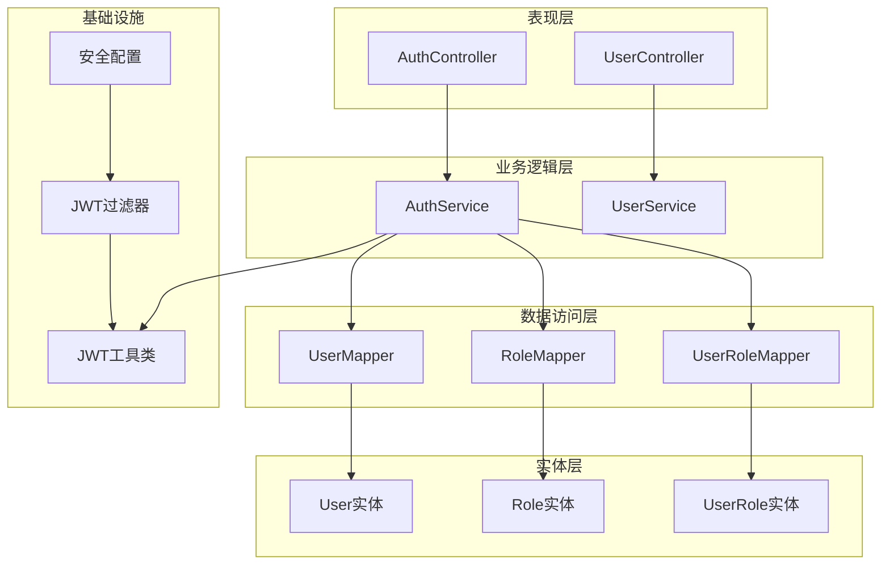
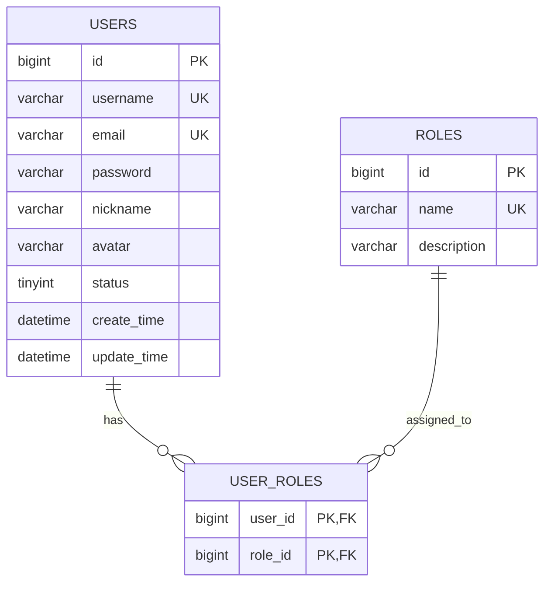
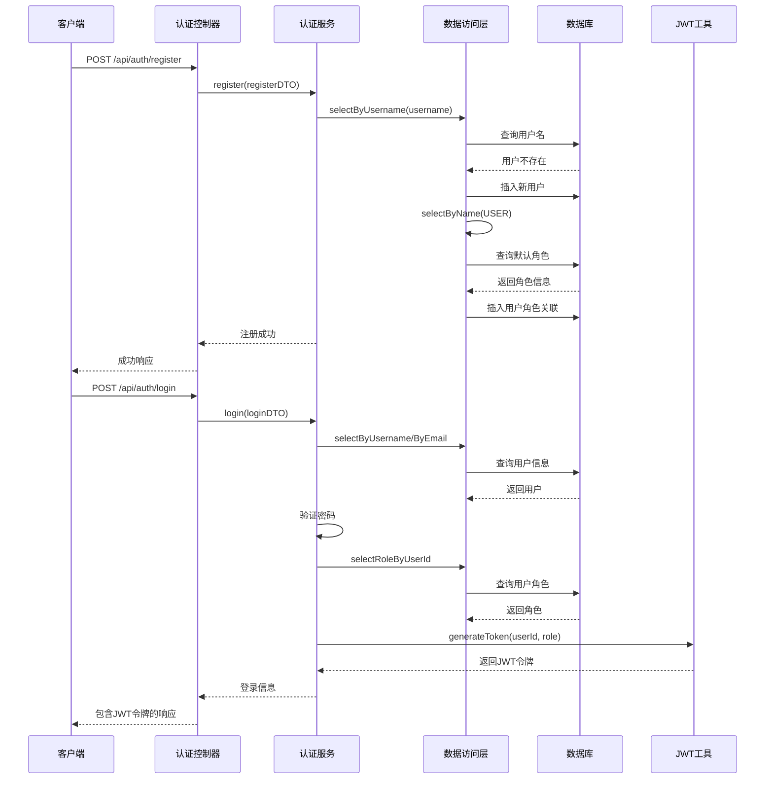
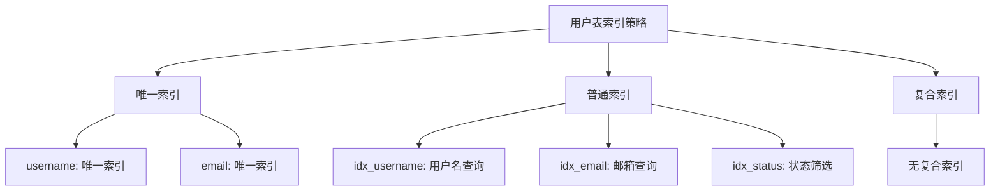
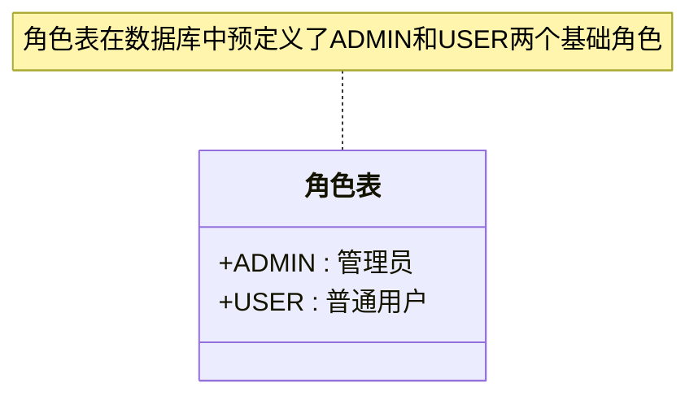
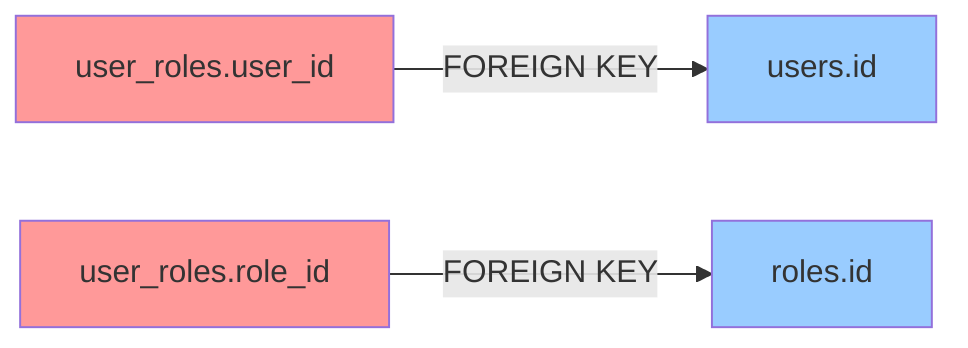
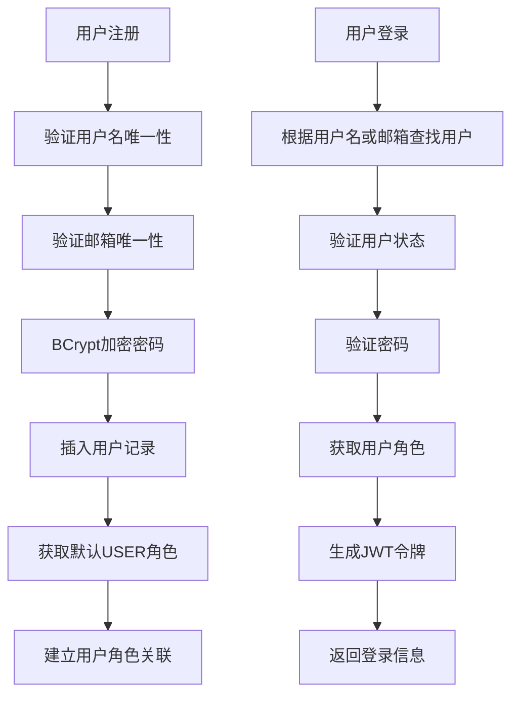
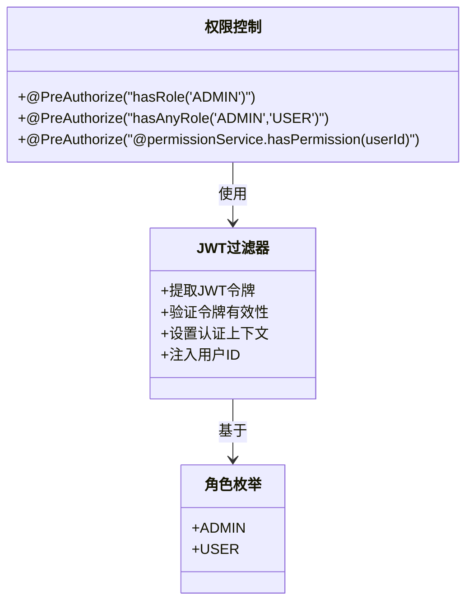
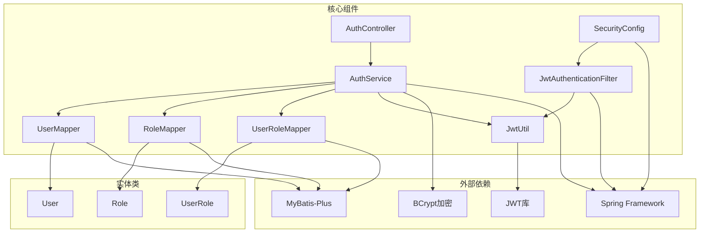
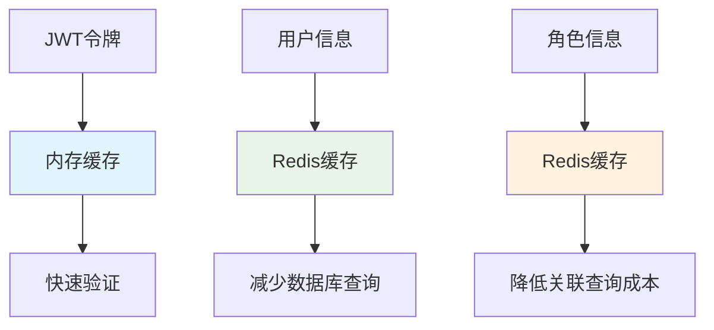

# 用户相关表设计

<cite>
**本文档引用的文件**
- [User.java](file://src/main/java/org/example/backend/entity/User.java)
- [Role.java](file://src/main/java/org/example/backend/entity/Role.java)
- [UserRole.java](file://src/main/java/org/example/backend/entity/UserRole.java)
- [data_library126_db.sql](file://src/main/resources/data_library126_db.sql)
- [UserMapper.java](file://src/main/java/org/example/backend/modules/user/repository/UserMapper.java)
- [RoleMapper.java](file://src/main/java/org/example/backend/modules/user/repository/RoleMapper.java)
- [UserRoleMapper.java](file://src/main/java/org/example/backend/modules/user/repository/UserRoleMapper.java)
- [AuthController.java](file://src/main/java/org/example/backend/modules/auth/controller/AuthController.java)
- [AuthServiceImpl.java](file://src/main/java/org/example/backend/modules/auth/service/impl/AuthServiceImpl.java)
- [JwtUtil.java](file://src/main/java/org/example/backend/config/JwtUtil.java)
- [SecurityConfig.java](file://src/main/java/org/example/backend/config/SecurityConfig.java)
- [JwtAuthenticationFilter.java](file://src/main/java/org/example/backend/modules/auth/filter/JwtAuthenticationFilter.java)
- [Constants.java](file://src/main/java/org/example/backend/common/constants/Constants.java)
</cite>

## 目录
1. [简介](#简介)
2. [项目结构](#项目结构)
3. [核心组件](#核心组件)
4. [架构概览](#架构概览)
5. [详细组件分析](#详细组件分析)
6. [依赖关系分析](#依赖关系分析)
7. [性能考虑](#性能考虑)
8. [故障排除指南](#故障排除指南)
9. [结论](#结论)

## 简介

本文档详细描述了智能图书推荐系统中用户相关表的设计与实现。系统采用MySQL数据库，包含用户表(users)、角色表(roles)和用户角色关联表(user_roles)，并通过JWT进行用户认证和权限管理。

该设计支持用户注册、登录、权限验证等功能，采用BCrypt加密存储用户密码，通过角色驱动的权限控制实现细粒度的访问管理。

## 项目结构

智能图书推荐系统的用户相关模块采用分层架构设计：

**图表来源**
- [AuthController.java](file://src/main/java/org/example/backend/modules/auth/controller/AuthController.java#L18-L41)
- [AuthServiceImpl.java](file://src/main/java/org/example/backend/modules/auth/service/impl/AuthServiceImpl.java#L25-L122)
- [UserMapper.java](file://src/main/java/org/example/backend/modules/user/repository/UserMapper.java#L11-L25)

**章节来源**
- [AuthController.java](file://src/main/java/org/example/backend/modules/auth/controller/AuthController.java#L1-L41)
- [AuthServiceImpl.java](file://src/main/java/org/example/backend/modules/auth/service/impl/AuthServiceImpl.java#L1-L122)

## 核心组件

### 数据库表结构

系统采用三表关联的设计模式，通过外键约束确保数据完整性：

**图表来源**
- [data_library126_db.sql](file://src/main/resources/data_library126_db.sql#L1038-L1056)
- [data_library126_db.sql](file://src/main/resources/data_library126_db.sql#L815-L824)
- [data_library126_db.sql](file://src/main/resources/data_library126_db.sql#L1017-L1028)

### 实体类映射

对应的Java实体类使用MyBatis-Plus注解映射到数据库表：

**章节来源**
- [User.java](file://src/main/java/org/example/backend/entity/User.java#L10-L64)
- [Role.java](file://src/main/java/org/example/backend/entity/Role.java#L8-L32)
- [UserRole.java](file://src/main/java/org/example/backend/entity/UserRole.java#L6-L24)

## 架构概览

系统采用JWT无状态认证机制，结合Spring Security实现权限控制：

**图表来源**
- [AuthController.java](file://src/main/java/org/example/backend/modules/auth/controller/AuthController.java#L26-L38)
- [AuthServiceImpl.java](file://src/main/java/org/example/backend/modules/auth/service/impl/AuthServiceImpl.java#L44-L78)
- [AuthServiceImpl.java](file://src/main/java/org/example/backend/modules/auth/service/impl/AuthServiceImpl.java#L80-L119)

**章节来源**
- [AuthController.java](file://src/main/java/org/example/backend/modules/auth/controller/AuthController.java#L1-L41)
- [AuthServiceImpl.java](file://src/main/java/org/example/backend/modules/auth/service/impl/AuthServiceImpl.java#L1-L122)

## 详细组件分析

### 用户表(users)设计

用户表是系统的核心表，存储用户基本信息和认证凭据：

#### 字段定义与约束

| 字段名 | 数据类型 | 约束条件 | 描述 |
|--------|----------|----------|------|
| id | bigint | PRIMARY KEY, AUTO_INCREMENT | 用户唯一标识符 |
| username | varchar(50) | NOT NULL, UNIQUE | 用户名，唯一约束 |
| email | varchar(100) | NOT NULL, UNIQUE | 邮箱地址，唯一约束 |
| password | varchar(255) | NOT NULL | BCrypt加密后的密码 |
| nickname | varchar(50) | NULL | 昵称 |
| avatar | varchar(255) | NULL | 头像URL |
| status | tinyint | DEFAULT 1 | 用户状态：0-禁用，1-启用 |
| create_time | datetime | DEFAULT CURRENT_TIMESTAMP | 创建时间 |
| update_time | datetime | DEFAULT CURRENT_TIMESTAMP ON UPDATE | 更新时间 |

#### 索引策略

**图表来源**
- [data_library126_db.sql](file://src/main/resources/data_library126_db.sql#L1050-L1056)

#### 数据类型选择理由

- **bigint**: 用户ID使用64位整型，支持大量用户数据
- **varchar(50)**: 用户名长度适中，满足大多数用户名需求
- **varchar(100)**: 邮箱长度足够容纳各种邮箱格式
- **varchar(255)**: 密码字段使用足够长度存储BCrypt哈希值
- **tinyint**: 状态字段使用1字节存储，节省空间

**章节来源**
- [User.java](file://src/main/java/org/example/backend/entity/User.java#L13-L64)
- [data_library126_db.sql](file://src/main/resources/data_library126_db.sql#L1038-L1056)

### 角色表(roles)设计

角色表定义系统中的权限角色：

#### 字段定义与约束

| 字段名 | 数据类型 | 约束条件 | 描述 |
|--------|----------|----------|------|
| id | bigint | PRIMARY KEY, AUTO_INCREMENT | 角色唯一标识符 |
| name | varchar(50) | NOT NULL, UNIQUE | 角色名称，唯一约束 |
| description | varchar(255) | NULL | 角色描述 |

#### 预定义角色

系统预定义了两种基础角色：

**图表来源**
- [data_library126_db.sql](file://src/main/resources/data_library126_db.sql#L815-L831)

**章节来源**
- [Role.java](file://src/main/java/org/example/backend/entity/Role.java#L8-L32)
- [data_library126_db.sql](file://src/main/resources/data_library126_db.sql#L815-L831)

### 用户角色关联表(user_roles)设计

用户角色关联表实现多对多关系：

#### 字段定义与约束

| 字段名 | 数据类型 | 约束条件 | 描述 |
|--------|----------|----------|------|
| user_id | bigint | NOT NULL, PRIMARY KEY | 用户ID |
| role_id | bigint | NOT NULL, PRIMARY KEY | 角色ID |

#### 外键约束

**图表来源**
- [data_library126_db.sql](file://src/main/resources/data_library126_db.sql#L1017-L1028)

**章节来源**
- [UserRole.java](file://src/main/java/org/example/backend/entity/UserRole.java#L6-L24)
- [data_library126_db.sql](file://src/main/resources/data_library126_db.sql#L1017-L1028)

### 认证流程实现

系统采用JWT无状态认证机制：

**图表来源**
- [AuthServiceImpl.java](file://src/main/java/org/example/backend/modules/auth/service/impl/AuthServiceImpl.java#L44-L78)
- [AuthServiceImpl.java](file://src/main/java/org/example/backend/modules/auth/service/impl/AuthServiceImpl.java#L80-L119)

**章节来源**
- [AuthServiceImpl.java](file://src/main/java/org/example/backend/modules/auth/service/impl/AuthServiceImpl.java#L43-L119)

### 权限管理实现

系统通过Spring Security实现基于角色的权限控制：

**图表来源**
- [SecurityConfig.java](file://src/main/java/org/example/backend/config/SecurityConfig.java#L73-L76)
- [JwtAuthenticationFilter.java](file://src/main/java/org/example/backend/modules/auth/filter/JwtAuthenticationFilter.java#L23-L70)

**章节来源**
- [SecurityConfig.java](file://src/main/java/org/example/backend/config/SecurityConfig.java#L46-L81)
- [JwtAuthenticationFilter.java](file://src/main/java/org/example/backend/modules/auth/filter/JwtAuthenticationFilter.java#L28-L56)

## 依赖关系分析

系统各组件之间的依赖关系如下：

**图表来源**
- [AuthController.java](file://src/main/java/org/example/backend/modules/auth/controller/AuthController.java#L10-L24)
- [AuthServiceImpl.java](file://src/main/java/org/example/backend/modules/auth/service/impl/AuthServiceImpl.java#L25-L41)
- [JwtUtil.java](file://src/main/java/org/example/backend/config/JwtUtil.java#L18-L42)

**章节来源**
- [AuthController.java](file://src/main/java/org/example/backend/modules/auth/controller/AuthController.java#L1-L41)
- [AuthServiceImpl.java](file://src/main/java/org/example/backend/modules/auth/service/impl/AuthServiceImpl.java#L1-L122)
- [JwtUtil.java](file://src/main/java/org/example/backend/config/JwtUtil.java#L1-L92)

## 性能考虑

### 数据库性能优化

1. **索引优化**
   - 用户名和邮箱字段建立唯一索引，支持快速查找
   - 状态字段建立普通索引，便于用户状态筛选
   - 复合查询较少，无需额外复合索引

2. **连接池配置**
   - 建议配置合理的连接池大小
   - 启用连接超时和空闲连接回收

3. **查询优化**
   - 使用精确的字段选择，避免SELECT *
   - 对频繁查询的字段建立适当索引

### 缓存策略

### 安全性能平衡

- JWT令牌有效期设置需平衡安全性与用户体验
- BCrypt加密成本适中，既能保证安全又能控制性能影响
- 连接池配置需考虑并发用户数量

## 故障排除指南

### 常见问题及解决方案

#### 用户注册失败

**问题症状**: 注册时提示用户名或邮箱已存在

**可能原因**:
1. 用户名已被其他用户使用
2. 邮箱已被注册
3. 数据库连接异常

**解决步骤**:
1. 检查用户名唯一性约束
2. 验证邮箱唯一性约束
3. 确认数据库连接正常

#### 用户登录失败

**问题症状**: 登录时提示用户名或密码错误

**可能原因**:
1. 用户名不存在
2. 密码验证失败
3. 用户被禁用
4. JWT生成失败

**解决步骤**:
1. 验证用户是否存在
2. 检查密码加密和验证过程
3. 确认用户状态为启用
4. 检查JWT配置

#### 权限验证失败

**问题症状**: 访问受保护接口时返回403错误

**可能原因**:
1. JWT令牌无效或过期
2. 用户角色权限不足
3. 请求头格式不正确

**解决步骤**:
1. 验证JWT令牌格式和有效期
2. 检查用户角色配置
3. 确认请求头包含正确的Authorization格式

**章节来源**
- [AuthServiceImpl.java](file://src/main/java/org/example/backend/modules/auth/service/impl/AuthServiceImpl.java#L46-L56)
- [AuthServiceImpl.java](file://src/main/java/org/example/backend/modules/auth/service/impl/AuthServiceImpl.java#L88-L100)
- [JwtAuthenticationFilter.java](file://src/main/java/org/example/backend/modules/auth/filter/JwtAuthenticationFilter.java#L34-L52)

## 结论

智能图书推荐系统的用户相关表设计采用了标准的关系型数据库范式，通过users、roles、user_roles三表实现了灵活的用户管理和权限控制。系统的主要优势包括：

1. **设计规范**: 采用标准的数据库设计原则，避免了数据冗余
2. **安全可靠**: 使用BCrypt加密存储密码，JWT实现无状态认证
3. **扩展性强**: 支持多角色配置，便于功能扩展
4. **性能良好**: 合理的索引设计和查询优化
5. **易于维护**: 清晰的代码结构和完善的异常处理

该设计为智能图书推荐系统提供了坚实的用户管理基础，能够支持系统的长期发展和功能扩展需求。