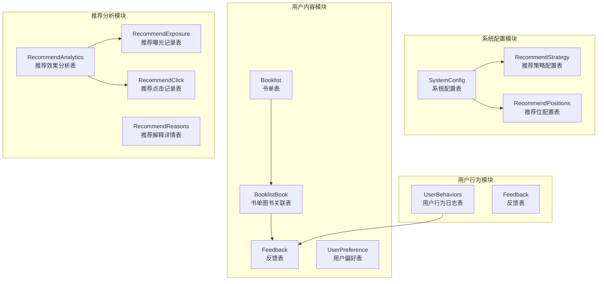
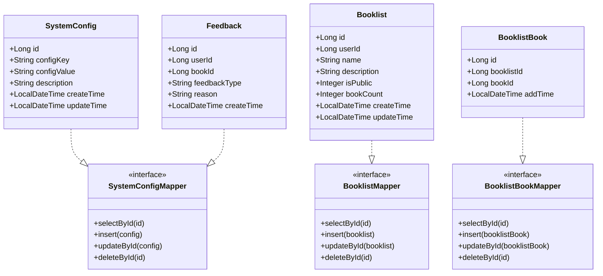
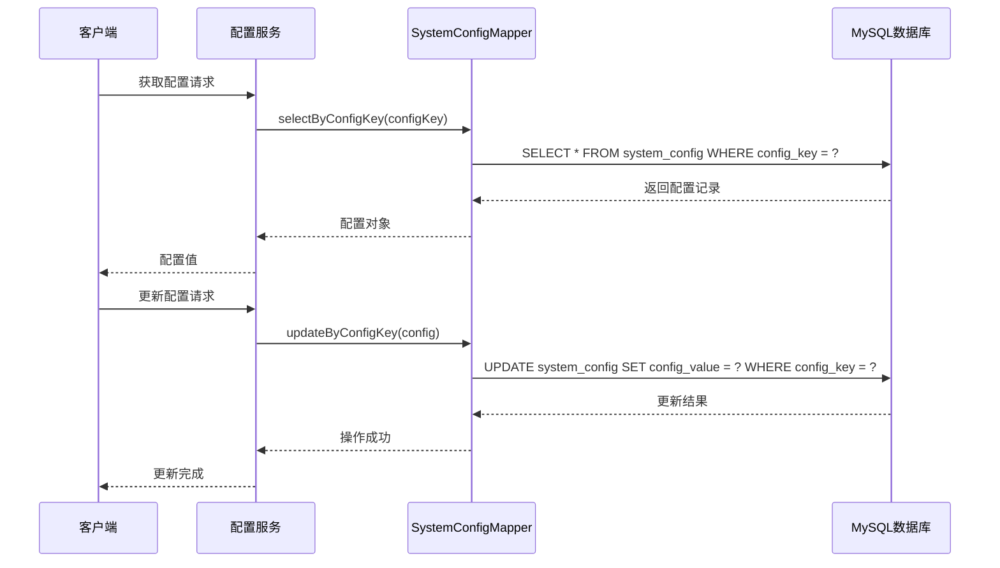
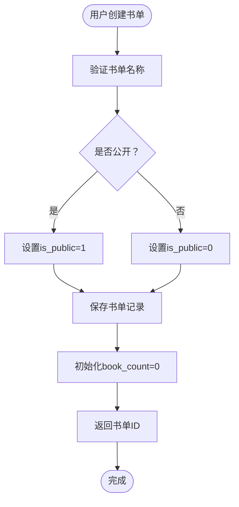
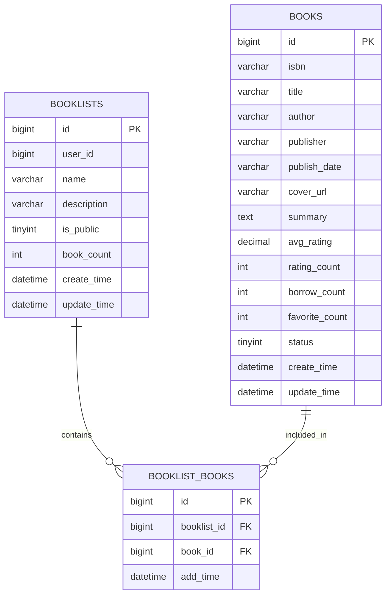
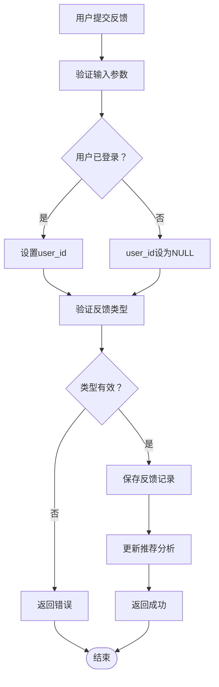
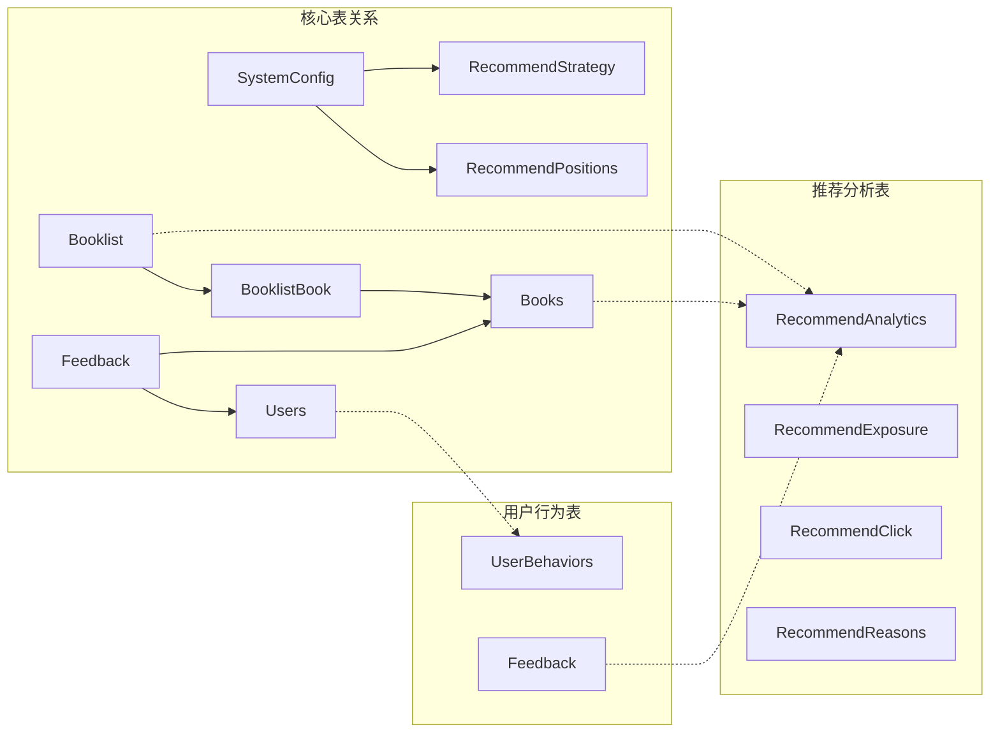

# 系统配置表设计

<cite>
**本文档引用的文件**
- [SystemConfig.java](file://src/main/java/org/example/backend/entity/SystemConfig.java)
- [Booklist.java](file://src/main/java/org/example/backend/entity/Booklist.java)
- [BooklistBook.java](file://src/main/java/org/example/backend/entity/BooklistBook.java)
- [Feedback.java](file://src/main/java/org/example/backend/entity/Feedback.java)
- [data_library126_db.sql](file://src/main/resources/data_library126_db.sql)
- [SystemConfigMapper.java](file://src/main/java/org/example/backend/modules/admin/repository/SystemConfigMapper.java)
- [BooklistMapper.java](file://src/main/java/org/example/backend/modules/user/repository/BooklistMapper.java)
- [BooklistBookMapper.java](file://src/main/java/org/example/backend/modules/user/repository/BooklistBookMapper.java)
</cite>

## 目录
1. [简介](#简介)
2. [项目结构](#项目结构)
3. [核心组件](#核心组件)
4. [架构概览](#架构概览)
5. [详细组件分析](#详细组件分析)
6. [依赖关系分析](#依赖关系分析)
7. [性能考虑](#性能考虑)
8. [故障排除指南](#故障排除指南)
9. [结论](#结论)

## 简介

本文档详细描述智能图书推荐系统的数据库表结构设计，重点涵盖系统配置表、书单表、书单图书关联表和反馈表的设计方案。该系统采用MySQL数据库，通过MyBatis-Plus框架实现ORM映射，支持智能图书推荐、用户个性化配置和内容管理功能。

系统采用分层架构设计，包括数据访问层、业务逻辑层和表现层，确保系统的可维护性和扩展性。数据库设计遵循第三范式，合理设置索引和约束，优化查询性能和数据完整性。

## 项目结构

智能图书推荐系统的数据库设计采用模块化组织方式，主要包含以下核心模块：

**图表来源**
- [data_library126_db.sql](file://src/main/resources/data_library126_db.sql#L833-L854)
- [data_library126_db.sql](file://src/main/resources/data_library126_db.sql#L244-L260)
- [data_library126_db.sql](file://src/main/resources/data_library126_db.sql#L222-L236)
- [data_library126_db.sql](file://src/main/resources/data_library126_db.sql#L413-L428)

**章节来源**
- [data_library126_db.sql](file://src/main/resources/data_library126_db.sql#L833-L854)
- [data_library126_db.sql](file://src/main/resources/data_library126_db.sql#L244-L260)
- [data_library126_db.sql](file://src/main/resources/data_library126_db.sql#L222-L236)
- [data_library126_db.sql](file://src/main/resources/data_library126_db.sql#L413-L428)

## 核心组件

系统配置表设计采用统一的配置管理模式，支持动态参数调整和运行时配置更新。每个配置项都包含唯一标识、值存储和描述信息，便于系统管理和维护。

书单功能模块提供用户个性化内容管理能力，支持公开/私有设置、图书数量统计和时间戳管理。书单与图书的多对多关联通过中间表实现，支持灵活的内容组合和检索。

反馈收集机制设计完善，支持多种反馈类型和原因分类，为推荐算法优化和内容质量控制提供数据支撑。

**章节来源**
- [SystemConfig.java](file://src/main/java/org/example/backend/entity/SystemConfig.java#L10-L47)
- [Booklist.java](file://src/main/java/org/example/backend/entity/Booklist.java#L10-L57)
- [BooklistBook.java](file://src/main/java/org/example/backend/entity/BooklistBook.java#L10-L37)
- [Feedback.java](file://src/main/java/org/example/backend/entity/Feedback.java#L10-L47)

## 架构概览

系统采用分层架构设计，数据库层通过MyBatis-Plus实现ORM映射，业务层提供完整的CRUD操作和复杂查询功能，服务层封装业务逻辑和事务管理。

**图表来源**
- [SystemConfig.java](file://src/main/java/org/example/backend/entity/SystemConfig.java#L13-L47)
- [Booklist.java](file://src/main/java/org/example/backend/entity/Booklist.java#L13-L57)
- [BooklistBook.java](file://src/main/java/org/example/backend/entity/BooklistBook.java#L13-L37)
- [Feedback.java](file://src/main/java/org/example/backend/entity/Feedback.java#L13-L47)
- [SystemConfigMapper.java](file://src/main/java/org/example/backend/modules/admin/repository/SystemConfigMapper.java#L10-L12)
- [BooklistMapper.java](file://src/main/java/org/example/backend/modules/user/repository/BooklistMapper.java#L10-L11)
- [BooklistBookMapper.java](file://src/main/java/org/example/backend/modules/user/repository/BooklistBookMapper.java#L10-L11)

## 详细组件分析

### 系统配置表(SystemConfig)设计

系统配置表采用统一的配置管理模式，支持动态参数调整和运行时配置更新。表结构设计充分考虑了配置项的唯一性和可检索性。

**表结构设计**

| 字段名 | 数据类型 | 约束条件 | 描述 |
|--------|----------|----------|------|
| id | bigint | PRIMARY KEY, AUTO_INCREMENT | 配置项主键ID |
| config_key | varchar(100) | UNIQUE, NOT NULL | 配置键名，唯一标识配置项 |
| config_value | varchar(500) | NULL | 配置值，支持字符串、JSON等格式 |
| description | varchar(255) | NULL | 配置项描述信息 |
| create_time | datetime | DEFAULT CURRENT_TIMESTAMP | 创建时间戳 |
| update_time | datetime | DEFAULT CURRENT_TIMESTAMP ON UPDATE CURRENT_TIMESTAMP | 更新时间戳 |

**索引策略**
- 主键索引：PRIMARY KEY (id)
- 唯一索引：UNIQUE INDEX config_key (config_key)
- 辅助索引：INDEX idx_config_key (config_key)

**配置项管理流程**

**图表来源**
- [SystemConfigMapper.java](file://src/main/java/org/example/backend/modules/admin/repository/SystemConfigMapper.java#L10-L12)
- [data_library126_db.sql](file://src/main/resources/data_library126_db.sql#L833-L854)

**章节来源**
- [SystemConfig.java](file://src/main/java/org/example/backend/entity/SystemConfig.java#L13-L47)
- [SystemConfigMapper.java](file://src/main/java/org/example/backend/modules/admin/repository/SystemConfigMapper.java#L10-L12)
- [data_library126_db.sql](file://src/main/resources/data_library126_db.sql#L833-L854)

### 书单表(Booklists)设计

书单表提供用户个性化内容管理功能，支持公开/私有设置和图书数量统计。表结构设计体现了用户内容管理的核心需求。

**表结构设计**

| 字段名 | 数据类型 | 约束条件 | 描述 |
|--------|----------|----------|------|
| id | bigint | PRIMARY KEY, AUTO_INCREMENT | 书单主键ID |
| user_id | bigint | NOT NULL | 关联用户ID，外键约束 |
| name | varchar(100) | NOT NULL | 书单名称，支持中文 |
| description | varchar(500) | NULL | 书单描述信息 |
| is_public | tinyint | DEFAULT 0 | 公开状态：0-私有，1-公开 |
| book_count | int | DEFAULT 0 | 包含图书数量统计 |
| create_time | datetime | DEFAULT CURRENT_TIMESTAMP | 创建时间戳 |
| update_time | datetime | DEFAULT CURRENT_TIMESTAMP ON UPDATE CURRENT_TIMESTAMP | 更新时间戳 |

**索引策略**
- 主键索引：PRIMARY KEY (id)
- 外键索引：INDEX idx_user_id (user_id)
- 辅助索引：INDEX idx_is_public (is_public)

**书单管理流程**

**图表来源**
- [Booklist.java](file://src/main/java/org/example/backend/entity/Booklist.java#L13-L57)
- [BooklistMapper.java](file://src/main/java/org/example/backend/modules/user/repository/BooklistMapper.java#L10-L11)

**章节来源**
- [Booklist.java](file://src/main/java/org/example/backend/entity/Booklist.java#L13-L57)
- [BooklistMapper.java](file://src/main/java/org/example/backend/modules/user/repository/BooklistMapper.java#L10-L11)
- [data_library126_db.sql](file://src/main/resources/data_library126_db.sql#L244-L260)

### 书单图书关联表(Booklist_Books)设计

书单图书关联表实现书单与图书的多对多关系管理，支持灵活的内容组合和高效的关系查询。

**表结构设计**

| 字段名 | 数据类型 | 约束条件 | 描述 |
|--------|----------|----------|------|
| id | bigint | PRIMARY KEY, AUTO_INCREMENT | 关联记录主键ID |
| booklist_id | bigint | NOT NULL | 关联书单ID |
| book_id | bigint | NOT NULL | 关联图书ID |
| add_time | datetime | DEFAULT CURRENT_TIMESTAMP | 添加时间戳 |

**索引策略**
- 主键索引：PRIMARY KEY (id)
- 唯一索引：UNIQUE INDEX uk_booklist_book (booklist_id, book_id)
- 外键索引：INDEX idx_booklist_id (booklist_id), INDEX idx_book_id (book_id)

**关联关系管理**

**图表来源**
- [data_library126_db.sql](file://src/main/resources/data_library126_db.sql#L222-L236)
- [data_library126_db.sql](file://src/main/resources/data_library126_db.sql#L244-L260)
- [data_library126_db.sql](file://src/main/resources/data_library126_db.sql#L268-L295)

**章节来源**
- [BooklistBook.java](file://src/main/java/org/example/backend/entity/BooklistBook.java#L13-L37)
- [BooklistBookMapper.java](file://src/main/java/org/example/backend/modules/user/repository/BooklistBookMapper.java#L10-L11)
- [data_library126_db.sql](file://src/main/resources/data_library126_db.sql#L222-L236)

### 反馈表(Feedback)设计

反馈表收集用户对图书的反馈信息，支持不感兴趣、负面反馈等多种类型，为推荐算法优化提供重要数据。

**表结构设计**

| 字段名 | 数据类型 | 约束条件 | 描述 |
|--------|----------|----------|------|
| id | bigint | PRIMARY KEY, AUTO_INCREMENT | 反馈记录主键ID |
| user_id | bigint | NULL | 关联用户ID，允许匿名反馈 |
| book_id | bigint | NOT NULL | 关联图书ID |
| feedback_type | varchar(50) | NULL | 反馈类型标识 |
| reason | varchar(255) | NULL | 反馈原因说明 |
| create_time | datetime | DEFAULT CURRENT_TIMESTAMP | 创建时间戳 |

**索引策略**
- 主键索引：PRIMARY KEY (id)
- 外键索引：INDEX idx_user_id (user_id), INDEX idx_book_id (book_id)

**反馈处理流程**

**图表来源**
- [Feedback.java](file://src/main/java/org/example/backend/entity/Feedback.java#L13-L47)
- [data_library126_db.sql](file://src/main/resources/data_library126_db.sql#L413-L428)

**章节来源**
- [Feedback.java](file://src/main/java/org/example/backend/entity/Feedback.java#L13-L47)
- [data_library126_db.sql](file://src/main/resources/data_library126_db.sql#L413-L428)

## 依赖关系分析

系统各表之间存在清晰的依赖关系，通过外键约束保证数据一致性和完整性。配置表作为系统参数管理中心，为其他模块提供配置支持。

**图表来源**
- [data_library126_db.sql](file://src/main/resources/data_library126_db.sql#L833-L854)
- [data_library126_db.sql](file://src/main/resources/data_library126_db.sql#L222-L236)
- [data_library126_db.sql](file://src/main/resources/data_library126_db.sql#L413-L428)
- [data_library126_db.sql](file://src/main/resources/data_library126_db.sql#L916-L933)

**章节来源**
- [data_library126_db.sql](file://src/main/resources/data_library126_db.sql#L833-L854)
- [data_library126_db.sql](file://src/main/resources/data_library126_db.sql#L222-L236)
- [data_library126_db.sql](file://src/main/resources/data_library126_db.sql#L413-L428)
- [data_library126_db.sql](file://src/main/resources/data_library126_db.sql#L916-L933)

## 性能考虑

系统在数据库设计层面采用了多项性能优化策略：

**索引优化策略**
- 为高频查询字段建立适当索引，如用户ID、图书ID、配置键等
- 使用复合索引优化多条件查询场景
- 合理使用唯一索引确保数据完整性

**查询优化建议**
- 配置表查询应使用配置键进行精确匹配
- 书单查询应结合用户ID和公开状态进行过滤
- 反馈查询应考虑用户维度和时间维度的组合索引

**数据类型选择**
- 使用合适的数据类型减少存储空间占用
- 对于频繁更新的字段使用适当的默认值
- 合理设置字段长度避免存储浪费

## 故障排除指南

**常见问题及解决方案**

1. **配置项重复问题**
   - 症状：插入配置项时报唯一键冲突
   - 解决：检查config_key是否已存在，使用UPDATE语句更新而非重复INSERT

2. **书单关联异常**
   - 症状：添加图书到书单时报唯一键冲突
   - 解决：检查booklist_id和book_id组合是否已存在

3. **外键约束错误**
   - 症状：删除用户或图书时报外键约束错误
   - 解决：先清理相关关联记录再删除主记录

4. **索引失效问题**
   - 症状：查询性能下降
   - 解决：分析执行计划，检查索引使用情况，必要时重建索引

**章节来源**
- [data_library126_db.sql](file://src/main/resources/data_library126_db.sql#L833-L854)
- [data_library126_db.sql](file://src/main/resources/data_library126_db.sql#L222-L236)
- [data_library126_db.sql](file://src/main/resources/data_library126_db.sql#L413-L428)

## 结论

智能图书推荐系统的数据库表设计充分考虑了系统的功能需求和性能要求。通过合理的表结构设计、索引策略和约束管理，实现了配置项管理、用户书单功能和反馈收集的完整数据支持。

系统采用模块化设计理念，各表职责明确，依赖关系清晰，为后续的功能扩展和性能优化奠定了良好的基础。建议在实际部署中根据业务规模和访问模式进一步优化索引策略和查询性能。