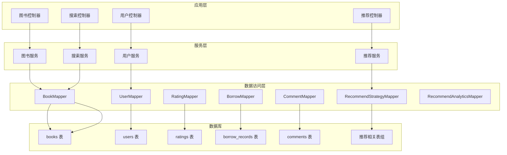
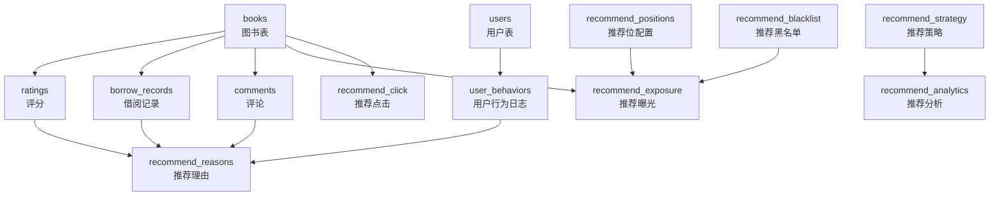
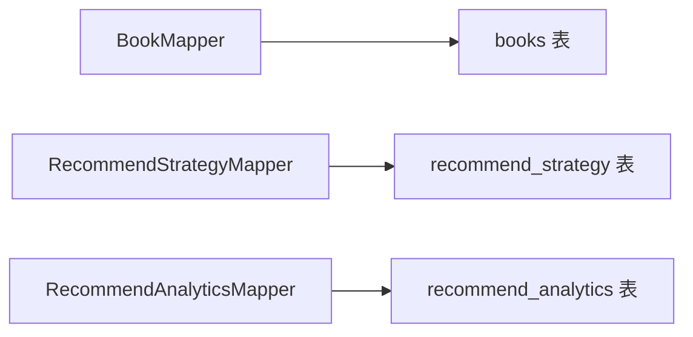

# 索引优化策略

<cite>
**本文档引用的文件**
- [data_library126_db.sql](file://src/main/resources/data_library126_db.sql)
- [Book.java](file://src/main/java/org/example/backend/entity/Book.java)
- [User.java](file://src/main/java/org/example/backend/entity/User.java)
- [Rating.java](file://src/main/java/org/example/backend/entity/Rating.java)
- [BorrowRecord.java](file://src/main/java/org/example/backend/entity/BorrowRecord.java)
- [Comment.java](file://src/main/java/org/example/backend/entity/Comment.java)
- [BookMapper.java](file://src/main/java/org/example/backend/modules/book/repository/BookMapper.java)
- [RecommendStrategyMapper.java](file://src/main/java/org/example/backend/modules/recommend/repository/RecommendStrategyMapper.java)
- [RecommendAnalyticsMapper.java](file://src/main/java/org/example/backend/modules/recommend/repository/RecommendAnalyticsMapper.java)
- [SearchService.java](file://src/main/java/org/example/backend/modules/search/service/SearchService.java)
</cite>

## 目录
1. [简介](#简介)
2. [项目结构](#项目结构)
3. [核心组件](#核心组件)
4. [架构概览](#架构概览)
5. [详细组件分析](#详细组件分析)
6. [依赖分析](#依赖分析)
7. [性能考虑](#性能考虑)
8. [故障排除指南](#故障排除指南)
9. [结论](#结论)
10. [附录](#附录)

## 简介
本文件为智能图书推荐系统制定全面的索引优化策略，基于数据库表结构与查询模式，设计复合索引、全文索引及维护策略，解释不同查询场景下的索引选择原则与性能影响，并提供监控与调优方案，覆盖大数据量场景的最佳实践。

## 项目结构
系统采用分层架构，核心模块包括图书管理、交互行为、推荐系统、搜索服务与用户管理。数据库层面围绕图书、用户、评分、借阅、评论、推荐分析等表展开，配合全文检索与多维索引支撑高并发查询与推荐计算。

**图表来源**
- [BookMapper.java](file://src/main/java/org/example/backend/modules/book/repository/BookMapper.java#L1-L14)
- [RecommendStrategyMapper.java](file://src/main/java/org/example/backend/modules/recommend/repository/RecommendStrategyMapper.java#L1-L14)
- [RecommendAnalyticsMapper.java](file://src/main/java/org/example/backend/modules/recommend/repository/RecommendAnalyticsMapper.java#L1-L14)
- [data_library126_db.sql](file://src/main/resources/data_library126_db.sql#L268-L295)

**章节来源**
- [BookMapper.java](file://src/main/java/org/example/backend/modules/book/repository/BookMapper.java#L1-L14)
- [RecommendStrategyMapper.java](file://src/main/java/org/example/backend/modules/recommend/repository/RecommendStrategyMapper.java#L1-L14)
- [RecommendAnalyticsMapper.java](file://src/main/java/org/example/backend/modules/recommend/repository/RecommendAnalyticsMapper.java#L1-L14)
- [data_library126_db.sql](file://src/main/resources/data_library126_db.sql#L268-L295)

## 核心组件
- 图书表（books）：主键自增，唯一索引（isbn），多列索引（title、author、status、borrow_count），全文索引（title、author、summary）。
- 用户表（users）：主键自增，唯一索引（username、email），多列索引（status）。
- 评分表（ratings）：主键自增，唯一索引（user_id, book_id），普通索引（user_id、book_id）。
- 借阅记录表（borrow_records）：主键自增，多列索引（user_id、book_id、borrow_time、audit_status、expected_return_time）。
- 评论表（comments）：主键自增，多列索引（user_id、book_id、create_time、status）。
- 推荐相关表：推荐策略（recommend_strategy）、推荐分析（recommend_analytics）、推荐曝光/点击（recommend_exposure、recommend_click）、推荐黑名单（recommend_blacklist）、推荐位配置（recommend_positions）、推荐理由（recommend_reasons）等，均具备相应业务字段索引。

**章节来源**
- [data_library126_db.sql](file://src/main/resources/data_library126_db.sql#L268-L295)
- [data_library126_db.sql](file://src/main/resources/data_library126_db.sql#L1037-L1056)
- [data_library126_db.sql](file://src/main/resources/data_library126_db.sql#L436-L462)
- [data_library126_db.sql](file://src/main/resources/data_library126_db.sql#L313-L350)
- [data_library126_db.sql](file://src/main/resources/data_library126_db.sql#L354-L382)
- [data_library126_db.sql](file://src/main/resources/data_library126_db.sql#L787-L802)

## 架构概览
推荐系统以“图书+用户+行为”为核心，结合评分、借阅、评论、浏览等多源数据，通过推荐策略与分析表进行效果追踪与优化。搜索模块利用全文索引实现高效检索。

**图表来源**
- [data_library126_db.sql](file://src/main/resources/data_library126_db.sql#L916-L933)
- [data_library126_db.sql](file://src/main/resources/data_library126_db.sql#L436-L462)
- [data_library126_db.sql](file://src/main/resources/data_library126_db.sql#L313-L350)
- [data_library126_db.sql](file://src/main/resources/data_library126_db.sql#L354-L382)
- [data_library126_db.sql](file://src/main/resources/data_library126_db.sql#L514-L530)
- [data_library126_db.sql](file://src/main/resources/data_library126_db.sql#L552-L568)
- [data_library126_db.sql](file://src/main/resources/data_library126_db.sql#L762-L780)
- [data_library126_db.sql](file://src/main/resources/data_library126_db.sql#L787-L802)
- [data_library126_db.sql](file://src/main/resources/data_library126_db.sql#L734-L755)
- [data_library126_db.sql](file://src/main/resources/data_library126_db.sql#L488-L505)

## 详细组件分析

### 图书表（books）索引策略
- 主键索引：id（自动增长主键，无需额外设计）。
- 唯一索引：isbn（保证唯一性，支持按isbn精确查找）。
- 单列索引：
  - idx_title(title)：支持按书名模糊/精确查询。
  - idx_author(author)：支持按作者查询。
  - idx_status(status)：支持按上下架状态过滤。
  - idx_borrow_count(borrow_count)：支持按借阅热度排序或筛选。
- 全文索引：ft_title_author(summary)：用于全文检索，覆盖标题、作者、摘要，适合搜索服务的关键词匹配与语义检索。

查询模式与索引选择原则：
- 精确查询：isbn、id。
- 范围/排序：borrow_count、status。
- 模糊/全文：title、author、summary（全文索引）。

**章节来源**
- [data_library126_db.sql](file://src/main/resources/data_library126_db.sql#L268-L295)
- [Book.java](file://src/main/java/org/example/backend/entity/Book.java#L1-L95)

### 用户表（users）索引策略
- 主键索引：id。
- 唯一索引：username、email（保障登录与注册的唯一性）。
- 单列索引：status（支持启用/禁用状态过滤）。

查询模式与索引选择原则：
- 登录/注册：username、email（唯一索引）。
- 管理端状态筛选：status。

**章节来源**
- [data_library126_db.sql](file://src/main/resources/data_library126_db.sql#L1037-L1056)
- [User.java](file://src/main/java/org/example/backend/entity/User.java#L1-L64)

### 评分表（ratings）索引策略
- 唯一索引：uk_user_book(user_id, book_id)（确保用户对同一图书仅一次评分）。
- 普通索引：idx_user_id(user_id)、idx_book_id(book_id)。

查询模式与索引选择原则：
- 用户维度：按 user_id 查询个人评分。
- 图书维度：按 book_id 查询评分分布。
- 唯一约束：防止重复评分。

**章节来源**
- [data_library126_db.sql](file://src/main/resources/data_library126_db.sql#L436-L462)
- [Rating.java](file://src/main/java/org/example/backend/entity/Rating.java#L1-L49)

### 借阅记录表（borrow_records）索引策略
- 普通索引：idx_user_id(user_id)、idx_book_id(book_id)、idx_borrow_time(borrow_time)、idx_audit_status(audit_status)、idx_expected_return_time(expected_return_time)。

查询模式与索引选择原则：
- 用户借阅历史：user_id。
- 图书借阅统计：book_id。
- 时间范围统计：borrow_time、expected_return_time。
- 审核状态过滤：audit_status。

**章节来源**
- [data_library126_db.sql](file://src/main/resources/data_library126_db.sql#L313-L350)
- [BorrowRecord.java](file://src/main/java/org/example/backend/entity/BorrowRecord.java#L1-L84)

### 评论表（comments）索引策略
- 普通索引：idx_user_id(user_id)、idx_book_id(book_id)、idx_create_time(create_time)、idx_status(status)。

查询模式与索引选择原则：
- 用户评论历史：user_id。
- 图书评论列表：book_id。
- 评论时效性：create_time。
- 审核状态：status。

**章节来源**
- [data_library126_db.sql](file://src/main/resources/data_library126_db.sql#L354-L382)
- [Comment.java](file://src/main/java/org/example/backend/entity/Comment.java#L1-L59)

### 推荐策略与分析表索引策略
- recommend_strategy：idx_strategy_key(strategy_key)、idx_is_enabled(is_enabled)。
- recommend_analytics：idx_recommend_type(recommend_type)、idx_date(date)、uk_type_date(recommend_type, date)。

查询模式与索引选择原则：
- 策略键查询与启用控制：strategy_key、is_enabled。
- 分析报表：按类型+日期聚合，联合唯一索引保证幂等写入。

**章节来源**
- [data_library126_db.sql](file://src/main/resources/data_library126_db.sql#L787-L802)
- [data_library126_db.sql](file://src/main/resources/data_library126_db.sql#L464-L481)

### 搜索服务接口与全文检索
- SearchService定义了搜索接口，结合books表的全文索引实现高效检索。

查询模式与索引选择原则：
- 关键词检索：利用全文索引快速定位匹配记录。
- 混合/语义检索：可扩展至向量化检索（需额外向量库支持）。

**章节来源**
- [SearchService.java](file://src/main/java/org/example/backend/modules/search/service/SearchService.java#L1-L22)
- [data_library126_db.sql](file://src/main/resources/data_library126_db.sql#L294)

## 依赖分析
- BookMapper作为图书数据访问入口，被多个控制器与服务依赖。
- 推荐策略与分析Mapper分别服务于推荐策略配置与效果分析。
- 各业务表之间通过外键建立关联，索引设计需兼顾查询效率与外键约束。

**图表来源**
- [BookMapper.java](file://src/main/java/org/example/backend/modules/book/repository/BookMapper.java#L1-L14)
- [RecommendStrategyMapper.java](file://src/main/java/org/example/backend/modules/recommend/repository/RecommendStrategyMapper.java#L1-L14)
- [RecommendAnalyticsMapper.java](file://src/main/java/org/example/backend/modules/recommend/repository/RecommendAnalyticsMapper.java#L1-L14)

**章节来源**
- [BookMapper.java](file://src/main/java/org/example/backend/modules/book/repository/BookMapper.java#L1-L14)
- [RecommendStrategyMapper.java](file://src/main/java/org/example/backend/modules/recommend/repository/RecommendStrategyMapper.java#L1-L14)
- [RecommendAnalyticsMapper.java](file://src/main/java/org/example/backend/modules/recommend/repository/RecommendAnalyticsMapper.java#L1-L14)

## 性能考虑
- 复合索引设计原则：
  - 前缀匹配：将选择性高的列放在前（如 user_id 在用户维度查询中优先）。
  - 覆盖查询：在允许范围内尽量让查询走索引，减少回表。
  - 写入成本：避免过多非必要索引，平衡读写性能。
- 全文索引：
  - 适用于大文本检索（title、author、summary），建议定期重建以保持分词质量。
- 时间序列数据：
  - 借阅、评论、曝光/点击等表具有时间戳字段，建议按天分区或定期归档，降低热数据扫描范围。
- 统计与报表：
  - recommend_analytics按日期聚合，建议批量写入并定期清理过期数据。
- 缓存策略：
  - 结合系统配置表中的缓存开关与TTL参数，对热点查询结果进行缓存。

[本节为通用性能指导，无需特定文件引用]

## 故障排除指南
- 索引失效排查：
  - LIKE以通配符开头可能导致索引失效，应改用全文检索或前缀匹配。
  - OR条件中部分列无索引会触发全表扫描，建议拆分为UNION或使用全文索引。
- 查询慢SQL定位：
  - 使用EXPLAIN分析执行计划，关注是否使用覆盖索引、是否存在临时表与文件排序。
- 数据倾斜处理：
  - 对超高频图书或用户，考虑单独索引或分区策略，避免热点阻塞。
- 维护建议：
  - 定期重建碎片化索引，监控索引选择性与存储占用。

[本节为通用故障排除建议，无需特定文件引用]

## 结论
通过对各表的查询模式与现有索引进行系统梳理，建议在保证写入性能的前提下，优先完善高频查询路径的复合索引与全文索引，并结合分区/归档与缓存策略，实现推荐与搜索场景的高性能与可扩展性。

[本节为总结性内容，无需特定文件引用]

## 附录

### 查询场景与索引选择对照表
- 图书检索（搜索服务）
  - 场景：关键词匹配、模糊查询、全文检索
  - 推荐索引：books.ft_title_author
- 图书详情与统计
  - 场景：按id精确查询、按状态/热度筛选
  - 推荐索引：books.pk(id)、books.idx_status、books.idx_borrow_count
- 用户登录/注册
  - 场景：按username/email唯一查询
  - 推荐索引：users.uk_username、users.uk_email
- 用户评分/评论
  - 场景：按用户维度查询评分/评论列表
  - 推荐索引：ratings.uk_user_book、ratings.idx_user_id；comments.idx_user_id
- 借阅记录统计
  - 场景：按用户/图书维度统计、时间范围查询
  - 推荐索引：borrow_records.idx_user_id、borrow_records.idx_book_id、borrow_records.idx_borrow_time
- 推荐策略与分析
  - 场景：按策略键查询、按日期聚合
  - 推荐索引：recommend_strategy.idx_strategy_key、recommend_analytics.idx_date

**章节来源**
- [data_library126_db.sql](file://src/main/resources/data_library126_db.sql#L268-L295)
- [data_library126_db.sql](file://src/main/resources/data_library126_db.sql#L1037-L1056)
- [data_library126_db.sql](file://src/main/resources/data_library126_db.sql#L436-L462)
- [data_library126_db.sql](file://src/main/resources/data_library126_db.sql#L313-L350)
- [data_library126_db.sql](file://src/main/resources/data_library126_db.sql#L464-L481)
- [data_library126_db.sql](file://src/main/resources/data_library126_db.sql#L787-L802)