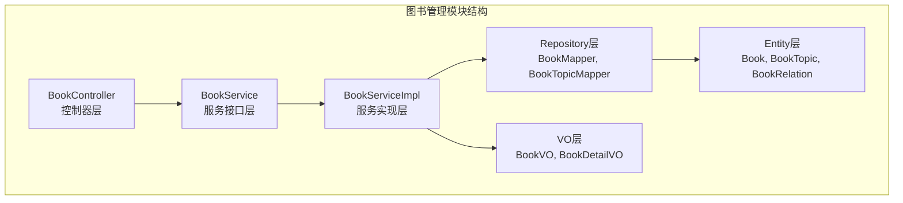
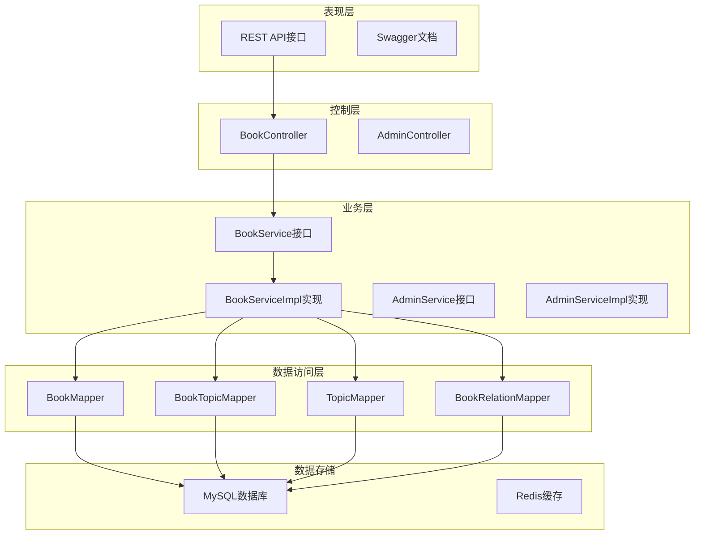
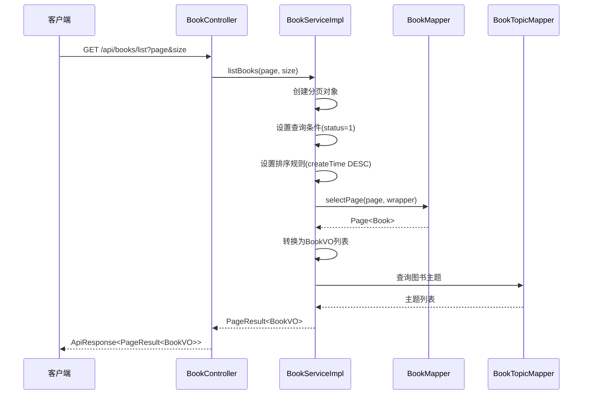
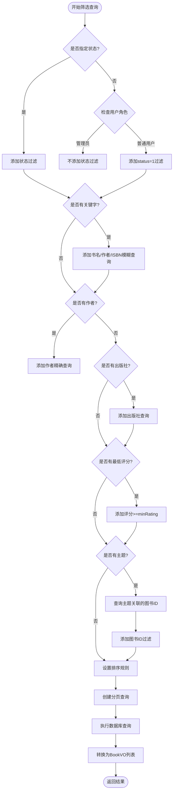
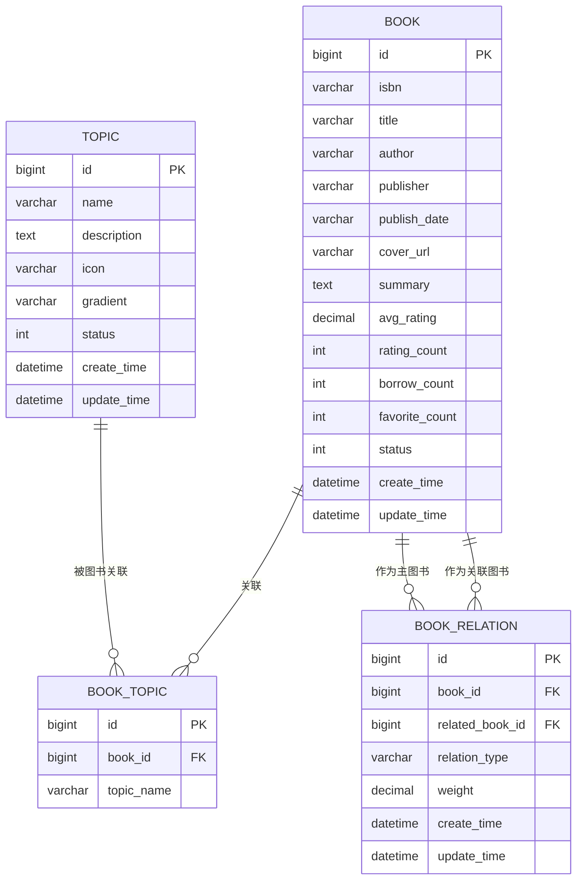
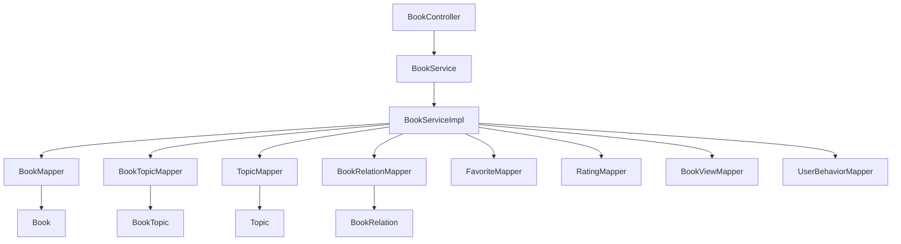

# 图书管理模块

<cite>
**本文档引用的文件**
- [BookController.java](file://src/main/java/org/example/backend/modules/book/controller/BookController.java)
- [BookService.java](file://src/main/java/org/example/backend/modules/book/service/BookService.java)
- [BookServiceImpl.java](file://src/main/java/org/example/backend/modules/book/service/impl/BookServiceImpl.java)
- [BookMapper.java](file://src/main/java/org/example/backend/modules/book/repository/BookMapper.java)
- [BookTopicMapper.java](file://src/main/java/org/example/backend/modules/book/repository/BookTopicMapper.java)
- [TopicMapper.java](file://src/main/java/org/example/backend/modules/book/repository/TopicMapper.java)
- [BookRelationMapper.java](file://src/main/java/org/example/backend/modules/book/repository/BookRelationMapper.java)
- [Book.java](file://src/main/java/org/example/backend/entity/Book.java)
- [BookTopic.java](file://src/main/java/org/example/backend/entity/BookTopic.java)
- [Topic.java](file://src/main/java/org/example/backend/entity/Topic.java)
- [BookRelation.java](file://src/main/java/org/example/backend/entity/BookRelation.java)
- [BookVO.java](file://src/main/java/org/example/backend/vo/book/BookVO.java)
- [BookDetailVO.java](file://src/main/java/org/example/backend/vo/book/BookDetailVO.java)
- [application.yml](file://src/main/resources/application.yml)
- [pom.xml](file://pom.xml)
</cite>

## 目录
1. [简介](#简介)
2. [项目结构](#项目结构)
3. [核心组件](#核心组件)
4. [架构概览](#架构概览)
5. [详细组件分析](#详细组件分析)
6. [依赖关系分析](#依赖关系分析)
7. [性能考虑](#性能考虑)
8. [故障排除指南](#故障排除指南)
9. [结论](#结论)
10. [附录](#附录)

## 简介
图书管理模块是智能图书推荐系统的核心功能模块，负责图书信息的全生命周期管理。该模块实现了完整的图书增删改查功能，支持多维度筛选和排序，提供图书与主题、关联图书的关系建模，并集成了用户交互功能如收藏和评分。

## 项目结构
图书管理模块采用标准的分层架构设计，按照功能域进行模块化组织：

**图表来源**
- [BookController.java](file://src/main/java/org/example/backend/modules/book/controller/BookController.java#L17-L59)
- [BookService.java](file://src/main/java/org/example/backend/modules/book/service/BookService.java#L10-L37)
- [BookServiceImpl.java](file://src/main/java/org/example/backend/modules/book/service/impl/BookServiceImpl.java#L34-L248)

**章节来源**
- [BookController.java](file://src/main/java/org/example/backend/modules/book/controller/BookController.java#L1-L60)
- [BookService.java](file://src/main/java/org/example/backend/modules/book/service/BookService.java#L1-L39)
- [BookServiceImpl.java](file://src/main/java/org/example/backend/modules/book/service/impl/BookServiceImpl.java#L1-L249)

## 核心组件
图书管理模块包含以下核心组件：

### 实体模型
- **Book实体**：图书基本信息，包含ID、ISBN、标题、作者、出版社、出版日期、封面URL、摘要等字段
- **BookTopic实体**：图书与主题的关联表，支持多对多关系
- **Topic实体**：主题信息，包含主题名称、描述、图标等属性
- **BookRelation实体**：图书关联关系，支持相似图书、续集、前传等关系类型

### 视图对象
- **BookVO**：图书列表展示对象，包含基础信息和主题列表
- **BookDetailVO**：图书详情对象，继承BookVO并添加收藏状态和用户评分

### 仓储层
- **BookMapper**：图书数据访问接口
- **BookTopicMapper**：图书主题关联数据访问接口
- **TopicMapper**：主题数据访问接口
- **BookRelationMapper**：图书关联关系数据访问接口

**章节来源**
- [Book.java](file://src/main/java/org/example/backend/entity/Book.java#L11-L95)
- [BookTopic.java](file://src/main/java/org/example/backend/entity/BookTopic.java#L8-L32)
- [Topic.java](file://src/main/java/org/example/backend/entity/Topic.java#L10-L60)
- [BookRelation.java](file://src/main/java/org/example/backend/entity/BookRelation.java#L10-L54)
- [BookVO.java](file://src/main/java/org/example/backend/vo/book/BookVO.java#L7-L29)
- [BookDetailVO.java](file://src/main/java/org/example/backend/vo/book/BookDetailVO.java#L8-L26)

## 架构概览
图书管理模块采用经典的三层架构模式，实现了清晰的职责分离：

**图表来源**
- [BookController.java](file://src/main/java/org/example/backend/modules/book/controller/BookController.java#L17-L59)
- [BookService.java](file://src/main/java/org/example/backend/modules/book/service/BookService.java#L10-L37)
- [BookServiceImpl.java](file://src/main/java/org/example/backend/modules/book/service/impl/BookServiceImpl.java#L34-L248)
- [application.yml](file://src/main/resources/application.yml#L10-L43)

## 详细组件分析

### 图书控制器 (BookController)
控制器层负责HTTP请求的接收和响应的封装，提供了完整的图书管理API：

#### 核心接口
- **分页查询图书列表** (`GET /api/books/list`)
  - 参数：page(默认1)、size(默认10)
  - 功能：获取上架图书的分页列表
  - 返回：PageResult<BookVO>

- **多条件筛选查询** (`GET /api/books/filter`)
  - 支持参数：keyword、topic、author、publisher、minRating、sortBy、status
  - 排序选项：createTime(默认)、borrowCount、avgRating
  - 权限控制：管理员可查看所有状态，普通用户仅能看到上架图书

- **获取图书详情** (`GET /api/books/detail/{bookId}`)
  - 功能：获取图书详细信息，包含收藏状态和用户评分
  - 特殊：自动记录图书浏览行为

**章节来源**
- [BookController.java](file://src/main/java/org/example/backend/modules/book/controller/BookController.java#L25-L57)

### 图书服务实现 (BookServiceImpl)
服务层实现了复杂的业务逻辑，包括数据查询、权限验证、关系处理等功能。

#### 列表查询实现

**图表来源**
- [BookServiceImpl.java](file://src/main/java/org/example/backend/modules/book/service/impl/BookServiceImpl.java#L55-L76)
- [BookMapper.java](file://src/main/java/org/example/backend/modules/book/repository/BookMapper.java#L10-L12)

#### 筛选查询算法
筛选查询实现了多维度的复杂查询逻辑：

**图表来源**
- [BookServiceImpl.java](file://src/main/java/org/example/backend/modules/book/service/impl/BookServiceImpl.java#L78-L173)

#### 权限控制机制
服务层实现了基于角色的权限控制：

- **管理员权限**：可以查看所有状态的图书（包括下架），支持status参数
- **普通用户权限**：只能看到status=1的图书，忽略status参数
- **未登录用户**：按普通用户权限处理

**章节来源**
- [BookServiceImpl.java](file://src/main/java/org/example/backend/modules/book/service/impl/BookServiceImpl.java#L82-L98)

### 数据模型关系
图书管理模块的数据模型采用了规范化的数据库设计：

**图表来源**
- [Book.java](file://src/main/java/org/example/backend/entity/Book.java#L14-L92)
- [BookTopic.java](file://src/main/java/org/example/backend/entity/BookTopic.java#L12-L29)
- [Topic.java](file://src/main/java/org/example/backend/entity/Topic.java#L14-L56)
- [BookRelation.java](file://src/main/java/org/example/backend/entity/BookRelation.java#L14-L51)

**章节来源**
- [Book.java](file://src/main/java/org/example/backend/entity/Book.java#L1-L95)
- [BookTopic.java](file://src/main/java/org/example/backend/entity/BookTopic.java#L1-L32)
- [Topic.java](file://src/main/java/org/example/backend/entity/Topic.java#L1-L60)
- [BookRelation.java](file://src/main/java/org/example/backend/entity/BookRelation.java#L1-L54)

## 依赖关系分析

### 组件依赖图

**图表来源**
- [BookController.java](file://src/main/java/org/example/backend/modules/book/controller/BookController.java#L22-L23)
- [BookServiceImpl.java](file://src/main/java/org/example/backend/modules/book/service/impl/BookServiceImpl.java#L37-L53)

### 外部依赖
系统使用了多种外部技术和框架：

- **Spring Boot 2.6.13**：应用框架和依赖注入
- **MyBatis-Plus 3.5.3**：ORM框架，提供强大的数据访问能力
- **MySQL 8.0.33**：关系型数据库存储
- **JWT 0.11.5**：认证授权机制
- **SpringDoc OpenAPI 1.6.14**：API文档生成
- **Redis**：可选缓存支持

**章节来源**
- [pom.xml](file://pom.xml#L19-L102)
- [application.yml](file://src/main/resources/application.yml#L10-L43)

## 性能考虑

### 查询优化策略
1. **索引优化**：建议在常用查询字段上建立索引
   - `books.status`：状态查询
   - `books.title`：书名搜索
   - `books.author`：作者查询
   - `books.isbn`：ISBN查询
   - `book_topics.topic_name`：主题关联查询

2. **分页查询**：使用MyBatis-Plus的分页插件，避免全表扫描

3. **批量查询**：在获取图书列表时，使用IN查询减少数据库往返

4. **缓存策略**：
   - 热门图书信息缓存
   - 主题列表缓存
   - 图书详情缓存（短期）

### 性能监控
- **慢查询日志**：开启MySQL慢查询日志
- **连接池监控**：监控数据库连接使用情况
- **内存使用**：监控应用内存使用情况

## 故障排除指南

### 常见问题及解决方案

#### 数据库连接问题
**症状**：应用启动时报数据库连接错误
**解决方案**：
1. 检查数据库服务是否启动
2. 验证连接字符串配置
3. 确认用户名密码正确

#### 权限相关问题
**症状**：普通用户看不到图书或管理员无法查看下架图书
**解决方案**：
1. 检查用户角色设置
2. 验证UserContext中的角色信息
3. 确认权限验证逻辑

#### 查询性能问题
**症状**：图书查询响应缓慢
**解决方案**：
1. 添加适当的数据库索引
2. 优化复杂查询条件
3. 考虑引入缓存机制

**章节来源**
- [BookServiceImpl.java](file://src/main/java/org/example/backend/modules/book/service/impl/BookServiceImpl.java#L242-L246)

## 结论
图书管理模块实现了完整的图书生命周期管理功能，具有以下特点：

1. **架构清晰**：采用标准的分层架构，职责分离明确
2. **功能完整**：支持图书的增删改查、多维度筛选、排序等功能
3. **扩展性强**：模块化设计便于功能扩展和维护
4. **性能优化**：实现了查询优化和缓存策略
5. **安全可靠**：内置权限控制和异常处理机制

该模块为整个智能图书推荐系统奠定了坚实的基础，为后续的功能扩展提供了良好的技术支撑。

## 附录

### API接口文档

#### 图书列表查询
- **URL**：`GET /api/books/list`
- **参数**：
  - `page`：页码，默认1
  - `size`：每页数量，默认10
- **响应**：分页的图书列表

#### 多条件筛选查询
- **URL**：`GET /api/books/filter`
- **参数**：
  - `keyword`：关键字（书名、作者、ISBN）
  - `topic`：主题名称
  - `author`：作者
  - `publisher`：出版社
  - `minRating`：最低评分
  - `sortBy`：排序方式（createTime/borrowCount/avgRating）
  - `status`：图书状态（管理员可用）
  - `page`：页码，默认1
  - `size`：每页数量，默认10
- **响应**：分页的图书列表

#### 图书详情查询
- **URL**：`GET /api/books/detail/{bookId}`
- **路径参数**：
  - `bookId`：图书ID
- **响应**：图书详细信息，包含收藏状态和用户评分

### 扩展指导

#### 新增字段步骤
1. 在对应实体类中添加新字段
2. 更新数据库表结构
3. 修改Mapper接口和XML映射
4. 更新VO对象以包含新字段
5. 在Service层处理新字段的业务逻辑

#### 自定义搜索条件
1. 在BookService接口中添加新的方法签名
2. 在BookServiceImpl中实现具体的查询逻辑
3. 在BookController中添加对应的API接口
4. 更新Swagger文档注释

#### 缓存策略实施
1. 在application.yml中配置Redis连接
2. 在Service层添加缓存注解
3. 实现缓存失效策略
4. 监控缓存命中率

**章节来源**
- [BookController.java](file://src/main/java/org/example/backend/modules/book/controller/BookController.java#L25-L57)
- [BookService.java](file://src/main/java/org/example/backend/modules/book/service/BookService.java#L12-L36)
- [application.yml](file://src/main/resources/application.yml#L31-L43)