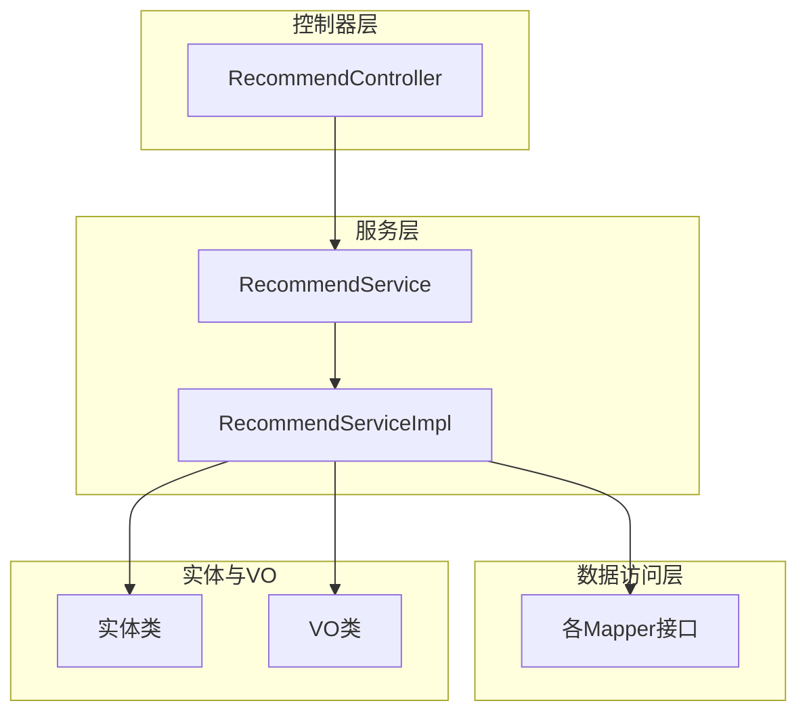
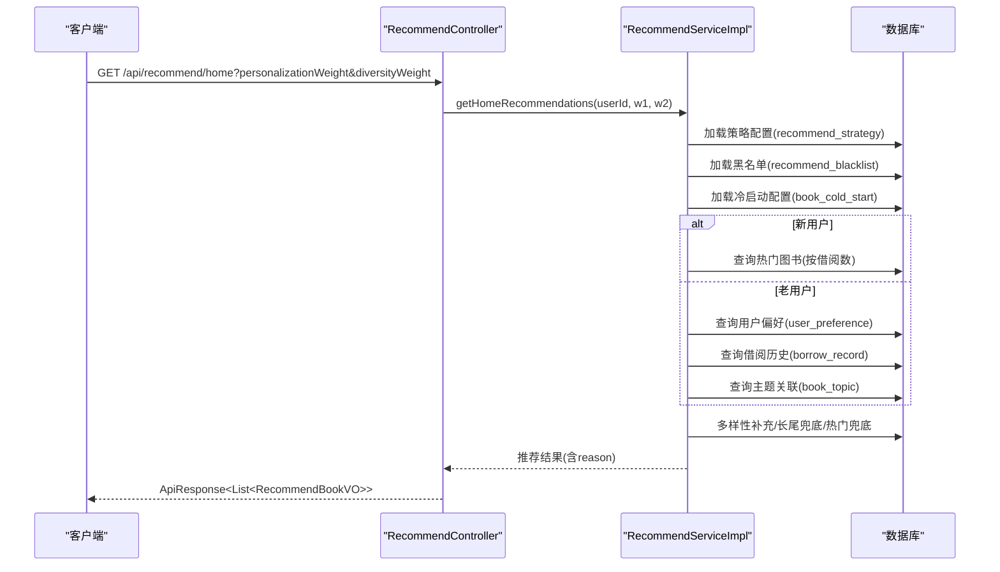
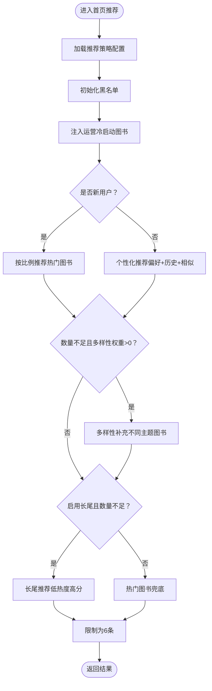
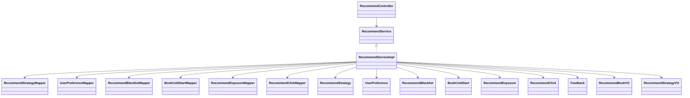

# 推荐系统模块

<cite>
**本文引用的文件**
- [RecommendController.java](file://src/main/java/org/example/backend/modules/recommend/controller/RecommendController.java)
- [RecommendService.java](file://src/main/java/org/example/backend/modules/recommend/service/RecommendService.java)
- [RecommendServiceImpl.java](file://src/main/java/org/example/backend/modules/recommend/service/impl/RecommendServiceImpl.java)
- [RecommendStrategyMapper.java](file://src/main/java/org/example/backend/modules/recommend/repository/RecommendStrategyMapper.java)
- [RecommendStrategy.java](file://src/main/java/org/example/backend/entity/RecommendStrategy.java)
- [UserPreference.java](file://src/main/java/org/example/backend/entity/UserPreference.java)
- [RecommendBlacklist.java](file://src/main/java/org/example/backend/entity/RecommendBlacklist.java)
- [BookColdStart.java](file://src/main/java/org/example/backend/entity/BookColdStart.java)
- [RecommendExposure.java](file://src/main/java/org/example/backend/entity/RecommendExposure.java)
- [RecommendClick.java](file://src/main/java/org/example/backend/entity/RecommendClick.java)
- [Feedback.java](file://src/main/java/org/example/backend/entity/Feedback.java)
- [RecommendBookVO.java](file://src/main/java/org/example/backend/vo/recommend/RecommendBookVO.java)
- [RecommendStrategyVO.java](file://src/main/java/org/example/backend/vo/admin/RecommendStrategyVO.java)
- [UserPreferenceMapper.java](file://src/main/java/org/example/backend/modules/recommend/repository/UserPreferenceMapper.java)
- [RecommendBlacklistMapper.java](file://src/main/java/org/example/backend/modules/recommend/repository/RecommendBlacklistMapper.java)
- [BookColdStartMapper.java](file://src/main/java/org/example/backend/modules/recommend/repository/BookColdStartMapper.java)
- [RecommendExposureMapper.java](file://src/main/java/org/example/backend/modules/recommend/repository/RecommendExposureMapper.java)
- [RecommendClickMapper.java](file://src/main/java/org/example/backend/modules/recommend/repository/RecommendClickMapper.java)
</cite>

## 目录
1. [简介](#简介)
2. [项目结构](#项目结构)
3. [核心组件](#核心组件)
4. [架构总览](#架构总览)
5. [详细组件分析](#详细组件分析)
6. [依赖关系分析](#依赖关系分析)
7. [性能考虑](#性能考虑)
8. [故障排查指南](#故障排查指南)
9. [结论](#结论)
10. [附录](#附录)

## 简介
本技术文档聚焦于推荐系统模块，系统性阐述个性化推荐、热门推荐、相似推荐、主题推荐、长尾推荐与冷启动处理的算法实现原理；详解推荐策略配置、用户偏好建模、推荐结果排序与融合策略；解释推荐算法的评估指标、A/B测试机制与实时反馈闭环；并提供推荐API接口文档、性能优化与缓存策略、数据同步机制以及扩展与新算法集成方法。

## 项目结构
推荐系统模块采用分层架构：
- 控制器层：对外暴露REST接口，负责参数解析与响应封装
- 服务层：定义推荐能力契约与业务编排
- 实现层：具体算法实现、策略加载、数据访问与结果融合
- 数据访问层：MyBatis-Plus Mapper集合
- 实体与VO：数据模型与输出模型

图表来源
- [RecommendController.java](file://src/main/java/org/example/backend/modules/recommend/controller/RecommendController.java#L1-L130)
- [RecommendService.java](file://src/main/java/org/example/backend/modules/recommend/service/RecommendService.java#L1-L70)
- [RecommendServiceImpl.java](file://src/main/java/org/example/backend/modules/recommend/service/impl/RecommendServiceImpl.java#L1-L927)

章节来源
- [RecommendController.java](file://src/main/java/org/example/backend/modules/recommend/controller/RecommendController.java#L1-L130)
- [RecommendService.java](file://src/main/java/org/example/backend/modules/recommend/service/RecommendService.java#L1-L70)
- [RecommendServiceImpl.java](file://src/main/java/org/example/backend/modules/recommend/service/impl/RecommendServiceImpl.java#L1-L927)

## 核心组件
- 推荐控制器：提供首页推荐、热门榜、新书、主题、相似推荐、关联阅读、曝光/点击/反馈上报、热门主题、长尾推荐等接口
- 推荐服务接口：定义推荐能力契约
- 推荐服务实现：实现多策略融合、冷启动判定、黑名单过滤、多样性补充、长尾兜底等
- 策略配置：通过recommend_strategy表动态配置权重与比例
- 用户偏好：基于user_preference建模兴趣主题
- 黑名单：基于recommend_blacklist进行场景化过滤
- 冷启动：基于book_cold_start的运营位配置
- 行为日志：曝光、点击、反馈入库，支持离线评估与A/B测试

章节来源
- [RecommendController.java](file://src/main/java/org/example/backend/modules/recommend/controller/RecommendController.java#L1-L130)
- [RecommendService.java](file://src/main/java/org/example/backend/modules/recommend/service/RecommendService.java#L1-L70)
- [RecommendServiceImpl.java](file://src/main/java/org/example/backend/modules/recommend/service/impl/RecommendServiceImpl.java#L1-L927)
- [RecommendStrategy.java](file://src/main/java/org/example/backend/entity/RecommendStrategy.java#L1-L54)
- [UserPreference.java](file://src/main/java/org/example/backend/entity/UserPreference.java#L1-L49)
- [RecommendBlacklist.java](file://src/main/java/org/example/backend/entity/RecommendBlacklist.java#L1-L44)
- [BookColdStart.java](file://src/main/java/org/example/backend/entity/BookColdStart.java#L1-L48)
- [RecommendExposure.java](file://src/main/java/org/example/backend/entity/RecommendExposure.java#L1-L49)
- [RecommendClick.java](file://src/main/java/org/example/backend/entity/RecommendClick.java#L1-L49)
- [Feedback.java](file://src/main/java/org/example/backend/entity/Feedback.java#L1-L49)
- [RecommendBookVO.java](file://src/main/java/org/example/backend/vo/recommend/RecommendBookVO.java#L1-L42)
- [RecommendStrategyVO.java](file://src/main/java/org/example/backend/vo/admin/RecommendStrategyVO.java#L1-L42)

## 架构总览
推荐系统以“策略驱动 + 多源融合”的方式组织算法：
- 策略加载：从recommend_strategy表加载权重与比例，支持热更新
- 冷启动：识别新用户，注入运营位冷启动图书，按比例推荐热门图书
- 个性化：基于用户偏好与借阅历史，结合主题相似度与关联阅读
- 多样性：补充不同主题图书，避免信息茧房
- 长尾：在阈值内筛选高分低热度图书，提升内容发现
- 黑名单：按场景与位置过滤，保证运营策略落地
- 行为闭环：曝光/点击/反馈入库，支撑评估与A/B测试

图表来源
- [RecommendController.java](file://src/main/java/org/example/backend/modules/recommend/controller/RecommendController.java#L27-L39)
- [RecommendServiceImpl.java](file://src/main/java/org/example/backend/modules/recommend/service/impl/RecommendServiceImpl.java#L94-L188)
- [RecommendStrategy.java](file://src/main/java/org/example/backend/entity/RecommendStrategy.java#L1-L54)
- [RecommendBlacklist.java](file://src/main/java/org/example/backend/entity/RecommendBlacklist.java#L1-L44)
- [BookColdStart.java](file://src/main/java/org/example/backend/entity/BookColdStart.java#L1-L48)
- [UserPreference.java](file://src/main/java/org/example/backend/entity/UserPreference.java#L1-L49)

## 详细组件分析

### 首页推荐（猜你喜欢）算法
- 流程要点
  - 加载策略配置（个性化权重、多样性权重、冷启动热门比例、长尾比例与阈值、是否启用长尾）
  - 注入运营位冷启动图书（不受是否新用户限制）
  - 新用户：按比例推荐热门图书
  - 老用户：个性化推荐（偏好主题 + 借阅历史主题 + 相似图书）
  - 多样性补充：按权重补充不同主题图书
  - 长尾补充：若启用且数量不足，按阈值与评分补充低热度高分图书
  - 热门兜底：补齐至固定条数
  - 黑名单过滤：按场景与位置过滤
- 关键参数
  - 个性化权重：控制偏好与历史推荐占比
  - 多样性权重：控制主题多样性补充占比
  - 冷启动热门比例：新用户中热门图书占比
  - 长尾比例/阈值：长尾推荐占比与借阅次数阈值
- 输出字段：包含推荐理由reason，便于运营与分析

图表来源
- [RecommendServiceImpl.java](file://src/main/java/org/example/backend/modules/recommend/service/impl/RecommendServiceImpl.java#L94-L188)
- [RecommendStrategyVO.java](file://src/main/java/org/example/backend/vo/admin/RecommendStrategyVO.java#L1-L42)

章节来源
- [RecommendServiceImpl.java](file://src/main/java/org/example/backend/modules/recommend/service/impl/RecommendServiceImpl.java#L94-L188)
- [RecommendStrategyVO.java](file://src/main/java/org/example/backend/vo/admin/RecommendStrategyVO.java#L1-L42)

### 个性化推荐（用户偏好 + 历史）
- 用户偏好建模
  - 从user_preference表读取用户的偏好类型与偏好值（如主题）
  - 基于偏好主题匹配book_topic，统计候选图书得分并排序
- 借阅历史建模
  - 基于用户最近借阅的图书，统计其主题分布，选择出现频次最高的主题
  - 在同一主题下召回其他图书作为相似推荐
- 融合策略
  - 个性化权重控制偏好与历史两路推荐的占比
  - 去重与黑名单过滤，避免重复与运营限制

章节来源
- [RecommendServiceImpl.java](file://src/main/java/org/example/backend/modules/recommend/service/impl/RecommendServiceImpl.java#L216-L314)
- [UserPreference.java](file://src/main/java/org/example/backend/entity/UserPreference.java#L1-L49)
- [UserPreferenceMapper.java](file://src/main/java/org/example/backend/modules/recommend/repository/UserPreferenceMapper.java#L1-L14)

### 热门推荐
- 基于图书借阅次数降序排序，排除黑名单后返回
- 支持场景化黑名单（如首页、热门、新书等）

章节来源
- [RecommendServiceImpl.java](file://src/main/java/org/example/backend/modules/recommend/service/impl/RecommendServiceImpl.java#L510-L523)
- [RecommendBlacklist.java](file://src/main/java/org/example/backend/entity/RecommendBlacklist.java#L1-L44)

### 相似推荐（基于主题）
- 通过book_topic获取目标图书的所有主题
- 在相同主题下召回其他图书，按命中次数计算相似度
- 黑名单过滤后返回，包含相似度百分比作为reason

章节来源
- [RecommendServiceImpl.java](file://src/main/java/org/example/backend/modules/recommend/service/impl/RecommendServiceImpl.java#L547-L602)

### 关联推荐（阅读此书的用户也读）
- 获取借阅过目标图书的用户集合
- 统计这些用户还借阅过的其他图书的借阅重合度
- 黑名单过滤后按重合度排序返回

章节来源
- [RecommendServiceImpl.java](file://src/main/java/org/example/backend/modules/recommend/service/impl/RecommendServiceImpl.java#L604-L656)

### 主题推荐
- 按主题名称查询book_topic，再批量查询图书详情
- 返回图书列表，包含主题标签

章节来源
- [RecommendServiceImpl.java](file://src/main/java/org/example/backend/modules/recommend/service/impl/RecommendServiceImpl.java#L525-L545)

### 长尾推荐（冷门佳作）
- 定义：借阅次数小于等于阈值且平均分高于一定阈值
- 支持运营阈值与比例配置，按评分降序、借阅次数升序排序
- 可与首页推荐融合，按长尾比例补充

章节来源
- [RecommendServiceImpl.java](file://src/main/java/org/example/backend/modules/recommend/service/impl/RecommendServiceImpl.java#L384-L412)
- [RecommendStrategyVO.java](file://src/main/java/org/example/backend/vo/admin/RecommendStrategyVO.java#L27-L34)

### 冷启动处理
- 新用户判定：未完成兴趣引导或借阅记录少于阈值
- 冷启动策略：注入运营位冷启动图书（按手动权重/初始曝光/更新时间排序）
- 冷启动热门比例：控制新用户中热门图书占比

章节来源
- [RecommendServiceImpl.java](file://src/main/java/org/example/backend/modules/recommend/service/impl/RecommendServiceImpl.java#L193-L211)
- [RecommendServiceImpl.java](file://src/main/java/org/example/backend/modules/recommend/service/impl/RecommendServiceImpl.java#L697-L716)
- [BookColdStart.java](file://src/main/java/org/example/backend/entity/BookColdStart.java#L1-L48)

### 推荐策略配置
- 策略键与含义
  - hot_recommend_ratio：热门推荐比例
  - global_diversity_weight：全局多样性权重
  - cold_start_hot_ratio：冷启动新用户热门推荐比例
  - long_tail_ratio：长尾推荐比例
  - long_tail_threshold：长尾阈值
  - enable_long_tail：是否启用长尾
- 默认值：当策略表不可用时，使用默认值回退

章节来源
- [RecommendServiceImpl.java](file://src/main/java/org/example/backend/modules/recommend/service/impl/RecommendServiceImpl.java#L417-L479)
- [RecommendStrategy.java](file://src/main/java/org/example/backend/entity/RecommendStrategy.java#L1-L54)
- [RecommendStrategyMapper.java](file://src/main/java/org/example/backend/modules/recommend/repository/RecommendStrategyMapper.java#L1-L14)
- [RecommendStrategyVO.java](file://src/main/java/org/example/backend/vo/admin/RecommendStrategyVO.java#L1-L42)

### 用户偏好建模
- 偏好类型：topic等
- 偏好值：如“人工智能”
- 权重：0-1，用于个性化推荐融合

章节来源
- [UserPreference.java](file://src/main/java/org/example/backend/entity/UserPreference.java#L1-L49)
- [UserPreferenceMapper.java](file://src/main/java/org/example/backend/modules/recommend/repository/UserPreferenceMapper.java#L1-L14)

### 推荐结果排序与融合
- 多路信号融合：个性化、多样性、长尾、热门
- 权重控制：通过策略配置与请求参数控制
- 去重与黑名单过滤：避免重复与运营限制
- 固定上限：首页推荐限制为6条

章节来源
- [RecommendServiceImpl.java](file://src/main/java/org/example/backend/modules/recommend/service/impl/RecommendServiceImpl.java#L94-L188)

### 实时反馈与评估
- 曝光上报：记录推荐曝光事件
- 点击上报：记录推荐点击事件
- 反馈上报：记录不感兴趣等反馈
- 评估指标：可基于曝光/点击/反馈构建CTR、转化率、留存等指标
- A/B测试：通过策略配置与黑名单实现场景化实验

章节来源
- [RecommendServiceImpl.java](file://src/main/java/org/example/backend/modules/recommend/service/impl/RecommendServiceImpl.java#L658-L692)
- [RecommendExposure.java](file://src/main/java/org/example/backend/entity/RecommendExposure.java#L1-L49)
- [RecommendClick.java](file://src/main/java/org/example/backend/entity/RecommendClick.java#L1-L49)
- [Feedback.java](file://src/main/java/org/example/backend/entity/Feedback.java#L1-L49)

## 依赖关系分析

图表来源
- [RecommendController.java](file://src/main/java/org/example/backend/modules/recommend/controller/RecommendController.java#L1-L130)
- [RecommendService.java](file://src/main/java/org/example/backend/modules/recommend/service/RecommendService.java#L1-L70)
- [RecommendServiceImpl.java](file://src/main/java/org/example/backend/modules/recommend/service/impl/RecommendServiceImpl.java#L1-L927)
- [RecommendStrategyMapper.java](file://src/main/java/org/example/backend/modules/recommend/repository/RecommendStrategyMapper.java#L1-L14)
- [UserPreferenceMapper.java](file://src/main/java/org/example/backend/modules/recommend/repository/UserPreferenceMapper.java#L1-L14)
- [RecommendBlacklistMapper.java](file://src/main/java/org/example/backend/modules/recommend/repository/RecommendBlacklistMapper.java#L1-L13)
- [BookColdStartMapper.java](file://src/main/java/org/example/backend/modules/recommend/repository/BookColdStartMapper.java#L1-L13)
- [RecommendExposureMapper.java](file://src/main/java/org/example/backend/modules/recommend/repository/RecommendExposureMapper.java#L1-L14)
- [RecommendClickMapper.java](file://src/main/java/org/example/backend/modules/recommend/repository/RecommendClickMapper.java#L1-L14)
- [RecommendStrategy.java](file://src/main/java/org/example/backend/entity/RecommendStrategy.java#L1-L54)
- [UserPreference.java](file://src/main/java/org/example/backend/entity/UserPreference.java#L1-L49)
- [RecommendBlacklist.java](file://src/main/java/org/example/backend/entity/RecommendBlacklist.java#L1-L44)
- [BookColdStart.java](file://src/main/java/org/example/backend/entity/BookColdStart.java#L1-L48)
- [RecommendExposure.java](file://src/main/java/org/example/backend/entity/RecommendExposure.java#L1-L49)
- [RecommendClick.java](file://src/main/java/org/example/backend/entity/RecommendClick.java#L1-L49)
- [Feedback.java](file://src/main/java/org/example/backend/entity/Feedback.java#L1-L49)
- [RecommendBookVO.java](file://src/main/java/org/example/backend/vo/recommend/RecommendBookVO.java#L1-L42)
- [RecommendStrategyVO.java](file://src/main/java/org/example/backend/vo/admin/RecommendStrategyVO.java#L1-L42)

## 性能考虑
- 查询优化
  - 合理使用索引：book表的status、borrow_count、avg_rating；book_topic的book_id与topic_name；borrow_record的user_id与book_id；recommend_blacklist的recommend_type与position；recommend_strategy的strategy_key
  - 分页与LIMIT：热点接口使用LIMIT限制返回条数，避免全表扫描
- 缓存策略
  - 策略配置缓存：recommend_strategy按key缓存，定期刷新
  - 主题与热门榜单缓存：热门图书与主题列表可缓存，设置合理TTL
  - 黑名单缓存：按场景与位置维度缓存，降低频繁查询
- 异步与批处理
  - 曝光/点击/反馈写入可异步化，减少主流程阻塞
  - 批量查询：相似推荐与关联推荐使用批量查询减少往返
- 事务与一致性
  - 曝光/点击/反馈写入使用事务，确保原子性
- 限流与熔断
  - 对热点接口增加限流与熔断，保障稳定性

## 故障排查指南
- 推荐结果为空
  - 检查黑名单是否过于严格（按场景与位置过滤）
  - 检查策略配置是否异常（权重为0或阈值过高）
  - 检查图书状态与上下架情况
- 新用户无推荐
  - 检查兴趣引导是否完成
  - 检查冷启动配置是否启用且有效期内
- 个性化效果差
  - 检查用户偏好是否正确入库
  - 检查主题关联是否完整
- 行为数据缺失
  - 检查曝光/点击/反馈接口调用是否成功
  - 检查数据库连接与事务配置

章节来源
- [RecommendServiceImpl.java](file://src/main/java/org/example/backend/modules/recommend/service/impl/RecommendServiceImpl.java#L724-L750)
- [RecommendServiceImpl.java](file://src/main/java/org/example/backend/modules/recommend/service/impl/RecommendServiceImpl.java#L417-L479)
- [RecommendServiceImpl.java](file://src/main/java/org/example/backend/modules/recommend/service/impl/RecommendServiceImpl.java#L658-L692)

## 结论
本推荐系统模块以策略驱动为核心，结合个性化、多样性、长尾与冷启动策略，形成可配置、可演进的推荐流水线。通过黑名单与运营位配置实现策略落地，通过行为日志构建评估与A/B测试基础。建议持续优化查询与缓存策略，完善评估体系，并在保证稳定性的前提下快速迭代推荐算法。

## 附录

### 推荐API接口文档
- 首页推荐（猜你喜欢）
  - 方法与路径：GET /api/recommend/home
  - 参数
    - personalizationWeight：个性化权重（0-1，默认使用策略配置）
    - diversityWeight：多样性权重（0-1，默认使用策略配置）
  - 返回：推荐图书列表（含推荐理由reason）
- 新书抢先看
  - 方法与路径：GET /api/recommend/new
  - 参数：limit（默认10）
  - 返回：图书列表
- 热门排行榜
  - 方法与路径：GET /api/recommend/hot
  - 参数：limit（默认10）
  - 返回：图书列表
- 主题漫游
  - 方法与路径：GET /api/recommend/topic
  - 参数：topic（主题名称）、limit（默认10）
  - 返回：图书列表
- 相似图书推荐
  - 方法与路径：GET /api/recommend/similar/{bookId}
  - 参数：bookId（图书ID）、limit（默认5）
  - 返回：推荐图书列表（含相似度百分比）
- 阅读此书的用户也读
  - 方法与路径：GET /api/recommend/user-also-read/{bookId}
  - 参数：bookId（图书ID）、limit（默认5）
  - 返回：推荐图书列表（含借阅重合度）
- 记录推荐曝光
  - 方法与路径：POST /api/recommend/exposure
  - 参数：bookId、recommendType、position
  - 返回：成功
- 记录推荐点击
  - 方法与路径：POST /api/recommend/click
  - 参数：bookId、recommendType、position
  - 返回：成功
- 反馈（不感兴趣）
  - 方法与路径：POST /api/recommend/feedback
  - 参数：bookId、feedbackType、reason（可选）
  - 返回：成功
- 获取热门主题列表
  - 方法与路径：GET /api/recommend/topics
  - 参数：limit（默认10）
  - 返回：主题列表
- 长尾推荐（冷门佳作）
  - 方法与路径：GET /api/recommend/long-tail
  - 参数：limit（默认10）
  - 返回：推荐图书列表（含评分）

章节来源
- [RecommendController.java](file://src/main/java/org/example/backend/modules/recommend/controller/RecommendController.java#L27-L127)

### 推荐策略配置项说明
- hot_recommend_ratio：热门推荐比例（0-1）
- global_diversity_weight：全局多样性权重（0-1）
- cold_start_hot_ratio：冷启动新用户热门推荐比例（0-1）
- long_tail_ratio：长尾推荐比例（0-1）
- long_tail_threshold：长尾阈值（借阅次数）
- enable_long_tail：是否启用长尾推荐（布尔）

章节来源
- [RecommendStrategyVO.java](file://src/main/java/org/example/backend/vo/admin/RecommendStrategyVO.java#L1-L42)
- [RecommendServiceImpl.java](file://src/main/java/org/example/backend/modules/recommend/service/impl/RecommendServiceImpl.java#L417-L479)

### 推荐结果数据模型
- RecommendBookVO：包含bookId、title、author、coverUrl、avgRating、reason

章节来源
- [RecommendBookVO.java](file://src/main/java/org/example/backend/vo/recommend/RecommendBookVO.java#L1-L42)

### 扩展与新算法集成指导
- 新算法接入步骤
  - 在RecommendService中新增方法签名
  - 在RecommendServiceImpl中实现算法逻辑，遵循现有融合策略
  - 通过recommend_strategy新增策略键，支持在线开关与权重调节
  - 通过黑名单与运营位配置实现灰度与A/B测试
- 评估与监控
  - 基于曝光/点击/反馈构建评估指标
  - 通过埋点与日志完善监控告警

章节来源
- [RecommendService.java](file://src/main/java/org/example/backend/modules/recommend/service/RecommendService.java#L1-L70)
- [RecommendServiceImpl.java](file://src/main/java/org/example/backend/modules/recommend/service/impl/RecommendServiceImpl.java#L1-L927)
- [RecommendStrategy.java](file://src/main/java/org/example/backend/entity/RecommendStrategy.java#L1-L54)