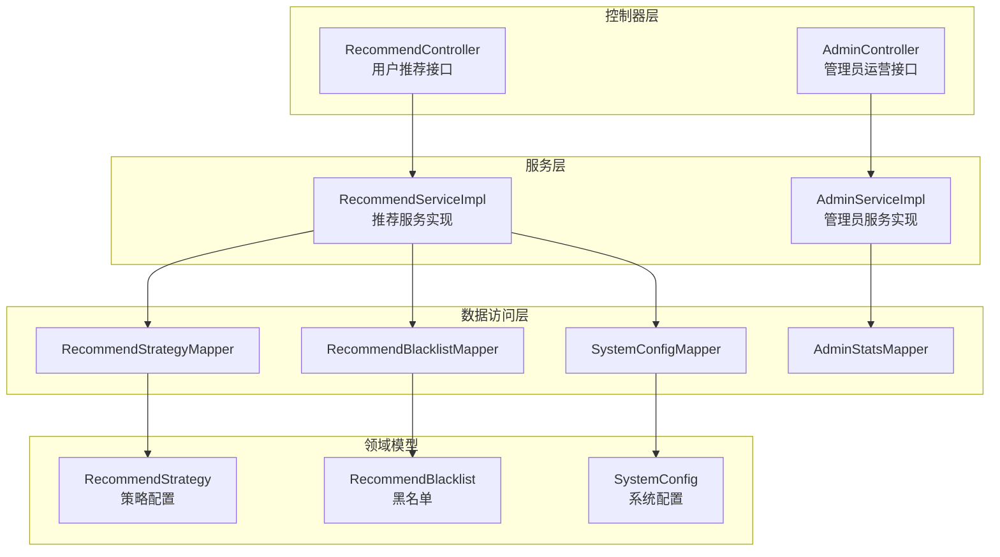
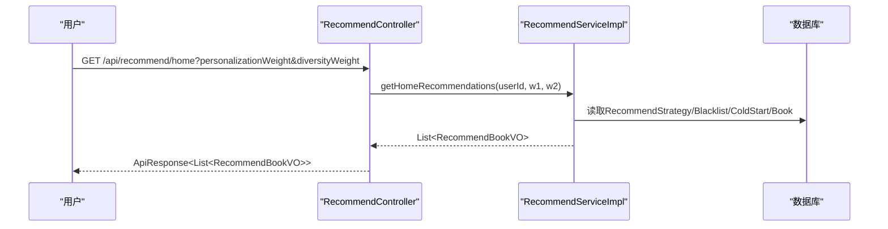
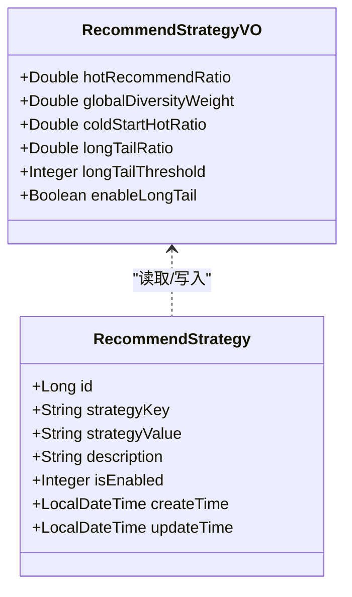
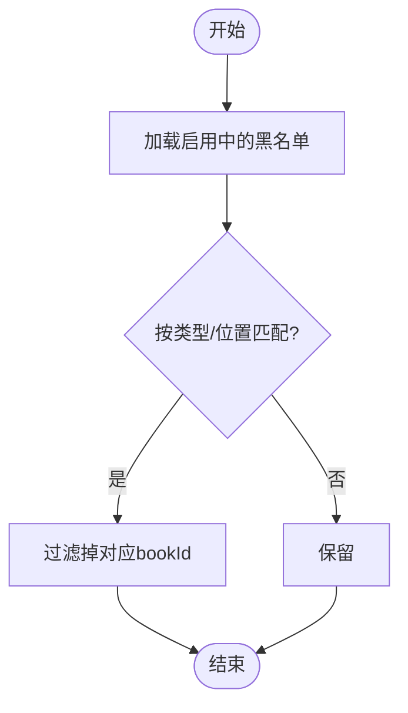
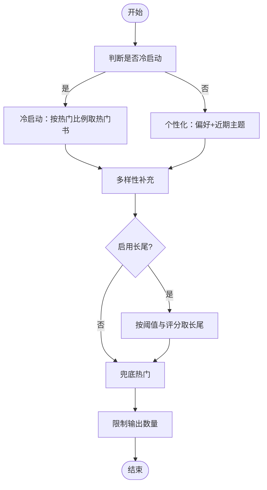
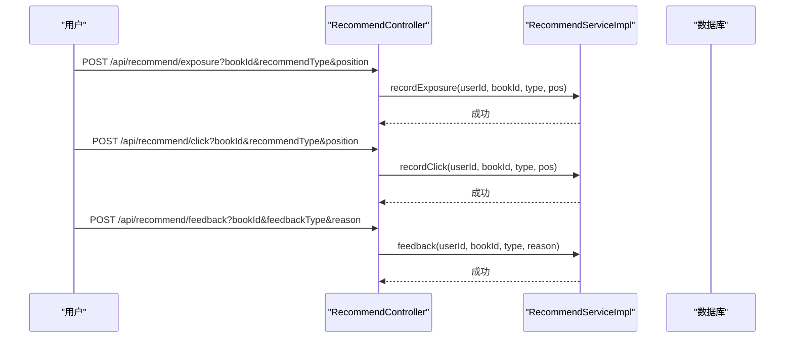
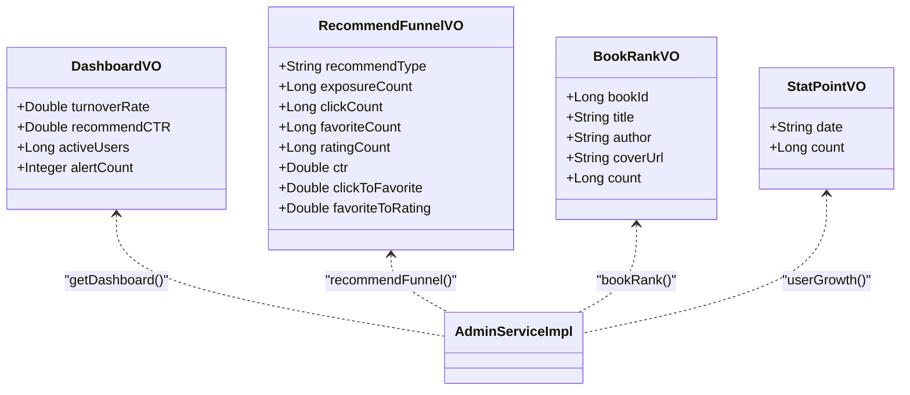
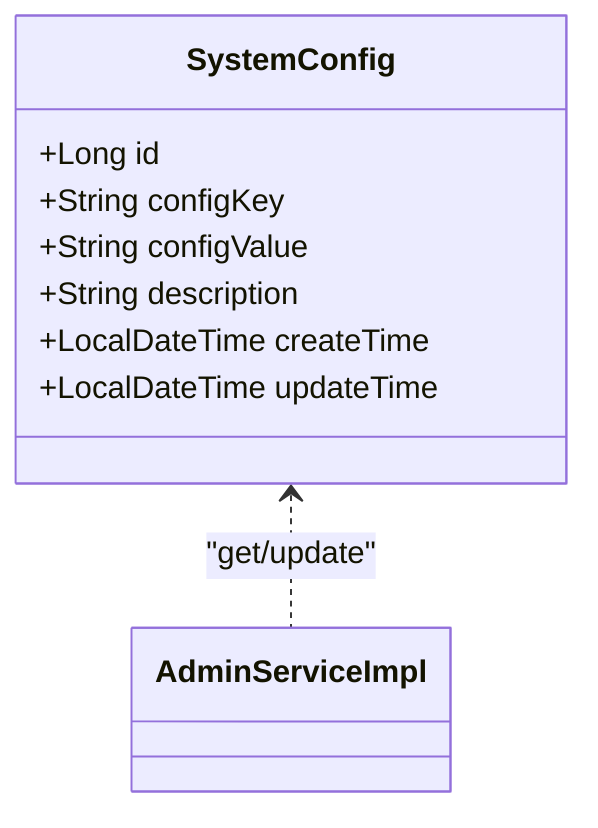
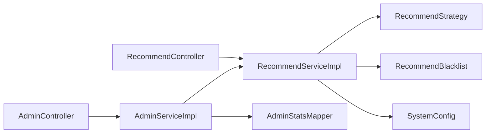

# 推荐运营模块

<cite>
**本文引用的文件**
- [RecommendController.java](file://src/main/java/org/example/backend/modules/recommend/controller/RecommendController.java)
- [RecommendServiceImpl.java](file://src/main/java/org/example/backend/modules/recommend/service/impl/RecommendServiceImpl.java)
- [AdminController.java](file://src/main/java/org/example/backend/modules/admin/controller/AdminController.java)
- [AdminServiceImpl.java](file://src/main/java/org/example/backend/modules/admin/service/impl/AdminServiceImpl.java)
- [RecommendStrategy.java](file://src/main/java/org/example/backend/entity/RecommendStrategy.java)
- [RecommendBlacklist.java](file://src/main/java/org/example/backend/entity/RecommendBlacklist.java)
- [SystemConfig.java](file://src/main/java/org/example/backend/entity/SystemConfig.java)
- [RecommendStrategyVO.java](file://src/main/java/org/example/backend/vo/admin/RecommendStrategyVO.java)
- [DashboardVO.java](file://src/main/java/org/example/backend/vo/admin/DashboardVO.java)
- [RecommendFunnelVO.java](file://src/main/java/org/example/backend/vo/admin/RecommendFunnelVO.java)
- [BookRankVO.java](file://src/main/java/org/example/backend/vo/admin/BookRankVO.java)
- [StatPointVO.java](file://src/main/java/org/example/backend/vo/admin/StatPointVO.java)
- [BlacklistDTO.java](file://src/main/java/org/example/backend/dto/admin/BlacklistDTO.java)
- [AdminStatsMapper.java](file://src/main/java/org/example/backend/modules/admin/repository/AdminStatsMapper.java)
- [application.yml](file://src/main/resources/application.yml)
</cite>

## 目录
1. [简介](#简介)
2. [项目结构](#项目结构)
3. [核心组件](#核心组件)
4. [架构总览](#架构总览)
5. [详细组件分析](#详细组件分析)
6. [依赖关系分析](#依赖关系分析)
7. [性能考量](#性能考量)
8. [故障排查指南](#故障排查指南)
9. [结论](#结论)
10. [附录](#附录)

## 简介
本文件面向推荐运营模块，系统化梳理推荐策略配置、黑名单管理、数据分析统计与运营监控的完整实现。文档覆盖策略配置API、运营报表API、推荐效果分析、用户行为洞察、系统配置管理与黑名单维护等业务逻辑，并提供架构图、序列图与流程图帮助运营人员与开发者快速理解与使用。

## 项目结构
推荐运营模块主要由以下层次构成：
- 控制器层：对外暴露REST API，分别面向普通用户（推荐接口）与管理员（运营与统计接口）
- 服务层：封装推荐算法、策略加载、黑名单过滤、冷启动配置、统计分析等核心逻辑
- 数据访问层：MyBatis-Plus Mapper接口，负责与数据库交互
- VO/DTO/Entity：数据传输与持久化对象，承载策略、黑名单、系统配置、统计结果等结构
- 配置文件：应用运行参数、数据源、Swagger等

图表来源
- [RecommendController.java](file://src/main/java/org/example/backend/modules/recommend/controller/RecommendController.java#L1-L130)
- [AdminController.java](file://src/main/java/org/example/backend/modules/admin/controller/AdminController.java#L1-L314)
- [RecommendServiceImpl.java](file://src/main/java/org/example/backend/modules/recommend/service/impl/RecommendServiceImpl.java#L1-L927)
- [AdminServiceImpl.java](file://src/main/java/org/example/backend/modules/admin/service/impl/AdminServiceImpl.java#L1-L1049)
- [RecommendStrategy.java](file://src/main/java/org/example/backend/entity/RecommendStrategy.java#L1-L54)
- [RecommendBlacklist.java](file://src/main/java/org/example/backend/entity/RecommendBlacklist.java#L1-L44)
- [SystemConfig.java](file://src/main/java/org/example/backend/entity/SystemConfig.java#L1-L49)
- [AdminStatsMapper.java](file://src/main/java/org/example/backend/modules/admin/repository/AdminStatsMapper.java#L1-L65)

章节来源
- [RecommendController.java](file://src/main/java/org/example/backend/modules/recommend/controller/RecommendController.java#L1-L130)
- [AdminController.java](file://src/main/java/org/example/backend/modules/admin/controller/AdminController.java#L1-L314)

## 核心组件
- 推荐控制器：提供首页推荐、热门榜、新书榜、主题推荐、相似推荐、关联阅读、曝光/点击/反馈等接口
- 推荐服务实现：实现多阶段推荐流水线（冷启动、个性化、多样性、长尾、兜底热门），并处理曝光/点击/反馈埋点
- 管理控制器：提供仪表盘、系统配置、评论管理、推荐策略配置、黑名单管理、冷启动配置、数据统计分析等运营能力
- 管理服务实现：封装策略读取/写入、黑名单增删改、冷启动配置、统计分析（用户增长、图书排行、推荐转化漏斗）
- 实体与VO：策略配置、黑名单、系统配置、仪表盘指标、推荐漏斗、图书排行、统计点等

章节来源
- [RecommendController.java](file://src/main/java/org/example/backend/modules/recommend/controller/RecommendController.java#L1-L130)
- [RecommendServiceImpl.java](file://src/main/java/org/example/backend/modules/recommend/service/impl/RecommendServiceImpl.java#L1-L927)
- [AdminController.java](file://src/main/java/org/example/backend/modules/admin/controller/AdminController.java#L1-L314)
- [AdminServiceImpl.java](file://src/main/java/org/example/backend/modules/admin/service/impl/AdminServiceImpl.java#L1-L1049)
- [RecommendStrategy.java](file://src/main/java/org/example/backend/entity/RecommendStrategy.java#L1-L54)
- [RecommendBlacklist.java](file://src/main/java/org/example/backend/entity/RecommendBlacklist.java#L1-L44)
- [SystemConfig.java](file://src/main/java/org/example/backend/entity/SystemConfig.java#L1-L49)
- [RecommendStrategyVO.java](file://src/main/java/org/example/backend/vo/admin/RecommendStrategyVO.java#L1-L42)
- [DashboardVO.java](file://src/main/java/org/example/backend/vo/admin/DashboardVO.java#L1-L32)
- [RecommendFunnelVO.java](file://src/main/java/org/example/backend/vo/admin/RecommendFunnelVO.java#L1-L20)
- [BookRankVO.java](file://src/main/java/org/example/backend/vo/admin/BookRankVO.java#L1-L16)
- [StatPointVO.java](file://src/main/java/org/example/backend/vo/admin/StatPointVO.java#L1-L13)
- [BlacklistDTO.java](file://src/main/java/org/example/backend/dto/admin/BlacklistDTO.java#L1-L32)
- [AdminStatsMapper.java](file://src/main/java/org/example/backend/modules/admin/repository/AdminStatsMapper.java#L1-L65)

## 架构总览
推荐运营模块采用分层架构，控制器负责请求接入与响应封装，服务层承担业务编排与策略执行，数据访问层负责持久化与统计查询。推荐服务在生成推荐时会综合策略配置、黑名单、冷启动配置与用户画像；管理员服务提供运营配置与统计分析能力。

图表来源
- [RecommendController.java](file://src/main/java/org/example/backend/modules/recommend/controller/RecommendController.java#L27-L39)
- [RecommendServiceImpl.java](file://src/main/java/org/example/backend/modules/recommend/service/impl/RecommendServiceImpl.java#L94-L188)

## 详细组件分析

### 推荐策略配置
- 策略键包括：热门推荐比例、全局多样性权重、冷启动热门比例、长尾推荐比例、长尾阈值、是否启用长尾
- 策略加载：服务层按键查询启用状态的策略值，解析为数值或布尔值，作为推荐流水线的权重与阈值
- 管理端API：提供获取与更新策略配置的接口，支持批量更新与幂等写入

图表来源
- [RecommendStrategy.java](file://src/main/java/org/example/backend/entity/RecommendStrategy.java#L1-L54)
- [RecommendStrategyVO.java](file://src/main/java/org/example/backend/vo/admin/RecommendStrategyVO.java#L1-L42)
- [AdminServiceImpl.java](file://src/main/java/org/example/backend/modules/admin/service/impl/AdminServiceImpl.java#L512-L577)
- [RecommendServiceImpl.java](file://src/main/java/org/example/backend/modules/recommend/service/impl/RecommendServiceImpl.java#L417-L479)

章节来源
- [RecommendStrategy.java](file://src/main/java/org/example/backend/entity/RecommendStrategy.java#L1-L54)
- [RecommendStrategyVO.java](file://src/main/java/org/example/backend/vo/admin/RecommendStrategyVO.java#L1-L42)
- [AdminServiceImpl.java](file://src/main/java/org/example/backend/modules/admin/service/impl/AdminServiceImpl.java#L512-L577)
- [RecommendServiceImpl.java](file://src/main/java/org/example/backend/modules/recommend/service/impl/RecommendServiceImpl.java#L417-L479)

### 黑名单管理
- 黑名单维度：图书ID、推荐类型（如home/hot/new/long-tail/similar/also-read）、推荐位（如header/footer/sidebar）、原因、启用状态
- 过滤规则：支持全局匹配（类型/位置为空）与精确匹配；黑名单生效时从候选集中剔除
- 管理端API：分页查询、新增/更新（Upsert）、删除；支持按图书ID、类型、位置筛选

图表来源
- [RecommendBlacklist.java](file://src/main/java/org/example/backend/entity/RecommendBlacklist.java#L1-L44)
- [RecommendServiceImpl.java](file://src/main/java/org/example/backend/modules/recommend/service/impl/RecommendServiceImpl.java#L724-L750)
- [AdminServiceImpl.java](file://src/main/java/org/example/backend/modules/admin/service/impl/AdminServiceImpl.java#L615-L624)
- [BlacklistDTO.java](file://src/main/java/org/example/backend/dto/admin/BlacklistDTO.java#L1-L32)

章节来源
- [RecommendBlacklist.java](file://src/main/java/org/example/backend/entity/RecommendBlacklist.java#L1-L44)
- [RecommendServiceImpl.java](file://src/main/java/org/example/backend/modules/recommend/service/impl/RecommendServiceImpl.java#L724-L750)
- [AdminServiceImpl.java](file://src/main/java/org/example/backend/modules/admin/service/impl/AdminServiceImpl.java#L615-L624)
- [BlacklistDTO.java](file://src/main/java/org/example/backend/dto/admin/BlacklistDTO.java#L1-L32)

### 冷启动与个性化推荐
- 冷启动判定：未完成兴趣引导或借阅量小于阈值的用户视为新用户
- 冷启动策略：优先展示运营配置的图书（考虑手动权重、初始曝光、更新时间排序）
- 个性化策略：基于用户偏好主题与近期借阅主题进行召回与打分
- 多样性补充：在个性化后按主题多样性补充图书，避免信息茧房
- 长尾推荐：在策略允许下补充低热度高评分图书
- 兜底热门：不足时以热门图书补齐

图表来源
- [RecommendServiceImpl.java](file://src/main/java/org/example/backend/modules/recommend/service/impl/RecommendServiceImpl.java#L94-L188)
- [RecommendServiceImpl.java](file://src/main/java/org/example/backend/modules/recommend/service/impl/RecommendServiceImpl.java#L193-L211)
- [RecommendServiceImpl.java](file://src/main/java/org/example/backend/modules/recommend/service/impl/RecommendServiceImpl.java#L697-L716)

章节来源
- [RecommendServiceImpl.java](file://src/main/java/org/example/backend/modules/recommend/service/impl/RecommendServiceImpl.java#L94-L188)
- [RecommendServiceImpl.java](file://src/main/java/org/example/backend/modules/recommend/service/impl/RecommendServiceImpl.java#L193-L211)
- [RecommendServiceImpl.java](file://src/main/java/org/example/backend/modules/recommend/service/impl/RecommendServiceImpl.java#L697-L716)

### 曝光/点击/反馈埋点与运营API
- 曝光/点击/反馈接口：记录推荐曝光、点击、反馈事件，用于后续效果分析
- 预览推荐：管理员可预览不同场景的推荐结果，便于策略验证与A/B测试
- 运营API：支持按场景（首页/热门/新书/长尾）预览，支持权重与限制参数

图表来源
- [RecommendController.java](file://src/main/java/org/example/backend/modules/recommend/controller/RecommendController.java#L82-L113)
- [RecommendServiceImpl.java](file://src/main/java/org/example/backend/modules/recommend/service/impl/RecommendServiceImpl.java#L658-L692)

章节来源
- [RecommendController.java](file://src/main/java/org/example/backend/modules/recommend/controller/RecommendController.java#L82-L113)
- [RecommendServiceImpl.java](file://src/main/java/org/example/backend/modules/recommend/service/impl/RecommendServiceImpl.java#L658-L692)

### 运营监控面板与统计分析
- 仪表盘：馆藏周转率、推荐点击率、活跃用户数、告警数
- 用户增长：按自然日统计新增用户趋势
- 图书排行：基于推荐点击或收藏的图书排行
- 推荐转化漏斗：曝光→点击→收藏→评分，计算各环节转化率

图表来源
- [DashboardVO.java](file://src/main/java/org/example/backend/vo/admin/DashboardVO.java#L1-L32)
- [RecommendFunnelVO.java](file://src/main/java/org/example/backend/vo/admin/RecommendFunnelVO.java#L1-L20)
- [BookRankVO.java](file://src/main/java/org/example/backend/vo/admin/BookRankVO.java#L1-L16)
- [StatPointVO.java](file://src/main/java/org/example/backend/vo/admin/StatPointVO.java#L1-L13)
- [AdminServiceImpl.java](file://src/main/java/org/example/backend/modules/admin/service/impl/AdminServiceImpl.java#L311-L336)
- [AdminServiceImpl.java](file://src/main/java/org/example/backend/modules/admin/service/impl/AdminServiceImpl.java#L706-L763)
- [AdminStatsMapper.java](file://src/main/java/org/example/backend/modules/admin/repository/AdminStatsMapper.java#L1-L65)

章节来源
- [DashboardVO.java](file://src/main/java/org/example/backend/vo/admin/DashboardVO.java#L1-L32)
- [RecommendFunnelVO.java](file://src/main/java/org/example/backend/vo/admin/RecommendFunnelVO.java#L1-L20)
- [BookRankVO.java](file://src/main/java/org/example/backend/vo/admin/BookRankVO.java#L1-L16)
- [StatPointVO.java](file://src/main/java/org/example/backend/vo/admin/StatPointVO.java#L1-L13)
- [AdminServiceImpl.java](file://src/main/java/org/example/backend/modules/admin/service/impl/AdminServiceImpl.java#L311-L336)
- [AdminServiceImpl.java](file://src/main/java/org/example/backend/modules/admin/service/impl/AdminServiceImpl.java#L706-L763)
- [AdminStatsMapper.java](file://src/main/java/org/example/backend/modules/admin/repository/AdminStatsMapper.java#L1-L65)

### 系统配置管理
- 配置项：Redis开关、缓存TTL、模型版本
- 管理端API：获取与更新系统配置，支持幂等写入

图表来源
- [SystemConfig.java](file://src/main/java/org/example/backend/entity/SystemConfig.java#L1-L49)
- [AdminServiceImpl.java](file://src/main/java/org/example/backend/modules/admin/service/impl/AdminServiceImpl.java#L339-L411)

章节来源
- [SystemConfig.java](file://src/main/java/org/example/backend/entity/SystemConfig.java#L1-L49)
- [AdminServiceImpl.java](file://src/main/java/org/example/backend/modules/admin/service/impl/AdminServiceImpl.java#L339-L411)

## 依赖关系分析
- 控制器依赖服务接口；服务实现依赖多个Mapper与实体
- 推荐服务依赖策略、黑名单、冷启动、用户偏好、借阅记录等数据
- 管理服务依赖统计Mapper与推荐服务（用于预览）
- 统计查询通过AdminStatsMapper执行SQL聚合

图表来源
- [RecommendController.java](file://src/main/java/org/example/backend/modules/recommend/controller/RecommendController.java#L1-L130)
- [RecommendServiceImpl.java](file://src/main/java/org/example/backend/modules/recommend/service/impl/RecommendServiceImpl.java#L1-L927)
- [AdminController.java](file://src/main/java/org/example/backend/modules/admin/controller/AdminController.java#L1-L314)
- [AdminServiceImpl.java](file://src/main/java/org/example/backend/modules/admin/service/impl/AdminServiceImpl.java#L1-L1049)
- [RecommendStrategy.java](file://src/main/java/org/example/backend/entity/RecommendStrategy.java#L1-L54)
- [RecommendBlacklist.java](file://src/main/java/org/example/backend/entity/RecommendBlacklist.java#L1-L44)
- [SystemConfig.java](file://src/main/java/org/example/backend/entity/SystemConfig.java#L1-L49)
- [AdminStatsMapper.java](file://src/main/java/org/example/backend/modules/admin/repository/AdminStatsMapper.java#L1-L65)

章节来源
- [RecommendServiceImpl.java](file://src/main/java/org/example/backend/modules/recommend/service/impl/RecommendServiceImpl.java#L33-L67)
- [AdminServiceImpl.java](file://src/main/java/org/example/backend/modules/admin/service/impl/AdminServiceImpl.java#L47-L90)

## 性能考量
- 推荐流水线中涉及多次数据库查询与排序，建议：
  - 对常用键（如用户ID、图书ID、主题名）建立索引
  - 合理设置分页大小与LIMIT上限，避免超大结果集
  - 对热点策略与黑名单进行缓存（可在系统配置中启用Redis）
  - 长尾与多样性补全应控制数量，避免超出前端展示容量
- 统计查询使用原生SQL聚合，建议：
  - 为统计字段建立合适索引（如时间字段、推荐类型）
  - 控制统计周期长度，避免跨年/跨库全表扫描

## 故障排查指南
- 推荐结果异常
  - 检查策略配置是否正确启用与数值合理
  - 核对黑名单是否误命中目标图书
  - 确认冷启动配置是否生效且时间窗口正确
- 曝光/点击/反馈缺失
  - 确认埋点接口调用链路是否正常
  - 检查用户上下文是否正确传递
- 统计数据异常
  - 核对统计Mapper的SQL与时间范围
  - 检查数据库连接与事务提交情况

章节来源
- [RecommendServiceImpl.java](file://src/main/java/org/example/backend/modules/recommend/service/impl/RecommendServiceImpl.java#L417-L479)
- [RecommendServiceImpl.java](file://src/main/java/org/example/backend/modules/recommend/service/impl/RecommendServiceImpl.java#L724-L750)
- [AdminStatsMapper.java](file://src/main/java/org/example/backend/modules/admin/repository/AdminStatsMapper.java#L1-L65)

## 结论
推荐运营模块通过“策略配置—黑名单—冷启动—个性化—多样性—长尾—兜底热门”的多阶段流水线，结合埋点与统计分析，形成闭环的运营体系。管理员可通过仪表盘与报表掌握推荐效果，动态调整策略与黑名单，保障用户体验与运营目标的平衡。

## 附录

### 运营API接口清单
- 用户推荐接口
  - GET /api/recommend/home：首页推荐（猜你喜欢）
  - GET /api/recommend/new：新书抢先看
  - GET /api/recommend/hot：热门排行榜
  - GET /api/recommend/topic：主题漫游
  - GET /api/recommend/similar/{bookId}：相似图书推荐
  - GET /api/recommend/user-also-read/{bookId}：阅读此书的用户也读
  - POST /api/recommend/exposure：记录推荐曝光
  - POST /api/recommend/click：记录推荐点击
  - POST /api/recommend/feedback：反馈（不感兴趣）
  - GET /api/recommend/topics：获取热门主题列表
  - GET /api/recommend/long-tail：长尾推荐（冷门佳作）

- 管理员运营接口
  - GET /api/admin/dashboard：获取仪表盘数据
  - GET /api/admin/system/config：获取系统配置
  - PUT /api/admin/system/config：更新系统配置
  - GET /api/admin/recommend/strategy：获取推荐策略配置
  - PUT /api/admin/recommend/strategy：更新推荐策略配置
  - GET /api/admin/recommend/preview：推荐结果预览
  - GET /api/admin/recommend/blacklist：推荐黑名单列表
  - POST /api/admin/recommend/blacklist：新增/更新推荐黑名单
  - DELETE /api/admin/recommend/blacklist/{id}：删除推荐黑名单
  - GET /api/admin/recommend/cold-start：冷启动管理列表
  - POST /api/admin/recommend/cold-start：新增/更新冷启动配置
  - DELETE /api/admin/recommend/cold-start/{id}：删除冷启动配置
  - GET /api/admin/stats/user-growth：用户增长统计（按天）
  - GET /api/admin/stats/book-rank：图书热度排行（click/favorite）
  - GET /api/admin/stats/recommend-funnel：推荐转化漏斗（点击→收藏→评分）

章节来源
- [RecommendController.java](file://src/main/java/org/example/backend/modules/recommend/controller/RecommendController.java#L27-L127)
- [AdminController.java](file://src/main/java/org/example/backend/modules/admin/controller/AdminController.java#L102-L311)

### 数据模型与字段说明
- 推荐策略配置（RecommendStrategy）
  - 字段：id、strategyKey、strategyValue、description、isEnabled、createTime、updateTime
- 推荐黑名单（RecommendBlacklist）
  - 字段：id、bookId、recommendType、position、reason、isEnabled、createTime
- 系统配置（SystemConfig）
  - 字段：id、configKey、configValue、description、createTime、updateTime
- 推荐策略VO（RecommendStrategyVO）
  - 字段：hotRecommendRatio、globalDiversityWeight、coldStartHotRatio、longTailRatio、longTailThreshold、enableLongTail
- 仪表盘VO（DashboardVO）
  - 字段：turnoverRate、recommendCTR、activeUsers、alertCount
- 推荐漏斗VO（RecommendFunnelVO）
  - 字段：recommendType、exposureCount、clickCount、favoriteCount、ratingCount、ctr、clickToFavorite、favoriteToRating
- 图书排行VO（BookRankVO）
  - 字段：bookId、title、author、coverUrl、count
- 统计点VO（StatPointVO）
  - 字段：date、count
- 黑名单DTO（BlacklistDTO）
  - 字段：bookId、recommendType、position、reason、isEnabled

章节来源
- [RecommendStrategy.java](file://src/main/java/org/example/backend/entity/RecommendStrategy.java#L1-L54)
- [RecommendBlacklist.java](file://src/main/java/org/example/backend/entity/RecommendBlacklist.java#L1-L44)
- [SystemConfig.java](file://src/main/java/org/example/backend/entity/SystemConfig.java#L1-L49)
- [RecommendStrategyVO.java](file://src/main/java/org/example/backend/vo/admin/RecommendStrategyVO.java#L1-L42)
- [DashboardVO.java](file://src/main/java/org/example/backend/vo/admin/DashboardVO.java#L1-L32)
- [RecommendFunnelVO.java](file://src/main/java/org/example/backend/vo/admin/RecommendFunnelVO.java#L1-L20)
- [BookRankVO.java](file://src/main/java/org/example/backend/vo/admin/BookRankVO.java#L1-L16)
- [StatPointVO.java](file://src/main/java/org/example/backend/vo/admin/StatPointVO.java#L1-L13)
- [BlacklistDTO.java](file://src/main/java/org/example/backend/dto/admin/BlacklistDTO.java#L1-L32)

### 系统配置参考
- 数据源与MyBatis-Plus：MySQL驱动、连接URL、账号密码、Mapper位置、驼峰映射、日志输出
- Redis：主机、端口、密码、数据库、超时、连接池
- JWT：密钥、过期时间
- Swagger：OpenAPI文档路径、UI路径
- 文件上传：本地存储路径与访问前缀
- 日志：根级别与包级别日志模式

章节来源
- [application.yml](file://src/main/resources/application.yml#L11-L71)