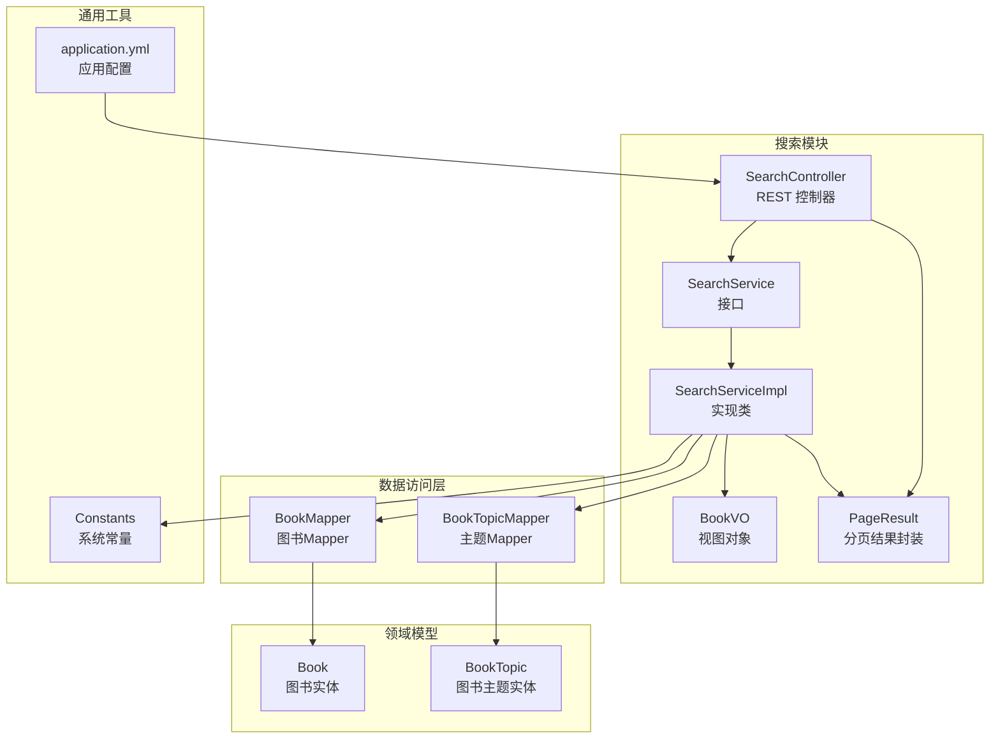
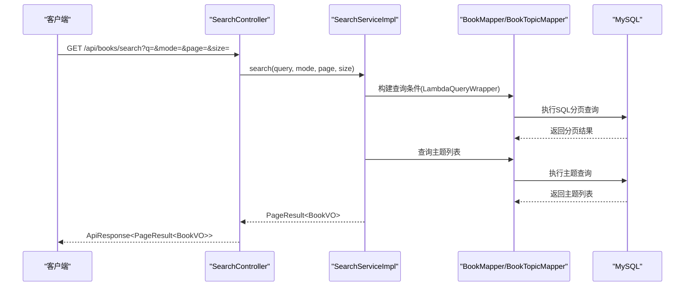
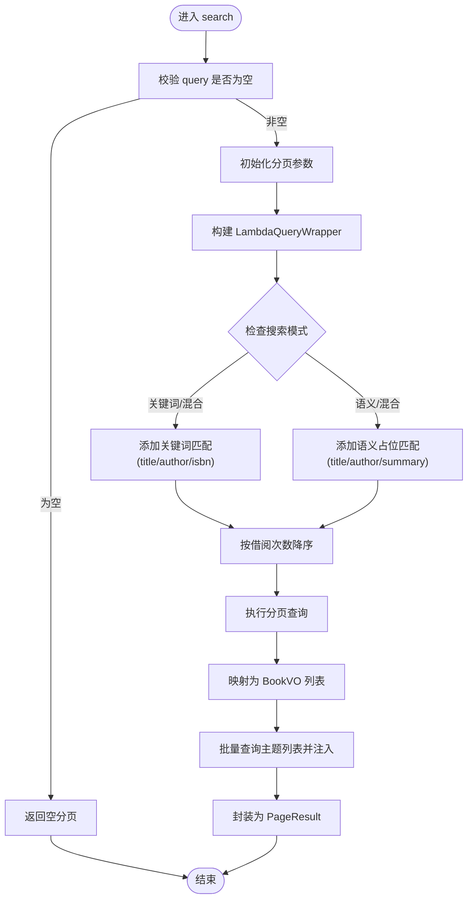
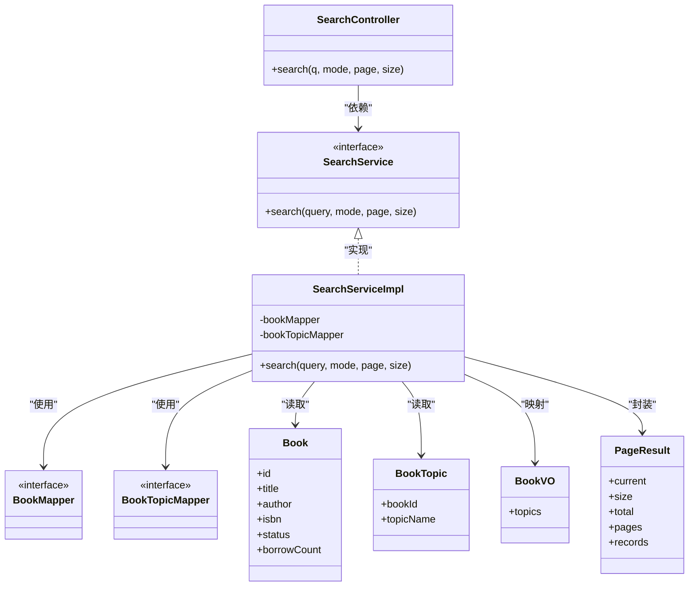

# 搜索模块

<cite>
**本文引用的文件**
- [SearchController.java](file://src/main/java/org/example/backend/modules/search/controller/SearchController.java)
- [SearchService.java](file://src/main/java/org/example/backend/modules/search/service/SearchService.java)
- [SearchServiceImpl.java](file://src/main/java/org/example/backend/modules/search/service/impl/SearchServiceImpl.java)
- [Constants.java](file://src/main/java/org/example/backend/common/constants/Constants.java)
- [Book.java](file://src/main/java/org/example/backend/entity/Book.java)
- [BookTopic.java](file://src/main/java/org/example/backend/entity/BookTopic.java)
- [BookMapper.java](file://src/main/java/org/example/backend/modules/book/repository/BookMapper.java)
- [BookTopicMapper.java](file://src/main/java/org/example/backend/modules/book/repository/BookTopicMapper.java)
- [BookVO.java](file://src/main/java/org/example/backend/vo/book/BookVO.java)
- [PageResult.java](file://src/main/java/org/example/backend/common/PageResult.java)
- [application.yml](file://src/main/resources/application.yml)
- [data_library126_db.sql](file://src/main/resources/data_library126_db.sql)
</cite>

## 目录
1. [简介](#简介)
2. [项目结构](#项目结构)
3. [核心组件](#核心组件)
4. [架构总览](#架构总览)
5. [详细组件分析](#详细组件分析)
6. [依赖分析](#依赖分析)
7. [性能考虑](#性能考虑)
8. [故障排查指南](#故障排查指南)
9. [结论](#结论)
10. [附录](#附录)

## 简介
本技术文档围绕搜索模块展开，系统性阐述当前实现的关键词搜索与混合搜索能力，以及语义搜索的占位实现与扩展路径。文档覆盖搜索索引构建现状、关键词匹配策略、相关性排序机制、结果聚合与分页加载流程，并给出搜索API接口定义、性能优化建议、缓存策略与日志分析方案，最后提供扩展与新算法集成的指导。

## 项目结构
搜索模块位于模块化目录下，采用典型的分层架构：控制器负责接收请求与返回统一响应；服务层实现业务逻辑；数据访问层通过MyBatis-Plus进行数据库操作；实体与VO用于数据传输；分页结果封装统一输出格式。

图表来源
- [SearchController.java](file://src/main/java/org/example/backend/modules/search/controller/SearchController.java#L1-L36)
- [SearchService.java](file://src/main/java/org/example/backend/modules/search/service/SearchService.java#L1-L22)
- [SearchServiceImpl.java](file://src/main/java/org/example/backend/modules/search/service/impl/SearchServiceImpl.java#L1-L81)
- [BookMapper.java](file://src/main/java/org/example/backend/modules/book/repository/BookMapper.java#L1-L14)
- [BookTopicMapper.java](file://src/main/java/org/example/backend/modules/book/repository/BookTopicMapper.java#L1-L14)
- [Book.java](file://src/main/java/org/example/backend/entity/Book.java#L1-L95)
- [BookTopic.java](file://src/main/java/org/example/backend/entity/BookTopic.java#L1-L32)
- [BookVO.java](file://src/main/java/org/example/backend/vo/book/BookVO.java#L1-L29)
- [PageResult.java](file://src/main/java/org/example/backend/common/PageResult.java#L1-L60)
- [Constants.java](file://src/main/java/org/example/backend/common/constants/Constants.java#L1-L79)
- [application.yml](file://src/main/resources/application.yml#L1-L71)

章节来源
- [SearchController.java](file://src/main/java/org/example/backend/modules/search/controller/SearchController.java#L1-L36)
- [SearchService.java](file://src/main/java/org/example/backend/modules/search/service/SearchService.java#L1-L22)
- [SearchServiceImpl.java](file://src/main/java/org/example/backend/modules/search/service/impl/SearchServiceImpl.java#L1-L81)
- [application.yml](file://src/main/resources/application.yml#L1-L71)

## 核心组件
- 控制器层
  - SearchController：提供对外搜索接口，接收关键词、搜索模式、分页参数，调用服务层并返回统一响应。
- 服务层
  - SearchService：定义搜索契约。
  - SearchServiceImpl：实现关键词/混合搜索，按借阅次数排序，查询主题并聚合到结果中。
- 数据访问层
  - BookMapper：基于MyBatis-Plus的图书数据访问。
  - BookTopicMapper：基于MyBatis-Plus的主题数据访问。
- 领域模型与视图
  - Book：图书实体，包含标题、作者、摘要、ISBN、状态、借阅次数等字段。
  - BookTopic：图书主题关联实体。
  - BookVO：前端展示的图书视图对象，包含主题列表。
- 统一封装
  - PageResult：分页结果封装，包含当前页、每页大小、总记录数、总页数与数据列表。
  - Constants：集中管理搜索模式常量与分页默认值上限等。

章节来源
- [SearchController.java](file://src/main/java/org/example/backend/modules/search/controller/SearchController.java#L1-L36)
- [SearchService.java](file://src/main/java/org/example/backend/modules/search/service/SearchService.java#L1-L22)
- [SearchServiceImpl.java](file://src/main/java/org/example/backend/modules/search/service/impl/SearchServiceImpl.java#L1-L81)
- [BookMapper.java](file://src/main/java/org/example/backend/modules/book/repository/BookMapper.java#L1-L14)
- [BookTopicMapper.java](file://src/main/java/org/example/backend/modules/book/repository/BookTopicMapper.java#L1-L14)
- [Book.java](file://src/main/java/org/example/backend/entity/Book.java#L1-L95)
- [BookTopic.java](file://src/main/java/org/example/backend/entity/BookTopic.java#L1-L32)
- [BookVO.java](file://src/main/java/org/example/backend/vo/book/BookVO.java#L1-L29)
- [PageResult.java](file://src/main/java/org/example/backend/common/PageResult.java#L1-L60)
- [Constants.java](file://src/main/java/org/example/backend/common/constants/Constants.java#L1-L79)

## 架构总览
搜索模块遵循“控制器-服务-数据访问-实体”的分层设计，采用MyBatis-Plus进行数据库查询与分页，返回统一的分页结果封装。当前实现以关键词匹配为主，语义搜索为占位，混合模式在关键词基础上叠加语义占位逻辑。

图表来源
- [SearchController.java](file://src/main/java/org/example/backend/modules/search/controller/SearchController.java#L24-L33)
- [SearchServiceImpl.java](file://src/main/java/org/example/backend/modules/search/service/impl/SearchServiceImpl.java#L33-L78)
- [BookMapper.java](file://src/main/java/org/example/backend/modules/book/repository/BookMapper.java#L1-L14)
- [BookTopicMapper.java](file://src/main/java/org/example/backend/modules/book/repository/BookTopicMapper.java#L1-L14)

## 详细组件分析

### 控制器层：SearchController
- 职责
  - 定义REST接口，接收关键词、搜索模式、分页参数。
  - 调用服务层执行搜索，包装为统一响应返回。
- 关键点
  - 搜索模式默认关键词模式，支持 keyword、semantic、hybrid。
  - 分页参数默认第1页，每页10条，受全局默认与最大值限制。

章节来源
- [SearchController.java](file://src/main/java/org/example/backend/modules/search/controller/SearchController.java#L1-L36)
- [Constants.java](file://src/main/java/org/example/backend/common/constants/Constants.java#L64-L76)

### 服务层：SearchServiceImpl
- 职责
  - 处理空查询返回空分页。
  - 构建查询条件：仅查询上架图书；根据模式选择关键词或语义占位匹配；按借阅次数降序。
  - 查询主题并注入到每个图书的视图对象中。
  - 统一封装为分页结果。
- 关键实现要点
  - 模式分支：关键词模式匹配书名、作者、ISBN；语义模式当前占位为关键词匹配（摘要），混合模式同时满足两者。
  - 排序：按借阅次数降序，体现热门度。
  - 结果聚合：将主题列表映射到BookVO的topics字段。

图表来源
- [SearchServiceImpl.java](file://src/main/java/org/example/backend/modules/search/service/impl/SearchServiceImpl.java#L33-L78)
- [BookTopicMapper.java](file://src/main/java/org/example/backend/modules/book/repository/BookTopicMapper.java#L1-L14)

章节来源
- [SearchServiceImpl.java](file://src/main/java/org/example/backend/modules/search/service/impl/SearchServiceImpl.java#L1-L81)

### 数据访问层：BookMapper 与 BookTopicMapper
- BookMapper：继承BaseMapper，提供基础的CRUD与分页查询能力。
- BookTopicMapper：继承BaseMapper，提供主题关联查询能力。
- 使用场景：服务层通过LambdaQueryWrapper构造条件，结合分页插件完成查询；主题查询通过批量条件一次性获取。

章节来源
- [BookMapper.java](file://src/main/java/org/example/backend/modules/book/repository/BookMapper.java#L1-L14)
- [BookTopicMapper.java](file://src/main/java/org/example/backend/modules/book/repository/BookTopicMapper.java#L1-L14)

### 领域模型与视图对象
- Book 实体
  - 字段：主键、ISBN、标题、作者、出版社、出版日期、封面URL、摘要、平均评分、评分人数、借阅次数、收藏次数、状态、创建/更新时间。
  - 用途：作为查询与排序的基础数据源。
- BookTopic 实体
  - 字段：主键、图书ID、主题名称。
  - 用途：主题关联，用于结果聚合。
- BookVO 视图对象
  - 字段：与Book一致，外加主题列表。
  - 用途：对外输出，避免直接暴露实体。

章节来源
- [Book.java](file://src/main/java/org/example/backend/entity/Book.java#L1-L95)
- [BookTopic.java](file://src/main/java/org/example/backend/entity/BookTopic.java#L1-L32)
- [BookVO.java](file://src/main/java/org/example/backend/vo/book/BookVO.java#L1-L29)

### 分页与结果封装：PageResult
- 字段：current、size、total、pages、records。
- 行为：提供of静态工厂方法快速创建分页结果；pages通过向上取整计算。
- 用途：统一返回格式，便于前端分页渲染。

章节来源
- [PageResult.java](file://src/main/java/org/example/backend/common/PageResult.java#L1-L60)

### 搜索模式与常量：Constants
- 搜索模式：keyword、semantic、hybrid。
- 分页默认值与上限：DEFAULT_PAGE_SIZE、MAX_PAGE_SIZE。
- 其他业务常量：如图书状态、角色等。

章节来源
- [Constants.java](file://src/main/java/org/example/backend/common/constants/Constants.java#L1-L79)

## 依赖分析
- 控制器依赖服务接口，服务实现依赖数据访问接口与视图对象。
- 服务实现依赖实体与常量，使用MyBatis-Plus的分页插件与条件构造器。
- 数据访问层依赖实体，最终落到数据库表。

图表来源
- [SearchController.java](file://src/main/java/org/example/backend/modules/search/controller/SearchController.java#L1-L36)
- [SearchService.java](file://src/main/java/org/example/backend/modules/search/service/SearchService.java#L1-L22)
- [SearchServiceImpl.java](file://src/main/java/org/example/backend/modules/search/service/impl/SearchServiceImpl.java#L1-L81)
- [BookMapper.java](file://src/main/java/org/example/backend/modules/book/repository/BookMapper.java#L1-L14)
- [BookTopicMapper.java](file://src/main/java/org/example/backend/modules/book/repository/BookTopicMapper.java#L1-L14)
- [Book.java](file://src/main/java/org/example/backend/entity/Book.java#L1-L95)
- [BookTopic.java](file://src/main/java/org/example/backend/entity/BookTopic.java#L1-L32)
- [BookVO.java](file://src/main/java/org/example/backend/vo/book/BookVO.java#L1-L29)
- [PageResult.java](file://src/main/java/org/example/backend/common/PageResult.java#L1-L60)

## 性能考虑
- 查询性能
  - 当前实现为关键词匹配，未建立专用倒排索引或向量索引，建议在生产环境引入：
    - 全文搜索引擎：Elasticsearch 或 OpenSearch，支持IK分词、布尔查询、高亮与聚合。
    - 向量检索：Faiss/Pinecone/Qdrant，结合嵌入模型实现语义相似度检索。
  - 索引构建建议
    - 文档预处理：去除HTML标签、标准化文本、分词与词干提取。
    - 倒排索引：字段级索引（标题、作者、摘要、主题），支持模糊与前缀匹配。
    - 向量索引：抽取文本向量，构建HNSW/IVF索引，支持近似最近邻搜索。
- 排序与相关性
  - 现有按借阅次数排序，可扩展为TF-IDF、BM25、词向量相似度、点击率、用户画像等特征融合的重排序。
- 缓存策略
  - 热门搜索词与TopN结果：Redis缓存，TTL由系统配置控制。
  - 搜索结果分页缓存：按关键词+模式+分页参数生成键，避免重复查询。
  - 主题列表缓存：按图书ID缓存主题列表，减少二次查询。
- 分页与限流
  - 限制最大分页深度与每页最大条数，防止超大offset导致慢查询。
  - 对高频查询进行限流与熔断，保护数据库。
- 数据库优化
  - 为常用查询字段建立索引：status、title、author、isbn、borrowCount。
  - 使用连接池与慢查询日志，定期分析热点SQL。
- 日志与监控
  - 记录搜索耗时、命中率、错误率与异常堆栈。
  - 埋点统计：搜索词、点击/曝光、停留时长、跳出率，用于评估与优化。

## 故障排查指南
- 常见问题
  - 搜索无结果：确认query非空且未被过滤；检查status是否为上架；核对模式参数是否正确。
  - 结果不准确：关键词匹配可能过于宽松，建议引入分词与权重；语义搜索占位需替换为真实向量检索。
  - 性能下降：检查数据库索引、分页过大、未命中缓存；关注慢查询日志。
- 排查步骤
  - 核对请求参数与默认值：q、mode、page、size。
  - 查看服务层日志：SQL执行计划、分页总数、主题查询数量。
  - 检查缓存命中：Redis键是否存在、TTL是否过期。
  - 监控数据库：慢查询、锁等待、连接数。
- 相关代码定位
  - 控制器参数绑定与默认值：[SearchController.java](file://src/main/java/org/example/backend/modules/search/controller/SearchController.java#L24-L33)
  - 服务层空查询处理与模式分支：[SearchServiceImpl.java](file://src/main/java/org/example/backend/modules/search/service/impl/SearchServiceImpl.java#L33-L78)
  - 分页封装与计算：[PageResult.java](file://src/main/java/org/example/backend/common/PageResult.java#L41-L57)
  - 搜索模式常量：[Constants.java](file://src/main/java/org/example/backend/common/constants/Constants.java#L64-L76)

章节来源
- [SearchController.java](file://src/main/java/org/example/backend/modules/search/controller/SearchController.java#L24-L33)
- [SearchServiceImpl.java](file://src/main/java/org/example/backend/modules/search/service/impl/SearchServiceImpl.java#L33-L78)
- [PageResult.java](file://src/main/java/org/example/backend/common/PageResult.java#L41-L57)
- [Constants.java](file://src/main/java/org/example/backend/common/constants/Constants.java#L64-L76)

## 结论
当前搜索模块实现了关键词与混合搜索的基础能力，语义搜索以占位形式预留扩展空间。建议尽快引入全文搜索引擎与向量检索，配合缓存与监控体系，显著提升搜索质量与性能。后续可按“关键词召回 + 语义精排 + 多维过滤 + 热门度融合”的架构演进，持续优化用户体验。

## 附录

### 搜索API接口定义
- 基础信息
  - 地址：GET /api/books/search
  - 权限：无需登录
  - 返回：统一响应体，包含分页结果
- 请求参数
  - q：关键词，必填
  - mode：搜索模式，可选值为 keyword、semantic、hybrid，默认 keyword
  - page：页码，可选，默认 1
  - size：每页大小，可选，默认 10
- 响应参数
  - current：当前页
  - size：每页大小
  - total：总记录数
  - pages：总页数
  - records：图书列表，每项包含主题数组
- 示例
  - GET /api/books/search?q=算法&mode=keyword&page=1&size=10

章节来源
- [SearchController.java](file://src/main/java/org/example/backend/modules/search/controller/SearchController.java#L24-L33)
- [Constants.java](file://src/main/java/org/example/backend/common/constants/Constants.java#L64-L76)
- [PageResult.java](file://src/main/java/org/example/backend/common/PageResult.java#L11-L57)
- [BookVO.java](file://src/main/java/org/example/backend/vo/book/BookVO.java#L10-L27)

### 数据模型与索引建议
- 数据模型
  - books：图书主表，包含状态、借阅次数等字段
  - book_topics：图书主题关联表，支持多主题
  - topic_relations：主题关联关系表（知识图谱）
- 索引建议
  - books：status、title、author、isbn、borrowCount
  - book_topics：book_id、topic_name
  - topic_relations：topic_name、related_topic_name

章节来源
- [Book.java](file://src/main/java/org/example/backend/entity/Book.java#L1-L95)
- [BookTopic.java](file://src/main/java/org/example/backend/entity/BookTopic.java#L1-L32)
- [data_library126_db.sql](file://src/main/resources/data_library126_db.sql#L74-L104)
- [data_library126_db.sql](file://src/main/resources/data_library126_db.sql#L858-L870)

### 配置与部署
- 应用配置
  - 数据源与MyBatis-Plus：mapper路径、驼峰映射、日志实现、逻辑删除
  - Redis：主机、端口、密码、数据库、连接池与超时
  - JWT：密钥与过期时间
  - Swagger：OpenAPI文档与UI路径
- 建议
  - 在生产环境开启Redis缓存与慢查询日志
  - 为搜索接口设置合理的超时与重试策略

章节来源
- [application.yml](file://src/main/resources/application.yml#L10-L43)
- [application.yml](file://src/main/resources/application.yml#L44-L71)

### 扩展与新算法集成指南
- 语义搜索接入
  - 方案A：Elasticsearch
    - 导入文档：标题、作者、摘要、主题
    - 查询：布尔查询、高亮、聚合
    - 排序：TF-IDF/BM25/自定义脚本
  - 方案B：向量检索
    - 文本编码：Sentence-BERT/MiniLM
    - 索引：HNSW/IVF
    - 混合：关键词召回 + 向量打分 + 重排序
- 多维筛选
  - 类目/主题：基于book_topics过滤
  - 状态：基于books.status过滤
  - 评分/热度：基于avg_rating、borrow_count等字段
- 结果聚合与去重
  - 聚合：按book_id合并主题列表
  - 去重：同一book_id仅保留一条记录
- 分页加载
  - 基于游标或offset分页，优先使用游标以避免深分页
  - 对热门结果做缓存，降低数据库压力
- 监控与日志
  - 记录搜索耗时、命中率、TopN热词
  - 异常告警：超时、错误率、慢查询