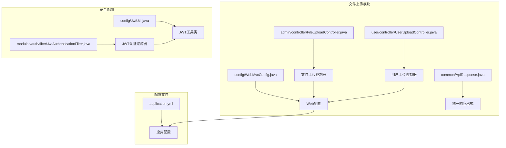
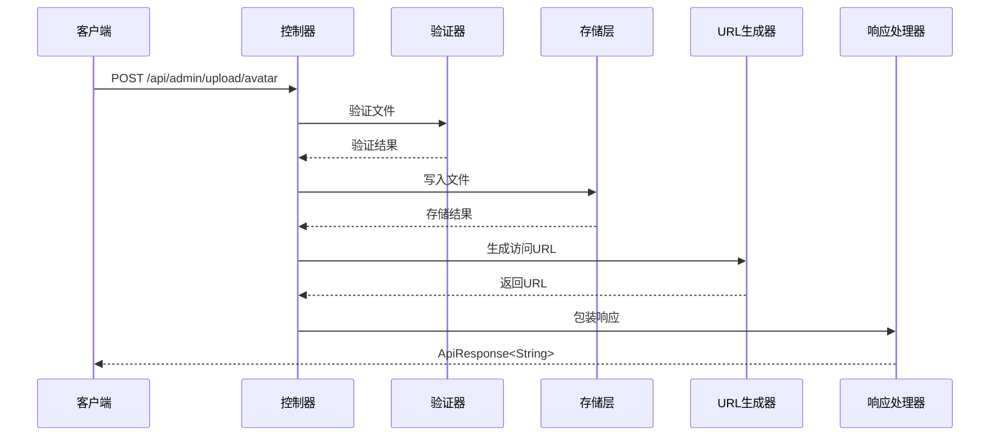
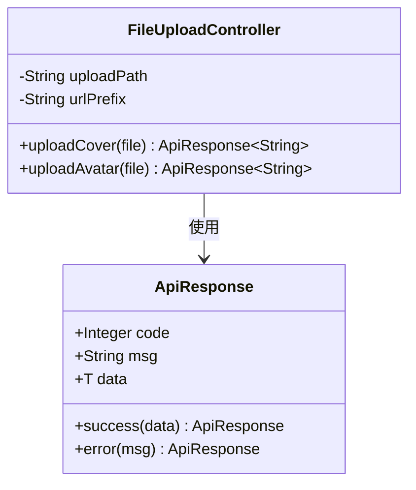
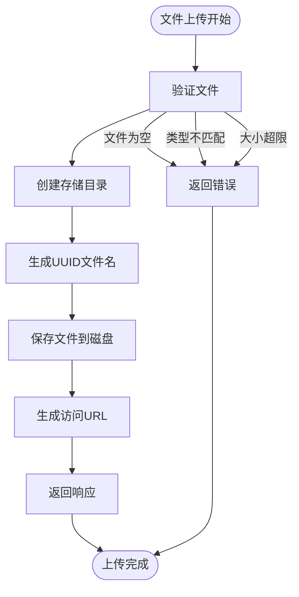
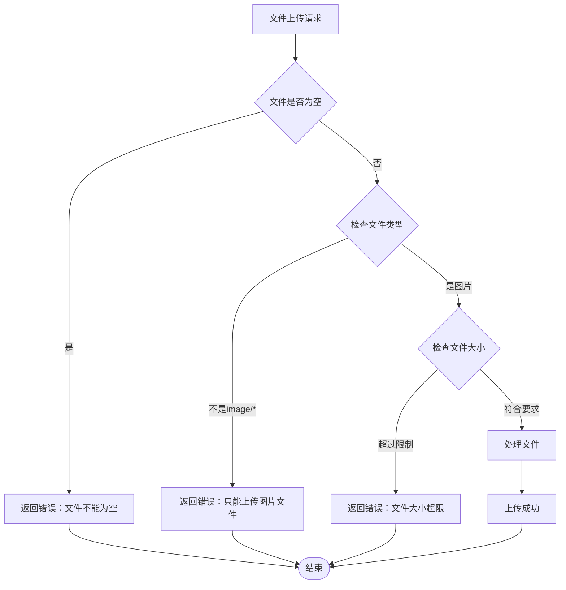
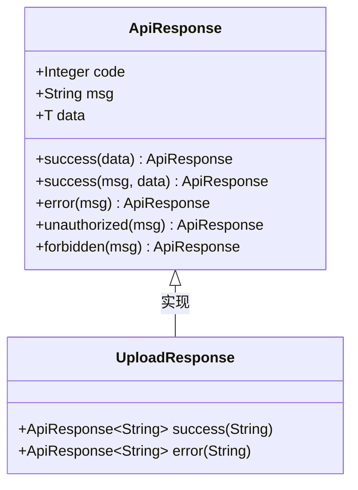
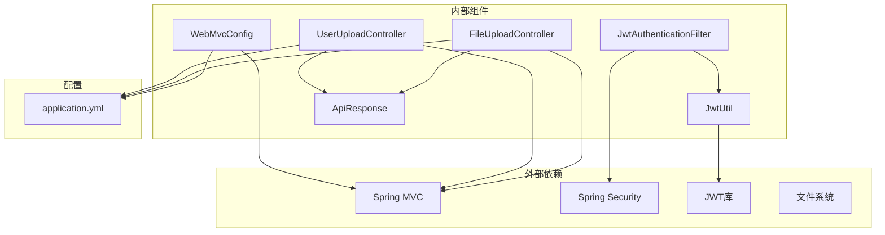

# 文件上传模块

<cite>
**本文档引用的文件**
- [FileUploadController.java](file://src/main/java/org/example/backend/modules/admin/controller/FileUploadController.java)
- [UserUploadController.java](file://src/main/java/org/example/backend/modules/user/controller/UserUploadController.java)
- [WebMvcConfig.java](file://src/main/java/org/example/backend/config/WebMvcConfig.java)
- [application.yml](file://src/main/resources/application.yml)
- [ApiResponse.java](file://src/main/java/org/example/backend/common/ApiResponse.java)
- [JwtAuthenticationFilter.java](file://src/main/java/org/example/backend/modules/auth/filter/JwtAuthenticationFilter.java)
- [JwtUtil.java](file://src/main/java/org/example/backend/config/JwtUtil.java)
</cite>

## 目录
1. [简介](#简介)
2. [项目结构](#项目结构)
3. [核心组件](#核心组件)
4. [架构概览](#架构概览)
5. [详细组件分析](#详细组件分析)
6. [依赖关系分析](#依赖关系分析)
7. [性能考虑](#性能考虑)
8. [故障排除指南](#故障排除指南)
9. [结论](#结论)
10. [附录](#附录)

## 简介

文件上传模块是图书馆管理系统中的重要功能组件，负责处理用户头像和图书封面等图片文件的上传、存储和访问。该模块采用Spring Boot框架构建，实现了完整的文件上传生命周期管理，包括文件验证、安全检查、存储策略和URL生成等功能。

## 项目结构

文件上传模块在项目中的组织结构如下：



**图表来源**
- [FileUploadController.java](file://src/main/java/org/example/backend/modules/admin/controller/FileUploadController.java#L1-L139)
- [UserUploadController.java](file://src/main/java/org/example/backend/modules/user/controller/UserUploadController.java#L1-L86)
- [WebMvcConfig.java](file://src/main/java/org/example/backend/config/WebMvcConfig.java#L1-L28)
- [application.yml](file://src/main/resources/application.yml#L57-L61)

**章节来源**
- [FileUploadController.java](file://src/main/java/org/example/backend/modules/admin/controller/FileUploadController.java#L1-L139)
- [UserUploadController.java](file://src/main/java/org/example/backend/modules/user/controller/UserUploadController.java#L1-L86)
- [WebMvcConfig.java](file://src/main/java/org/example/backend/config/WebMvcConfig.java#L1-L28)
- [application.yml](file://src/main/resources/application.yml#L57-L61)

## 核心组件

文件上传模块的核心组件包括：

### 1. 文件上传控制器
- **管理员文件上传控制器**：处理图书封面和用户头像上传
- **用户文件上传控制器**：专门处理用户头像上传
- **统一响应格式**：使用ApiResponse进行标准化响应

### 2. 存储配置
- **本地文件系统存储**：基于Spring MVC的静态资源映射
- **动态目录结构**：按日期自动创建存储目录
- **UUID文件命名**：确保文件名唯一性

### 3. 安全机制
- **JWT认证集成**：通过JWT过滤器进行身份验证
- **文件类型验证**：仅允许图片文件上传
- **文件大小限制**：封面5MB，头像2MB的差异化限制

**章节来源**
- [FileUploadController.java](file://src/main/java/org/example/backend/modules/admin/controller/FileUploadController.java#L25-L32)
- [UserUploadController.java](file://src/main/java/org/example/backend/modules/user/controller/UserUploadController.java#L25-L32)
- [ApiResponse.java](file://src/main/java/org/example/backend/common/ApiResponse.java#L10-L29)

## 架构概览

文件上传模块采用分层架构设计，实现了清晰的关注点分离：



**图表来源**
- [FileUploadController.java](file://src/main/java/org/example/backend/modules/admin/controller/FileUploadController.java#L36-L83)
- [WebMvcConfig.java](file://src/main/java/org/example/backend/config/WebMvcConfig.java#L20-L25)

## 详细组件分析

### 文件上传控制器

#### 管理员文件上传控制器

管理员控制器提供了两个主要的上传功能：



**图表来源**
- [FileUploadController.java](file://src/main/java/org/example/backend/modules/admin/controller/FileUploadController.java#L25-L136)
- [ApiResponse.java](file://src/main/java/org/example/backend/common/ApiResponse.java#L10-L89)

#### 用户文件上传控制器

用户控制器专注于用户头像上传，具有更严格的文件大小限制：

**章节来源**
- [FileUploadController.java](file://src/main/java/org/example/backend/modules/admin/controller/FileUploadController.java#L36-L136)
- [UserUploadController.java](file://src/main/java/org/example/backend/modules/user/controller/UserUploadController.java#L36-L83)

### 存储策略

#### 本地文件系统存储

文件存储采用本地文件系统策略：



**图表来源**
- [FileUploadController.java](file://src/main/java/org/example/backend/modules/admin/controller/FileUploadController.java#L38-L83)

#### 目录结构设计

存储采用按日期分层的目录结构：
- **封面文件**：`{uploadPath}/covers/{yyyy/MM/dd}/{filename}`
- **头像文件**：`{uploadPath}/avatars/{yyyy/MM/dd}/{filename}`

**章节来源**
- [FileUploadController.java](file://src/main/java/org/example/backend/modules/admin/controller/FileUploadController.java#L55-L61)
- [UserUploadController.java](file://src/main/java/org/example/backend/modules/user/controller/UserUploadController.java#L55-L61)

### URL生成机制

#### 静态资源映射

Web配置通过静态资源映射实现URL到物理文件的映射：

```mermaid
graph LR
subgraph "客户端请求"
A[/uploads/avatars/2024/01/26/abc123.jpg]
end
subgraph "服务器配置"
B[WebMvcConfig.addResourceHandlers]
C[URL前缀映射]
D[文件系统位置]
end
subgraph "文件系统"
E[./uploads/avatars/2024/01/26/abc123.jpg]
end
A --> B
B --> C
B --> D
C --> D
D --> E
```

**图表来源**
- [WebMvcConfig.java](file://src/main/java/org/example/backend/config/WebMvcConfig.java#L20-L25)

**章节来源**
- [WebMvcConfig.java](file://src/main/java/org/example/backend/config/WebMvcConfig.java#L20-L25)
- [application.yml](file://src/main/resources/application.yml#L57-L61)

### 安全检查机制

#### 文件类型验证

系统实施了严格的安全检查：



**图表来源**
- [FileUploadController.java](file://src/main/java/org/example/backend/modules/admin/controller/FileUploadController.java#L39-L52)

#### 文件大小限制策略

不同类型的文件采用差异化大小限制：
- **图书封面**：最大5MB
- **用户头像**：最大2MB

**章节来源**
- [FileUploadController.java](file://src/main/java/org/example/backend/modules/admin/controller/FileUploadController.java#L49-L52)
- [UserUploadController.java](file://src/main/java/org/example/backend/modules/user/controller/UserUploadController.java#L49-L52)

### 统一响应格式

系统使用统一的API响应格式，确保前后端交互的一致性：



**图表来源**
- [ApiResponse.java](file://src/main/java/org/example/backend/common/ApiResponse.java#L10-L89)

**章节来源**
- [ApiResponse.java](file://src/main/java/org/example/backend/common/ApiResponse.java#L42-L86)

## 依赖关系分析

文件上传模块的依赖关系体现了清晰的分层架构：



**图表来源**
- [FileUploadController.java](file://src/main/java/org/example/backend/modules/admin/controller/FileUploadController.java#L1-L18)
- [WebMvcConfig.java](file://src/main/java/org/example/backend/config/WebMvcConfig.java#L1-L18)

**章节来源**
- [JwtAuthenticationFilter.java](file://src/main/java/org/example/backend/modules/auth/filter/JwtAuthenticationFilter.java#L23-L27)
- [JwtUtil.java](file://src/main/java/org/example/backend/config/JwtUtil.java#L18-L26)

## 性能考虑

### 存储性能优化

1. **异步处理**：当前实现为同步阻塞式，可考虑引入异步处理机制
2. **内存管理**：大文件上传可能导致内存压力，建议实现流式处理
3. **并发控制**：多线程同时上传时的文件系统并发安全性

### 缓存策略

1. **URL缓存**：可以考虑缓存常用的文件URL
2. **元数据缓存**：缓存文件的元信息减少重复计算

### 扩展性考虑

1. **存储后端抽象**：当前仅支持本地文件系统，需要抽象出存储接口
2. **CDN集成**：为高并发场景准备CDN支持
3. **分布式存储**：支持对象存储如S3、OSS等

## 故障排除指南

### 常见问题及解决方案

#### 1. 文件上传失败

**症状**：返回"文件上传失败"错误
**可能原因**：
- 磁盘空间不足
- 目录权限问题
- 文件系统异常

**解决方法**：
- 检查磁盘空间和权限
- 验证上传路径存在性
- 查看服务器日志

#### 2. 文件类型验证失败

**症状**：返回"只能上传图片文件"错误
**可能原因**：
- 文件实际类型与声明不符
- MIME类型检测失败

**解决方法**：
- 确认文件的真实格式
- 检查文件头部信息

#### 3. 文件大小超限

**症状**：返回"文件大小超限"错误
**解决方法**：
- 压缩文件或调整尺寸
- 检查配置文件中的大小限制

**章节来源**
- [FileUploadController.java](file://src/main/java/org/example/backend/modules/admin/controller/FileUploadController.java#L79-L82)
- [UserUploadController.java](file://src/main/java/org/example/backend/modules/user/controller/UserUploadController.java#L79-L82)

## 结论

文件上传模块实现了完整的文件上传功能，具有以下特点：

1. **安全性**：实现了文件类型验证、大小限制和JWT认证集成
2. **可维护性**：采用清晰的分层架构和统一的响应格式
3. **扩展性**：模块化设计便于后续功能扩展

**未来改进建议**：
1. 实现异步文件上传处理
2. 添加文件内容安全检查
3. 支持多种存储后端
4. 集成CDN和分布式存储
5. 实现文件访问日志记录

## 附录

### API接口文档

#### 管理员文件上传接口

| 接口 | 方法 | 路径 | 功能 |
|------|------|------|------|
| 上传图书封面 | POST | `/api/admin/upload/cover` | 上传图书封面图片 |
| 上传用户头像 | POST | `/api/admin/upload/avatar` | 上传用户头像图片 |

#### 用户文件上传接口

| 接口 | 方法 | 路径 | 功能 |
|------|------|------|------|
| 上传用户头像 | POST | `/api/user/upload/avatar` | 上传用户头像图片 |

#### 请求参数

| 参数名 | 类型 | 必填 | 说明 | 备注 |
|--------|------|------|------|------|
| file | MultipartFile | 是 | 文件内容 | 仅支持图片文件 |
| Content-Type | String | 是 | 文件类型 | 必须为image/* |

#### 响应格式

| 字段 | 类型 | 说明 |
|------|------|------|
| code | Integer | 响应码，200表示成功 |
| msg | String | 响应消息 |
| data | String | 文件访问URL |

#### 错误码定义

| 错误码 | 说明 | 触发条件 |
|--------|------|----------|
| 200 | 成功 | 操作成功 |
| 500 | 失败 | 操作失败 |
| 401 | 未授权 | JWT认证失败 |
| 403 | 禁止访问 | 权限不足 |

### 配置说明

#### 应用配置

| 配置项 | 默认值 | 说明 |
|--------|--------|------|
| file.upload.path | `./uploads` | 文件上传根目录 |
| file.upload.url-prefix | `/uploads` | 文件访问URL前缀 |
| jwt.secret | `your-secret-key...` | JWT密钥 |
| jwt.expiration | `86400000` | JWT过期时间（毫秒） |

**章节来源**
- [application.yml](file://src/main/resources/application.yml#L57-L61)
- [application.yml](file://src/main/resources/application.yml#L44-L47)