# 核心功能模块

<cite>
**本文引用的文件**
- [AuthController.java](file://src/main/java/org/example/backend/modules/auth/controller/AuthController.java)
- [AuthService.java](file://src/main/java/org/example/backend/modules/auth/service/AuthService.java)
- [BookController.java](file://src/main/java/org/example/backend/modules/book/controller/BookController.java)
- [BookService.java](file://src/main/java/org/example/backend/modules/book/service/BookService.java)
- [RecommendController.java](file://src/main/java/org/example/backend/modules/recommend/controller/RecommendController.java)
- [RecommendService.java](file://src/main/java/org/example/backend/modules/recommend/service/RecommendService.java)
- [InteractionController.java](file://src/main/java/org/example/backend/modules/interaction/controller/InteractionController.java)
- [InteractionService.java](file://src/main/java/org/example/backend/modules/interaction/service/InteractionService.java)
- [UserController.java](file://src/main/java/org/example/backend/modules/user/controller/UserController.java)
- [UserService.java](file://src/main/java/org/example/backend/modules/user/service/UserService.java)
- [AdminController.java](file://src/main/java/org/example/backend/modules/admin/controller/AdminController.java)
- [AdminService.java](file://src/main/java/org/example/backend/modules/admin/service/AdminService.java)
- [SearchController.java](file://src/main/java/org/example/backend/modules/search/controller/SearchController.java)
- [SearchService.java](file://src/main/java/org/example/backend/modules/search/service/SearchService.java)
- [FileUploadController.java](file://src/main/java/org/example/backend/modules/admin/controller/FileUploadController.java)
</cite>

## 目录
1. [引言](#引言)
2. [项目结构](#项目结构)
3. [核心组件](#核心组件)
4. [架构总览](#架构总览)
5. [详细组件分析](#详细组件分析)
6. [依赖关系分析](#依赖关系分析)
7. [性能考虑](#性能考虑)
8. [故障排查指南](#故障排查指南)
9. [结论](#结论)
10. [附录](#附录)

## 引言
本文件面向智能图书推荐系统后端，围绕八大核心模块进行系统化梳理与说明：用户认证模块、图书管理模块、推荐系统模块、用户交互模块、用户管理模块、推荐运营模块、搜索模块与文件管理模块。文档从职责边界、业务流程、技术实现、模块间依赖与数据流、接口调用、典型使用场景与最佳实践等方面展开，帮助开发者快速理解与扩展系统。

## 项目结构
系统采用按功能域划分的分层结构，核心模块位于 modules 下，控制器（Controller）负责HTTP请求入口与参数校验，服务（Service）封装业务逻辑，Repository/VO/DTO等支撑数据传输与持久化。通用工具与异常处理位于 common 与 config 包中，便于跨模块复用。

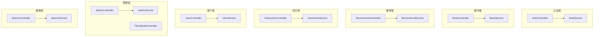

图表来源
- [AuthController.java](file://src/main/java/org/example/backend/modules/auth/controller/AuthController.java#L1-L41)
- [AuthService.java](file://src/main/java/org/example/backend/modules/auth/service/AuthService.java#L1-L23)
- [BookController.java](file://src/main/java/org/example/backend/modules/book/controller/BookController.java#L1-L60)
- [BookService.java](file://src/main/java/org/example/backend/modules/book/service/BookService.java#L1-L39)
- [RecommendController.java](file://src/main/java/org/example/backend/modules/recommend/controller/RecommendController.java#L1-L130)
- [RecommendService.java](file://src/main/java/org/example/backend/modules/recommend/service/RecommendService.java#L1-L70)
- [InteractionController.java](file://src/main/java/org/example/backend/modules/interaction/controller/InteractionController.java#L1-L88)
- [InteractionService.java](file://src/main/java/org/example/backend/modules/interaction/service/InteractionService.java#L1-L49)
- [UserController.java](file://src/main/java/org/example/backend/modules/user/controller/UserController.java#L1-L219)
- [UserService.java](file://src/main/java/org/example/backend/modules/user/service/UserService.java#L1-L105)
- [AdminController.java](file://src/main/java/org/example/backend/modules/admin/controller/AdminController.java#L1-L314)
- [AdminService.java](file://src/main/java/org/example/backend/modules/admin/service/AdminService.java#L1-L68)
- [SearchController.java](file://src/main/java/org/example/backend/modules/search/controller/SearchController.java#L1-L36)
- [SearchService.java](file://src/main/java/org/example/backend/modules/search/service/SearchService.java#L1-L22)
- [FileUploadController.java](file://src/main/java/org/example/backend/modules/admin/controller/FileUploadController.java#L1-L139)

章节来源
- [AuthController.java](file://src/main/java/org/example/backend/modules/auth/controller/AuthController.java#L1-L41)
- [BookController.java](file://src/main/java/org/example/backend/modules/book/controller/BookController.java#L1-L60)
- [RecommendController.java](file://src/main/java/org/example/backend/modules/recommend/controller/RecommendController.java#L1-L130)
- [InteractionController.java](file://src/main/java/org/example/backend/modules/interaction/controller/InteractionController.java#L1-L88)
- [UserController.java](file://src/main/java/org/example/backend/modules/user/controller/UserController.java#L1-L219)
- [AdminController.java](file://src/main/java/org/example/backend/modules/admin/controller/AdminController.java#L1-L314)
- [SearchController.java](file://src/main/java/org/example/backend/modules/search/controller/SearchController.java#L1-L36)
- [FileUploadController.java](file://src/main/java/org/example/backend/modules/admin/controller/FileUploadController.java#L1-L139)

## 核心组件
本节概述八大模块的职责与关键能力：
- 用户认证模块：提供注册与登录接口，返回登录态与用户标识，支撑后续模块的鉴权与用户上下文。
- 图书管理模块：提供图书列表、筛选、详情查询，支撑浏览与推荐前置数据。
- 推荐系统模块：提供首页个性化推荐、新书/热门/主题/相似/也读/长尾等推荐策略，以及曝光、点击、反馈等行为记录。
- 用户交互模块：提供评分、收藏、评论、借阅/还书等互动能力，并支持评论分页与审核。
- 用户管理模块：提供用户信息维护、借阅历史、收藏列表、书单管理、兴趣偏好与浏览记录等个人中心能力。
- 推荐运营模块：提供推荐策略配置、黑名单管理、冷启动配置、推荐预览与统计分析（漏斗、排行、增长）。
- 搜索模块：提供关键词/语义/混合三种搜索模式，支持分页返回。
- 文件管理模块：提供图书封面与用户头像上传，支持类型与大小校验及按日期归档存储。

章节来源
- [AuthController.java](file://src/main/java/org/example/backend/modules/auth/controller/AuthController.java#L26-L38)
- [BookController.java](file://src/main/java/org/example/backend/modules/book/controller/BookController.java#L25-L57)
- [RecommendController.java](file://src/main/java/org/example/backend/modules/recommend/controller/RecommendController.java#L27-L127)
- [InteractionController.java](file://src/main/java/org/example/backend/modules/interaction/controller/InteractionController.java#L29-L85)
- [UserController.java](file://src/main/java/org/example/backend/modules/user/controller/UserController.java#L32-L215)
- [AdminController.java](file://src/main/java/org/example/backend/modules/admin/controller/AdminController.java#L154-L231)
- [SearchController.java](file://src/main/java/org/example/backend/modules/search/controller/SearchController.java#L24-L33)
- [FileUploadController.java](file://src/main/java/org/example/backend/modules/admin/controller/FileUploadController.java#L36-L135)

## 架构总览
系统采用典型的三层架构：表现层（Controller）、领域层（Service）、数据层（Repository/VO/DTO）。各模块通过清晰的接口边界解耦，统一通过 ApiResponse 封装响应，遵循REST风格路由设计。

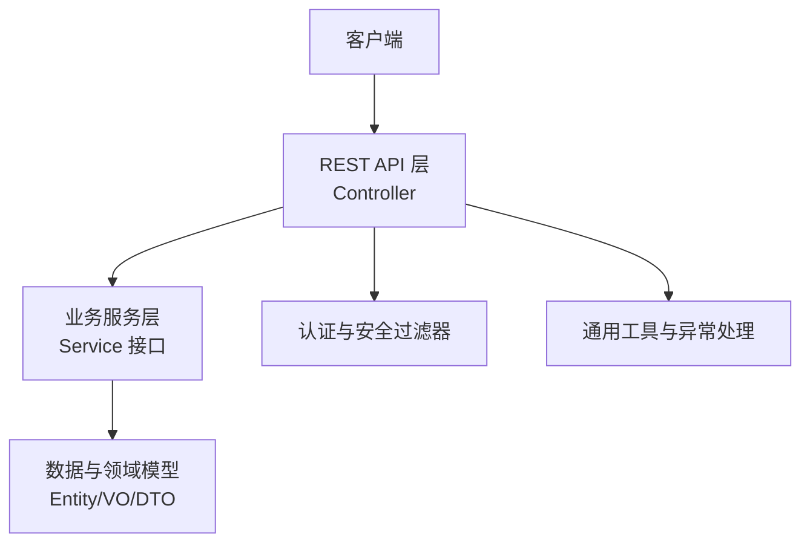

图表来源
- [AuthController.java](file://src/main/java/org/example/backend/modules/auth/controller/AuthController.java#L1-L41)
- [BookController.java](file://src/main/java/org/example/backend/modules/book/controller/BookController.java#L1-L60)
- [RecommendController.java](file://src/main/java/org/example/backend/modules/recommend/controller/RecommendController.java#L1-L130)
- [InteractionController.java](file://src/main/java/org/example/backend/modules/interaction/controller/InteractionController.java#L1-L88)
- [UserController.java](file://src/main/java/org/example/backend/modules/user/controller/UserController.java#L1-L219)
- [AdminController.java](file://src/main/java/org/example/backend/modules/admin/controller/AdminController.java#L1-L314)
- [SearchController.java](file://src/main/java/org/example/backend/modules/search/controller/SearchController.java#L1-L36)
- [FileUploadController.java](file://src/main/java/org/example/backend/modules/admin/controller/FileUploadController.java#L1-L139)

## 详细组件分析

### 用户认证模块
- 职责
  - 提供注册与登录接口，返回登录态信息。
  - 结合安全过滤器与用户上下文，为其他模块提供当前用户标识。
- 关键接口
  - POST /api/auth/register 注册
  - POST /api/auth/login 登录
- 技术要点
  - DTO 参数校验，统一返回 ApiResponse。
  - 登录成功后由安全过滤器与上下文工具提供用户ID。
- 典型场景
  - 新用户注册后立即登录获取令牌。
  - 登录态失效时重新登录以刷新令牌。
- 最佳实践
  - 密码加密存储，避免明文；登录失败次数限制与风控。
  - JWT 过期时间合理设置，移动端支持刷新机制。

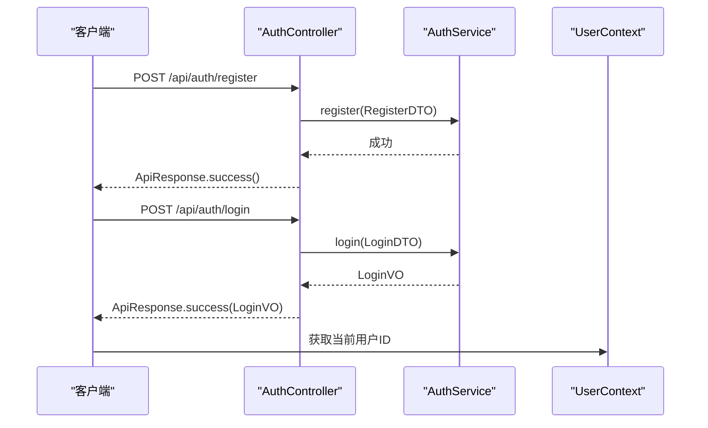

图表来源
- [AuthController.java](file://src/main/java/org/example/backend/modules/auth/controller/AuthController.java#L26-L38)
- [AuthService.java](file://src/main/java/org/example/backend/modules/auth/service/AuthService.java#L10-L21)

章节来源
- [AuthController.java](file://src/main/java/org/example/backend/modules/auth/controller/AuthController.java#L1-L41)
- [AuthService.java](file://src/main/java/org/example/backend/modules/auth/service/AuthService.java#L1-L23)

### 图书管理模块
- 职责
  - 提供图书列表分页、多条件筛选与详情查询。
  - 支持关键字、主题、作者、出版社、最低评分、排序字段与状态筛选。
- 关键接口
  - GET /api/books/list 列表分页
  - GET /api/books/filter 条件筛选
  - GET /api/books/detail/{bookId} 图书详情（带当前用户上下文）
- 技术要点
  - PageResult 统一分页返回。
  - 详情接口结合用户ID可返回个性化字段（如是否收藏）。
- 典型场景
  - 首页“新书抢先看”“热门排行榜”等推荐前置数据来源。
  - 搜索与筛选后的结果展示。
- 最佳实践
  - 筛选参数默认值与排序字段白名单控制，防止SQL注入。
  - 详情接口缓存热点图书，降低数据库压力。

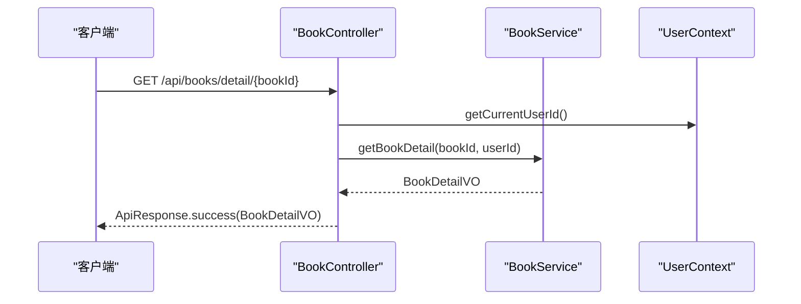

图表来源
- [BookController.java](file://src/main/java/org/example/backend/modules/book/controller/BookController.java#L51-L57)
- [BookService.java](file://src/main/java/org/example/backend/modules/book/service/BookService.java#L33-L37)

章节来源
- [BookController.java](file://src/main/java/org/example/backend/modules/book/controller/BookController.java#L1-L60)
- [BookService.java](file://src/main/java/org/example/backend/modules/book/service/BookService.java#L1-L39)

### 推荐系统模块
- 职责
  - 提供首页个性化推荐、新书/热门/主题/相似/也读/长尾等推荐策略。
  - 记录推荐曝光、点击与用户反馈，用于效果评估与策略优化。
- 关键接口
  - GET /api/recommend/home 首页推荐（权重可调）
  - GET /api/recommend/new 新书
  - GET /api/recommend/hot 热门
  - GET /api/recommend/topic 主题
  - GET /api/recommend/similar/{bookId} 相似图书
  - GET /api/recommend/user-also-read/{bookId} 也读
  - POST /api/recommend/exposure 曝光记录
  - POST /api/recommend/click 点击记录
  - POST /api/recommend/feedback 反馈
  - GET /api/recommend/topics 热门主题
  - GET /api/recommend/long-tail 长尾推荐
- 技术要点
  - 权重参数支持个性化与多样性平衡。
  - 行为记录接口均携带用户ID与位置信息，便于归因分析。
- 典型场景
  - 首次进入应用时的“猜你喜欢”提升转化。
  - 用户对某书评分或收藏后，触发“也读”“相似”推荐。
- 最佳实践
  - 推荐策略参数化，支持A/B实验动态调整。
  - 行为埋点完善，保证曝光/点击/反馈闭环。

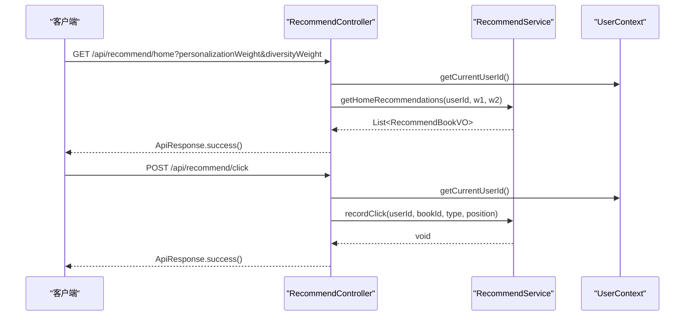

图表来源
- [RecommendController.java](file://src/main/java/org/example/backend/modules/recommend/controller/RecommendController.java#L27-L102)
- [RecommendService.java](file://src/main/java/org/example/backend/modules/recommend/service/RecommendService.java#L12-L68)

章节来源
- [RecommendController.java](file://src/main/java/org/example/backend/modules/recommend/controller/RecommendController.java#L1-L130)
- [RecommendService.java](file://src/main/java/org/example/backend/modules/recommend/service/RecommendService.java#L1-L70)

### 用户交互模块
- 职责
  - 提供评分、收藏/取消收藏、评论发布/删除、评论分页查询。
  - 支持借阅与还书申请，配合管理员审核与确认。
- 关键接口
  - POST /api/interaction/rate 评分
  - POST /api/interaction/favorite/{bookId} 收藏/取消收藏
  - POST /api/interaction/comment 发表评论
  - DELETE /api/interaction/comment/{commentId} 删除评论
  - GET /api/interaction/comments 分页查询评论
  - POST /api/interaction/borrow/{bookId} 申请借阅
  - POST /api/interaction/return/{borrowId} 申请还书
- 技术要点
  - 所有接口均通过用户上下文获取当前用户ID，确保权限控制。
  - 评论分页查询支持按图书维度分页。
- 典型场景
  - 用户在图书详情页进行评分与收藏。
  - 用户发表评论参与社区互动。
  - 借阅流程需要管理员审核与确认。
- 最佳实践
  - 评论内容敏感词过滤与审核机制。
  - 借阅/还书状态机清晰，前后端一致。

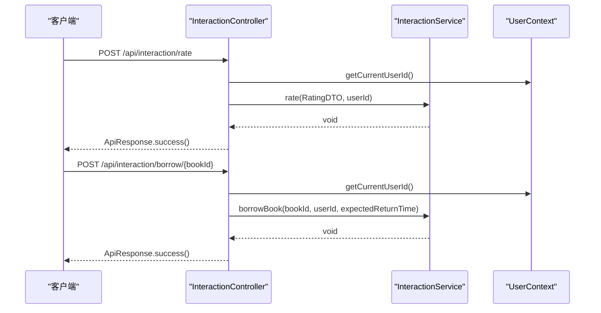

图表来源
- [InteractionController.java](file://src/main/java/org/example/backend/modules/interaction/controller/InteractionController.java#L29-L85)
- [InteractionService.java](file://src/main/java/org/example/backend/modules/interaction/service/InteractionService.java#L11-L49)

章节来源
- [InteractionController.java](file://src/main/java/org/example/backend/modules/interaction/controller/InteractionController.java#L1-L88)
- [InteractionService.java](file://src/main/java/org/example/backend/modules/interaction/service/InteractionService.java#L1-L49)

### 用户管理模块
- 职责
  - 提供用户信息查询与更新、借阅历史、收藏列表、书单管理、兴趣偏好设置与浏览记录。
- 关键接口
  - GET /api/user/info 当前用户信息
  - PUT /api/user/info 更新信息
  - GET /api/user/borrow-history 借阅历史
  - GET /api/user/favorites 收藏列表
  - 书单管理：创建/更新/删除/列表/详情/增删书目
  - 兴趣偏好：设置/获取/完成兴趣引导
  - POST /api/user/book-views/{bookId} 记录浏览
- 技术要点
  - 所有接口均需登录态，未登录返回未授权提示。
  - 书单与收藏支持分页查询。
- 典型场景
  - 用户首次登录完成兴趣引导，系统据此优化推荐。
  - 查看历史借阅与收藏，形成用户画像。
- 最佳实践
  - 个人信息脱敏展示，隐私合规。
  - 书单与收藏数据定期清理无效关联。

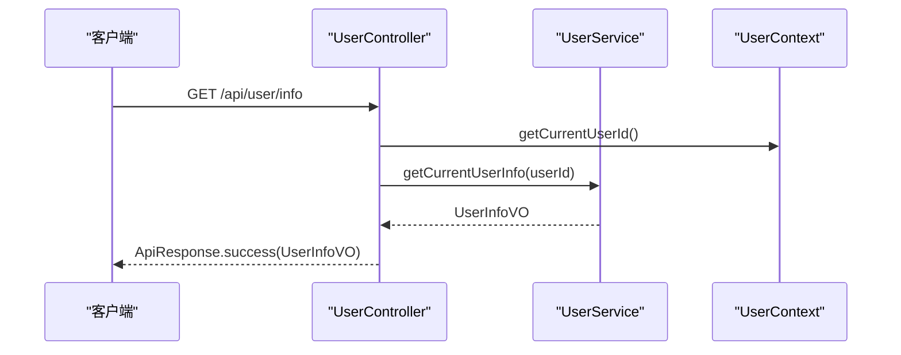

图表来源
- [UserController.java](file://src/main/java/org/example/backend/modules/user/controller/UserController.java#L32-L41)
- [UserService.java](file://src/main/java/org/example/backend/modules/user/service/UserService.java#L15-L26)

章节来源
- [UserController.java](file://src/main/java/org/example/backend/modules/user/controller/UserController.java#L1-L219)
- [UserService.java](file://src/main/java/org/example/backend/modules/user/service/UserService.java#L1-L105)

### 推荐运营模块
- 职责
  - 管理推荐策略配置、黑名单与冷启动配置。
  - 提供推荐结果预览与多维统计分析（用户增长、图书排行、推荐转化漏斗）。
  - 管理借阅流程与用户行为日志。
- 关键接口
  - 策略与预览：GET/PUT /api/admin/recommend/strategy, /api/admin/recommend/preview
  - 黑名单：GET/POST/DELETE /api/admin/recommend/blacklist
  - 冷启动：GET/POST/DELETE /api/admin/recommend/cold-start
  - 统计：GET /api/admin/stats/user-growth, /api/admin/stats/book-rank, /api/admin/stats/recommend-funnel
  - 借阅：GET/PUT /api/admin/borrows
  - 行为日志：GET /api/admin/behaviors
- 技术要点
  - 管理员角色保护，所有接口需 ADMIN 权限。
  - 预览接口支持实时调整权重参数观察效果。
- 典型场景
  - 调整个性化权重与多样性权重，观察转化漏斗变化。
  - 对特定图书加入黑名单，避免重复推荐。
- 最佳实践
  - 策略变更灰度发布，结合A/B实验验证收益。
  - 统计指标口径统一，避免口径漂移导致误判。

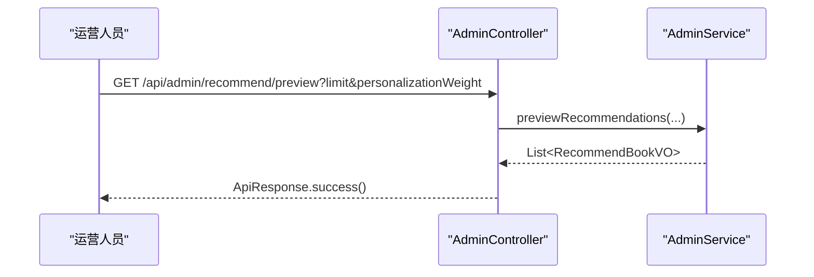

图表来源
- [AdminController.java](file://src/main/java/org/example/backend/modules/admin/controller/AdminController.java#L170-L180)
- [AdminService.java](file://src/main/java/org/example/backend/modules/admin/service/AdminService.java#L43-L44)

章节来源
- [AdminController.java](file://src/main/java/org/example/backend/modules/admin/controller/AdminController.java#L1-L314)
- [AdminService.java](file://src/main/java/org/example/backend/modules/admin/service/AdminService.java#L1-L68)

### 搜索模块
- 职责
  - 提供关键词、语义与混合三种搜索模式，支持分页返回。
- 关键接口
  - GET /api/books/search?q&mode&page&size
- 技术要点
  - 模式参数默认值来自常量，支持扩展不同算法引擎。
  - 返回统一分页结构，便于前端统一处理。
- 典型场景
  - 用户输入关键词快速检索相关图书。
  - 语义搜索满足同义词与语义近似匹配需求。
- 最佳实践
  - 搜索热词监控与纠错，提升召回质量。
  - 搜索结果与推荐策略联动，避免重复曝光。

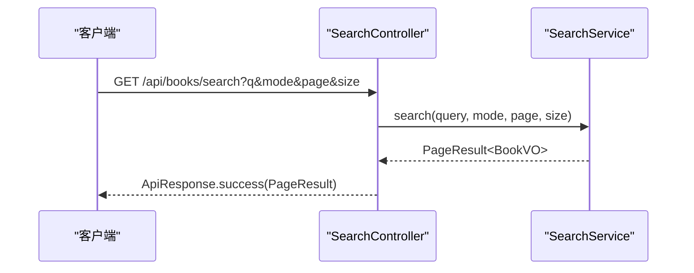

图表来源
- [SearchController.java](file://src/main/java/org/example/backend/modules/search/controller/SearchController.java#L24-L33)
- [SearchService.java](file://src/main/java/org/example/backend/modules/search/service/SearchService.java#L9-L20)

章节来源
- [SearchController.java](file://src/main/java/org/example/backend/modules/search/controller/SearchController.java#L1-L36)
- [SearchService.java](file://src/main/java/org/example/backend/modules/search/service/SearchService.java#L1-L22)

### 文件管理模块
- 职责
  - 提供图书封面与用户头像上传，支持类型与大小校验，按日期归档存储。
- 关键接口
  - POST /api/admin/upload/cover 上传封面
  - POST /api/admin/upload/avatar 上传头像
- 技术要点
  - 上传路径与URL前缀可配置，支持自定义存储介质。
  - 返回可访问URL，便于前端直接渲染。
- 典型场景
  - 管理员批量导入图书封面。
  - 用户上传头像完善个人资料。
- 最佳实践
  - 图片压缩与裁剪，控制加载体积。
  - CDN加速与防盗链策略。

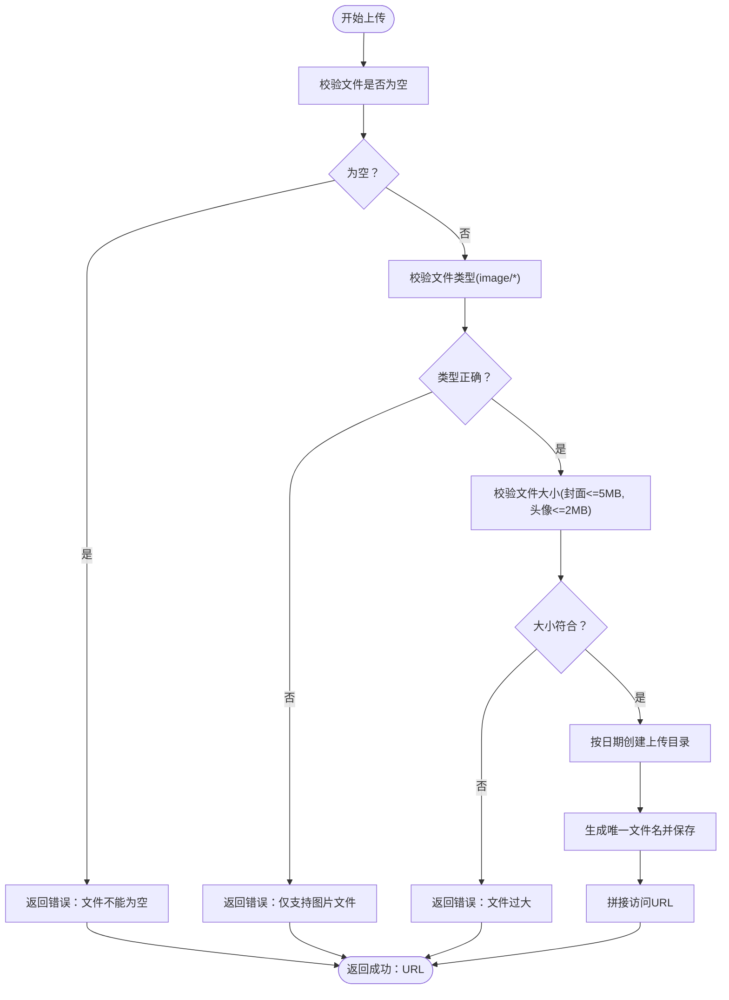

图表来源
- [FileUploadController.java](file://src/main/java/org/example/backend/modules/admin/controller/FileUploadController.java#L36-L135)

章节来源
- [FileUploadController.java](file://src/main/java/org/example/backend/modules/admin/controller/FileUploadController.java#L1-L139)

## 依赖关系分析
- 控制器到服务：各 Controller 仅依赖对应 Service 接口，保持低耦合。
- 用户上下文：多个模块通过 UserContext 获取当前用户ID，统一鉴权入口。
- 统一响应：所有接口返回 ApiResponse，便于前端统一处理。
- 管理员权限：AdminController 使用注解保护，确保后台功能安全。

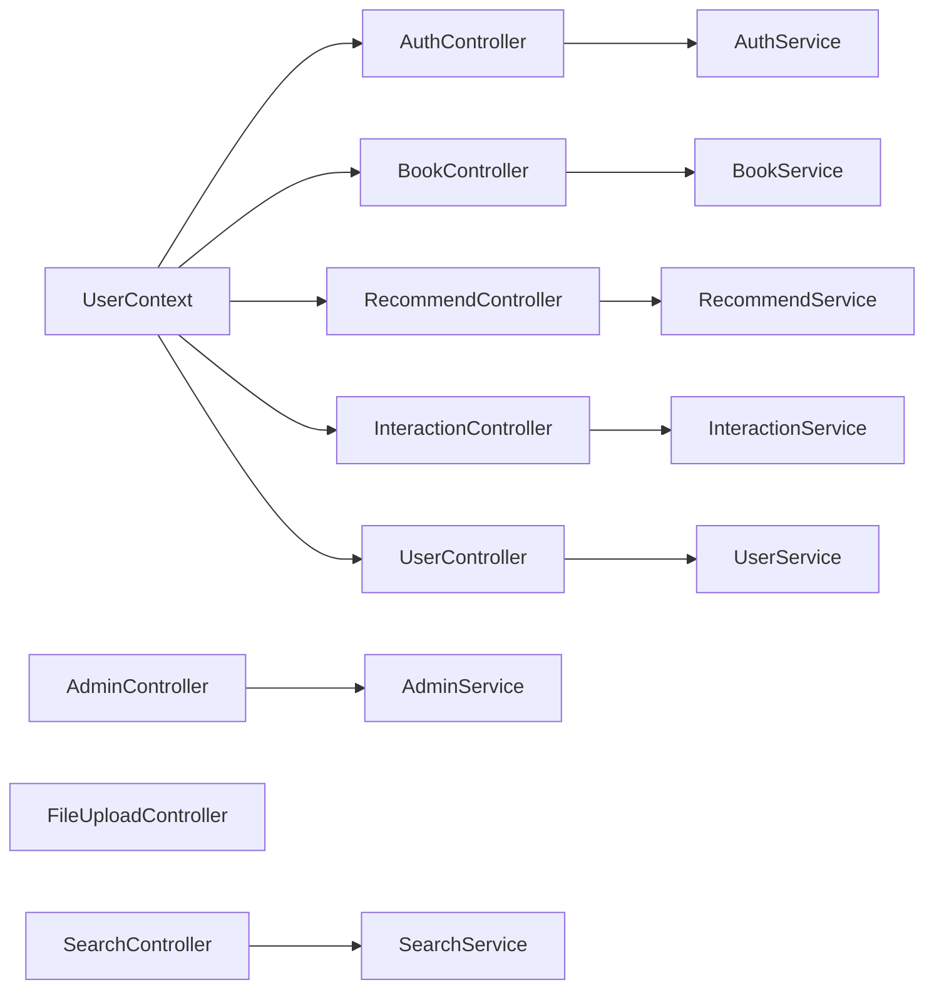

图表来源
- [AuthController.java](file://src/main/java/org/example/backend/modules/auth/controller/AuthController.java#L1-L41)
- [BookController.java](file://src/main/java/org/example/backend/modules/book/controller/BookController.java#L1-L60)
- [RecommendController.java](file://src/main/java/org/example/backend/modules/recommend/controller/RecommendController.java#L1-L130)
- [InteractionController.java](file://src/main/java/org/example/backend/modules/interaction/controller/InteractionController.java#L1-L88)
- [UserController.java](file://src/main/java/org/example/backend/modules/user/controller/UserController.java#L1-L219)
- [AdminController.java](file://src/main/java/org/example/backend/modules/admin/controller/AdminController.java#L1-L314)
- [SearchController.java](file://src/main/java/org/example/backend/modules/search/controller/SearchController.java#L1-L36)
- [FileUploadController.java](file://src/main/java/org/example/backend/modules/admin/controller/FileUploadController.java#L1-L139)

章节来源
- [AuthController.java](file://src/main/java/org/example/backend/modules/auth/controller/AuthController.java#L1-L41)
- [BookController.java](file://src/main/java/org/example/backend/modules/book/controller/BookController.java#L1-L60)
- [RecommendController.java](file://src/main/java/org/example/backend/modules/recommend/controller/RecommendController.java#L1-L130)
- [InteractionController.java](file://src/main/java/org/example/backend/modules/interaction/controller/InteractionController.java#L1-L88)
- [UserController.java](file://src/main/java/org/example/backend/modules/user/controller/UserController.java#L1-L219)
- [AdminController.java](file://src/main/java/org/example/backend/modules/admin/controller/AdminController.java#L1-L314)
- [SearchController.java](file://src/main/java/org/example/backend/modules/search/controller/SearchController.java#L1-L36)
- [FileUploadController.java](file://src/main/java/org/example/backend/modules/admin/controller/FileUploadController.java#L1-L139)

## 性能考虑
- 缓存策略
  - 热门图书详情与推荐结果可引入Redis缓存，降低数据库压力。
  - 用户偏好与书单列表可短期缓存，结合失效策略。
- 分页与排序
  - 筛选与搜索接口严格分页，避免一次性返回大量数据。
  - 排序字段白名单，索引覆盖常见排序列。
- 并发与幂等
  - 评分、收藏、评论等写操作需幂等设计，避免重复提交。
  - 借阅/还书状态机并发控制，必要时加锁或乐观锁。
- 日志与监控
  - 推荐曝光/点击/反馈埋点完善，结合APM监控推荐效果。
  - 文件上传路径与IO异常监控，保障稳定性。

## 故障排查指南
- 认证相关
  - 注册/登录失败：检查DTO参数校验与密码加密策略。
  - 未登录访问受保护接口：确认前端是否携带有效Token。
- 推荐相关
  - 推荐结果为空：检查策略配置、黑名单与冷启动开关。
  - 曝光/点击未记录：核对埋点上报与用户上下文是否正确。
- 搜索相关
  - 搜索无结果：检查模式参数与索引构建情况。
- 文件上传
  - 上传失败：检查文件类型、大小限制与磁盘空间。
  - URL无法访问：核对上传路径与URL前缀配置。

章节来源
- [AuthController.java](file://src/main/java/org/example/backend/modules/auth/controller/AuthController.java#L26-L38)
- [RecommendController.java](file://src/main/java/org/example/backend/modules/recommend/controller/RecommendController.java#L82-L113)
- [SearchController.java](file://src/main/java/org/example/backend/modules/search/controller/SearchController.java#L24-L33)
- [FileUploadController.java](file://src/main/java/org/example/backend/modules/admin/controller/FileUploadController.java#L36-L83)

## 结论
本系统通过清晰的模块划分与接口边界，实现了从用户认证、图书管理、推荐系统、用户交互、用户管理、推荐运营、搜索与文件管理的完整闭环。建议在现有基础上进一步完善缓存与监控体系，强化推荐策略的A/B实验能力，并持续优化搜索与推荐的召回与排序质量，以提升用户体验与平台效率。

## 附录
- 开发与扩展建议
  - 模块内聚性：尽量将同一领域的业务逻辑收敛到对应模块，避免跨模块耦合。
  - 接口版本化：未来演进中逐步引入版本号，保障向后兼容。
  - 文档与契约：结合Swagger完善接口文档，明确入参与返回结构。
  - 安全加固：密码策略、防刷、风控与审计日志完善。
  - 性能压测：在推荐与搜索热点接口进行容量规划与压测。