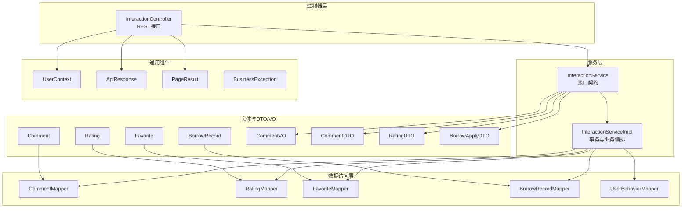
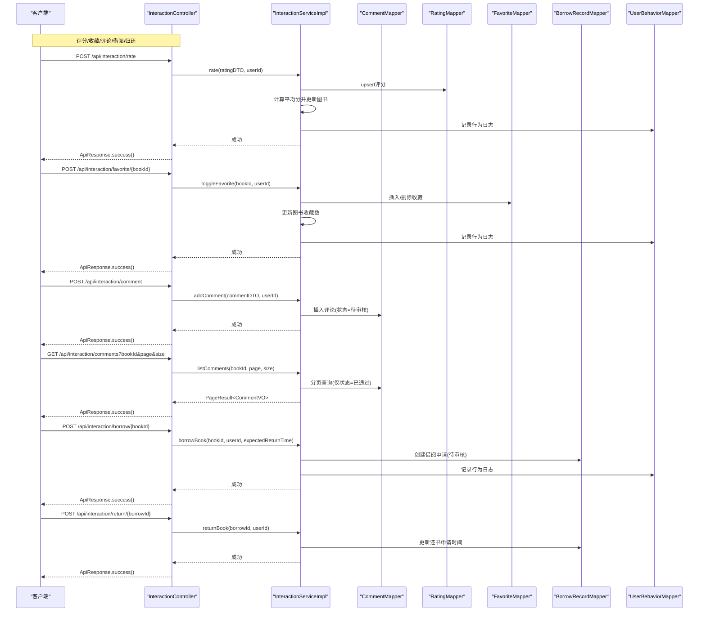
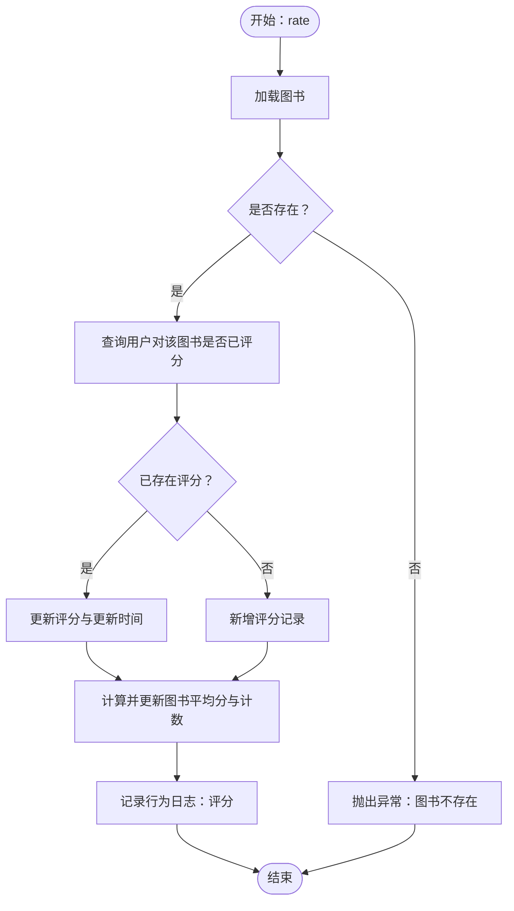
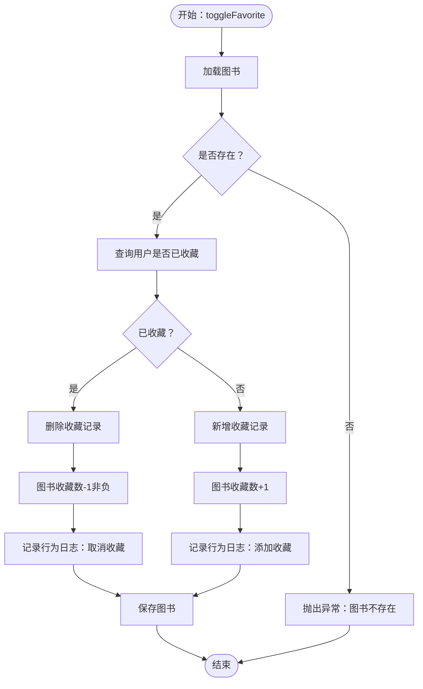
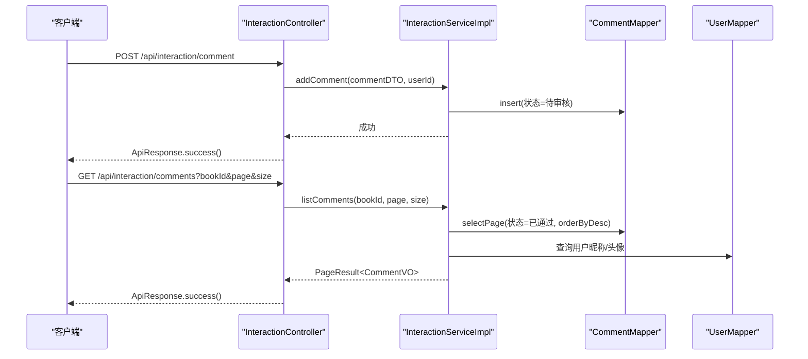
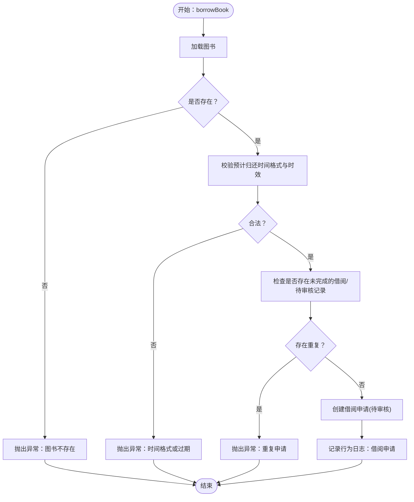
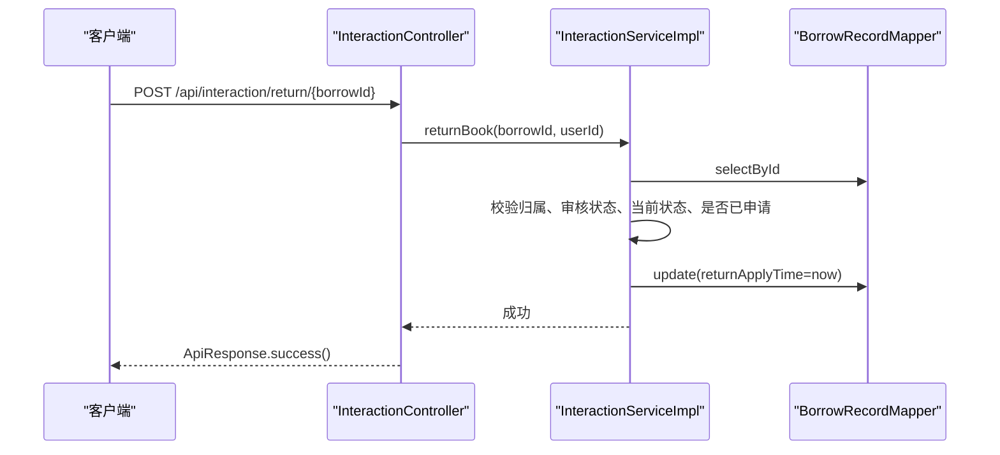
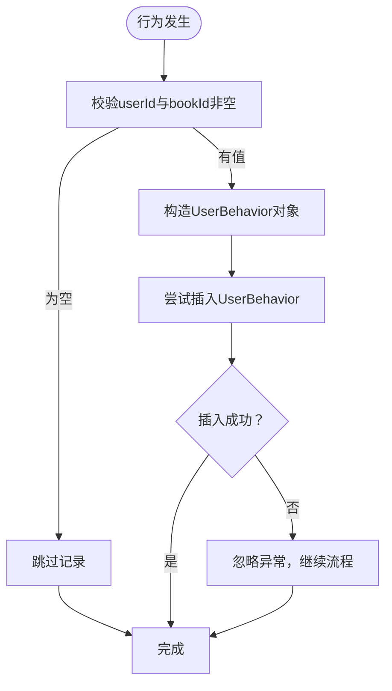
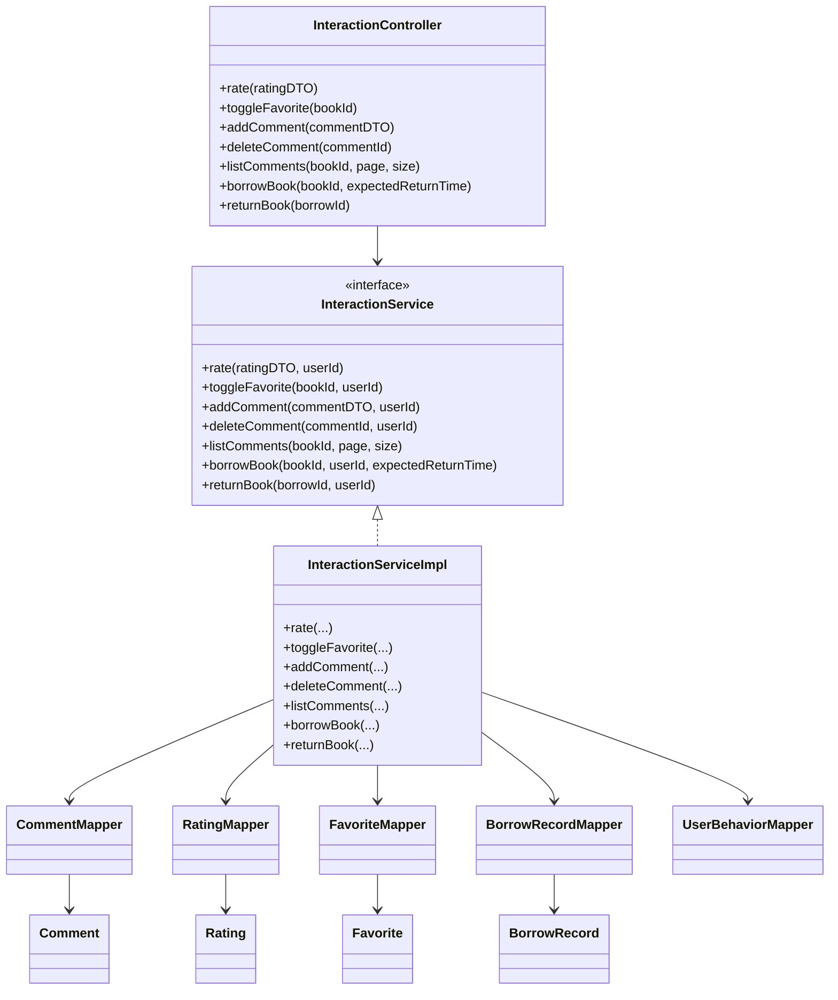

# 用户交互模块

<cite>
**本文引用的文件**
- [InteractionController.java](file://src/main/java/org/example/backend/modules/interaction/controller/InteractionController.java)
- [InteractionService.java](file://src/main/java/org/example/backend/modules/interaction/service/InteractionService.java)
- [InteractionServiceImpl.java](file://src/main/java/org/example/backend/modules/interaction/service/impl/InteractionServiceImpl.java)
- [CommentDTO.java](file://src/main/java/org/example/backend/dto/interaction/CommentDTO.java)
- [RatingDTO.java](file://src/main/java/org/example/backend/dto/interaction/RatingDTO.java)
- [BorrowApplyDTO.java](file://src/main/java/org/example/backend/dto/interaction/BorrowApplyDTO.java)
- [CommentVO.java](file://src/main/java/org/example/backend/vo/interaction/CommentVO.java)
- [Comment.java](file://src/main/java/org/example/backend/entity/Comment.java)
- [Rating.java](file://src/main/java/org/example/backend/entity/Rating.java)
- [Favorite.java](file://src/main/java/org/example/backend/entity/Favorite.java)
- [BorrowRecord.java](file://src/main/java/org/example/backend/entity/BorrowRecord.java)
- [CommentMapper.java](file://src/main/java/org/example/backend/modules/interaction/repository/CommentMapper.java)
- [RatingMapper.java](file://src/main/java/org/example/backend/modules/interaction/repository/RatingMapper.java)
- [FavoriteMapper.java](file://src/main/java/org/example/backend/modules/interaction/repository/FavoriteMapper.java)
- [BorrowRecordMapper.java](file://src/main/java/org/example/backend/modules/interaction/repository/BorrowRecordMapper.java)
- [UserBehaviorMapper.java](file://src/main/java/org/example/backend/modules/admin/repository/UserBehaviorMapper.java)
- [UserContext.java](file://src/main/java/org/example/backend/common/util/UserContext.java)
- [ApiResponse.java](file://src/main/java/org/example/backend/common/ApiResponse.java)
- [PageResult.java](file://src/main/java/org/example/backend/common/PageResult.java)
- [BusinessException.java](file://src/main/java/org/example/backend/common/exception/BusinessException.java)
</cite>

## 目录
1. [简介](#简介)
2. [项目结构](#项目结构)
3. [核心组件](#核心组件)
4. [架构总览](#架构总览)
5. [详细组件分析](#详细组件分析)
6. [依赖关系分析](#依赖关系分析)
7. [性能与并发特性](#性能与并发特性)
8. [故障排查指南](#故障排查指南)
9. [结论](#结论)
10. [附录：交互API接口文档](#附录交互api接口文档)

## 简介
本文件面向开发者，系统性梳理用户交互模块的完整实现，涵盖评分、收藏、评论、借阅管理等核心能力；深入解析用户行为数据采集、社交互动处理、状态变更管理的技术细节；阐述评论审核机制、评分算法、借阅流程的业务逻辑；并提供完整的交互API接口文档，包括操作权限、数据验证、并发控制策略。同时给出扩展指导与新增交互模式的接入方法。

## 项目结构
用户交互模块采用典型的分层架构：
- 控制器层：对外暴露REST接口，负责参数接收、鉴权上下文提取与响应封装
- 服务层：定义交互领域业务契约，实现评分、收藏、评论、借阅等核心流程
- 数据访问层：基于MyBatis-Plus的Mapper接口，映射到数据库表
- 实体与DTO/VO：描述数据模型、请求载荷与返回视图对象
- 工具与通用组件：统一响应、分页结果、异常处理、用户上下文

图表来源
- [InteractionController.java](file://src/main/java/org/example/backend/modules/interaction/controller/InteractionController.java#L1-L88)
- [InteractionService.java](file://src/main/java/org/example/backend/modules/interaction/service/InteractionService.java#L1-L49)
- [InteractionServiceImpl.java](file://src/main/java/org/example/backend/modules/interaction/service/impl/InteractionServiceImpl.java#L1-L340)
- [CommentMapper.java](file://src/main/java/org/example/backend/modules/interaction/repository/CommentMapper.java#L1-L14)
- [RatingMapper.java](file://src/main/java/org/example/backend/modules/interaction/repository/RatingMapper.java#L1-L14)
- [FavoriteMapper.java](file://src/main/java/org/example/backend/modules/interaction/repository/FavoriteMapper.java#L1-L14)
- [BorrowRecordMapper.java](file://src/main/java/org/example/backend/modules/interaction/repository/BorrowRecordMapper.java#L1-L14)
- [UserBehaviorMapper.java](file://src/main/java/org/example/backend/modules/admin/repository/UserBehaviorMapper.java#L1-L200)
- [Comment.java](file://src/main/java/org/example/backend/entity/Comment.java#L1-L59)
- [Rating.java](file://src/main/java/org/example/backend/entity/Rating.java#L1-L49)
- [Favorite.java](file://src/main/java/org/example/backend/entity/Favorite.java#L1-L39)
- [BorrowRecord.java](file://src/main/java/org/example/backend/entity/BorrowRecord.java#L1-L84)
- [CommentVO.java](file://src/main/java/org/example/backend/vo/interaction/CommentVO.java#L1-L24)
- [CommentDTO.java](file://src/main/java/org/example/backend/dto/interaction/CommentDTO.java#L1-L27)
- [RatingDTO.java](file://src/main/java/org/example/backend/dto/interaction/RatingDTO.java#L1-L23)
- [BorrowApplyDTO.java](file://src/main/java/org/example/backend/dto/interaction/BorrowApplyDTO.java#L1-L22)
- [UserContext.java](file://src/main/java/org/example/backend/common/util/UserContext.java#L1-L200)
- [ApiResponse.java](file://src/main/java/org/example/backend/common/ApiResponse.java#L1-L200)
- [PageResult.java](file://src/main/java/org/example/backend/common/PageResult.java#L1-L200)
- [BusinessException.java](file://src/main/java/org/example/backend/common/exception/BusinessException.java#L1-L200)

章节来源
- [InteractionController.java](file://src/main/java/org/example/backend/modules/interaction/controller/InteractionController.java#L1-L88)
- [InteractionService.java](file://src/main/java/org/example/backend/modules/interaction/service/InteractionService.java#L1-L49)
- [InteractionServiceImpl.java](file://src/main/java/org/example/backend/modules/interaction/service/impl/InteractionServiceImpl.java#L1-L340)

## 核心组件
- 评分模块：支持用户对图书进行1-5分评分，重复评分则更新；服务端计算并持久化平均分与评分总数
- 收藏模块：支持用户对图书收藏/取消收藏，维护图书收藏计数
- 评论模块：用户发表评论即进入“待审核”状态，仅审核通过的评论对外展示
- 借阅模块：用户提交借阅申请（需提供预计归还时间），等待管理员审核；审核通过后可申请归还
- 行为日志：所有关键交互均记录用户行为，便于后续分析与风控

章节来源
- [InteractionServiceImpl.java](file://src/main/java/org/example/backend/modules/interaction/service/impl/InteractionServiceImpl.java#L59-L95)
- [InteractionServiceImpl.java](file://src/main/java/org/example/backend/modules/interaction/service/impl/InteractionServiceImpl.java#L97-L134)
- [InteractionServiceImpl.java](file://src/main/java/org/example/backend/modules/interaction/service/impl/InteractionServiceImpl.java#L136-L154)
- [InteractionServiceImpl.java](file://src/main/java/org/example/backend/modules/interaction/service/impl/InteractionServiceImpl.java#L172-L197)
- [InteractionServiceImpl.java](file://src/main/java/org/example/backend/modules/interaction/service/impl/InteractionServiceImpl.java#L222-L264)
- [InteractionServiceImpl.java](file://src/main/java/org/example/backend/modules/interaction/service/impl/InteractionServiceImpl.java#L308-L337)
- [InteractionServiceImpl.java](file://src/main/java/org/example/backend/modules/interaction/service/impl/InteractionServiceImpl.java#L266-L282)

## 架构总览
下图展示了用户交互模块的端到端调用链路与数据流：

图表来源
- [InteractionController.java](file://src/main/java/org/example/backend/modules/interaction/controller/InteractionController.java#L29-L85)
- [InteractionServiceImpl.java](file://src/main/java/org/example/backend/modules/interaction/service/impl/InteractionServiceImpl.java#L59-L337)
- [CommentMapper.java](file://src/main/java/org/example/backend/modules/interaction/repository/CommentMapper.java#L1-L14)
- [RatingMapper.java](file://src/main/java/org/example/backend/modules/interaction/repository/RatingMapper.java#L1-L14)
- [FavoriteMapper.java](file://src/main/java/org/example/backend/modules/interaction/repository/FavoriteMapper.java#L1-L14)
- [BorrowRecordMapper.java](file://src/main/java/org/example/backend/modules/interaction/repository/BorrowRecordMapper.java#L1-L14)
- [UserBehaviorMapper.java](file://src/main/java/org/example/backend/modules/admin/repository/UserBehaviorMapper.java#L1-L200)

## 详细组件分析

### 评分机制
- 业务规则
  - 用户对同一图书只能有一次有效评分；重复评分则更新分数与更新时间
  - 评分范围限定为1-5分
  - 评分完成后，重新计算该图书的平均分与评分总数，并持久化
- 数据模型
  - 实体字段包含用户ID、图书ID、分数、创建/更新时间
- 并发与一致性
  - 使用数据库唯一约束避免重复评分（建议在数据库层面建立“用户+图书”唯一索引）
  - 服务层通过查询是否存在记录决定插入或更新
- 行为日志
  - 记录行为类型为“评分”，携带分数信息

图表来源
- [InteractionServiceImpl.java](file://src/main/java/org/example/backend/modules/interaction/service/impl/InteractionServiceImpl.java#L59-L95)
- [Rating.java](file://src/main/java/org/example/backend/entity/Rating.java#L1-L49)
- [RatingMapper.java](file://src/main/java/org/example/backend/modules/interaction/repository/RatingMapper.java#L1-L14)

章节来源
- [InteractionServiceImpl.java](file://src/main/java/org/example/backend/modules/interaction/service/impl/InteractionServiceImpl.java#L59-L95)
- [RatingDTO.java](file://src/main/java/org/example/backend/dto/interaction/RatingDTO.java#L1-L23)
- [Rating.java](file://src/main/java/org/example/backend/entity/Rating.java#L1-L49)

### 收藏功能
- 业务规则
  - 用户可对图书收藏/取消收藏；取消收藏时确保计数非负
  - 收藏成功后同步更新图书收藏计数
- 数据模型
  - 收藏实体包含用户ID、图书ID、创建时间
- 并发与一致性
  - 通过查询是否存在收藏记录决定插入或删除
  - 更新图书收藏计数时使用原子操作（如数据库自增/自减）
- 行为日志
  - 记录行为类型为“收藏/取消收藏”，携带动作标识

图表来源
- [InteractionServiceImpl.java](file://src/main/java/org/example/backend/modules/interaction/service/impl/InteractionServiceImpl.java#L97-L134)
- [Favorite.java](file://src/main/java/org/example/backend/entity/Favorite.java#L1-L39)
- [FavoriteMapper.java](file://src/main/java/org/example/backend/modules/interaction/repository/FavoriteMapper.java#L1-L14)

章节来源
- [InteractionServiceImpl.java](file://src/main/java/org/example/backend/modules/interaction/service/impl/InteractionServiceImpl.java#L97-L134)
- [Favorite.java](file://src/main/java/org/example/backend/entity/Favorite.java#L1-L39)

### 评论系统与审核机制
- 业务规则
  - 用户发表评论即创建一条记录，状态初始为“待审核”
  - 列表查询仅返回“已通过”的评论，按创建时间倒序
  - 删除评论仅允许评论作者本人执行
- 数据模型
  - 评论实体包含用户ID、图书ID、评分、内容、状态、创建/更新时间
  - VO用于对外展示，包含用户名、头像等关联信息
- 审核流程
  - 当前实现为“用户侧提交即入库”，审核逻辑由管理员侧完成（本模块不直接处理审核状态变更）
- 并发与一致性
  - 删除权限校验防止越权
- 行为日志
  - 评论提交不记录行为日志（可在管理员侧增加审核行为日志）

图表来源
- [InteractionController.java](file://src/main/java/org/example/backend/modules/interaction/controller/InteractionController.java#L45-L69)
- [InteractionServiceImpl.java](file://src/main/java/org/example/backend/modules/interaction/service/impl/InteractionServiceImpl.java#L136-L197)
- [Comment.java](file://src/main/java/org/example/backend/entity/Comment.java#L1-L59)
- [CommentVO.java](file://src/main/java/org/example/backend/vo/interaction/CommentVO.java#L1-L24)
- [CommentMapper.java](file://src/main/java/org/example/backend/modules/interaction/repository/CommentMapper.java#L1-L14)

章节来源
- [InteractionServiceImpl.java](file://src/main/java/org/example/backend/modules/interaction/service/impl/InteractionServiceImpl.java#L136-L197)
- [CommentDTO.java](file://src/main/java/org/example/backend/dto/interaction/CommentDTO.java#L1-L27)
- [Comment.java](file://src/main/java/org/example/backend/entity/Comment.java#L1-L59)
- [CommentVO.java](file://src/main/java/org/example/backend/vo/interaction/CommentVO.java#L1-L24)

### 借阅管理与状态变更
- 业务规则
  - 用户提交借阅申请需提供“预计归还时间”，且不得早于当前时间
  - 同一用户对同一图书不能存在“借阅中”或“待审核”状态的重复申请
  - 借阅记录包含申请时间、借阅时间、预计归还时间、还书申请时间、归还时间、逾期天数、状态与审核状态
  - 用户只能操作自己的借阅记录；只有审核通过且处于“借阅中”状态才可申请归还
- 数据模型
  - 借阅记录实体包含上述字段
- 并发与一致性
  - 通过查询现有记录避免重复申请
  - 事务内保证状态变更原子性
- 行为日志
  - 记录借阅申请阶段与预期归还时间

图表来源
- [InteractionServiceImpl.java](file://src/main/java/org/example/backend/modules/interaction/service/impl/InteractionServiceImpl.java#L222-L264)
- [BorrowRecord.java](file://src/main/java/org/example/backend/entity/BorrowRecord.java#L1-L84)
- [BorrowApplyDTO.java](file://src/main/java/org/example/backend/dto/interaction/BorrowApplyDTO.java#L1-L22)
- [BorrowRecordMapper.java](file://src/main/java/org/example/backend/modules/interaction/repository/BorrowRecordMapper.java#L1-L14)

章节来源
- [InteractionServiceImpl.java](file://src/main/java/org/example/backend/modules/interaction/service/impl/InteractionServiceImpl.java#L222-L264)
- [BorrowRecord.java](file://src/main/java/org/example/backend/entity/BorrowRecord.java#L1-L84)
- [BorrowApplyDTO.java](file://src/main/java/org/example/backend/dto/interaction/BorrowApplyDTO.java#L1-L22)

### 归还流程
- 业务规则
  - 用户仅能对自己名下的借阅记录发起“还书申请”
  - 仅当审核通过且状态为“借阅中”时可申请归还
  - 不得重复提交还书申请
- 处理逻辑
  - 设置还书申请时间为当前时间，等待管理员确认

图表来源
- [InteractionController.java](file://src/main/java/org/example/backend/modules/interaction/controller/InteractionController.java#L79-L85)
- [InteractionServiceImpl.java](file://src/main/java/org/example/backend/modules/interaction/service/impl/InteractionServiceImpl.java#L308-L337)
- [BorrowRecordMapper.java](file://src/main/java/org/example/backend/modules/interaction/repository/BorrowRecordMapper.java#L1-L14)

章节来源
- [InteractionServiceImpl.java](file://src/main/java/org/example/backend/modules/interaction/service/impl/InteractionServiceImpl.java#L308-L337)

### 用户行为数据采集
- 采集范围
  - 评分、收藏/取消收藏、借阅申请等关键交互
- 存储方式
  - 通过UserBehaviorMapper写入用户行为表，包含用户ID、图书ID、行为类型、行为数据JSON、时间戳
- 容错策略
  - 行为日志写入失败不影响主流程

图表来源
- [InteractionServiceImpl.java](file://src/main/java/org/example/backend/modules/interaction/service/impl/InteractionServiceImpl.java#L266-L282)
- [UserBehaviorMapper.java](file://src/main/java/org/example/backend/modules/admin/repository/UserBehaviorMapper.java#L1-L200)

章节来源
- [InteractionServiceImpl.java](file://src/main/java/org/example/backend/modules/interaction/service/impl/InteractionServiceImpl.java#L266-L282)

## 依赖关系分析
- 控制器依赖服务接口，服务实现依赖多个Mapper与实体
- DTO/VO作为跨层数据载体，确保接口契约清晰
- 统一响应与分页结果提升接口一致性
- 异常处理集中于业务异常类，便于前端统一处理

图表来源
- [InteractionController.java](file://src/main/java/org/example/backend/modules/interaction/controller/InteractionController.java#L1-L88)
- [InteractionService.java](file://src/main/java/org/example/backend/modules/interaction/service/InteractionService.java#L1-L49)
- [InteractionServiceImpl.java](file://src/main/java/org/example/backend/modules/interaction/service/impl/InteractionServiceImpl.java#L1-L340)
- [CommentMapper.java](file://src/main/java/org/example/backend/modules/interaction/repository/CommentMapper.java#L1-L14)
- [RatingMapper.java](file://src/main/java/org/example/backend/modules/interaction/repository/RatingMapper.java#L1-L14)
- [FavoriteMapper.java](file://src/main/java/org/example/backend/modules/interaction/repository/FavoriteMapper.java#L1-L14)
- [BorrowRecordMapper.java](file://src/main/java/org/example/backend/modules/interaction/repository/BorrowRecordMapper.java#L1-L14)
- [Comment.java](file://src/main/java/org/example/backend/entity/Comment.java#L1-L59)
- [Rating.java](file://src/main/java/org/example/backend/entity/Rating.java#L1-L49)
- [Favorite.java](file://src/main/java/org/example/backend/entity/Favorite.java#L1-L39)
- [BorrowRecord.java](file://src/main/java/org/example/backend/entity/BorrowRecord.java#L1-L84)

章节来源
- [InteractionController.java](file://src/main/java/org/example/backend/modules/interaction/controller/InteractionController.java#L1-L88)
- [InteractionService.java](file://src/main/java/org/example/backend/modules/interaction/service/InteractionService.java#L1-L49)
- [InteractionServiceImpl.java](file://src/main/java/org/example/backend/modules/interaction/service/impl/InteractionServiceImpl.java#L1-L340)

## 性能与并发特性
- 事务边界
  - 评分、收藏、借阅、归还等关键流程均置于事务中，保证状态一致性
- 查询优化
  - 评论列表按图书与状态分页查询，排序按创建时间倒序
  - 建议在相关字段上建立合适索引以提升查询性能
- 并发控制
  - 通过数据库唯一约束与查询判断避免重复评分/收藏
  - 借阅重复申请检查减少无效请求
- 行为日志
  - 异步化或批量写入可进一步降低对主流程的影响（当前实现为同步写入，失败被吞）

[本节为通用性能讨论，无需列出具体文件来源]

## 故障排查指南
- 常见错误与定位
  - “图书不存在”：检查图书ID有效性与业务可用性
  - “无权删除/归还”：确认当前用户与记录归属一致
  - “重复申请”：检查是否存在未完成的借阅/待审核记录
  - “预计归还时间格式不正确”：确认输入格式符合要求
- 排查步骤
  - 核对控制器参数绑定与DTO校验
  - 检查服务层业务条件与异常抛出点
  - 查看数据库对应记录状态与时间字段
- 日志与监控
  - 关注行为日志是否正常写入
  - 对高频接口进行压测与慢查询分析

章节来源
- [InteractionServiceImpl.java](file://src/main/java/org/example/backend/modules/interaction/service/impl/InteractionServiceImpl.java#L62-L68)
- [InteractionServiceImpl.java](file://src/main/java/org/example/backend/modules/interaction/service/impl/InteractionServiceImpl.java#L164-L167)
- [InteractionServiceImpl.java](file://src/main/java/org/example/backend/modules/interaction/service/impl/InteractionServiceImpl.java#L247-L249)
- [InteractionServiceImpl.java](file://src/main/java/org/example/backend/modules/interaction/service/impl/InteractionServiceImpl.java#L317-L331)
- [BusinessException.java](file://src/main/java/org/example/backend/common/exception/BusinessException.java#L1-L200)

## 结论
用户交互模块以清晰的分层设计实现了评分、收藏、评论、借阅等核心功能，配合行为日志与严格的权限校验，保障了业务的正确性与可追溯性。建议在数据库层面补充必要的唯一索引与索引，持续优化查询性能；同时可考虑将行为日志异步化以提升稳定性。

[本节为总结性内容，无需列出具体文件来源]

## 附录：交互API接口文档

### 通用约定
- 认证：所有接口均需登录态，通过UserContext获取当前用户ID
- 响应：统一使用ApiResponse封装，成功时返回数据或空数据
- 分页：列表接口使用PageResult封装，包含页码、大小、总数与记录列表

章节来源
- [UserContext.java](file://src/main/java/org/example/backend/common/util/UserContext.java#L1-L200)
- [ApiResponse.java](file://src/main/java/org/example/backend/common/ApiResponse.java#L1-L200)
- [PageResult.java](file://src/main/java/org/example/backend/common/PageResult.java#L1-L200)

### 评分
- 接口：POST /api/interaction/rate
- 权限：登录用户
- 请求体：RatingDTO
  - bookId：Long，必填，图书ID
  - score：Integer，必填，1-5分
- 返回：成功无数据
- 业务要点：
  - 重复评分则更新
  - 自动计算并更新图书平均分与评分数量
- 错误：
  - 图书不存在
  - 参数校验失败

章节来源
- [InteractionController.java](file://src/main/java/org/example/backend/modules/interaction/controller/InteractionController.java#L29-L35)
- [RatingDTO.java](file://src/main/java/org/example/backend/dto/interaction/RatingDTO.java#L1-L23)
- [InteractionServiceImpl.java](file://src/main/java/org/example/backend/modules/interaction/service/impl/InteractionServiceImpl.java#L59-L95)

### 收藏/取消收藏
- 接口：POST /api/interaction/favorite/{bookId}
- 权限：登录用户
- 路径参数：bookId（Long）
- 返回：成功无数据
- 业务要点：
  - 若已收藏则取消并扣减收藏数
  - 若未收藏则新增并加收藏数
- 错误：
  - 图书不存在
  - 收藏数不可为负

章节来源
- [InteractionController.java](file://src/main/java/org/example/backend/modules/interaction/controller/InteractionController.java#L37-L43)
- [InteractionServiceImpl.java](file://src/main/java/org/example/backend/modules/interaction/service/impl/InteractionServiceImpl.java#L97-L134)

### 发表评论
- 接口：POST /api/interaction/comment
- 权限：登录用户
- 请求体：CommentDTO
  - bookId：Long，必填
  - rating：Integer，必填，1-5
  - content：String，必填，非空
- 返回：成功无数据
- 业务要点：
  - 评论初始状态为“待审核”
- 错误：
  - 图书不存在
  - 参数校验失败

章节来源
- [InteractionController.java](file://src/main/java/org/example/backend/modules/interaction/controller/InteractionController.java#L45-L51)
- [CommentDTO.java](file://src/main/java/org/example/backend/dto/interaction/CommentDTO.java#L1-L27)
- [InteractionServiceImpl.java](file://src/main/java/org/example/backend/modules/interaction/service/impl/InteractionServiceImpl.java#L136-L154)

### 删除评论
- 接口：DELETE /api/interaction/comment/{commentId}
- 权限：登录用户
- 路径参数：commentId（Long）
- 返回：成功无数据
- 业务要点：
  - 仅作者可删除
- 错误：
  - 评论不存在
  - 无权删除

章节来源
- [InteractionController.java](file://src/main/java/org/example/backend/modules/interaction/controller/InteractionController.java#L53-L59)
- [InteractionServiceImpl.java](file://src/main/java/org/example/backend/modules/interaction/service/impl/InteractionServiceImpl.java#L156-L170)

### 分页查询评论
- 接口：GET /api/interaction/comments
- 权限：登录用户
- 查询参数：
  - bookId：Long，必填
  - page：Long，默认1
  - size：Long，默认10
- 返回：PageResult<CommentVO>
  - CommentVO包含用户昵称、头像、评分、内容、状态、创建时间等
- 业务要点：
  - 仅返回“已通过”的评论
  - 按创建时间倒序

章节来源
- [InteractionController.java](file://src/main/java/org/example/backend/modules/interaction/controller/InteractionController.java#L61-L69)
- [InteractionServiceImpl.java](file://src/main/java/org/example/backend/modules/interaction/service/impl/InteractionServiceImpl.java#L172-L197)
- [CommentVO.java](file://src/main/java/org/example/backend/vo/interaction/CommentVO.java#L1-L24)

### 申请借阅
- 接口：POST /api/interaction/borrow/{bookId}
- 权限：登录用户
- 路径参数：bookId（Long）
- 请求体：BorrowApplyDTO
  - expectedReturnTime：String，必填，格式支持“yyyy-MM-dd”或“yyyy-MM-dd HH:mm:ss”或ISO8601
- 返回：成功无数据
- 业务要点：
  - 预计归还时间不得早于当前时间
  - 同一用户对同一图书不得存在“借阅中/待审核”的重复申请
  - 创建借阅申请（auditStatus=0，status=0）
- 错误：
  - 图书不存在
  - 时间格式不正确
  - 重复申请
  - 参数校验失败

章节来源
- [InteractionController.java](file://src/main/java/org/example/backend/modules/interaction/controller/InteractionController.java#L71-L77)
- [BorrowApplyDTO.java](file://src/main/java/org/example/backend/dto/interaction/BorrowApplyDTO.java#L1-L22)
- [InteractionServiceImpl.java](file://src/main/java/org/example/backend/modules/interaction/service/impl/InteractionServiceImpl.java#L222-L264)

### 申请归还
- 接口：POST /api/interaction/return/{borrowId}
- 权限：登录用户
- 路径参数：borrowId（Long）
- 返回：成功无数据
- 业务要点：
  - 仅本人可操作
  - 仅审核通过且处于“借阅中”状态可申请归还
  - 不得重复提交还书申请
- 错误：
  - 借阅记录不存在
  - 无权归还
  - 未审核通过或不在借阅中
  - 已提交还书申请

章节来源
- [InteractionController.java](file://src/main/java/org/example/backend/modules/interaction/controller/InteractionController.java#L79-L85)
- [InteractionServiceImpl.java](file://src/main/java/org/example/backend/modules/interaction/service/impl/InteractionServiceImpl.java#L308-L337)