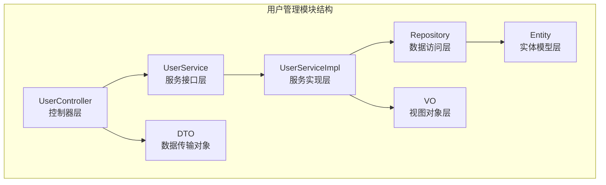
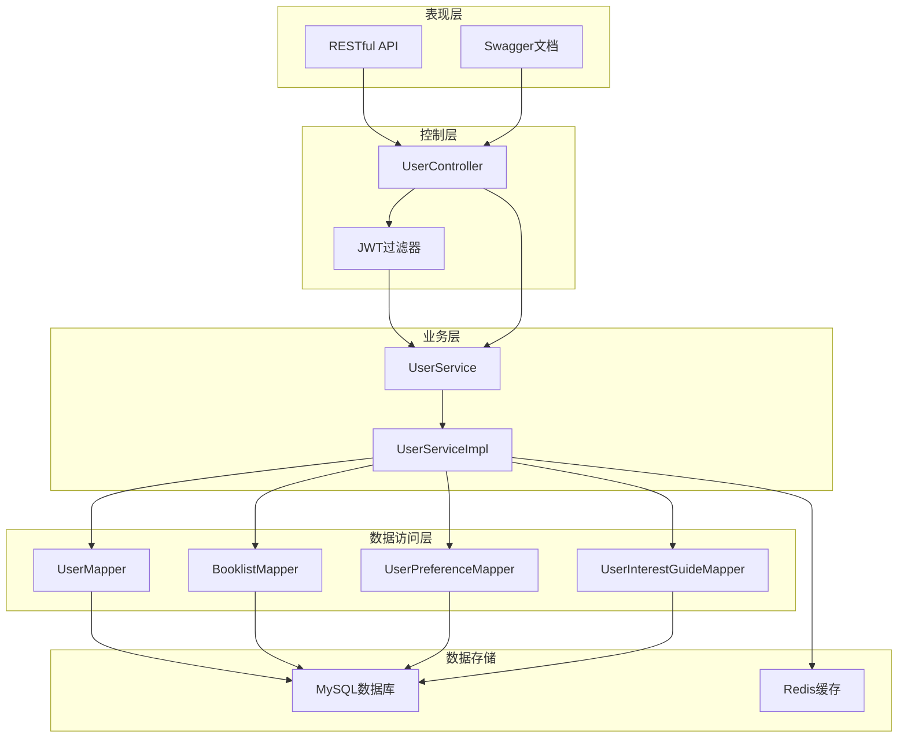
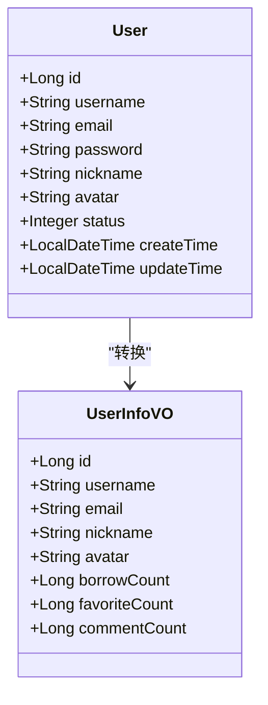
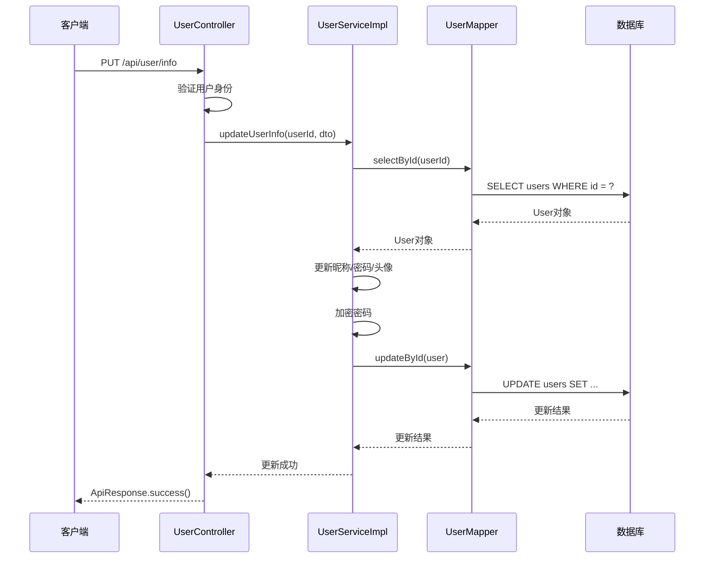
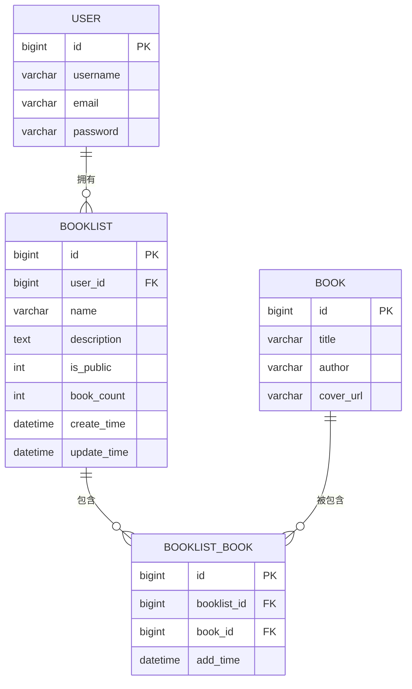
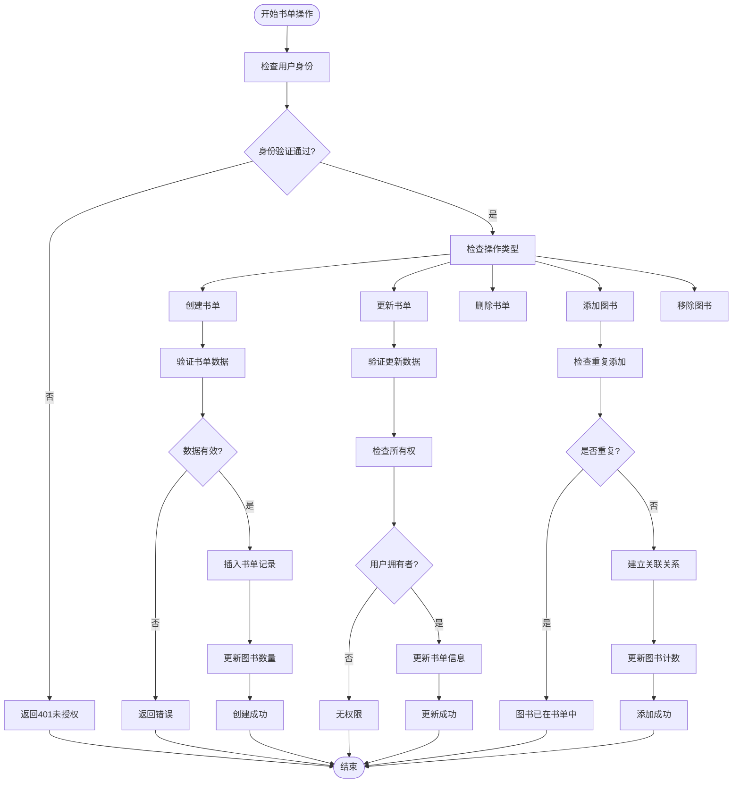
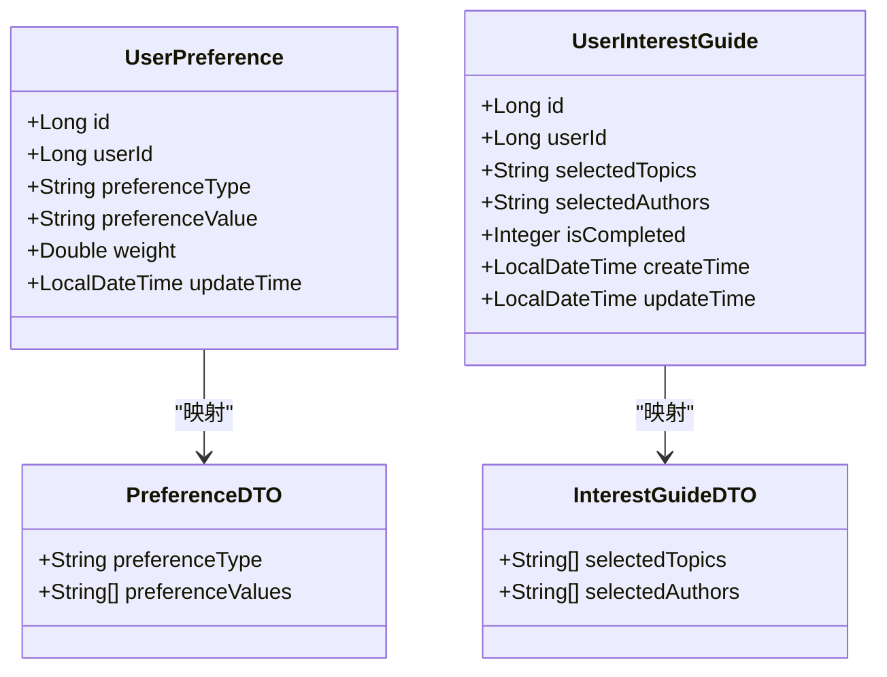
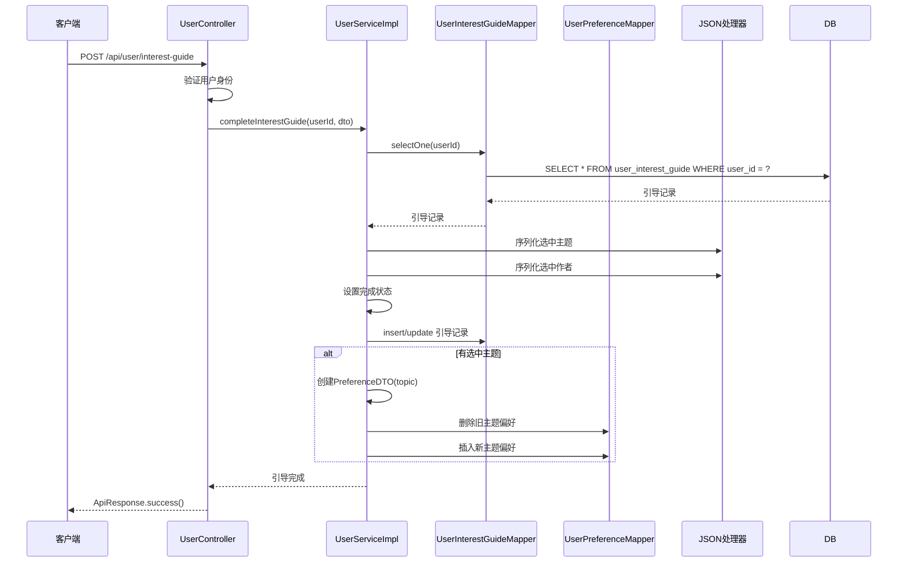
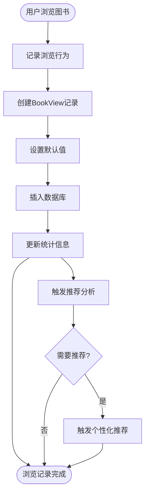
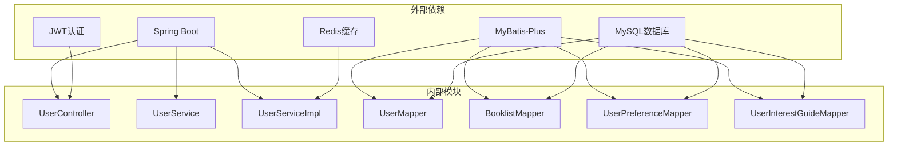

# 用户管理模块

<cite>
**本文档引用的文件**
- [UserController.java](file://src/main/java/org/example/backend/modules/user/controller/UserController.java)
- [UserService.java](file://src/main/java/org/example/backend/modules/user/service/UserService.java)
- [UserServiceImpl.java](file://src/main/java/org/example/backend/modules/user/service/impl/UserServiceImpl.java)
- [User.java](file://src/main/java/org/example/backend/entity/User.java)
- [UserUpdateDTO.java](file://src/main/java/org/example/backend/dto/user/UserUpdateDTO.java)
- [BooklistDTO.java](file://src/main/java/org/example/backend/dto/user/BooklistDTO.java)
- [PreferenceDTO.java](file://src/main/java/org/example/backend/dto/user/PreferenceDTO.java)
- [InterestGuideDTO.java](file://src/main/java/org/example/backend/dto/user/InterestGuideDTO.java)
- [UserPreference.java](file://src/main/java/org/example/backend/entity/UserPreference.java)
- [UserInterestGuide.java](file://src/main/java/org/example/backend/entity/UserInterestGuide.java)
- [UserMapper.java](file://src/main/java/org/example/backend/modules/user/repository/UserMapper.java)
- [BooklistMapper.java](file://src/main/java/org/example/backend/modules/user/repository/BooklistMapper.java)
- [UserInfoVO.java](file://src/main/java/org/example/backend/vo/user/UserInfoVO.java)
- [UserContext.java](file://src/main/java/org/example/backend/common/util/UserContext.java)
- [application.yml](file://src/main/resources/application.yml)
</cite>

## 目录
1. [简介](#简介)
2. [项目结构](#项目结构)
3. [核心组件](#核心组件)
4. [架构概览](#架构概览)
5. [详细组件分析](#详细组件分析)
6. [依赖关系分析](#依赖关系分析)
7. [性能考虑](#性能考虑)
8. [故障排除指南](#故障排除指南)
9. [结论](#结论)
10. [附录](#附录)

## 简介

用户管理模块是图书馆管理系统的核心功能模块之一，负责处理用户相关的所有业务逻辑。该模块实现了完整的用户信息管理、个人资料维护、书单管理、兴趣标签系统、偏好设置和用户画像构建等功能。

本模块采用分层架构设计，包含控制器层、服务层、数据访问层和实体模型层，确保了良好的代码组织和可维护性。通过使用Spring Boot、MyBatis-Plus和JWT认证机制，提供了安全可靠的用户管理功能。

## 项目结构

用户管理模块位于`src/main/java/org/example/backend/modules/user/`目录下，采用标准的MVC架构模式：

**图表来源**
- [UserController.java](file://src/main/java/org/example/backend/modules/user/controller/UserController.java#L24-L27)
- [UserService.java](file://src/main/java/org/example/backend/modules/user/service/UserService.java#L12-L15)
- [UserServiceImpl.java](file://src/main/java/org/example/backend/modules/user/service/impl/UserServiceImpl.java#L31-L35)

**章节来源**
- [UserController.java](file://src/main/java/org/example/backend/modules/user/controller/UserController.java#L1-L219)
- [UserService.java](file://src/main/java/org/example/backend/modules/user/service/UserService.java#L1-L105)

## 核心组件

用户管理模块包含以下核心组件：

### 控制器层
- **UserController**: 提供RESTful API接口，处理HTTP请求和响应
- **UserUploadController**: 处理用户头像上传等文件操作

### 服务层
- **UserService**: 定义用户管理业务接口
- **UserServiceImpl**: 实现具体的业务逻辑

### 数据访问层
- **UserMapper**: 用户数据访问接口
- **BooklistMapper**: 书单数据访问接口
- **UserPreferenceMapper**: 用户偏好数据访问接口
- **UserInterestGuideMapper**: 用户兴趣引导数据访问接口

### 实体模型层
- **User**: 用户基本信息实体
- **UserPreference**: 用户偏好实体
- **UserInterestGuide**: 用户兴趣引导实体
- **Booklist**: 书单实体
- **BooklistBook**: 书单与图书关联实体

**章节来源**
- [UserController.java](file://src/main/java/org/example/backend/modules/user/controller/UserController.java#L24-L27)
- [UserService.java](file://src/main/java/org/example/backend/modules/user/service/UserService.java#L12-L102)
- [UserServiceImpl.java](file://src/main/java/org/example/backend/modules/user/service/impl/UserServiceImpl.java#L31-L72)

## 架构概览

用户管理模块采用经典的三层架构设计，确保了关注点分离和代码的可维护性：

**图表来源**
- [UserController.java](file://src/main/java/org/example/backend/modules/user/controller/UserController.java#L24-L31)
- [UserService.java](file://src/main/java/org/example/backend/modules/user/service/UserService.java#L12-L15)
- [UserServiceImpl.java](file://src/main/java/org/example/backend/modules/user/service/impl/UserServiceImpl.java#L37-L71)
- [application.yml](file://src/main/resources/application.yml#L10-L43)

## 详细组件分析

### 用户信息管理

用户信息管理功能提供了完整的用户资料维护能力：

#### 用户实体模型
用户实体包含了系统所需的所有基础信息字段：

**图表来源**
- [User.java](file://src/main/java/org/example/backend/entity/User.java#L15-L61)
- [UserInfoVO.java](file://src/main/java/org/example/backend/vo/user/UserInfoVO.java#L9-L19)

#### 用户信息更新流程
用户信息更新采用事务性操作，确保数据一致性：

**图表来源**
- [UserController.java](file://src/main/java/org/example/backend/modules/user/controller/UserController.java#L43-L52)
- [UserServiceImpl.java](file://src/main/java/org/example/backend/modules/user/service/impl/UserServiceImpl.java#L101-L126)
- [UserUpdateDTO.java](file://src/main/java/org/example/backend/dto/user/UserUpdateDTO.java#L9-L25)

**章节来源**
- [User.java](file://src/main/java/org/example/backend/entity/User.java#L10-L64)
- [UserUpdateDTO.java](file://src/main/java/org/example/backend/dto/user/UserUpdateDTO.java#L1-L28)
- [UserInfoVO.java](file://src/main/java/org/example/backend/vo/user/UserInfoVO.java#L1-L22)

### 书单管理

书单管理功能允许用户创建、维护和分享个人图书收藏：

#### 书单实体模型
书单系统采用关联表设计，支持灵活的书单管理：

**图表来源**
- [User.java](file://src/main/java/org/example/backend/entity/User.java#L15-L61)
- [BooklistDTO.java](file://src/main/java/org/example/backend/dto/user/BooklistDTO.java#L12-L31)
- [BooklistMapper.java](file://src/main/java/org/example/backend/modules/user/repository/BooklistMapper.java#L10-L12)

#### 书单操作流程
书单管理支持完整的CRUD操作和权限控制：

**图表来源**
- [UserServiceImpl.java](file://src/main/java/org/example/backend/modules/user/service/impl/UserServiceImpl.java#L197-L375)
- [BooklistDTO.java](file://src/main/java/org/example/backend/dto/user/BooklistDTO.java#L12-L31)

**章节来源**
- [BooklistDTO.java](file://src/main/java/org/example/backend/dto/user/BooklistDTO.java#L1-L33)
- [UserServiceImpl.java](file://src/main/java/org/example/backend/modules/user/service/impl/UserServiceImpl.java#L195-L375)

### 兴趣标签系统

兴趣标签系统为个性化推荐提供基础数据支撑：

#### 兴趣偏好模型

**图表来源**
- [UserPreference.java](file://src/main/java/org/example/backend/entity/UserPreference.java#L14-L47)
- [UserInterestGuide.java](file://src/main/java/org/example/backend/entity/UserInterestGuide.java#L14-L51)
- [PreferenceDTO.java](file://src/main/java/org/example/backend/dto/user/PreferenceDTO.java#L12-L26)
- [InterestGuideDTO.java](file://src/main/java/org/example/backend/dto/user/InterestGuideDTO.java#L11-L22)

#### 兴趣引导流程
兴趣引导功能帮助新用户建立初始偏好设置：

**图表来源**
- [UserController.java](file://src/main/java/org/example/backend/modules/user/controller/UserController.java#L185-L205)
- [UserServiceImpl.java](file://src/main/java/org/example/backend/modules/user/service/impl/UserServiceImpl.java#L411-L451)
- [InterestGuideDTO.java](file://src/main/java/org/example/backend/dto/user/InterestGuideDTO.java#L11-L22)

**章节来源**
- [UserPreference.java](file://src/main/java/org/example/backend/entity/UserPreference.java#L1-L49)
- [UserInterestGuide.java](file://src/main/java/org/example/backend/entity/UserInterestGuide.java#L1-L54)
- [PreferenceDTO.java](file://src/main/java/org/example/backend/dto/user/PreferenceDTO.java#L1-L28)
- [InterestGuideDTO.java](file://src/main/java/org/example/backend/dto/user/InterestGuideDTO.java#L1-L24)

### 用户行为分析

用户行为分析功能记录和统计用户的阅读行为：

#### 浏览记录管理

**图表来源**
- [UserServiceImpl.java](file://src/main/java/org/example/backend/modules/user/service/impl/UserServiceImpl.java#L463-L472)

**章节来源**
- [UserServiceImpl.java](file://src/main/java/org/example/backend/modules/user/service/impl/UserServiceImpl.java#L461-L476)

## 依赖关系分析

用户管理模块的依赖关系体现了清晰的分层架构：

**图表来源**
- [UserServiceImpl.java](file://src/main/java/org/example/backend/modules/user/service/impl/UserServiceImpl.java#L37-L71)
- [application.yml](file://src/main/resources/application.yml#L10-L43)

**章节来源**
- [UserServiceImpl.java](file://src/main/java/org/example/backend/modules/user/service/impl/UserServiceImpl.java#L31-L72)
- [application.yml](file://src/main/resources/application.yml#L1-L71)

## 性能考虑

用户管理模块在设计时充分考虑了性能优化：

### 数据库优化
- 使用MyBatis-Plus进行高效的数据访问
- 合理的索引设计支持高频查询
- 分页查询避免大数据量影响

### 缓存策略
- Redis缓存热点数据
- 减少数据库查询压力
- 提升响应速度

### 安全考虑
- JWT令牌认证机制
- 密码加密存储
- 输入参数验证

## 故障排除指南

### 常见问题及解决方案

#### 用户认证失败
**问题**: 用户无法登录或获取用户信息
**原因**: JWT令牌过期或无效
**解决方案**: 
1. 检查JWT配置是否正确
2. 验证令牌有效期设置
3. 确认用户身份验证流程

#### 数据库连接异常
**问题**: 无法连接到MySQL数据库
**原因**: 数据库配置错误或网络问题
**解决方案**:
1. 检查数据库连接URL配置
2. 验证用户名和密码
3. 确认数据库服务状态

#### 权限访问错误
**问题**: 用户无权限访问某些资源
**原因**: 用户权限不足或身份验证失败
**解决方案**:
1. 检查用户角色配置
2. 验证JWT令牌中的用户信息
3. 确认资源访问权限设置

**章节来源**
- [UserContext.java](file://src/main/java/org/example/backend/common/util/UserContext.java#L14-L47)
- [application.yml](file://src/main/resources/application.yml#L10-L43)

## 结论

用户管理模块是一个功能完整、架构清晰的用户管理系统。通过采用分层架构设计、完善的实体模型和丰富的业务功能，该模块为图书馆系统提供了坚实的用户管理基础。

模块的主要优势包括：
- 清晰的分层架构便于维护和扩展
- 完整的用户生命周期管理
- 灵活的书单管理和个性化推荐支持
- 安全的认证授权机制
- 良好的性能优化策略

未来可以考虑的功能扩展包括：用户行为深度分析、更丰富的个性化推荐算法、多设备数据同步等。

## 附录

### API接口文档

#### 用户信息管理
- `GET /api/user/info` - 获取当前用户信息
- `PUT /api/user/info` - 更新用户信息

#### 书单管理
- `POST /api/user/booklists` - 创建书单
- `PUT /api/user/booklists/{booklistId}` - 更新书单
- `DELETE /api/user/booklists/{booklistId}` - 删除书单
- `GET /api/user/booklists` - 获取书单列表
- `GET /api/user/booklists/{booklistId}` - 获取书单详情
- `POST /api/user/booklists/{booklistId}/books/{bookId}` - 添加图书到书单
- `DELETE /api/user/booklists/{booklistId}/books/{bookId}` - 从书单移除图书

#### 兴趣偏好管理
- `POST /api/user/preferences` - 设置兴趣偏好
- `GET /api/user/preferences` - 获取兴趣偏好
- `POST /api/user/interest-guide` - 完成兴趣引导
- `GET /api/user/interest-guide/status` - 检查兴趣引导状态

#### 用户行为分析
- `POST /api/user/book-views/{bookId}` - 记录图书浏览

**章节来源**
- [UserController.java](file://src/main/java/org/example/backend/modules/user/controller/UserController.java#L32-L216)