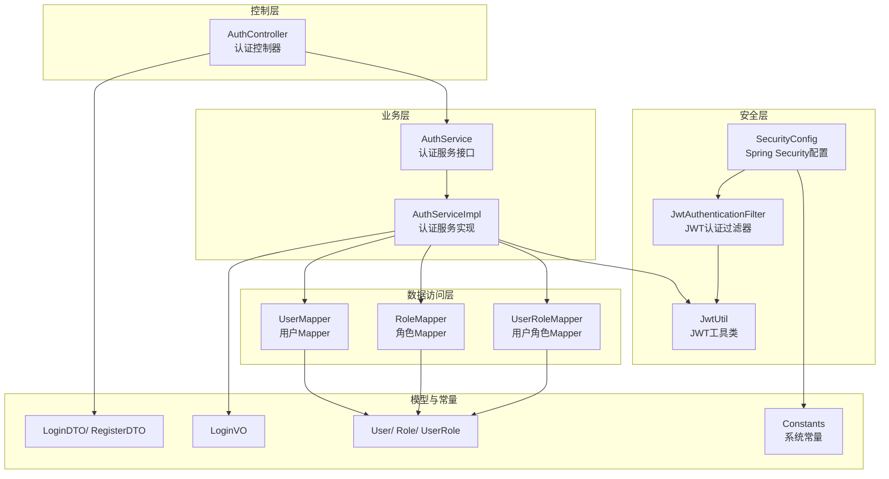
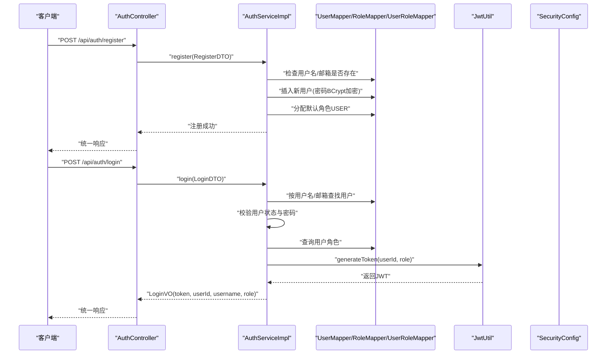
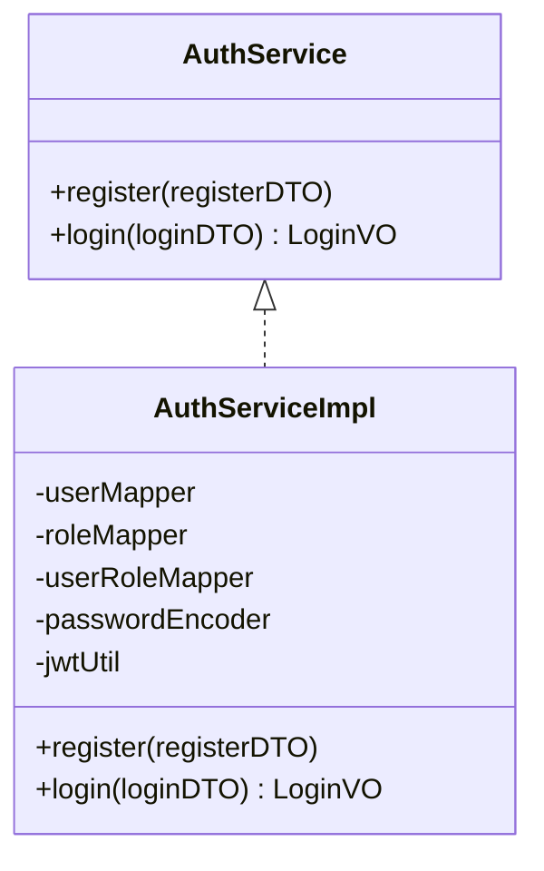
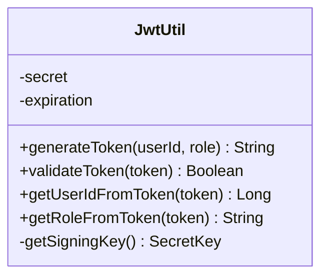
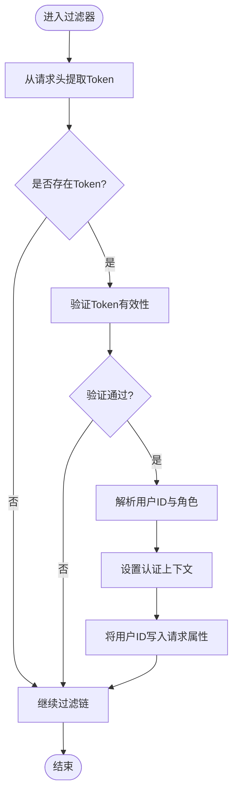
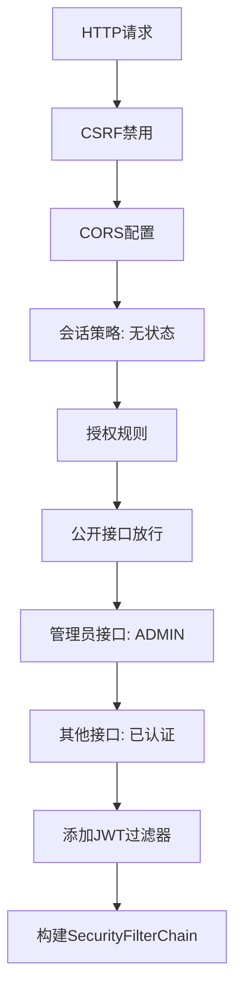
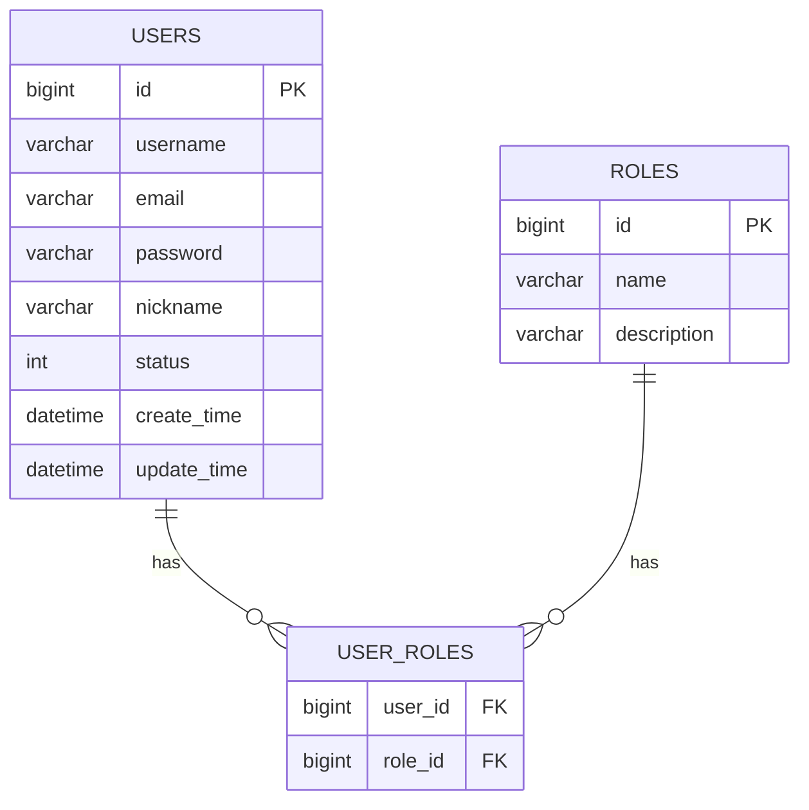
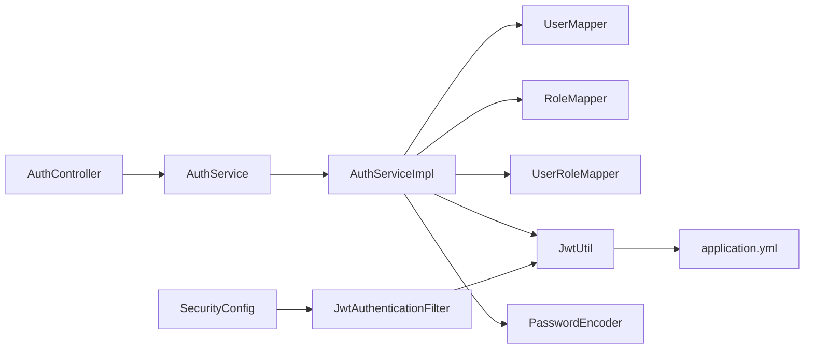

# 用户认证模块

<cite>
**本文档引用的文件**
- [AuthController.java](file://src/main/java/org/example/backend/modules/auth/controller/AuthController.java)
- [AuthService.java](file://src/main/java/org/example/backend/modules/auth/service/AuthService.java)
- [AuthServiceImpl.java](file://src/main/java/org/example/backend/modules/auth/service/impl/AuthServiceImpl.java)
- [JwtAuthenticationFilter.java](file://src/main/java/org/example/backend/modules/auth/filter/JwtAuthenticationFilter.java)
- [SecurityConfig.java](file://src/main/java/org/example/backend/config/SecurityConfig.java)
- [JwtUtil.java](file://src/main/java/org/example/backend/config/JwtUtil.java)
- [LoginDTO.java](file://src/main/java/org/example/backend/dto/auth/LoginDTO.java)
- [RegisterDTO.java](file://src/main/java/org/example/backend/dto/auth/RegisterDTO.java)
- [LoginVO.java](file://src/main/java/org/example/backend/vo/auth/LoginVO.java)
- [Constants.java](file://src/main/java/org/example/backend/common/constants/Constants.java)
- [User.java](file://src/main/java/org/example/backend/entity/User.java)
- [Role.java](file://src/main/java/org/example/backend/entity/Role.java)
- [UserRole.java](file://src/main/java/org/example/backend/entity/UserRole.java)
- [UserMapper.java](file://src/main/java/org/example/backend/modules/user/repository/UserMapper.java)
- [application.yml](file://src/main/resources/application.yml)
</cite>

## 目录
1. [简介](#简介)
2. [项目结构](#项目结构)
3. [核心组件](#核心组件)
4. [架构总览](#架构总览)
5. [详细组件分析](#详细组件分析)
6. [依赖关系分析](#依赖关系分析)
7. [性能考虑](#性能考虑)
8. [故障排除指南](#故障排除指南)
9. [结论](#结论)
10. [附录](#附录)

## 简介
本文件为用户认证模块的详细技术文档，覆盖用户注册、登录、权限验证的完整实现流程。重点说明JWT令牌生成与验证机制、Spring Security安全配置、用户角色权限体系、认证过滤器工作原理、密码加密策略以及会话管理机制。同时提供完整的API接口文档、安全最佳实践、常见问题解决方案与性能优化建议，并给出扩展指导与自定义认证方式的实现方法。

## 项目结构
认证模块采用分层架构设计，主要包含以下层次：
- 控制层：对外暴露REST接口，负责接收请求与返回统一响应格式
- 业务层：封装认证逻辑，处理用户注册、登录、权限校验
- 安全层：基于Spring Security与JWT实现无状态认证与授权
- 数据访问层：通过MyBatis-Plus访问数据库，完成用户、角色、权限数据的读写

图表来源
- [AuthController.java](file://src/main/java/org/example/backend/modules/auth/controller/AuthController.java#L1-L41)
- [AuthService.java](file://src/main/java/org/example/backend/modules/auth/service/AuthService.java#L1-L23)
- [AuthServiceImpl.java](file://src/main/java/org/example/backend/modules/auth/service/impl/AuthServiceImpl.java#L1-L122)
- [SecurityConfig.java](file://src/main/java/org/example/backend/config/SecurityConfig.java#L1-L101)
- [JwtAuthenticationFilter.java](file://src/main/java/org/example/backend/modules/auth/filter/JwtAuthenticationFilter.java#L1-L70)
- [JwtUtil.java](file://src/main/java/org/example/backend/config/JwtUtil.java#L1-L92)
- [UserMapper.java](file://src/main/java/org/example/backend/modules/user/repository/UserMapper.java#L1-L27)
- [Constants.java](file://src/main/java/org/example/backend/common/constants/Constants.java#L1-L79)

章节来源
- [AuthController.java](file://src/main/java/org/example/backend/modules/auth/controller/AuthController.java#L1-L41)
- [AuthService.java](file://src/main/java/org/example/backend/modules/auth/service/AuthService.java#L1-L23)
- [AuthServiceImpl.java](file://src/main/java/org/example/backend/modules/auth/service/impl/AuthServiceImpl.java#L1-L122)
- [SecurityConfig.java](file://src/main/java/org/example/backend/config/SecurityConfig.java#L1-L101)
- [JwtAuthenticationFilter.java](file://src/main/java/org/example/backend/modules/auth/filter/JwtAuthenticationFilter.java#L1-L70)
- [JwtUtil.java](file://src/main/java/org/example/backend/config/JwtUtil.java#L1-L92)
- [UserMapper.java](file://src/main/java/org/example/backend/modules/user/repository/UserMapper.java#L1-L27)
- [Constants.java](file://src/main/java/org/example/backend/common/constants/Constants.java#L1-L79)

## 核心组件
- 认证控制器：提供注册与登录接口，调用认证服务并返回统一响应
- 认证服务实现：实现注册、登录、密码校验、角色查询与JWT生成
- JWT工具类：负责令牌生成、解析、校验与密钥管理
- JWT认证过滤器：拦截请求，提取并验证JWT，设置认证上下文
- Spring Security配置：定义放行规则、CORS策略、无状态会话策略与过滤器链
- 数据模型与映射器：用户、角色、用户角色实体及对应Mapper
- DTO与VO：输入输出数据传输对象
- 系统常量：令牌头、前缀、默认角色、用户状态等常量定义

章节来源
- [AuthController.java](file://src/main/java/org/example/backend/modules/auth/controller/AuthController.java#L1-L41)
- [AuthServiceImpl.java](file://src/main/java/org/example/backend/modules/auth/service/impl/AuthServiceImpl.java#L1-L122)
- [JwtUtil.java](file://src/main/java/org/example/backend/config/JwtUtil.java#L1-L92)
- [JwtAuthenticationFilter.java](file://src/main/java/org/example/backend/modules/auth/filter/JwtAuthenticationFilter.java#L1-L70)
- [SecurityConfig.java](file://src/main/java/org/example/backend/config/SecurityConfig.java#L1-L101)
- [User.java](file://src/main/java/org/example/backend/entity/User.java#L1-L64)
- [Role.java](file://src/main/java/org/example/backend/entity/Role.java#L1-L32)
- [UserRole.java](file://src/main/java/org/example/backend/entity/UserRole.java#L1-L24)
- [LoginDTO.java](file://src/main/java/org/example/backend/dto/auth/LoginDTO.java#L1-L20)
- [RegisterDTO.java](file://src/main/java/org/example/backend/dto/auth/RegisterDTO.java#L1-L30)
- [LoginVO.java](file://src/main/java/org/example/backend/vo/auth/LoginVO.java#L1-L32)
- [Constants.java](file://src/main/java/org/example/backend/common/constants/Constants.java#L1-L79)

## 架构总览
认证模块采用“无状态会话”设计，基于Spring Security与JWT实现：
- 请求进入时，JWT认证过滤器从请求头提取令牌并验证有效性
- 验证通过后，将用户身份与角色注入到Spring Security上下文中
- 控制器根据业务需求进行权限判断（如管理员接口需ADMIN角色）
- 注册与登录流程分别封装在认证服务中，统一返回标准响应

图表来源
- [AuthController.java](file://src/main/java/org/example/backend/modules/auth/controller/AuthController.java#L26-L38)
- [AuthServiceImpl.java](file://src/main/java/org/example/backend/modules/auth/service/impl/AuthServiceImpl.java#L43-L119)
- [UserMapper.java](file://src/main/java/org/example/backend/modules/user/repository/UserMapper.java#L14-L24)
- [JwtUtil.java](file://src/main/java/org/example/backend/config/JwtUtil.java#L30-L42)
- [SecurityConfig.java](file://src/main/java/org/example/backend/config/SecurityConfig.java#L46-L78)

## 详细组件分析

### 认证控制器（AuthController）
- 职责：提供注册与登录两个公开接口，调用认证服务并返回统一响应
- 注册接口：接收RegisterDTO，调用认证服务完成用户创建与默认角色分配
- 登录接口：接收LoginDTO，调用认证服务完成用户校验与JWT生成，返回LoginVO

章节来源
- [AuthController.java](file://src/main/java/org/example/backend/modules/auth/controller/AuthController.java#L26-L38)

### 认证服务接口与实现（AuthService/Impl）
- 接口职责：定义注册与登录两个核心方法
- 实现要点：
  - 注册：校验用户名与邮箱唯一性，使用BCrypt加密密码，创建用户并分配默认角色
  - 登录：支持用户名或邮箱登录，校验用户状态与密码，查询用户角色，生成JWT并封装登录信息

图表来源
- [AuthService.java](file://src/main/java/org/example/backend/modules/auth/service/AuthService.java#L10-L21)
- [AuthServiceImpl.java](file://src/main/java/org/example/backend/modules/auth/service/impl/AuthServiceImpl.java#L25-L119)

章节来源
- [AuthService.java](file://src/main/java/org/example/backend/modules/auth/service/AuthService.java#L1-L23)
- [AuthServiceImpl.java](file://src/main/java/org/example/backend/modules/auth/service/impl/AuthServiceImpl.java#L43-L119)

### JWT工具类（JwtUtil）
- 功能：生成、解析、校验JWT；管理签名密钥与过期时间
- 关键方法：
  - generateToken：构建包含用户ID与角色的JWT
  - validateToken：校验令牌有效性（基于过期时间）
  - getUserIdFromToken/getRoleFromToken：从令牌中提取用户ID与角色
  - getSigningKey：基于配置密钥生成HS256签名密钥

图表来源
- [JwtUtil.java](file://src/main/java/org/example/backend/config/JwtUtil.java#L18-L92)

章节来源
- [JwtUtil.java](file://src/main/java/org/example/backend/config/JwtUtil.java#L30-L81)
- [application.yml](file://src/main/resources/application.yml#L44-L47)

### JWT认证过滤器（JwtAuthenticationFilter）
- 工作原理：
  - 从请求头提取Bearer令牌
  - 使用JwtUtil验证令牌有效性
  - 解析用户ID与角色，构造认证对象并注入Security上下文
  - 将用户ID写入请求属性，便于后续业务使用
- 异常处理：令牌无效时继续过滤链，交由Spring Security处理

图表来源
- [JwtAuthenticationFilter.java](file://src/main/java/org/example/backend/modules/auth/filter/JwtAuthenticationFilter.java#L28-L56)
- [JwtUtil.java](file://src/main/java/org/example/backend/config/JwtUtil.java#L74-L81)
- [Constants.java](file://src/main/java/org/example/backend/common/constants/Constants.java#L11-L21)

章节来源
- [JwtAuthenticationFilter.java](file://src/main/java/org/example/backend/modules/auth/filter/JwtAuthenticationFilter.java#L28-L67)

### Spring Security配置（SecurityConfig）
- 无状态会话：禁用Session，使用STATELESS策略
- 放行规则：认证接口、Swagger、部分公开接口无需认证
- 权限规则：管理员接口需ADMIN角色，其余接口需认证
- 过滤器链：在UsernamePasswordAuthenticationFilter之前添加JWT认证过滤器
- CORS配置：允许跨域访问

图表来源
- [SecurityConfig.java](file://src/main/java/org/example/backend/config/SecurityConfig.java#L46-L81)

章节来源
- [SecurityConfig.java](file://src/main/java/org/example/backend/config/SecurityConfig.java#L46-L98)

### 数据模型与映射器
- 用户实体：包含用户名、邮箱、密码、昵称、状态、时间戳等字段
- 角色实体：包含角色ID、名称（ADMIN/USER）、描述
- 用户角色关联：多对多关系的中间表
- 用户Mapper：提供按用户名与邮箱查询用户的方法

图表来源
- [User.java](file://src/main/java/org/example/backend/entity/User.java#L14-L62)
- [Role.java](file://src/main/java/org/example/backend/entity/Role.java#L12-L30)
- [UserRole.java](file://src/main/java/org/example/backend/entity/UserRole.java#L10-L22)
- [UserMapper.java](file://src/main/java/org/example/backend/modules/user/repository/UserMapper.java#L12-L24)

章节来源
- [User.java](file://src/main/java/org/example/backend/entity/User.java#L1-L64)
- [Role.java](file://src/main/java/org/example/backend/entity/Role.java#L1-L32)
- [UserRole.java](file://src/main/java/org/example/backend/entity/UserRole.java#L1-L24)
- [UserMapper.java](file://src/main/java/org/example/backend/modules/user/repository/UserMapper.java#L1-L27)

### DTO与VO
- RegisterDTO：注册输入参数（用户名、邮箱、密码、昵称），含校验注解
- LoginDTO：登录输入参数（用户名或邮箱、密码），含校验注解
- LoginVO：登录输出对象（token、userId、username、role）

章节来源
- [RegisterDTO.java](file://src/main/java/org/example/backend/dto/auth/RegisterDTO.java#L1-L30)
- [LoginDTO.java](file://src/main/java/org/example/backend/dto/auth/LoginDTO.java#L1-L20)
- [LoginVO.java](file://src/main/java/org/example/backend/vo/auth/LoginVO.java#L1-L32)

### 系统常量（Constants）
- 令牌相关：TOKEN_HEADER、TOKEN_PREFIX、USER_ID_HEADER
- 角色常量：ROLE_ADMIN、ROLE_USER
- 用户状态：USER_STATUS_ENABLED、USER_STATUS_DISABLED
- 默认分页大小与搜索模式等

章节来源
- [Constants.java](file://src/main/java/org/example/backend/common/constants/Constants.java#L11-L51)

## 依赖关系分析
- 控制器依赖认证服务接口
- 认证服务实现依赖用户、角色、用户角色Mapper与JwtUtil、PasswordEncoder
- JWT认证过滤器依赖JwtUtil与Constants
- SecurityConfig依赖JwtAuthenticationFilter并配置过滤器链
- 应用配置文件提供JWT密钥与过期时间等参数

图表来源
- [AuthController.java](file://src/main/java/org/example/backend/modules/auth/controller/AuthController.java#L23-L24)
- [AuthServiceImpl.java](file://src/main/java/org/example/backend/modules/auth/service/impl/AuthServiceImpl.java#L28-L41)
- [JwtAuthenticationFilter.java](file://src/main/java/org/example/backend/modules/auth/filter/JwtAuthenticationFilter.java#L25-L26)
- [SecurityConfig.java](file://src/main/java/org/example/backend/config/SecurityConfig.java#L32-L33)
- [application.yml](file://src/main/resources/application.yml#L44-L47)

章节来源
- [AuthController.java](file://src/main/java/org/example/backend/modules/auth/controller/AuthController.java#L1-L41)
- [AuthServiceImpl.java](file://src/main/java/org/example/backend/modules/auth/service/impl/AuthServiceImpl.java#L1-L122)
- [JwtAuthenticationFilter.java](file://src/main/java/org/example/backend/modules/auth/filter/JwtAuthenticationFilter.java#L1-L70)
- [SecurityConfig.java](file://src/main/java/org/example/backend/config/SecurityConfig.java#L1-L101)
- [application.yml](file://src/main/resources/application.yml#L44-L47)

## 性能考虑
- 无状态认证：避免服务器端会话存储，降低内存占用与分布式一致性复杂度
- 密码加密：使用BCrypt，强度高且具备成本因子，建议生产环境保持默认配置
- JWT体积：仅包含必要声明（userId、role），避免携带敏感信息
- 缓存策略：可结合Redis缓存热点用户信息与黑名单，减少数据库压力
- 并发控制：登录失败次数限制与账户锁定策略可防止暴力破解
- 过滤器链：确保JWT过滤器位于认证过滤器之前，避免重复认证

## 故障排除指南
- 登录失败
  - 检查用户名或邮箱是否存在，确认用户状态是否启用
  - 核对密码是否匹配（使用BCrypt校验）
  - 确认前端传参是否包含正确的Authorization头（Bearer Token）
- 令牌无效
  - 校验JWT密钥与过期时间配置是否正确
  - 确认请求头格式是否符合“Bearer ”前缀
  - 检查令牌是否过期或被篡改
- 权限拒绝
  - 确认用户角色是否正确分配（默认USER）
  - 管理员接口需ADMIN角色，检查角色查询逻辑
- CORS问题
  - 检查CORS配置是否允许来源、方法与头部
- 数据库异常
  - 确认用户、角色、用户角色表结构与Mapper映射正确

章节来源
- [AuthServiceImpl.java](file://src/main/java/org/example/backend/modules/auth/service/impl/AuthServiceImpl.java#L82-L100)
- [JwtUtil.java](file://src/main/java/org/example/backend/config/JwtUtil.java#L74-L81)
- [SecurityConfig.java](file://src/main/java/org/example/backend/config/SecurityConfig.java#L86-L98)
- [Constants.java](file://src/main/java/org/example/backend/common/constants/Constants.java#L11-L21)

## 结论
本认证模块以Spring Security与JWT为核心，实现了无状态、可扩展的用户认证与授权体系。通过清晰的分层设计与严格的权限控制，既能满足当前业务需求，也为未来扩展（如多因素认证、第三方登录、动态权限）提供了良好基础。

## 附录

### API接口文档

- 注册接口
  - 方法与路径：POST /api/auth/register
  - 请求体：RegisterDTO
    - 字段：username（必填，3-20字符）、email（必填，邮箱格式）、password（必填，≥6位）、nickname（可选）
  - 成功响应：统一响应（无数据体）
  - 错误：
    - 用户名已存在
    - 邮箱已被注册
- 登录接口
  - 方法与路径：POST /api/auth/login
  - 请求体：LoginDTO
    - 字段：username（必填，用户名或邮箱）、password（必填）
  - 成功响应：统一响应，包含LoginVO
    - 字段：token（字符串）、userId（整数）、username（字符串）、role（字符串）
  - 错误：
    - 用户名或密码错误
    - 账号已被禁用

章节来源
- [AuthController.java](file://src/main/java/org/example/backend/modules/auth/controller/AuthController.java#L26-L38)
- [RegisterDTO.java](file://src/main/java/org/example/backend/dto/auth/RegisterDTO.java#L15-L27)
- [LoginDTO.java](file://src/main/java/org/example/backend/dto/auth/LoginDTO.java#L13-L17)
- [LoginVO.java](file://src/main/java/org/example/backend/vo/auth/LoginVO.java#L14-L29)

### 安全最佳实践
- 密钥管理：JWT密钥必须足够长且保密，部署时务必替换默认值
- 传输安全：生产环境启用HTTPS，防止令牌在传输中泄露
- 令牌策略：合理设置过期时间，支持刷新令牌机制
- 输入校验：严格使用DTO校验与白名单参数，避免SQL注入与XSS
- 权限最小化：遵循RBAC模型，尽量使用细粒度权限
- 审计日志：记录关键操作（登录、登出、权限变更）以便追踪

### 扩展指导与自定义认证方式
- 自定义认证Provider：实现AuthenticationProvider接口，集成LDAP/短信验证码等认证源
- 多租户支持：在JWT中加入租户标识，在过滤器中解析并注入上下文
- 动态权限：结合RBAC与资源级权限，使用方法级注解（@PreAuthorize）实现细粒度控制
- 第三方登录：接入OAuth2/OIDC，返回统一的用户标识与角色信息
- 会话管理：若需有状态会话，可在SecurityConfig中调整SessionCreationPolicy并配合Redis存储