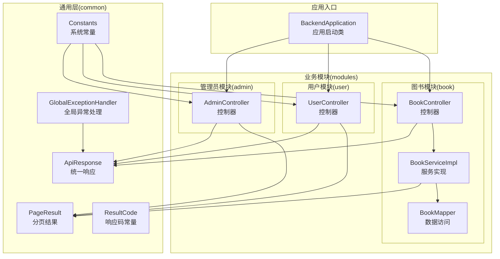
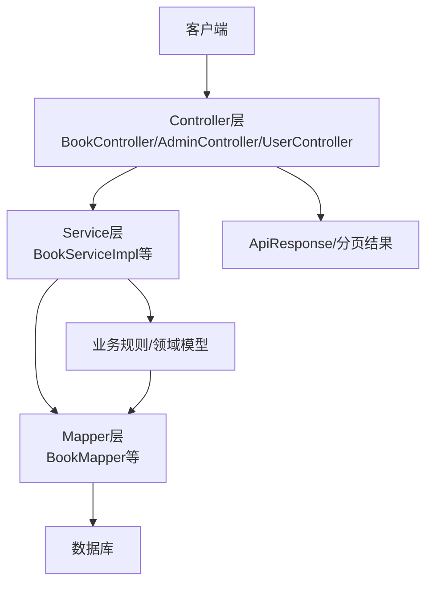
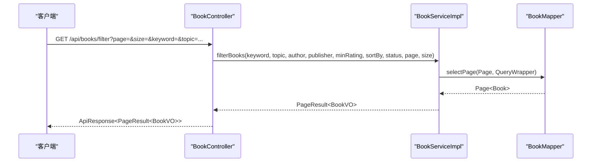
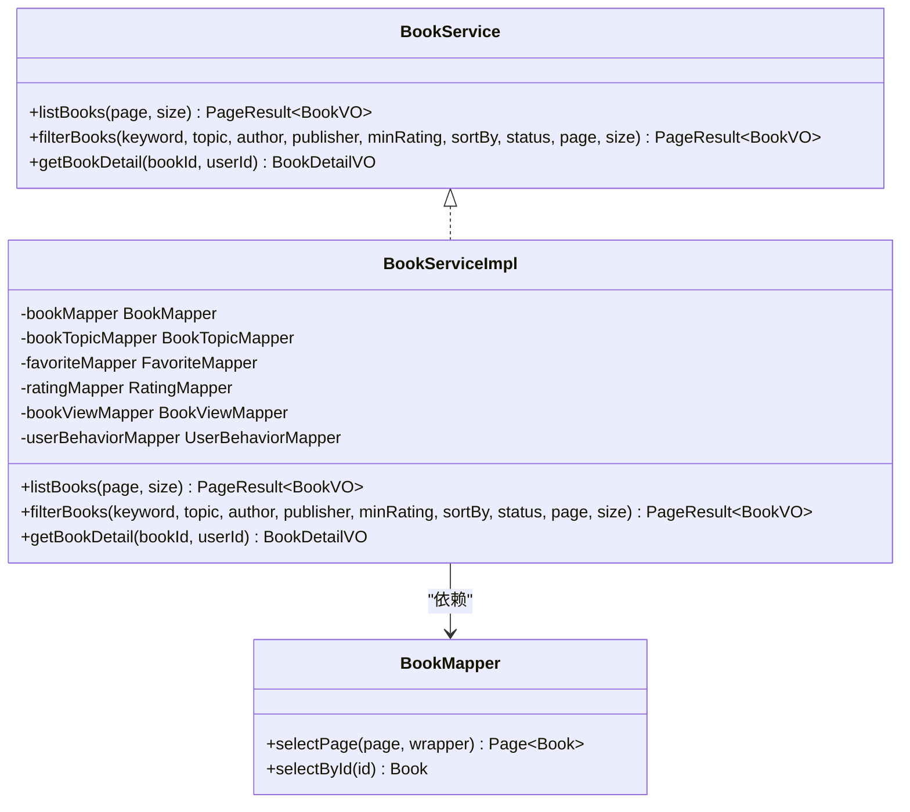
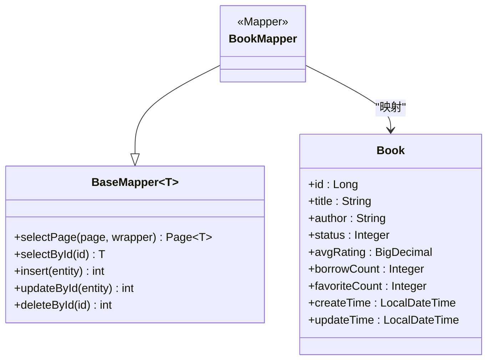
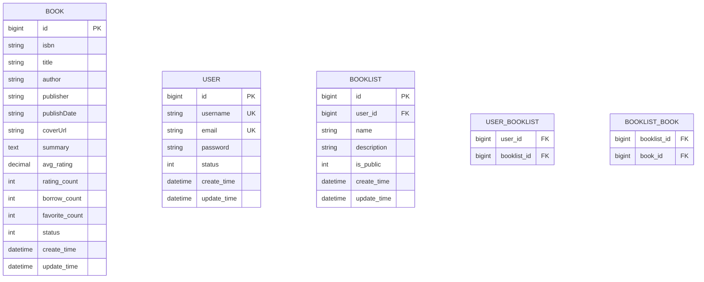
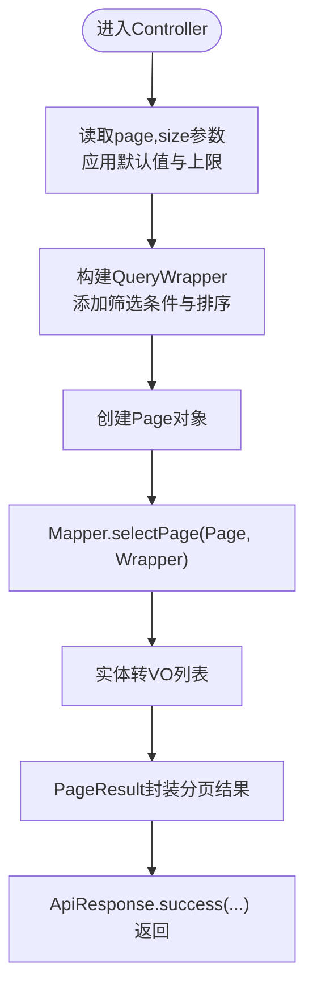
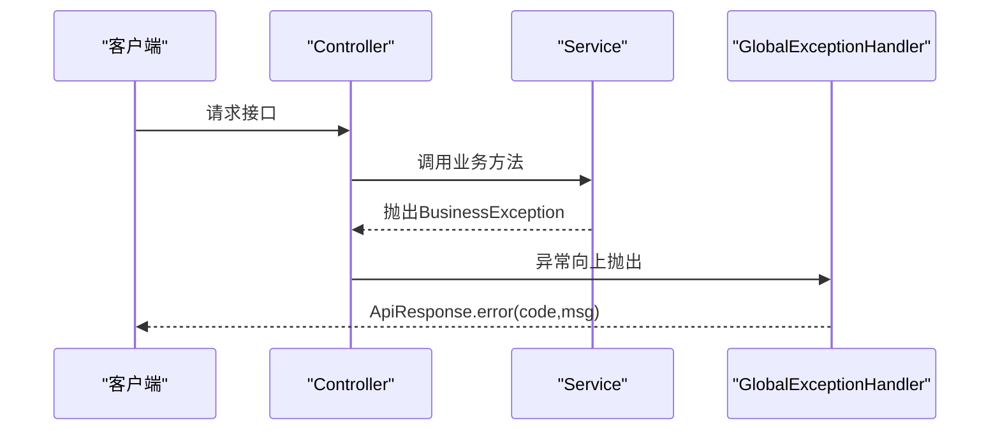
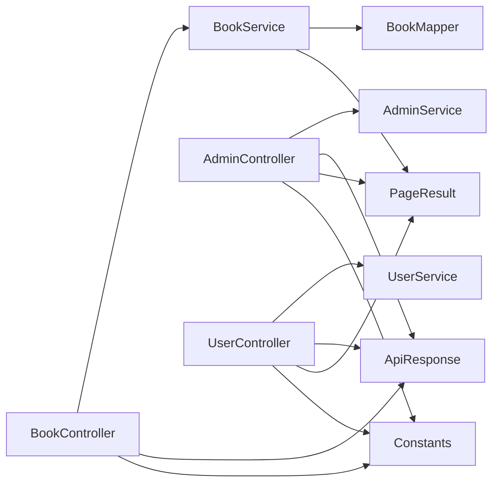

# 分层架构设计

<cite>
**本文档引用的文件**
- [BackendApplication.java](file://src/main/java/org/example/backend/BackendApplication.java)
- [ApiResponse.java](file://src/main/java/org/example/backend/common/ApiResponse.java)
- [PageResult.java](file://src/main/java/org/example/backend/common/PageResult.java)
- [ResultCode.java](file://src/main/java/org/example/backend/common/ResultCode.java)
- [GlobalExceptionHandler.java](file://src/main/java/org/example/backend/common/exception/GlobalExceptionHandler.java)
- [Constants.java](file://src/main/java/org/example/backend/common/constants/Constants.java)
- [BookController.java](file://src/main/java/org/example/backend/modules/book/controller/BookController.java)
- [BookServiceImpl.java](file://src/main/java/org/example/backend/modules/book/service/impl/BookServiceImpl.java)
- [BookMapper.java](file://src/main/java/org/example/backend/modules/book/repository/BookMapper.java)
- [AdminController.java](file://src/main/java/org/example/backend/modules/admin/controller/AdminController.java)
- [UserController.java](file://src/main/java/org/example/backend/modules/user/controller/UserController.java)
- [BooklistDTO.java](file://src/main/java/org/example/backend/dto/user/BooklistDTO.java)
- [BooklistVO.java](file://src/main/java/org/example/backend/vo/user/BooklistVO.java)
- [Book.java](file://src/main/java/org/example/backend/entity/Book.java)
- [application.yml](file://src/main/resources/application.yml)
</cite>

## 目录
1. [引言](#引言)
2. [项目结构](#项目结构)
3. [核心组件](#核心组件)
4. [架构总览](#架构总览)
5. [详细组件分析](#详细组件分析)
6. [依赖关系分析](#依赖关系分析)
7. [性能考虑](#性能考虑)
8. [故障排除指南](#故障排除指南)
9. [结论](#结论)

## 引言
本文件面向智能图书推荐系统，提供完整的分层架构设计文档。系统采用经典的MVC三层架构，结合统一响应封装、分页查询、DTO/VO数据传输对象、全局异常处理与接口抽象，实现清晰的职责分离与松耦合设计。本文将深入解析Controller层的请求接收与响应封装、Service层的业务逻辑与事务边界、Mapper层的数据持久化，并阐明各层间的调用流程与依赖关系。

## 项目结构
后端采用基于模块的分层组织方式，核心目录如下：
- common：通用工具与基础设施（统一响应、分页、异常处理、常量）
- modules：业务模块（admin、auth、book、interaction、recommend、search、user）
- entity：MyBatis-Plus实体模型
- dto/vo：数据传输对象与视图对象
- resources：配置文件与数据库初始化脚本

**图表来源**
- [BackendApplication.java](file://src/main/java/org/example/backend/BackendApplication.java#L1-L14)
- [ApiResponse.java](file://src/main/java/org/example/backend/common/ApiResponse.java#L1-L89)
- [PageResult.java](file://src/main/java/org/example/backend/common/PageResult.java#L1-L60)
- [ResultCode.java](file://src/main/java/org/example/backend/common/ResultCode.java#L1-L44)
- [GlobalExceptionHandler.java](file://src/main/java/org/example/backend/common/exception/GlobalExceptionHandler.java#L1-L111)
- [Constants.java](file://src/main/java/org/example/backend/common/constants/Constants.java#L1-L79)
- [BookController.java](file://src/main/java/org/example/backend/modules/book/controller/BookController.java#L1-L60)
- [BookServiceImpl.java](file://src/main/java/org/example/backend/modules/book/service/impl/BookServiceImpl.java#L1-L249)
- [BookMapper.java](file://src/main/java/org/example/backend/modules/book/repository/BookMapper.java#L1-L14)
- [AdminController.java](file://src/main/java/org/example/backend/modules/admin/controller/AdminController.java#L1-L314)
- [UserController.java](file://src/main/java/org/example/backend/modules/user/controller/UserController.java#L1-L219)

**章节来源**
- [BackendApplication.java](file://src/main/java/org/example/backend/BackendApplication.java#L1-L14)
- [application.yml](file://src/main/resources/application.yml#L1-L71)

## 核心组件
- 统一响应封装：ApiResponse提供成功/失败/未授权/禁止访问等静态方法，确保前后端一致的响应格式。
- 分页结果封装：PageResult封装分页字段（当前页、页大小、总记录数、总页数、数据列表），简化分页接口实现。
- 响应码常量：ResultCode集中定义业务状态码，便于统一管理和扩展。
- 全局异常处理：GlobalExceptionHandler对业务异常、参数校验异常、认证/权限异常进行分类处理，保证异常信息标准化输出。
- 系统常量：Constants集中管理JWT、分页、角色、状态等常量，避免魔法值。

**章节来源**
- [ApiResponse.java](file://src/main/java/org/example/backend/common/ApiResponse.java#L1-L89)
- [PageResult.java](file://src/main/java/org/example/backend/common/PageResult.java#L1-L60)
- [ResultCode.java](file://src/main/java/org/example/backend/common/ResultCode.java#L1-L44)
- [GlobalExceptionHandler.java](file://src/main/java/org/example/backend/common/exception/GlobalExceptionHandler.java#L1-L111)
- [Constants.java](file://src/main/java/org/example/backend/common/constants/Constants.java#L1-L79)

## 架构总览
系统采用MVC三层架构：
- Controller层：负责HTTP请求接收、参数校验、调用Service并封装ApiResponse响应。
- Service层：实现业务逻辑、处理事务边界、协调多个Mapper操作。
- Mapper层：基于MyBatis-Plus的BaseMapper接口，提供数据持久化能力。

**图表来源**
- [BookController.java](file://src/main/java/org/example/backend/modules/book/controller/BookController.java#L1-L60)
- [BookServiceImpl.java](file://src/main/java/org/example/backend/modules/book/service/impl/BookServiceImpl.java#L1-L249)
- [BookMapper.java](file://src/main/java/org/example/backend/modules/book/repository/BookMapper.java#L1-L14)
- [ApiResponse.java](file://src/main/java/org/example/backend/common/ApiResponse.java#L1-L89)
- [PageResult.java](file://src/main/java/org/example/backend/common/PageResult.java#L1-L60)

## 详细组件分析

### Controller层：请求接收与响应封装
- 职责边界：接收HTTP请求、参数绑定与校验、调用Service、封装ApiResponse统一响应。
- 关键实现：
  - 图书模块：BookController提供分页查询、多条件筛选、详情获取等接口，统一返回ApiResponse<PageResult<T>>或ApiResponse<T>。
  - 管理员模块：AdminController提供资源管理、用户管理、系统配置、推荐策略、数据分析、借阅管理、行为日志等功能，均通过ApiResponse封装。
  - 用户模块：UserController提供用户信息、借阅历史、收藏、书单、兴趣偏好、浏览记录等接口，统一处理未登录场景并返回相应状态。
- 设计原则：接口幂等性、参数校验前置、异常捕获与响应标准化。

**图表来源**
- [BookController.java](file://src/main/java/org/example/backend/modules/book/controller/BookController.java#L34-L49)
- [BookServiceImpl.java](file://src/main/java/org/example/backend/modules/book/service/impl/BookServiceImpl.java#L78-L173)
- [BookMapper.java](file://src/main/java/org/example/backend/modules/book/repository/BookMapper.java#L1-L14)

**章节来源**
- [BookController.java](file://src/main/java/org/example/backend/modules/book/controller/BookController.java#L1-L60)
- [AdminController.java](file://src/main/java/org/example/backend/modules/admin/controller/AdminController.java#L1-L314)
- [UserController.java](file://src/main/java/org/example/backend/modules/user/controller/UserController.java#L1-L219)

### Service层：业务逻辑与事务边界
- 职责边界：实现业务规则、数据转换（DTO/VO）、跨表查询与聚合、异常处理与日志记录。
- 关键实现：
  - 图书模块：BookServiceImpl实现分页查询、多条件筛选、详情获取、浏览记录与用户行为同步等逻辑；根据用户角色动态调整查询条件。
  - 管理员模块：AdminController依赖AdminService，具体实现位于AdminServiceImpl（文件位于modules/admin/service/impl/AdminServiceImpl.java）。
  - 用户模块：UserController依赖UserService，具体实现位于UserServiceImpl（文件位于modules/user/service/impl/UserServiceImpl.java）。
- 设计原则：接口抽象（BookService、AdminService、UserService等）、松耦合依赖注入、异常向上传递、日志记录与降级处理。

**图表来源**
- [BookServiceImpl.java](file://src/main/java/org/example/backend/modules/book/service/impl/BookServiceImpl.java#L1-L249)
- [BookMapper.java](file://src/main/java/org/example/backend/modules/book/repository/BookMapper.java#L1-L14)

**章节来源**
- [BookServiceImpl.java](file://src/main/java/org/example/backend/modules/book/service/impl/BookServiceImpl.java#L1-L249)

### Mapper层：数据持久化操作
- 职责边界：基于MyBatis-Plus的BaseMapper接口，提供标准CRUD与分页查询能力。
- 关键实现：
  - BookMapper继承BaseMapper<Book>，提供分页查询与单条查询能力。
  - 其他模块的Mapper接口（如BookTopicMapper、FavoriteMapper、RatingMapper等）遵循相同模式。
- 设计原则：接口最小化、与实体解耦、配合Service层进行复杂查询组装。

**图表来源**
- [BookMapper.java](file://src/main/java/org/example/backend/modules/book/repository/BookMapper.java#L1-L14)
- [Book.java](file://src/main/java/org/example/backend/entity/Book.java#L1-L95)

**章节来源**
- [BookMapper.java](file://src/main/java/org/example/backend/modules/book/repository/BookMapper.java#L1-L14)
- [Book.java](file://src/main/java/org/example/backend/entity/Book.java#L1-L95)

### DTO/VO数据传输对象与实体模型
- DTO（数据传输对象）：用于接收请求参数，如BooklistDTO，包含字段校验注解，确保输入合法性。
- VO（视图对象）：用于对外输出，如BooklistVO，包含业务展示所需字段与嵌套对象。
- 实体模型：Book等实体对应数据库表结构，通过MyBatis-Plus映射。

**图表来源**
- [Book.java](file://src/main/java/org/example/backend/entity/Book.java#L1-L95)
- [BooklistVO.java](file://src/main/java/org/example/backend/vo/user/BooklistVO.java#L1-L72)

**章节来源**
- [BooklistDTO.java](file://src/main/java/org/example/backend/dto/user/BooklistDTO.java#L1-L33)
- [BooklistVO.java](file://src/main/java/org/example/backend/vo/user/BooklistVO.java#L1-L72)
- [Book.java](file://src/main/java/org/example/backend/entity/Book.java#L1-L95)

### 分页查询实现机制
- 控制器层：接收page、size参数，默认值由Constants提供，最大值限制由配置约束。
- 服务层：使用MyBatis-Plus Page对象与LambdaQueryWrapper构建查询条件，执行分页查询。
- 结果封装：将实体列表转换为VO列表，使用PageResult封装分页元数据。

**图表来源**
- [BookController.java](file://src/main/java/org/example/backend/modules/book/controller/BookController.java#L25-L49)
- [BookServiceImpl.java](file://src/main/java/org/example/backend/modules/book/service/impl/BookServiceImpl.java#L55-L173)
- [Constants.java](file://src/main/java/org/example/backend/common/constants/Constants.java#L24-L31)

**章节来源**
- [BookController.java](file://src/main/java/org/example/backend/modules/book/controller/BookController.java#L25-L49)
- [BookServiceImpl.java](file://src/main/java/org/example/backend/modules/book/service/impl/BookServiceImpl.java#L55-L173)
- [Constants.java](file://src/main/java/org/example/backend/common/constants/Constants.java#L24-L31)

### 错误处理与异常传播机制
- 全局异常处理：GlobalExceptionHandler统一拦截业务异常、参数校验异常、认证/权限异常，返回标准化ApiResponse。
- 业务异常：Service层抛出BusinessException，由全局处理器捕获并返回业务错误码与消息。
- 参数校验：支持@RequestBody、@ModelAttribute、@RequestParam三种场景的参数校验异常处理。
- 未登录/权限不足：控制器层在需要鉴权的接口中返回未授权或禁止访问响应。

**图表来源**
- [GlobalExceptionHandler.java](file://src/main/java/org/example/backend/common/exception/GlobalExceptionHandler.java#L33-L38)
- [BookController.java](file://src/main/java/org/example/backend/modules/book/controller/BookController.java#L53-L56)

**章节来源**
- [GlobalExceptionHandler.java](file://src/main/java/org/example/backend/common/exception/GlobalExceptionHandler.java#L1-L111)
- [BookController.java](file://src/main/java/org/example/backend/modules/book/controller/BookController.java#L53-L56)

## 依赖关系分析
- 控制器依赖服务接口：Controller通过@Autowired注入Service接口，实现松耦合。
- 服务依赖Mapper接口：Service通过@Autowired注入多个Mapper接口，完成数据访问。
- 统一响应与分页：所有控制器均依赖ApiResponse与PageResult，保证响应一致性。
- 常量与配置：Constants被控制器与服务广泛使用，application.yml提供运行时配置。

**图表来源**
- [BookController.java](file://src/main/java/org/example/backend/modules/book/controller/BookController.java#L1-L60)
- [BookServiceImpl.java](file://src/main/java/org/example/backend/modules/book/service/impl/BookServiceImpl.java#L1-L249)
- [BookMapper.java](file://src/main/java/org/example/backend/modules/book/repository/BookMapper.java#L1-L14)
- [AdminController.java](file://src/main/java/org/example/backend/modules/admin/controller/AdminController.java#L1-L314)
- [UserController.java](file://src/main/java/org/example/backend/modules/user/controller/UserController.java#L1-L219)
- [ApiResponse.java](file://src/main/java/org/example/backend/common/ApiResponse.java#L1-L89)
- [PageResult.java](file://src/main/java/org/example/backend/common/PageResult.java#L1-L60)
- [Constants.java](file://src/main/java/org/example/backend/common/constants/Constants.java#L1-L79)

**章节来源**
- [BookController.java](file://src/main/java/org/example/backend/modules/book/controller/BookController.java#L1-L60)
- [BookServiceImpl.java](file://src/main/java/org/example/backend/modules/book/service/impl/BookServiceImpl.java#L1-L249)
- [BookMapper.java](file://src/main/java/org/example/backend/modules/book/repository/BookMapper.java#L1-L14)
- [AdminController.java](file://src/main/java/org/example/backend/modules/admin/controller/AdminController.java#L1-L314)
- [UserController.java](file://src/main/java/org/example/backend/modules/user/controller/UserController.java#L1-L219)
- [ApiResponse.java](file://src/main/java/org/example/backend/common/ApiResponse.java#L1-L89)
- [PageResult.java](file://src/main/java/org/example/backend/common/PageResult.java#L1-L60)
- [Constants.java](file://src/main/java/org/example/backend/common/constants/Constants.java#L1-L79)

## 性能考虑
- 分页查询：合理设置默认页大小与最大页大小，避免一次性加载大量数据。
- 查询优化：使用LambdaQueryWrapper精准构造查询条件，必要时建立索引以提升筛选效率。
- 缓存策略：可结合Redis缓存热点数据（如热门图书、用户画像），降低数据库压力。
- 日志与监控：开启SQL日志与业务日志，结合APM工具监控接口耗时与异常。

## 故障排除指南
- 参数校验失败：检查DTO字段注解与前端传参，查看全局异常处理器返回的错误信息。
- 未登录/权限不足：确认JWT令牌与用户角色，检查控制器上的鉴权注解与全局安全配置。
- 业务异常：捕获BusinessException，核对业务规则与数据状态。
- 数据库连接问题：检查application.yml中的数据源配置与网络连通性。

**章节来源**
- [GlobalExceptionHandler.java](file://src/main/java/org/example/backend/common/exception/GlobalExceptionHandler.java#L43-L78)
- [application.yml](file://src/main/resources/application.yml#L10-L43)

## 结论
该智能图书推荐系统通过清晰的MVC分层架构实现了高内聚、低耦合的设计目标。Controller层专注于请求与响应，Service层承载业务逻辑与事务边界，Mapper层提供数据持久化能力。统一响应、分页封装、DTO/VO与全局异常处理共同保障了系统的可维护性与可扩展性。建议在现有基础上引入缓存与监控体系，进一步提升系统性能与可观测性。