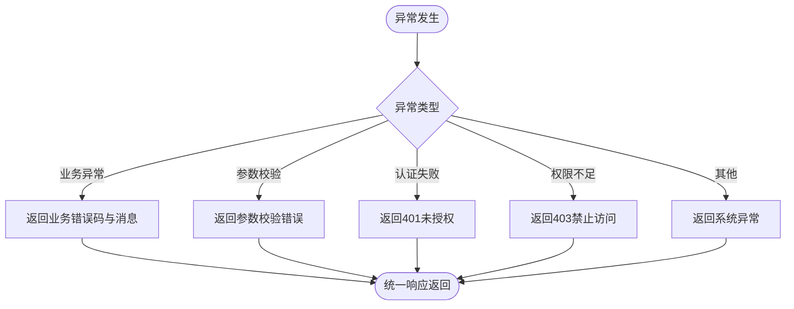

# 整体架构设计

<cite>
**本文档引用的文件**
- [BackendApplication.java](file://src/main/java/org/example/backend/BackendApplication.java)
- [application.yml](file://src/main/resources/application.yml)
- [Constants.java](file://src/main/java/org/example/backend/common/constants/Constants.java)
- [ApiResponse.java](file://src/main/java/org/example/backend/common/ApiResponse.java)
- [PageResult.java](file://src/main/java/org/example/backend/common/PageResult.java)
- [JwtUtil.java](file://src/main/java/org/example/backend/config/JwtUtil.java)
- [SecurityConfig.java](file://src/main/java/org/example/backend/config/SecurityConfig.java)
- [MyBatisPlusConfig.java](file://src/main/java/org/example/backend/config/MyBatisPlusConfig.java)
- [WebMvcConfig.java](file://src/main/java/org/example/backend/config/WebMvcConfig.java)
- [GlobalExceptionHandler.java](file://src/main/java/org/example/backend/common/exception/GlobalExceptionHandler.java)
- [AuthController.java](file://src/main/java/org/example/backend/modules/auth/controller/AuthController.java)
- [BookController.java](file://src/main/java/org/example/backend/modules/book/controller/BookController.java)
- [RecommendController.java](file://src/main/java/org/example/backend/modules/recommend/controller/RecommendController.java)
- [AuthService.java](file://src/main/java/org/example/backend/modules/auth/service/AuthService.java)
- [BookService.java](file://src/main/java/org/example/backend/modules/book/service/BookService.java)
</cite>

## 目录
1. [引言](#引言)
2. [项目结构](#项目结构)
3. [核心组件](#核心组件)
4. [架构总览](#架构总览)
5. [详细组件分析](#详细组件分析)
6. [依赖关系分析](#依赖关系分析)
7. [性能考虑](#性能考虑)
8. [故障排除指南](#故障排除指南)
9. [结论](#结论)

## 引言
本项目是一个基于Spring Boot的智能图书推荐系统，采用三层架构与MVC模式相结合的设计。系统通过表现层（Controller）、业务逻辑层（Service）、数据访问层（Mapper）清晰分离职责，配合Spring Security实现认证与授权，使用MyBatis-Plus提供高效的ORM能力，并通过统一响应体与全局异常处理提升开发效率与用户体验。

## 项目结构
系统采用按功能域划分的模块化组织方式，主要模块包括：
- 认证模块：负责用户注册、登录与令牌发放
- 图书管理模块：提供图书浏览、筛选、详情展示
- 推荐系统模块：实现个性化推荐、热门榜单、主题推荐等
- 用户交互模块：包含借阅、评分、收藏、评论等行为
- 管理后台模块：提供统计与系统配置管理
- 搜索模块：提供关键词、语义与混合搜索能力

图表来源
- [AuthController.java](file://src/main/java/org/example/backend/modules/auth/controller/AuthController.java#L1-L41)
- [BookController.java](file://src/main/java/org/example/backend/modules/book/controller/BookController.java#L1-L60)
- [RecommendController.java](file://src/main/java/org/example/backend/modules/recommend/controller/RecommendController.java#L1-L130)

章节来源
- [BackendApplication.java](file://src/main/java/org/example/backend/BackendApplication.java#L1-L14)
- [application.yml](file://src/main/resources/application.yml#L1-L71)

## 核心组件
- 统一响应体：所有接口返回统一格式，便于前端处理与调试
- 分页封装：提供标准分页模型，简化分页查询的返回结构
- 常量定义：集中管理JWT头、角色、状态码等系统常量
- 全局异常处理：对业务异常、参数校验异常、认证与授权异常进行统一处理
- 安全配置：基于Spring Security的无状态认证、CORS跨域与路径级权限控制
- JWT工具：生成与解析JWT，携带用户标识与角色信息
- MyBatis-Plus配置：分页插件与Mapper扫描，支持逻辑删除与驼峰映射
- Web MVC配置：静态资源与文件上传路径映射

章节来源
- [ApiResponse.java](file://src/main/java/org/example/backend/common/ApiResponse.java#L1-L89)
- [PageResult.java](file://src/main/java/org/example/backend/common/PageResult.java#L1-L60)
- [Constants.java](file://src/main/java/org/example/backend/common/constants/Constants.java#L1-L79)
- [GlobalExceptionHandler.java](file://src/main/java/org/example/backend/common/exception/GlobalExceptionHandler.java#L1-L111)
- [SecurityConfig.java](file://src/main/java/org/example/backend/config/SecurityConfig.java#L1-L101)
- [JwtUtil.java](file://src/main/java/org/example/backend/config/JwtUtil.java#L1-L92)
- [MyBatisPlusConfig.java](file://src/main/java/org/example/backend/config/MyBatisPlusConfig.java#L1-L28)
- [WebMvcConfig.java](file://src/main/java/org/example/backend/config/WebMvcConfig.java#L1-L29)

## 架构总览
系统采用Spring Boot自动装配，结合Spring Security实现无状态JWT认证，MyBatis-Plus提供ORM与分页能力。请求处理流程遵循MVC模式：Controller接收请求、调用Service、Service协调Mapper与领域逻辑、返回统一响应体；异常通过全局异常处理器统一捕获与转换。

图表来源
- [AuthController.java](file://src/main/java/org/example/backend/modules/auth/controller/AuthController.java#L26-L38)
- [BookController.java](file://src/main/java/org/example/backend/modules/book/controller/BookController.java#L25-L56)
- [RecommendController.java](file://src/main/java/org/example/backend/modules/recommend/controller/RecommendController.java#L27-L127)
- [ApiResponse.java](file://src/main/java/org/example/backend/common/ApiResponse.java#L42-L58)

## 详细组件分析

### 表现层（Controller）
- 认证控制器：提供注册与登录接口，返回登录VO与JWT令牌
- 图书控制器：提供分页查询、多条件筛选、详情获取等接口
- 推荐控制器：提供首页推荐、热门榜、主题推荐、相似推荐、曝光与点击记录等接口

图表来源
- [AuthController.java](file://src/main/java/org/example/backend/modules/auth/controller/AuthController.java#L1-L41)
- [BookController.java](file://src/main/java/org/example/backend/modules/book/controller/BookController.java#L1-L60)
- [RecommendController.java](file://src/main/java/org/example/backend/modules/recommend/controller/RecommendController.java#L1-L130)

章节来源
- [AuthController.java](file://src/main/java/org/example/backend/modules/auth/controller/AuthController.java#L26-L38)
- [BookController.java](file://src/main/java/org/example/backend/modules/book/controller/BookController.java#L25-L56)
- [RecommendController.java](file://src/main/java/org/example/backend/modules/recommend/controller/RecommendController.java#L27-L127)

### 业务逻辑层（Service）
- 认证服务接口：定义注册与登录契约
- 图书服务接口：定义分页、筛选与详情查询契约
- 推荐服务接口：定义个性化推荐、热门榜、主题推荐等契约

图表来源
- [AuthService.java](file://src/main/java/org/example/backend/modules/auth/service/AuthService.java#L1-L23)
- [BookService.java](file://src/main/java/org/example/backend/modules/book/service/BookService.java#L1-L39)

章节来源
- [AuthService.java](file://src/main/java/org/example/backend/modules/auth/service/AuthService.java#L10-L21)
- [BookService.java](file://src/main/java/org/example/backend/modules/book/service/BookService.java#L10-L37)

### 数据访问层（Mapper）
- 采用MyBatis-Plus，通过注解与XML映射SQL
- 使用逻辑删除字段与驼峰命名映射
- 自动分页插件支持MySQL方言

图表来源
- [MyBatisPlusConfig.java](file://src/main/java/org/example/backend/config/MyBatisPlusConfig.java#L14-L25)

章节来源
- [MyBatisPlusConfig.java](file://src/main/java/org/example/backend/config/MyBatisPlusConfig.java#L1-L28)

### 安全与认证
- 基于JWT的无状态认证，支持角色权限控制
- Spring Security配置公开接口、静态资源与管理接口的访问策略
- CORS跨域配置支持前后端联调

图表来源
- [SecurityConfig.java](file://src/main/java/org/example/backend/config/SecurityConfig.java#L52-L78)
- [JwtUtil.java](file://src/main/java/org/example/backend/config/JwtUtil.java#L74-L81)

章节来源
- [SecurityConfig.java](file://src/main/java/org/example/backend/config/SecurityConfig.java#L46-L81)
- [JwtUtil.java](file://src/main/java/org/example/backend/config/JwtUtil.java#L30-L58)

### 统一响应与异常处理
- 统一响应体封装成功/失败/未授权/禁止访问等场景
- 全局异常处理器捕获业务异常、参数校验异常、认证与授权异常
- 返回标准错误码与友好提示信息

图表来源
- [GlobalExceptionHandler.java](file://src/main/java/org/example/backend/common/exception/GlobalExceptionHandler.java#L33-L108)
- [ApiResponse.java](file://src/main/java/org/example/backend/common/ApiResponse.java#L42-L86)

章节来源
- [GlobalExceptionHandler.java](file://src/main/java/org/example/backend/common/exception/GlobalExceptionHandler.java#L25-L108)
- [ApiResponse.java](file://src/main/java/org/example/backend/common/ApiResponse.java#L10-L87)

## 依赖关系分析
系统核心依赖关系如下：
- 应用入口与自动装配：Spring Boot启动类负责组件扫描与自动配置
- 配置层：application.yml提供数据源、MyBatis-Plus、Redis、JWT、Swagger、文件上传等配置
- 安全层：SecurityConfig与JwtUtil共同完成认证与授权
- 数据层：MyBatis-Plus配置与Mapper扫描确保DAO层高效运行
- 控制器层：各模块Controller依赖对应Service接口
- 异常层：全局异常处理器统一拦截并转换异常

图表来源
- [BackendApplication.java](file://src/main/java/org/example/backend/BackendApplication.java#L6-L11)
- [application.yml](file://src/main/resources/application.yml#L10-L71)
- [SecurityConfig.java](file://src/main/java/org/example/backend/config/SecurityConfig.java#L35-L81)
- [JwtUtil.java](file://src/main/java/org/example/backend/config/JwtUtil.java#L18-L42)
- [MyBatisPlusConfig.java](file://src/main/java/org/example/backend/config/MyBatisPlusConfig.java#L13-L25)
- [WebMvcConfig.java](file://src/main/java/org/example/backend/config/WebMvcConfig.java#L11-L26)
- [GlobalExceptionHandler.java](file://src/main/java/org/example/backend/common/exception/GlobalExceptionHandler.java#L25-L108)

章节来源
- [application.yml](file://src/main/resources/application.yml#L1-L71)
- [SecurityConfig.java](file://src/main/java/org/example/backend/config/SecurityConfig.java#L1-L101)
- [JwtUtil.java](file://src/main/java/org/example/backend/config/JwtUtil.java#L1-L92)
- [MyBatisPlusConfig.java](file://src/main/java/org/example/backend/config/MyBatisPlusConfig.java#L1-L28)
- [WebMvcConfig.java](file://src/main/java/org/example/backend/config/WebMvcConfig.java#L1-L29)
- [GlobalExceptionHandler.java](file://src/main/java/org/example/backend/common/exception/GlobalExceptionHandler.java#L1-L111)

## 性能考虑
- 无状态认证：JWT避免服务器端会话存储，降低扩展性压力
- 分页插件：MyBatis-Plus内置分页拦截器，减少一次性加载大量数据
- 逻辑删除：通过逻辑删除字段避免物理删除带来的索引重建成本
- 缓存策略：可结合Redis缓存热点数据与推荐结果（当前配置项存在但未在代码中显式使用）
- SQL优化：建议为高频查询建立合适索引，避免N+1查询问题

## 故障排除指南
- 认证失败：检查JWT密钥配置与过期时间设置，确认请求头中携带正确的Authorization头
- 参数校验失败：查看全局异常处理器对MethodArgumentNotValidException与BindException的处理
- 权限不足：核对SecurityConfig中的路径匹配规则与角色配置
- 数据访问异常：检查MyBatis-Plus配置与Mapper扫描包路径，确认实体类与表结构映射正确
- 文件上传异常：确认WebMvcConfig中静态资源映射与文件上传路径配置

章节来源
- [SecurityConfig.java](file://src/main/java/org/example/backend/config/SecurityConfig.java#L52-L78)
- [GlobalExceptionHandler.java](file://src/main/java/org/example/backend/common/exception/GlobalExceptionHandler.java#L43-L98)
- [MyBatisPlusConfig.java](file://src/main/java/org/example/backend/config/MyBatisPlusConfig.java#L14-L25)
- [WebMvcConfig.java](file://src/main/java/org/example/backend/config/WebMvcConfig.java#L20-L25)

## 结论
本系统通过Spring Boot自动装配与模块化设计，实现了清晰的分层架构与职责分离。结合Spring Security与JWT提供了可靠的认证授权机制，MyBatis-Plus提升了数据访问效率。统一响应体与全局异常处理增强了系统的可维护性与一致性。建议后续完善Redis缓存策略与监控体系，持续优化推荐算法与数据库索引，以支撑更大规模的用户与数据增长。