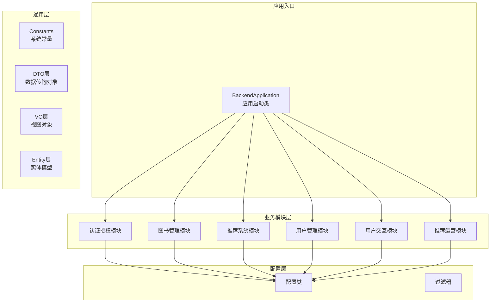
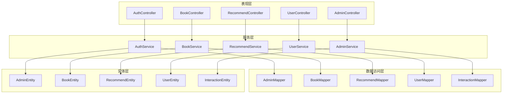
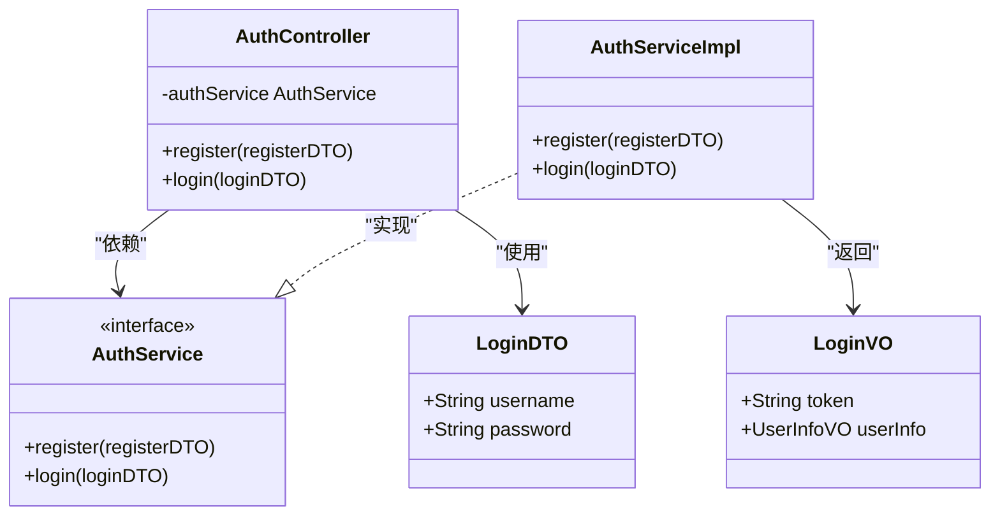
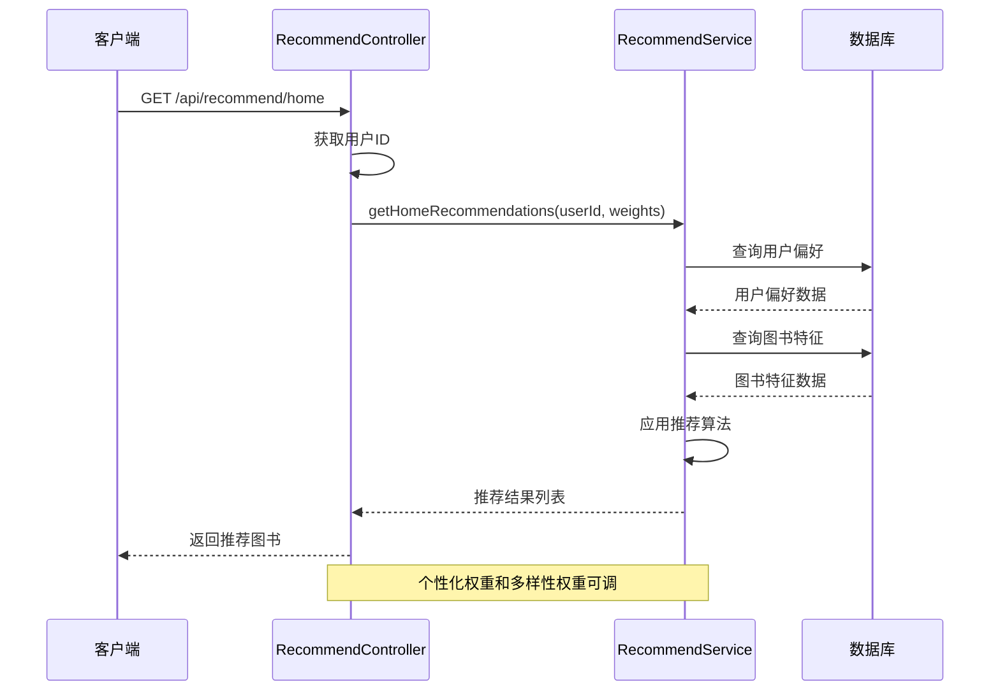
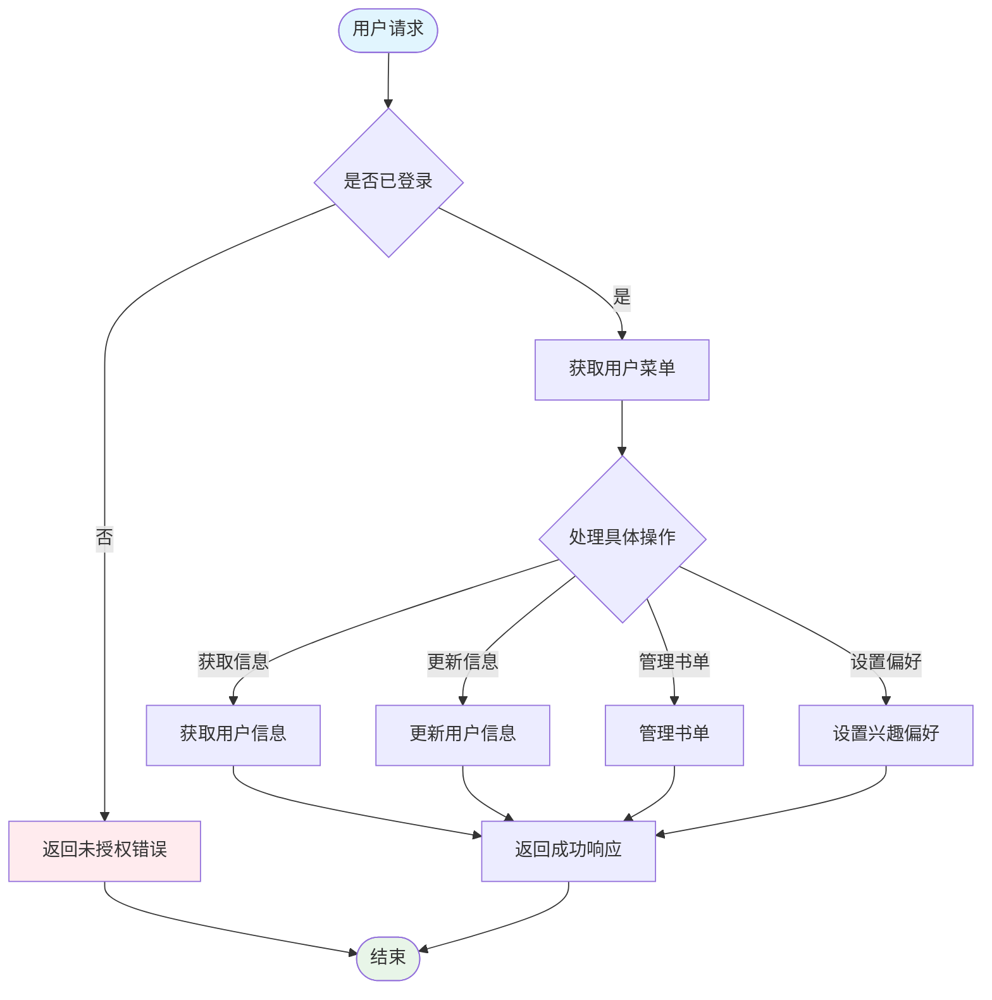
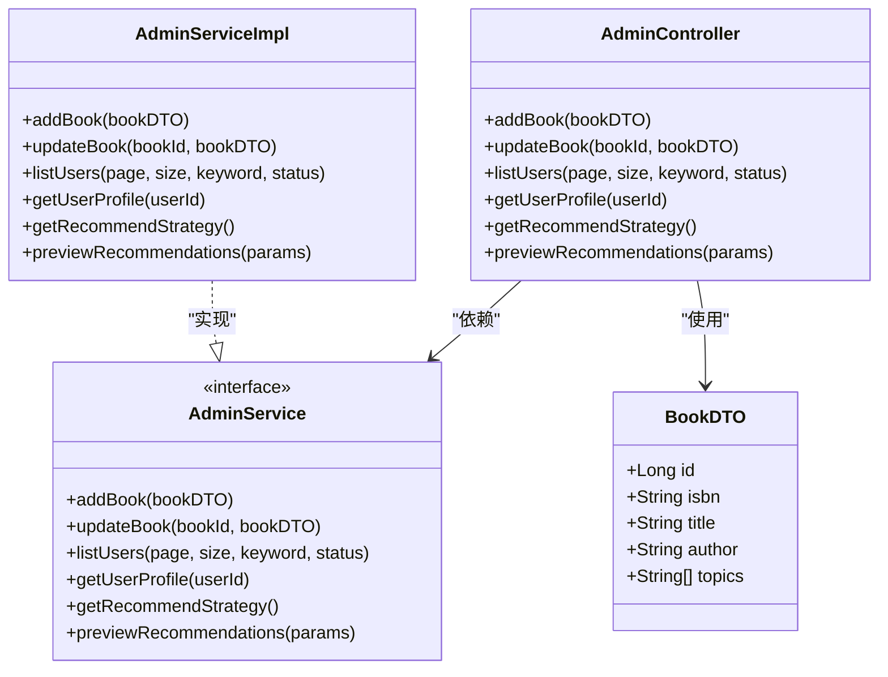
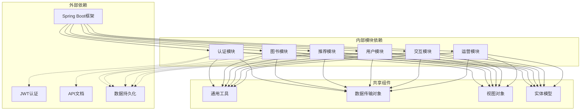

# 模块划分设计

<cite>
**本文档引用的文件**
- [BackendApplication.java](file://src/main/java/org/example/backend/BackendApplication.java)
- [Constants.java](file://src/main/java/org/example/backend/common/constants/Constants.java)
- [LoginDTO.java](file://src/main/java/org/example/backend/dto/auth/LoginDTO.java)
- [BookDTO.java](file://src/main/java/org/example/backend/dto/admin/BookDTO.java)
- [AuthController.java](file://src/main/java/org/example/backend/modules/auth/controller/AuthController.java)
- [BookController.java](file://src/main/java/org/example/backend/modules/book/controller/BookController.java)
- [RecommendController.java](file://src/main/java/org/example/backend/modules/recommend/controller/RecommendController.java)
- [UserController.java](file://src/main/java/org/example/backend/modules/user/controller/UserController.java)
- [AdminController.java](file://src/main/java/org/example/backend/modules/admin/controller/AdminController.java)
- [AuthService.java](file://src/main/java/org/example/backend/modules/auth/service/AuthService.java)
- [BookService.java](file://src/main/java/org/example/backend/modules/book/service/BookService.java)
- [RecommendService.java](file://src/main/java/org/example/backend/modules/recommend/service/RecommendService.java)
- [UserService.java](file://src/main/java/org/example/backend/modules/user/service/UserService.java)
- [AdminService.java](file://src/main/java/org/example/backend/modules/admin/service/AdminService.java)
</cite>

## 目录
1. [引言](#引言)
2. [项目结构](#项目结构)
3. [核心模块](#核心模块)
4. [架构概览](#架构概览)
5. [详细组件分析](#详细组件分析)
6. [依赖关系分析](#依赖关系分析)
7. [性能考虑](#性能考虑)
8. [故障排除指南](#故障排除指南)
9. [结论](#结论)

## 引言

本设计文档针对智能图书推荐系统创建了完整的模块划分设计方案。该系统采用基于功能域的模块化组织结构，将整个应用划分为六个核心模块：认证授权模块、图书管理模块、推荐系统模块、用户交互模块、用户管理模块和推荐运营模块。

这种模块化设计的核心理念是实现高内聚、低耦合的系统架构，通过清晰的职责边界和接口定义，确保各模块能够独立开发、测试和维护。每个模块都围绕特定的业务领域构建，既保持了功能的完整性，又避免了模块间的过度依赖。

## 项目结构

系统采用标准的Spring Boot项目结构，按照功能域进行模块化组织：

**图表来源**
- [BackendApplication.java](file://src/main/java/org/example/backend/BackendApplication.java#L1-L14)
- [Constants.java](file://src/main/java/org/example/backend/common/constants/Constants.java#L1-L79)

**章节来源**
- [BackendApplication.java](file://src/main/java/org/example/backend/BackendApplication.java#L1-L14)

## 核心模块

### 认证授权模块 (Auth Module)

认证授权模块负责系统的用户身份验证和权限控制，提供安全的访问控制机制。

**职责边界：**
- 用户注册和登录
- JWT令牌生成和验证
- 权限拦截和角色管理
- 安全过滤器实现

**核心组件：**
- 控制器层：处理HTTP请求和响应
- 服务层：实现认证业务逻辑
- 过滤器层：拦截和验证请求

**对外接口：**
- RESTful API端点
- JWT令牌管理
- 角色权限控制

### 图书管理模块 (Book Module)

图书管理模块负责图书资源的完整生命周期管理，提供丰富的图书检索和浏览功能。

**职责边界：**
- 图书信息管理（增删改查）
- 图书分类和主题管理
- 图书状态控制（上下架）
- 多维度检索和筛选

**核心组件：**
- 图书控制器：处理图书相关请求
- 图书服务：实现业务逻辑
- 数据访问层：数据库操作

**对外接口：**
- 图书列表查询
- 图书详情获取
- 多条件筛选查询

### 推荐系统模块 (Recommend Module)

推荐系统模块是系统的核心智能引擎，提供个性化的图书推荐功能。

**职责边界：**
- 个性化推荐算法
- 推荐策略配置
- 用户行为分析
- 推荐效果追踪

**核心组件：**
- 推荐控制器：处理推荐相关请求
- 推荐服务：实现推荐算法
- 推荐策略管理
- 用户偏好分析

**对外接口：**
- 首页推荐（猜你喜欢）
- 相似图书推荐
- 主题推荐
- 热门推荐

### 用户管理模块 (User Module)

用户管理模块负责用户信息管理和个人中心功能。

**职责边界：**
- 用户基本信息管理
- 个人书单管理
- 借阅历史记录
- 兴趣偏好设置

**核心组件：**
- 用户控制器：处理用户相关请求
- 用户服务：实现用户业务逻辑
- 书单管理功能
- 偏好设置管理

**对外接口：**
- 用户信息查询和更新
- 书单管理
- 借阅历史查询
- 兴趣偏好设置

### 用户交互模块 (Interaction Module)

用户交互模块处理用户与图书之间的各种交互行为。

**职责边界：**
- 评分和评价系统
- 收藏功能
- 借阅申请
- 用户行为记录

**核心组件：**
- 交互控制器：处理交互相关请求
- 交互服务：实现交互业务逻辑
- 行为日志记录

**对外接口：**
- 评分提交
- 收藏管理
- 借阅申请
- 评论管理

### 推荐运营模块 (Admin Module)

推荐运营模块为管理员提供系统管理和运营分析功能。

**职责边界：**
- 系统资源配置
- 用户行为监控
- 推荐策略管理
- 数据统计分析

**核心组件：**
- 管理控制器：处理管理相关请求
- 管理服务：实现运营业务逻辑
- 统计分析功能

**对外接口：**
- 用户管理
- 图书管理
- 推荐策略配置
- 数据报表查看

**章节来源**
- [AuthController.java](file://src/main/java/org/example/backend/modules/auth/controller/AuthController.java#L1-L41)
- [BookController.java](file://src/main/java/org/example/backend/modules/book/controller/BookController.java#L1-L60)
- [RecommendController.java](file://src/main/java/org/example/backend/modules/recommend/controller/RecommendController.java#L1-L130)
- [UserController.java](file://src/main/java/org/example/backend/modules/user/controller/UserController.java#L1-L219)
- [AdminController.java](file://src/main/java/org/example/backend/modules/admin/controller/AdminController.java#L1-L314)

## 架构概览

系统采用分层架构设计，通过清晰的模块边界实现松耦合的系统结构：

**图表来源**
- [AuthController.java](file://src/main/java/org/example/backend/modules/auth/controller/AuthController.java#L1-L41)
- [BookController.java](file://src/main/java/org/example/backend/modules/book/controller/BookController.java#L1-L60)
- [RecommendController.java](file://src/main/java/org/example/backend/modules/recommend/controller/RecommendController.java#L1-L130)
- [UserController.java](file://src/main/java/org/example/backend/modules/user/controller/UserController.java#L1-L219)
- [AdminController.java](file://src/main/java/org/example/backend/modules/admin/controller/AdminController.java#L1-L314)

## 详细组件分析

### 认证授权模块详细分析

认证授权模块实现了完整的用户身份验证和权限控制系统：

**图表来源**
- [AuthController.java](file://src/main/java/org/example/backend/modules/auth/controller/AuthController.java#L1-L41)
- [AuthService.java](file://src/main/java/org/example/backend/modules/auth/service/AuthService.java#L1-L23)
- [LoginDTO.java](file://src/main/java/org/example/backend/dto/auth/LoginDTO.java#L1-L20)

**模块特点：**
- 使用JWT令牌进行无状态认证
- 支持用户名/邮箱双重登录方式
- 提供统一的异常处理机制
- 实现了完整的注册流程

### 推荐系统模块详细分析

推荐系统模块提供了多种推荐算法和策略配置：

**图表来源**
- [RecommendController.java](file://src/main/java/org/example/backend/modules/recommend/controller/RecommendController.java#L27-L39)
- [RecommendService.java](file://src/main/java/org/example/backend/modules/recommend/service/RecommendService.java#L12-L70)

**核心功能：**
- 首页推荐（猜你喜欢）
- 相似图书推荐
- 主题推荐
- 热门推荐
- 长尾推荐
- 推荐效果追踪

### 用户管理模块详细分析

用户管理模块实现了完整的用户个人信息管理体系：

**图表来源**
- [UserController.java](file://src/main/java/org/example/backend/modules/user/controller/UserController.java#L32-L52)
- [UserService.java](file://src/main/java/org/example/backend/modules/user/service/UserService.java#L15-L105)

**功能特性：**
- 用户信息的增删改查
- 个人书单的完整管理
- 兴趣偏好的个性化设置
- 借阅历史的完整记录
- 浏览行为的智能追踪

### 推荐运营模块详细分析

推荐运营模块为管理员提供了全面的系统管理功能：

**图表来源**
- [AdminController.java](file://src/main/java/org/example/backend/modules/admin/controller/AdminController.java#L35-L98)
- [AdminService.java](file://src/main/java/org/example/backend/modules/admin/service/AdminService.java#L15-L68)
- [BookDTO.java](file://src/main/java/org/example/backend/dto/admin/BookDTO.java#L1-L32)

**管理功能：**
- 图书资源的全生命周期管理
- 用户行为的实时监控
- 推荐策略的动态调整
- 系统配置的集中管理
- 数据统计的可视化展示

**章节来源**
- [AuthController.java](file://src/main/java/org/example/backend/modules/auth/controller/AuthController.java#L1-L41)
- [RecommendController.java](file://src/main/java/org/example/backend/modules/recommend/controller/RecommendController.java#L1-L130)
- [UserController.java](file://src/main/java/org/example/backend/modules/user/controller/UserController.java#L1-L219)
- [AdminController.java](file://src/main/java/org/example/backend/modules/admin/controller/AdminController.java#L1-L314)

## 依赖关系分析

系统模块间的依赖关系体现了清晰的分层架构和职责分离：

**图表来源**
- [Constants.java](file://src/main/java/org/example/backend/common/constants/Constants.java#L1-L79)

**依赖特点：**
- 所有模块都依赖于通用工具层
- DTO、VO、Entity作为跨模块的数据传输载体
- 外部框架提供基础能力支撑
- 模块间通过接口契约进行通信

**章节来源**
- [Constants.java](file://src/main/java/org/example/backend/common/constants/Constants.java#L1-L79)

## 性能考虑

模块化设计在性能方面具有显著优势：

### 缓存策略
- 推荐结果缓存：热门图书和推荐策略结果
- 用户偏好缓存：减少频繁的数据库查询
- 图书详情缓存：提升用户体验

### 并发处理
- 异步任务处理：推荐计算和数据分析
- 连接池优化：数据库连接复用
- 请求限流：防止系统过载

### 数据库优化
- 分表分库：按用户ID和图书ID进行分区
- 索引优化：针对常用查询字段建立索引
- 查询优化：使用合适的SQL语句和参数绑定

## 故障排除指南

### 常见问题及解决方案

**认证失败问题：**
- 检查JWT令牌的有效性和格式
- 验证用户凭据的正确性
- 确认用户账户状态正常

**推荐结果异常：**
- 检查用户偏好数据的完整性
- 验证推荐策略配置的正确性
- 查看推荐算法的日志输出

**数据库连接问题：**
- 检查数据库连接池配置
- 验证数据库服务的可用性
- 查看慢查询日志

**章节来源**
- [Constants.java](file://src/main/java/org/example/backend/common/constants/Constants.java#L1-L79)

## 结论

智能图书推荐系统的模块划分设计充分体现了现代软件工程的最佳实践。通过基于功能域的模块化组织，系统实现了：

**设计优势：**
- **高内聚性**：每个模块专注于特定的业务领域
- **低耦合性**：模块间通过清晰的接口进行通信
- **可扩展性**：新的功能可以独立开发和部署
- **可维护性**：代码结构清晰，便于理解和修改

**技术价值：**
- **代码复用性**：通用组件在多个模块中重用
- **可测试性**：模块边界清晰，便于单元测试和集成测试
- **可演进性**：模块化结构支持系统的持续迭代和优化

**业务价值：**
- **功能完整性**：覆盖了图书推荐系统的所有核心功能
- **用户体验**：通过个性化推荐提升用户满意度
- **运营效率**：为管理员提供完善的管理工具

这种模块化设计为系统的长期发展奠定了坚实的基础，既满足了当前的功能需求，也为未来的功能扩展和技术升级提供了充足的空间。