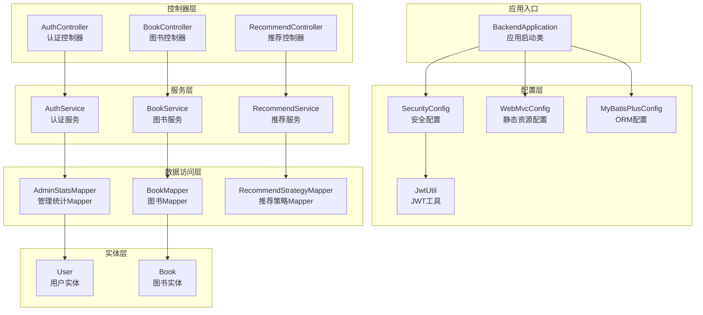
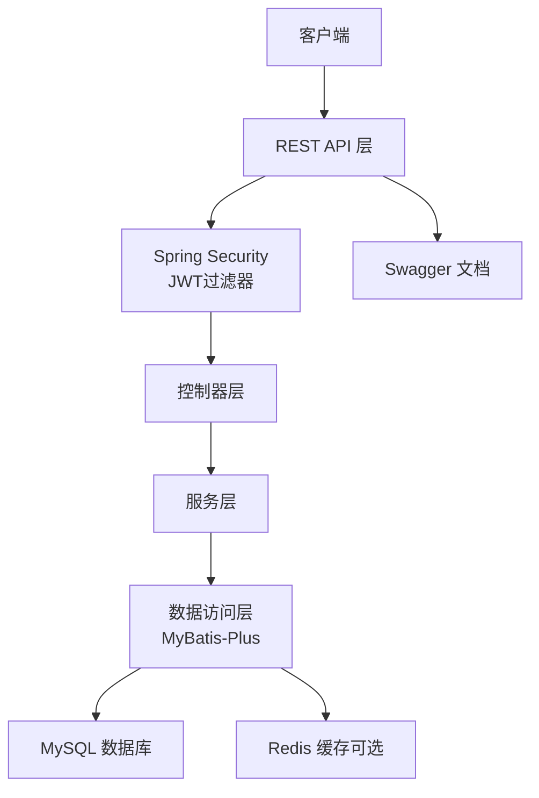
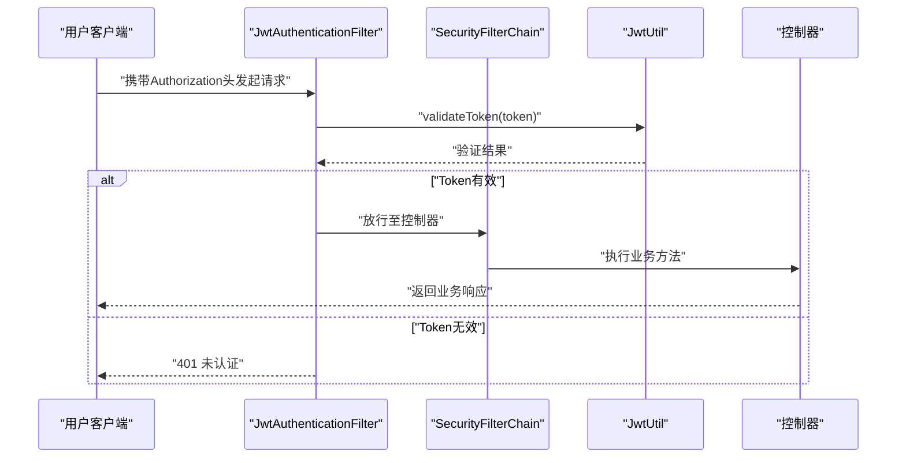
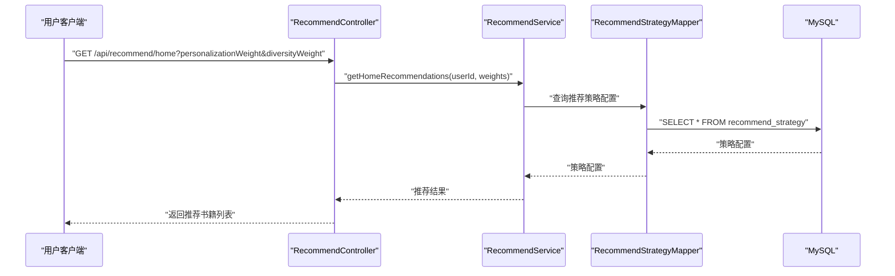
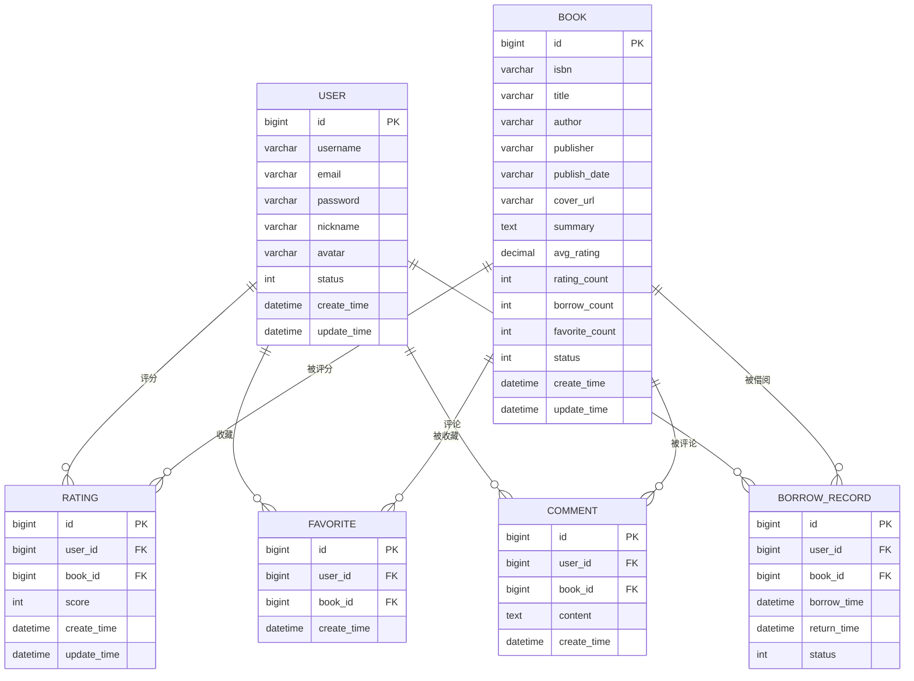
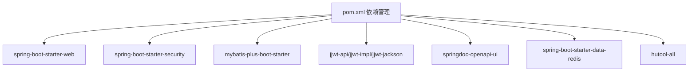

# 系统架构设计

<cite>
**本文档引用的文件**
- [BackendApplication.java](file://src/main/java/org/example/backend/BackendApplication.java)
- [pom.xml](file://pom.xml)
- [application.yml](file://src/main/resources/application.yml)
- [SecurityConfig.java](file://src/main/java/org/example/backend/config/SecurityConfig.java)
- [WebMvcConfig.java](file://src/main/java/org/example/backend/config/WebMvcConfig.java)
- [MyBatisPlusConfig.java](file://src/main/java/org/example/backend/config/MyBatisPlusConfig.java)
- [JwtUtil.java](file://src/main/java/org/example/backend/config/JwtUtil.java)
- [AuthController.java](file://src/main/java/org/example/backend/modules/auth/controller/AuthController.java)
- [RecommendController.java](file://src/main/java/org/example/backend/modules/recommend/controller/RecommendController.java)
- [BookController.java](file://src/main/java/org/example/backend/modules/book/controller/BookController.java)
- [GlobalExceptionHandler.java](file://src/main/java/org/example/backend/common/exception/GlobalExceptionHandler.java)
- [User.java](file://src/main/java/org/example/backend/entity/User.java)
- [Book.java](file://src/main/java/org/example/backend/entity/Book.java)
- [RecommendStrategyMapper.java](file://src/main/java/org/example/backend/modules/recommend/repository/RecommendStrategyMapper.java)
- [Constants.java](file://src/main/java/org/example/backend/common/constants/Constants.java)
</cite>

## 目录
1. [引言](#引言)
2. [项目结构](#项目结构)
3. [核心组件](#核心组件)
4. [架构总览](#架构总览)
5. [详细组件分析](#详细组件分析)
6. [依赖关系分析](#依赖关系分析)
7. [性能考虑](#性能考虑)
8. [故障排除指南](#故障排除指南)
9. [结论](#结论)

## 引言
本系统是一个基于Spring Boot的智能图书推荐后端服务，采用分层架构设计，遵循MVC模式与模块化组织结构。系统通过Spring Security保障安全，使用MyBatis-Plus进行数据持久化，结合JWT实现无状态认证，提供图书浏览、搜索、互动以及个性化推荐等核心功能。

## 项目结构
系统采用按功能域划分的模块化组织方式，主要模块包括：
- 认证模块：负责用户注册、登录与令牌发放
- 图书模块：提供图书列表、筛选、详情查询
- 推荐模块：实现首页推荐、热门榜、主题推荐、相似推荐等
- 交互模块：处理借阅申请、评论、收藏、评分等用户行为
- 管理模块：后台统计与系统配置管理
- 配置层：安全、Web、MyBatis-Plus、Swagger等全局配置
- 通用层：统一响应封装、异常处理、常量定义、上下文工具

**图表来源**
- [BackendApplication.java](file://src/main/java/org/example/backend/BackendApplication.java#L1-L14)
- [SecurityConfig.java](file://src/main/java/org/example/backend/config/SecurityConfig.java#L1-L101)
- [WebMvcConfig.java](file://src/main/java/org/example/backend/config/WebMvcConfig.java#L1-L29)
- [MyBatisPlusConfig.java](file://src/main/java/org/example/backend/config/MyBatisPlusConfig.java#L1-L28)
- [JwtUtil.java](file://src/main/java/org/example/backend/config/JwtUtil.java#L1-L92)
- [AuthController.java](file://src/main/java/org/example/backend/modules/auth/controller/AuthController.java#L1-L41)
- [BookController.java](file://src/main/java/org/example/backend/modules/book/controller/BookController.java#L1-L60)
- [RecommendController.java](file://src/main/java/org/example/backend/modules/recommend/controller/RecommendController.java#L1-L130)
- [User.java](file://src/main/java/org/example/backend/entity/User.java#L1-L64)
- [Book.java](file://src/main/java/org/example/backend/entity/Book.java#L1-L95)
- [RecommendStrategyMapper.java](file://src/main/java/org/example/backend/modules/recommend/repository/RecommendStrategyMapper.java#L1-L14)

**章节来源**
- [BackendApplication.java](file://src/main/java/org/example/backend/BackendApplication.java#L1-L14)
- [pom.xml](file://pom.xml#L1-L161)
- [application.yml](file://src/main/resources/application.yml#L1-L71)

## 核心组件
- 应用启动类：负责Spring Boot应用的引导与启动
- 安全配置：集成Spring Security，配置CORS、无状态会话、JWT过滤器与权限规则
- Web配置：静态资源映射与文件上传路径配置
- ORM配置：MyBatis-Plus分页插件与Mapper扫描
- JWT工具：Token生成、解析与验证
- 控制器层：RESTful接口暴露，统一返回格式
- 服务层：业务逻辑编排与领域服务调用
- 数据访问层：基于MyBatis-Plus的Mapper接口
- 实体层：数据库表对应的Java对象
- 异常处理：全局异常捕获与统一响应

**章节来源**
- [SecurityConfig.java](file://src/main/java/org/example/backend/config/SecurityConfig.java#L1-L101)
- [WebMvcConfig.java](file://src/main/java/org/example/backend/config/WebMvcConfig.java#L1-L29)
- [MyBatisPlusConfig.java](file://src/main/java/org/example/backend/config/MyBatisPlusConfig.java#L1-L28)
- [JwtUtil.java](file://src/main/java/org/example/backend/config/JwtUtil.java#L1-L92)
- [GlobalExceptionHandler.java](file://src/main/java/org/example/backend/common/exception/GlobalExceptionHandler.java#L1-L111)

## 架构总览
系统采用经典的三层架构与MVC分离：
- 表现层（Controller）：接收HTTP请求，参数校验，调用服务层，封装响应
- 业务层（Service）：编排领域操作，协调多个Repository与外部服务
- 数据访问层（Repository/MyBatis-Plus）：执行SQL与结果映射
- 配置层：横切关注点（安全、跨域、ORM、Swagger）集中配置

**图表来源**
- [SecurityConfig.java](file://src/main/java/org/example/backend/config/SecurityConfig.java#L46-L81)
- [JwtUtil.java](file://src/main/java/org/example/backend/config/JwtUtil.java#L30-L42)
- [application.yml](file://src/main/resources/application.yml#L10-L43)
- [application.yml](file://src/main/resources/application.yml#L49-L56)

## 详细组件分析

### 安全架构与认证流程
系统采用JWT无状态认证，通过自定义过滤器在请求到达控制器前完成身份验证与授权检查。

**图表来源**
- [SecurityConfig.java](file://src/main/java/org/example/backend/config/SecurityConfig.java#L78-L81)
- [JwtUtil.java](file://src/main/java/org/example/backend/config/JwtUtil.java#L74-L81)
- [Constants.java](file://src/main/java/org/example/backend/common/constants/Constants.java#L9-L22)

**章节来源**
- [SecurityConfig.java](file://src/main/java/org/example/backend/config/SecurityConfig.java#L24-L101)
- [JwtUtil.java](file://src/main/java/org/example/backend/config/JwtUtil.java#L15-L92)
- [Constants.java](file://src/main/java/org/example/backend/common/constants/Constants.java#L1-L79)

### 推荐系统接口与数据流
推荐模块提供多种推荐策略，支持个性化权重与多样性权重调节，并记录曝光与点击行为用于后续优化。

**图表来源**
- [RecommendController.java](file://src/main/java/org/example/backend/modules/recommend/controller/RecommendController.java#L27-L39)
- [RecommendStrategyMapper.java](file://src/main/java/org/example/backend/modules/recommend/repository/RecommendStrategyMapper.java#L1-L14)

**章节来源**
- [RecommendController.java](file://src/main/java/org/example/backend/modules/recommend/controller/RecommendController.java#L1-L130)

### 数据模型与关系
系统的核心实体围绕用户与图书展开，配合评分、收藏、借阅、评论等交互行为形成完整的数据生态。

**图表来源**
- [User.java](file://src/main/java/org/example/backend/entity/User.java#L1-L64)
- [Book.java](file://src/main/java/org/example/backend/entity/Book.java#L1-L95)

**章节来源**
- [User.java](file://src/main/java/org/example/backend/entity/User.java#L1-L64)
- [Book.java](file://src/main/java/org/example/backend/entity/Book.java#L1-L95)

### 设计模式应用
- 工厂模式：在推荐策略中，可通过配置动态选择不同的推荐算法组合，实现策略工厂化管理
- 策略模式：推荐服务根据权重参数动态调整个性化与多样性的平衡，体现策略切换能力
- 单例模式：JWT工具类与配置类以Spring单例形式提供全局共享实例
- 适配器模式：WebMvcConfig对静态资源访问路径进行适配，统一对外URL

**章节来源**
- [RecommendController.java](file://src/main/java/org/example/backend/modules/recommend/controller/RecommendController.java#L30-L38)
- [JwtUtil.java](file://src/main/java/org/example/backend/config/JwtUtil.java#L18-L92)
- [WebMvcConfig.java](file://src/main/java/org/example/backend/config/WebMvcConfig.java#L12-L26)

## 依赖关系分析
系统技术栈选择与模块间耦合关系如下：

**图表来源**
- [pom.xml](file://pom.xml#L19-L115)

**章节来源**
- [pom.xml](file://pom.xml#L1-L161)

## 性能考虑
- ORM与分页：MyBatis-Plus内置分页插件，建议在高频查询场景中合理设置分页大小与索引
- 缓存策略：可利用Redis缓存热点图书信息与推荐结果，降低数据库压力
- 跨域与会话：采用无状态JWT与CORS配置，避免会话粘性带来的扩展性问题
- 日志与监控：开启DEBUG级别日志便于定位问题，生产环境建议调整到INFO级别
- 连接池与超时：合理配置数据库连接池与Redis超时时间，避免资源泄露

## 故障排除指南
- 参数校验失败：统一由全局异常处理器捕获并返回标准错误码
- 认证失败：用户名或密码错误返回401，需检查JWT密钥与过期时间
- 权限不足：访问受保护接口但缺少角色或权限返回403
- 服务器异常：捕获未知异常并返回统一错误响应，便于前端展示

**章节来源**
- [GlobalExceptionHandler.java](file://src/main/java/org/example/backend/common/exception/GlobalExceptionHandler.java#L22-L111)

## 结论
本系统通过Spring Boot构建了清晰的分层架构，结合Spring Security与JWT实现了安全可靠的认证机制，利用MyBatis-Plus提升了数据访问效率。模块化的设计使得各功能边界明确，易于维护与扩展。推荐系统通过可配置的策略与权重参数，为用户提供个性化的阅读体验。未来可在缓存、搜索引擎与实时计算方面进一步优化性能与准确性。