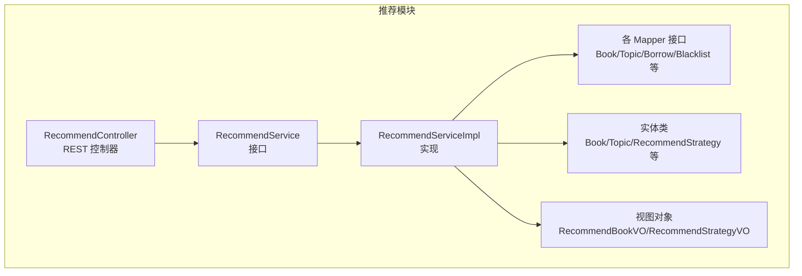
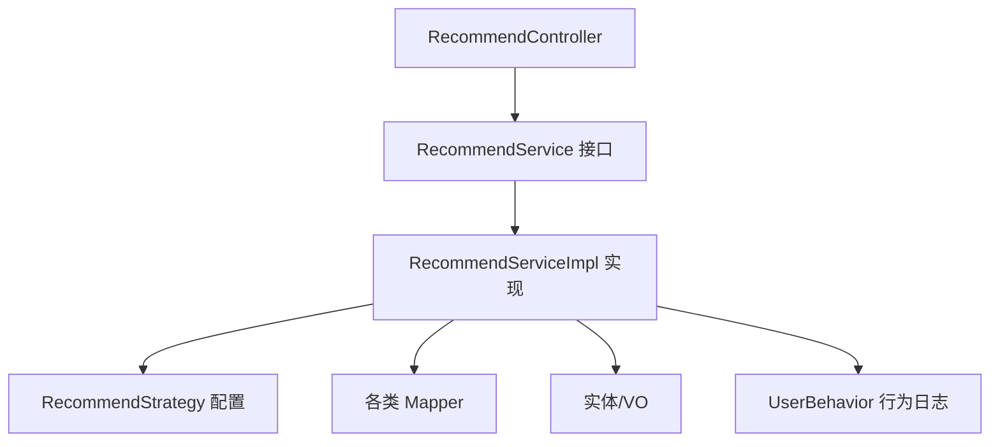
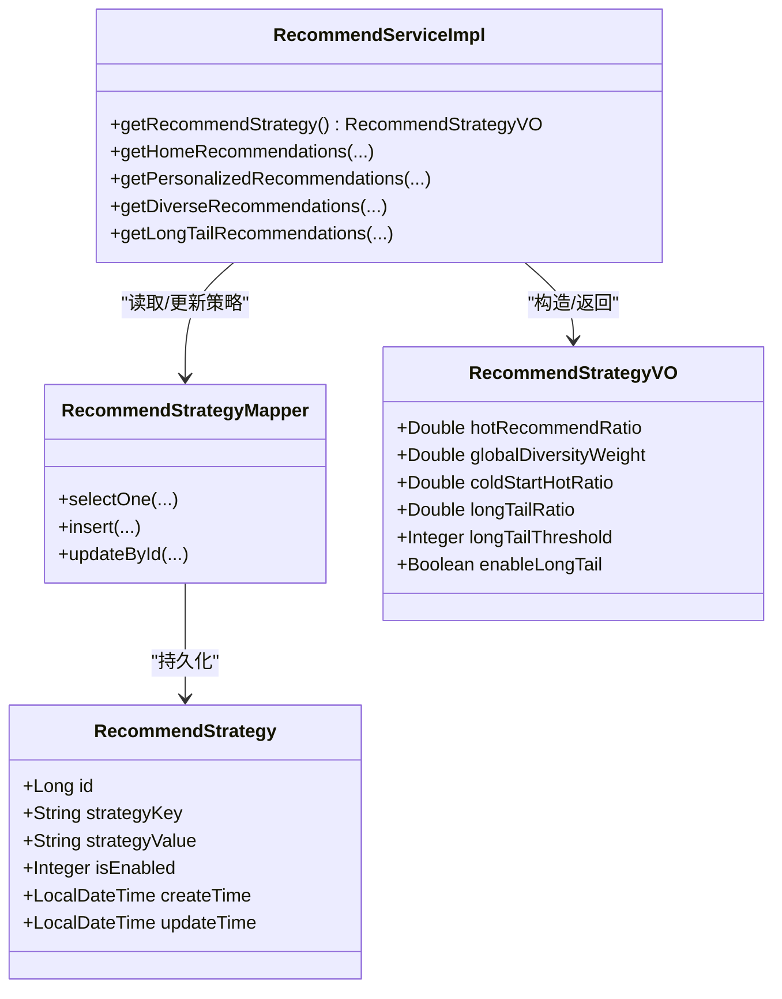
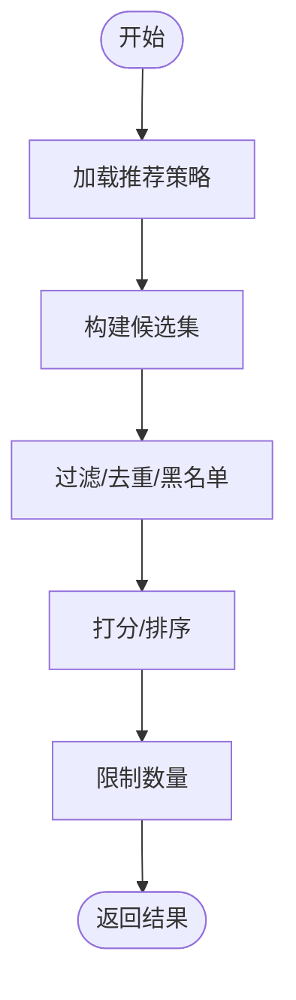
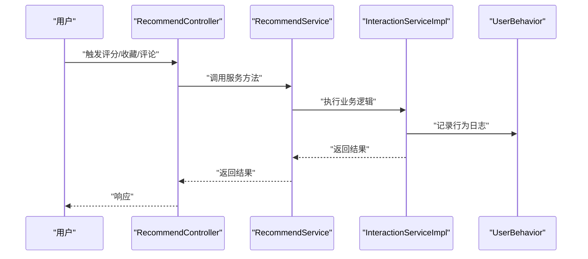
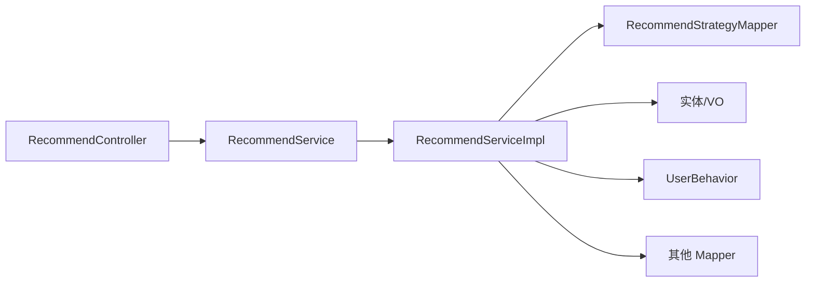

# 设计模式应用

<cite>
**本文引用的文件**
- [RecommendService.java](file://src/main/java/org/example/backend/modules/recommend/service/RecommendService.java)
- [RecommendServiceImpl.java](file://src/main/java/org/example/backend/modules/recommend/service/impl/RecommendServiceImpl.java)
- [RecommendController.java](file://src/main/java/org/example/backend/modules/recommend/controller/RecommendController.java)
- [RecommendStrategy.java](file://src/main/java/org/example/backend/entity/RecommendStrategy.java)
- [RecommendStrategyMapper.java](file://src/main/java/org/example/backend/modules/recommend/repository/RecommendStrategyMapper.java)
- [RecommendStrategyVO.java](file://src/main/java/org/example/backend/vo/admin/RecommendStrategyVO.java)
- [UserBehavior.java](file://src/main/java/org/example/backend/entity/UserBehavior.java)
- [InteractionServiceImpl.java](file://src/main/java/org/example/backend/modules/interaction/service/impl/InteractionServiceImpl.java)
- [application.yml](file://src/main/resources/application.yml)
- [Constants.java](file://src/main/java/org/example/backend/common/constants/Constants.java)
- [data_library126_db.sql](file://src/main/resources/data_library126_db.sql)
</cite>

## 目录
1. [引言](#引言)
2. [项目结构](#项目结构)
3. [核心组件](#核心组件)
4. [架构总览](#架构总览)
5. [详细组件分析](#详细组件分析)
6. [依赖关系分析](#依赖关系分析)
7. [性能考量](#性能考量)
8. [故障排查指南](#故障排查指南)
9. [结论](#结论)
10. [附录](#附录)

## 引言
本文件面向智能图书推荐系统，系统性梳理并解析项目中设计模式的应用现状与实践价值，重点覆盖以下方面：
- 工厂模式：在推荐算法工厂中的应用
- 策略模式：在不同推荐算法切换中的使用
- 模板方法模式：在业务流程标准化中的体现
- 观察者模式：在用户行为监控中的应用

同时，结合具体代码路径与实现细节，解释每种设计模式的实现方式、优缺点、适用场景，并阐述其在提升代码可扩展性、可维护性与可测试性方面的贡献，以及在推荐系统中的特殊考虑。

## 项目结构
后端采用标准的分层架构：控制层（Controller）、服务层（Service）、数据访问层（Repository/DAO）与领域模型（Entity/VO）。推荐模块位于 modules/recommend 下，包含控制器、服务接口与实现、仓库接口及实体/视图对象；策略配置通过 RecommendStrategy 实体与 Mapper 管理，支持运行时动态调整推荐参数。

图表来源
- [RecommendController.java](file://src/main/java/org/example/backend/modules/recommend/controller/RecommendController.java#L1-L130)
- [RecommendService.java](file://src/main/java/org/example/backend/modules/recommend/service/RecommendService.java#L1-L70)
- [RecommendServiceImpl.java](file://src/main/java/org/example/backend/modules/recommend/service/impl/RecommendServiceImpl.java#L1-L927)

章节来源
- [RecommendController.java](file://src/main/java/org/example/backend/modules/recommend/controller/RecommendController.java#L1-L130)
- [RecommendService.java](file://src/main/java/org/example/backend/modules/recommend/service/RecommendService.java#L1-L70)
- [RecommendServiceImpl.java](file://src/main/java/org/example/backend/modules/recommend/service/impl/RecommendServiceImpl.java#L1-L927)

## 核心组件
- 推荐服务接口与实现：提供首页推荐、热门榜、新书、相似图书、关联阅读、长尾推荐、曝光/点击/反馈记录与热门主题等能力，统一抽象与实现分离，便于扩展与替换。
- 策略配置：RecommendStrategy 实体与 Mapper 提供策略键值对的持久化存储，支持热启动与运行时调整，体现“策略模式”的配置层。
- 控制器：RecommendController 作为入口，负责参数解析、上下文注入与响应封装，调用 RecommendService 完成业务处理。
- 用户行为与交互：UserBehavior 实体与 InteractionServiceImpl 记录评分、收藏、评论等行为，支撑推荐效果评估与召回优化。

章节来源
- [RecommendService.java](file://src/main/java/org/example/backend/modules/recommend/service/RecommendService.java#L1-L70)
- [RecommendServiceImpl.java](file://src/main/java/org/example/backend/modules/recommend/service/impl/RecommendServiceImpl.java#L1-L927)
- [RecommendStrategy.java](file://src/main/java/org/example/backend/entity/RecommendStrategy.java#L1-L54)
- [RecommendStrategyMapper.java](file://src/main/java/org/example/backend/modules/recommend/repository/RecommendStrategyMapper.java#L1-L14)
- [RecommendStrategyVO.java](file://src/main/java/org/example/backend/vo/admin/RecommendStrategyVO.java#L1-L42)
- [RecommendController.java](file://src/main/java/org/example/backend/modules/recommend/controller/RecommendController.java#L1-L130)
- [UserBehavior.java](file://src/main/java/org/example/backend/entity/UserBehavior.java#L1-L51)
- [InteractionServiceImpl.java](file://src/main/java/org/example/backend/modules/interaction/service/impl/InteractionServiceImpl.java#L1-L340)

## 架构总览
推荐系统遵循“接口隔离 + 实现解耦 + 配置驱动”的设计思路。控制器仅依赖接口，服务实现聚合多个仓库与实体，策略通过配置表动态生效，形成“策略模式 + 配置中心”的组合。

图表来源
- [RecommendController.java](file://src/main/java/org/example/backend/modules/recommend/controller/RecommendController.java#L1-L130)
- [RecommendService.java](file://src/main/java/org/example/backend/modules/recommend/service/RecommendService.java#L1-L70)
- [RecommendServiceImpl.java](file://src/main/java/org/example/backend/modules/recommend/service/impl/RecommendServiceImpl.java#L1-L927)
- [RecommendStrategy.java](file://src/main/java/org/example/backend/entity/RecommendStrategy.java#L1-L54)
- [UserBehavior.java](file://src/main/java/org/example/backend/entity/UserBehavior.java#L1-L51)

## 详细组件分析

### 工厂模式：推荐算法工厂
- 现状与定位
  - 当前实现中，推荐算法并非以“工厂 + 多实现”的形式显式出现，而是通过策略配置与多段式流程组合实现“算法切换”效果。例如首页推荐流程根据是否新用户、是否启用长尾策略、多样性权重等条件分支执行不同子流程。
  - 若需引入“算法工厂”，可在现有 RecommendServiceImpl 的基础上抽象出算法接口与工厂类，将“个性化/多样性/长尾/冷启动”等算法封装为独立实现，由工厂按策略键选择对应算法实例，从而实现“算法可插拔”。

- 优势
  - 解耦算法与调用方，便于新增/替换算法。
  - 支持A/B实验与灰度发布，按用户/流量维度选择算法。

- 劣势
  - 增加类数量与复杂度，需要完善的注册与路由机制。

- 适用场景
  - 推荐算法种类较多、需要灵活切换与灰度。
  - 需要统一的算法生命周期管理与监控。

- 代码路径参考
  - 首页推荐主流程：[getHomeRecommendations(...)](file://src/main/java/org/example/backend/modules/recommend/service/impl/RecommendServiceImpl.java#L94-L188)
  - 策略加载与回退：[getRecommendStrategy()](file://src/main/java/org/example/backend/modules/recommend/service/impl/RecommendServiceImpl.java#L417-L479)

章节来源
- [RecommendServiceImpl.java](file://src/main/java/org/example/backend/modules/recommend/service/impl/RecommendServiceImpl.java#L94-L188)
- [RecommendServiceImpl.java](file://src/main/java/org/example/backend/modules/recommend/service/impl/RecommendServiceImpl.java#L417-L479)

### 策略模式：不同推荐算法切换
- 现状与定位
  - 项目通过 RecommendStrategy 实体与 RecommendStrategyMapper 存储策略键值，如“热门推荐比例”“全局多样性权重”“冷启动热门推荐比例”“长尾推荐比例/阈值/开关”等。RecommendServiceImpl 在运行时读取这些策略，决定各子流程的权重与阈值，达到“算法切换”的目的。
  - RecommendStrategyVO 作为配置传输对象，AdminServiceImpl 中进行策略更新与持久化。

- 优势
  - 无需修改代码即可调整推荐行为，降低变更风险。
  - 支持多维度权重与阈值的组合，满足A/B实验需求。

- 劣势
  - 策略键命名与取值规范需统一，避免歧义。
  - 需要完善的策略校验与回退逻辑，防止异常配置导致推荐质量下降。

- 适用场景
  - 推荐策略频繁调整、需要快速验证效果。
  - 不同场景（首页、长尾、新书）需要差异化权重。

- 代码路径参考
  - 策略实体与映射：[RecommendStrategy.java](file://src/main/java/org/example/backend/entity/RecommendStrategy.java#L1-L54)，[RecommendStrategyMapper.java](file://src/main/java/org/example/backend/modules/recommend/repository/RecommendStrategyMapper.java#L1-L14)
  - 策略读取与回退：[getRecommendStrategy()](file://src/main/java/org/example/backend/modules/recommend/service/impl/RecommendServiceImpl.java#L417-L479)
  - 策略配置VO：[RecommendStrategyVO.java](file://src/main/java/org/example/backend/vo/admin/RecommendStrategyVO.java#L1-L42)

图表来源
- [RecommendStrategy.java](file://src/main/java/org/example/backend/entity/RecommendStrategy.java#L1-L54)
- [RecommendStrategyMapper.java](file://src/main/java/org/example/backend/modules/recommend/repository/RecommendStrategyMapper.java#L1-L14)
- [RecommendStrategyVO.java](file://src/main/java/org/example/backend/vo/admin/RecommendStrategyVO.java#L1-L42)
- [RecommendServiceImpl.java](file://src/main/java/org/example/backend/modules/recommend/service/impl/RecommendServiceImpl.java#L417-L479)

章节来源
- [RecommendStrategy.java](file://src/main/java/org/example/backend/entity/RecommendStrategy.java#L1-L54)
- [RecommendStrategyMapper.java](file://src/main/java/org/example/backend/modules/recommend/repository/RecommendStrategyMapper.java#L1-L14)
- [RecommendStrategyVO.java](file://src/main/java/org/example/backend/vo/admin/RecommendStrategyVO.java#L1-L42)
- [RecommendServiceImpl.java](file://src/main/java/org/example/backend/modules/recommend/service/impl/RecommendServiceImpl.java#L417-L479)

### 模板方法模式：业务流程标准化
- 现状与定位
  - RecommendServiceImpl 的多个推荐方法（如 getHomeRecommendations、getPersonalizedRecommendations、getDiverseRecommendations、getLongTailRecommendations）遵循相似的流程：加载策略/黑名单 → 构建候选集 → 过滤/去重 → 排序/打分 → 限制数量 → 返回结果。这种“骨架固定、步骤可替换”的特征，天然具备模板方法模式的潜力。
  - 若引入模板方法，可将公共流程抽取为模板方法，将“候选构建/过滤/排序/打分”等步骤抽象为可覆写的钩子，实现“流程标准化 + 算法可插拔”。

- 优势
  - 保证流程一致性，减少重复代码。
  - 易于扩展新的推荐场景，只需实现钩子。

- 劣势
  - 对流程差异较大的场景可能过度抽象，增加复杂度。

- 适用场景
  - 推荐流程稳定、仅算法细节可变的场景。

- 代码路径参考
  - 首页推荐主流程：[getHomeRecommendations(...)](file://src/main/java/org/example/backend/modules/recommend/service/impl/RecommendServiceImpl.java#L94-L188)
  - 个性化/多样性/长尾等子流程：[getPersonalizedRecommendations(...)](file://src/main/java/org/example/backend/modules/recommend/service/impl/RecommendServiceImpl.java#L216-L314)，[getDiverseRecommendations(...)](file://src/main/java/org/example/backend/modules/recommend/service/impl/RecommendServiceImpl.java#L319-L382)，[getLongTailRecommendations(...)](file://src/main/java/org/example/backend/modules/recommend/service/impl/RecommendServiceImpl.java#L387-L412)

图表来源
- [RecommendServiceImpl.java](file://src/main/java/org/example/backend/modules/recommend/service/impl/RecommendServiceImpl.java#L94-L188)
- [RecommendServiceImpl.java](file://src/main/java/org/example/backend/modules/recommend/service/impl/RecommendServiceImpl.java#L216-L314)
- [RecommendServiceImpl.java](file://src/main/java/org/example/backend/modules/recommend/service/impl/RecommendServiceImpl.java#L319-L382)
- [RecommendServiceImpl.java](file://src/main/java/org/example/backend/modules/recommend/service/impl/RecommendServiceImpl.java#L387-L412)

章节来源
- [RecommendServiceImpl.java](file://src/main/java/org/example/backend/modules/recommend/service/impl/RecommendServiceImpl.java#L94-L188)
- [RecommendServiceImpl.java](file://src/main/java/org/example/backend/modules/recommend/service/impl/RecommendServiceImpl.java#L216-L314)
- [RecommendServiceImpl.java](file://src/main/java/org/example/backend/modules/recommend/service/impl/RecommendServiceImpl.java#L319-L382)
- [RecommendServiceImpl.java](file://src/main/java/org/example/backend/modules/recommend/service/impl/RecommendServiceImpl.java#L387-L412)

### 观察者模式：用户行为监控
- 现状与定位
  - 项目通过 UserBehavior 实体记录用户浏览、收藏、评分、借阅等行为，InteractionServiceImpl 在关键操作后调用 logBehavior 记录行为日志，形成“事件产生 → 事件记录 → 后续分析”的观察链路。
  - 当前为同步记录，若未来需要异步通知、多订阅者（如埋点上报、实时风控、召回优化）等，可引入事件总线或消息队列，实现真正的观察者模式。

- 优势
  - 行为数据可用于离线/在线特征工程，支撑推荐与风控。
  - 便于扩展多种订阅者，解耦事件产生与消费。

- 劣势
  - 异步化会带来一致性与可靠性挑战。
  - 订阅者过多可能影响主流程性能。

- 适用场景
  - 需要多维度行为分析与实时/准实时响应。

- 代码路径参考
  - 行为实体：[UserBehavior.java](file://src/main/java/org/example/backend/entity/UserBehavior.java#L1-L51)
  - 行为记录（评分/收藏/评论等）：[InteractionServiceImpl.rate(...)](file://src/main/java/org/example/backend/modules/interaction/service/impl/InteractionServiceImpl.java#L61-L95)，[InteractionServiceImpl.toggleFavorite(...)](file://src/main/java/org/example/backend/modules/interaction/service/impl/InteractionServiceImpl.java#L99-L134)，[InteractionServiceImpl.addComment(...)](file://src/main/java/org/example/backend/modules/interaction/service/impl/InteractionServiceImpl.java#L138-L154)
  - 用户行为日志表结构与示例数据：[data_library126_db.sql](file://src/main/resources/data_library126_db.sql#L941-L971)

图表来源
- [RecommendController.java](file://src/main/java/org/example/backend/modules/recommend/controller/RecommendController.java#L1-L130)
- [InteractionServiceImpl.java](file://src/main/java/org/example/backend/modules/interaction/service/impl/InteractionServiceImpl.java#L61-L95)
- [UserBehavior.java](file://src/main/java/org/example/backend/entity/UserBehavior.java#L1-L51)

章节来源
- [UserBehavior.java](file://src/main/java/org/example/backend/entity/UserBehavior.java#L1-L51)
- [InteractionServiceImpl.java](file://src/main/java/org/example/backend/modules/interaction/service/impl/InteractionServiceImpl.java#L61-L95)
- [InteractionServiceImpl.java](file://src/main/java/org/example/backend/modules/interaction/service/impl/InteractionServiceImpl.java#L99-L134)
- [InteractionServiceImpl.java](file://src/main/java/org/example/backend/modules/interaction/service/impl/InteractionServiceImpl.java#L138-L154)
- [data_library126_db.sql](file://src/main/resources/data_library126_db.sql#L941-L971)

## 依赖关系分析
- 控制器依赖服务接口，服务实现依赖多个仓库与实体，策略通过 Mapper 读取/更新，形成清晰的单向依赖。
- 策略配置与运行时参数耦合，确保推荐行为可配置、可追踪。
- 用户行为日志与交互服务耦合，支撑推荐效果评估与召回优化。

图表来源
- [RecommendController.java](file://src/main/java/org/example/backend/modules/recommend/controller/RecommendController.java#L1-L130)
- [RecommendService.java](file://src/main/java/org/example/backend/modules/recommend/service/RecommendService.java#L1-L70)
- [RecommendServiceImpl.java](file://src/main/java/org/example/backend/modules/recommend/service/impl/RecommendServiceImpl.java#L1-L927)
- [RecommendStrategyMapper.java](file://src/main/java/org/example/backend/modules/recommend/repository/RecommendStrategyMapper.java#L1-L14)
- [UserBehavior.java](file://src/main/java/org/example/backend/entity/UserBehavior.java#L1-L51)

章节来源
- [RecommendController.java](file://src/main/java/org/example/backend/modules/recommend/controller/RecommendController.java#L1-L130)
- [RecommendService.java](file://src/main/java/org/example/backend/modules/recommend/service/RecommendService.java#L1-L70)
- [RecommendServiceImpl.java](file://src/main/java/org/example/backend/modules/recommend/service/impl/RecommendServiceImpl.java#L1-L927)
- [RecommendStrategyMapper.java](file://src/main/java/org/example/backend/modules/recommend/repository/RecommendStrategyMapper.java#L1-L14)
- [UserBehavior.java](file://src/main/java/org/example/backend/entity/UserBehavior.java#L1-L51)

## 性能考量
- 策略读取与回退：RecommendServiceImpl 在策略读取失败时使用默认值，避免异常导致的全链路阻塞，但需注意默认值合理性与监控告警。
- 分页与限制：多处使用 LIMIT 限制候选规模，建议配合索引与复合索引优化查询性能。
- 黑名单与去重：使用 Set 去重，注意大数据量下的内存占用与查找效率。
- 异步化：用户行为记录目前为同步，建议引入异步写入或消息队列，降低对主流程的影响。
- 缓存：可对热点策略与热门图书列表进行缓存，减少数据库压力。

## 故障排查指南
- 策略配置异常
  - 现象：推荐比例/权重异常或推荐结果不符合预期。
  - 排查：检查 recommend_strategy 表中对应策略键值是否正确，确认 isEnabled 字段与策略值类型。
  - 参考路径：[RecommendStrategy.java](file://src/main/java/org/example/backend/entity/RecommendStrategy.java#L1-L54)，[RecommendServiceImpl.getRecommendStrategy()](file://src/main/java/org/example/backend/modules/recommend/service/impl/RecommendServiceImpl.java#L417-L479)

- 推荐结果为空
  - 现象：首页/长尾/相似推荐为空。
  - 排查：检查黑名单、状态过滤、阈值设置、借阅记录与偏好数据是否充足。
  - 参考路径：[RecommendServiceImpl.loadBlacklistedBookIds()](file://src/main/java/org/example/backend/modules/recommend/service/impl/RecommendServiceImpl.java#L724-L750)，[RecommendServiceImpl.isColdStartUser()](file://src/main/java/org/example/backend/modules/recommend/service/impl/RecommendServiceImpl.java#L193-L211)

- 用户行为日志缺失
  - 现象：行为分析报表为空或延迟。
  - 排查：确认 InteractionServiceImpl 是否正常调用 logBehavior，检查 user_behaviors 表写入情况。
  - 参考路径：[InteractionServiceImpl.rate()](file://src/main/java/org/example/backend/modules/interaction/service/impl/InteractionServiceImpl.java#L61-L95)，[data_library126_db.sql](file://src/main/resources/data_library126_db.sql#L941-L971)

章节来源
- [RecommendStrategy.java](file://src/main/java/org/example/backend/entity/RecommendStrategy.java#L1-L54)
- [RecommendServiceImpl.java](file://src/main/java/org/example/backend/modules/recommend/service/impl/RecommendServiceImpl.java#L417-L479)
- [RecommendServiceImpl.java](file://src/main/java/org/example/backend/modules/recommend/service/impl/RecommendServiceImpl.java#L724-L750)
- [RecommendServiceImpl.java](file://src/main/java/org/example/backend/modules/recommend/service/impl/RecommendServiceImpl.java#L193-L211)
- [InteractionServiceImpl.java](file://src/main/java/org/example/backend/modules/interaction/service/impl/InteractionServiceImpl.java#L61-L95)
- [data_library126_db.sql](file://src/main/resources/data_library126_db.sql#L941-L971)

## 结论
- 项目在“策略配置 + 多流程组合”的基础上，天然体现了策略模式与模板方法模式的雏形，具备良好的可扩展性与可维护性。
- 工厂模式尚未显式落地，但可通过抽象算法接口与工厂类进一步增强“算法可插拔”能力。
- 观察者模式在用户行为监控方面已有基础实现，建议引入异步化与事件总线，以支撑更复杂的订阅场景。
- 建议在保持现有稳定流程的同时，逐步引入工厂与观察者模式，以应对推荐系统持续演进的需求。

## 附录
- 配置与环境
  - 应用配置：[application.yml](file://src/main/resources/application.yml#L1-L71)
  - 系统常量：[Constants.java](file://src/main/java/org/example/backend/common/constants/Constants.java#L1-L79)
  - 策略表结构与示例数据：[data_library126_db.sql](file://src/main/resources/data_library126_db.sql#L793-L809)，[data_library126_db.sql](file://src/main/resources/data_library126_db.sql#L941-L971)